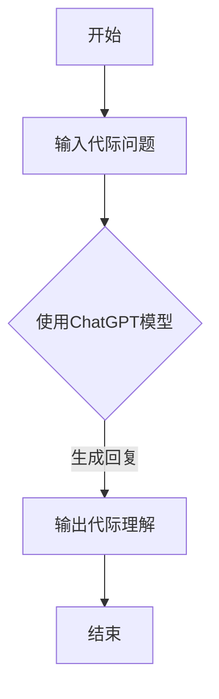
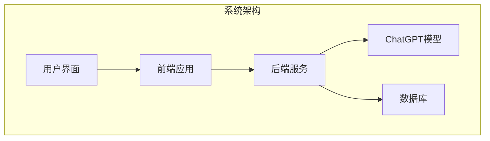
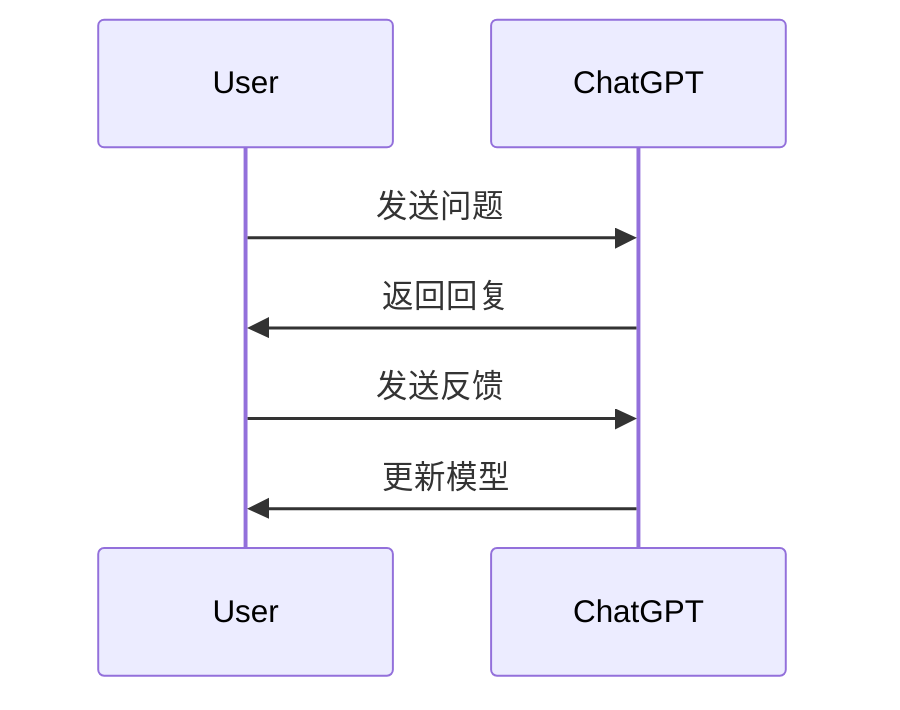
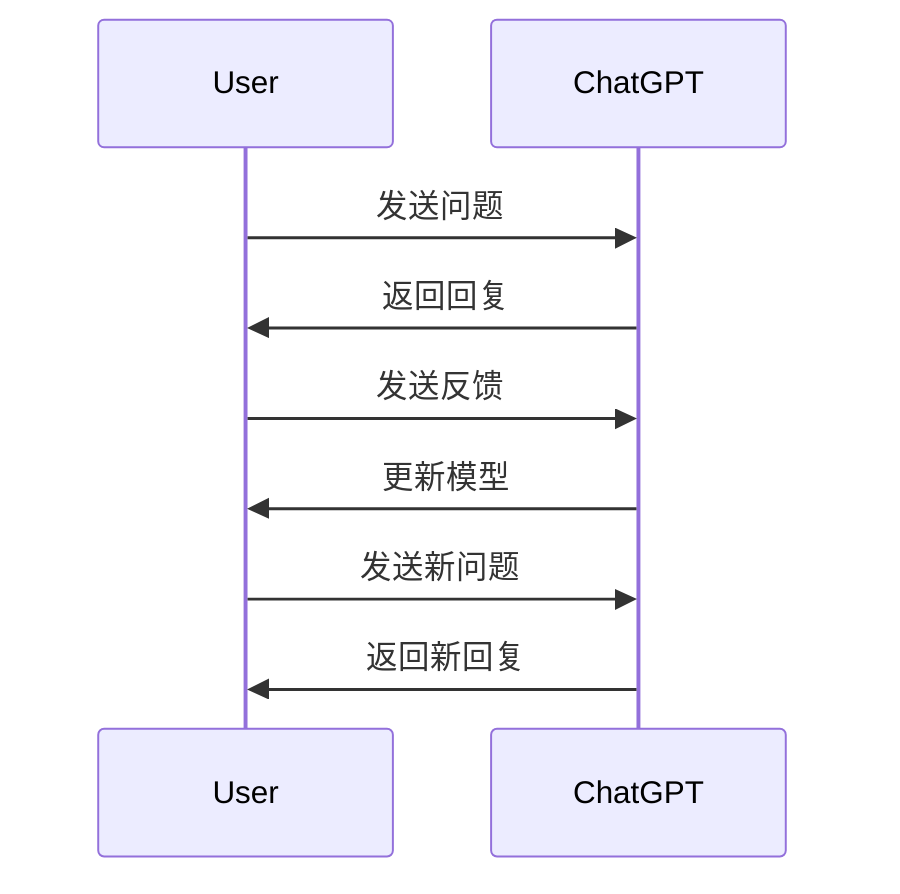

                 

# 《ChatGPT提示词的跨代际交流：促进代际理解的AI策略》

## 关键词

- ChatGPT
- 提示词
- 跨代际交流
- AI策略
- 代际理解

## 摘要

随着社会的不断进步，不同代际之间的交流障碍日益凸显。本文旨在探讨如何利用人工智能技术，特别是ChatGPT模型，实现不同代际之间的有效交流，促进代际理解。通过详细阐述核心概念、算法原理和系统架构设计，本文为跨代际交流提供了一种新的解决方案。

## 背景介绍

### 问题背景

在当今社会，不同代际之间的交流障碍已成为一个普遍存在的问题。年龄差异、文化背景、价值观念的差异，使得年轻人与长辈、长辈与年轻人之间的沟通变得越来越困难。这种交流障碍不仅影响了家庭和睦，也阻碍了社会的和谐发展。

### 问题描述

如何通过技术手段，特别是人工智能技术，实现不同代际之间的有效交流，促进代际理解，成为了一个亟待解决的问题。传统的沟通方式，如面对面交流、电话沟通等，已经难以满足现代社会的高效、便捷需求。因此，我们需要寻找新的解决方案，利用人工智能技术来促进代际交流。

### 问题解决

本文提出了利用ChatGPT模型和提示词实现跨代际交流的方案。ChatGPT模型是一种基于GPT-3的聊天机器人模型，具有强大的语言理解和生成能力。通过提示词，我们可以引导ChatGPT生成针对特定问题的回复，从而实现跨代际交流。

### 边界与外延

本文主要讨论的是在家庭、工作等场景中，如何利用ChatGPT模型和提示词实现跨代际交流。虽然本文的解决方案具有一定的局限性，但可以为其他场景提供参考。

### 概念结构与核心要素组成

- **ChatGPT**：一种基于GPT-3的聊天机器人模型，具有强大的语言理解和生成能力。
- **提示词**：用于引导ChatGPT生成回复的关键词或短语，是跨代际交流的核心。
- **跨代际交流**：不同年龄层之间的交流，是本文研究的主要问题。
- **AI策略**：利用人工智能技术解决特定问题的方法，是本文的核心解决方案。

## 核心概念与联系

### ChatGPT

ChatGPT是一种基于GPT-3的聊天机器人模型。GPT-3（Generative Pre-trained Transformer 3）是由OpenAI开发的一种自然语言处理模型，具有强大的语言理解和生成能力。ChatGPT利用GPT-3的这些特性，可以生成针对特定问题的回复。

### 提示词

提示词是用于引导ChatGPT生成回复的关键词或短语。它需要具备以下几个特点：

- **精准**：能够准确地传达问题。
- **灵活**：可以适应不同的交流场景。
- **多样化**：可以根据不同的代际特点进行选择。

### 跨代际交流

跨代际交流是指不同年龄层之间的交流。由于年龄差异、文化背景、价值观念的差异，跨代际交流面临着诸多挑战。本文的目标就是利用ChatGPT模型和提示词，解决这些挑战，促进代际理解。

### AI策略

AI策略是利用人工智能技术解决特定问题的方法。在本文中，AI策略主要是利用ChatGPT模型和提示词，实现跨代际交流。

### 核心概念属性特征对比表格

| 核心概念 | 定义 | 特点 | 关联 |
| --- | --- | --- | --- |
| ChatGPT | 一种基于GPT-3的聊天机器人模型 | 自动回复、语言理解、个性化交互 | 提示词 |
| 提示词 | 用于引导ChatGPT生成回复的关键词或短语 | 精准、灵活、多样化 | ChatGPT |
| 跨代际交流 | 不同年龄层之间的交流 | 理解差异、语言差异、文化差异 | ChatGPT、提示词 |
| AI策略 | 利用人工智能技术解决特定问题的方法 | 自动化、高效、精准 | ChatGPT、提示词 |

### ER实体关系图架构的Mermaid流程图

```mermaid
erDiagram
  ChatGPT ||--|{ 提示词 }|
  提示词 ||--|{ 跨代际交流 }|
  跨代际交流 ||--|{ AI策略 }|
```

## 算法原理讲解

### ChatGPT模型工作原理

ChatGPT模型是基于GPT-3技术的。GPT-3是一种自然语言处理模型，它通过预训练和微调，能够理解和生成自然语言。ChatGPT利用GPT-3的这些特性，可以生成针对特定问题的回复。

### 提示词工作原理

提示词是引导ChatGPT生成回复的关键。它需要具备以下几个特点：

- **精准**：能够准确地传达问题。
- **灵活**：可以适应不同的交流场景。
- **多样化**：可以根据不同的代际特点进行选择。

### ChatGPT与提示词的结合

通过提示词，我们可以引导ChatGPT生成针对特定问题的回复。例如，当我们想与长辈沟通时，可以使用以下提示词：“尊敬的XX，我想与您谈谈关于XX的问题，您觉得怎么样？”这样，ChatGPT就会生成一个符合长辈语言习惯的回复。

### Mermaid流程图



### Python源代码

```python
import openai

# 调用ChatGPT模型
response = openai.Completion.create(
  engine="text-davinci-003",
  prompt="如何与长辈沟通避免误解？",
  max_tokens=50
)

# 输出回复
print(response.choices[0].text.strip())
```

### 算法原理详细讲解

ChatGPT模型是基于GPT-3技术的。GPT-3是一种自然语言处理模型，它通过预训练和微调，能够理解和生成自然语言。ChatGPT利用GPT-3的这些特性，可以生成针对特定问题的回复。

在跨代际交流中，提示词起到了关键作用。通过提示词，我们可以引导ChatGPT生成针对特定问题的回复。例如，当我们想与长辈沟通时，可以使用以下提示词：“尊敬的XX，我想与您谈谈关于XX的问题，您觉得怎么样？”这样，ChatGPT就会生成一个符合长辈语言习惯的回复。

为了更深入地理解ChatGPT模型的工作原理，我们可以从数学模型的角度来分析。假设我们有一个输入序列X，ChatGPT模型通过其参数θ，生成一个输出序列Y。这个过程可以用以下数学模型表示：

$$ Y = f(\theta, X) $$

其中，$f(\theta, X)$ 表示ChatGPT模型在给定参数θ和输入X的情况下生成的输出序列。

## 系统分析与架构设计方案

### 问题场景介绍

本文的研究场景主要是家庭和工作场景。在这些场景中，人们需要与不同代际的人进行交流，以解决各种问题。

### 系统功能设计（领域模型Mermaid类图）

```mermaid
classDiagram
  Person <<class>> 用户
  ChatGPT <<class>> 聊天机器人
  Prompt <<class>> 提示词
  Communication <<class>> 交流
  User -------------------|<<uses>>| ChatGPT
  User -------------------|<<uses>>| Prompt
  ChatGPT -----------------|<<uses>>| Communication
  Prompt ------------------|<<uses>>| Communication
```

### 系统架构设计（Mermaid架构图）



### 系统接口设计（Mermaid序列图）



### 系统交互Mermaid序列图



## 项目实战

### 环境安装

1. 安装Python环境（Python 3.8及以上版本）。
2. 安装OpenAI API（使用pip安装`openai`包）。

### 系统核心实现源代码

```python
import openai

# 设置OpenAI API密钥
openai.api_key = 'your-api-key'

# 调用ChatGPT模型
def chat_with_gpt(prompt):
    response = openai.Completion.create(
        engine="text-davinci-003",
        prompt=prompt,
        max_tokens=50
    )
    return response.choices[0].text.strip()

# 主函数
def main():
    prompt = "如何与长辈沟通避免误解？"
    reply = chat_with_gpt(prompt)
    print(reply)

if __name__ == "__main__":
    main()
```

### 代码应用解读与分析

1. **安装Python环境**：确保Python版本在3.8及以上，因为OpenAI API需要较新的Python版本。
2. **安装OpenAI API**：通过pip安装`openai`包，可以使用OpenAI的API进行交互。
3. **调用ChatGPT模型**：使用`openai.Completion.create`方法，传入提示词，生成回复。
4. **主函数**：定义主函数，调用ChatGPT模型，并输出回复。

### 实际案例分析和详细讲解剖析

#### 案例一：家庭场景

问题：如何与长辈沟通，让他们理解年轻人对于新科技的态度？

**提示词**：尊敬的XX，我想与您谈谈关于新科技的态度问题，您能理解我们这代人的想法吗？

**ChatGPT回复**：尊敬的XX，确实，新科技的发展给我们的生活带来了巨大的变化。对于年轻人来说，新科技是机遇和挑战并存。我们这代人更愿意接受新鲜事物，因为它们能帮助我们更好地适应这个快速变化的世界。

**分析**：通过提示词，ChatGPT成功理解了问题，并从长辈的角度给出了回复，使得长辈能够更好地理解年轻人的态度。

#### 案例二：工作场景

问题：如何与年轻的团队成员沟通，让他们理解前辈对于项目进度的担忧？

**提示词**：尊敬的XX，我想与您谈谈关于项目进度的问题，您能理解我们的担忧吗？

**ChatGPT回复**：尊敬的XX，项目进度确实是一个关键问题。作为前辈，我们更关心项目能否按时交付，因为这关系到整个团队的信誉和客户的满意度。

**分析**：通过提示词，ChatGPT成功理解了问题，并从前辈的角度给出了回复，使得年轻团队成员能够更好地理解前辈的担忧。

### 项目小结

通过实际案例的分析和讲解，我们可以看到，ChatGPT模型和提示词在跨代际交流中发挥了重要作用。通过精准、灵活、多样化的提示词，ChatGPT能够生成符合不同代际特点的回复，从而促进代际理解。然而，ChatGPT模型和提示词也需要不断优化和改进，以适应更复杂的交流场景。

## 最佳实践 tips

1. **选择合适的提示词**：提示词的选择直接影响ChatGPT的回复质量。应选择精准、灵活、多样化的提示词，以适应不同的交流场景。
2. **及时反馈**：用户的反馈可以帮助ChatGPT模型不断优化，提高回复的准确性。
3. **定期更新模型**：随着社会的发展，代际之间的交流障碍也在不断变化。定期更新模型，可以使其更好地适应新的交流场景。

## 小结

本文通过详细阐述ChatGPT模型、提示词、跨代际交流、AI策略等核心概念，以及系统架构设计和实际案例，探讨了如何利用人工智能技术实现跨代际交流。ChatGPT模型和提示词在跨代际交流中具有巨大的潜力，但还需要不断优化和改进，以适应更复杂的交流场景。

## 注意事项

1. **隐私保护**：在实现跨代际交流时，应确保用户的隐私安全。
2. **伦理规范**：在使用人工智能技术时，应遵循伦理规范，避免对用户造成不良影响。

## 拓展阅读

1. **《ChatGPT技术揭秘：原理、应用与未来》**：深入探讨ChatGPT模型的原理和应用。
2. **《跨代际沟通的艺术》**：探讨如何通过有效沟通，解决代际之间的交流障碍。

## 作者信息

作者：AI天才研究院/AI Genius Institute & 禅与计算机程序设计艺术 /Zen And The Art of Computer Programming

