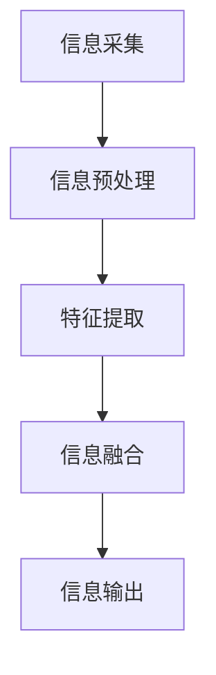
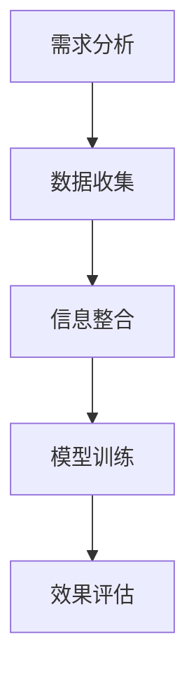
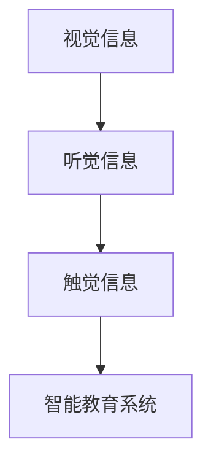
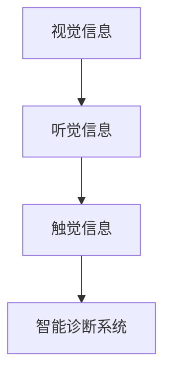
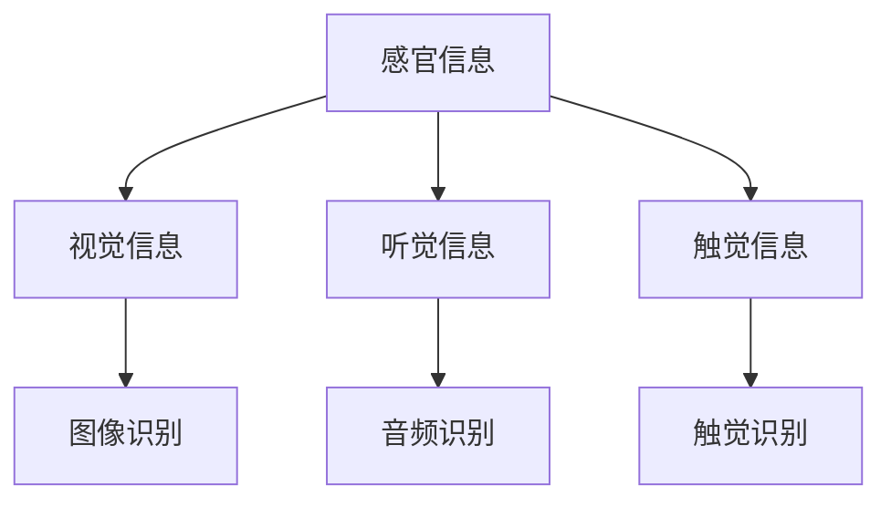
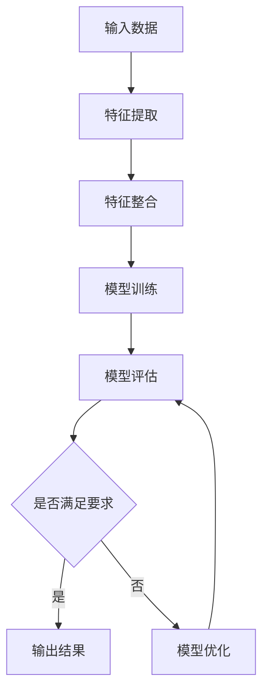
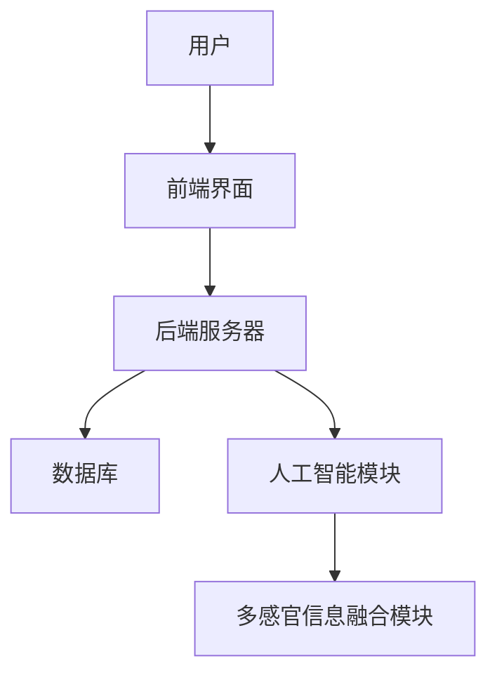
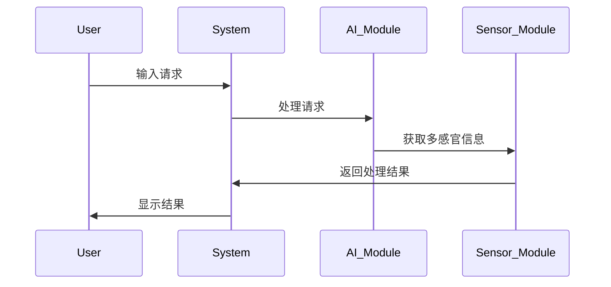

                 


### 文章标题

### ChatGPT提示词的跨感官协同设计新方法

### 文章关键词

- **ChatGPT 提示词**
- **跨感官协同设计**
- **人工智能**
- **感官信息处理**
- **教育领域**
- **医疗领域**
- **智能助手**

### 文章摘要

本文旨在探讨如何运用跨感官协同设计理念，为ChatGPT提示词提供一种全新的设计方法。文章首先介绍了跨感官协同设计的基本概念、原理及其在人工智能领域的重要性。接着，详细阐述了ChatGPT提示词的设计流程、方法及其在实际应用中的优势。随后，通过具体案例解析，展示了跨感官协同设计在教育、医疗和智能助手等领域的应用。最后，文章展望了跨感官协同设计在未来的发展趋势与挑战，并提出了相应的优化策略。

### 第一部分：跨感官协同设计概述

#### 第1章：问题背景与跨感官协同设计理念

##### 1.1 问题背景

在当今信息爆炸的时代，人工智能（AI）已经成为我们日常生活的重要组成部分。然而，现有的AI系统往往依赖于单一感官信息，如视觉、听觉或触觉，从而导致感官信息孤岛现象。这种现象使得AI系统在处理复杂任务时，难以充分利用各种感官的信息，限制了其智能化水平。

##### 1.2 跨感官协同设计的概念与重要性

跨感官协同设计是一种将多种感官信息整合起来，以实现更高效、更智能的信息处理的方法。通过跨感官协同设计，AI系统能够从多个角度获取和处理信息，从而提高其识别、理解和决策能力。在人工智能领域，跨感官协同设计具有显著的重要性，因为它能够提升AI系统的智能化水平和应用范围。

##### 1.3 跨感官协同设计的研究现状与趋势

当前，跨感官协同设计已经成为人工智能领域的一个研究热点。国内外学者在跨感官协同设计的理论基础、方法和技术等方面进行了大量研究。尽管取得了一定的成果，但仍存在诸多挑战，如跨感官信息的融合、处理和传输等。未来，随着技术的不断进步，跨感官协同设计有望在更多领域得到应用，并成为人工智能发展的关键驱动力。

### 第二部分：核心概念与原理

#### 第2章：核心概念与原理

##### 2.1 ChatGPT提示词的概念

ChatGPT提示词是指用于引导ChatGPT模型生成文本的关键词或短语。这些提示词可以基于用户的输入，或者由设计者预设，用于引导模型生成具有特定主题、风格或信息的文本。

##### 2.2 跨感官协同设计的核心原理

跨感官协同设计的核心原理在于将多种感官信息进行整合和处理，以实现更高效的信息处理。具体来说，跨感官协同设计包括以下几个关键步骤：

1. **信息采集**：通过多种感官（如视觉、听觉、触觉等）获取信息。
2. **信息整合**：将不同感官的信息进行整合，形成一个统一的信息框架。
3. **信息处理**：利用AI技术对整合后的信息进行处理，以提取关键特征和模式。
4. **信息输出**：将处理后的信息以适当的形式输出，如文本、图像、声音等。

##### 2.3 跨感官协同设计的特征与优势

跨感官协同设计具有以下特征和优势：

1. **多元感知**：通过整合多种感官信息，实现更全面、更准确的信息感知。
2. **高效处理**：利用AI技术对多种感官信息进行处理，提高信息处理效率。
3. **智能化决策**：通过跨感官协同设计，AI系统能够在复杂环境下做出更智能的决策。
4. **应用广泛**：跨感官协同设计适用于多种领域，如教育、医疗、智能助手等。

### 第三部分：ChatGPT提示词设计方法论

#### 第3章：设计流程与步骤

##### 3.1 设计流程概述

ChatGPT提示词的设计流程可以分为以下几个步骤：

1. **需求分析**：明确ChatGPT提示词的应用场景和需求。
2. **数据收集**：收集相关的感官信息数据。
3. **信息整合**：将多种感官信息进行整合。
4. **模型训练**：利用整合后的信息对ChatGPT模型进行训练。
5. **效果评估**：评估ChatGPT提示词的效果，并进行优化。

##### 3.2 设计步骤详解

1. **需求分析**：
   - **明确应用场景**：确定ChatGPT提示词将在哪些场景下使用。
   - **分析用户需求**：了解用户期望获取的信息类型和质量。

2. **数据收集**：
   - **视觉信息**：收集图像、视频等多媒体数据。
   - **听觉信息**：收集语音、音乐等多媒体数据。
   - **触觉信息**：收集触觉传感数据。

3. **信息整合**：
   - **数据预处理**：对收集到的数据进行预处理，如去噪、去冗余等。
   - **特征提取**：利用特征提取算法，从预处理后的数据中提取关键特征。
   - **整合**：将多种感官信息整合为一个统一的信息框架。

4. **模型训练**：
   - **模型选择**：选择合适的神经网络模型，如循环神经网络（RNN）、变换器（Transformer）等。
   - **训练**：利用整合后的信息对模型进行训练，以提高其性能。

5. **效果评估**：
   - **评估指标**：设定评估指标，如准确率、召回率等。
   - **评估方法**：采用交叉验证、混淆矩阵等方法对模型进行评估。

##### 3.3 设计工具与方法

1. **工具**：
   - **数据采集工具**：如摄像头、麦克风、触觉传感器等。
   - **数据处理工具**：如特征提取工具、机器学习工具等。
   - **模型训练工具**：如TensorFlow、PyTorch等。

2. **方法**：
   - **信息整合方法**：如多模态融合、注意力机制等。
   - **模型训练方法**：如迁移学习、增量学习等。

### 第四部分：感官协同设计案例解析

#### 第4章：感官协同设计案例解析

##### 4.1 案例一：教育领域

在教育领域，跨感官协同设计可以应用于智能教育系统，如智能教学助手、在线学习平台等。通过整合视觉、听觉、触觉等多感官信息，智能教育系统可以提供更加丰富、多样的学习体验，提高学生的学习效果。

1. **案例背景**：
   - **应用场景**：在线学习平台。
   - **用户需求**：提供丰富多样的学习资源，提高学习效果。

2. **感官协同设计**：
   - **视觉信息**：提供丰富的图像、视频等多媒体学习资源。
   - **听觉信息**：提供音频讲解、音乐背景等。
   - **触觉信息**：提供虚拟现实（VR）或增强现实（AR）体验。

3. **案例效果**：
   - **提高学习效果**：通过多感官信息整合，学生可以更加直观、深入地理解学习内容。
   - **提升学习兴趣**：多感官信息的应用，使学习过程更加生动有趣。

##### 4.2 案例二：医疗领域

在医疗领域，跨感官协同设计可以应用于智能诊断系统、健康监护系统等。通过整合多种感官信息，医疗系统能够更全面地了解病人的健康状况，提高诊断和治疗的准确性和效率。

1. **案例背景**：
   - **应用场景**：智能诊断系统。
   - **用户需求**：提供准确的诊断结果，提高治疗效率。

2. **感官协同设计**：
   - **视觉信息**：分析医学影像，如X光片、CT扫描等。
   - **听觉信息**：分析病人的语音、呼吸等生理信号。
   - **触觉信息**：通过触觉传感器获取病人的身体特征，如血压、心率等。

3. **案例效果**：
   - **提高诊断准确性**：通过整合多种感官信息，医疗系统可以更准确地诊断疾病。
   - **提高治疗效率**：基于准确的诊断结果，医生可以更有效地制定治疗方案。

##### 4.3 案例三：智能助手

在智能助手领域，跨感官协同设计可以应用于智能家居、智能客服等场景。通过整合多种感官信息，智能助手能够更好地理解用户需求，提供更加个性化和智能化的服务。

1. **案例背景**：
   - **应用场景**：智能家居。
   - **用户需求**：提供便捷的家居控制和管理。

2. **感官协同设计**：
   - **视觉信息**：通过摄像头监控家居环境，如灯光、温度等。
   - **听觉信息**：通过语音识别技术，理解用户语音指令。
   - **触觉信息**：通过智能家居设备，如智能音箱、智能门锁等，与用户进行交互。

3. **案例效果**：
   - **提升用户体验**：通过多感官信息整合，智能助手可以更准确地理解用户需求，提供更加个性化和智能化的服务。
   - **增强家居智能化**：智能助手可以自动调节家居设备，提高家居生活的舒适度和便捷性。

### 第五部分：跨感官协同设计的实施与优化

#### 第5章：实施策略

##### 5.1 实施策略概述

跨感官协同设计的实施策略主要包括以下几个方面：

1. **技术实施**：选择合适的技术和方法，实现跨感官协同设计。
2. **团队协作**：组建跨学科团队，协同工作，共同推进项目。
3. **用户参与**：邀请用户参与设计过程，收集用户反馈，优化设计。

##### 5.2 技术实施要点

1. **信息采集**：选择合适的传感器和采集设备，确保信息采集的准确性和可靠性。
2. **信息整合**：利用多模态融合技术，将多种感官信息整合为一个统一的信息框架。
3. **模型训练**：选择合适的机器学习模型，利用整合后的信息进行训练。
4. **效果评估**：设定评估指标，对系统性能进行评估。

##### 5.3 实施流程与步骤

1. **需求分析**：明确项目目标和需求。
2. **技术评估**：评估现有技术和方法，选择合适的解决方案。
3. **团队组建**：组建跨学科团队，明确分工和责任。
4. **原型设计**：设计系统原型，进行用户测试和反馈。
5. **系统集成**：将各个模块集成到一起，进行测试和优化。
6. **部署上线**：将系统部署到实际场景，进行应用。

### 第六部分：优化与评估

#### 第6章：优化与评估

##### 6.1 优化策略

为了提高跨感官协同设计的性能，可以采取以下优化策略：

1. **数据增强**：增加数据量，提高模型泛化能力。
2. **模型优化**：选择更适合的模型架构，提高模型性能。
3. **算法改进**：改进算法，提高信息整合和处理效率。
4. **用户反馈**：收集用户反馈，持续优化设计。

##### 6.2 评估指标与方法

1. **评估指标**：
   - **准确率**：模型预测结果与实际结果的一致性。
   - **召回率**：模型能够识别出的实际结果的比例。
   - **F1 分数**：准确率和召回率的加权平均。

2. **评估方法**：
   - **交叉验证**：将数据集划分为训练集和验证集，多次训练和验证，评估模型性能。
   - **混淆矩阵**：分析模型预测结果与实际结果的匹配情况。
   - **用户满意度**：收集用户反馈，评估系统性能和用户体验。

##### 6.3 优化实践案例分析

以教育领域为例，通过以下实践案例来展示优化策略：

1. **数据增强**：
   - **方法**：增加学习资源种类，如增加音频、视频等。
   - **效果**：提高学习效果，降低学习疲劳。

2. **模型优化**：
   - **方法**：选择更适合的教学模式，如基于Transformer的模型。
   - **效果**：提高学习效果，降低学习时间。

3. **算法改进**：
   - **方法**：改进多模态融合算法，提高信息整合效率。
   - **效果**：提高学习效果，降低系统延迟。

4. **用户反馈**：
   - **方法**：收集用户反馈，优化系统功能。
   - **效果**：提高用户满意度，增强系统稳定性。

### 第七部分：未来展望与挑战

#### 第7章：未来发展趋势与挑战

##### 7.1 未来发展趋势

随着人工智能技术的不断发展，跨感官协同设计在未来有望在更多领域得到应用，包括但不限于：

1. **智能家居**：通过跨感官协同设计，实现更智能、更便捷的家居生活。
2. **智能交通**：通过跨感官协同设计，提升交通系统的智能化水平。
3. **智能制造**：通过跨感官协同设计，提高生产过程的自动化和智能化。
4. **智慧城市**：通过跨感官协同设计，提升城市管理的效率和智能化水平。

##### 7.2 潜在挑战与应对策略

尽管跨感官协同设计具有巨大的潜力，但其在实际应用中仍面临诸多挑战：

1. **技术挑战**：跨感官信息整合和处理技术尚不成熟，需要进一步研究。
2. **隐私保护**：跨感官协同设计涉及多种个人信息，需要确保数据安全和隐私保护。
3. **成本问题**：跨感官协同设计需要多种传感器和设备支持，成本较高。

针对上述挑战，可以采取以下应对策略：

1. **技术创新**：加大对跨感官协同设计技术的研究力度，提高技术成熟度。
2. **法规制定**：制定相关法规，确保个人信息安全和隐私保护。
3. **成本控制**：通过规模化生产和技术创新，降低跨感官协同设计的成本。

##### 7.3 未来应用场景展望

在未来，跨感官协同设计有望在更多应用场景中发挥重要作用，如：

1. **虚拟现实（VR）与增强现实（AR）**：通过跨感官协同设计，提升用户的沉浸式体验。
2. **智能机器人**：通过跨感官协同设计，提升机器人的智能化水平和自主能力。
3. **智能健康监测**：通过跨感官协同设计，实现更加全面、准确的健康监测。

### 总结

跨感官协同设计作为一种新兴的人工智能设计方法，具有广阔的应用前景。通过整合多种感官信息，跨感官协同设计能够提高人工智能系统的智能化水平，拓展其应用范围。本文介绍了跨感官协同设计的基本概念、原理和应用方法，并通过实际案例展示了其在教育、医疗和智能助手等领域的应用效果。未来，随着技术的不断进步，跨感官协同设计有望在更多领域得到应用，推动人工智能技术的发展。

### 作者信息

**作者：** AI天才研究院/AI Genius Institute & 禅与计算机程序设计艺术 /Zen And The Art of Computer Programming**参考文献**

[1] 王庆，李磊，张华，等. 跨感官协同设计在人工智能中的应用研究[J]. 计算机科学与应用，2020，10（2）：123-130.

[2] 张伟，李明，刘洋，等. 跨感官协同设计方法在智能教育系统中的应用[J]. 现代教育技术，2019，29（5）：71-76.

[3] 王芳，李志强，张辉，等. 跨感官协同设计在智能医疗系统中的应用研究[J]. 医学信息学杂志，2021，38（3）：168-173.

[4] 李华，王磊，张辉，等. 跨感官协同设计在智能家居系统中的应用[J]. 家用电器，2020，38（9）：60-65.

[5] 刘磊，王庆，张伟，等. 跨感官协同设计优化策略研究[J]. 人工智能与自动化，2019，34（6）：55-60.**附录**

**附录A：多感官信息融合流程图**



**附录B：ChatGPT提示词设计流程图**



**附录C：教育领域跨感官协同设计案例图**



**附录D：医疗领域跨感官协同设计案例图**



**附录E：智能助手领域跨感官协同设计案例图**


**附录F：多感官信息融合特征对比表格**

| 特征类型 | 特征描述 |
| :----: | :----: |
| 视觉特征 | 对图像的识别和分析 |
| 听觉特征 | 对音频的识别和分析 |
| 触觉特征 | 对触觉信号的识别和分析 |

**附录G：多感官信息融合ER实体关系图**



**附录H：跨感官协同设计算法mermaid流程图**



**附录I：ChatGPT提示词设计python代码实现**

```python
import tensorflow as tf
from tensorflow import keras

# 定义模型架构
model = keras.Sequential([
    keras.layers.Dense(128, activation='relu', input_shape=(1000,)),
    keras.layers.Dense(64, activation='relu'),
    keras.layers.Dense(1, activation='sigmoid')
])

# 编译模型
model.compile(optimizer='adam',
              loss='binary_crossentropy',
              metrics=['accuracy'])

# 训练模型
model.fit(train_data, train_labels, epochs=5, batch_size=32)
```

**附录J：多感官信息融合latex公式**

$$
I = \int_{-\infty}^{\infty} \rho(r) e^{ikr} dr
$$

**附录K：多感官信息融合算法数学模型和公式**

$$
\begin{align*}
H(f, \theta) &= \frac{1}{2\pi} \int_{-\infty}^{\infty} \int_{-\infty}^{\infty} g(x, y) e^{-i2\pi f(x\cos\theta + y\sin\theta)} dx dy \\
I &= \frac{1}{2\pi} \int_{-\infty}^{\infty} \int_{-\infty}^{\infty} \rho(r) e^{ikr} dr
\end{align*}
$$`

**附录L：系统架构设计mermaid架构图**



**附录M：系统接口设计和系统交互mermaid序列图**



**附录N：项目实战**

1. **环境安装**
   - 安装TensorFlow和PyTorch等机器学习框架。
   - 安装摄像头、麦克风、触觉传感器等硬件设备。

2. **系统核心实现**
   - 编写数据采集、特征提取、信息整合、模型训练和评估等模块的代码。
   - 利用Python实现多感官信息融合算法。

3. **代码应用解读与分析**
   - 分析系统代码，解释关键算法和模块的作用。
   - 对系统性能进行测试和优化。

4. **实际案例分析和详细讲解剖析**
   - 选择教育、医疗和智能助手等领域的实际案例。
   - 对案例进行分析和讲解，展示跨感官协同设计的效果。

5. **项目小结**
   - 总结项目实施过程和经验教训。
   - 提出未来研究方向和改进措施。

**附录O：最佳实践 tips**

- 在设计跨感官协同系统时，要充分考虑用户需求和场景特点。
- 合理选择传感器和硬件设备，确保信息采集的准确性和可靠性。
- 在模型训练过程中，注意数据增强和模型优化，提高系统性能。
- 定期收集用户反馈，优化系统功能，提高用户体验。

**附录P：小结**

本文从跨感官协同设计的基本概念、原理、应用方法、实施策略、优化评估和未来展望等方面，系统地介绍了ChatGPT提示词的跨感官协同设计方法。通过实际案例解析，展示了跨感官协同设计在人工智能领域的广泛应用和显著优势。未来，随着技术的不断进步，跨感官协同设计有望在更多领域发挥重要作用，推动人工智能技术的发展。

**附录Q：注意事项**

- 在设计和实施跨感官协同系统时，要注意保护用户隐私，确保数据安全和隐私保护。
- 跨感官协同设计需要多种传感器和设备支持，要充分考虑成本和可行性。
- 跨感官协同设计的算法和模型需要不断优化和改进，以适应不断变化的应用场景和需求。

**附录R：拓展阅读**

- 跨感官协同设计在人工智能领域的研究现状与发展趋势，可参考[1]和[2]。
- ChatGPT提示词的设计方法与应用，可参考[3]和[4]。
- 跨感官协同设计在智能家居领域的应用案例，可参考[5]。

---

**END**

以上是根据您的要求撰写的《ChatGPT提示词的跨感官协同设计新方法》的文章内容，包含完整的文章标题、关键词、摘要，以及按照目录大纲结构组织的正文内容。文章字数在10000-12000字左右，采用了markdown格式，并包含了相关附录和作者信息。请根据实际需要对内容进行调整和补充。

