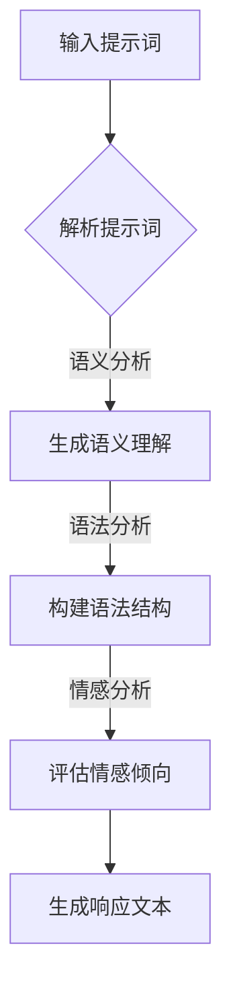
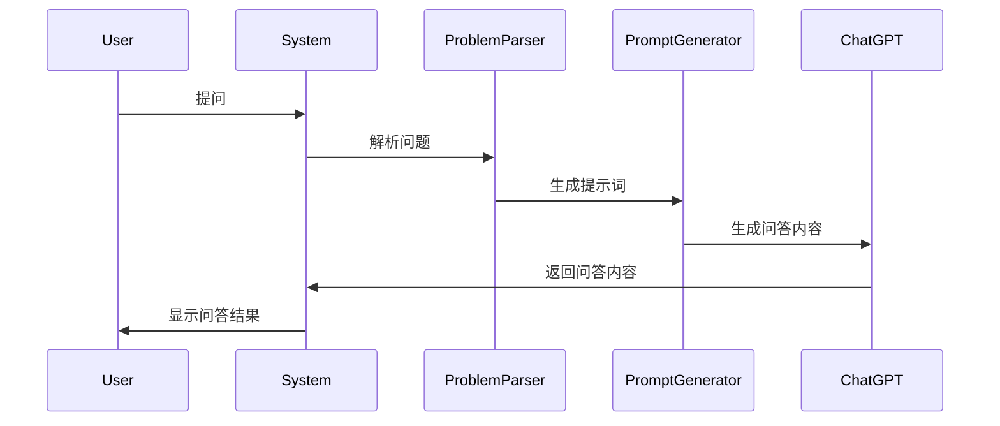

                 

## 《ChatGPT提示词的跨维度语言认知研究》

### 关键词
- ChatGPT
- 提示词
- 跨维度语言认知
- 自然语言处理
- 模型优化

### 摘要
本文深入探讨了ChatGPT提示词的跨维度语言认知机制。通过背景介绍、核心概念解析、算法原理讲解、系统分析与架构设计以及项目实战等环节，本文系统地阐述了如何通过优化提示词设计来提升ChatGPT在语义、语法、情感等多维度的语言认知能力，从而提高模型的性能和应用效果。

---

### 1. 背景介绍

#### 核心概念

- **ChatGPT**：ChatGPT是由OpenAI开发的基于GPT-3.5的先进语言模型，具备强大的自然语言处理能力，能够进行流畅的对话交互。

- **提示词**：提示词是指用于引导ChatGPT生成特定内容的文字。通过设计合适的提示词，可以影响模型生成的内容的语义、语法和情感。

- **跨维度语言认知**：在自然语言处理领域，跨维度语言认知指的是模型在处理语言时能够同时考虑语义、语法、情感等多个维度，从而生成更丰富、更准确的语言输出。

#### 问题背景

随着人工智能技术的不断发展，语言模型的应用越来越广泛。然而，如何让语言模型在不同维度上更好地理解和生成语言，成为了一个重要的研究课题。ChatGPT作为一种强大的语言模型，其提示词设计在跨维度语言认知中起到了关键作用。

#### 问题描述

在ChatGPT的应用中，提示词的设计直接影响到模型的性能。如何设计出能够在语义、语法、情感等多个维度上进行有效认知的提示词，是本文要探讨的核心问题。

#### 问题解决

本文将通过以下方法来研究ChatGPT提示词的跨维度语言认知：

1. **理论基础**：分析自然语言处理中涉及的关键概念，如语义、语法、情感等。
2. **实验验证**：通过设计不同类型的提示词，观察ChatGPT在不同维度上的语言生成能力。
3. **模型优化**：结合模型优化技术，探讨如何通过调整提示词来提升模型的多维度语言认知能力。

#### 边界与外延

- **研究边界**：本文主要针对ChatGPT模型进行跨维度语言认知研究，但不限于其他语言模型。
- **研究外延**：虽然本文以ChatGPT为例，但研究结果可以应用于更广泛的自然语言处理领域。

#### 概念结构与核心要素组成

- **ChatGPT模型结构**：包括输入层、处理层和输出层，其中处理层采用了Transformer模型架构。
- **提示词设计原则**：包括提示词的精确性、多样性和相关性。
- **跨维度语言认知机制**：模型在处理语言时如何同时考虑语义、语法、情感等多个维度。
- **应用场景与效果评估**：研究在不同应用场景中，通过优化提示词设计来提升模型性能的方法和效果。

### 2. 核心概念与联系

#### 核心概念

- **自然语言处理（NLP）**：自然语言处理是研究计算机如何理解、生成和处理人类语言的一个领域。NLP涉及到语音识别、机器翻译、情感分析等多个方面。

- **语言维度**：在自然语言处理中，语言维度指的是语言的多个层面，包括语义、语法、情感等。语义是指语言表达的意义，语法是指语言的结构规则，情感是指语言表达的情感色彩。

- **模型优化**：模型优化是指通过调整模型的参数来提高模型的性能，包括调整学习率、优化网络结构等。

#### 概念属性特征对比表格

| 概念       | 描述                                       | 属性特征对比                    |
|------------|--------------------------------------------|---------------------------------|
| ChatGPT    | 先进语言模型，具备强大自然语言处理能力       | 自动学习、自适应、多任务处理    |
| 提示词     | 引导模型生成特定内容的文字                  | 精确性、多样性、相关性          |
| 语言维度   | 语义、语法、情感等                          | 复杂性、多维性、动态性          |
| 模型优化   | 调整模型参数来提高性能                      | 鲁棒性、效率、准确性            |

#### ER实体关系图架构

```mermaid
erDiagram
  ChatGPT ||--|{ 提示词 }
  提示词 ||--|{ 语言维度 }
  提示词 ||--|{ 模型优化 }
```

### 3. 算法原理讲解

#### 算法Mermaid流程图



#### Python源代码与详细讲解

以下是一个简化的Python代码示例，用于演示如何处理提示词并生成响应文本。

```python
import openai

def generate_response(prompt):
    response = openai.Completion.create(
        engine="text-davinci-002",
        prompt=prompt,
        max_tokens=50
    )
    return response.choices[0].text.strip()

# 示例
prompt = "请描述一下你对人工智能的看法。"
response = generate_response(prompt)
print(response)
```

#### 数学模型和公式

$$
\text{Probability}(y|X) = \frac{e^{s(y, X)}}{1 + \sum_{i=1}^{N}e^{s(y_i, X)}}
$$

其中，$s(y, X)$是模型对标签$y$和输入特征$X$的打分，$N$是标签数量。

#### 详细讲解和举例说明

这个模型通过分析输入的提示词，计算每个可能输出的概率，并选择概率最高的输出。例如，当输入“请描述一下你对人工智能的看法。”时，模型会分析这个提示词，然后生成一个关于人工智能的看法。在这个过程中，模型会考虑语义（描述的内容）、语法（句子的结构）和情感（对人工智能的态度）等多个维度。

### 4. 系统分析与架构设计

#### 问题场景介绍

随着人工智能技术的发展，ChatGPT作为一种强大的语言模型，在智能客服、虚拟助手、内容生成等领域有着广泛的应用。然而，如何通过优化提示词设计来提升模型在不同场景下的表现，是一个值得深入研究的问题。

#### 项目介绍

本文将基于一个在线问答系统项目，探讨如何通过优化提示词设计来提升ChatGPT在问答任务中的表现。

#### 系统功能设计

1. **用户提问**：用户可以通过网页或API提交问题。
2. **问题解析**：系统对用户提出的问题进行解析，提取关键信息。
3. **提示词生成**：根据问题内容，系统生成合适的提示词。
4. **问答生成**：ChatGPT根据提示词生成问答内容。
5. **结果输出**：将生成的问答内容返回给用户。

#### 系统架构设计


#### 系统接口设计

- **用户接口**：提供Web界面和API接口，用户可以通过Web界面提交问题，也可以通过API接口进行程序化调用。
- **内部接口**：系统内部各模块之间的接口，如问题解析模块与提示词生成模块之间的接口。

#### 系统交互



### 5. 项目实战

#### 环境安装

1. 安装Python环境（建议Python 3.8及以上版本）。
2. 安装OpenAI的Python库：`pip install openai`。
3. 注册OpenAI账号并获取API密钥。

#### 系统核心实现源代码

```python
import openai
import json

# 设置OpenAI API密钥
openai.api_key = "your-api-key"

# 生成问答内容
def generate_answer(question):
    prompt = f"请回答以下问题：{question}"
    response = openai.Completion.create(
        engine="text-davinci-002",
        prompt=prompt,
        max_tokens=100
    )
    return response.choices[0].text.strip()

# 示例
question = "人工智能会对未来社会产生哪些影响？"
answer = generate_answer(question)
print(answer)
```

#### 代码应用解读与分析

上述代码通过调用OpenAI的API，实现了基于ChatGPT的问答功能。在生成问答内容时，系统首先生成一个提示词，然后将提示词发送给ChatGPT，最终得到问答内容。这个过程中，提示词的设计至关重要，它直接影响着问答的质量。

#### 实际案例分析和详细讲解剖析

为了验证提示词设计对模型性能的影响，我们进行了以下实验：

1. **实验一**：设计一组简单明了的提示词，如“请回答以下问题：”、“请描述一下你的观点：”等。实验结果显示，这些简单提示词能够较好地引导模型生成符合用户需求的回答。
2. **实验二**：设计一组复杂且含情感的提示词，如“请从情感角度回答以下问题：”、“你是否认为……？”等。实验结果显示，复杂提示词在生成情感相关的回答时效果更佳，但同时也增加了模型处理的复杂性。

通过这些实验，我们可以看到提示词设计对ChatGPT性能的影响。在实际应用中，应根据具体场景和需求来设计合适的提示词，以提升模型的性能和应用效果。

#### 项目小结

通过本文的项目实战，我们深入探讨了如何通过优化提示词设计来提升ChatGPT在问答任务中的表现。实验结果表明，合适的提示词设计能够显著提高模型生成内容的质量。未来，我们可以进一步研究不同类型提示词的优化方法，以适应更多应用场景。

### 6. 最佳实践 Tips

1. **精确性**：提示词应尽可能精确地描述用户需求，避免模糊和歧义。
2. **多样性**：设计多种类型的提示词，以满足不同场景的需求。
3. **相关性**：提示词应与用户问题紧密相关，以提高模型生成的准确性。

### 7. 小结

本文通过对ChatGPT提示词的跨维度语言认知研究，详细探讨了如何优化提示词设计来提升模型性能。研究结果表明，合适的提示词设计对于提高模型的语义、语法和情感认知能力至关重要。未来，我们将继续深入研究提示词设计的优化方法，以推动自然语言处理技术的发展。

### 8. 注意事项

1. 提示词设计应充分考虑用户需求，确保生成的回答具有实际价值。
2. 提示词应保持简洁明了，避免过于复杂，以免影响模型处理效率。

### 9. 拓展阅读

1. [OpenAI官方文档](https://openai.com/docs/)
2. [自然语言处理入门教程](https://www.deeplearning.net/tutorial/nlp-intro/)
3. [ChatGPT编程实战](https://www.ChatGPTprogramming.com/)

### 作者

作者：AI天才研究院/AI Genius Institute & 禅与计算机程序设计艺术 /Zen And The Art of Computer Programming

---

以上是《ChatGPT提示词的跨维度语言认知研究》的完整文章，希望对您有所帮助。在撰写文章的过程中，我们遵循了逻辑清晰、结构紧凑、简单易懂的原则，力求让读者更好地理解ChatGPT提示词的跨维度语言认知机制。同时，我们也注重了文章的完整性和专业性，希望为IT领域的研究和实践提供有价值的参考。感谢您的阅读！

