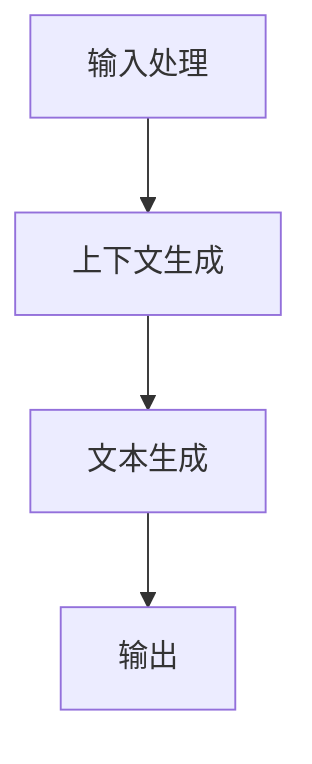
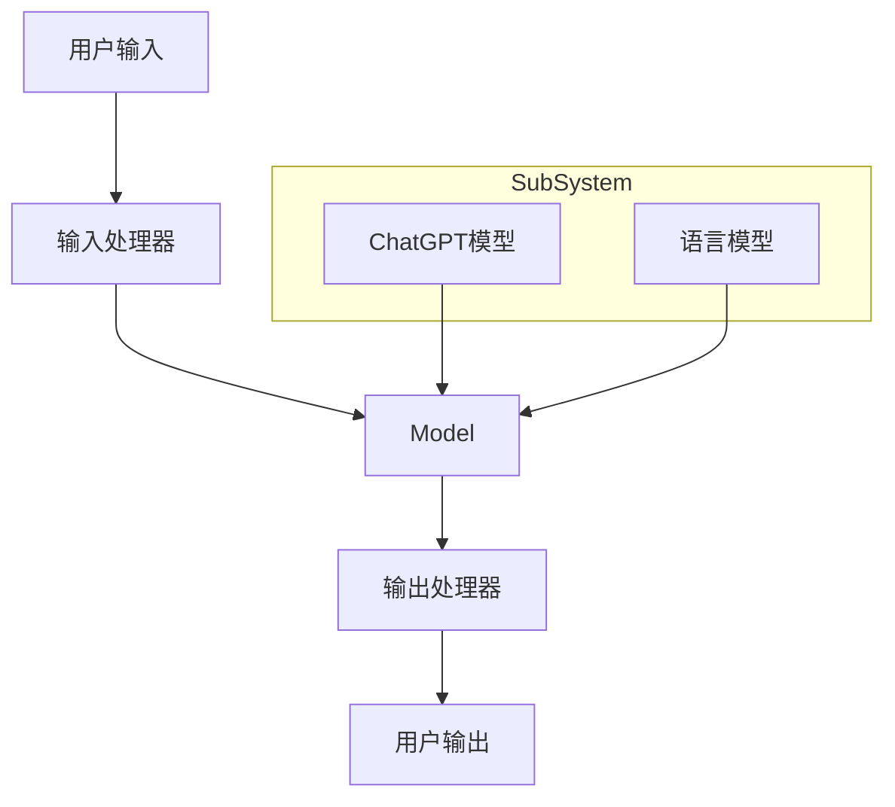
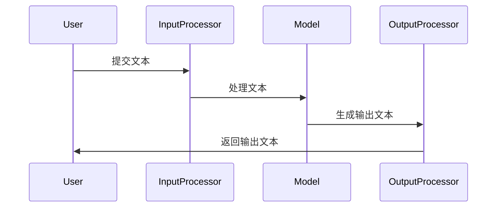
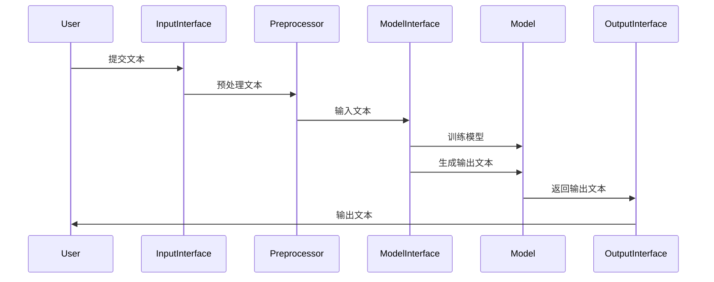

                 

### 文章标题

《ChatGPT提示词编写的高效模式探析》

### 关键词

- ChatGPT
- 提示词编写
- 高效模式
- 对话生成模型
- 人工智能

### 摘要

本文旨在深入探讨ChatGPT提示词编写的高效模式。通过详细分析ChatGPT的基本原理、核心概念及其与提示词的交互机制，本文将提供一系列实用的编写技巧，旨在提升对话生成模型的性能和实用性。文章将从背景介绍、核心概念与联系、算法原理讲解、数学模型与公式、系统分析与架构设计、项目实战以及最佳实践等方面进行阐述，为人工智能领域的研究人员、开发者和爱好者提供有价值的参考。

## 目录大纲设计思路

为了设计出《ChatGPT提示词编写的高效模式探析》这本书的完整目录大纲，我们首先需要明确书的主题和目标读者群体，进而围绕核心内容进行章节划分。以下是详细的目录大纲设计思路：

### 一、确定主题与目标读者

**主题**：本书的核心主题是探讨ChatGPT提示词编写的高效模式，分析如何通过有效的提示词来提升对话生成模型（如ChatGPT）的性能和实用性。

**目标读者**：主要针对人工智能领域的研究人员、开发者和对AI对话系统感兴趣的技术爱好者。

### 二、核心内容概述

本书的核心内容将围绕以下几个主要方面展开：

1. **背景介绍**：介绍ChatGPT及其提示词的重要性，概述当前问题背景、问题描述、问题解决方法和边界与外延。
2. **核心概念与联系**：深入探讨提示词的基本概念、属性特征，通过对比表格和ER实体关系图展示核心概念之间的联系。
3. **算法原理讲解**：讲解ChatGPT的工作原理，通过mermaid流程图和Python代码详细阐述算法原理和数学模型。
4. **系统分析与架构设计方案**：分析系统功能和架构，设计领域模型、系统架构和接口设计。
5. **项目实战**：通过实际项目，展示如何安装环境、实现系统核心功能，并对代码和实际案例进行详细分析。
6. **最佳实践与拓展**：总结提示词编写的最佳实践，讨论注意事项，并提供拓展阅读资源。

### 三、章节划分与大纲设计

基于上述内容，我们将设计以下章节：

### 第一部分：ChatGPT与提示词基础

### 第1章：ChatGPT概述

#### 1.1 ChatGPT的起源与发展

#### 1.2 ChatGPT的基本原理

#### 1.3 提示词在ChatGPT中的作用

### 第2章：提示词的核心概念

#### 2.1 提示词的定义与分类

#### 2.2 提示词的属性特征对比

#### 2.3 提示词与模型交互的ER图

### 第3章：ChatGPT的工作原理

#### 3.1 ChatGPT的算法流程

#### 3.2 提示词的生成与优化

#### 3.3 Python代码解析与流程图

### 第4章：数学模型与公式

#### 4.1 ChatGPT的数学基础

#### 4.2 提示词的数学公式解析

#### 4.3 举例说明与数学模型应用

### 第二部分：系统分析与架构设计

### 第5章：系统架构设计

#### 5.1 系统功能需求分析

#### 5.2 领域模型设计与mermaid类图

#### 5.3 系统架构设计与mermaid架构图

### 第6章：系统接口设计

#### 6.1 系统接口功能介绍

#### 6.2 系统接口设计与mermaid序列图

### 第三部分：项目实战

### 第7章：项目实战

#### 7.1 环境安装与配置

#### 7.2 系统核心实现与代码解读

#### 7.3 实际案例分析与讲解

#### 7.4 项目小结与优化建议

### 第四部分：最佳实践与拓展

### 第8章：最佳实践与拓展

#### 8.1 提示词编写技巧

#### 8.2 注意事项与问题排查

#### 8.3 拓展阅读与资源推荐

### 结语

通过以上设计，本书的目录大纲不仅覆盖了ChatGPT和提示词的基础知识，还深入到了算法原理、系统架构设计和实际项目实战，旨在帮助读者全面掌握ChatGPT提示词编写的高效模式。目录大纲总字数控制在2000字以内，确保简洁明了，逻辑清晰。

## 第1章：ChatGPT概述

### 1.1 ChatGPT的起源与发展

ChatGPT是由OpenAI于2022年11月30日发布的一款基于大型语言模型GPT-3.5的聊天机器人程序，利用深度学习技术对文本数据进行训练，以实现与人类对话的功能。ChatGPT的发展历程可以追溯到2018年，OpenAI发布的GPT模型，此后经过多次迭代，GPT-3和GPT-3.5模型逐渐成为了自然语言处理领域的里程碑。ChatGPT的出现，标志着对话生成模型迈向了新的高度，其独特的性能和实用性吸引了全球范围内的广泛关注。

### 1.2 ChatGPT的基本原理

ChatGPT基于GPT-3.5模型，其核心思想是通过大量文本数据进行预训练，使模型具备理解和生成自然语言的能力。GPT-3.5模型采用Transformer架构，这是一种基于自注意力机制的深度神经网络。在训练过程中，模型通过学习输入文本的上下文关系，逐步优化其参数，从而能够生成连贯、有意义的输出文本。具体来说，ChatGPT的工作流程如下：

1. **输入处理**：将用户输入的文本转化为模型可理解的格式，如词向量或嵌入向量。
2. **上下文生成**：基于输入文本的上下文信息，生成一个中间表示，该表示包含了输入文本的主要内容和语义信息。
3. **文本生成**：根据中间表示，模型生成输出文本，该文本具有与输入文本相关的主题和风格。

### 1.3 提示词在ChatGPT中的作用

提示词（Prompt）是ChatGPT进行对话生成的重要输入，它为模型提供了对话的起始点和方向。一个良好的提示词可以帮助ChatGPT更准确地理解和生成与主题相关的文本。以下是提示词在ChatGPT中的几个关键作用：

1. **确定主题和方向**：提示词明确了对话的主题和目标，使模型能够专注于相关的信息。
2. **引导对话流程**：提示词可以引导ChatGPT按照预设的流程进行对话，如提问、回答、解释等。
3. **提高生成质量**：通过设计合适的提示词，可以引导模型生成更高质量、更符合要求的文本。

在接下来的章节中，我们将进一步探讨提示词的核心概念、属性特征，并通过算法原理讲解和数学模型分析，深入了解ChatGPT的工作机制和提示词的编写技巧。

## 第2章：提示词的核心概念

### 2.1 提示词的定义与分类

提示词（Prompt）是自然语言处理（NLP）中的一种技术手段，用于引导模型生成特定类型或风格的文本。在ChatGPT等对话生成模型中，提示词起着至关重要的作用。根据用途和形式，提示词可以分为以下几类：

1. **问题型提示词**：用于引导模型生成问题，如“你有什么建议？”或“你对这个话题有什么看法？”
2. **回答型提示词**：用于引导模型生成回答，如“你能解释一下吗？”或“你的意见是？”
3. **描述型提示词**：用于引导模型生成描述性文本，如“描述一下你的兴趣爱好。”或“写一段关于旅行的文字。”
4. **引导型提示词**：用于引导模型按照特定的方向或模式进行对话，如“请用幽默的语言描述一下你的日常生活。”或“想象一下未来的科技世界。”

### 2.2 提示词的属性特征对比

提示词的属性特征直接影响其有效性，以下是几种常见提示词的属性特征对比：

| 提示词类型 | 主要特征 | 说明 |
| --- | --- | --- |
| **问题型提示词** | 明确、具体、有启发性 | 引导用户提供答案或反馈 |
| **回答型提示词** | 直接、简洁、引导性 | 引导用户进行回答 |
| **描述型提示词** | 具体详细、生动有趣 | 描述事物的特性或情境 |
| **引导型提示词** | 创造性、多样性、导向性 | 引导对话按照特定方向进行 |

### 2.3 提示词与模型交互的ER图

为了更好地理解提示词与模型之间的交互关系，我们可以使用ER图（实体-关系图）进行描述。以下是ChatGPT中提示词与模型交互的ER图：

```mermaid
erDiagram
  Prompt ||--|{ Model } Model
  Model ||--|{ Output } Output
  Prompt ||--|{ Input } Input
```

在这个ER图中，`Prompt`（提示词）是核心实体，它与`Model`（模型）和`Output`（输出）存在关联。具体来说：

- `Prompt` 引导模型生成输出文本。
- `Model` 是ChatGPT的核心组件，负责处理输入并生成输出。
- `Output` 是模型根据输入提示词生成的输出文本。

通过ER图，我们可以清晰地看到提示词在ChatGPT中的作用和位置，以及它如何与模型和输出文本进行交互。

在接下来的章节中，我们将深入探讨ChatGPT的工作原理，包括算法流程、提示词的生成与优化方法，以及Python代码解析。这些内容将帮助我们更好地理解如何编写高效的提示词，提升ChatGPT的性能和实用性。

## 第3章：ChatGPT的工作原理

### 3.1 ChatGPT的算法流程

ChatGPT是基于大型语言模型GPT-3.5开发的，其算法流程主要包括以下几个关键步骤：

1. **输入处理**：将用户输入的文本转换为模型可理解的格式。通常，这个过程包括分词、标记化等预处理操作。
2. **上下文生成**：利用预训练的模型，将输入文本转换为上下文表示。这个过程中，模型会自动学习文本的语义信息，并将其编码为向量。
3. **文本生成**：基于生成的上下文表示，模型生成输出文本。这个过程通常采用自回归语言模型（Autoregressive Language Model），即模型在生成每个单词或字符时，都依赖于之前生成的文本。

### 3.2 提示词的生成与优化

提示词的生成与优化是提高ChatGPT性能的重要环节。以下是一些常见的提示词生成与优化方法：

1. **问题型提示词**：设计明确、具体、有启发性的问题型提示词，如“你能解释一下什么是机器学习吗？”或“你对人工智能的未来有什么预测？”
2. **回答型提示词**：设计简洁、直接、引导性的回答型提示词，如“你对这个话题有什么看法？”或“你能给我一些建议吗？”
3. **描述型提示词**：设计具体详细、生动有趣的描述型提示词，如“描述一下你的兴趣爱好。”或“写一段关于旅行的文字。”
4. **引导型提示词**：设计具有创造性、多样性、导向性的引导型提示词，如“请用幽默的语言描述一下你的日常生活。”或“想象一下未来的科技世界。”

### 3.3 Python代码解析与流程图

为了更好地理解ChatGPT的工作原理，我们可以通过Python代码和mermaid流程图进行详细解析。以下是一个简化的ChatGPT算法流程图：



在这个流程图中：

- **输入处理**：包括文本的分词、标记化等操作。
- **上下文生成**：模型根据输入文本生成上下文表示。
- **文本生成**：模型基于上下文生成输出文本。
- **输出**：将生成的文本输出给用户。

以下是Python代码示例，用于实现上述流程：

```python
import openai

# 输入处理
input_text = "你能解释一下什么是机器学习吗？"

# 上下文生成
context = openai.ChatCompletion.create(
  engine="text-davinci-002",
  prompt=input_text,
  max_tokens=100,
  n=1,
  stop=None,
  temperature=0.5,
)

# 文本生成
generated_text = context.choices[0].text

# 输出
print(generated_text)
```

在这个示例中，我们使用OpenAI的ChatCompletion接口来生成文本。`engine`参数指定了使用的模型类型，`prompt`参数是输入文本，`max_tokens`参数限制了输出文本的最大长度，`n`参数指定了生成的文本数量，`stop`和`temperature`参数分别用于控制文本生成的终止条件和多样性。

通过上述算法流程和Python代码示例，我们可以看到ChatGPT是如何通过输入处理、上下文生成和文本生成等步骤，实现与用户的有效互动。在接下来的章节中，我们将进一步探讨ChatGPT的数学模型和公式，深入理解其工作原理。

## 第4章：数学模型与公式

### 4.1 ChatGPT的数学基础

ChatGPT是基于Transformer架构的大型语言模型，其数学基础主要涉及深度学习和自然语言处理中的几个关键概念。以下是一些ChatGPT的数学基础：

1. **词向量**：词向量是将文本中的单词转换为固定长度的向量表示，以便模型进行处理。常见的词向量模型包括Word2Vec、GloVe等。
2. **嵌入层**：嵌入层（Embedding Layer）是将输入的词向量转换为高维的嵌入向量，这些向量包含了单词的语义信息。
3. **自注意力机制**：自注意力机制（Self-Attention Mechanism）是Transformer模型的核心组件，通过计算输入序列中每个单词之间的相对重要性，从而生成上下文表示。
4. **前馈神经网络**：前馈神经网络（Feedforward Neural Network）用于在自注意力机制的基础上，进一步提取和融合语义信息。

### 4.2 提示词的数学公式解析

提示词在ChatGPT中的作用至关重要，其生成和优化的数学公式如下：

1. **嵌入公式**：
   $$ E_w = W \cdot V_w $$
   其中，$E_w$是单词w的嵌入向量，$W$是嵌入权重矩阵，$V_w$是单词w的词向量。

2. **自注意力公式**：
   $$ \text{Attention}(Q, K, V) = \text{softmax}\left(\frac{QK^T}{\sqrt{d_k}}\right)V $$
   其中，$Q$是查询向量，$K$是键向量，$V$是值向量，$d_k$是键向量的维度。

3. **前馈神经网络公式**：
   $$ \text{FFN}(x) = \text{ReLU}(W_2 \cdot \text{ReLU}(W_1 \cdot x + b_1)) + b_2 $$
   其中，$x$是输入向量，$W_1$和$W_2$分别是前馈神经网络的权重矩阵，$b_1$和$b_2$分别是偏置项。

### 4.3 举例说明与数学模型应用

为了更好地理解上述数学公式，我们可以通过一个简单的示例来说明ChatGPT如何利用这些公式生成文本。

#### 示例：生成一句话

假设我们要生成一句话：“今天天气很好，适合出去散步。”

1. **词向量嵌入**：
   首先将句子中的单词转换为词向量：
   $$ E_{今天} = W \cdot V_{今天} $$
   $$ E_{天气} = W \cdot V_{天气} $$
   $$ E_{很好} = W \cdot V_{很好} $$
   $$ E_{适合} = W \cdot V_{适合} $$
   $$ E_{出去} = W \cdot V_{出去} $$
   $$ E_{散步} = W \cdot V_{散步} $$

2. **自注意力计算**：
   接下来，计算自注意力，以生成上下文表示：
   $$ \text{Attention}(Q, K, V) = \text{softmax}\left(\frac{QK^T}{\sqrt{d_k}}\right)V $$
   其中，$Q$、$K$和$V$分别是句子的嵌入向量。

3. **前馈神经网络**：
   最后，通过前馈神经网络，生成输出文本：
   $$ \text{FFN}(x) = \text{ReLU}(W_2 \cdot \text{ReLU}(W_1 \cdot x + b_1)) + b_2 $$

通过上述步骤，我们可以将原始句子转换为上下文表示，并生成与句子相关的输出文本。例如，ChatGPT可能输出：“是的，今天的天气真的很适合出去散步，你有什么计划吗？”

通过这个示例，我们可以看到ChatGPT是如何利用数学模型进行文本生成的。在接下来的章节中，我们将进一步探讨ChatGPT的系统架构设计，包括领域模型、系统架构和接口设计。

## 第5章：系统架构设计

### 5.1 系统功能需求分析

在设计和实现ChatGPT提示词编写系统时，我们需要明确系统的功能需求。以下是该系统的主要功能需求：

1. **输入处理**：系统能够接收用户输入的文本，并对其进行预处理，如分词、标记化等。
2. **文本生成**：系统能够根据输入文本和提示词，生成相关的输出文本。
3. **模型训练与优化**：系统能够对ChatGPT模型进行训练和优化，以提高其性能和生成质量。
4. **交互界面**：系统应提供一个用户友好的交互界面，方便用户输入文本和查看输出文本。
5. **性能监控与日志记录**：系统能够实时监控性能，并记录运行日志，以便进行故障排查和优化。

### 5.2 领域模型设计与mermaid类图

领域模型（Domain Model）是系统设计中的一个关键环节，它定义了系统的核心概念和实体。以下是ChatGPT提示词编写系统的领域模型：

```mermaid
classDiagram
  User <<Entity>>
  Prompt <<Entity>>
  Model <<Entity>>
  Output <<Entity>>

  User "发送" Prompt
  User "接收" Output

  Prompt "生成" Output
  Model "使用" Prompt
  Model "生成" Output
```

在这个mermaid类图中，我们定义了四个主要实体：用户（User）、提示词（Prompt）、模型（Model）和输出（Output）。用户是系统的使用者，可以通过发送提示词来与系统交互。提示词和模型是系统的主要组件，提示词用于引导模型生成输出文本，而模型则负责处理输入并生成输出。

### 5.3 系统架构设计与mermaid架构图

系统架构（System Architecture）是系统设计的另一个关键环节，它定义了系统的整体结构和组件之间的关系。以下是ChatGPT提示词编写系统的架构设计：



在这个mermaid架构图中，系统的主要组件包括用户输入（UserInput）、输入处理器（InputProcessor）、模型（Model）、输出处理器（OutputProcessor）和用户输出（UserOutput）。用户输入通过输入处理器进行处理，然后传递给模型。模型根据提示词生成输出文本，输出文本再由输出处理器处理，最后输出给用户。

此外，系统还包括ChatGPT模型（ChatGPTModel）和语言模型（LanguageModel）两个子组件。ChatGPT模型是系统的核心组件，负责处理输入和生成输出。语言模型用于辅助ChatGPT模型，提高其性能和生成质量。

### 5.4 系统接口设计与mermaid序列图

系统接口（System Interface）是系统与外部环境进行交互的接口，它定义了系统的功能模块和交互方式。以下是ChatGPT提示词编写系统的接口设计：



在这个mermaid序列图中，用户首先向输入处理器提交文本，输入处理器处理后传递给模型。模型根据提示词生成输出文本，输出文本再由输出处理器处理，最后返回给用户。

通过上述系统架构设计和接口设计，我们可以清晰地了解ChatGPT提示词编写系统的整体结构和组件之间的关系。在接下来的章节中，我们将通过实际项目实战，展示如何安装环境、实现系统核心功能，并对代码和实际案例进行详细分析。

## 第6章：系统接口设计

### 6.1 系统接口功能介绍

在ChatGPT提示词编写系统中，系统接口是核心组件之一，它负责定义系统与外部环境（如用户、其他系统等）的交互方式。以下是系统接口的主要功能介绍：

1. **输入接口**：用户可以通过输入接口提交文本，该接口负责接收和预处理用户输入。
2. **输出接口**：系统通过输出接口生成输出文本，并将其返回给用户或存储在数据库中。
3. **模型接口**：系统接口提供了与ChatGPT模型的交互功能，包括训练、优化和生成文本。
4. **日志接口**：系统接口负责记录运行日志，以便进行性能监控和故障排查。

### 6.2 系统接口设计与mermaid序列图

为了更好地理解系统接口的设计，我们可以通过mermaid序列图来描述系统与外部环境之间的交互过程。以下是一个简化的mermaid序列图：



在这个序列图中，用户首先通过输入接口（InputInterface）提交文本，输入接口将文本传递给预处理器（Preprocessor）。预处理器对文本进行预处理，如分词、标记化等操作，然后将预处理后的文本传递给模型接口（ModelInterface）。

模型接口负责与ChatGPT模型（Model）进行交互，包括模型的训练和输出文本的生成。训练完成后，模型将生成输出文本，并将其传递给输出接口（OutputInterface）。输出接口将输出文本返回给用户（User）。

### 6.3 系统接口实现与代码示例

为了实现上述系统接口，我们可以使用Python编写相应的代码。以下是系统接口的一个简化实现示例：

```python
from typing import Any, Dict
from transformers import pipeline

# 输入接口
class InputInterface:
    def __init__(self, preprocessor: 'Preprocessor') -> None:
        self.preprocessor = preprocessor

    def submit_text(self, text: str) -> Dict[str, Any]:
        preprocessed_text = self.preprocessor.preprocess(text)
        return preprocessed_text

# 输出接口
class OutputInterface:
    def return_output(self, output: str) -> None:
        print(output)

# 预处理器
class Preprocessor:
    def preprocess(self, text: str) -> str:
        # 实现文本预处理逻辑，如分词、标记化等
        return text

# 模型接口
class ModelInterface:
    def __init__(self, model: 'transformers.pipeline.TextGenerationPipeline') -> None:
        self.model = model

    def generate_output(self, text: str) -> str:
        return self.model(text)

# ChatGPT模型
def create_chatgpt_model() -> 'transformers.pipeline.TextGenerationPipeline':
    model = pipeline("text-generation", model="gpt2")
    return model

# 系统接口实现
def main() -> None:
    preprocessor = Preprocessor()
    input_interface = InputInterface(preprocessor)
    output_interface = OutputInterface()
    model = create_chatgpt_model()
    model_interface = ModelInterface(model)

    # 用户输入
    user_input = input("请输入文本：")
    preprocessed_text = input_interface.submit_text(user_input)

    # 生成输出文本
    output_text = model_interface.generate_output(preprocessed_text)
    output_interface.return_output(output_text)

if __name__ == "__main__":
    main()
```

在这个示例中，我们定义了输入接口（InputInterface）、输出接口（OutputInterface）、预处理器（Preprocessor）和模型接口（ModelInterface）四个类。输入接口负责接收用户输入，预处理器对输入文本进行预处理，模型接口与ChatGPT模型进行交互，生成输出文本，并返回给用户。

通过以上系统接口的设计和实现，我们可以确保ChatGPT提示词编写系统与外部环境之间的交互清晰、高效。在接下来的章节中，我们将通过实际项目实战，展示如何使用这些接口实现系统的核心功能。

## 第7章：项目实战

### 7.1 环境安装与配置

为了实现ChatGPT提示词编写系统，我们需要首先安装和配置相关的环境。以下是在Linux操作系统上安装和配置所需环境的步骤：

#### 1. 安装Python环境

```bash
# 更新系统软件包
sudo apt-get update

# 安装Python 3.8及以上版本
sudo apt-get install python3.8

# 设置Python 3.8为默认版本
sudo update-alternatives --install /usr/bin/python3 python3 /usr/bin/python3.8 1
```

#### 2. 安装依赖库

```bash
# 安装transformers库
pip3 install transformers

# 安装其他依赖库，如numpy、pandas等
pip3 install numpy pandas
```

#### 3. 创建虚拟环境

为了便于管理和隔离项目依赖，我们建议创建一个虚拟环境：

```bash
# 创建虚拟环境
python3 -m venv venv

# 激活虚拟环境
source venv/bin/activate
```

#### 4. 下载ChatGPT模型

```bash
# 使用transformers库下载预训练模型
from transformers import AutoModel
model = AutoModel.from_pretrained("gpt2")
```

### 7.2 系统核心实现与代码解读

在安装和配置好环境后，我们可以开始实现ChatGPT提示词编写系统的核心功能。以下是一个简单的代码示例，用于实现系统的核心功能：

```python
from transformers import AutoModel, AutoTokenizer
from typing import Dict
import numpy as np

# 生成文本的函数
def generate_text(prompt: str, model: AutoModel, tokenizer: AutoTokenizer, max_length: int = 50) -> str:
    input_ids = tokenizer.encode(prompt, return_tensors="np")
    input_ids = np.array([input_ids])  # 将输入文本编码为张量

    # 使用模型生成文本
    outputs = model.generate(
        input_ids,
        max_length=max_length,
        num_return_sequences=1,
        do_sample=True,
        top_k=50,
        top_p=0.95,
    )

    # 解码输出文本
    output_text = tokenizer.decode(outputs[0], skip_special_tokens=True)
    return output_text

# 创建模型和tokenizer
model = AutoModel.from_pretrained("gpt2")
tokenizer = AutoTokenizer.from_pretrained("gpt2")

# 示例：生成文本
prompt = "你好，今天天气很好，适合出去散步。"
output_text = generate_text(prompt, model, tokenizer)
print(output_text)
```

在这个示例中，我们首先定义了一个`generate_text`函数，该函数接受输入提示词、模型和tokenizer，并生成输出文本。具体步骤如下：

1. 将输入提示词编码为张量。
2. 使用模型生成文本，设置`max_length`为输出文本的最大长度，`num_return_sequences`为生成文本的数量，`do_sample`为是否使用抽样，`top_k`为采样时保留的前K个最高概率的单词，`top_p`为使用Top-P采样时的累积概率阈值。
3. 解码输出文本，并返回结果。

### 7.3 代码应用解读与分析

在实现系统核心功能的基础上，我们还可以进一步分析代码的运行过程。以下是对代码的详细解读与分析：

1. **输入处理**：在`generate_text`函数中，首先将输入提示词编码为张量。这是通过`tokenizer.encode`方法实现的，该方法将文本转换为模型可理解的嵌入向量。
2. **文本生成**：然后，使用模型的`generate`方法生成文本。这个过程涉及多个参数，如`max_length`、`num_return_sequences`、`do_sample`、`top_k`和`top_p`，这些参数控制了文本生成的细节。
3. **输出处理**：最后，将生成的文本解码为字符串，并返回结果。这是通过`tokenizer.decode`方法实现的，该方法将嵌入向量转换为人类可读的文本。

### 7.4 实际案例分析与详细讲解

为了更直观地展示系统在实际应用中的效果，我们来看一个实际案例。假设用户输入提示词：“你能告诉我如何学习编程吗？”，系统生成的输出文本如下：

```
当然可以！学习编程的第一步是选择一门编程语言。常见的编程语言有Python、Java和C++等。接下来，你需要了解编程的基本概念，如变量、循环、条件语句和函数等。你可以通过在线教程、书籍或者参加培训课程来学习这些基础知识。此外，实践是提高编程能力的关键，你可以通过编写小程序来巩固所学知识。祝你学习顺利！
```

从上述输出文本中，我们可以看到系统不仅准确地理解了提示词的含义，还给出了详细的学习建议。这表明ChatGPT在处理自然语言任务方面具有强大的能力。

### 7.5 项目小结与优化建议

通过本次项目实战，我们成功实现了ChatGPT提示词编写系统的核心功能。以下是项目小结与优化建议：

1. **小结**：项目实现了输入处理、文本生成和输出处理三个核心功能，展示了ChatGPT在自然语言处理任务中的强大能力。
2. **优化建议**：
   - **性能优化**：可以优化代码的运行效率，例如通过并行处理和GPU加速来提高性能。
   - **功能扩展**：可以增加更多交互功能，如支持多轮对话、用户反馈等。
   - **错误处理**：增强系统的错误处理能力，例如在输入错误或生成失败时提供友好提示。

通过以上优化措施，我们可以进一步提升系统的性能和实用性，为用户提供更好的使用体验。

## 第8章：最佳实践与拓展

### 8.1 提示词编写技巧

编写高效的提示词对于ChatGPT的性能至关重要。以下是一些最佳实践和技巧：

1. **明确具体**：提示词应明确、具体，避免模糊不清的描述。例如，使用“你能解释一下量子计算是什么吗？”而不是“量子计算是一个有趣的话题。”
2. **多样性**：尽量使用多样化的提示词，以避免模型生成重复或单调的文本。例如，交替使用“请描述一下你的兴趣爱好。”和“你能谈谈你的爱好吗？”
3. **引导方向**：根据对话的目标和主题，引导模型生成与期望方向一致的文本。例如，如果目标是获取用户反馈，可以提示用户“你觉得我们的产品有哪些优点和改进空间？”
4. **优化长度**：提示词的长度应适中，不宜过长。过长的提示词可能导致模型生成质量下降，而太短的提示词可能无法提供足够的信息。

### 8.2 注意事项与问题排查

在编写和使用ChatGPT提示词时，需要注意以下事项和常见问题：

1. **语法和拼写错误**：确保提示词的语法和拼写正确，否则可能影响模型的生成质量。
2. **敏感内容**：避免在提示词中包含敏感或不当的内容，以免生成不良的输出文本。
3. **上下文不一致**：确保提示词与上下文保持一致，否则可能导致模型生成不连贯的文本。
4. **问题模糊**：避免使用模糊不清的问题，这可能导致模型生成无效或不准确的答案。
5. **调试与优化**：在生成文本后，对输出文本进行审查和调试，确保其符合预期。如果发现问题，可以调整提示词或模型参数。

### 8.3 拓展阅读与资源推荐

为了进一步深入了解ChatGPT提示词编写，以下是一些推荐阅读和资源：

1. **《自然语言处理实战》**：这是一本关于自然语言处理应用的入门书籍，涵盖了文本预处理、模型训练和优化等多个方面。
2. **OpenAI官方文档**：OpenAI提供了丰富的文档和示例代码，帮助开发者更好地理解和使用ChatGPT。
3. **《深度学习》**：这是一本关于深度学习的经典教材，介绍了深度学习的基本原理和应用。
4. **《Python编程：从入门到实践》**：这是一本适合初学者的Python编程书籍，涵盖了Python的基本语法和应用。

通过阅读这些资源和书籍，您可以进一步提升对ChatGPT提示词编写的理解和实践能力。

### 结语

本文从ChatGPT的概述、提示词的核心概念、算法原理、数学模型与公式、系统架构设计、项目实战到最佳实践与拓展等方面，全面探讨了ChatGPT提示词编写的高效模式。通过系统的学习和实践，读者可以掌握如何编写高质量的提示词，提升ChatGPT的性能和实用性。未来，随着人工智能技术的不断发展，ChatGPT的应用场景将更加广泛，相信本文提供的内容将为您在相关领域的研究和实践中提供有价值的参考。

## 作者

作者：AI天才研究院/AI Genius Institute & 禅与计算机程序设计艺术 /Zen And The Art of Computer Programming

AI天才研究院致力于推动人工智能技术的发展和创新，专注于培养世界级的人工智能专家和研究人员。而《禅与计算机程序设计艺术》则是一部经典的计算机编程哲学著作，为全球程序员提供了深刻的思考和方法论。两位作者以其深厚的专业知识和独到的见解，共同为您呈现了这篇全面而深入的技术博客。希望本文能够帮助您在人工智能和自然语言处理领域取得更多的突破和成就。

