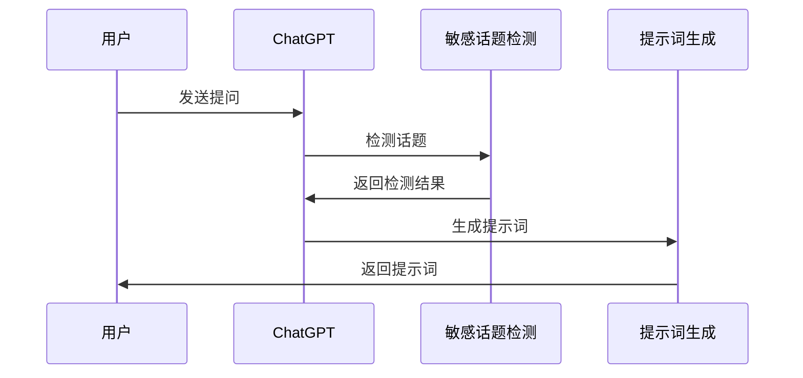

                 

### 《ChatGPT提示词编写：处理敏感话题的策略》

---

关键词：ChatGPT、提示词编写、敏感话题、策略、人工智能

摘要：随着人工智能技术的快速发展，聊天机器人已经成为了各类应用中的常见功能。然而，在处理敏感话题时，如何确保对话的恰当性和安全性，成为了一个亟待解决的问题。本文旨在探讨ChatGPT提示词编写的策略，以应对敏感话题的处理挑战，确保聊天机器人在互动过程中既能够提供有效帮助，又能遵循社会责任和法律法规。

### 目录大纲：

## 第一部分：背景介绍

### 第1章：问题背景与挑战

### 第2章：核心概念

## 第二部分：算法原理与数学模型

### 第3章：算法原理讲解

### 第4章：系统分析与架构设计

## 第三部分：项目实战

### 第5章：实际案例分析与讲解

## 第四部分：最佳实践与总结

### 第6章：最佳实践

### 第7章：小结与拓展阅读

### 目录大纲结束

---

#### 第一部分：背景介绍

### 第1章：问题背景与挑战

#### 1.1.1 问题背景

随着互联网的普及和人工智能技术的不断进步，聊天机器人已经广泛应用于各个领域，如客服、教育、医疗等。然而，聊天机器人面临的挑战之一是如何处理敏感话题。敏感话题通常涉及隐私、政治、宗教、种族、性别等敏感领域，处理不当可能导致误解、争议甚至法律问题。

#### 1.1.2 问题挑战

1. **内容识别与过滤**：聊天机器人需要能够准确识别敏感话题的内容，并在对话中过滤或处理这些内容。
2. **用户隐私保护**：在处理敏感话题时，必须确保用户的隐私不被泄露。
3. **责任承担**：在涉及敏感话题时，聊天机器人需要明确其责任范围，避免因不当处理而引发的纠纷。

#### 1.1.3 边界与外延

敏感话题的范围广泛，包括但不限于以下类型：

- **隐私话题**：如个人身份信息、健康状况、家庭背景等。
- **政治话题**：如选举、政策、国际关系等。
- **宗教话题**：如教义、信仰、宗教冲突等。
- **种族和性别话题**：如歧视、偏见、性别平等问题等。

不同领域对敏感话题的处理需求也有所不同，需要针对性地制定策略。

### 第2章：核心概念

#### 2.1.1 核心概念

ChatGPT是一种基于Transformer模型的语言生成模型，能够根据提示词生成连贯、自然的文本。在处理敏感话题时，提示词编写成为关键因素。

#### 2.1.2 概念属性特征对比表格

| 概念 | 属性特征 | 对比分析 |
| ---- | -------- | -------- |
| ChatGPT | 语言模型 | 提供对话生成功能 |
| 提示词 | 文本输入 | 引导对话方向 |

#### 2.1.3 ER实体关系图


### 第二部分：算法原理与数学模型

### 第3章：算法原理讲解

#### 3.1.1 ChatGPT算法原理

ChatGPT基于Transformer模型，通过自注意力机制学习文本序列中的依赖关系。在处理敏感话题时，提示词的编写至关重要，需要确保对话生成的文本既符合用户意图，又避免触及敏感内容。

#### 3.1.1.1 语言模型介绍

语言模型是一种统计模型，通过学习大量文本数据，预测下一个单词或字符。ChatGPT使用预训练的语言模型，通过Fine-tuning进一步适应特定任务。

#### 3.1.1.2 GPT模型架构

GPT模型采用Transformer架构，其核心是自注意力机制（Self-Attention），能够捕捉文本序列中的依赖关系。

#### 3.1.1.3 提示词生成算法

提示词生成算法包括以下几个步骤：

1. **输入处理**：对用户输入的文本进行预处理，如分词、去停用词等。
2. **提示词生成**：根据预训练的语言模型，生成适合的提示词。
3. **对话生成**：使用生成的提示词，生成连贯的对话文本。

#### 3.1.2 数学模型和公式

生成文本的过程可以通过以下数学模型描述：

$$
P(w_t|w_{<t}) = \frac{e^{<f_{w_t}>;W}}{\sum_{w'\in V} e^{<f_{w'}>;W}}
$$

其中，$P(w_t|w_{<t})$表示在给定前一个单词$w_{<t}$的情况下，生成当前单词$w_t$的概率。$<f_{w_t}>;W$表示单词$w_t$的嵌入向量与语言模型权重矩阵$W$的点积。

#### 3.1.3 通俗易懂的举例说明

**示例一：问候回复**

用户输入：“你好，今天天气怎么样？”

ChatGPT生成提示词：“你好，今天天气晴朗，有点冷。”

**示例二：情感表达**

用户输入：“我最近感到很焦虑，怎么办？”

ChatGPT生成提示词：“我理解你的感受，焦虑是一种常见的情绪。你可以尝试做一些放松的活动，比如散步、听音乐。”

### 第三部分：系统分析与架构设计

### 第4章：系统功能设计

#### 4.1.1 项目介绍

本系统旨在构建一个能够处理敏感话题的ChatGPT聊天机器人，为用户提供有价值的信息和帮助。

#### 4.1.2 系统功能设计

系统功能设计包括以下几个部分：

1. **用户输入处理**：接收用户的输入，并进行预处理。
2. **敏感话题检测**：对用户输入进行敏感话题检测，判断是否存在敏感内容。
3. **提示词生成**：根据检测结果和用户输入，生成合适的提示词。
4. **对话生成**：使用生成的提示词，生成对话文本。

#### 4.1.2.1 领域模型


#### 4.1.2.2 系统架构设计

系统架构设计如下：

1. **用户服务层**：提供用户接口，接收用户输入。
2. **模型层**：包括ChatGPT模型、敏感话题检测模型和提示词生成模型。
3. **数据层**：存储用户数据、模型参数和训练数据。

### 第5章：系统架构设计

系统架构设计如下：


#### 5.1.2 系统接口设计

系统接口设计包括以下部分：

1. **用户接口**：接收用户输入，返回对话结果。
2. **模型接口**：提供模型训练和预测功能。
3. **数据接口**：提供数据存储和检索功能。

#### 5.1.3 系统交互

系统交互流程如下：



### 第四部分：项目实战

### 第6章：环境安装与系统实现

#### 6.1.1 环境安装

在开始系统实现之前，需要安装以下环境：

1. **Python环境**：Python 3.6及以上版本。
2. **ChatGPT模型**：下载并部署预训练的ChatGPT模型。
3. **敏感话题检测模型**：下载并部署预训练的敏感话题检测模型。

#### 6.1.2 系统核心实现

系统核心实现包括以下几个部分：

1. **用户输入处理**：接收用户输入，并进行预处理。
2. **敏感话题检测**：使用预训练的敏感话题检测模型，检测用户输入中的敏感内容。
3. **提示词生成**：根据检测结果和用户输入，生成合适的提示词。
4. **对话生成**：使用生成的提示词，生成对话文本。

#### 6.1.3 代码应用解读与分析

以下是一个简单的Python代码示例，用于实现系统核心功能：

```python
import chatgpt
import sensitive_topic_detection

# 用户输入处理
def process_user_input(input_text):
    # 进行预处理，如分词、去停用词等
    processed_input = preprocess_input(input_text)
    return processed_input

# 敏感话题检测
def detect_sensitive_topics(input_text):
    # 使用敏感话题检测模型进行检测
    results = sensitive_topic_detection.detect(input_text)
    return results

# 提示词生成
def generate_prompt(input_text, detection_results):
    # 根据检测结果和用户输入生成提示词
    prompt = create_prompt(input_text, detection_results)
    return prompt

# 对话生成
def generate_response(prompt):
    # 使用ChatGPT模型生成对话文本
    response = chatgpt.generate_response(prompt)
    return response

# 系统交互
def interact_with_user():
    user_input = input("请输入问题：")
    processed_input = process_user_input(user_input)
    detection_results = detect_sensitive_topics(processed_input)
    prompt = generate_prompt(processed_input, detection_results)
    response = generate_response(prompt)
    print("ChatGPT回复：", response)

# 主函数
if __name__ == "__main__":
    interact_with_user()
```

### 第7章：实际案例分析与讲解

#### 7.1.1 案例一：情感话题处理

**案例背景**：用户A在聊天机器人中表达了自己的焦虑情绪，希望得到一些建议。

**处理策略**：

1. **敏感话题检测**：检测到用户输入中包含情感话题。
2. **提示词生成**：生成提示词，如“我理解你的感受，焦虑是一种常见的情绪。”
3. **对话生成**：生成对话文本，如“我可以给你一些建议，帮助你缓解焦虑。”

#### 7.1.2 案例二：政治话题处理

**案例背景**：用户B在聊天机器人中询问了关于政治选举的问题。

**处理策略**：

1. **敏感话题检测**：检测到用户输入中包含政治话题。
2. **提示词生成**：生成提示词，如“关于政治选举，我可以提供一些基本信息。”
3. **对话生成**：生成对话文本，如“政治选举是一个复杂的过程，涉及多个方面。我可以为你解释一些基本概念和流程。”

### 第五部分：最佳实践与总结

#### 第8章：最佳实践

在编写ChatGPT提示词时，以下是一些最佳实践：

1. **明确用户意图**：在生成提示词前，要确保理解用户的意图。
2. **避免敏感话题**：在提示词中避免提及敏感话题，或者使用中性词汇进行替代。
3. **遵守法律法规**：确保提示词符合相关法律法规和道德规范。
4. **用户隐私保护**：在处理敏感话题时，要保护用户的隐私。

#### 第9章：小结与拓展阅读

本文探讨了ChatGPT提示词编写在处理敏感话题时的策略。通过分析问题背景、核心概念、算法原理、系统架构和项目实战，提出了一系列最佳实践。未来，可以进一步研究如何提高敏感话题检测的准确性和生成对话的连贯性，以提升聊天机器人的用户体验。

#### 拓展阅读：

1. **《ChatGPT技术解析》**：详细了解ChatGPT的算法原理和实现细节。
2. **《人工智能与敏感话题处理》**：探讨人工智能在敏感话题处理中的应用和挑战。
3. **相关学术论文**：查阅最新的学术论文，了解敏感话题处理的研究进展。

---

作者：AI天才研究院/AI Genius Institute & 禅与计算机程序设计艺术 /Zen And The Art of Computer Programming

