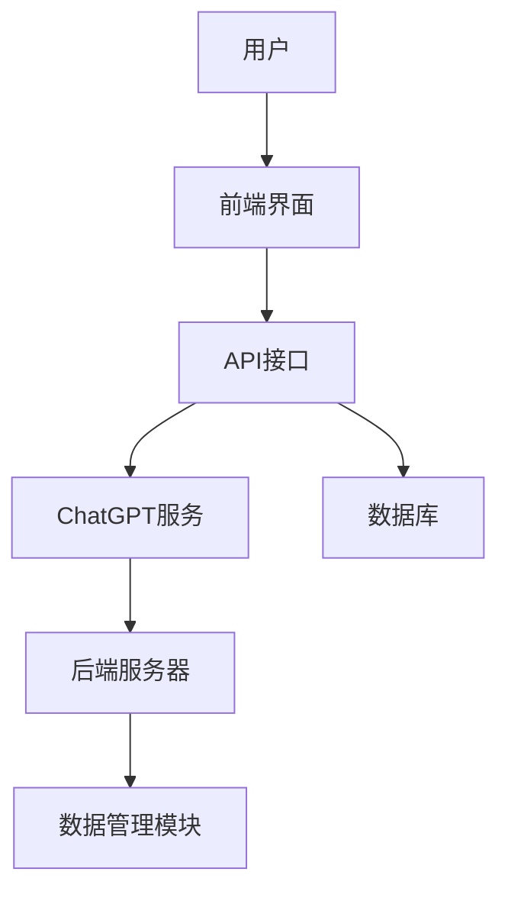
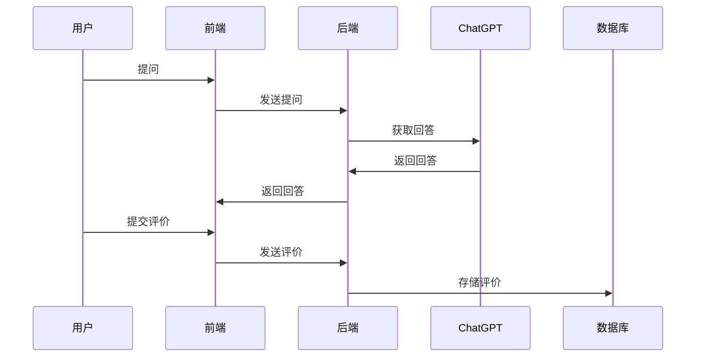

                 

# ChatGPT角色扮演：提示词的魔力

## 关键词
- ChatGPT
- 角色扮演
- 提示词
- 自然语言处理
- 对话系统

## 摘要
本文深入探讨了ChatGPT角色扮演和提示词设计的核心概念、技巧与策略。通过介绍角色扮演的基本概念和实施方法，以及提示词的设计原则，本文旨在帮助开发者更好地利用ChatGPT的角色扮演能力，提高对话系统的质量和用户体验。

## 第一部分：ChatGPT角色扮演与提示词基础

### 第1章：ChatGPT角色扮演概述

#### 1.1 问题背景
随着人工智能技术的发展，自然语言处理（NLP）成为研究的热点。ChatGPT作为一种基于GPT-3模型的聊天机器人，以其强大的语言理解和生成能力，成为了NLP领域的明星产品。然而，要让ChatGPT在真实场景中表现出色，角色扮演和提示词设计是至关重要的。

#### 1.2 问题描述
在本章中，我们将探讨ChatGPT角色扮演的基本概念、方法和技巧。具体问题包括：什么是角色扮演？如何为ChatGPT设计合适的角色？如何编写有效的提示词来引导ChatGPT进行角色扮演？这些问题将帮助我们深入了解ChatGPT角色扮演的核心要素。

#### 1.3 问题解决

**（1）角色定义**
角色扮演是ChatGPT在对话中模仿特定角色进行交流的能力。角色可以是任何人、事、物，甚至是虚构的角色。

**（2）角色选择**
选择合适的角色对于ChatGPT角色扮演的成功至关重要。角色应与对话内容、场景和目标受众紧密相关。

**（3）提示词设计**
提示词是引导ChatGPT进行角色扮演的关键。有效的提示词应明确、具体，能够激发ChatGPT的想象力和创造力。

#### 1.4 边界与外延

**（1）边界**
ChatGPT角色扮演的边界在于其语言理解和生成能力。虽然ChatGPT可以模拟各种角色，但其在某些特定领域的知识可能有限。

**（2）外延**
角色扮演不仅限于文本对话，还可以扩展到语音、图像等多模态交互。此外，角色扮演的应用场景也在不断拓展，如客服、教育、娱乐等。

#### 1.5 概念结构与核心要素组成

**（1）概念结构**
ChatGPT角色扮演由三个核心要素组成：角色、提示词和对话。

**（2）核心要素组成**
- 角色：定义ChatGPT在对话中模仿的身份。
- 提示词：引导ChatGPT进行角色扮演的关键。
- 对话：角色扮演的实现形式，包括文本、语音等。

#### 1.6 本章小结
本章介绍了ChatGPT角色扮演的基本概念、方法和技巧。通过了解角色定义、角色选择和提示词设计，读者可以更好地利用ChatGPT进行角色扮演，提高对话质量和用户体验。

### 第2章：角色扮演技巧与策略

#### 2.1 问题背景
ChatGPT的角色扮演能力在多个领域得到广泛应用，如客户服务、虚拟助手、教育等。然而，如何设计出引人入胜、真实的角色扮演，提高对话质量，是开发者面临的一大挑战。

#### 2.2 问题描述
在本章中，我们将探讨ChatGPT角色扮演的技巧与策略。具体问题包括：如何设计引人入胜的角色？如何编写有效的提示词？如何处理角色扮演中的常见问题？

#### 2.3 问题解决

**（1）角色设计**
设计引人入胜的角色需要充分考虑角色的个性、经历、背景等因素。以下是一些建议：
- **个性化**：为角色赋予独特的性格特点，使其在对话中更具魅力。
- **情境化**：根据对话场景设计角色的行为和对话风格。
- **多样化**：角色应具有多样性，以适应不同场景和对话需求。

**（2）提示词编写**
编写有效的提示词需要遵循以下原则：
- **明确性**：提示词应简洁明了，避免模糊不清。
- **具体性**：提示词应具体描述角色行为和对话内容。
- **引导性**：提示词应引导ChatGPT进行角色扮演，激发其创造力和想象力。

**（3）角色扮演问题处理**
在角色扮演过程中，可能会遇到以下问题：
- **角色切换**：如何在同一对话中切换不同角色？
- **角色冲突**：如何处理角色之间的矛盾和冲突？
- **角色重复**：如何避免角色在对话中的重复表现？

#### 2.4 边界与外延

**（1）边界**
ChatGPT角色扮演的边界在于其语言理解和生成能力。虽然ChatGPT可以模拟各种角色，但其在某些特定领域的知识可能有限。

**（2）外延**
角色扮演不仅限于文本对话，还可以扩展到语音、图像等多模态交互。此外，角色扮演的应用场景也在不断拓展，如客服、教育、娱乐等。

#### 2.5 概念结构与核心要素组成

**（1）概念结构**
ChatGPT角色扮演由三个核心要素组成：角色设计、提示词编写和问题处理。

**（2）核心要素组成**
- 角色设计：定义ChatGPT在对话中模仿的身份。
- 提示词编写：引导ChatGPT进行角色扮演的关键。
- 问题处理：解决角色扮演中的常见问题。

#### 2.6 本章小结
本章介绍了ChatGPT角色扮演的技巧与策略。通过设计引人入胜的角色、编写有效的提示词以及处理角色扮演中的常见问题，开发者可以更好地利用ChatGPT的角色扮演能力，提高对话系统的质量和用户体验。

## 第二部分：ChatGPT角色扮演实践

### 第3章：ChatGPT角色扮演案例分析

#### 3.1 案例背景
在本章中，我们将通过具体案例来分析ChatGPT角色扮演的应用和实践。这些案例将涵盖不同领域和场景，以展示ChatGPT角色扮演的多样性和实用性。

#### 3.2 案例描述
以下是一些案例描述：

**案例1：虚拟客服**
一个在线零售商希望为其客户服务引入ChatGPT角色扮演功能。他们设计了一个名为“小智”的虚拟客服，以更自然、高效地与客户进行交流。

**案例2：教育助手**
一所大学引入了ChatGPT角色扮演功能，为学生提供个性化的辅导和指导。他们设计了一个名为“小艾”的人工智能助手，模拟导师的角色，帮助学生解决学习中的问题。

**案例3：游戏NPC**
一款大型多人在线游戏（MMO）引入了ChatGPT角色扮演，为玩家提供了丰富的NPC（非玩家角色）互动体验。这些NPC角色包括商人、医生、法师等，为游戏增添了真实感和趣味性。

#### 3.3 案例分析
通过对这些案例的分析，我们可以得出以下结论：

**（1）角色设计**
在案例1中，虚拟客服的角色设计注重简洁明了，易于理解。案例2中，教育助手的角色设计则更加复杂，需要模拟导师的专业知识和教学风格。案例3中，游戏NPC的角色设计则注重多样性和趣味性，以吸引玩家参与互动。

**（2）提示词编写**
案例1中，提示词设计简洁明了，旨在引导ChatGPT提供即时、有效的客户服务。案例2中，提示词设计更加深入，旨在激发ChatGPT的创造力和教学能力。案例3中，提示词设计注重情境化，以引导ChatGPT模拟不同的NPC角色。

**（3）角色扮演效果**
案例1中，ChatGPT角色扮演提高了客户服务的效率和质量，受到了客户的欢迎。案例2中，ChatGPT角色扮演为学生提供了个性化的辅导，提高了学习效果。案例3中，ChatGPT角色扮演为游戏增添了真实感和趣味性，吸引了大量玩家。

#### 3.4 本章小结
通过案例分析，我们可以看到ChatGPT角色扮演在不同领域和场景中的应用和实践。这些案例展示了ChatGPT角色扮演的多样性和实用性，为开发者提供了有益的参考和启示。

### 第4章：ChatGPT角色扮演实战

#### 4.1 实战背景
在本章中，我们将通过一个具体的实战项目，介绍如何利用ChatGPT进行角色扮演，实现一个聊天机器人。

#### 4.2 项目介绍
项目名称：“智能问答系统”
项目目标：开发一个能够模拟导师角色，为学生提供个性化问答服务的聊天机器人。

#### 4.3 系统功能设计

**（1）用户功能**
- 用户提问
- 用户接收回答
- 用户评价问答质量

**（2）系统功能**
- 接收用户提问
- 模拟导师角色回答问题
- 记录用户提问和回答，以供后续分析
- 提供用户评价功能

**（3）数据管理**
- 存储用户提问和回答
- 存储用户评价数据
- 数据备份与恢复

#### 4.4 系统架构设计

**（1）架构图**


**（2）架构说明**
- 用户通过前端界面发起提问，并通过API接口与后端服务器通信。
- 后端服务器调用ChatGPT服务，模拟导师角色进行回答。
- 用户接收回答后，可以通过前端界面进行评价。
- 所有用户提问和回答、用户评价数据都会存储在数据库中，以供后续分析和改进。

#### 4.5 系统接口设计

**（1）接口定义**
- GET /ask?question=<question>
  - 功能：获取用户提问
  - 返回：问答结果

- POST /evaluate?answer=<answer>&rating=<rating>
  - 功能：用户评价问答质量
  - 返回：评价结果

#### 4.6 系统交互设计

**（1）序列图**


**（2）交互说明**
- 用户通过前端界面发起提问。
- 前端将提问发送到后端服务器。
- 后端服务器调用ChatGPT服务，获取回答。
- 后端服务器将回答返回给前端，前端再将回答展示给用户。
- 用户对回答进行评价，前端将评价发送到后端服务器。
- 后端服务器将评价存储到数据库中。

#### 4.7 系统核心实现

**（1）环境安装**
- 安装Python环境
- 安装ChatGPT库：pip install openai

**（2）源代码**
```python
from openai import ChatGPT
import requests

class ChatGPTClient:
    def __init__(self, api_key):
        self.api_key = api_key
        self.chatgpt = ChatGPT(self.api_key)

    def ask_question(self, question):
        response = self.chatgpt.answer(question)
        return response

    def evaluate_answer(self, answer, rating):
        evaluation = self.chatgpt.evaluate_answer(answer, rating)
        return evaluation

if __name__ == "__main__":
    api_key = "your_api_key"
    client = ChatGPTClient(api_key)

    question = "什么是自然语言处理？"
    answer = client.ask_question(question)
    print(answer)

    rating = 5
    evaluation = client.evaluate_answer(answer, rating)
    print(evaluation)
```

**（3）代码应用解读与分析**
- 代码首先从`openai`库中导入`ChatGPT`类。
- `ChatGPTClient`类用于封装与ChatGPT服务的交互。
- `ask_question`方法用于发送用户提问，并获取回答。
- `evaluate_answer`方法用于发送用户评价，并获取评价结果。
- 主程序中，首先设置API密钥，并创建`ChatGPTClient`实例。
- 发送一个示例提问，并获取回答。
- 发送一个示例评价，并获取评价结果。

#### 4.8 实际案例分析
通过实际案例，我们可以看到ChatGPT角色扮演在智能问答系统中的应用效果。以下是一个实际案例：

**案例：学生提问**
- 提问：“什么是神经网络？”
- 回答：“神经网络是一种由多个神经元组成的计算模型，用于模拟人脑的神经网络结构和功能。它通过学习和自适应来处理和分类数据。”

**案例：用户评价**
- 评价：“回答得很详细，对我有帮助。”

通过这个案例，我们可以看到ChatGPT角色扮演在模拟导师角色，为学生提供个性化问答服务方面的效果。

#### 4.9 项目小结
本章通过一个具体的实战项目，介绍了如何利用ChatGPT进行角色扮演，实现一个智能问答系统。项目从系统功能设计、架构设计、接口设计、交互设计等方面进行了详细讲解，并通过实际案例分析，展示了ChatGPT角色扮演的应用效果。通过这个项目，我们可以看到ChatGPT角色扮演在提高对话质量和用户体验方面的潜力。

### 第三部分：ChatGPT角色扮演的未来

#### 第5章：ChatGPT角色扮演发展趋势与挑战

#### 5.1 趋势分析
ChatGPT角色扮演技术在近年来取得了显著的进展，其应用范围和影响力也在不断扩大。以下是ChatGPT角色扮演的发展趋势：

**（1）技术进步**
随着人工智能技术的不断进步，ChatGPT的角色扮演能力也在不断提升。例如，通过深度学习和强化学习等技术的应用，ChatGPT可以更好地理解用户意图，提供更自然的对话体验。

**（2）多模态交互**
ChatGPT角色扮演正在从文本对话扩展到语音、图像等多模态交互。这意味着用户可以通过不同的方式与ChatGPT进行交流，获得更加丰富和多样化的体验。

**（3）个性化服务**
随着大数据和个性化推荐技术的应用，ChatGPT角色扮演将能够根据用户的历史行为和偏好，提供更加个性化的服务和建议。

**（4）跨领域应用**
ChatGPT角色扮演的应用场景将不断拓展，从客服、教育、娱乐等领域，扩展到医疗、金融、法律等领域，为用户提供更加专业和高效的解决方案。

#### 5.2 挑战与解决方案
尽管ChatGPT角色扮演具有巨大的潜力，但在发展过程中也面临着一系列挑战：

**（1）数据隐私**
ChatGPT角色扮演需要大量用户数据来训练和优化模型，这引发了数据隐私和伦理问题。为此，开发者需要采取严格的隐私保护措施，确保用户数据的安全和合规。

**（2）模型解释性**
当前的ChatGPT模型主要依赖于黑箱机制，难以解释其决策过程。为了提高模型的解释性，研究者们正在探索可解释的人工智能技术，如注意力机制、决策树等。

**（3）伦理问题**
ChatGPT角色扮演在道德和伦理方面也面临挑战，例如，如何避免歧视、偏见和误导用户。为此，开发者需要制定明确的伦理规范，确保ChatGPT的角色扮演符合社会价值观和道德标准。

#### 5.3 未来展望
随着技术的不断进步和应用场景的拓展，ChatGPT角色扮演在未来将迎来更加广阔的发展空间。以下是未来ChatGPT角色扮演的一些潜在应用方向：

**（1）智能客服**
ChatGPT角色扮演将进一步提升智能客服的服务质量和效率，为用户提供更加自然、个性化的服务体验。

**（2）虚拟教育**
ChatGPT角色扮演将在虚拟教育领域发挥重要作用，为学生提供个性化的学习辅导和互动体验。

**（3）娱乐体验**
ChatGPT角色扮演将为游戏、电影、音乐等领域带来新的创意和互动方式，为用户提供更加丰富和有趣的娱乐体验。

**（4）专业咨询**
ChatGPT角色扮演将拓展到医疗、金融、法律等专业领域，为用户提供高效、专业的咨询服务。

#### 5.4 本章小结
本章分析了ChatGPT角色扮演的发展趋势、挑战和未来展望。随着技术的不断进步和应用场景的拓展，ChatGPT角色扮演将在各个领域发挥重要作用，为用户提供更加自然、个性化、高效的对话体验。

## 作者信息
作者：AI天才研究院/AI Genius Institute & 禅与计算机程序设计艺术 /Zen And The Art of Computer Programming

## 最佳实践 Tips
- 在设计角色时，要充分考虑角色的背景、经历和个性特点，以增强角色的真实感和吸引力。
- 编写提示词时，要简洁明了，避免模糊不清的描述，以引导ChatGPT生成高质量的回答。
- 在处理角色扮演中的问题（如角色切换、角色冲突、角色重复）时，要采取灵活的策略，确保对话的流畅性和连贯性。
- 定期对ChatGPT模型进行评估和优化，以提升其语言理解和生成能力。

## 小结
本文深入探讨了ChatGPT角色扮演和提示词设计的核心概念、技巧与策略。通过案例分析、实战项目和未来展望，本文展示了ChatGPT角色扮演在提高对话质量和用户体验方面的潜力。开发者可以利用这些最佳实践，进一步提升ChatGPT角色扮演的能力，为用户提供更加自然、个性化、高效的对话体验。

## 注意事项
- 在使用ChatGPT角色扮演时，要确保遵守相关法律法规和伦理规范，保护用户隐私和信息安全。
- 定期对ChatGPT模型进行评估和更新，以适应不断变化的应用场景和技术需求。
- 在设计角色和编写提示词时，要充分考虑用户体验，确保对话的流畅性和易用性。

## 拓展阅读
- [ChatGPT官方文档](https://openai.com/api/docs)
- [GPT-3技术解析](https://towardsdatascience.com/an-introduction-to-gpt-3-7c586e8d8ef0)
- [自然语言处理入门](https://www.nltk.org/)

## 附录
附录中包含了一些有助于理解本文内容的参考文献和资源链接，供读者进一步学习和研究。

