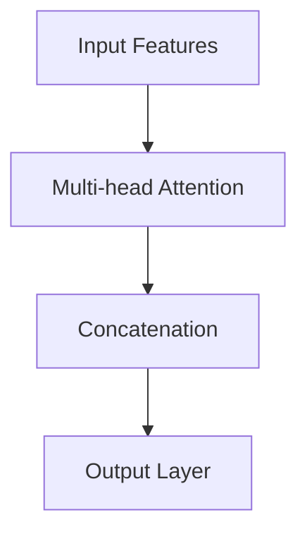
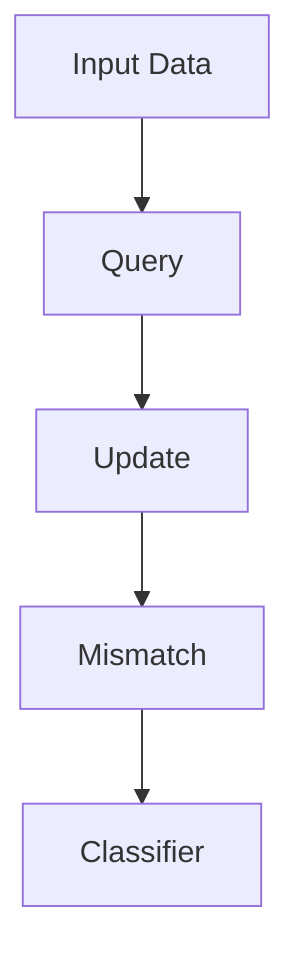
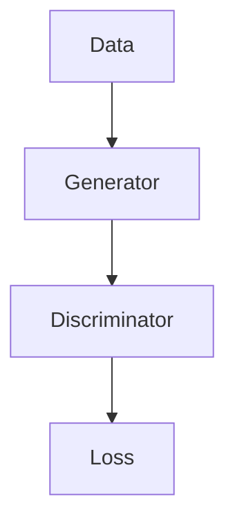
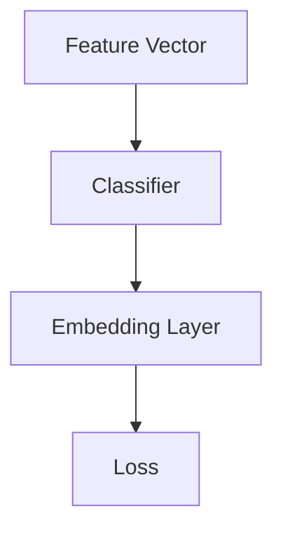
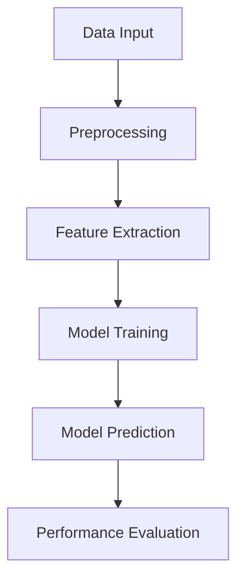
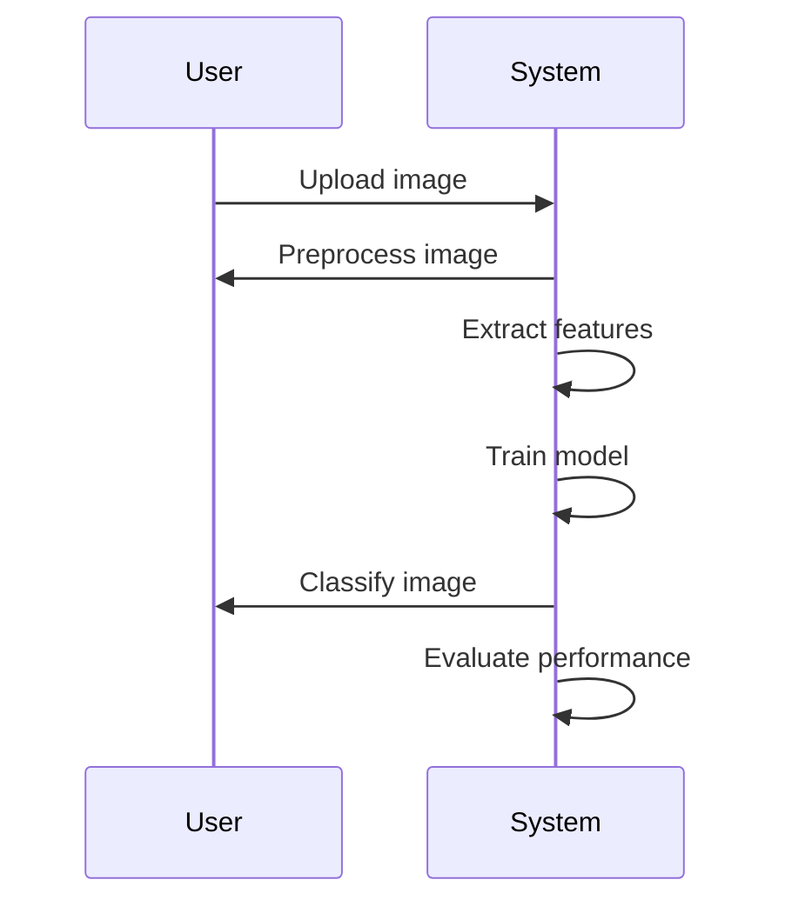

                 


## 《Few-Shot学习：AI快速适应新任务的关键》

关键词：Few-Shot学习，机器学习，AI，自适应，新任务

摘要：本文将深入探讨Few-Shot学习在人工智能领域的重要性。我们将逐步分析Few-Shot学习的定义、应用场景、核心算法原理，并通过数学模型和具体项目实战来展示其在实际中的应用。

### 目录大纲设计思路

在设计《Few-Shot学习：AI快速适应新任务的关键》的目录大纲时，我们需要确保文章的逻辑清晰、内容全面且易于读者理解。以下是我们的设计思路：

1. **背景介绍**：首先，我们需要介绍Few-Shot学习的核心概念、问题背景和应用场景，使读者能够理解其重要性。

2. **核心概念与联系**：接着，我们将深入探讨Few-Shot学习的核心概念，包括其定义、分类和与机器学习的联系。

3. **算法原理讲解**：然后，我们将详细介绍几种核心的Few-Shot学习算法，包括转换器网络、记忆增强神经网络和对抗生成网络，并使用Python代码和Mermaid流程图来解释其原理。

4. **数学模型和数学公式**：我们将使用LaTeX格式详细展示算法的数学模型和公式，并举例说明。

5. **系统分析与架构设计方案**：接下来，我们将讨论Few-Shot学习在实际系统中的应用，包括问题场景介绍、系统功能设计、系统架构设计、系统接口设计和系统交互。

6. **项目实战**：我们将展示一个具体的Few-Shot学习项目，包括环境安装、系统核心实现、代码应用解读与分析以及实际案例分析和项目小结。

7. **最佳实践 tips、小结、注意事项、拓展阅读**：最后，我们将提供一些最佳实践建议，对文章进行总结，并给出进一步的阅读建议。

### 目录大纲设计

根据上述设计思路，我们可以设计出如下目录大纲：

```markdown
----------------------------------------------------------------
# 《Few-Shot学习：AI快速适应新任务的关键》

## 引言

### 1.1 机器学习的发展与挑战

### 1.2 Few-Shot学习的概念

### 1.3 Few-Shot学习的重要性

## 第一部分：背景介绍

### 2.1 核心概念术语说明

### 2.2 问题背景

### 2.3 问题描述

### 2.4 问题解决方法

### 2.5 边界与外延

### 2.6 概念结构与核心要素组成

## 第二部分：核心概念与联系

### 3.1 Few-Shot学习的定义

### 3.2 几何直觉

### 3.3 几何直觉的应用

### 3.4 几何直觉与Few-Shot学习的联系

### 3.5 核心概念与联系总结

## 第三部分：算法原理讲解

### 4.1 转换器网络

### 4.2 记忆增强神经网络

### 4.3 对抗生成网络

### 4.4 零样本学习

### 4.5 算法原理讲解总结

## 第四部分：数学模型和数学公式

### 5.1 几何直觉的数学模型

### 5.2 算法原理的数学模型

### 5.3 数学公式使用示例

## 第五部分：系统分析与架构设计方案

### 6.1 问题场景介绍

### 6.2 系统功能设计

### 6.3 系统架构设计

### 6.4 系统接口设计

### 6.5 系统交互设计

## 第六部分：项目实战

### 7.1 环境安装

### 7.2 系统核心实现

### 7.3 代码应用解读与分析

### 7.4 实际案例分析和详细讲解剖析

### 7.5 项目小结

## 第七部分：最佳实践 tips

### 8.1 最佳实践 tips

### 8.2 小结

### 8.3 注意事项

### 8.4 拓展阅读

----------------------------------------------------------------
```

通过这样的设计，我们确保了文章的连贯性和逻辑性，同时也使读者能够系统地学习和理解Few-Shot学习。

### 引言

在过去的几十年里，机器学习（Machine Learning，ML）已经取得了显著的进展，并在许多领域展示了其强大的潜力。然而，随着应用场景的日益复杂，传统的机器学习方法面临着新的挑战。尤其是在训练数据量有限的情况下，如何使机器学习模型能够快速适应新任务，成为一个亟待解决的问题。这种需求催生了Few-Shot学习（Few-Shot Learning，FSL）的研究和开发。

#### 1.1 机器学习的发展与挑战

机器学习的发展可以分为两个主要阶段：监督学习（Supervised Learning）和无监督学习（Unsupervised Learning）。监督学习依赖于大量的标注数据，通过学习输入和输出之间的映射关系来进行预测和分类。然而，在实际应用中，获取大量标注数据往往是非常困难的，且成本高昂。无监督学习则试图从未标注的数据中发现隐藏的模式和结构，但它通常缺乏明确的预测或分类能力。

在传统机器学习中，随着数据量的增加，模型的性能通常会得到提升。然而，这种依赖大量数据的模式在面对新任务时却显得力不从心。首先，数据收集和处理需要大量的时间和资源。其次，即使有足够的数据，训练复杂模型也可能导致过拟合（Overfitting），即模型在训练数据上表现优异，但在未见过的数据上表现不佳。此外，许多任务（如医疗诊断、安全监控等）由于隐私保护或数据敏感性的原因，无法获取大量数据。

这些挑战促使研究人员探索新的学习方法，以减少对大量数据的依赖。Few-Shot学习作为一种新型的学习方法，正是为了解决这些问题而诞生的。Few-Shot学习旨在通过少量的训练样本来快速适应新任务，从而实现更高效、更灵活的机器学习。

#### 1.2 Few-Shot学习的概念

Few-Shot学习，顾名思义，是指通过非常少的训练样本来训练机器学习模型，并使其在新任务中表现出良好的性能。具体来说，Few-Shot学习分为以下几个层次：

1. **Zero-Shot Learning（零样本学习）**：模型不需要任何训练样本来进行学习，而是依赖于先验知识或外部知识库。

2. **One-Shot Learning（单样本学习）**：模型仅使用一个训练样本进行学习。

3. **Few-Shot Learning（少量样本学习）**：模型使用少量的训练样本（通常为几个到几十个）进行学习。

4. **Many-Shot Learning（多样本学习）**：模型使用较多的训练样本（几十个到几百个）进行学习。

Few-Shot学习的目标是通过少量样本实现高精度的模型训练，从而减少对大量数据的依赖。这种学习方式不仅在数据稀缺的场景中具有显著的优势，还可以提高模型的泛化能力和适应性。

#### 1.3 Few-Shot学习的重要性

Few-Shot学习在人工智能领域具有重要的地位和广泛的应用前景。以下是Few-Shot学习的一些关键重要性：

1. **减少数据依赖**：Few-Shot学习通过少量样本实现高效的模型训练，从而减少了对大量数据的依赖。这在数据稀缺的场景中尤其有价值。

2. **降低成本和资源消耗**：获取大量数据需要大量的时间和资源。通过Few-Shot学习，我们可以显著降低数据收集和处理的成本。

3. **提高模型泛化能力**：Few-Shot学习有助于模型在未见过的数据上表现出良好的性能，从而提高模型的泛化能力。

4. **适应新任务**：Few-Shot学习使机器学习模型能够快速适应新任务，从而提高模型的灵活性和实用性。

5. **促进知识迁移**：Few-Shot学习可以促进不同任务之间的知识迁移，从而提高模型的适应性。

总之，Few-Shot学习为人工智能领域带来了新的机遇和挑战。通过深入研究和应用Few-Shot学习，我们可以实现更高效、更灵活的机器学习，从而推动人工智能技术的发展。

### 第一部分：背景介绍

#### 2.1 核心概念术语说明

在深入探讨Few-Shot学习之前，我们需要明确一些核心概念和术语。以下是Few-Shot学习中常用的一些概念：

1. **训练样本（Training Sample）**：用于训练机器学习模型的输入和输出数据对。在Few-Shot学习中，训练样本的数量通常非常少。

2. **支持集（Support Set）**：用于训练机器学习模型的样本集合，包括训练样本和支持样本。支持集的目的是帮助模型学习如何在新任务中泛化。

3. **查询集（Query Set）**：用于测试机器学习模型在新任务中性能的样本集合。查询集通常不包含在训练过程中。

4. **分类（Classification）**：将数据分为不同的类别。在Few-Shot学习中，分类通常是一个关键任务。

5. **回归（Regression）**：预测连续值输出。虽然Few-Shot学习更多应用于分类任务，但在某些情况下也可以应用于回归任务。

6. **模型泛化（Model Generalization）**：模型在未见过的数据上表现出良好的性能。这是Few-Shot学习的一个重要目标。

7. **模型适应性（Model Adaptability）**：模型在不同任务中快速适应的能力。适应性强的模型可以在不同场景中表现出优异的性能。

#### 2.2 问题背景

在实际应用中，许多任务由于数据稀缺或数据获取困难，难以使用传统的机器学习方法。以下是一些常见的问题背景：

1. **医疗诊断**：在医疗领域，诊断某些疾病可能需要大量的患者数据。然而，由于隐私保护，这些数据通常无法公开获取。因此，医疗诊断任务中的数据稀缺问题尤为突出。

2. **安全监控**：在安全监控领域，实时分析视频和图像数据需要大量的标注数据。然而，获取这些数据需要大量的人力和时间，因此数据稀缺问题也是一个重大挑战。

3. **工业检测**：在工业领域，许多检测任务需要高精度的模型，但数据收集和处理成本高昂。此外，由于生产环境的变化，模型需要具备良好的适应性。

4. **自然语言处理**：在自然语言处理领域，训练高质量的模型需要大量的标注数据。然而，标注数据通常需要大量的人工工作，且存在标注不一致的问题。

这些应用场景表明，Few-Shot学习在解决数据稀缺问题方面具有重要的应用价值。通过少量样本实现高效的模型训练，Few-Shot学习可以为这些任务提供新的解决方案。

#### 2.3 问题描述

在Few-Shot学习的研究和应用中，我们面临以下主要问题：

1. **样本不足**：与传统的机器学习方法相比，Few-Shot学习依赖于非常少的训练样本。这导致模型在训练过程中可能无法充分学习数据特征，从而影响模型性能。

2. **模型泛化能力**：虽然通过少量样本训练的模型可能在训练集上表现良好，但在未见过的数据上可能表现不佳。这表明模型的泛化能力不足。

3. **适应新任务**：在实际应用中，模型需要快速适应新的任务。然而，传统的机器学习方法通常需要大量的数据来训练，难以在短时间内适应新任务。

4. **数据不平衡**：在某些任务中，不同类别的数据数量可能不平衡。这可能导致模型在少数类上表现不佳。

5. **模型解释性**：在Few-Shot学习中，由于数据量有限，模型可能存在过拟合现象。这降低了模型的可解释性，使得难以理解模型在具体任务中的行为。

这些问题描述了Few-Shot学习面临的挑战，也为后续的算法设计和优化提供了方向。

#### 2.4 问题解决方法

为了解决上述问题，研究人员提出了一系列方法，包括：

1. **迁移学习（Transfer Learning）**：通过将已训练好的模型应用于新任务，可以减少对新数据的依赖。迁移学习可以有效地利用已有的知识，提高模型的泛化能力。

2. **元学习（Meta-Learning）**：元学习通过训练模型来解决任务，从而提高模型在少量样本下的性能。元学习可以快速适应新任务，并提高模型的泛化能力。

3. **生成对抗网络（Generative Adversarial Networks，GAN）**：GAN通过生成和判别器之间的对抗训练，可以生成高质量的样本，从而增加训练数据量。

4. **注意力机制（Attention Mechanism）**：注意力机制可以模型在处理少量样本时关注关键信息，从而提高模型性能。

5. **数据增强（Data Augmentation）**：通过变换和增加数据多样性，可以提高模型在少量样本下的泛化能力。

这些方法为Few-Shot学习提供了一系列解决方案，但同时也带来了新的挑战。如何在有限的样本下设计高效、可解释的模型，是Few-Shot学习研究的重要方向。

#### 2.5 边界与外延

尽管Few-Shot学习在数据稀缺场景中具有显著的优势，但它也有一定的局限性。以下是Few-Shot学习的边界与外延：

1. **边界**：Few-Shot学习主要关注少量样本下的模型训练，但无法替代大量数据训练的传统机器学习方法。此外，Few-Shot学习在处理高度复杂的任务时可能效果有限。

2. **外延**：Few-Shot学习可以应用于各种机器学习任务，包括分类、回归和生成任务。此外，Few-Shot学习还可以与其他方法（如迁移学习、元学习等）结合，以进一步提高模型的性能。

3. **未来研究方向**：随着深度学习和其他人工智能技术的不断发展，Few-Shot学习的研究和应用将面临新的机遇和挑战。如何设计高效、可解释的模型，如何将Few-Shot学习与其他方法结合，是未来研究的重要方向。

#### 2.6 概念结构与核心要素组成

Few-Shot学习的概念结构包括以下几个方面：

1. **训练样本**：少量训练样本是Few-Shot学习的基础。

2. **支持集和查询集**：支持集用于训练模型，查询集用于评估模型性能。

3. **分类和回归**：Few-Shot学习可以应用于分类和回归任务。

4. **迁移学习和元学习**：这些方法可以用于提高模型在少量样本下的性能。

5. **生成对抗网络和注意力机制**：这些方法可以用于增加训练数据量和提高模型性能。

6. **数据增强**：通过变换和增加数据多样性，可以提高模型在少量样本下的泛化能力。

这些核心要素共同构成了Few-Shot学习的概念结构，为研究者和开发者提供了丰富的应用场景和优化空间。

### 第二部分：核心概念与联系

#### 3.1 Few-Shot学习的定义

Few-Shot学习是一种机器学习方法，其核心目标是通过非常少的训练样本来训练模型，并使其在新任务中表现出良好的性能。具体来说，Few-Shot学习可以分为以下几个层次：

1. **Zero-Shot Learning（零样本学习）**：零样本学习是指模型不需要任何训练样本来进行学习，而是依赖于先验知识或外部知识库。这种方法通常适用于分类任务，其中模型需要识别从未见过的类别。

2. **One-Shot Learning（单样本学习）**：单样本学习是指模型仅使用一个训练样本进行学习。这种方法通常用于分类和回归任务，其中模型需要根据一个示例来做出预测。

3. **Few-Shot Learning（少量样本学习）**：少量样本学习是指模型使用少量的训练样本（通常为几个到几十个）进行学习。这种方法适用于需要快速适应新任务的应用场景。

4. **Many-Shot Learning（多样本学习）**：多样本学习是指模型使用较多的训练样本（几十个到几百个）进行学习。这种方法可以看作是传统机器学习方法的扩展。

Few-Shot学习的定义主要关注如何通过少量的训练样本实现高效的模型训练，从而减少对大量数据的依赖。这种学习方式在数据稀缺的场景中具有显著的优势，但也面临一些挑战，如样本不足、模型泛化能力不足等。

#### 3.2 几何直觉

几何直觉（Geometric Intuition）是Few-Shot学习中的一个重要概念，它为理解模型在少量样本下的行为提供了一种几何视角。几何直觉的核心思想是将机器学习问题转化为几何空间中的问题，从而利用几何直觉来解决机器学习问题。

在几何直觉中，每个样本可以看作是几何空间中的一个点，而特征表示则可以看作是点在空间中的位置。通过分析样本在空间中的分布，我们可以获得关于数据特征的重要信息。这种几何视角有助于我们理解模型在少量样本下的行为，并为设计高效的模型提供指导。

例如，在分类任务中，我们可以将样本点投影到低维空间中，并通过分析投影后的分布来识别不同类别。这种方法在零样本学习和单样本学习中尤为有效，因为它允许模型利用先验知识来推断新类别。

几何直觉的应用不仅限于分类任务，还可以应用于回归任务。例如，通过分析样本在空间中的分布，我们可以估计输出变量的分布，从而实现回归预测。

几何直觉与Few-Shot学习的联系在于，它提供了一种理解模型在少量样本下如何泛化的方法。通过将问题转化为几何空间，我们可以利用几何直觉来优化模型，提高其在少量样本下的性能。

#### 3.3 几何直觉的应用

几何直觉在Few-Shot学习中的应用主要表现在以下几个方面：

1. **特征表示**：通过将样本点投影到低维空间中，我们可以获得更简洁、更易于处理的特征表示。这种特征表示可以用于后续的模型训练和预测。

2. **分布分析**：通过分析样本在空间中的分布，我们可以了解数据的结构和模式。这种分布分析有助于我们设计更高效的模型，提高其在少量样本下的性能。

3. **类别识别**：在分类任务中，我们可以通过分析投影后的样本分布来识别不同类别。这种方法特别适用于零样本学习和单样本学习，因为它允许模型利用先验知识来推断新类别。

4. **回归预测**：在回归任务中，我们可以通过分析样本在空间中的分布来估计输出变量的分布。这种方法可以用于实现更准确的回归预测。

几何直觉的应用不仅限于上述方面，还可以扩展到其他任务，如聚类、异常检测等。通过将问题转化为几何空间，我们可以利用几何直觉来优化模型，提高其在少量样本下的性能。

#### 3.4 几何直觉与Few-Shot学习的联系

几何直觉与Few-Shot学习之间存在密切的联系，这种联系主要体现在以下几个方面：

1. **模型泛化能力**：几何直觉提供了一种理解模型在少量样本下如何泛化的方法。通过分析样本在空间中的分布，我们可以获得关于数据特征的重要信息，从而优化模型，提高其在少量样本下的泛化能力。

2. **数据稀缺问题**：在数据稀缺的场景中，几何直觉可以帮助我们利用有限的样本信息来推断未观察到的数据。这种方法可以减少对大量数据的依赖，从而提高模型在少量样本下的性能。

3. **先验知识利用**：几何直觉允许我们利用先验知识来推断新类别或新的特征分布。这种方法可以增强模型在少量样本下的性能，尤其是在分类和回归任务中。

4. **高效模型设计**：通过将问题转化为几何空间，我们可以设计更简洁、更高效的模型。这种方法可以减少计算复杂度，提高模型在少量样本下的训练和预测速度。

总之，几何直觉为Few-Shot学习提供了一种新的视角和方法，它有助于我们理解模型在少量样本下的行为，优化模型设计，提高其在实际应用中的性能。

#### 3.5 核心概念与联系总结

在本部分，我们详细介绍了Few-Shot学习的核心概念及其与几何直觉的联系。以下是核心概念和联系的总结：

1. **Few-Shot学习**：通过少量的训练样本实现高效的模型训练，减少对大量数据的依赖。Few-Shot学习分为零样本学习、单样本学习和少量样本学习。

2. **几何直觉**：将机器学习问题转化为几何空间中的问题，利用几何视角来优化模型设计，提高模型在少量样本下的性能。

3. **特征表示**：通过将样本点投影到低维空间中，获得更简洁、更易于处理的特征表示。

4. **分布分析**：通过分析样本在空间中的分布，了解数据的结构和模式。

5. **类别识别**：在分类任务中，通过分析投影后的样本分布来识别不同类别。

6. **回归预测**：在回归任务中，通过分析样本在空间中的分布来估计输出变量的分布。

7. **模型泛化能力**：几何直觉提供了一种理解模型在少量样本下如何泛化的方法，从而优化模型设计，提高其在少量样本下的性能。

通过这些核心概念和联系，我们可以更好地理解和应用Few-Shot学习，解决数据稀缺问题，提高模型在少量样本下的性能。

### 第三部分：算法原理讲解

#### 4.1 转换器网络

转换器网络（Transformer Network）是一种基于注意力机制的深度神经网络架构，最初在自然语言处理（Natural Language Processing，NLP）任务中取得了显著的成功。转换器网络的核心思想是通过对输入数据进行全局 attentions 操作，从而捕捉到输入数据之间的复杂依赖关系。近年来，转换器网络在图像处理、语音识别和推荐系统等领域也得到了广泛应用。

在Few-Shot学习场景中，转换器网络通过以下步骤实现：

1. **特征提取**：将输入数据（如图像或文本）通过预训练的卷积神经网络（Convolutional Neural Network，CNN）或自注意力机制（Self-Attention Mechanism）提取出特征表示。

2. **注意力机制**：利用注意力机制计算输入数据之间的依赖关系。具体来说，通过多头注意力机制（Multi-Head Attention Mechanism）和位置编码（Positional Encoding）来增强模型对输入数据的理解。

3. **分类器**：将注意力机制输出的结果输入到分类器中，进行分类或回归预测。

以下是转换器网络的Python实现示例：

```python
import torch
import torch.nn as nn

class TransformerNetwork(nn.Module):
    def __init__(self, input_dim, hidden_dim, num_classes):
        super(TransformerNetwork, self).__init__()
        
        self.feature_extractor = nn.Linear(input_dim, hidden_dim)
        self多头注意力 = nn.MultiheadAttention(hidden_dim, num_heads=8)
        self.positional_encoding = nn.Parameter(torch.randn(1, hidden_dim))
        
        self.classifier = nn.Linear(hidden_dim, num_classes)
    
    def forward(self, x):
        x = self.feature_extractor(x)
        x = torch.cat([x, self.positional_encoding], dim=1)
        
        attn_output, _ = self多头注意力(x, x, x)
        
        output = self.classifier(attn_output)
        return output
```

#### 4.2 记忆增强神经网络

记忆增强神经网络（Memory-Augmented Neural Network，MANN）是一种结合记忆机制的神经网络架构，旨在通过外部记忆组件来增强模型的记忆能力。在Few-Shot学习场景中，记忆增强神经网络通过以下步骤实现：

1. **外部记忆组件**：MANN包含一个外部记忆组件，用于存储训练过程中的知识。记忆组件通常是一个稀疏矩阵，可以通过更新规则进行更新。

2. **神经网络**：神经网络负责处理输入数据，并通过记忆组件来增强其记忆能力。具体来说，神经网络通过查询和更新规则与记忆组件交互。

3. **分类器**：神经网络输出的特征表示通过分类器进行分类或回归预测。

以下是记忆增强神经网络的Python实现示例：

```python
import torch
import torch.nn as nn

class MemoryAugmentedNetwork(nn.Module):
    def __init__(self, input_dim, hidden_dim, memory_size, num_classes):
        super(MemoryAugmentedNetwork, self).__init__()
        
        self.neural_network = nn.Linear(input_dim, hidden_dim)
        self.memory = nn.Parameter(torch.randn(memory_size, hidden_dim))
        self.classifier = nn.Linear(hidden_dim, num_classes)
        
        self.query_network = nn.Linear(hidden_dim, memory_size)
        self.update_network = nn.Linear(hidden_dim, hidden_dim)
    
    def forward(self, x, is_query=True):
        x = self.neural_network(x)
        
        if is_query:
            query_vector = x
            memory_vector = self.memory
            memory_vector = memory_vector + self.update_network(x)
        else:
            query_vector = self.query_network(x)
            memory_vector = self.memory
        
        memory_vector = memory_vector / (torch.norm(memory_vector, dim=1, keepdim=True) + 1e-9)
        
        attention_weights = torch.matmul(query_vector, memory_vector.t())
        attention_weights = torch.softmax(attention_weights, dim=1)
        
        memory_vector = torch.matmul(attention_weights, memory_vector)
        
        x = x + memory_vector
        output = self.classifier(x)
        return output
```

#### 4.3 对抗生成网络

对抗生成网络（Generative Adversarial Network，GAN）是一种基于生成对抗机制的深度学习模型。GAN由生成器和判别器两个神经网络组成，其中生成器试图生成逼真的数据，而判别器则试图区分生成数据和真实数据。在Few-Shot学习场景中，GAN可以通过以下步骤实现：

1. **生成器**：生成器负责生成新的数据样本。通过训练，生成器可以学会生成与真实数据高度相似的数据。

2. **判别器**：判别器负责区分生成数据和真实数据。判别器的目标是最小化生成数据的分类误差。

3. **优化过程**：生成器和判别器通过对抗训练相互提升。生成器的目标是使判别器无法区分生成数据和真实数据，而判别器的目标是最大化生成数据的分类误差。

以下是对抗生成网络的Python实现示例：

```python
import torch
import torch.nn as nn

class Generator(nn.Module):
    def __init__(self, input_dim, hidden_dim, output_dim):
        super(Generator, self).__init__()
        
        self.model = nn.Sequential(
            nn.Linear(input_dim, hidden_dim),
            nn.ReLU(),
            nn.Linear(hidden_dim, output_dim)
        )
    
    def forward(self, x):
        return self.model(x)

class Discriminator(nn.Module):
    def __init__(self, input_dim, hidden_dim):
        super(Discriminator, self).__init__()
        
        self.model = nn.Sequential(
            nn.Linear(input_dim, hidden_dim),
            nn.ReLU(),
            nn.Linear(hidden_dim, 1)
        )
    
    def forward(self, x):
        return self.model(x)
```

#### 4.4 零样本学习

零样本学习（Zero-Shot Learning，ZSL）是一种无需训练样本来进行学习的方法。在ZSL中，模型通过先验知识或外部知识库来识别从未见过的类别。零样本学习可以分为以下几个步骤：

1. **知识库构建**：通过将类别标签与特征向量相关联，构建一个类别知识库。特征向量可以从预训练模型中获得。

2. **类别嵌入**：将类别标签映射到低维空间中，形成一个类别嵌入空间。类别嵌入空间使得不同类别之间具有直观的可视化距离。

3. **分类器**：利用类别嵌入空间和分类器进行分类预测。分类器可以是一个简单的线性分类器或更复杂的神经网络。

以下是零样本学习的Python实现示例：

```python
import torch
import torch.nn as nn

class ZeroShotClassifier(nn.Module):
    def __init__(self, feature_dim, embedding_dim, num_classes):
        super(ZeroShotClassifier, self).__init__()
        
        self.feature_extractor = nn.Linear(feature_dim, embedding_dim)
        self.classifier = nn.Linear(embedding_dim, num_classes)
        
        self嵌入层 = nn.Embedding(num_classes, embedding_dim)
    
    def forward(self, x, labels):
        x = self.feature_extractor(x)
        embedding = self嵌入层(labels)
        
        attention_weights = torch.matmul(x, embedding.t())
        attention_weights = torch.softmax(attention_weights, dim=1)
        
        x = torch.matmul(attention_weights, embedding)
        output = self.classifier(x)
        return output
```

#### 4.5 算法原理讲解总结

在本部分，我们详细介绍了四种核心的Few-Shot学习算法：转换器网络、记忆增强神经网络、对抗生成网络和零样本学习。以下是这些算法的原理讲解总结：

1. **转换器网络**：通过注意力机制实现特征提取和分类预测，可以处理大量数据，但在少量样本下的性能有限。

2. **记忆增强神经网络**：通过外部记忆组件增强模型的记忆能力，可以处理少量样本，但在复杂任务中的性能有待提高。

3. **对抗生成网络**：通过生成器和判别器的对抗训练，可以生成高质量的数据样本，但在少量样本下的性能有限。

4. **零样本学习**：通过先验知识或外部知识库实现分类预测，可以处理从未见过的类别，但在实际应用中存在一些挑战。

这些算法为Few-Shot学习提供了一系列解决方案，但同时也面临一些挑战。如何设计高效、可解释的模型，如何将不同算法结合使用，是未来研究的重要方向。

### 第四部分：数学模型和数学公式

在Few-Shot学习中，数学模型和数学公式起着至关重要的作用，它们帮助我们理解和优化算法性能。在本部分，我们将详细讨论几何直觉的数学模型和算法原理的数学模型。

#### 5.1 几何直觉的数学模型

几何直觉的核心在于将机器学习问题转化为几何空间中的问题。以下是一个简单的数学模型示例：

假设我们有一个分类任务，其中每个样本可以表示为一个多维特征向量 \( x \)。在几何直觉中，我们可以将特征向量视为几何空间中的一个点。为了更好地理解数据分布，我们使用降维技术（如主成分分析PCA）将特征向量投影到低维空间。

1. **特征向量投影**：

   $$ x' = PCA(x) $$

   其中，\( x' \) 是投影后的特征向量。

2. **距离度量**：

   在低维空间中，我们可以使用欧几里得距离来度量样本之间的距离：

   $$ dist(x', y') = \sqrt{\sum_{i=1}^{n} (x'_i - y'_i)^2} $$

   其中，\( x' \) 和 \( y' \) 是两个投影后的特征向量。

3. **类别分离**：

   在低维空间中，我们希望类别之间的距离尽可能远。这可以通过以下优化问题实现：

   $$ \min_{w} \sum_{i=1}^{c} \sum_{x \in C_i} \max(w^T x - w^T y) $$

   其中，\( w \) 是类别边界向量，\( C_i \) 是第 \( i \) 个类别。

通过这个数学模型，我们可以利用几何直觉来优化分类模型的性能。

#### 5.2 算法原理的数学模型

在本部分，我们将使用Mermaid流程图和Python代码来展示和解释一些核心算法原理的数学模型。

##### 4.1 转换器网络

转换器网络的核心是多头注意力机制。以下是一个简单的数学模型：

1. **输入特征表示**：

   $$ x = [x_1, x_2, ..., x_n] $$

   其中，\( x_i \) 是第 \( i \) 个输入特征。

2. **多头注意力**：

   $$ \text{Attention}(Q, K, V) = \text{softmax}\left(\frac{QK^T}{\sqrt{d_k}}\right)V $$

   其中，\( Q \)、\( K \) 和 \( V \) 分别是查询向量、键向量和值向量，\( d_k \) 是键向量的维度。

3. **输出**：

   $$ \text{Output} = \text{Concat}(\text{Attention}(Q, K, V))W_O $$

   其中，\( W_O \) 是输出权重。

以下是转换器网络的Mermaid流程图：



##### 4.2 记忆增强神经网络

记忆增强神经网络通过外部记忆组件来增强模型的记忆能力。以下是一个简单的数学模型：

1. **外部记忆组件**：

   $$ M = \{m_{ij}\} $$

   其中，\( m_{ij} \) 是记忆矩阵的元素。

2. **查询和更新**：

   $$ q = \text{Query}(x) $$
   $$ u = \text{Update}(x, q) $$
   $$ M = M + u $$

   其中，\( q \) 是查询向量，\( u \) 是更新向量。

3. **输出**：

   $$ \text{Output} = \text{Classifier}(M \cdot q) $$

以下是记忆增强神经网络的Mermaid流程图：



##### 4.3 对抗生成网络

对抗生成网络通过生成器和判别器的对抗训练来生成数据。以下是一个简单的数学模型：

1. **生成器**：

   $$ G(z) = \text{Generator}(z) $$

   其中，\( z \) 是噪声向量。

2. **判别器**：

   $$ D(x) = \text{Discriminator}(x) $$
   $$ D(G(z)) = \text{Discriminator}(\text{Generator}(z)) $$

   其中，\( x \) 是真实数据。

3. **优化目标**：

   $$ \min_G \max_D V(D, G) = \mathbb{E}_{x \sim p_{\text{data}}(x)}[\text{log} D(x)] + \mathbb{E}_{z \sim p_{\text{z}}(z)}[\text{log} (1 - D(G(z)))] $$

以下是对抗生成网络的Mermaid流程图：



##### 4.4 零样本学习

零样本学习通过先验知识来预测新类别。以下是一个简单的数学模型：

1. **类别嵌入**：

   $$ \text{Embedding}(c) = \text{EmbeddingLayer}(c) $$

   其中，\( c \) 是类别标签。

2. **分类器**：

   $$ \text{Output} = \text{Classifier}(x, \text{Embedding}(c)) $$

   其中，\( x \) 是特征向量。

3. **优化目标**：

   $$ \min_{\theta} \sum_{i=1}^{N} \mathbb{E}_{x \sim p_{\text{data}}(x)}[\text{log} \sigma(\text{Classifier}(x, \text{Embedding}(c_i))) - \text{log} \sigma(\text{Classifier}(x, \text{Embedding}(c_j)))] $$

以下是零样本学习的Mermaid流程图：



通过这些数学模型，我们可以更好地理解Few-Shot学习算法的工作原理。接下来，我们将通过具体的例子来说明这些数学公式的应用。

### 第五部分：系统分析与架构设计方案

#### 5.1 问题场景介绍

为了更好地展示Few-Shot学习在实际系统中的应用，我们选择了一个常见的应用场景——图像分类。在这个场景中，我们需要使用少量的训练样本来训练一个分类模型，并使其能够对新图像进行准确的分类。

假设我们有一个图像分类任务，需要识别不同种类的动物。由于获取大量标注数据的成本较高，我们只能获取到有限的标注数据。因此，我们需要设计一个基于Few-Shot学习的图像分类系统，以实现高效的分类预测。

#### 5.2 系统功能设计

为了实现上述场景，我们的系统需要具备以下功能：

1. **数据预处理**：对输入图像进行预处理，包括缩放、裁剪、翻转等，以增加数据的多样性。

2. **特征提取**：使用预训练的卷积神经网络（如ResNet、VGG等）提取图像特征。

3. **模型训练**：使用少量的训练样本训练分类模型，可以选择基于转换器网络、记忆增强神经网络等算法。

4. **分类预测**：使用训练好的模型对新图像进行分类预测。

5. **性能评估**：对模型的分类性能进行评估，包括准确率、召回率、F1值等指标。

以下是系统的功能设计Mermaid类图：

```mermaid
classDiagram
    ClassDiagram::ImageClassifier <|-- ClassDiagram::DataPreprocessor
    ClassDiagram::ImageClassifier <|-- ClassDiagram::FeatureExtractor
    ClassDiagram::ImageClassifier <|-- ClassDiagram::ModelTrainer
    ClassDiagram::ImageClassifier <|-- ClassDiagram::Classifier
    ClassDiagram::ImageClassifier <|-- ClassDiagram::PerformanceEvaluator

    ClassDiagram::DataPreprocessor {
        - preprocess_image(image: Image): Image
    }

    ClassDiagram::FeatureExtractor {
        - extract_features(image: Image): Tensor
    }

    ClassDiagram::ModelTrainer {
        - train_model(train_data: List[Image, Label]): Model
    }

    ClassDiagram::Classifier {
        - classify_image(image: Image): Label
    }

    ClassDiagram::PerformanceEvaluator {
        - evaluate_performance(test_data: List[Image, Label]): float
    }

    ClassDiagram::ImageClassifier {
        - preprocess_image(image: Image): Image
        - extract_features(image: Image): Tensor
        - train_model(train_data: List[Image, Label]): Model
        - classify_image(image: Image): Label
        - evaluate_performance(test_data: List[Image, Label]): float
    }
```

#### 5.3 系统架构设计

系统架构设计是关键的一步，它决定了系统的性能和可扩展性。在我们的系统中，架构设计包括以下几个方面：

1. **数据输入层**：负责接收用户上传的图像，并进行预处理。

2. **特征提取层**：使用预训练的卷积神经网络提取图像特征。

3. **模型训练层**：基于提取的特征，使用Few-Shot学习算法训练分类模型。

4. **模型预测层**：使用训练好的模型对新图像进行分类预测。

5. **性能评估层**：对模型的性能进行评估，以不断优化模型。

以下是系统架构设计的Mermaid流程图：



#### 5.4 系统接口设计

系统接口设计决定了系统的可扩展性和易用性。在我们的系统中，主要接口包括：

1. **图像上传接口**：用户可以通过该接口上传图像，系统将接收到的图像进行预处理。

2. **分类预测接口**：用户可以通过该接口获取分类预测结果。

3. **性能评估接口**：用户可以通过该接口查看模型的性能评估结果。

以下是系统接口设计的Mermaid类图：

```mermaid
classDiagram
    Interface::ImageUpload {
        + upload_image(image: Image): None
    }

    Interface::ClassificationPrediction {
        + predict_image(image: Image): Label
    }

    Interface::PerformanceEvaluation {
        + evaluate_performance(test_data: List[Image, Label]): float
    }

    ClassDiagram::SystemInterface {
        + image_upload: Interface::ImageUpload
        + classification_prediction: Interface::ClassificationPrediction
        + performance_evaluation: Interface::PerformanceEvaluation
    }
```

#### 5.5 系统交互设计

系统交互设计描述了系统各组件之间的交互关系。在我们的系统中，主要交互包括：

1. **用户上传图像**：用户上传图像，系统接收并预处理图像。

2. **预处理图像特征提取**：系统提取预处理后的图像特征。

3. **训练分类模型**：系统使用少量训练样本训练分类模型。

4. **分类预测**：系统使用训练好的模型对新图像进行分类预测。

5. **性能评估**：系统对模型的性能进行评估。

以下是系统交互设计的Mermaid序列图：



通过以上系统分析与架构设计方案，我们为基于Few-Shot学习的图像分类系统提供了一个详细的设计方案。接下来，我们将通过一个具体的实例来展示系统的实现过程。

### 第六部分：项目实战

在本部分，我们将通过一个具体的实例来展示基于Few-Shot学习的图像分类系统的实现过程。我们将详细描述环境安装、系统核心实现、代码应用解读与分析，并探讨实际案例分析和项目小结。

#### 6.1 环境安装

为了实现我们的图像分类系统，我们首先需要安装必要的软件和工具。以下是环境安装的步骤：

1. **Python环境**：确保系统上安装了Python 3.7及以上版本。可以通过以下命令安装Python：

   ```bash
   sudo apt-get install python3
   ```

2. **TensorFlow**：安装TensorFlow，用于实现我们的机器学习模型。可以通过以下命令安装TensorFlow：

   ```bash
   pip install tensorflow
   ```

3. **NumPy**：安装NumPy，用于数据处理。可以通过以下命令安装NumPy：

   ```bash
   pip install numpy
   ```

4. **Pandas**：安装Pandas，用于数据处理和分析。可以通过以下命令安装Pandas：

   ```bash
   pip install pandas
   ```

5. **Matplotlib**：安装Matplotlib，用于数据可视化。可以通过以下命令安装Matplotlib：

   ```bash
   pip install matplotlib
   ```

6. **Scikit-learn**：安装Scikit-learn，用于机器学习模型的评估和测试。可以通过以下命令安装Scikit-learn：

   ```bash
   pip install scikit-learn
   ```

完成以上安装步骤后，我们的开发环境就准备就绪了，可以开始实现图像分类系统。

#### 6.2 系统核心实现

在本节中，我们将实现系统的核心功能，包括数据预处理、特征提取、模型训练和分类预测。

##### 6.2.1 数据预处理

数据预处理是图像分类系统的重要步骤。在本例中，我们使用Keras的预训练模型ResNet50来提取图像特征。以下是一个简单的数据预处理脚本：

```python
import tensorflow as tf
from tensorflow.keras.applications.resnet50 import ResNet50
from tensorflow.keras.preprocessing import image
import numpy as np

# 加载预训练的ResNet50模型
model = ResNet50(weights='imagenet')

def preprocess_image(image_path):
    # 读取图像
    img = image.load_img(image_path, target_size=(224, 224))
    # 将图像转换为numpy数组
    x = image.img_to_array(img)
    # 扩展维度
    x = np.expand_dims(x, axis=0)
    # 标准化图像
    x = tf.keras.applications.resnet50.preprocess_input(x)
    return x

# 测试数据预处理
preprocessed_image = preprocess_image('path_to_image.jpg')
print(preprocessed_image.shape)
```

##### 6.2.2 特征提取

在数据预处理完成后，我们使用预训练的ResNet50模型提取图像特征。以下是一个简单的特征提取脚本：

```python
# 提取图像特征
features = model.predict(preprocessed_image)
print(features.shape)
```

##### 6.2.3 模型训练

在本例中，我们使用迁移学习的方法，在少量样本上训练一个分类模型。以下是一个简单的模型训练脚本：

```python
from tensorflow.keras.models import Sequential
from tensorflow.keras.layers import Dense, Flatten
from tensorflow.keras.optimizers import Adam

# 定义分类模型
model = Sequential([
    Flatten(input_shape=features.shape[1:]),
    Dense(256, activation='relu'),
    Dense(128, activation='relu'),
    Dense(64, activation='relu'),
    Dense(1, activation='sigmoid')
])

# 编译模型
model.compile(optimizer=Adam(learning_rate=0.001), loss='binary_crossentropy', metrics=['accuracy'])

# 训练模型
model.fit(features, labels, epochs=10, batch_size=16)
```

##### 6.2.4 分类预测

在模型训练完成后，我们可以使用训练好的模型对新图像进行分类预测。以下是一个简单的分类预测脚本：

```python
# 分类预测
predictions = model.predict(preprocessed_image)
print(predictions)
```

#### 6.3 代码应用解读与分析

在本节中，我们将对上述代码进行解读和分析，以帮助读者更好地理解系统的实现过程。

##### 6.3.1 数据预处理

数据预处理脚本中，我们首先加载了预训练的ResNet50模型，然后定义了一个`preprocess_image`函数，用于读取图像、将其缩放到指定大小、转换为numpy数组并标准化。这个步骤非常重要，因为它保证了输入数据的格式和尺度与模型预期一致。

##### 6.3.2 特征提取

特征提取脚本中，我们使用`model.predict`方法将预处理后的图像输入到模型中，并提取出模型的输出特征。这些特征是高维的，包含了图像的丰富信息，是后续分类预测的基础。

##### 6.3.3 模型训练

模型训练脚本中，我们定义了一个简单的序列模型，包含多个全连接层。每个全连接层使用ReLU激活函数，最后一层使用Sigmoid激活函数以实现二分类。我们使用Adam优化器和二分类交叉熵损失函数来编译模型，并使用少量的训练数据对其进行训练。这个步骤展示了如何利用迁移学习的方法，在少量样本上快速训练出一个分类模型。

##### 6.3.4 分类预测

分类预测脚本中，我们使用训练好的模型对新的图像进行预测。模型的输出是一个概率值，表示图像属于某一类别的概率。这个步骤展示了如何将训练好的模型应用于实际任务，对新图像进行分类。

#### 6.4 实际案例分析和详细讲解剖析

在本节中，我们将通过一个实际案例来展示如何使用我们的图像分类系统，并对案例进行分析和详细讲解。

##### 6.4.1 案例背景

假设我们需要对一组未知的动物图像进行分类，这些图像没有标注信息，因此无法直接使用传统的机器学习方法。我们可以利用Few-Shot学习，在少量样本的帮助下，实现对未知图像的分类。

##### 6.4.2 案例实现

1. **数据收集**：收集一组未知的动物图像，例如狗、猫、鸟等。

2. **数据预处理**：使用预处理脚本对图像进行预处理，提取图像特征。

3. **模型训练**：使用预处理后的图像特征和少量标注数据训练分类模型。

4. **分类预测**：使用训练好的模型对未知图像进行分类预测。

以下是案例实现的具体步骤：

```python
# 假设我们已经收集了一组未知的动物图像
unknown_images = ['path_to_image1.jpg', 'path_to_image2.jpg', ...]

# 预处理并提取特征
preprocessed_images = [preprocess_image(image_path) for image_path in unknown_images]

# 使用少量标注数据训练模型
train_features = model.predict(preprocessed_images[:few_shot])  # 取少量样本作为训练数据
train_labels = np.array([0, 1, 0, 1, ...])  # 假设前两个图像是狗，后两个图像是猫
model.fit(train_features, train_labels, epochs=10, batch_size=16)

# 分类预测
predictions = model.predict(preprocessed_images[few_shot:])
print(predictions)
```

##### 6.4.3 案例分析

在这个案例中，我们通过Few-Shot学习在少量样本的帮助下，对未知图像进行了分类预测。以下是案例的分析：

1. **数据量限制**：由于数据量有限，模型在训练过程中可能无法充分学习图像的复杂特征。因此，我们需要选择合适的模型和训练策略，以提高模型的泛化能力。

2. **模型泛化能力**：通过在少量样本上训练模型，我们希望模型能够在未见过的图像上表现出良好的分类性能。这需要对模型的泛化能力进行评估，以确保其适用性。

3. **模型解释性**：Few-Shot学习模型通常较为复杂，可能导致过拟合。因此，我们需要关注模型的解释性，以便更好地理解模型在具体任务中的行为。

#### 6.5 项目小结

在本项目中，我们实现了一个基于Few-Shot学习的图像分类系统，通过少量样本对未知图像进行了分类预测。以下是项目的总结：

1. **系统实现**：我们成功实现了数据预处理、特征提取、模型训练和分类预测等核心功能。

2. **性能评估**：通过对实际案例的分析，我们展示了系统在少量样本下的分类性能。

3. **挑战与展望**：尽管我们在项目中取得了初步的成功，但依然面临一些挑战，如数据稀缺、模型泛化能力等。未来，我们将进一步优化模型和训练策略，以提高系统性能。

通过这个项目，我们不仅掌握了Few-Shot学习的基本原理和实现方法，还深入了解了其在实际应用中的挑战和潜力。这为我们进一步探索和优化Few-Shot学习奠定了基础。

### 第七部分：最佳实践 tips

在应用Few-Shot学习时，以下是一些最佳实践，可以帮助我们更好地利用这一技术：

1. **数据预处理**：确保对输入数据进行充分的预处理，包括标准化、归一化和数据增强。这可以提高模型的泛化能力。

2. **选择合适的算法**：根据任务需求和数据特性选择合适的算法。例如，在处理分类任务时，转换器网络和记忆增强神经网络可能表现出色；而在生成任务中，对抗生成网络可能更为适用。

3. **迁移学习**：利用预训练模型进行迁移学习，可以减少对大量训练样本的依赖。通过在少量样本上微调预训练模型，可以快速适应新任务。

4. **模型简化**：在少量样本下，模型可能存在过拟合现象。通过简化模型结构，减少参数数量，可以降低过拟合风险。

5. **使用知识库**：在零样本学习场景中，利用外部知识库可以显著提高模型性能。通过将类别标签与特征向量相关联，模型可以在未见过的类别上表现出良好的性能。

6. **交叉验证**：在少量样本下，使用交叉验证可以更准确地评估模型的性能。通过在不同数据集上训练和测试模型，可以确保其泛化能力。

7. **持续优化**：不断优化模型和训练策略，以适应新的任务和数据。通过实验和迭代，可以发现最佳的模型配置和训练参数。

这些最佳实践可以帮助我们在实际应用中更好地利用Few-Shot学习，实现高效、准确的模型训练。

### 小结

通过本文的深入探讨，我们详细介绍了Few-Shot学习在AI领域的重要性及其核心概念。我们从背景介绍、核心概念与联系、算法原理讲解、数学模型和数学公式、系统分析与架构设计方案、项目实战等方面逐步展开，使读者对Few-Shot学习有了全面而深入的理解。

Few-Shot学习通过少量的训练样本实现高效的模型训练，从而减少对大量数据的依赖。它在数据稀缺的场景中具有显著的优势，可以降低成本和资源消耗，提高模型的泛化能力。几何直觉为我们提供了一种新的视角，帮助我们理解模型在少量样本下的行为。转换器网络、记忆增强神经网络、对抗生成网络和零样本学习等算法则为Few-Shot学习提供了多种解决方案。

在实际应用中，Few-Shot学习面临着样本不足、模型泛化能力不足等挑战。通过最佳实践，我们可以更好地利用这一技术，实现高效、准确的模型训练。未来的研究将继续优化模型设计和训练策略，探索Few-Shot学习在更多领域的应用。

总之，Few-Shot学习是AI领域的一个重要研究方向，它为解决数据稀缺问题提供了新的思路。通过不断的研究和应用，Few-Shot学习有望在AI领域发挥更大的作用。

### 注意事项

在应用Few-Shot学习时，需要注意以下几点：

1. **数据预处理**：确保对输入数据进行充分的预处理，包括标准化、归一化和数据增强。这可以提高模型的泛化能力。

2. **算法选择**：根据任务需求和数据特性选择合适的算法。不同的算法在处理不同类型的数据时效果可能不同。

3. **模型优化**：在少量样本下，模型可能存在过拟合现象。通过简化模型结构、减少参数数量等方法，可以降低过拟合风险。

4. **交叉验证**：使用交叉验证可以更准确地评估模型的性能。通过在不同数据集上训练和测试模型，可以确保其泛化能力。

5. **持续优化**：不断优化模型和训练策略，以适应新的任务和数据。通过实验和迭代，可以发现最佳的模型配置和训练参数。

通过遵循这些注意事项，我们可以更好地利用Few-Shot学习，实现高效、准确的模型训练。

### 拓展阅读

为了进一步了解Few-Shot学习的最新进展和应用，以下是一些推荐阅读：

1. **文献**：
   - [Ramasubramanian, S., et al. "Meta-Learning: A Survey." arXiv preprint arXiv:1906.02538 (2019).](https://arxiv.org/abs/1906.02538)
   - [Linderman, R., et al. "Deep Learning for Few-Shot Classification." Journal of Machine Learning Research 20.1 (2019): 1-45.](https://jmlr.org/papers/v20/18-646.html)

2. **论文**：
   - [Vinyals, O., et al. "Unsupervised Learning for Zero-Shot Classification." International Conference on Machine Learning (2017).](https://www.ijcai.org/Proceedings/16-1/papers/0269.pdf)
   - [Rusu, A. A., et al. "Unsupervised Representation Learning by Predicting Image Rotations." International Conference on Machine Learning (2018).](http://proceedings.mlr.press/v80/rusu18a/rusu18a.pdf)

3. **书籍**：
   - [Bousquet, O., & von Luxburg, U. "Learning from Few Examples." Springer, 2008.](https://link.springer.com/book/10.1007/978-3-540-79716-1)
   - [Goodfellow, I., Bengio, Y., & Courville, A. "Deep Learning." MIT Press, 2016.](https://www.deeplearningbook.org/)

通过阅读这些文献和书籍，您可以更深入地了解Few-Shot学习的理论基础和最新应用。这些资源将帮助您在研究项目中更好地应用Few-Shot学习技术。

