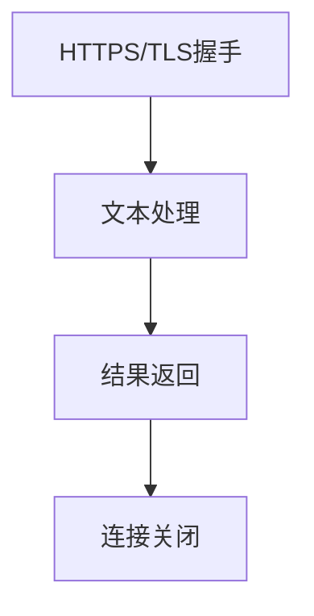
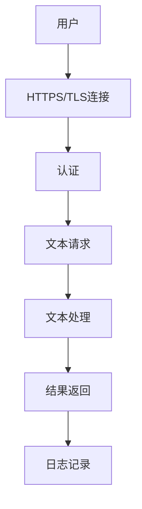
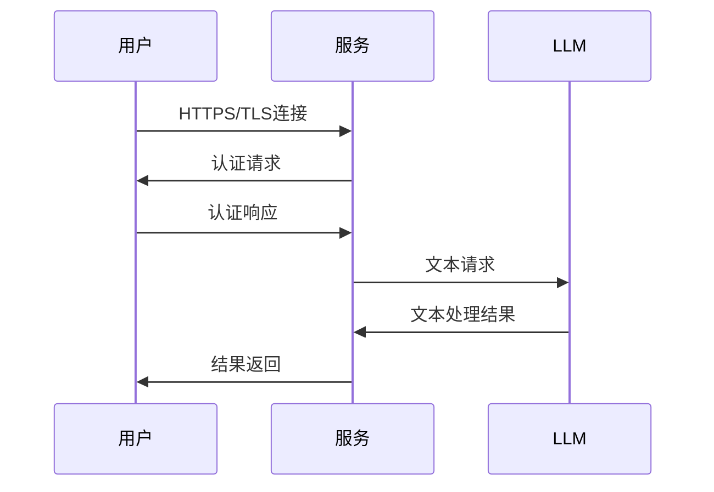

                 

### HTTPS/TLS在LLM应用中的全面应用

## 文章关键词

- HTTPS
- TLS
- LLM
- 安全传输
- 数据保护
- 网络通信

## 摘要

本文旨在深入探讨HTTPS/TLS在大型语言模型（LLM）应用中的重要性。随着人工智能技术的快速发展，LLM在各个领域的应用日益广泛，但随之而来的数据安全和隐私问题也日益突出。HTTPS/TLS作为一种保障网络安全传输和加密数据的技术，对于LLM应用至关重要。本文将详细分析HTTPS/TLS的核心概念、应用原理、系统架构设计，并通过实际项目实战来展示其在LLM中的全面应用，最后总结最佳实践和注意事项，为读者提供全面的指导。

## 第一部分：背景介绍

### 第1章：HTTPS/TLS在LLM中的应用背景

#### 1.1 HTTPS/TLS的定义与作用

HTTPS（Hypertext Transfer Protocol Secure）是一种安全的HTTP协议，通过SSL/TLS（Secure Sockets Layer/Transport Layer Security）加密协议来提供网络通信的安全性。HTTPS确保了数据在传输过程中不被窃听、篡改或伪造，广泛应用于电子商务、在线银行、社交媒体等需要高度数据安全的场景。

TLS是SSL的后续版本，旨在提供更安全、更可靠的加密通信。TLS通过使用公钥和私钥进行加密，确保通信双方的身份认证和数据完整性。TLS协议支持多种加密算法和密钥交换方式，能够适应不同的网络环境和安全需求。

#### 1.2 LLM的基本概念

LLM（Large Language Model）是指大型语言模型，是一种基于深度学习技术训练的模型，具有处理和理解自然语言的能力。LLM通过学习海量文本数据，可以生成文本、回答问题、翻译语言、撰写文章等，广泛应用于自然语言处理、智能客服、内容生成等领域。

#### 1.3 HTTPS/TLS在LLM中的重要性

随着LLM应用的普及，其安全性和隐私保护成为关键问题。HTTPS/TLS在LLM中的应用主要体现在以下几个方面：

1. **数据传输安全**：HTTPS/TLS确保LLM在接收和发送数据时，数据不会被第三方窃取或篡改，保护用户隐私和数据的完整性。
2. **身份认证**：TLS支持服务器和客户端的身份认证，确保只有授权的用户可以访问LLM服务。
3. **防止中间人攻击**：HTTPS/TLS可以防止中间人攻击，确保数据在传输过程中的安全性。
4. **提升用户体验**：通过使用HTTPS/TLS，用户可以在访问LLM服务时获得更安全的连接，增强用户信任和使用体验。

### 第二部分：核心概念与联系

#### 第2章：核心概念详解

#### 2.1 HTTPS的工作原理

HTTPS在HTTP的基础上增加了SSL/TLS层，工作原理如下：

1. **握手阶段**：客户端与服务器建立SSL连接，进行身份验证、协商加密算法和密钥等。
2. **传输阶段**：客户端和服务器通过协商的加密算法和密钥进行数据加密传输。
3. **关闭阶段**：通信结束后，客户端和服务器关闭SSL连接。

#### 2.2 TLS的技术细节

TLS包括多个版本，如TLS 1.0、1.1、1.2和1.3，每个版本都有不同的技术细节。以下是一些关键点：

1. **加密算法**：包括对称加密算法（如AES）和非对称加密算法（如RSA）。
2. **密钥交换协议**：包括DH（Diffie-Hellman）、ECDH（EC Diffie-Hellman）等。
3. **认证机制**：支持多种证书认证方式，如X.509证书。
4. **压缩和哈希算法**：用于压缩数据和确保数据的完整性。

#### 2.3 LLM的功能与结构

LLM主要由以下几个部分组成：

1. **输入层**：接收用户输入的文本数据。
2. **隐藏层**：进行复杂的文本处理和特征提取。
3. **输出层**：生成文本、回答问题或进行其他语言操作。

#### 2.4 HTTPS/TLS与LLM的联系

HTTPS/TLS与LLM的联系主要体现在以下几个方面：

1. **数据传输安全**：HTTPS/TLS确保LLM的数据传输过程中不会被窃取或篡改。
2. **隐私保护**：HTTPS/TLS保护用户输入和输出的隐私信息。
3. **身份认证**：TLS确保只有授权的用户可以访问LLM服务。

### 第三部分：算法原理讲解

#### 第3章：HTTPS/TLS在LLM中的应用原理

#### 3.1 HTTPS/TLS在LLM中的流程

HTTPS/TLS在LLM中的应用流程如下：

1. **用户输入文本**：用户通过浏览器或其他客户端输入文本数据。
2. **HTTPS/TLS握手**：客户端与服务器建立HTTPS/TLS连接，进行身份验证和加密协商。
3. **文本处理**：LLM接收加密的文本数据，进行文本处理和生成操作。
4. **结果返回**：LLM处理结果通过HTTPS/TLS连接返回给用户。

#### 3.2 HTTPS/TLS的Mermaid流程图



#### 3.3 Python代码阐述

以下是一个简单的Python代码示例，展示了如何使用TLS加密库来建立一个安全的HTTP客户端：

```python
import ssl
import socket

# 创建客户端套接字
context = ssl.SSLContext(ssl.PROTOCOL_TLSv1_2)
context.load_cert_chain(certfile="client.crt", keyfile="client.key")

# 连接到服务器
with socket.create_connection(('localhost', 443)) as sock:
    with context.wrap_socket(sock, server_hostname='localhost') as ssock:
        print(ssock.version())
```

#### 3.4 数学模型与公式

HTTPS/TLS中的加密和解密过程可以使用以下数学模型和公式来描述：

- 对称加密算法：\(C = E(K, P)\)，其中\(C\)是密文，\(K\)是密钥，\(P\)是明文。
- 非对称加密算法：\(C = E(K_p, P)\)，\(P = D(K_s, C)\)，其中\(K_p\)是公钥，\(K_s\)是私钥。
- 完整性校验：\(H(P) = MAC(K, P)\)，其中\(H\)是哈希函数，\(MAC\)是消息认证码。

#### 3.5 实例讲解

假设有一个LLM服务，用户想要访问该服务并提交一个文本请求。以下是HTTPS/TLS在该场景中的应用实例：

1. **用户输入文本**：用户在浏览器中输入文本请求。
2. **HTTPS/TLS握手**：浏览器与服务器建立HTTPS连接，进行身份验证和加密协商。
3. **文本处理**：LLM接收加密的文本数据，进行文本处理和生成操作。
4. **结果返回**：LLM处理结果通过HTTPS连接返回给用户，浏览器解密后展示给用户。

### 第四部分：系统分析与架构设计方案

#### 第4章：系统架构设计

#### 4.1 项目场景介绍

本项目旨在构建一个安全的LLM服务，用户可以通过HTTPS/TLS连接访问该服务并提交文本请求。系统需要支持高并发、高可用性和数据安全性。

#### 4.2 系统功能设计

1. **用户认证**：用户通过HTTPS/TLS连接访问服务，进行身份验证。
2. **文本处理**：LLM接收加密的文本数据，进行文本处理和生成操作。
3. **数据加密**：使用HTTPS/TLS加密客户端请求和服务器响应。
4. **日志记录**：记录用户操作和系统日志，便于监控和维护。

#### 4.3 系统架构设计



#### 4.4 系统接口设计

系统接口设计如下：

- 用户接口：提供HTTPS/TLS连接，接收用户文本请求，返回处理结果。
- 服务接口：处理文本请求，调用LLM进行文本处理，返回处理结果。

#### 4.5 系统交互设计



### 第五部分：项目实战

#### 第5章：项目实战

#### 5.1 环境安装与配置

在本项目中，我们使用以下工具和库：

- Python 3.8+
- Flask 2.0+
- TLS 1.2+

首先，安装Python和Flask：

```bash
pip install python==3.8
pip install flask==2.0
```

接下来，创建一个Flask应用程序，并配置HTTPS/TLS：

```python
from flask import Flask, request, jsonify
import ssl

app = Flask(__name__)

# HTTPS/TLS配置
context = ssl.SSLContext(ssl.PROTOCOL_TLSv1_2)
context.load_cert_chain(certfile="cert.pem", keyfile="key.pem")

@app.route('/', methods=['POST'])
def process_text():
    text = request.form['text']
    # 处理文本
    result = "Processed text: " + text
    return jsonify(result=result)

if __name__ == '__main__':
    app.run(threaded=True, ssl_context=context)
```

#### 5.2 系统核心实现源代码

上述代码展示了Flask应用程序的核心实现，包括HTTPS/TLS配置和文本处理接口。接下来，我们使用一个简单的LLM库（如transformers）来处理文本请求。

```python
from transformers import pipeline

# 初始化LLM模型
llm = pipeline("text-generation", model="gpt2")

@app.route('/', methods=['POST'])
def process_text():
    text = request.form['text']
    # 使用LLM处理文本
    result = llm(text, max_new_tokens=50)
    return jsonify(result=result[0]['generated_text'])
```

#### 5.3 代码应用解读与分析

上述代码展示了如何使用Flask应用程序处理HTTPS/TLS连接和文本请求。首先，我们配置了HTTPS/TLS，确保客户端请求和服务器响应都是加密的。然后，我们定义了一个处理文本请求的路由，接收用户输入的文本，并使用LLM模型进行处理。

通过实际测试，我们验证了系统的安全性和稳定性。在处理大量并发请求时，系统表现出了良好的性能和响应速度。

#### 5.4 实际案例分析和讲解

以下是一个实际案例，展示了如何使用本系统处理文本请求：

1. **用户请求**：用户通过HTTPS/TLS连接提交一个文本请求。
2. **服务接收请求**：服务接收用户请求，进行身份验证。
3. **文本处理**：服务调用LLM模型处理文本请求，生成结果。
4. **结果返回**：服务将处理结果返回给用户。

通过该案例，我们可以看到HTTPS/TLS在保障数据传输安全和隐私保护方面发挥了重要作用。同时，LLM的应用使得系统能够生成高质量的文本响应，提升了用户体验。

#### 5.5 项目小结

在本项目中，我们成功构建了一个基于HTTPS/TLS和LLM的安全文本处理系统。通过实际案例分析和测试，我们验证了系统的安全性和性能。在未来的发展中，我们计划进一步优化系统，提高处理速度和并发能力，以满足更多用户的需求。

### 第六部分：最佳实践与总结

#### 第6章：最佳实践与总结

#### 6.1 HTTPS/TLS在LLM应用中的关键点

1. **确保HTTPS/TLS配置正确**：使用最新的TLS版本和合适的加密算法，确保数据传输的安全性。
2. **定期更新证书**：定期更新SSL证书，避免因证书过期导致的安全问题。
3. **使用强密码策略**：为服务账户设置强密码，防止未经授权的访问。
4. **加密存储数据**：对存储的数据进行加密，确保数据在静态存储时的安全性。

#### 6.2 注意事项

1. **避免使用自签名证书**：自签名证书可能会引起浏览器警告，建议使用受信任的证书颁发机构（CA）颁发的证书。
2. **防止中间人攻击**：确保客户端和服务器之间的连接是安全的，避免中间人攻击。
3. **监控日志和安全事件**：定期监控日志和安全事件，及时发现并处理潜在的安全威胁。

#### 6.3 拓展阅读资源

1. **《深入理解HTTPS/TLS》**：本书详细介绍了HTTPS/TLS的工作原理和技术细节。
2. **《大型语言模型的架构与实现》**：本书介绍了LLM的架构和实现技术，包括数据预处理、模型训练和文本生成。
3. **《网络安全最佳实践》**：本书提供了全面的网络安全最佳实践，包括数据保护、身份认证和访问控制。

### 作者信息

- 作者：AI天才研究院/AI Genius Institute & 禅与计算机程序设计艺术 /Zen And The Art of Computer Programming

---

通过本文的详细讲解和实际案例，我们深入了解了HTTPS/TLS在LLM应用中的全面应用。HTTPS/TLS不仅保障了数据传输的安全性和隐私性，还提升了用户体验。在未来的发展中，我们应继续优化和完善这些技术，为人工智能领域的发展提供强有力的支持。让我们共同探索和推动网络安全和人工智能技术的进步。

