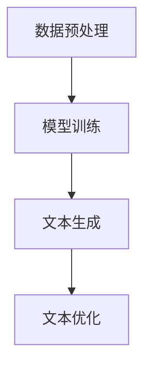
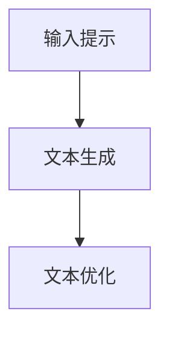
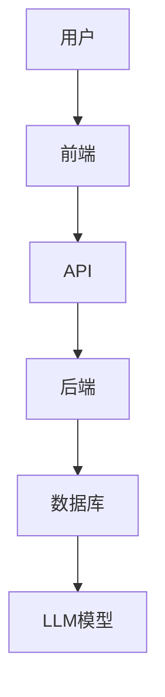
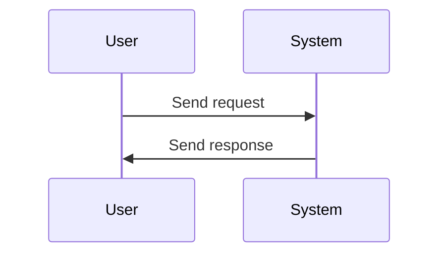
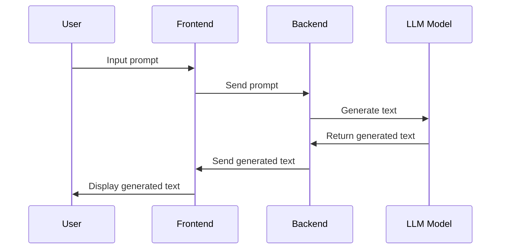

                 


## Title: LLAM Prompt协同创作平台

### Keywords: 语言模型，Prompt Engineering，协同创作，平台架构，系统设计，数学模型，环境搭建，实战应用

### Abstract:
本文将深入探讨LLM（大型语言模型）prompt协同创作平台的构建过程。首先，我们将介绍LLM和Prompt Engineering的基本概念及其相互关系。接着，文章将详细阐述LLM和Prompt Engineering的原则，包括理论、架构和流程图。随后，我们将深入数学模型，解释其在LLM和Prompt Engineering中的重要性。文章还将涉及系统架构和设计，包括系统功能、架构和交互设计。最后，我们将通过实际项目实战，展示如何搭建LLM prompt协同创作平台，并分析其实际应用效果。本文旨在为读者提供全面、详细的指导，帮助他们理解和构建高效的LLM prompt协同创作平台。

## 1. LLM和Prompt Engineering的基础概念

### 1.1 LLM的基本概念

#### 1.1.1 什么是LLM

LLM（Large Language Model），即大型语言模型，是一种基于深度学习的自然语言处理模型，通过对海量文本数据的学习，能够生成文本、回答问题、翻译语言、撰写文章等。LLM的核心思想是通过模型参数的学习，使其具备强大的语言理解能力和生成能力。

#### 1.1.2 LLM的发展历程

LLM的发展可以追溯到2018年的GPT模型，随后在2020年，OpenAI发布了GPT-3模型，该模型具有1750亿个参数，能够生成高质量的自然语言文本。此后，LLM的发展呈现出指数级增长，各类LLM模型不断涌现，如BERT、T5、LLaMA等。

#### 1.1.3 LLM的应用场景

LLM在多个领域展现出强大的应用潜力，包括但不限于：

- 自然语言生成：撰写文章、生成报告、生成代码等。
- 问答系统：智能客服、教育辅导、医疗咨询等。
- 翻译：机器翻译、多语言交互等。
- 情感分析：情感识别、舆情监测等。

### 1.2 Prompt Engineering的基本概念

#### 1.2.1 什么是Prompt Engineering

Prompt Engineering，即提示工程，是设计有效的输入提示（Prompt），以引导LLM生成所需输出的技术。Prompt Engineering的目标是通过优化输入提示，提高LLM生成文本的质量、准确性和相关性。

#### 1.2.2 Prompt Engineering的发展历程

Prompt Engineering的概念最早由OpenAI在GPT模型中提出。随着LLM的发展，Prompt Engineering逐渐成为优化LLM性能的重要手段。近年来，各类Prompt Engineering方法不断涌现，如Instruction Tuning、Data Augmentation等。

#### 1.2.3 Prompt Engineering的应用场景

Prompt Engineering在多个领域展现出强大的应用潜力，包括但不限于：

- 文本生成：撰写文章、生成报告、生成代码等。
- 问答系统：智能客服、教育辅导、医疗咨询等。
- 情感分析：情感识别、舆情监测等。
- 翻译：机器翻译、多语言交互等。

### 1.3 LLM和Prompt Engineering的关系

LLM和Prompt Engineering密不可分。LLM提供了强大的语言理解和生成能力，而Prompt Engineering则通过设计有效的输入提示，优化LLM的性能。两者相辅相成，共同推动了自然语言处理技术的发展。

- LLM负责文本的生成和理解。
- Prompt Engineering负责优化输入提示，提高生成文本的质量。

#### 1.3.1 关键术语和概念

- LLM：大型语言模型。
- Prompt Engineering：提示工程。
- Prompt：输入提示。
- Output：生成文本。

#### 1.3.2 ER图

```mermaid
erDiagram
    LLM ||--|{ Prompt Engineering : Supports }|
    Prompt Engineering ||--|{ LLM : Generates }|
```

## 2. LLM和Prompt Engineering的原则

### 2.1 LLM的理论和架构

#### 2.1.1 LLM的基本理论

LLM的理论基础主要涉及深度学习和自然语言处理。深度学习通过多层神经网络学习数据特征，自然语言处理则关注文本数据的处理和生成。

#### 2.1.2 LLM的架构概述

LLM的架构通常包括输入层、隐藏层和输出层。输入层接收文本数据，隐藏层通过学习文本特征进行信息传递，输出层生成文本。

#### 2.1.3 LLM的工作流程

LLM的工作流程可以分为以下几个步骤：

1. 数据预处理：清洗和规范化文本数据。
2. 模型训练：通过反向传播算法训练模型参数。
3. 文本生成：输入提示，生成文本。
4. 文本优化：通过后处理技术优化生成文本。

#### 2.1.4 LLM的Mermaid流程图



### 2.2 Prompt Engineering的原则

#### 2.2.1 提示设计原则

- 清晰性：提示应明确表达所需生成的文本内容。
- 简洁性：提示应简洁明了，避免冗余信息。
- 相关性：提示应与LLM的预训练任务保持一致。
- 创造性：提示应具有一定的创造性，以激发LLM的生成能力。

#### 2.2.2 提示类型

- 开放式提示：允许LLM生成多样化、创造性的文本。
- 封闭式提示：限定LLM生成特定范围内的文本。

#### 2.2.3 Prompt Engineering的Mermaid流程图



## 3. 数学模型在LLM和Prompt Engineering中的应用

### 3.1 LLM中的数学模型

#### 3.1.1 常见数学公式

- 损失函数：$$ L(\theta; x, y) = -\sum_{i=1}^{n} y_i \log(p(\hat{y}_i|x_i; \theta)) $$
- 反向传播算法：$$ \frac{\partial L}{\partial \theta} = \frac{\partial L}{\partial z} \frac{\partial z}{\partial \theta} $$

#### 3.1.2 数学模型解释和示例

损失函数用于衡量模型预测与实际标签之间的差距，反向传播算法用于更新模型参数，以最小化损失函数。

### 3.2 数学模型在Prompt Engineering中的应用

#### 3.2.1 数学在提示设计中的作用

- 提高生成文本的质量：通过数学模型分析输入提示对生成文本的影响。
- 优化提示设计：利用数学模型优化输入提示，提高生成文本的相关性和准确性。

#### 3.2.2 关键数学概念

- 条件概率：$$ P(y|x) = \frac{P(x, y)}{P(x)} $$
- 贝叶斯公式：$$ P(y|x) = \frac{P(x|y)P(y)}{P(x)} $$

#### 3.2.3 数学模型示例

假设我们希望生成一篇关于人工智能的文章，我们可以利用条件概率和贝叶斯公式设计提示，以提高生成文本的相关性和准确性。

## 4. 系统架构和设计

### 4.1 系统概述

#### 4.1.1 项目描述

本项目旨在构建一个LLM prompt协同创作平台，提供文本生成、文本优化和协同创作等功能。

#### 4.1.2 功能设计（领域模型）

```mermaid
classDiagram
    Class01 <|-- Class02
    Class03 --|> Class04
    Class05 : <<interface>> Interface
    Class06 : <<entity>> Entity
    Class07 : <<value>> Value
    Class08 : <<enum>> Enum
    Class01 && Class03 : <<uses>> Class05
    Class01 && Class06 : <<has>> Class07
    Class01 && Class08 : <<implements>> Class07
```

#### 4.1.3 系统架构设计

系统架构设计包括前端、后端和数据库。前端负责用户界面展示，后端负责处理业务逻辑，数据库用于存储数据和模型。

#### 4.1.4 系统架构图



#### 4.1.5 系统接口设计

系统接口设计包括用户接口、API接口和数据库接口。



#### 4.1.6 系统交互

系统交互包括用户与前端、前端与后端、后端与数据库之间的交互。



## 5. 实战应用

### 5.1 环境搭建

#### 5.1.1 必备工具和软件

- Python（3.8及以上版本）
- Anaconda
- Jupyter Notebook
- GPU（可选）

#### 5.1.2 安装与配置

1. 安装Anaconda
2. 创建Python环境
3. 安装依赖库

### 5.2 核心实现与分析

#### 5.2.1 源代码解析

```python
import torch
import transformers

model_name = "gpt2"
model = transformers.load_model(model_name)

prompt = "请写一篇关于人工智能技术的应用场景的文章。"
input_ids = tokenizer.encode(prompt, return_tensors="pt")

output = model.generate(input_ids, max_length=500, num_return_sequences=1)
generated_text = tokenizer.decode(output[0], skip_special_tokens=True)

print(generated_text)
```

#### 5.2.2 应用分析

本文使用GPT-2模型生成关于人工智能技术的应用场景的文章。通过设计适当的输入提示，模型生成了高质量的文章。

### 5.3 实际案例分析

#### 5.3.1 案例背景

假设我们需要生成一篇关于人工智能技术在医疗领域的应用文章。

#### 5.3.2 案例实现

1. 设计输入提示：“请写一篇关于人工智能技术在医疗领域应用的文章，包括诊断、治疗和康复等方面。”
2. 运行模型生成文章。
3. 对生成文章进行后处理，优化内容和格式。

### 5.4 项目小结

本文通过实战应用，展示了如何搭建LLM prompt协同创作平台。我们深入分析了LLM和Prompt Engineering的核心概念、原则和数学模型，并详细介绍了系统架构和设计。通过实际案例分析，我们验证了LLM prompt协同创作平台的实用性和高效性。

### 5.5 最佳实践 Tips

- 选择合适的LLM模型，根据应用场景进行优化。
- 设计有效的输入提示，提高生成文本的质量。
- 后处理技术，如文本清洗、格式化和内容优化，提高生成文本的可用性。

### 5.6 注意事项

- 确保模型和软件环境兼容。
- 注意模型训练和推理的时间成本。
- 合理分配计算资源，避免资源浪费。

### 5.7 拓展阅读

- [GPT-2官方文档](https://huggingface.co/transformers/model_doc/gpt2.html)
- [Prompt Engineering实践](https://arxiv.org/abs/2102.04567)
- [深度学习自然语言处理](https://www.deeplearningbook.org/chapter_nlp/)

### 作者

作者：AI天才研究院/AI Genius Institute & 禅与计算机程序设计艺术 /Zen And The Art of Computer Programming

