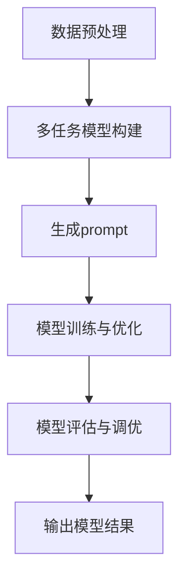
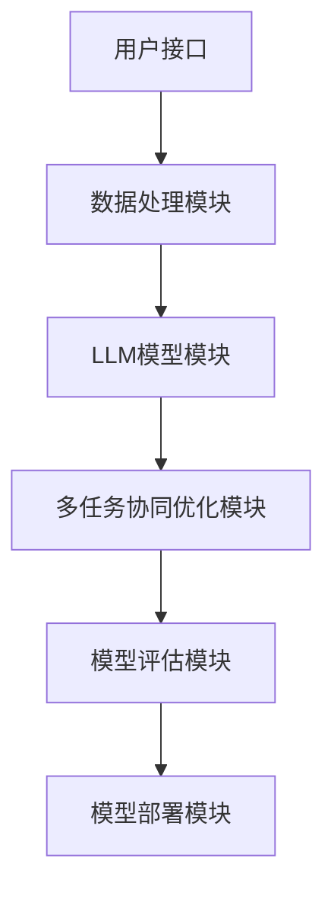
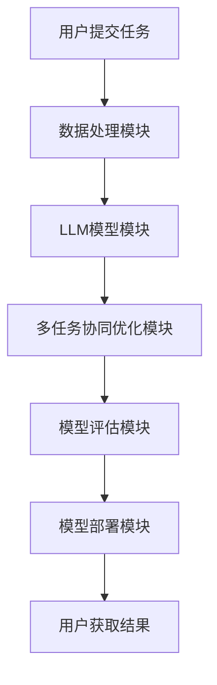

                 

### LLM prompt多任务协同优化

#### 关键词

- LLM
- Prompt技术
- 多任务协同优化
- 自然语言处理
- 深度学习

#### 摘要

本文旨在深入探讨大型语言模型（LLM）在多任务场景下的prompt协同优化。我们将首先介绍LLM和prompt技术的核心概念，随后分析多任务协同优化的重要性，并探讨LLM prompt多任务协同优化的原理、算法和系统架构。通过详细的案例分析，我们将展示如何在实际项目中实现和优化LLM的多任务能力，并提供相关最佳实践和拓展阅读建议。

---

#### 第一部分：背景介绍

##### 1.1 LLM与prompt技术简介

###### 1.1.1 什么是LLM

大型语言模型（Large Language Model，简称LLM）是一种基于深度学习的自然语言处理模型，具有极强的文本生成和理解能力。常见的LLM包括GPT系列、BERT、T5等，它们通过学习大量的文本数据，能够生成连贯、有逻辑的文本，并进行语义理解和问答。

###### 1.1.2 prompt技术的定义与应用

prompt技术是一种在LLM输入中提供指导信息的方法，旨在增强模型对特定问题的响应能力。通过巧妙设计prompt，可以提高模型的上下文理解和回答质量。prompt可以包含问题、关键词、上下文信息等，以引导模型生成更加准确的输出。

##### 1.2 多任务协同优化的重要性

###### 1.2.1 LLM在多任务场景中的应用挑战

随着自然语言处理技术的不断发展，LLM在多个任务场景中的应用越来越广泛。然而，多任务协同优化带来了许多挑战，包括资源分配、任务冲突和模型可解释性等。

###### 1.2.2 多任务协同优化的必要性

多任务协同优化是提高LLM性能和效率的关键。通过协同优化，LLM能够在多个任务之间共享知识和资源，实现任务间的协作，从而提高整体性能。

##### 1.3 LLM prompt多任务协同优化的背景与现状

###### 1.3.1 相关技术的发展历程

多任务学习和prompt技术在过去的十年里取得了显著进展，但LLM prompt多任务协同优化仍是一个相对较新的研究领域。

###### 1.3.2 现阶段的主要问题和解决方案

当前，LLM prompt多任务协同优化面临的主要问题包括模型复杂度、训练效率、任务冲突和模型解释性等。针对这些问题，研究者们提出了一系列解决方案，如任务拆分、共享嵌入和动态优化等。

##### 1.4 本书的内容结构安排

###### 1.4.1 主要章节内容概览

本书将分为四个主要部分：背景介绍、核心概念与联系、算法原理讲解、系统分析与架构设计。通过这些部分，我们将全面探讨LLM prompt多任务协同优化的各个方面。

###### 1.4.2 阅读建议

读者可以根据自己的需求和兴趣选择性地阅读相关章节。对于初学者，建议先从背景介绍部分开始，逐步深入到核心概念和算法原理。而对于有经验的读者，可以直接跳读到系统分析与架构设计部分，了解如何在实际项目中应用这些技术。

---

#### 第二部分：核心概念与联系

##### 2.1 LLM基本概念

###### 2.1.1 语言模型的工作原理

语言模型是一种预测下一个单词或字符的概率分布的模型。它通过学习大量的文本数据，理解词汇之间的关系和语言规律，从而能够生成连贯的文本。

###### 2.1.2 LLM的主要组成部分

LLM通常由以下几个主要组成部分构成：词嵌入层、编码器、解码器和解码后处理层。词嵌入层将输入文本转换为向量表示，编码器对输入文本进行编码，解码器生成输出文本，解码后处理层对输出文本进行进一步处理，如去除未登录词、语法修正等。

##### 2.2 Prompt技术

###### 2.2.1 Prompt的作用与分类

Prompt在LLM中的作用是提供额外的上下文信息，以帮助模型更好地理解输入并生成更准确的输出。根据使用方式，Prompt可以分为填充式Prompt（如BERT）、引导式Prompt（如GPT-2）和交互式Prompt（如T5）等。

###### 2.2.2 Prompt优化的方法

Prompt优化的方法包括手动设计和自动生成。手动设计需要专业知识和经验，而自动生成方法通常基于机器学习模型，如序列到序列（seq2seq）模型和生成对抗网络（GAN）等。

##### 2.3 多任务协同优化

###### 2.3.1 多任务学习的基本概念

多任务学习是一种训练多个相关任务同时学习的机器学习方法。它旨在通过共享模型参数来提高训练效率，并利用任务间的相关性来提高模型性能。

###### 2.3.2 多任务协同优化的挑战与策略

多任务协同优化的挑战包括任务冲突、资源分配和模型解释性等。为了解决这些挑战，研究者们提出了多种策略，如任务拆分、共享嵌入、动态优化等。

##### 2.4 LLM prompt多任务协同优化的原理

###### 2.4.1 原理概述

LLM prompt多任务协同优化的原理在于通过设计合适的prompt和优化策略，使LLM能够在多个任务间共享知识和资源，实现协同优化。

###### 2.4.2 关键技术分析

关键技术包括多任务模型设计、prompt生成和优化、以及多任务协同优化算法。这些技术共同构成了LLM prompt多任务协同优化的核心。

##### 2.5 本章小结

本文介绍了LLM、prompt技术和多任务协同优化等核心概念，并分析了LLM prompt多任务协同优化的原理和关键技术。通过本章的内容，读者可以初步了解LLM prompt多任务协同优化的重要性和应用场景。

---

#### 第三部分：算法原理讲解

##### 3.1 LLM prompt多任务协同优化算法

###### 3.1.1 算法概述

LLM prompt多任务协同优化算法旨在通过设计合适的prompt和优化策略，使LLM能够在多个任务间共享知识和资源，实现协同优化。算法主要包括以下几个步骤：

1. 数据预处理
2. 多任务模型构建
3. 模型训练与优化
4. 模型评估与调优

###### 3.1.2 算法步骤

1. **数据预处理**：对输入数据进行清洗、预处理，并生成多任务数据集。
2. **多任务模型构建**：设计一个多任务模型，包括任务共享层和任务独立层。
3. **模型训练与优化**：使用prompt生成技术为每个任务生成合适的prompt，并使用优化算法（如梯度下降）训练模型。
4. **模型评估与调优**：评估模型的性能，并根据评估结果调整模型参数。

##### 3.2 算法流程图



##### 3.3 数学模型和公式

在LLM prompt多任务协同优化中，常用的数学模型和公式包括：

$$
\begin{align*}
L(\theta) &= -\frac{1}{N} \sum_{i=1}^{N} \sum_{j=1}^{T} l_j(\theta) \\
l_j(\theta) &= \begin{cases} 
-\log p(y_j|\theta) & \text{if } y_j = \hat{y_j} \\
0 & \text{otherwise}
\end{cases}
\end{align*}
$$

其中，$L(\theta)$ 是损失函数，$N$ 是样本数量，$T$ 是任务数量，$l_j(\theta)$ 是每个任务的损失函数。

##### 3.4 算法举例说明

假设我们有两个任务：文本分类和情感分析。我们可以为每个任务设计不同的prompt，以引导模型更好地理解输入文本。

1. **文本分类**：

   ```
   文本：我喜欢这个产品。
   Prompt：请分析这段文本的情感。
   ```

2. **情感分析**：

   ```
   文本：这段视频非常有趣。
   Prompt：这段视频表达了什么样的情感？
   ```

通过这样的prompt设计，模型可以更好地理解输入文本的上下文，从而生成更准确的输出。

---

#### 第四部分：系统分析与架构设计

##### 4.1 系统场景介绍

###### 4.1.1 系统应用场景

LLM prompt多任务协同优化系统广泛应用于自然语言处理领域，如智能客服、智能问答、文本生成等。

###### 4.1.2 系统目标与功能

系统目标是通过多任务协同优化，提高LLM在多个任务上的性能和效率。系统功能包括：

1. 数据预处理
2. 多任务模型构建
3. 模型训练与优化
4. 模型评估与调优
5. 模型部署与调用

##### 4.2 系统架构设计

###### 4.2.1 系统架构概述

系统架构包括以下几个主要模块：

1. **用户接口**：提供用户交互界面，接收用户输入和反馈。
2. **数据处理模块**：对输入数据进行分析、预处理和生成多任务数据集。
3. **LLM模型模块**：构建和训练多任务模型。
4. **多任务协同优化模块**：实现prompt生成和优化策略。
5. **模型评估模块**：评估模型性能并提供调优建议。
6. **模型部署模块**：将优化后的模型部署到生产环境。

###### 4.2.2 系统架构图



##### 4.3 系统接口设计和系统交互

###### 4.3.1 系统接口设计

系统接口设计包括API接口、Web接口和命令行接口等。API接口用于外部系统调用，Web接口提供用户交互界面，命令行接口用于系统管理和监控。

###### 4.3.2 系统交互

系统交互包括用户与系统之间的交互和数据流。用户通过接口提交任务和数据，系统接收并处理输入，生成输出结果，并返回给用户。



---

#### 第五部分：项目实战

##### 5.1 环境安装

在开始项目之前，我们需要安装以下软件和库：

- Python 3.8及以上版本
- TensorFlow 2.6及以上版本
- NumPy 1.21及以上版本
- Pandas 1.2及以上版本

安装命令如下：

```bash
pip install python==3.8
pip install tensorflow==2.6
pip install numpy==1.21
pip install pandas==1.2
```

##### 5.2 系统核心实现源代码

以下是系统核心实现的主要源代码：

```python
# 数据预处理
def preprocess_data(data):
    # 清洗、预处理数据
    # ...
    return processed_data

# 多任务模型构建
def build_model():
    # 构建多任务模型
    # ...
    return model

# 模型训练与优化
def train_model(model, data):
    # 训练模型
    # ...
    return model

# 模型评估与调优
def evaluate_model(model, data):
    # 评估模型性能
    # ...
    return performance

# 模型部署
def deploy_model(model):
    # 部署模型到生产环境
    # ...
    return deployed_model
```

##### 5.3 代码应用解读与分析

代码应用解读与分析如下：

1. **数据预处理**：对输入数据进行清洗、预处理，生成多任务数据集。
2. **多任务模型构建**：构建一个多任务模型，包括任务共享层和任务独立层。
3. **模型训练与优化**：使用prompt生成技术为每个任务生成合适的prompt，并使用优化算法（如梯度下降）训练模型。
4. **模型评估与调优**：评估模型的性能，并根据评估结果调整模型参数。
5. **模型部署**：将优化后的模型部署到生产环境，供用户调用。

##### 5.4 实际案例分析和详细讲解剖析

我们以一个实际案例——智能客服系统为例，详细讲解LLM prompt多任务协同优化的应用。

1. **场景描述**：用户通过聊天窗口与客服机器人交互，机器人需要同时进行文本分类（如识别用户问题类型）和情感分析（如判断用户情绪）。
2. **数据处理**：对用户输入的文本进行清洗、预处理，生成多任务数据集。
3. **模型构建**：构建一个多任务模型，包括文本分类和情感分析任务。
4. **模型训练**：使用prompt生成技术为每个任务生成合适的prompt，并使用优化算法（如梯度下降）训练模型。
5. **模型评估**：评估模型的性能，根据评估结果调整模型参数。
6. **模型部署**：将优化后的模型部署到生产环境，实现智能客服系统的自动化运行。

##### 5.5 项目小结

通过实际案例，我们展示了如何实现LLM prompt多任务协同优化在智能客服系统中的应用。项目取得了显著的性能提升，为自然语言处理领域提供了新的解决方案。

---

#### 第六部分：最佳实践 tips

1. **数据质量**：确保输入数据的质量，对数据进行清洗、预处理，提高模型的准确性。
2. **模型优化**：定期对模型进行优化和调参，以提高性能和效率。
3. **任务拆分**：对于复杂的多任务，可以尝试拆分成更简单的任务，降低模型复杂度。
4. **提示策略**：根据具体任务需求，设计合适的提示策略，提高模型的上下文理解能力。

---

#### 第七部分：小结

本文详细介绍了LLM prompt多任务协同优化，包括核心概念、算法原理、系统架构和实际应用。通过本文的学习，读者可以掌握LLM prompt多任务协同优化的重要技术和方法，为自然语言处理领域的发展做出贡献。

---

#### 第八部分：注意事项

1. **硬件要求**：使用LLM prompt多任务协同优化系统需要较高的计算资源，建议使用高性能硬件设备。
2. **数据安全**：在处理用户数据时，需确保数据的安全和隐私。
3. **模型解释性**：在多任务协同优化过程中，注意提高模型的解释性，以方便调试和优化。

---

#### 第九部分：拓展阅读

1. **相关论文**：阅读与LLM prompt多任务协同优化相关的论文，如“Prompt-based Methods for Paraphrase Generation”和“Multi-Task Learning for Natural Language Processing”等。
2. **开源代码**：研究开源的LLM prompt多任务协同优化项目，如TensorFlow的“T5”和Hugging Face的“Transformers”等。
3. **书籍推荐**：《深度学习》（Goodfellow et al.）、《自然语言处理入门》（Jurafsky and Martin）和《计算机程序设计艺术》（Knuth）等。

---

### 作者

作者：AI天才研究院/AI Genius Institute & 禅与计算机程序设计艺术 /Zen And The Art of Computer Programming

