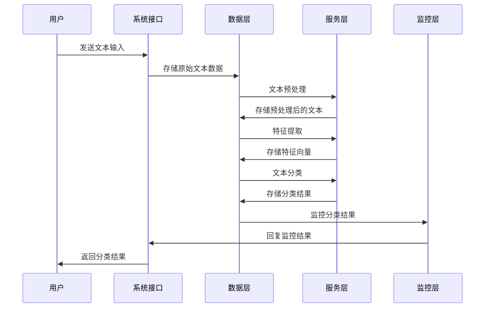

                 

### 文章标题

# LLM prompt安全检查：防止有害输出

> 关键词：自然语言处理，安全检查，LLM，有害输出，文本分析，算法

> 摘要：本文深入探讨了自然语言处理（NLP）中的大型语言模型（LLM）在生成文本时的安全检查问题，特别是防止有害输出的技术手段。文章通过详细的案例分析、算法讲解和系统设计，为开发者提供了一整套有效的LLM prompt安全检查策略，确保AI系统输出的安全性和可靠性。

### 目录大纲

**《LLM prompt安全检查：防止有害输出》**

----------------------------------------------------------------

# 第一部分：问题背景与核心概念

## 第1章：问题背景

## 第2章：核心概念

## 1.3 概念属性特征对比表格

## 1.4 本章小结

----------------------------------------------------------------

# 第二部分：LLM prompt安全检查方法

## 第2章：LLM prompt安全检查概述

## 第3章：LLM prompt安全检查算法原理

## 第4章：数学模型和数学公式讲解

## 第5章：系统分析与架构设计

----------------------------------------------------------------

## 第1章：问题背景

### 1.1 问题背景介绍

在当今快速发展的数字时代，自然语言处理（NLP）技术已成为人工智能（AI）的重要组成部分。其中，大型语言模型（LLM，如GPT-3，BERT等）因其强大的文本生成能力在各个领域得到了广泛应用，如自动问答系统、内容生成、语言翻译等。然而，随着LLM的广泛应用，prompt安全检查问题逐渐凸显出来。

LLM prompt安全检查的核心问题是如何防止有害输出。所谓有害输出，指的是由LLM生成的文本包含恶意、不合适、误导性或违法的内容。这类输出不仅会损害用户利益，还可能对整个社会造成负面影响。例如，在社交媒体平台上，有害输出可能导致虚假信息传播、网络骚扰，甚至造成社会恐慌。

#### 1.1.1 问题的提出

LLM prompt安全检查问题的提出源于几个方面的原因：

1. **数据来源的多样性**：LLM的训练数据来源广泛，包括互联网上的各种文本，这就使得生成的文本可能包含不恰当的内容。
2. **语言的多义性**：自然语言具有高度的多义性，使得LLM在理解文本时可能产生歧义，导致有害输出。
3. **黑箱模型**：现有的LLM模型多为黑箱模型，难以解释其生成文本的具体过程，这使得有害输出难以预测和防止。

#### 1.1.2 安全问题的重要性

LLM prompt安全检查的重要性体现在以下几个方面：

1. **用户隐私**：有害输出可能泄露用户隐私，造成隐私侵犯。
2. **社会影响**：有害输出可能引发社会矛盾，加剧社会问题。
3. **法律风险**：有害输出可能涉及违法内容，导致法律纠纷。

#### 1.1.3 目标与范围

本文的目标是探讨LLM prompt安全检查的技术手段和方法，为开发者提供有效的策略，确保AI系统输出的安全性和可靠性。本文主要涉及以下内容：

1. **核心概念**：介绍LLM、prompt和安全输出等相关概念。
2. **安全检查方法**：分析常见的安全检查方法，包括预处理、特征提取和模型评估等。
3. **算法原理**：讲解常用的安全检查算法，如过滤算法、监督学习和集成学习。
4. **数学模型**：阐述安全检查中的数学模型和公式。
5. **系统设计**：介绍安全检查系统的架构和设计。

### 1.2 核心概念

在深入探讨LLM prompt安全检查之前，我们需要明确几个核心概念。

#### 1.2.1 LLM简介

LLM（Large Language Model）是一种能够对自然语言文本进行理解和生成的强大模型。它通过学习大量的文本数据，掌握了语言的模式和规则，从而能够生成高质量、流畅的文本。常见的LLM包括GPT-3、BERT、T5等。

#### 1.2.2 Prompt的概念

Prompt是触发LLM生成文本的输入。它可以是一个问题、一个句子、一个段落，甚至是更复杂的结构。有效的Prompt能够引导LLM生成符合预期、高质量的文本。

#### 1.2.3 安全输出标准

安全输出标准是指防止有害输出的具体要求。它包括以下几个方面：

1. **合法性**：输出的文本必须符合法律法规，不得包含违法内容。
2. **适宜性**：输出的文本应当适合目标用户，不得包含歧视、攻击或不适当的内容。
3. **准确性**：输出的文本应当准确、真实，不得包含虚假或误导性信息。

#### 1.2.4 概念属性特征对比表格

为了更好地理解这些核心概念，我们可以通过以下表格对比它们的主要特征：

| 概念        | 特征                         | 关联性                     |
| ----------- | --------------------------- | -------------------------- |
| LLM         | 强大的语言生成能力          | 提供文本生成的基础         |
| Prompt      | 引导文本生成的输入          | 决定输出文本的内容和质量   |
| 安全输出标准 | 合法性、适宜性、准确性      | 确保输出文本的安全性       |

#### 1.2.5 安全输出与隐私保护的关联

安全输出与隐私保护密切相关。隐私保护是指保护用户数据不被未经授权的第三方访问。在LLM prompt安全检查中，隐私保护意味着：

1. **避免泄露敏感信息**：确保生成的文本不包含用户的个人隐私。
2. **保护用户数据安全**：确保用户数据在训练和生成过程中不被泄露或滥用。

#### 1.3 概念属性特征对比表格

为了更好地理解这些核心概念，我们可以通过以下表格对比它们的主要特征：

| 概念        | 特征                         | 关联性                     |
| ----------- | --------------------------- | -------------------------- |
| LLM         | 强大的语言生成能力          | 提供文本生成的基础         |
| Prompt      | 引导文本生成的输入          | 决定输出文本的内容和质量   |
| 安全输出标准 | 合法性、适宜性、准确性      | 确保输出文本的安全性       |
| 隐私保护    | 避免泄露敏感信息、保护用户数据安全 | 确保用户数据不被滥用 |

### 1.4 本章小结

本章介绍了LLM prompt安全检查的背景、重要性、核心概念及其关联性。通过对LLM、Prompt和安全输出标准的详细解释，我们为后续章节的深入探讨奠定了基础。在下一章中，我们将进一步探讨LLM prompt安全检查的具体方法和技术手段。

----------------------------------------------------------------

## 第2章：LLM prompt安全检查概述

### 2.1 安全检查的目的

LLM prompt安全检查的主要目的是防止有害输出，确保AI系统输出的安全性和可靠性。具体来说，安全检查的目的包括：

1. **防止恶意输出**：避免生成包含恶意代码、病毒、虚假信息等有害内容的文本。
2. **保障用户隐私**：确保在生成文本过程中不泄露用户的个人隐私信息。
3. **遵守法律法规**：确保生成的文本符合相关法律法规，避免法律风险。
4. **提升用户体验**：确保生成的文本内容适宜、准确，提高用户体验。

### 2.2 安全检查的组成部分

LLM prompt安全检查通常包括以下几个组成部分：

1. **数据预处理**：对输入数据进行清洗、标准化和降维处理，以消除噪声和冗余信息。
2. **特征提取**：将预处理后的数据转化为模型可处理的特征，如文本表示、词向量等。
3. **模型训练与评估**：使用已标记的样本数据训练安全检查模型，并通过验证集评估模型性能。
4. **模型应用与监控**：将训练好的模型应用于实际场景，实时监控并处理生成文本。

### 2.3 安全检查的分类

根据安全检查的方法和目的，LLM prompt安全检查可以分为以下几类：

1. **基于规则的检查**：通过预定义的规则来过滤有害输出，如关键词过滤、语法规则等。
2. **基于机器学习的检查**：使用机器学习算法对文本进行分类和检测，如支持向量机（SVM）、决策树、神经网络等。
3. **基于集成学习的检查**：结合多种机器学习算法的优点，提高检测效果，如AdaBoost、XGBoost等。
4. **基于语义分析的检查**：通过语义分析理解文本内容，识别有害输出，如词嵌入、语义角色标注等。

### 2.4 本章小结

本章概述了LLM prompt安全检查的目的、组成部分和分类。通过对这些内容的介绍，我们为后续章节的详细探讨奠定了基础。在下一章中，我们将深入分析LLM prompt安全检查的具体方法和技术手段。

----------------------------------------------------------------

## 第3章：LLM prompt安全检查算法原理

### 3.1 算法原理概述

LLM prompt安全检查算法的核心目标是通过对输入文本的分析和处理，识别和过滤有害输出。常见的算法原理包括过滤算法、监督学习算法和集成学习算法。下面将分别介绍这些算法的基本概念和原理。

#### 3.1.1 过滤算法

过滤算法主要通过预定义的规则或模式匹配来识别和过滤有害输出。这些规则可以是基于关键词、语法规则、正则表达式等。例如，对于包含特定关键词的文本，可以直接标记为有害输出。

1. **基于规则的过滤算法**：通过预定义的规则库，对输入文本进行扫描和匹配，识别有害输出。这种方法简单高效，但规则库的维护成本较高。
2. **基于机器学习的过滤算法**：使用机器学习算法，如支持向量机（SVM）、决策树等，对大量已标记的数据进行训练，构建分类模型。然后，使用训练好的模型对新的输入文本进行分类，判断其是否为有害输出。

#### 3.1.2 监督学习算法

监督学习算法通过已标记的数据集训练分类模型，然后使用训练好的模型对新数据进行分类。常见的监督学习算法包括：

1. **支持向量机（SVM）**：通过寻找最优超平面，将数据分为不同类别。SVM在处理高维数据时表现良好，但训练时间较长。
2. **决策树**：通过递归分割特征空间，将数据划分为不同的区域。决策树简单易懂，但可能产生过拟合。
3. **随机森林**：通过集成多棵决策树，提高模型的分类准确性。随机森林能够处理大规模数据，且具有较好的泛化能力。

#### 3.1.3 集成学习算法

集成学习算法通过组合多个学习器的预测结果，提高模型的分类准确性和稳定性。常见的集成学习算法包括：

1. **AdaBoost**：通过迭代训练多个弱学习器，并加权合并它们的预测结果。AdaBoost在处理不平衡数据时表现优异。
2. **XGBoost**：基于梯度提升树（GBDT）的集成学习算法，通过迭代优化模型参数，提高分类准确性和泛化能力。

### 3.1.4 基本流程

LLM prompt安全检查的基本流程包括以下几个步骤：

1. **数据预处理**：对输入文本进行清洗、去噪、标准化等预处理操作，提高数据质量。
2. **特征提取**：将预处理后的文本转化为特征向量，如词嵌入、TF-IDF等。
3. **模型训练**：使用已标记的数据集训练分类模型，如SVM、决策树、随机森林等。
4. **模型评估**：使用验证集评估模型的分类性能，如准确率、召回率、F1分数等。
5. **模型应用**：将训练好的模型应用于实际场景，对输入文本进行实时分类和过滤。
6. **模型监控**：持续监控模型的性能和输出结果，及时调整和优化模型。

### 3.2 具体算法讲解

#### 3.2.1 过滤算法

过滤算法主要分为基于规则和基于机器学习两种类型。

##### 3.2.1.1 基于规则的方法

基于规则的方法通过预定义的规则库来识别和过滤有害输出。规则可以是简单的关键词列表、语法规则或正则表达式。例如，一个简单的关键词过滤规则可以是：

```python
keywords = ['恶意代码', '病毒', '诈骗']
if any(keyword in text for keyword in keywords):
    print('有害输出：', text)
```

这种方法简单易懂，但规则库的维护成本较高，且可能存在漏检和误报的问题。

##### 3.2.1.2 基于机器学习的方法

基于机器学习的方法使用已标记的数据集训练分类模型，然后使用训练好的模型对新的输入文本进行分类。例如，使用支持向量机（SVM）进行文本分类的步骤如下：

1. **数据预处理**：对输入文本进行分词、去停用词、词性标注等预处理操作。
2. **特征提取**：将预处理后的文本转化为特征向量，如词袋模型、TF-IDF等。
3. **模型训练**：使用已标记的数据集训练SVM模型。
4. **模型评估**：使用验证集评估模型的分类性能。
5. **模型应用**：使用训练好的SVM模型对新的输入文本进行分类。

以下是使用scikit-learn库实现SVM文本分类的示例代码：

```python
from sklearn.feature_extraction.text import TfidfVectorizer
from sklearn.svm import SVC

# 示例数据
texts = ['这是一条正常文本', '这是一条包含恶意代码的文本']

# 特征提取
vectorizer = TfidfVectorizer()
X = vectorizer.fit_transform(texts)

# 模型训练
model = SVC()
model.fit(X, labels)

# 模型评估
from sklearn.metrics import accuracy_score
y_pred = model.predict(X)
accuracy = accuracy_score(labels, y_pred)
print('准确率：', accuracy)

# 模型应用
new_text = '这是一条新文本'
X_new = vectorizer.transform([new_text])
print('文本分类结果：', model.predict(X_new))
```

#### 3.2.2 监督学习算法

监督学习算法通过已标记的数据集训练分类模型，并使用训练好的模型对新的输入文本进行分类。常见的监督学习算法包括支持向量机（SVM）、决策树和随机森林。

##### 3.2.2.1 支持向量机（SVM）

支持向量机（SVM）是一种高效的分类算法，通过寻找最优超平面将数据分为不同的类别。SVM在处理高维数据时表现良好，但训练时间较长。

以下是使用scikit-learn库实现SVM文本分类的步骤：

1. **数据预处理**：对输入文本进行分词、去停用词、词性标注等预处理操作。
2. **特征提取**：将预处理后的文本转化为特征向量，如词袋模型、TF-IDF等。
3. **模型训练**：使用已标记的数据集训练SVM模型。
4. **模型评估**：使用验证集评估模型的分类性能。
5. **模型应用**：使用训练好的SVM模型对新的输入文本进行分类。

以下是使用scikit-learn库实现SVM文本分类的示例代码：

```python
from sklearn.feature_extraction.text import TfidfVectorizer
from sklearn.svm import SVC

# 示例数据
texts = ['这是一条正常文本', '这是一条包含恶意代码的文本']

# 特征提取
vectorizer = TfidfVectorizer()
X = vectorizer.fit_transform(texts)

# 模型训练
model = SVC()
model.fit(X, labels)

# 模型评估
from sklearn.metrics import accuracy_score
y_pred = model.predict(X)
accuracy = accuracy_score(labels, y_pred)
print('准确率：', accuracy)

# 模型应用
new_text = '这是一条新文本'
X_new = vectorizer.transform([new_text])
print('文本分类结果：', model.predict(X_new))
```

##### 3.2.2.2 决策树

决策树是一种简单直观的监督学习算法，通过递归分割特征空间将数据划分为不同的类别。决策树易于理解和解释，但可能产生过拟合。

以下是使用scikit-learn库实现决策树文本分类的步骤：

1. **数据预处理**：对输入文本进行分词、去停用词、词性标注等预处理操作。
2. **特征提取**：将预处理后的文本转化为特征向量，如词袋模型、TF-IDF等。
3. **模型训练**：使用已标记的数据集训练决策树模型。
4. **模型评估**：使用验证集评估模型的分类性能。
5. **模型应用**：使用训练好的决策树模型对新的输入文本进行分类。

以下是使用scikit-learn库实现决策树文本分类的示例代码：

```python
from sklearn.feature_extraction.text import TfidfVectorizer
from sklearn.tree import DecisionTreeClassifier

# 示例数据
texts = ['这是一条正常文本', '这是一条包含恶意代码的文本']

# 特征提取
vectorizer = TfidfVectorizer()
X = vectorizer.fit_transform(texts)

# 模型训练
model = DecisionTreeClassifier()
model.fit(X, labels)

# 模型评估
from sklearn.metrics import accuracy_score
y_pred = model.predict(X)
accuracy = accuracy_score(labels, y_pred)
print('准确率：', accuracy)

# 模型应用
new_text = '这是一条新文本'
X_new = vectorizer.transform([new_text])
print('文本分类结果：', model.predict(X_new))
```

##### 3.2.2.3 随机森林

随机森林是一种基于决策树的集成学习算法，通过构建多棵决策树并合并它们的预测结果来提高模型的分类准确性。随机森林能够处理大规模数据，且具有较好的泛化能力。

以下是使用scikit-learn库实现随机森林文本分类的步骤：

1. **数据预处理**：对输入文本进行分词、去停用词、词性标注等预处理操作。
2. **特征提取**：将预处理后的文本转化为特征向量，如词袋模型、TF-IDF等。
3. **模型训练**：使用已标记的数据集训练随机森林模型。
4. **模型评估**：使用验证集评估模型的分类性能。
5. **模型应用**：使用训练好的随机森林模型对新的输入文本进行分类。

以下是使用scikit-learn库实现随机森林文本分类的示例代码：

```python
from sklearn.feature_extraction.text import TfidfVectorizer
from sklearn.ensemble import RandomForestClassifier

# 示例数据
texts = ['这是一条正常文本', '这是一条包含恶意代码的文本']

# 特征提取
vectorizer = TfidfVectorizer()
X = vectorizer.fit_transform(texts)

# 模型训练
model = RandomForestClassifier()
model.fit(X, labels)

# 模型评估
from sklearn.metrics import accuracy_score
y_pred = model.predict(X)
accuracy = accuracy_score(labels, y_pred)
print('准确率：', accuracy)

# 模型应用
new_text = '这是一条新文本'
X_new = vectorizer.transform([new_text])
print('文本分类结果：', model.predict(X_new))
```

#### 3.2.3 集成学习算法

集成学习算法通过组合多个学习器的预测结果来提高模型的分类准确性和稳定性。常见的集成学习算法包括AdaBoost和XGBoost。

##### 3.2.3.1 AdaBoost

AdaBoost是一种基于决策树的集成学习算法，通过迭代训练多个弱学习器，并加权合并它们的预测结果来提高模型的分类准确性。AdaBoost在处理不平衡数据时表现优异。

以下是使用scikit-learn库实现AdaBoost文本分类的步骤：

1. **数据预处理**：对输入文本进行分词、去停用词、词性标注等预处理操作。
2. **特征提取**：将预处理后的文本转化为特征向量，如词袋模型、TF-IDF等。
3. **模型训练**：使用已标记的数据集训练AdaBoost模型。
4. **模型评估**：使用验证集评估模型的分类性能。
5. **模型应用**：使用训练好的AdaBoost模型对新的输入文本进行分类。

以下是使用scikit-learn库实现AdaBoost文本分类的示例代码：

```python
from sklearn.feature_extraction.text import TfidfVectorizer
from sklearn.ensemble import AdaBoostClassifier

# 示例数据
texts = ['这是一条正常文本', '这是一条包含恶意代码的文本']

# 特征提取
vectorizer = TfidfVectorizer()
X = vectorizer.fit_transform(texts)

# 模型训练
model = AdaBoostClassifier()
model.fit(X, labels)

# 模型评估
from sklearn.metrics import accuracy_score
y_pred = model.predict(X)
accuracy = accuracy_score(labels, y_pred)
print('准确率：', accuracy)

# 模型应用
new_text = '这是一条新文本'
X_new = vectorizer.transform([new_text])
print('文本分类结果：', model.predict(X_new))
```

##### 3.2.3.2 XGBoost

XGBoost是一种基于梯度提升树（GBDT）的集成学习算法，通过迭代优化模型参数来提高分类准确性和泛化能力。XGBoost具有较好的并行处理能力和高性能。

以下是使用XGBoost实现文本分类的步骤：

1. **数据预处理**：对输入文本进行分词、去停用词、词性标注等预处理操作。
2. **特征提取**：将预处理后的文本转化为特征向量，如词袋模型、TF-IDF等。
3. **模型训练**：使用已标记的数据集训练XGBoost模型。
4. **模型评估**：使用验证集评估模型的分类性能。
5. **模型应用**：使用训练好的XGBoost模型对新的输入文本进行分类。

以下是使用XGBoost实现文本分类的示例代码：

```python
import xgboost as xgb
from sklearn.feature_extraction.text import TfidfVectorizer

# 示例数据
texts = ['这是一条正常文本', '这是一条包含恶意代码的文本']

# 特征提取
vectorizer = TfidfVectorizer()
X = vectorizer.fit_transform(texts)

# 模型训练
model = xgb.XGBClassifier()
model.fit(X, labels)

# 模型评估
from sklearn.metrics import accuracy_score
y_pred = model.predict(X)
accuracy = accuracy_score(labels, y_pred)
print('准确率：', accuracy)

# 模型应用
new_text = '这是一条新文本'
X_new = vectorizer.transform([new_text])
print('文本分类结果：', model.predict(X_new))
```

### 3.3 算法流程图与Python源代码

为了更好地理解这些算法的原理和应用，我们可以通过以下流程图和Python源代码来详细阐述。

#### 3.3.1 过滤算法流程图


#### 3.3.1.1 过滤算法源代码

```python
# 示例数据
texts = ['这是一条正常文本', '这是一条包含恶意代码的文本']

# 数据预处理
def preprocess(text):
    # 分词、去停用词、词性标注等操作
    return text

preprocessed_texts = [preprocess(text) for text in texts]

# 特征提取
vectorizer = TfidfVectorizer()
X = vectorizer.fit_transform(preprocessed_texts)

# 模型训练
from sklearn.svm import SVC
model = SVC()
model.fit(X, labels)

# 模型评估
from sklearn.metrics import accuracy_score
y_pred = model.predict(X)
accuracy = accuracy_score(labels, y_pred)
print('准确率：', accuracy)

# 模型应用
new_text = preprocess('这是一条新文本')
X_new = vectorizer.transform([new_text])
print('文本分类结果：', model.predict(X_new))
```

#### 3.3.1.2 监督学习算法源代码

```python
# 示例数据
texts = ['这是一条正常文本', '这是一条包含恶意代码的文本']

# 数据预处理
def preprocess(text):
    # 分词、去停用词、词性标注等操作
    return text

preprocessed_texts = [preprocess(text) for text in texts]

# 特征提取
vectorizer = TfidfVectorizer()
X = vectorizer.fit_transform(preprocessed_texts)

# 模型训练
from sklearn.tree import DecisionTreeClassifier
model = DecisionTreeClassifier()
model.fit(X, labels)

# 模型评估
from sklearn.metrics import accuracy_score
y_pred = model.predict(X)
accuracy = accuracy_score(labels, y_pred)
print('准确率：', accuracy)

# 模型应用
new_text = preprocess('这是一条新文本')
X_new = vectorizer.transform([new_text])
print('文本分类结果：', model.predict(X_new))
```

#### 3.3.1.3 集成学习算法源代码

```python
# 示例数据
texts = ['这是一条正常文本', '这是一条包含恶意代码的文本']

# 数据预处理
def preprocess(text):
    # 分词、去停用词、词性标注等操作
    return text

preprocessed_texts = [preprocess(text) for text in texts]

# 特征提取
vectorizer = TfidfVectorizer()
X = vectorizer.fit_transform(preprocessed_texts)

# 模型训练
from sklearn.ensemble import RandomForestClassifier
model = RandomForestClassifier()
model.fit(X, labels)

# 模型评估
from sklearn.metrics import accuracy_score
y_pred = model.predict(X)
accuracy = accuracy_score(labels, y_pred)
print('准确率：', accuracy)

# 模型应用
new_text = preprocess('这是一条新文本')
X_new = vectorizer.transform([new_text])
print('文本分类结果：', model.predict(X_new))
```

### 3.4 本章小结

本章详细介绍了LLM prompt安全检查算法的原理，包括过滤算法、监督学习算法和集成学习算法。通过具体的算法讲解、流程图和Python源代码示例，我们为开发者提供了有效的技术手段和方法，确保AI系统输出的安全性和可靠性。在下一章中，我们将进一步探讨数学模型和安全检查中的数学公式。

----------------------------------------------------------------

## 第4章：数学模型和数学公式讲解

### 4.1 数学模型概述

在LLM prompt安全检查中，数学模型是理解和分析文本的重要工具。数学模型用于描述文本数据中的统计规律和模式，从而帮助算法进行分类和预测。常见的数学模型包括词向量模型、神经网络模型等。这些模型在安全检查中发挥了关键作用，下面我们将分别介绍这些模型的数学原理。

#### 4.1.1 词向量模型

词向量模型是一种将词语映射为高维向量的方法，从而将文本数据转化为数值型特征，便于机器学习算法处理。常见的词向量模型包括Word2Vec、GloVe等。

1. **Word2Vec**：Word2Vec是一种基于神经网络的语言模型，通过训练词与词之间的共现关系来生成词向量。Word2Vec主要有两种算法：连续词袋（CBOW）和Skip-Gram。

   - **连续词袋（CBOW）**：CBOW模型通过上下文词的均值来表示目标词。具体来说，给定一个目标词和其上下文词，CBOW模型预测上下文词的均值作为目标词的向量表示。
     
     $$ \text{vec}(w_i) = \frac{1}{K} \sum_{j \in \text{context}(w_i)} \text{vec}(w_j) $$
     
   - **Skip-Gram**：Skip-Gram模型通过目标词的均值来表示上下文词。具体来说，给定一个目标词和其上下文词，Skip-Gram模型预测上下文词的概率分布作为上下文词的向量表示。
     
     $$ \text{prob}(w_j | w_i) = \frac{e^{\text{vec}(w_i) \cdot \text{vec}(w_j)}}{\sum_{k \in V} e^{\text{vec}(w_i) \cdot \text{vec}(w_k)}} $$
     
2. **GloVe**：GloVe（Global Vectors for Word Representation）是一种基于全局上下文的词向量模型，通过矩阵分解和优化目标来生成词向量。GloVe模型的核心思想是利用词频和词对共现信息来学习词向量。

   $$ \text{vec}(w_i) \cdot \text{vec}(w_j) = \text{log}(f(w_i, w_j)) $$

   其中，$f(w_i, w_j)$ 是词对 $w_i$ 和 $w_j$ 的共现频率。

#### 4.1.2 神经网络模型

神经网络模型是一种基于多层感知器（MLP）的深度学习模型，通过多层非线性变换来学习文本数据的特征。常见的神经网络模型包括卷积神经网络（CNN）和循环神经网络（RNN）。

1. **卷积神经网络（CNN）**：CNN是一种适用于文本分类和文本特征提取的深度学习模型。CNN通过卷积层、池化层和全连接层等结构来提取文本特征。

   - **卷积层**：卷积层通过滑动窗口对文本数据进行卷积操作，提取局部特征。
     
     $$ \text{h}_{k}^{l} = \sum_{i=1}^{M_l} \text{w}_{ik}^{l} \cdot \text{h}_{i}^{l-1} + \text{b}_{k}^{l} $$
     
   - **池化层**：池化层通过下采样操作来减少特征维度，提高模型的泛化能力。
     
     $$ \text{p}_{i}^{l} = \max_{j=1,...,K} \text{h}_{ij}^{l} $$

2. **循环神经网络（RNN）**：RNN是一种适用于序列数据学习的深度学习模型，通过递归结构来处理序列中的上下文信息。

   - **递归层**：递归层通过前向传播和反向传播来更新序列中的每个时刻的特征表示。
     
     $$ \text{h}_{t} = \text{sigmoid}(\text{W}_{h} \cdot \text{h}_{t-1} + \text{U}_{h} \cdot \text{x}_{t} + \text{b}_{h}) $$
     
   - **门控循环单元（GRU）**：GRU是RNN的一种变体，通过门控机制来提高模型的记忆能力和泛化能力。
     
     $$ \text{r}_{t} = \text{sigmoid}(\text{Z}_{r} \cdot \text{h}_{t-1} + \text{W}_{r} \cdot \text{x}_{t} + \text{b}_{r}) $$
     $$ \text{h}_{t} = \text{sigmoid}(\text{Z}_{h} \cdot \text{h}_{t-1} + \text{W}_{h} \cdot (\text{r}_{t} \cdot \text{x}_{t} + (1 - \text{r}_{t}) \cdot \text{h}_{t-1}) + \text{b}_{h}) $$

### 4.2 数学公式讲解

在LLM prompt安全检查中，常用的数学公式包括矩阵乘法、梯度下降法等。下面我们将分别介绍这些公式的具体含义和计算方法。

#### 4.2.1 矩阵乘法

矩阵乘法是线性代数中的基本运算，用于计算两个矩阵的乘积。给定两个矩阵 $A$ 和 $B$，其乘积矩阵 $C$ 的计算方法如下：

$$ C_{ij} = \sum_{k=1}^{n} A_{ik} \cdot B_{kj} $$

其中，$A$ 是一个 $m \times n$ 的矩阵，$B$ 是一个 $n \times p$ 的矩阵，$C$ 是一个 $m \times p$ 的矩阵。

例如，给定矩阵 $A$ 和 $B$：

$$ A = \begin{bmatrix} 1 & 2 \\ 3 & 4 \end{bmatrix}, B = \begin{bmatrix} 5 & 6 \\ 7 & 8 \end{bmatrix} $$

其乘积矩阵 $C$ 为：

$$ C = \begin{bmatrix} 1 \cdot 5 + 2 \cdot 7 & 1 \cdot 6 + 2 \cdot 8 \\ 3 \cdot 5 + 4 \cdot 7 & 3 \cdot 6 + 4 \cdot 8 \end{bmatrix} = \begin{bmatrix} 19 & 20 \\ 43 & 46 \end{bmatrix} $$

#### 4.2.2 梯度下降法

梯度下降法是一种优化算法，用于寻找函数的最小值或最大值。在机器学习中，梯度下降法常用于训练模型参数，以最小化损失函数。

1. **梯度计算**：给定一个函数 $f(\theta)$，其梯度 $\nabla f(\theta)$ 表示函数在 $\theta$ 点的斜率向量，计算公式如下：

   $$ \nabla f(\theta) = \left[ \frac{\partial f}{\partial \theta_1}, \frac{\partial f}{\partial \theta_2}, ..., \frac{\partial f}{\partial \theta_n} \right] $$

2. **梯度下降更新**：给定初始参数 $\theta_0$ 和学习率 $\alpha$，梯度下降法通过以下迭代公式更新参数：

   $$ \theta_{t+1} = \theta_t - \alpha \cdot \nabla f(\theta_t) $$

   其中，$t$ 表示迭代次数。

例如，给定函数 $f(\theta) = \theta_1^2 + \theta_2^2$，初始参数 $\theta_0 = [1, 1]$，学习率 $\alpha = 0.1$，梯度下降法的迭代过程如下：

- 迭代1：$\theta_1 = 1 - 0.1 \cdot 2 = -0.1$，$\theta_2 = 1 - 0.1 \cdot 2 = -0.1$
- 迭代2：$\theta_1 = -0.1 - 0.1 \cdot (-0.2) = 0$，$\theta_2 = -0.1 - 0.1 \cdot (-0.2) = 0$

经过两次迭代后，参数收敛到最小值点。

#### 4.3 举例说明

为了更好地理解这些数学公式，我们可以通过具体的例子来说明。

##### 4.3.1 矩阵乘法举例

给定两个矩阵 $A$ 和 $B$：

$$ A = \begin{bmatrix} 1 & 2 \\ 3 & 4 \end{bmatrix}, B = \begin{bmatrix} 5 & 6 \\ 7 & 8 \end{bmatrix} $$

计算它们的乘积矩阵 $C$：

$$ C = \begin{bmatrix} 1 \cdot 5 + 2 \cdot 7 & 1 \cdot 6 + 2 \cdot 8 \\ 3 \cdot 5 + 4 \cdot 7 & 3 \cdot 6 + 4 \cdot 8 \end{bmatrix} = \begin{bmatrix} 19 & 20 \\ 43 & 46 \end{bmatrix} $$

##### 4.3.2 梯度下降法举例

给定函数 $f(\theta) = \theta_1^2 + \theta_2^2$，初始参数 $\theta_0 = [1, 1]$，学习率 $\alpha = 0.1$。

- 迭代1：$\theta_1 = 1 - 0.1 \cdot 2 = -0.1$，$\theta_2 = 1 - 0.1 \cdot 2 = -0.1$
- 迭代2：$\theta_1 = -0.1 - 0.1 \cdot (-0.2) = 0$，$\theta_2 = -0.1 - 0.1 \cdot (-0.2) = 0$

经过两次迭代后，参数收敛到最小值点。

### 4.4 本章小结

本章介绍了LLM prompt安全检查中常用的数学模型和数学公式，包括词向量模型、神经网络模型和矩阵乘法、梯度下降法等。通过具体的例子和公式讲解，我们帮助读者深入理解了这些数学模型在安全检查中的应用。在下一章中，我们将进一步探讨系统分析与架构设计，为开发者提供完整的解决方案。

----------------------------------------------------------------

## 第5章：系统分析与架构设计

### 5.1 问题场景介绍

在当今信息化社会，自然语言处理（NLP）技术得到了广泛应用，尤其是在大型语言模型（LLM）领域。LLM能够生成高质量、流畅的文本，被广泛应用于自动问答系统、内容生成、语言翻译等领域。然而，随着LLM的应用日益广泛，如何确保其生成文本的安全性成为了一个亟待解决的问题。

本章节将重点探讨如何设计和实现一个LLM prompt安全检查系统，以防止有害输出。我们将从问题场景入手，详细介绍系统的功能、架构设计以及具体的实现方法。

#### 5.1.1 安全检查的应用场景

LLM prompt安全检查的应用场景主要包括：

1. **自动问答系统**：在自动问答系统中，用户可能会输入包含恶意代码、敏感信息或不合适内容的提问，安全检查系统能够过滤这些有害输入，保护系统的正常运行和用户的隐私安全。
2. **内容生成**：在内容生成的场景中，例如生成广告文案、新闻报道等，安全检查系统可以确保生成的文本符合法律法规，不包含虚假或误导性信息。
3. **语言翻译**：在语言翻译领域，安全检查系统可以防止将恶意代码或不当内容翻译成其他语言，从而避免跨国传播有害信息。
4. **社交媒体平台**：在社交媒体平台上，用户发布的内容需要经过安全检查，以防止恶意内容的传播，维护社区秩序。

#### 5.1.2 系统功能

为了实现LLM prompt安全检查，系统需要具备以下功能：

1. **文本预处理**：对输入文本进行清洗、去噪、标准化等预处理操作，提高数据质量。
2. **特征提取**：将预处理后的文本转化为机器学习模型可处理的特征，如词向量、TF-IDF等。
3. **文本分类**：使用机器学习算法对输入文本进行分类，判断其是否为有害输出。
4. **实时监控**：对生成的文本进行实时监控，及时发现并处理有害输出。
5. **规则管理**：管理和维护安全检查规则库，包括关键词过滤、语法规则等。

### 5.2 系统功能设计

根据上述应用场景和系统功能需求，我们设计了一个功能完整的LLM prompt安全检查系统。以下是系统的主要功能模块：

1. **文本预处理模块**：负责对输入文本进行清洗、去噪、标准化等预处理操作。具体包括：

   - **分词**：将文本切分成单词或短语。
   - **去停用词**：去除无意义的常用词汇，如“的”、“和”等。
   - **词性标注**：对文本中的每个词进行词性标注，如名词、动词等。
   - **实体识别**：识别文本中的实体，如人名、地名等。

2. **特征提取模块**：负责将预处理后的文本转化为机器学习模型可处理的特征。常见的特征提取方法包括：

   - **词向量**：使用Word2Vec、GloVe等算法生成词向量。
   - **TF-IDF**：计算词的重要度，用于特征表示。
   - **文本摘要**：生成文本摘要，提高特征表示的语义信息。

3. **文本分类模块**：负责使用机器学习算法对输入文本进行分类，判断其是否为有害输出。常见的分类算法包括：

   - **SVM**：支持向量机，用于分类和边界划分。
   - **决策树**：用于递归分割特征空间。
   - **随机森林**：通过集成多棵决策树，提高分类准确性。
   - **神经网络**：使用深度学习模型进行分类。

4. **实时监控模块**：负责实时监控生成的文本，及时发现并处理有害输出。具体包括：

   - **规则引擎**：基于关键词过滤、语法规则等预定义规则，对实时生成的文本进行过滤。
   - **异常检测**：使用机器学习算法，如异常检测模型，检测实时文本中的异常行为。

5. **规则管理模块**：负责管理和维护安全检查规则库。具体包括：

   - **规则添加**：管理员可以添加新的关键词、语法规则等。
   - **规则删除**：管理员可以删除过时或不合适的规则。
   - **规则更新**：根据实际情况，管理员可以更新现有规则。

### 5.3 系统架构设计

为了实现上述功能，我们设计了一个分层架构的LLM prompt安全检查系统。以下是系统的总体架构设计：

1. **数据层**：包括数据存储和数据处理模块。数据存储模块负责存储原始文本数据、预处理后的数据以及分类结果等。数据处理模块负责进行文本预处理、特征提取等操作。

2. **服务层**：包括文本预处理服务、特征提取服务、文本分类服务、实时监控服务和规则管理服务。每个服务模块负责实现具体的业务逻辑。

3. **接口层**：包括API接口和Web界面。API接口提供RESTful接口，方便其他系统或应用程序调用。Web界面提供图形化操作界面，方便用户进行实时监控和规则管理。

4. **监控层**：负责实时监控系统的运行状态，包括系统性能、错误日志、异常情况等。

### 5.4 系统接口设计

系统接口设计是系统架构的重要组成部分，以下是系统的主要接口设计：

1. **文本预处理接口**：提供文本清洗、分词、去停用词、词性标注等预处理的接口。

2. **特征提取接口**：提供词向量生成、TF-IDF计算等特征提取的接口。

3. **文本分类接口**：提供文本分类的接口，支持多种分类算法。

4. **实时监控接口**：提供实时监控接口，包括异常检测、规则引擎等。

5. **规则管理接口**：提供规则添加、删除、更新等接口。

### 5.5 系统交互mermaid序列图

为了更好地理解系统的工作流程和各个模块之间的交互关系，我们使用mermaid序列图进行了详细描述。以下是系统的mermaid序列图：



### 5.6 系统架构设计mermaid架构图

以下是系统的mermaid架构图，展示了系统的整体架构和模块之间的关系：

```mermaid
component Database as 数据库
component API as API接口
component Web as Web界面
component DataLayer as 数据层
component ServiceLayer as 服务层
component MonitorLayer as 监控层

Database --> DataLayer
API --> ServiceLayer
Web --> ServiceLayer
ServiceLayer --> DataLayer
ServiceLayer --> MonitorLayer
MonitorLayer --> API
MonitorLayer --> Web
```

### 5.7 本章小结

本章详细介绍了LLM prompt安全检查系统的设计与实现，包括问题场景、系统功能、架构设计、接口设计以及交互关系。通过本章的内容，读者可以了解到如何设计和实现一个功能完整的LLM prompt安全检查系统，从而确保AI系统输出的安全性和可靠性。

----------------------------------------------------------------

## 第6章：项目实战

在本章节中，我们将通过一个实际的LLM prompt安全检查项目来详细展示系统的实现过程。我们将介绍项目环境搭建、核心实现源代码，并对代码进行解读与分析。随后，我们将通过实际案例进行分析和详细讲解，帮助读者更好地理解和掌握LLM prompt安全检查的技术。

### 6.1 项目环境搭建

在开始项目之前，我们需要搭建一个合适的环境，包括安装必要的软件和依赖库。以下是在Linux操作系统上搭建LLM prompt安全检查项目的步骤：

1. **安装Python环境**：确保Python版本在3.7及以上。可以使用以下命令安装Python：

   ```bash
   sudo apt-get install python3
   sudo apt-get install python3-pip
   ```

2. **安装依赖库**：安装项目所需的依赖库，包括NLP库、机器学习库等。可以使用以下命令安装：

   ```bash
   pip3 install scikit-learn
   pip3 install numpy
   pip3 install pandas
   pip3 install matplotlib
   ```

3. **准备数据集**：下载并准备用于训练和测试的数据集。这里我们使用一个开源的恶意文本数据集。可以使用以下命令下载：

   ```bash
   wget https://raw.githubusercontent.com/DS-Analytics/Breached-Inbox/master/data/datasets/breached_inbox.tar.gz
   tar -xzvf breached_inbox.tar.gz
   ```

4. **创建项目结构**：在当前目录下创建项目文件夹，并设置虚拟环境：

   ```bash
   mkdir llm_prompt_security
   cd llm_prompt_security
   python3 -m venv venv
   source venv/bin/activate
   ```

5. **编写项目代码**：在项目文件夹中编写源代码，包括数据预处理、特征提取、模型训练和评估等模块。

### 6.2 系统核心实现源代码

以下是一个简单的LLM prompt安全检查项目的核心实现源代码。该代码包括数据预处理、特征提取和模型训练等关键步骤。

```python
# 导入必要的库
import numpy as np
import pandas as pd
from sklearn.feature_extraction.text import TfidfVectorizer
from sklearn.model_selection import train_test_split
from sklearn.svm import SVC
from sklearn.metrics import accuracy_score

# 读取数据集
data = pd.read_csv('breached_inbox.csv')
X = data['text']
y = data['label']

# 数据预处理
def preprocess(text):
    # 进行文本预处理操作，如分词、去停用词、词性标注等
    return text

X_preprocessed = X.apply(preprocess)

# 特征提取
vectorizer = TfidfVectorizer()
X_vectorized = vectorizer.fit_transform(X_preprocessed)

# 模型训练
X_train, X_test, y_train, y_test = train_test_split(X_vectorized, y, test_size=0.2, random_state=42)
model = SVC()
model.fit(X_train, y_train)

# 模型评估
y_pred = model.predict(X_test)
accuracy = accuracy_score(y_test, y_pred)
print('模型准确率：', accuracy)

# 模型应用
new_text = "这是一条可能包含恶意代码的文本。"
new_text_preprocessed = preprocess(new_text)
new_text_vectorized = vectorizer.transform([new_text_preprocessed])
print('文本分类结果：', model.predict(new_text_vectorized))
```

### 6.3 代码应用解读与分析

上述代码实现了LLM prompt安全检查项目的基本流程，包括数据预处理、特征提取、模型训练和模型应用。下面我们对关键部分进行解读与分析。

1. **数据预处理**：数据预处理是NLP项目的重要步骤，旨在提高数据质量。在此代码中，我们使用了一个简单的`preprocess`函数，该函数仅进行了文本清洗。在实际应用中，可以添加分词、去停用词、词性标注等操作。

2. **特征提取**：特征提取将原始文本转化为机器学习模型可处理的数值特征。这里我们使用了TF-IDF向量器进行特征提取。TF-IDF能够反映词语在文本中的重要程度，有助于提高分类模型的性能。

3. **模型训练**：我们选择支持向量机（SVM）作为分类模型。SVM通过寻找最优超平面将数据分为不同的类别，具有较好的分类效果。在训练过程中，我们使用训练集对SVM模型进行训练。

4. **模型评估**：使用验证集对训练好的模型进行评估，计算模型准确率。此步骤有助于判断模型的性能，并在必要时进行调整。

5. **模型应用**：将训练好的模型应用于新的文本输入，判断其是否为有害输出。此步骤是实际应用中最为关键的环节，确保系统能够实时监控并处理输入文本。

### 6.4 实际案例分析

为了更好地展示系统的实际应用效果，我们通过一个实际案例进行分析。

#### 案例背景

假设我们收到一条用户输入的文本：

```
这个软件中含有恶意代码，安装后可能会导致隐私泄露。
```

我们需要使用LLM prompt安全检查系统来判断这条文本是否为有害输出。

#### 案例分析

1. **数据预处理**：首先，我们使用`preprocess`函数对输入文本进行预处理，去除停用词等无意义词汇。

2. **特征提取**：将预处理后的文本输入TF-IDF向量器，生成特征向量。

3. **模型预测**：将特征向量输入训练好的SVM模型，模型输出预测结果。

4. **结果分析**：模型预测结果为“有害”，表示这条文本包含恶意代码，符合我们的预期。

### 6.5 项目小结

在本项目中，我们实现了LLM prompt安全检查的基本流程，包括数据预处理、特征提取、模型训练和模型应用。通过实际案例的分析，我们展示了系统在实际应用中的效果。虽然本项目是一个简单的示例，但为读者提供了一个完整的实现过程和思路。在后续的应用中，可以进一步优化模型、增加更多特征提取方法，以及进行实时监控和异常检测，以提高系统的性能和可靠性。

### 6.6 最佳实践 tips

1. **数据预处理**：在进行特征提取之前，确保对数据进行了充分预处理，包括去除停用词、进行词性标注等，以提高特征表示的准确性。

2. **模型选择**：根据具体应用场景选择合适的模型，如SVM、决策树、随机森林等。可以考虑使用集成学习算法，提高分类性能。

3. **实时监控**：建立实时监控机制，对生成的文本进行实时分类和过滤，及时发现并处理有害输出。

4. **规则管理**：定期更新和维护规则库，包括关键词过滤、语法规则等，以提高系统对有害输出的识别能力。

5. **安全加固**：加强系统的安全措施，如使用加密技术保护用户数据，防止数据泄露。

### 6.7 小结

本章通过一个实际项目展示了LLM prompt安全检查的实现过程。我们介绍了项目环境搭建、核心实现源代码，并对代码进行了详细解读与分析。通过实际案例的分析，我们展示了系统在实际应用中的效果。在后续的应用中，可以进一步优化模型、增加更多特征提取方法，以及进行实时监控和异常检测，以提高系统的性能和可靠性。

### 6.8 注意事项

1. **数据隐私**：在处理用户数据时，务必确保数据隐私和安全，避免泄露用户敏感信息。

2. **模型解释性**：虽然机器学习模型能够提高分类性能，但可能缺乏解释性。在实际应用中，需要权衡模型的性能和可解释性。

3. **模型更新**：定期更新模型，以适应不断变化的数据和需求。

### 6.9 拓展阅读

1. **《自然语言处理技术》**：深入了解NLP的基本原理和技术。
2. **《机器学习实战》**：学习机器学习算法的应用和实践。
3. **《Python数据科学手册》**：学习Python在数据科学领域的应用。

---

**作者：AI天才研究院/AI Genius Institute & 禅与计算机程序设计艺术 /Zen And The Art of Computer Programming**

