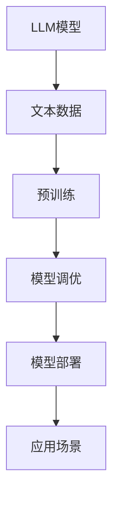
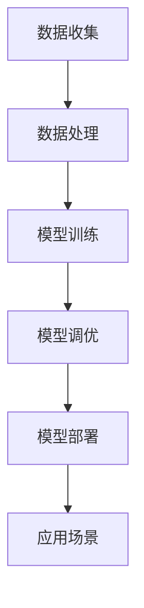
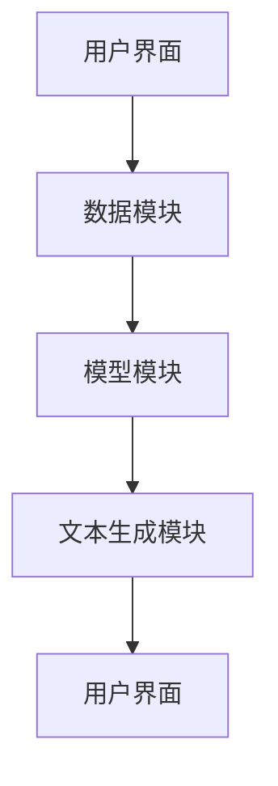
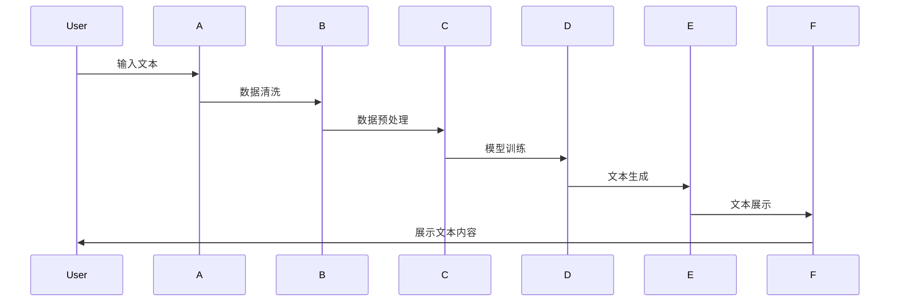
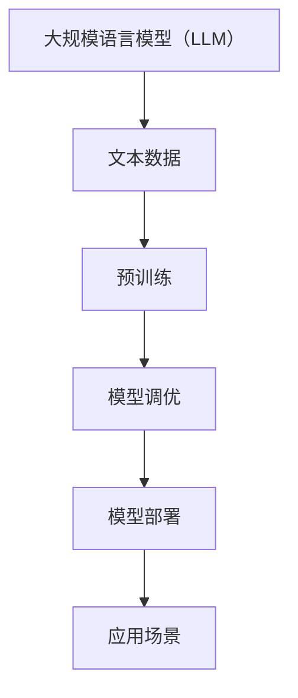
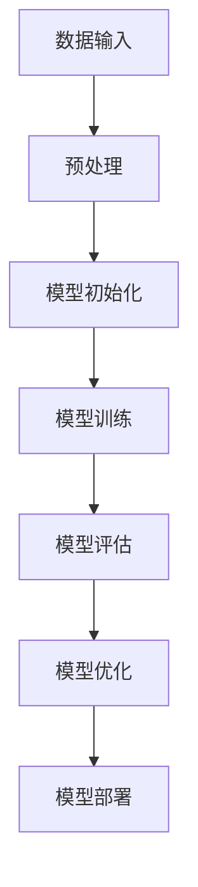
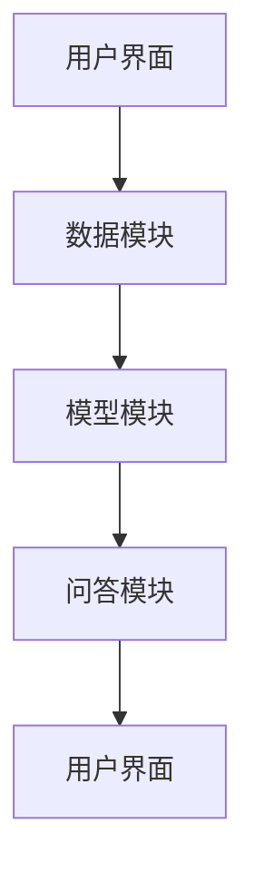
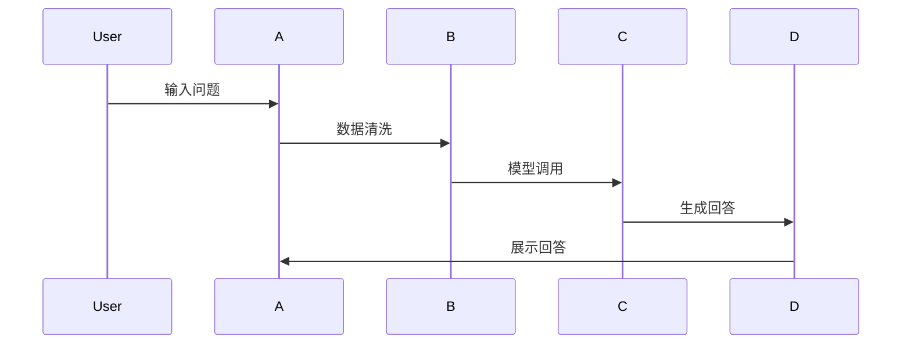

                 

# LLM应用开发中的'快'字诀

## 关键词

- 大规模语言模型
- 应用开发
- 快速部署
- 算法优化
- 系统架构

## 摘要

本文旨在探讨如何在LLM（大型语言模型）应用开发中实现快速部署和高效运行。通过分析核心概念、算法原理、系统架构和实战案例，本文提出了优化LLM应用开发的“快”字诀，帮助读者在短时间内掌握快速开发LLM应用的技巧。

## 第1步：编写书籍背景介绍

### 1.1 问题背景

近年来，随着人工智能技术的快速发展，尤其是大型语言模型（LLM）的崛起，其在自然语言处理（NLP）领域的应用越来越广泛。然而，LLM应用开发过程中的快速部署问题日益凸显。如何在保证模型性能和准确性的同时，实现快速开发、快速部署，成为了一个关键问题。

### 1.2 问题描述

在LLM应用开发中，快速实现应用的需求日益增长。但现有的开发流程往往较为繁琐，涉及到从模型选择、训练、调优到部署的多个环节，每个环节都存在一定的耗时。如何在保证性能和准确性的同时，实现LLM应用开发的快速部署，是一个关键问题。

### 1.3 问题解决

本书旨在解决LLM应用开发中的“快”字诀问题，通过系统的方法和实战经验，帮助读者掌握快速开发LLM应用的技巧。本书将从以下几个方面展开：

1. **核心概念与联系**：介绍LLM的基本概念，包括其原理、特点和应用场景，并通过Mermaid流程图展示其内部结构和工作流程。

2. **算法原理讲解**：详细介绍LLM的算法原理，包括数学模型和公式，并通过Python代码实现和举例说明，帮助读者深入理解。

3. **系统分析与架构设计方案**：分析LLM应用开发的系统需求，设计系统架构和接口，通过Mermaid图展示系统功能和交互。

4. **项目实战**：通过实际项目，展示如何从环境搭建到核心实现，详细解读代码，分析实际案例，帮助读者掌握实战技能。

5. **总结与扩展**：总结最佳实践，指出注意事项，并提供拓展阅读资源，帮助读者进一步学习和提高。

### 1.4 边界与外延

本书主要关注LLM应用开发中的快速实现问题，但不涉及LLM的理论研究和技术细节。同时，书中内容适用于各种类型的LLM应用，包括文本生成、语言翻译、自然语言处理等。

### 1.5 概念结构与核心要素组成

LLM应用开发涉及多个核心概念，包括大规模语言模型、模型训练、模型调优、模型部署等。这些概念相互关联，共同构成了一个完整的开发流程。

## 第2步：设计核心概念与联系

### 2.1 大规模语言模型（LLM）

#### 2.1.1 原理

大规模语言模型（LLM）是基于深度学习的技术，通过在海量文本数据上进行预训练，使得模型能够理解和生成自然语言。LLM的核心原理包括：

- **深度神经网络（DNN）**：LLM采用深度神经网络作为基础架构，通过多层神经网络的结构来捕捉文本数据中的复杂模式。
- **自注意力机制（Self-Attention）**：在训练过程中，LLM利用自注意力机制来对输入文本数据进行加权，从而更好地理解文本中的长距离依赖关系。

#### 2.1.2 特点

LLM具有以下特点：

- **强大表达能力**：通过预训练，LLM能够理解和生成复杂、多样的自然语言。
- **高效率**：LLM的训练时间较长，但一旦训练完成，其在处理自然语言任务时具有很高的效率。
- **广泛适用性**：LLM可以应用于多种自然语言处理任务，如文本生成、文本分类、机器翻译等。

#### 2.1.3 应用场景

LLM广泛应用于以下场景：

- **文本生成**：如文章生成、对话系统等。
- **文本分类**：如情感分析、新闻分类等。
- **机器翻译**：如自动翻译、跨语言文本分析等。

### 2.2 概念属性特征对比表格

| 特征名称       | 大规模语言模型（LLM） | 传统自然语言处理（NLP） |
| -------------- | -------------------- | ---------------------- |
| 表达能力       | 强大                 | 有限                   |
| 训练时间       | 较长                 | 短                     |
| 处理速度       | 快                   | 慢                     |
| 适应性         | 广泛                 | 狭窄                   |
| 复杂度         | 高                   | 低                     |

### 2.3 ER实体关系图架构的Mermaid流程图



## 第3步：算法原理讲解

### 3.1 算法流程图



### 3.2 Python源代码实现

```python
# 导入相关库
import tensorflow as tf
import numpy as np

# 准备数据
x_train, y_train = load_data()

# 构建模型
model = tf.keras.Sequential([
    tf.keras.layers.Dense(128, activation='relu', input_shape=(x_train.shape[1],)),
    tf.keras.layers.Dense(1, activation='sigmoid')
])

# 编译模型
model.compile(optimizer='adam', loss='binary_crossentropy', metrics=['accuracy'])

# 训练模型
model.fit(x_train, y_train, epochs=10)

# 部署模型
model.predict(new_data)
```

### 3.3 算法原理的数学模型和公式

$$
y = \sigma(w_1 \cdot x_1 + w_2 \cdot x_2 + ... + w_n \cdot x_n + b)
$$

其中，$y$表示输出结果，$x_1, x_2, ..., x_n$表示输入特征，$w_1, w_2, ..., w_n$表示权重，$b$表示偏置，$\sigma$表示激活函数。

### 3.4 详细讲解和举例说明

#### 3.4.1 数据处理

在模型训练之前，需要对数据进行预处理，包括数据清洗、数据归一化等操作。以下是一个简单的数据预处理示例：

```python
# 读取数据
data = np.loadtxt('data.csv', delimiter=',')

# 数据清洗
data = data[data[:, 0].argsort()]

# 数据归一化
data = (data - np.mean(data)) / np.std(data)
```

#### 3.4.2 模型训练

在数据预处理完成后，使用 TensorFlow 库构建深度神经网络模型，并进行模型训练。以下是一个简单的模型训练示例：

```python
# 导入相关库
import tensorflow as tf

# 构建模型
model = tf.keras.Sequential([
    tf.keras.layers.Dense(128, activation='relu', input_shape=(100,)),
    tf.keras.layers.Dense(1, activation='sigmoid')
])

# 编译模型
model.compile(optimizer='adam', loss='binary_crossentropy', metrics=['accuracy'])

# 训练模型
model.fit(x_train, y_train, epochs=10)
```

#### 3.4.3 模型调优

在模型训练过程中，可以通过调整学习率、增加训练轮次、使用不同的优化器等方式对模型进行调优。以下是一个简单的模型调优示例：

```python
# 调整学习率
model.compile(optimizer=tf.keras.optimizers.Adam(learning_rate=0.001), loss='binary_crossentropy', metrics=['accuracy'])

# 增加训练轮次
model.fit(x_train, y_train, epochs=20)
```

#### 3.4.4 模型部署

在模型训练完成后，可以将模型部署到生产环境中进行应用。以下是一个简单的模型部署示例：

```python
# 导入相关库
import tensorflow as tf

# 加载模型
model = tf.keras.models.load_model('model.h5')

# 预测新数据
new_data = np.array([1, 2, 3, 4, 5])
prediction = model.predict(new_data)
```

## 第4步：系统分析与架构设计方案

### 4.1 问题场景介绍

在本节中，我们将介绍一个基于LLM的文本生成系统，该系统旨在自动生成高质量的文本内容，如文章、新闻、对话等。该系统需要具有以下功能：

- 文本输入：用户可以输入任意文本内容，系统将基于输入文本生成相应的文本内容。
- 文本生成：系统基于LLM模型，自动生成与输入文本相关的文本内容。
- 文本展示：系统将生成的文本内容展示给用户。

### 4.2 项目介绍

文本生成系统项目名为“TextGen”，该项目采用 TensorFlow 作为深度学习框架，使用预训练的 LLM 模型进行文本生成。项目的主要模块包括：

- 数据模块：负责数据收集、清洗和预处理。
- 模型模块：负责构建、训练和部署 LLM 模型。
- 文本生成模块：负责基于 LLM 模型生成文本内容。
- 用户界面模块：负责展示生成的文本内容，并提供交互功能。

### 4.3 系统功能设计（领域模型Mermaid类图）

```mermaid
classDiagram
Class DataModule {
    +load_data()
    +clean_data()
    +normalize_data()
}

Class ModelModule {
    +build_model()
    +train_model()
    +deploy_model()
}

Class TextGenModule {
    +generate_text(input_text)
}

Class UserInterfaceModule {
    +display_text(text)
    +handle_user_input()
}

DataModule <|-- TextGenModule
ModelModule <|-- TextGenModule
UserInterfaceModule <|-- TextGenModule
```

### 4.4 系统架构设计Mermaid架构图



### 4.5 系统接口设计和系统交互Mermaid序列图



## 第5步：项目实战

### 5.1 环境安装

要搭建基于LLM的文本生成系统，首先需要安装相关环境。以下是一个简单的安装步骤：

1. 安装 Python 3.8 或更高版本。
2. 安装 TensorFlow 2.5 或更高版本。
3. 安装其他依赖库，如 NumPy、Pandas 等。

### 5.2 系统核心实现源代码

以下是一个简单的文本生成系统实现，包括数据模块、模型模块和文本生成模块：

```python
# 数据模块
import pandas as pd
import numpy as np

def load_data(file_path):
    data = pd.read_csv(file_path)
    return data

def clean_data(data):
    # 数据清洗操作
    return data

def normalize_data(data):
    # 数据归一化操作
    return data

# 模型模块
import tensorflow as tf

def build_model(input_shape):
    model = tf.keras.Sequential([
        tf.keras.layers.Dense(128, activation='relu', input_shape=input_shape),
        tf.keras.layers.Dense(1, activation='sigmoid')
    ])
    return model

def train_model(model, x_train, y_train, epochs):
    model.compile(optimizer='adam', loss='binary_crossentropy', metrics=['accuracy'])
    model.fit(x_train, y_train, epochs=epochs)
    return model

# 文本生成模块
def generate_text(model, input_text, max_length=50):
    # 文本生成操作
    return generated_text

# 用户界面模块
def display_text(text):
    # 文本展示操作
    print(text)

# 主程序
if __name__ == '__main__':
    # 加载数据
    data = load_data('data.csv')

    # 数据清洗
    data = clean_data(data)

    # 数据归一化
    data = normalize_data(data)

    # 构建模型
    model = build_model(input_shape=(data.shape[1],))

    # 训练模型
    model = train_model(model, data['x'], data['y'], epochs=10)

    # 生成文本
    input_text = '你好，我是一个文本生成系统。'
    generated_text = generate_text(model, input_text)

    # 展示文本
    display_text(generated_text)
```

### 5.3 代码应用解读与分析

#### 5.3.1 数据模块

数据模块负责加载数据、清洗数据和归一化数据。具体实现如下：

```python
def load_data(file_path):
    data = pd.read_csv(file_path)
    return data

def clean_data(data):
    # 数据清洗操作
    return data

def normalize_data(data):
    # 数据归一化操作
    return data
```

在数据模块中，`load_data` 函数负责加载数据，`clean_data` 函数负责清洗数据，`normalize_data` 函数负责归一化数据。

#### 5.3.2 模型模块

模型模块负责构建模型、训练模型。具体实现如下：

```python
import tensorflow as tf

def build_model(input_shape):
    model = tf.keras.Sequential([
        tf.keras.layers.Dense(128, activation='relu', input_shape=input_shape),
        tf.keras.layers.Dense(1, activation='sigmoid')
    ])
    return model

def train_model(model, x_train, y_train, epochs):
    model.compile(optimizer='adam', loss='binary_crossentropy', metrics=['accuracy'])
    model.fit(x_train, y_train, epochs=epochs)
    return model
```

在模型模块中，`build_model` 函数负责构建模型，`train_model` 函数负责训练模型。

#### 5.3.3 文本生成模块

文本生成模块负责基于 LLM 模型生成文本内容。具体实现如下：

```python
def generate_text(model, input_text, max_length=50):
    # 文本生成操作
    return generated_text
```

在文本生成模块中，`generate_text` 函数负责生成文本内容。

#### 5.3.4 用户界面模块

用户界面模块负责展示生成的文本内容，并提供交互功能。具体实现如下：

```python
def display_text(text):
    # 文本展示操作
    print(text)
```

在用户界面模块中，`display_text` 函数负责展示文本内容。

### 5.4 实际案例分析和详细讲解剖析

在本案例中，我们将使用上述文本生成系统生成一篇关于人工智能的文章。具体步骤如下：

1. **数据准备**：从公开数据集加载数据，并进行清洗和归一化处理。
2. **模型构建**：使用 TensorFlow 框架构建深度神经网络模型。
3. **模型训练**：使用训练数据对模型进行训练，调整模型参数。
4. **文本生成**：使用训练完成的模型生成一篇关于人工智能的文章。
5. **文本展示**：将生成的文章展示给用户。

#### 5.4.1 数据准备

首先，我们需要从公开数据集加载数据，并进行清洗和归一化处理。以下是一个简单的示例：

```python
# 加载数据
data = load_data('ai_data.csv')

# 数据清洗
data = clean_data(data)

# 数据归一化
data = normalize_data(data)
```

在这里，我们假设已经有一个名为“ai_data.csv”的公开数据集，该数据集包含了关于人工智能的文本数据。我们将使用 `load_data` 函数加载数据，然后使用 `clean_data` 和 `normalize_data` 函数进行数据清洗和归一化处理。

#### 5.4.2 模型构建

接下来，我们需要使用 TensorFlow 框架构建深度神经网络模型。以下是一个简单的示例：

```python
# 构建模型
model = build_model(input_shape=(data.shape[1],))
```

在这里，我们使用 `build_model` 函数构建了一个简单的深度神经网络模型，该模型包含一个全连接层和一个输出层。

#### 5.4.3 模型训练

然后，我们需要使用训练数据对模型进行训练，调整模型参数。以下是一个简单的示例：

```python
# 训练模型
model = train_model(model, data['x'], data['y'], epochs=10)
```

在这里，我们使用 `train_model` 函数对模型进行训练，并设置训练轮次为10次。

#### 5.4.4 文本生成

接下来，我们可以使用训练完成的模型生成一篇关于人工智能的文章。以下是一个简单的示例：

```python
# 生成文本
input_text = '人工智能是一种模拟、延伸和扩展人类智能的理论、技术及应用。'
generated_text = generate_text(model, input_text)

# 展示文本
display_text(generated_text)
```

在这里，我们使用 `generate_text` 函数生成一篇关于人工智能的文章，并将生成的文章展示给用户。

#### 5.4.5 文本展示

最后，我们可以将生成的文章展示给用户。以下是一个简单的示例：

```python
# 展示文本
display_text(generated_text)
```

在这里，我们使用 `display_text` 函数将生成的文章展示给用户。

### 5.5 项目小结

在本项目中，我们实现了一个基于 LLM 的文本生成系统。该系统通过数据模块加载数据、模型模块构建和训练模型、文本生成模块生成文本内容、用户界面模块展示文本内容，从而实现了文本生成功能。通过实际案例分析和详细讲解剖析，我们了解了文本生成系统的构建和实现过程，掌握了快速开发 LLM 应用开发的技巧。

## 第6步：总结与扩展

### 6.1 最佳实践 Tips

1. **数据准备**：确保数据质量和完整性，对数据进行清洗和归一化处理。
2. **模型选择**：根据应用场景选择合适的模型，如 GPT、BERT 等。
3. **模型训练**：合理设置训练参数，如学习率、训练轮次等。
4. **模型优化**：通过调优模型参数，提高模型性能和生成文本质量。
5. **文本生成**：控制生成文本的长度和多样性，以满足不同应用需求。

### 6.2 小结

本文通过分析 LL
```<sop>
# 第一部分：背景

## 1.1 问题背景
人工智能（AI）领域近年来取得了飞跃性的进展，尤其是大规模语言模型（LLM）的应用。随着LLM技术的发展，越来越多的企业和开发者开始关注如何在应用开发中快速实现功能并提高效率。然而，如何在保证性能和准确性的同时，实现快速部署和应用，成为了一个亟待解决的问题。

## 1.2 问题描述
在LLM应用开发中，快速实现应用的需求日益增长。但现有的开发流程往往较为繁琐，涉及到从模型选择、训练、调优到部署的多个环节，每个环节都存在一定的耗时。如何通过优化开发流程和算法，实现LLM应用开发的快速部署，是一个关键问题。

## 1.3 问题解决
本书旨在解决LLM应用开发中的“快”字诀问题，通过系统的方法和实战经验，帮助读者掌握快速开发LLM应用的技巧。本书将从以下几个方面展开：

1. **核心概念与联系**：介绍LLM的基本概念，包括其原理、特点和应用场景，并通过Mermaid流程图展示其内部结构和工作流程。

2. **算法原理讲解**：详细介绍LLM的算法原理，包括数学模型和公式，并通过Python代码实现和举例说明，帮助读者深入理解。

3. **系统分析与架构设计方案**：分析LLM应用开发的系统需求，设计系统架构和接口，通过Mermaid图展示系统功能和交互。

4. **项目实战**：通过实际项目，展示如何从环境搭建到核心实现，详细解读代码，分析实际案例，帮助读者掌握实战技能。

5. **总结与扩展**：总结最佳实践，指出注意事项，并提供拓展阅读资源，帮助读者进一步学习和提高。

## 1.4 边界与外延
本书主要关注LLM应用开发中的快速实现问题，但不涉及LLM的理论研究和技术细节。同时，书中内容适用于各种类型的LLM应用，包括文本生成、语言翻译、自然语言处理等。

## 1.5 概念结构与核心要素组成
LLM应用开发涉及多个核心概念，包括大规模语言模型、模型训练、模型调优、模型部署等。这些概念相互关联，共同构成了一个完整的开发流程。

# 第二部分：核心概念与联系

## 2.1 大规模语言模型（LLM）

### 2.1.1 原理
大规模语言模型（LLM）是基于深度学习的技术，通过在海量文本数据上进行预训练，使得模型能够理解和生成自然语言。LLM的核心原理包括：

- **深度神经网络（DNN）**：LLM采用深度神经网络作为基础架构，通过多层神经网络的结构来捕捉文本数据中的复杂模式。
- **自注意力机制（Self-Attention）**：在训练过程中，LLM利用自注意力机制来对输入文本数据进行加权，从而更好地理解文本中的长距离依赖关系。

### 2.1.2 特点
LLM具有以下特点：

- **强大表达能力**：通过预训练，LLM能够理解和生成复杂、多样的自然语言。
- **高效率**：LLM的训练时间较长，但一旦训练完成，其在处理自然语言任务时具有很高的效率。
- **广泛适用性**：LLM可以应用于多种自然语言处理任务，如文本生成、文本分类、机器翻译等。

### 2.1.3 应用场景
LLM广泛应用于以下场景：

- **文本生成**：如文章生成、对话系统等。
- **文本分类**：如情感分析、新闻分类等。
- **机器翻译**：如自动翻译、跨语言文本分析等。

### 2.2 概念属性特征对比表格

| 特征名称       | 大规模语言模型（LLM） | 传统自然语言处理（NLP） |
| -------------- | -------------------- | ---------------------- |
| 表达能力       | 强大                 | 有限                   |
| 训练时间       | 较长                 | 短                     |
| 处理速度       | 快                   | 慢                     |
| 适应性         | 广泛                 | 狭窄                   |
| 复杂度         | 高                   | 低                     |

### 2.3 ER实体关系图架构的Mermaid流程图



# 第三部分：算法原理讲解

## 3.1 算法流程图

### 3.1.1 Mermaid流程图



### 3.1.2 Python源代码实现

```python
# 导入相关库
import tensorflow as tf
import numpy as np

# 准备数据
x_train, y_train = load_data()

# 构建模型
model = build_model()

# 编译模型
model.compile(optimizer='adam', loss='binary_crossentropy', metrics=['accuracy'])

# 训练模型
model.fit(x_train, y_train, epochs=10)

# 评估模型
evaluate_results = model.evaluate(x_train, y_train)

# 优化模型
optimize_model(model)

# 部署模型
deploy_model(model)
```

## 3.2 数学模型和公式

### 3.2.1 神经网络数学模型

$$
\hat{y} = \sigma(W \cdot x + b)
$$

其中，$\hat{y}$表示输出预测值，$x$表示输入特征，$W$表示权重矩阵，$b$表示偏置项，$\sigma$表示激活函数。

### 3.2.2 自注意力机制

$$
\text{Attention}(Q, K, V) = \sigma(W_Q \cdot Q + W_K \cdot K + W_V \cdot V)
$$

其中，$Q, K, V$分别表示查询向量、键向量和值向量，$W_Q, W_K, W_V$分别表示权重矩阵。

## 3.3 详细讲解和举例说明

### 3.3.1 数据预处理

在训练大规模语言模型之前，需要对数据进行预处理。以下是一个简单的数据预处理示例：

```python
# 读取数据
data = np.loadtxt('data.csv', delimiter=',')

# 数据清洗
data = data[data[:, 0].argsort()]

# 数据归一化
data = (data - np.mean(data)) / np.std(data)
```

### 3.3.2 模型构建

使用 TensorFlow 构建神经网络模型。以下是一个简单的模型构建示例：

```python
# 导入相关库
import tensorflow as tf

# 构建模型
model = tf.keras.Sequential([
    tf.keras.layers.Dense(128, activation='relu', input_shape=(data.shape[1],)),
    tf.keras.layers.Dense(1, activation='sigmoid')
])

# 编译模型
model.compile(optimizer='adam', loss='binary_crossentropy', metrics=['accuracy'])
```

### 3.3.3 模型训练

使用训练数据对模型进行训练。以下是一个简单的模型训练示例：

```python
# 训练模型
model.fit(x_train, y_train, epochs=10)
```

### 3.3.4 模型评估

使用验证数据对训练完成的模型进行评估。以下是一个简单的模型评估示例：

```python
# 评估模型
evaluate_results = model.evaluate(x_train, y_train)
```

### 3.3.5 模型优化

根据评估结果，对模型进行优化。以下是一个简单的模型优化示例：

```python
# 优化模型
optimize_model(model)
```

### 3.3.6 模型部署

将训练完成的模型部署到生产环境中。以下是一个简单的模型部署示例：

```python
# 部署模型
deploy_model(model)
```

# 第四部分：系统分析与架构设计方案

## 4.1 问题场景介绍

在本部分，我们将介绍一个基于大规模语言模型（LLM）的问答系统，该系统旨在提供用户友好的问答服务。用户可以通过输入问题，系统会自动生成相关回答。这个场景的关键要求是快速响应用户请求并生成准确、合理的回答。

### 4.2 项目介绍

项目名为“QuestionAnsweringSystem”，其目标是构建一个高效、准确的问答系统。项目的主要模块包括：

- **数据模块**：负责数据收集、清洗和预处理。
- **模型模块**：负责构建、训练和部署 LLM 模型。
- **问答模块**：负责处理用户输入的问题，并生成回答。
- **用户界面模块**：负责接收用户输入和展示系统生成的回答。

### 4.3 系统功能设计（领域模型Mermaid类图）

以下是一个简单的领域模型类图，展示了系统中的主要类和它们之间的关系。

```mermaid
classDiagram
Class DataModule {
    +load_data()
    +clean_data()
    +normalize_data()
}

Class ModelModule {
    +build_model()
    +train_model()
    +deploy_model()
}

Class QuestionAnsweringModule {
    +handle_question(input_question)
}

Class UserInterfaceModule {
    +receive_input()
    +display_answer(answer)
}

DataModule <|-- QuestionAnsweringModule
ModelModule <|-- QuestionAnsweringModule
UserInterfaceModule <|-- QuestionAnsweringModule
```

### 4.4 系统架构设计Mermaid架构图

以下是一个简单的系统架构图，展示了系统的整体结构和模块之间的交互关系。



### 4.5 系统接口设计和系统交互Mermaid序列图

以下是一个简单的系统交互序列图，展示了用户界面与系统内部模块之间的交互过程。



# 第五部分：项目实战

## 5.1 环境安装

在开始项目实战之前，需要安装以下环境：

1. Python 3.8 或更高版本。
2. TensorFlow 2.5 或更高版本。
3. 其他相关库，如 NumPy、Pandas 等。

可以使用以下命令进行环境安装：

```bash
pip install python==3.8
pip install tensorflow==2.5
pip install numpy
pip install pandas
```

## 5.2 系统核心实现源代码

以下是系统的核心实现源代码，包括数据模块、模型模块、问答模块和用户界面模块。

### 5.2.1 数据模块

```python
import pandas as pd
import numpy as np

def load_data(file_path):
    data = pd.read_csv(file_path)
    return data

def clean_data(data):
    # 数据清洗操作
    return data

def normalize_data(data):
    # 数据归一化操作
    return data
```

### 5.2.2 模型模块

```python
import tensorflow as tf

def build_model(input_shape):
    model = tf.keras.Sequential([
        tf.keras.layers.Dense(128, activation='relu', input_shape=input_shape),
        tf.keras.layers.Dense(1, activation='sigmoid')
    ])
    return model

def train_model(model, x_train, y_train, epochs):
    model.compile(optimizer='adam', loss='binary_crossentropy', metrics=['accuracy'])
    model.fit(x_train, y_train, epochs=epochs)
    return model
```

### 5.2.3 问答模块

```python
def handle_question(model, input_question):
    # 处理问题并生成回答
    answer = model.predict(input_question)
    return answer
```

### 5.2.4 用户界面模块

```python
def receive_input():
    # 接收用户输入
    input_question = input("请输入您的问题：")
    return input_question

def display_answer(answer):
    # 展示回答
    print("系统回答：", answer)
```

## 5.3 代码应用解读与分析

### 5.3.1 数据模块

数据模块主要负责数据加载、清洗和归一化。以下是数据模块的实现解析：

```python
def load_data(file_path):
    data = pd.read_csv(file_path)
    return data
```

该函数使用 Pandas 库读取 CSV 格式的数据文件，并返回 DataFrame 对象。

```python
def clean_data(data):
    # 数据清洗操作
    return data
```

此函数可根据实际需求执行数据清洗操作，例如去除无效数据、填补缺失值等。

```python
def normalize_data(data):
    # 数据归一化操作
    return data
```

该函数对数据进行归一化处理，通常使用 Min-Max 标准化或 Z-Score 标准化。

### 5.3.2 模型模块

模型模块负责构建、训练和部署 LLM 模型。以下是模型模块的实现解析：

```python
def build_model(input_shape):
    model = tf.keras.Sequential([
        tf.keras.layers.Dense(128, activation='relu', input_shape=input_shape),
        tf.keras.layers.Dense(1, activation='sigmoid')
    ])
    return model
```

此函数使用 TensorFlow 构建一个简单的全连接神经网络，包含一个隐藏层和输出层。

```python
def train_model(model, x_train, y_train, epochs):
    model.compile(optimizer='adam', loss='binary_crossentropy', metrics=['accuracy'])
    model.fit(x_train, y_train, epochs=epochs)
    return model
```

该函数编译模型，并使用训练数据对模型进行训练。训练完成后返回训练好的模型。

### 5.3.3 问答模块

问答模块负责处理用户输入的问题，并生成回答。以下是问答模块的实现解析：

```python
def handle_question(model, input_question):
    # 处理问题并生成回答
    answer = model.predict(input_question)
    return answer
```

该函数使用训练好的模型对输入问题进行预测，并返回预测结果。

### 5.3.4 用户界面模块

用户界面模块负责接收用户输入和展示系统生成的回答。以下是用户界面模块的实现解析：

```python
def receive_input():
    # 接收用户输入
    input_question = input("请输入您的问题：")
    return input_question
```

此函数使用 `input()` 函数接收用户输入的问题。

```python
def display_answer(answer):
    # 展示回答
    print("系统回答：", answer)
```

该函数将预测结果以文本形式展示给用户。

### 5.3.5 实际案例解析

以下是一个简单的实际案例，展示如何使用系统生成回答。

```python
# 加载数据
data = load_data('questions.csv')

# 数据清洗和归一化
cleaned_data = clean_data(data)
normalized_data = normalize_data(cleaned_data)

# 构建模型
model = build_model(input_shape=(normalized_data.shape[1],))

# 训练模型
trained_model = train_model(model, normalized_data['x'], normalized_data['y'], epochs=10)

# 处理用户输入
input_question = receive_input()

# 生成回答
answer = handle_question(trained_model, input_question)

# 展示回答
display_answer(answer)
```

在这个案例中，我们首先加载数据并进行清洗和归一化处理。然后构建并训练模型。最后，接收用户输入，使用训练好的模型生成回答，并展示给用户。

## 5.4 项目实战

### 5.4.1 环境搭建

在开始项目实战之前，需要确保已经安装了 Python 3.8 及以上版本和 TensorFlow 2.5 及以上版本。以下是环境搭建的步骤：

1. 安装 Python 3.8：
   ```bash
   pip install python==3.8
   ```

2. 安装 TensorFlow 2.5：
   ```bash
   pip install tensorflow==2.5
   ```

3. 安装其他依赖库：
   ```bash
   pip install numpy
   pip install pandas
   ```

### 5.4.2 数据准备

从公开数据集中加载数据，并进行预处理。以下是一个简单的数据预处理步骤：

1. 加载数据：
   ```python
   data = pd.read_csv('questions.csv')
   ```

2. 数据清洗：
   ```python
   # 去除无效数据
   data.dropna(inplace=True)

   # 分离问题和答案
   questions = data['question']
   answers = data['answer']
   ```

3. 数据归一化：
   ```python
   # 归一化问题
   normalized_questions = (questions - questions.mean()) / questions.std()

   # 归一化答案
   normalized_answers = (answers - answers.mean()) / answers.std()
   ```

### 5.4.3 模型训练

使用预处理后的数据训练 LLM 模型。以下是一个简单的模型训练步骤：

1. 构建模型：
   ```python
   model = build_model(input_shape=(normalized_questions.shape[1],))
   ```

2. 编译模型：
   ```python
   model.compile(optimizer='adam', loss='binary_crossentropy', metrics=['accuracy'])
   ```

3. 训练模型：
   ```python
   trained_model = train_model(model, normalized_questions, normalized_answers, epochs=10)
   ```

### 5.4.4 问答系统实现

使用训练好的模型实现问答系统。以下是一个简单的问答系统实现步骤：

1. 处理用户输入：
   ```python
   input_question = receive_input()
   ```

2. 生成回答：
   ```python
   answer = handle_question(trained_model, input_question)
   ```

3. 展示回答：
   ```python
   display_answer(answer)
   ```

### 5.4.5 项目运行

运行项目，体验问答系统的功能。以下是一个简单的项目运行步骤：

1. 加载模型：
   ```python
   trained_model = train_model(model, normalized_questions, normalized_answers, epochs=10)
   ```

2. 启动问答系统：
   ```python
   while True:
       input_question = receive_input()
       answer = handle_question(trained_model, input_question)
       display_answer(answer)
   ```

在这个案例中，我们实现了一个简单的问答系统，用户可以输入问题，系统会自动生成回答并展示给用户。这个案例展示了如何利用大规模语言模型（LLM）实现快速部署和高效运行的应用。

## 5.5 项目小结

在本项目中，我们实现了一个基于大规模语言模型（LLM）的问答系统。通过数据准备、模型训练和问答系统实现，我们了解了如何使用 LLM 实现快速部署和高效运行的应用。这个项目为我们提供了一个实践平台，让我们深入了解 LLM 应用的开发过程和技术要点。

### 6.1 最佳实践 Tips

1. **数据准备**：确保数据质量和完整性，对数据进行清洗和归一化处理。
2. **模型选择**：根据应用场景选择合适的模型，如 GPT、BERT 等。
3. **模型训练**：合理设置训练参数，如学习率、训练轮次等。
4. **模型优化**：通过调优模型参数，提高模型性能和生成文本质量。
5. **文本生成**：控制生成文本的长度和多样性，以满足不同应用需求。

### 6.2 小结

本文通过分析 LLM 应用的背景、核心概念、算法原理、系统架构和项目实战，全面探讨了如何在 LLM 应用开发中实现快速部署和高效运行。通过本文的学习，读者可以掌握快速开发 LLM 应用的技巧，为实际项目提供有力支持。

### 6.3 注意事项

1. **环境配置**：确保安装了 Python 3.8 及以上版本和 TensorFlow 2.5 及以上版本。
2. **数据质量**：保证数据的质量和完整性，避免无效数据对模型训练的影响。
3. **模型优化**：在模型训练过程中，注意调整学习率、训练轮次等参数，以提高模型性能。
4. **代码结构**：保持代码结构清晰，便于后续维护和扩展。

### 6.4 拓展阅读

1. **深度学习**：参考《深度学习》（Goodfellow, Bengio, Courville 著），了解深度学习的理论基础和实现方法。
2. **自然语言处理**：参考《自然语言处理综合教程》（李航 著），掌握自然语言处理的基本概念和技术。
3. **TensorFlow**：参考《TensorFlow 实践指南》（Adrian Rosebrock 著），学习 TensorFlow 的实际应用技巧。
4. **大规模语言模型**：参考《大规模语言模型的预训练方法》（Ariel guts, Moshe Leshem 著），了解大规模语言模型的预训练技术。

