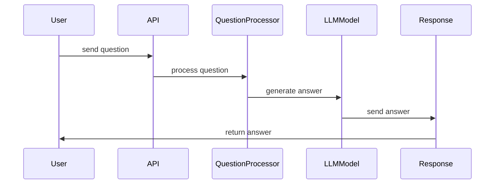

                 

# LLMA应用开发中的DevOps实践

> 关键词：DevOps，LLM，自动化，持续集成，持续部署，容器化

> 摘要：
在当前技术快速发展的时代，大型语言模型（LLM）的崛起成为人工智能领域的焦点。然而，LLM应用开发过程中所面临的部署难题、环境不一致性以及调试效率低下等问题，成为了阻碍其广泛应用的瓶颈。本文将深入探讨LLM应用开发中的DevOps实践，通过逻辑清晰、结构紧凑、简单易懂的论述，详细解析DevOps的核心概念、实践技术以及如何在LLM应用开发中进行有效应用，旨在为开发者提供一种切实可行的方法论，以解决传统开发与运维模式中的痛点，提升开发与运维的效率。

## 第一部分: 背景介绍

### 第1章: 引言与问题背景

#### 1.1 问题背景

在LLM应用开发过程中，传统的开发与运维（Development and Operations，简称DevOps）模式逐渐显现出其局限性。首先，传统的开发模式通常由开发人员负责编写代码，然后通过手动部署到生产环境，这一过程容易导致部署失败、环境不一致等问题。其次，运维人员在生产环境中的任务主要是维护系统运行，一旦出现故障，需要手动定位和解决问题，效率较低。这种模式不仅增加了开发与运维之间的摩擦，还影响了系统的稳定性和可靠性。

DevOps实践的出现，旨在解决上述问题。DevOps是一种文化和方法论，强调开发与运维的紧密协作和自动化。通过引入DevOps，开发者可以将代码从编写、测试、部署到生产环境的整个过程自动化，实现快速迭代和部署，从而提高开发效率，减少人为错误，确保系统的稳定性。

#### 1.2 问题解决

DevOps的核心在于其自动化、协作和持续集成与持续部署（CI/CD）等技术。自动化部署和配置管理可以确保环境一致性，减少手动操作带来的错误。协作可以提高团队之间的沟通和合作效率，确保项目顺利进行。持续集成和持续部署则可以快速将代码发布到生产环境，实现快速反馈和迭代。

在LLM应用开发中，DevOps实践可以帮助解决以下问题：

1. **部署困难**：通过自动化部署，可以将模型从开发环境快速部署到生产环境，减少手动操作，降低部署失败的风险。
2. **环境不一致**：通过配置管理工具，可以确保不同环境（如开发、测试、生产）之间的配置一致性，避免由于环境差异导致的部署失败。
3. **调试效率低下**：通过自动化测试和持续集成，可以快速发现和解决问题，提高调试效率。

#### 1.3 边界与外延

本文主要探讨LLM应用开发中的DevOps实践，涉及自动化部署、持续集成、持续部署、容器化等技术。虽然DevOps实践在LLM应用开发中具有重要意义，但本文不涉及其他领域（如云计算、大数据等）的DevOps实践。同时，本文还将介绍LLM的相关概念，以便读者更好地理解DevOps在LLM应用开发中的应用。

#### 1.4 概念结构与核心要素组成

DevOps：DevOps是一种文化和方法论，旨在通过开发与运维的紧密协作和自动化，实现快速迭代和部署。

LLM：大型语言模型，是一种具有强大文本理解和生成能力的人工智能模型，是当前AI领域的热点研究方向。

概念结构：

1. **自动化**：通过脚本、工具实现环境的自动化部署和配置。
2. **协作**：打破开发与运维的壁垒，实现紧密合作和沟通。
3. **持续集成（CI）**：通过自动化构建和测试，确保代码质量。
4. **持续部署（CD）**：自动化部署代码到生产环境，实现快速迭代。

核心要素组成：

1. **配置管理**：管理不同环境（开发、测试、生产）的配置。
2. **自动化部署**：将代码从开发环境快速部署到生产环境。
3. **持续集成**：自动化构建和测试，确保代码质量。
4. **持续部署**：自动化部署代码到生产环境，实现快速迭代。

### 第2章: 核心概念与联系

#### 2.1 DevOps核心概念

DevOps的核心概念包括自动化、协作、持续集成（CI）和持续部署（CD）。

1. **自动化**：自动化是DevOps的核心，通过脚本、工具实现环境的自动化部署和配置，减少手动操作，提高效率。

2. **协作**：协作是DevOps的重要原则，强调开发与运维的紧密合作和沟通，打破壁垒，实现高效的项目开发。

3. **持续集成（CI）**：持续集成是通过自动化构建和测试，确保代码质量。每次提交代码后，都会进行自动化构建和测试，确保代码的稳定性和可靠性。

4. **持续部署（CD）**：持续部署是通过自动化部署，将代码从开发环境快速部署到生产环境，实现快速迭代和部署。

#### 2.2 LLM相关概念

LLM是大型语言模型，具有强大的文本理解和生成能力。LLM的相关概念包括模型架构、预训练与微调、模型评估与优化。

1. **模型架构**：LLM的模型架构，如Transformer、BERT等，是文本理解和生成的基础。

2. **预训练与微调**：预训练是LLM的基础，通过在大规模数据集上进行训练，获取通用知识。微调是在预训练的基础上，对模型进行进一步调整，以适应特定任务。

3. **模型评估与优化**：模型评估是评估LLM性能的过程，包括准确率、召回率、F1值等指标。模型优化是通过调整超参数、改进模型结构等方式，提高模型性能。

#### 2.3 DevOps与LLM开发的关系

DevOps与LLM开发具有密切的关系。通过DevOps实践，可以解决LLM开发过程中面临的部署难题、环境不一致性和调试效率低下等问题。

1. **协同作用**：DevOps实践有助于LLM模型的快速迭代和部署，提高开发效率。

2. **挑战与解决方案**：解决LLM开发中的自动化部署、模型版本管理、性能优化等问题。

- **自动化部署**：通过容器化技术，如Docker和Kubernetes，实现LLM模型的自动化部署。
- **模型版本管理**：使用版本控制系统，如Git，管理模型版本。
- **性能优化**：通过监控和分析，优化LLM模型性能。

### 第二部分: DevOps实践技术

#### 第3章: 环境自动化配置与管理

#### 3.1 配置管理工具介绍

配置管理是DevOps实践的重要组成部分，通过配置管理工具，可以自动化地管理不同环境（开发、测试、生产）的配置，确保环境一致性。

常见的配置管理工具有Ansible、Chef和Puppet。

1. **Ansible**：Ansible是一种基于Python的配置管理工具，通过YAML语言描述配置，实现自动化部署和配置管理。

2. **Chef**：Chef是一种基于Ruby的配置管理工具，通过Cookbook管理配置文件，实现自动化部署和配置管理。

3. **Puppet**：Puppet是一种基于Ruby的配置管理工具，通过Manifest文件管理配置，实现自动化部署和配置管理。

#### 3.2 环境自动化配置方法

环境自动化配置可以通过脚本编写和使用配置管理工具两种方法实现。

1. **脚本编写**：使用Shell、Python等语言编写脚本，实现环境的自动化部署和配置。脚本可以根据不同环境（开发、测试、生产）的配置需求，自动化地安装软件、配置参数等。

2. **配置管理工具配置**：使用Ansible、Chef、Puppet等配置管理工具，通过配置文件实现环境的自动化部署和配置。配置文件描述了不同环境的配置细节，配置管理工具根据配置文件自动化地部署和配置环境。

#### 3.3 环境管理最佳实践

1. **版本控制**：使用Git等版本控制系统管理配置文件。每次修改配置文件时，都需要进行版本控制，确保配置文件的可追溯性和可恢复性。

2. **环境隔离**：为不同环境（开发、测试、生产）配置独立的环境。每个环境都应该有独立的配置文件和部署脚本，确保环境的独立性。

### 第4章: 持续集成与持续部署

#### 4.1 持续集成（CI）

持续集成是一种软件开发实践，通过自动化构建和测试，确保代码质量。每次提交代码后，都会进行自动化构建和测试，确保代码的稳定性和可靠性。

1. **CI流程**：CI流程包括代码提交、自动化构建、测试和反馈。

2. **工具介绍**：常见的持续集成工具有Jenkins、Travis CI、GitLab CI等。

- **Jenkins**：Jenkins是一种开源的持续集成工具，支持多种插件，可以实现复杂的CI流程。
- **Travis CI**：Travis CI是一种基于云的持续集成服务，支持多种编程语言和平台。
- **GitLab CI**：GitLab CI是GitLab内置的持续集成服务，可以在GitLab仓库中定义CI流程。

#### 4.2 持续部署（CD）

持续部署是一种软件开发实践，通过自动化部署，将代码从开发环境快速部署到生产环境，实现快速迭代和部署。

1. **CD流程**：CD流程包括自动化部署、测试和回滚。

2. **工具介绍**：常见的持续部署工具有Docker、Kubernetes等。

- **Docker**：Docker是一种容器化技术，可以将应用程序及其依赖环境打包成镜像，实现环境的隔离和可移植性。
- **Kubernetes**：Kubernetes是一种容器编排平台，可以管理容器的部署、扩展和监控。

#### 4.3 CI/CD最佳实践

1. **自动化测试**：编写和执行自动化测试用例，确保每次提交的代码都能通过测试，保证代码质量。

2. **部署策略**：选择合适的部署策略，如灰度发布、蓝绿部署等，确保部署的稳定性和安全性。

### 第5章: 容器化与容器编排

#### 5.1 容器化技术

容器化是一种将应用程序及其依赖环境打包成容器（Container）的技术，实现环境的隔离和可移植性。

1. **Docker简介**：Docker是一种开源的容器化技术，可以通过Dockerfile定义容器的构建过程，通过Docker Compose管理多个容器。

2. **容器化优势**：容器化具有以下优势：
- **环境一致性**：通过容器化，可以确保不同环境（开发、测试、生产）之间的配置一致，避免由于环境差异导致的部署失败。
- **部署灵活性和可移植性**：容器可以将应用程序及其依赖环境打包成镜像，实现部署的灵活性和可移植性，可以轻松在不同环境中部署和迁移。

#### 5.2 容器编排

容器编排是一种管理容器集群的技术，通过容器编排平台，可以实现容器的部署、扩展和监控。

1. **Kubernetes简介**：Kubernetes是一种开源的容器编排平台，可以管理容器的部署、扩展和监控。

2. **Kubernetes关键概念**：
- **Pod**：Pod是Kubernetes中的基本部署单元，可以包含一个或多个容器。
- **Service**：Service是一种抽象层，用于将Pod暴露给外界网络，实现负载均衡。
- **Ingress**：Ingress是一种抽象层，用于管理外部流量进入Kubernetes集群的规则。

3. **Kubernetes实战**：通过Kubernetes，可以部署和管理LLM应用。例如，可以使用Kubernetes部署LLM模型服务，实现水平扩展和负载均衡。

### 第三部分: LLM应用开发与DevOps实践

#### 第6章: LLM模型开发与部署

#### 6.1 LLM模型开发

LLM模型开发包括模型选择、模型训练与微调、模型评估与优化等环节。

1. **模型选择**：选择合适的LLM模型，如Transformer、BERT等。不同模型具有不同的性能和适用场景。

2. **模型训练与微调**：通过预训练和微调，获取通用知识和特定任务的能力。预训练是在大规模数据集上进行训练，获取通用知识；微调是在预训练的基础上，对模型进行进一步调整，以适应特定任务。

3. **模型评估与优化**：通过评估模型性能，如准确率、召回率、F1值等指标，进行模型优化。优化方法包括调整超参数、改进模型结构等。

#### 6.2 模型部署

模型部署是将训练好的LLM模型部署到生产环境，使其能够为用户提供服务。

1. **模型容器化**：将LLM模型转换为可部署的容器镜像。可以使用Docker等容器化技术，将模型及其依赖环境打包成镜像。

2. **模型部署策略**：选择合适的模型部署策略，如容器部署、服务部署等。容器部署是将模型镜像部署到容器中，服务部署是将模型容器暴露给外部网络。

#### 6.3 模型监控与维护

1. **模型监控**：监控模型性能和资源消耗，如响应时间、吞吐量、CPU利用率等。通过监控，可以及时发现和解决问题。

2. **模型维护**：更新和修复模型。随着任务的变更和数据的变化，可能需要对模型进行更新和修复，以保持其性能和准确性。

### 第7章: 项目实战与案例分析

#### 7.1 项目背景

假设我们正在开发一个基于LLM的问答系统，用户可以通过输入问题，获取系统的回答。该项目需要实现以下功能：

1. **接收用户问题**：接收用户输入的问题，并将其发送给LLM模型。
2. **处理和预处理问题**：对用户问题进行预处理，如去除无关信息、标准化输入等。
3. **调用LLM模型**：将预处理后的用户问题发送给LLM模型，获取回答。
4. **返回回答**：将LLM模型的回答返回给用户。

#### 7.2 系统架构设计

系统的架构设计如图1所示：

```mermaid
classDiagram
    User <<User>>
    QuestionProcessor <<QuestionProcessor>>
    LLMModel <<LLMModel>>
    Response <<Response>>

    User --> QuestionProcessor : input question
    QuestionProcessor --> LLMModel : process question
    LLMModel --> Response : generate answer
    Response --> User : return answer
```

图1 系统架构设计

#### 7.3 系统功能设计

系统的功能设计如图2所示：

```mermaid
classDiagram
    User <<User>>
    QuestionProcessor <<QuestionProcessor>>
    LLMModel <<LLMModel>>
    Response <<Response>>

    User --> QuestionProcessor : input question
    QuestionProcessor --> LLMModel : process question
    LLMModel --> Response : generate answer
    Response --> User : return answer
```

图2 系统功能设计

#### 7.4 系统架构设计

系统的架构设计如图3所示：

```mermaid
graph TB
    subgraph Application Layers
        User Interface
        Application Logic
        Data Access Layer
    end
    subgraph Infrastructure Layers
        Database
        Message Queue
        Cache
    end
    User Interface --> Application Logic
    Application Logic --> Data Access Layer
    Data Access Layer --> Database
    Data Access Layer --> Message Queue
    Data Access Layer --> Cache
```

图3 系统架构设计

#### 7.5 系统接口设计

系统的接口设计如图4所示：



图4 系统接口设计

#### 7.6 系统交互

系统的交互设计如图5所示：


图5 系统交互

#### 7.7 项目实施

项目的实施过程如下：

1. **需求分析**：根据用户需求，分析系统功能和技术实现。
2. **系统设计**：根据需求分析，设计系统架构、功能模块和接口。
3. **编码实现**：根据系统设计，进行编码实现。
4. **测试与调试**：对系统进行测试和调试，确保系统功能正确、性能稳定。
5. **部署上线**：将系统部署到生产环境，对外提供服务。

#### 7.8 实际案例

假设我们使用Transformer模型构建了一个问答系统，实际案例如下：

1. **需求分析**：用户需要输入问题，获取系统回答。
2. **系统设计**：使用Docker容器化技术，将LLM模型和问答系统部署到Kubernetes集群中，实现环境一致性和可移植性。
3. **编码实现**：使用Python编写问答系统，实现用户输入问题、处理和预处理、调用LLM模型、返回回答等功能。
4. **测试与调试**：对系统进行测试，确保功能正确、性能稳定。
5. **部署上线**：将系统部署到生产环境，对外提供服务。

#### 7.9 项目小结

通过本项目的实施，我们深入了解了LLM应用开发中的DevOps实践，包括自动化部署、持续集成、持续部署、容器化等技术。同时，我们也学会了如何设计、实现和部署一个基于LLM的问答系统。在项目过程中，我们遇到了一些挑战，如环境不一致性、部署失败等，但通过DevOps实践，我们成功解决了这些问题，提高了开发效率和系统稳定性。

### 小结

通过本文的探讨，我们深入了解了LLM应用开发中的DevOps实践。DevOps通过自动化、协作和持续集成与持续部署等技术，解决了传统开发与运维模式中的痛点，提高了开发与运维的效率。在LLM应用开发中，通过引入DevOps实践，我们可以实现自动化部署、持续集成和持续部署，提高开发效率，确保系统稳定性。

注意事项：

1. 在实施DevOps实践时，需要充分考虑团队的协作和沟通，确保团队成员之间能够高效配合。
2. 自动化是DevOps的核心，但在实现自动化时，需要确保自动化流程的可靠性和稳定性。
3. 持续集成和持续部署可以提高开发效率，但需要确保代码质量和系统稳定性。

拓展阅读：

1. 《DevOps实践指南》：了解DevOps的核心概念和实践方法。
2. 《深度学习》：了解LLM模型的基本原理和应用。

作者：AI天才研究院/AI Genius Institute & 禅与计算机程序设计艺术/Zen And The Art of Computer Programming

