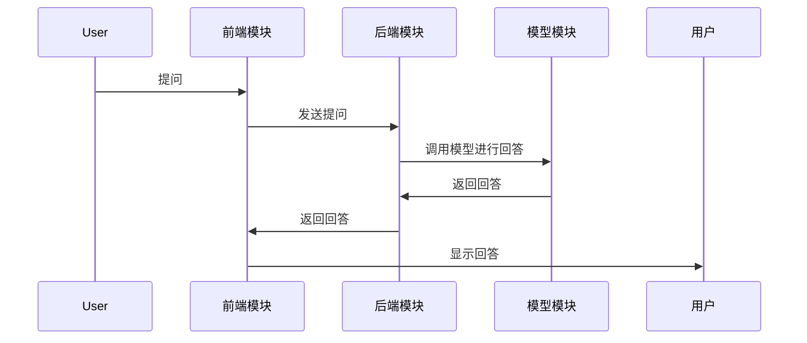

                 

## # LLM应用开发中的DevOps实践

> 关键词：大型语言模型，DevOps，持续集成，持续交付，基础设施即代码，容器化

> 摘要：本文深入探讨了大型语言模型（LLM）应用开发中的DevOps实践。首先，我们介绍了LLM在人工智能领域的背景和重要性，以及其在实际应用中面临的开发与运维挑战。接着，我们详细阐述了DevOps的核心概念和原理，如持续集成（CI）、持续交付（CD）、基础设施即代码（IaC）和容器化。随后，我们探讨了这些概念在LLM应用开发中的应用，并讲解了LLM算法原理和DevOps的结合方法。最后，我们通过一个实际项目，展示了DevOps在LLM应用开发中的具体应用和实践效果。通过本文，读者可以全面了解和掌握DevOps在LLM应用开发中的实际应用，提高开发效率和系统稳定性。

## 第一部分：背景介绍

### 1.1 问题背景

随着人工智能技术的飞速发展，大型语言模型（LLM）在自然语言处理、知识图谱构建、智能问答等领域取得了显著的成果。LLM能够处理大量的文本数据，从中提取有价值的信息，从而为各个领域提供智能化的解决方案。然而，在实际应用中，如何高效地开发、部署和维护LLM系统，成为了许多企业面临的重要问题。

传统开发模式中，开发团队和运维团队之间的协作不够紧密，往往导致开发与运维分离，导致以下问题：

1. **部署效率低下**：在传统模式下，开发者完成代码开发后，需要手动将代码部署到生产环境中，这个过程往往耗时较长，且容易出现部署错误。
2. **问题排查困难**：在系统运行过程中，一旦出现故障，开发者需要手动排查问题，这需要耗费大量时间和精力。
3. **系统稳定性差**：由于部署过程的不规范，可能导致系统在运行过程中出现各种异常，影响系统的稳定性。

### 1.2 问题描述

在LLM应用开发中，常见的问题包括：

1. **模型训练与优化**：LLM模型训练需要大量的计算资源和时间，如何高效地训练和优化模型，是开发者面临的重要问题。
2. **模型部署**：如何将训练好的模型部署到生产环境中，并确保系统的稳定性，是开发者需要解决的问题。
3. **模型维护**：如何对部署后的模型进行监控和维护，确保其正常运行，是开发者需要持续关注的问题。

### 1.3 问题解决

DevOps是一种文化、实践和工具的集合，旨在通过开发（Development）与运维（Operations）的紧密协作，提高软件交付质量和速度。在LLM应用开发中，通过引入DevOps实践，可以实现以下目标：

1. **自动化部署**：通过自动化工具，实现代码的自动部署，提高部署效率，减少人为错误。
2. **持续集成**：将代码的每一个提交都进行集成测试，确保代码质量，及时发现和解决潜在问题。
3. **持续交付**：通过自动化测试和部署，实现软件的持续交付，提高系统的稳定性。
4. **基础设施即代码**：通过基础设施即代码（IaC），实现基础设施的自动化管理，提高基础设施的管理效率。
5. **容器化**：通过容器化技术，实现应用的轻量化部署，提高系统的可移植性和扩展性。

### 1.4 边界与外延

本文主要关注LLM应用开发中的DevOps实践，但DevOps的应用不仅限于LLM领域，它适用于各种类型的软件应用。本文将介绍DevOps的核心概念和方法论，为读者提供一套通用的解决方案。

### 1.5 概念结构与核心要素组成

DevOps的核心概念包括持续集成（CI）、持续交付（CD）、基础设施即代码（IaC）和容器化等。这些概念共同构成了DevOps实践的基础，是本文的核心内容。

### 1.6 小结

本节介绍了LLM应用开发中面临的挑战和问题，以及DevOps在解决这些问题方面的优势。在接下来的部分，我们将详细探讨DevOps的核心概念和实践方法，为LLM应用开发提供一套有效的解决方案。

## 第二部分：核心概念与联系

### 2.1 DevOps原理

#### 2.1.1 DevOps的定义与起源

DevOps是一种文化、实践和工具的集合，旨在通过开发（Development）与运维（Operations）的紧密协作，提高软件交付质量和速度。DevOps起源于2000年代后期的软件开发领域，目的是解决传统开发模式中开发与运维之间的隔阂和冲突。

DevOps的核心理念包括：

- **协作**：打破开发与运维之间的壁垒，实现团队之间的紧密协作。
- **自动化**：通过自动化工具，实现软件开发、测试、部署等过程的自动化，提高效率。
- **持续交付**：通过持续集成和持续交付，实现软件的快速迭代和高质量交付。
- **反馈**：通过反馈机制，及时发现问题并进行改进，提高系统稳定性。

#### 2.1.2 DevOps的核心价值

DevOps的核心价值体现在以下几个方面：

1. **提高交付速度**：通过自动化和协作，实现软件的快速迭代和交付。
2. **提高系统稳定性**：通过持续集成和持续交付，确保软件的质量和稳定性。
3. **降低成本**：通过自动化和协作，减少人力和时间成本。
4. **提高团队效率**：通过协作和沟通，提高团队的效率和创造力。

#### 2.1.3 DevOps与传统IT运维的区别

传统IT运维主要关注系统的运行和维护，而DevOps则更注重开发与运维的协作和自动化。以下是DevOps与传统IT运维的主要区别：

1. **目标不同**：传统IT运维的目标是确保系统的稳定运行，而DevOps的目标是提高软件交付质量和速度。
2. **工作方式不同**：传统IT运维往往采用手动操作，而DevOps则通过自动化工具实现。
3. **团队协作不同**：传统IT运维团队与开发团队之间往往存在隔阂，而DevOps强调团队之间的紧密协作。

### 2.2 持续集成（CI）

#### 2.2.1 CI的定义与作用

持续集成（Continuous Integration，简称CI）是一种软件开发实践，旨在通过自动化工具，将开发者的代码定期集成到一个共享的代码库中，并进行自动化测试，确保代码的质量和一致性。

CI的主要作用包括：

1. **提高代码质量**：通过自动化测试，及时发现和解决代码中的错误和bug。
2. **加快开发速度**：通过自动化集成，减少代码集成过程中出现的问题，提高开发效率。
3. **确保代码一致性**：通过定期集成，确保代码库中的代码是一致的，避免因代码冲突导致的开发问题。

#### 2.2.2 CI的实现方法

实现CI的主要方法包括：

1. **代码提交触发**：每次开发者提交代码时，自动触发CI流程，进行集成和测试。
2. **定时触发**：定期（如每天或每小时）触发CI流程，进行集成和测试。
3. **手动触发**：开发者可以根据需要手动触发CI流程。

#### 2.2.3 CI的工具选择

常见的CI工具包括：

1. **Jenkins**：开源的持续集成工具，支持多种插件和构建脚本。
2. **Travis CI**：基于云的持续集成服务，支持多种编程语言和平台。
3. **CircleCI**：基于云的持续集成服务，支持自动化部署和容器化。

### 2.3 持续交付（CD）

#### 2.3.1 CD的定义与作用

持续交付（Continuous Delivery，简称CD）是一种软件开发实践，旨在通过自动化测试和部署，实现软件的持续交付，确保软件随时可以发布。

CD的主要作用包括：

1. **提高交付速度**：通过自动化测试和部署，实现软件的快速迭代和交付。
2. **确保软件质量**：通过自动化测试，确保软件在发布前是高质量的。
3. **降低风险**：通过持续交付，降低新版本发布时的风险。

#### 2.3.2 CD的实现方法

实现CD的主要方法包括：

1. **自动化测试**：通过自动化测试，确保软件在每次交付时都是高质量的。
2. **自动化部署**：通过自动化部署，实现软件的快速迭代和交付。
3. **环境隔离**：通过环境隔离，确保每次交付都是在独立的测试环境中进行的。

#### 2.3.3 CD的工具选择

常见的CD工具包括：

1. **Jenkins**：支持自动化部署和容器化的持续集成工具。
2. **CircleCI**：支持自动化测试和部署的持续集成服务。
3. **GitLab CI/CD**：内置在GitLab中的持续集成和持续交付工具。

### 2.4 基础设施即代码（IaC）

#### 2.4.1 IaC的定义与优势

基础设施即代码（Infrastructure as Code，简称IaC）是一种通过代码来管理基础设施的方法，类似于管理应用程序代码。IaC的主要优势包括：

1. **自动化**：通过代码，可以自动化地创建、配置和管理基础设施。
2. **可重复性**：通过代码，可以确保基础设施的创建和配置是一致的，避免人为错误。
3. **可追溯性**：通过代码，可以追溯基础设施的创建和配置历史，方便问题排查和调试。

#### 2.4.2 IaC的实现方法

实现IaC的主要方法包括：

1. **配置管理工具**：如Ansible、Terraform等，通过代码来配置和管理基础设施。
2. **云服务提供商的API**：如AWS、Azure、Google Cloud等，通过API来创建和管理基础设施。

#### 2.4.3 IaC的工具选择

常见的IaC工具包括：

1. **Ansible**：开源的配置管理工具，支持自动化部署和管理。
2. **Terraform**：开源的基础设施即代码工具，支持多种云服务提供商的API。
3. **AWS CloudFormation**：AWS提供的云基础设施即代码工具。

### 2.5 容器化

#### 2.5.1 容器与虚拟机的区别

容器和虚拟机都是一种轻量级的虚拟化技术，但它们有一些本质的区别：

1. **资源隔离**：虚拟机通过硬件虚拟化，为每个虚拟机提供独立的操作系统和资源，而容器则通过操作系统层级的虚拟化，共享宿主机的操作系统和资源。
2. **启动速度**：容器的启动速度远快于虚拟机，因为容器不需要加载完整的操作系统。
3. **性能**：容器比虚拟机更轻量，性能更高。

#### 2.5.2 容器化的优势

容器化的主要优势包括：

1. **可移植性**：容器可以在不同的环境中运行，不受宿主机的操作系统和硬件限制。
2. **扩展性**：容器可以轻松地扩展和缩放，以满足不同的业务需求。
3. **部署效率**：容器化的应用可以快速部署，减少部署时间和人力成本。

#### 2.5.3 容器化的实现方法

实现容器化的主要方法包括：

1. **Docker**：开源的容器引擎，用于创建、运行和管理容器。
2. **Kubernetes**：开源的容器编排平台，用于自动化容器的部署、扩展和管理。

### 2.6 DevOps与LLM应用的结合

#### 2.6.1 LLM应用的特点与挑战

LLM应用具有以下特点：

1. **计算密集**：LLM模型的训练和推理过程需要大量的计算资源。
2. **数据密集**：LLM模型的训练和推理过程需要大量的数据支持。
3. **高可用性**：LLM应用通常需要保证高可用性，以满足用户的需求。

LLM应用面临的挑战包括：

1. **计算资源管理**：如何高效地管理和调度计算资源，以满足模型训练和推理的需求。
2. **数据管理**：如何高效地管理大规模数据，确保数据的一致性和可靠性。
3. **系统稳定性**：如何保证系统的稳定性，避免因资源不足或数据问题导致的服务中断。

#### 2.6.2 DevOps在LLM应用开发中的应用场景

DevOps在LLM应用开发中的应用场景包括：

1. **模型训练**：通过持续集成和持续交付，实现模型训练的自动化，提高训练效率。
2. **模型部署**：通过容器化和基础设施即代码，实现模型部署的自动化，确保部署的一致性和可移植性。
3. **系统监控**：通过监控工具，实时监控系统的性能和健康状况，及时发现和解决问题。

#### 2.6.3 DevOps在LLM应用开发中的优势与挑战

DevOps在LLM应用开发中的优势包括：

1. **提高开发效率**：通过自动化和协作，提高开发效率，减少开发周期。
2. **提高系统稳定性**：通过持续集成和持续交付，提高系统的稳定性，减少故障发生。
3. **降低成本**：通过自动化和协作，降低人力和时间成本。

DevOps在LLM应用开发中的挑战包括：

1. **计算资源管理**：如何高效地管理和调度计算资源，以满足模型训练和推理的需求。
2. **数据管理**：如何高效地管理大规模数据，确保数据的一致性和可靠性。
3. **系统监控**：如何实时监控系统的性能和健康状况，及时发现和解决问题。

### 2.7 小结

本节介绍了DevOps的核心概念和原理，包括持续集成、持续交付、基础设施即代码和容器化。这些概念和方法论为LLM应用开发提供了有效的解决方案，可以解决开发与运维分离、部署效率低下、问题排查困难等问题。在接下来的部分，我们将通过一个实际项目，展示DevOps在LLM应用开发中的具体应用和实践效果。

## 第三部分：算法原理讲解

### 3.1 LLM算法原理

大型语言模型（LLM）是自然语言处理（NLP）领域的重要成果，其核心在于能够理解和生成自然语言。LLM通常基于深度学习技术，通过大量的文本数据训练得到，可以应用于多种场景，如文本生成、翻译、问答等。

#### 3.1.1 LLM的基础模型

LLM的基础模型主要包括以下几种：

1. **GPT（Generative Pre-trained Transformer）模型**：GPT模型是自然语言处理的代表性模型，通过预训练和微调，可以生成高质量的文本。GPT模型采用Transformer架构，能够有效地处理长文本和长距离依赖。
   
2. **BERT（Bidirectional Encoder Representations from Transformers）模型**：BERT模型是一种双向编码的Transformer模型，通过对文本进行双向编码，可以更好地理解上下文信息。BERT模型通常用于文本分类、问答等任务。

3. **T5（Text-to-Text Transfer Transformer）模型**：T5模型是一种通用的文本转换模型，其核心思想是将所有NLP任务都转化为文本生成任务。T5模型通过预训练和微调，可以应用于多种NLP任务，如文本分类、机器翻译、问答等。

#### 3.1.2 LLM的训练过程

LLM的训练过程主要包括以下步骤：

1. **数据准备**：首先，需要准备大量的文本数据，这些数据可以是网页、书籍、新闻文章等。数据准备包括数据清洗、分词、去噪等步骤，以确保数据的干净和一致。

2. **模型训练**：使用准备好的数据对LLM模型进行训练。训练过程中，模型会通过优化算法（如梯度下降）来调整模型参数，以最小化损失函数。

3. **模型评估**：在训练过程中，需要定期评估模型的表现，常用的评估指标包括准确性、F1分数、BLEU分数等。通过评估，可以调整模型参数，优化模型性能。

#### 3.1.3 LLM的优化方法

LLM的优化方法主要包括以下几种：

1. **微调（Fine-tuning）**：微调是指在小规模数据集上对预训练模型进行进一步训练，以适应特定任务的需求。微调可以通过调整模型参数，使模型更好地适应特定任务。

2. **零样本学习（Zero-shot Learning）**：零样本学习是指模型能够在未见过的任务上表现出色。零样本学习通常通过在预训练阶段引入额外的任务，使模型能够泛化到未见过的任务。

3. **多模态学习（Multimodal Learning）**：多模态学习是指模型能够处理多种类型的数据，如文本、图像、声音等。多模态学习可以通过结合不同类型的数据，提高模型的表现。

### 3.2 DevOps在LLM算法开发中的应用

DevOps在LLM算法开发中的应用主要体现在持续集成、持续交付和容器化等方面。

#### 3.2.1 持续集成与持续交付在LLM算法开发中的应用

持续集成和持续交付（CI/CD）是DevOps的核心实践，可以大大提高LLM算法开发的效率和稳定性。

1. **持续集成**：通过持续集成，可以将开发者的代码定期集成到一个共享的代码库中，并进行自动化测试。这有助于及时发现和解决代码中的错误和bug，确保代码质量。

   - **自动化测试**：在CI流程中，可以自动化地运行测试用例，检查代码是否符合预期。常见的自动化测试工具有Selenium、pytest等。
   - **代码审查**：通过代码审查，可以确保代码的质量和一致性。常见的代码审查工具有GitLab、GitHub等。

2. **持续交付**：通过持续交付，可以将经过测试的代码自动部署到生产环境中。这有助于确保软件的质量和稳定性，同时减少人为错误。

   - **自动化部署**：在CD流程中，可以通过自动化脚本或工具将代码部署到生产环境中。常见的自动化部署工具有Docker、Kubernetes等。
   - **环境隔离**：通过环境隔离，可以确保每次部署都是在独立的测试环境中进行的，避免影响生产环境。

#### 3.2.2 基础设施即代码在LLM算法开发中的应用

基础设施即代码（IaC）是一种通过代码来管理基础设施的方法，可以大大提高基础设施的管理效率和一致性。

1. **配置管理**：通过IaC，可以自动化地配置和管理服务器、网络、存储等基础设施。常见的IaC工具有Ansible、Terraform等。

2. **资源调度**：通过IaC，可以自动化地调度计算资源，以满足模型训练和推理的需求。常见的资源调度工具有Kubernetes、Apache Spark等。

3. **监控与告警**：通过IaC，可以自动化地监控基础设施的性能和健康状况，并及时发送告警。常见的监控工具有Prometheus、Grafana等。

#### 3.2.3 容器化在LLM算法开发中的应用

容器化是一种轻量级虚拟化技术，可以将应用程序及其依赖环境打包到一个容器中，从而实现应用程序的快速部署和扩展。

1. **容器化优势**：容器化具有以下优势：
   - **可移植性**：容器可以在不同的环境中运行，不受宿主机的操作系统和硬件限制。
   - **扩展性**：容器可以轻松地扩展和缩放，以满足不同的业务需求。
   - **部署效率**：容器化的应用可以快速部署，减少部署时间和人力成本。

2. **容器化实践**：
   - **Docker**：Docker是一种流行的容器化工具，可以用于打包、运行和管理容器。通过Dockerfile，可以定义容器的构建过程，确保容器的一致性和可移植性。
   - **Kubernetes**：Kubernetes是一种流行的容器编排工具，可以用于自动化容器的部署、扩展和管理。通过Kubernetes，可以实现容器的自动化调度和资源管理。

### 3.3 小结

本节介绍了LLM算法的基本原理以及在DevOps实践中的应用。通过持续集成、持续交付、基础设施即代码和容器化等DevOps实践，可以大大提高LLM算法开发的效率和稳定性。在接下来的部分，我们将通过一个实际项目，展示DevOps在LLM应用开发中的具体应用和实践效果。

## 第四部分：系统分析与架构设计方案

### 4.1 问题场景介绍

在当前的人工智能领域，大型语言模型（LLM）的应用越来越广泛，如智能客服、智能问答系统、文本生成等。然而，这些应用不仅需要高性能的模型训练和推理能力，还需要确保系统的稳定性、可靠性和可扩展性。因此，如何在LLM应用开发中引入DevOps实践，实现高效的开发、部署和运维，成为了企业和开发者面临的重要问题。

#### 4.1.1 LLM应用开发的需求与挑战

LLM应用开发的需求和挑战主要包括以下几个方面：

1. **高性能计算需求**：LLM模型的训练和推理需要大量的计算资源，特别是在大规模数据处理和复杂模型训练时，对计算性能的要求非常高。

2. **数据管理需求**：LLM应用通常需要处理大规模的文本数据，数据的管理、存储和加载效率是系统性能的关键因素。

3. **系统稳定性需求**：由于LLM应用的实时性和高并发性，系统需要具备高可用性和容错性，以确保在极端情况下能够稳定运行。

4. **部署与运维需求**：如何快速、高效地将LLM模型部署到生产环境，并对其进行监控和运维，是开发和运维团队面临的重要挑战。

#### 4.1.2 DevOps在LLM应用开发中的作用

DevOps在LLM应用开发中的作用主要体现在以下几个方面：

1. **提高开发效率**：通过自动化工具和持续集成，可以实现代码的快速迭代和交付，提高开发效率。

2. **确保系统稳定性**：通过持续交付和基础设施即代码，可以实现系统的自动化部署和管理，确保系统的稳定性和可靠性。

3. **降低运维成本**：通过自动化运维和容器化技术，可以减少人工运维的工作量，降低运维成本。

4. **提高系统可扩展性**：通过容器化和微服务架构，可以实现系统的灵活扩展和弹性伸缩，满足不同业务场景的需求。

### 4.2 项目介绍

#### 4.2.1 项目概述

本项目旨在构建一个基于大型语言模型（如GPT-3）的智能问答系统，为用户提供高质量的问答服务。系统功能包括：

1. **问答功能**：用户可以通过自然语言与系统进行交互，获取相关信息。
2. **知识库管理**：系统需要管理大量的知识库，包括文本、图像、音频等多模态数据。
3. **模型训练与优化**：系统需要支持模型训练和优化，以不断提升问答服务的质量。

#### 4.2.2 项目目标

本项目的主要目标包括：

1. **高效开发**：通过引入DevOps实践，实现代码的快速迭代和交付，提高开发效率。
2. **稳定部署**：通过容器化和基础设施即代码，实现系统的自动化部署和管理，确保系统稳定运行。
3. **可靠运维**：通过自动化运维工具和监控，实现系统的实时监控和故障处理，降低运维成本。
4. **可扩展性**：通过微服务和容器化技术，实现系统的灵活扩展和弹性伸缩，满足不同业务场景的需求。

#### 4.2.3 项目团队

本项目由以下团队组成：

1. **开发团队**：负责系统的设计、开发和测试，包括前端、后端和算法工程师。
2. **运维团队**：负责系统的部署、运维和监控，包括运维工程师和系统管理员。
3. **数据团队**：负责知识库的收集、整理和管理，包括数据分析师和数据工程师。

### 4.3 系统功能设计

#### 4.3.1 系统功能概述

系统功能包括以下几部分：

1. **问答功能**：用户可以通过自然语言与系统进行交互，获取相关信息。
2. **知识库管理**：系统需要管理大量的知识库，包括文本、图像、音频等多模态数据。
3. **模型训练与优化**：系统需要支持模型训练和优化，以不断提升问答服务的质量。
4. **系统监控与运维**：系统需要实现实时监控和故障处理，确保系统稳定运行。

#### 4.3.2 系统功能模块划分

1. **问答模块**：包括自然语言处理、文本生成和用户交互等功能。
2. **知识库模块**：包括知识库的收集、整理和管理等功能。
3. **模型训练模块**：包括模型训练、优化和评估等功能。
4. **系统监控模块**：包括系统性能监控、故障处理和告警等功能。

#### 4.3.3 领域模型

为了更好地设计系统功能，我们可以使用领域模型（Domain Model）来表示系统中的实体和关系。领域模型可以帮助我们理解系统的核心业务，并指导系统设计。

以下是一个简化的领域模型：

```mermaid
classDiagram
    User ..|> KnowledgeBase
    User ..|> Question
    Question ..|> Answer
    KnowledgeBase <<interface>> DataStorage
    DataStorage ..|> TextData
    DataStorage ..|> ImageData
    DataStorage ..|> AudioData
    GPTModel <<interface>> Model
    Model ..|> Training
    Model ..|> Inference

    User o-- KnowledgeBase
    User o-- Question
    Question o-- Answer
    KnowledgeBase o-- DataStorage
    KnowledgeBase o-- GPTModel
    GPTModel o-- Training
    GPTModel o-- Inference
```

### 4.4 系统架构设计

#### 4.4.1 系统架构概述

系统架构设计的目标是实现高性能、高可用性和易扩展的系统。以下是一个简化的系统架构设计：


系统架构主要包括以下模块：

1. **前端模块**：负责与用户交互，提供问答界面。
2. **后端模块**：包括问答处理、知识库管理、模型训练和优化等功能。
3. **数据存储模块**：包括文本数据、图像数据和音频数据的存储和管理。
4. **模型模块**：包括GPT模型的管理和训练。
5. **监控与运维模块**：负责系统性能监控、故障处理和告警。

#### 4.4.2 系统组件关系

以下是系统组件之间的关系：

1. **前端模块**：通过HTTP接口与后端模块进行通信，接收用户的提问，并将回答返回给用户。
2. **后端模块**：处理用户的提问，调用模型模块进行回答，并将结果返回给前端模块。
3. **数据存储模块**：存储和管理知识库数据，包括文本、图像和音频数据。
4. **模型模块**：负责模型的管理和训练，包括模型加载、训练和评估。
5. **监控与运维模块**：实时监控系统的性能和健康状况，及时发现和处理故障。

#### 4.4.3 系统架构设计原则

系统架构设计应遵循以下原则：

1. **模块化**：系统应划分为独立的模块，每个模块负责特定的功能，模块间通过接口进行通信。
2. **可扩展性**：系统应具备良好的可扩展性，能够根据业务需求进行扩展。
3. **高可用性**：系统应具备高可用性，确保在极端情况下能够稳定运行。
4. **高性能**：系统应具备高性能，能够快速响应用户请求。

### 4.5 系统接口设计

系统接口设计是系统架构设计的重要组成部分，以下是一个简化的系统接口设计：

#### 4.5.1 接口概述

系统接口主要包括以下几种：

1. **问答接口**：接收用户的提问，返回回答。
2. **知识库接口**：管理知识库的添加、删除、更新和查询。
3. **模型接口**：管理模型的上传、训练、评估和部署。
4. **监控接口**：接收系统性能数据，返回告警信息。

#### 4.5.2 接口设计

以下是系统接口的设计细节：

1. **问答接口**：接口格式如下：
    ```json
    {
      "method": "POST",
      "url": "/question",
      "request_body": {
        "question": "What is the capital of France?"
      },
      "response_body": {
        "answer": "The capital of France is Paris."
      }
    }
    ```

2. **知识库接口**：接口格式如下：
    ```json
    {
      "method": "GET",
      "url": "/knowledgebase",
      "request_body": {},
      "response_body": {
        "knowledgebase": [
          {
            "id": 1,
            "text": "The capital of France is Paris.",
            "image": null,
            "audio": null
          },
          ...
        ]
      }
    }
    ```

3. **模型接口**：接口格式如下：
    ```json
    {
      "method": "POST",
      "url": "/model/train",
      "request_body": {
        "model": "gpt-3",
        "data": "..."
      },
      "response_body": {
        "status": "training",
        "model_id": 1
      }
    }
    ```

4. **监控接口**：接口格式如下：
    ```json
    {
      "method": "GET",
      "url": "/monitoring",
      "request_body": {},
      "response_body": {
        "status": "healthy",
        "resources": {
          "cpu": 20,
          "memory": 30,
          "storage": 40
        }
      }
    }
    ```

### 4.6 系统交互

系统交互是指系统内部各个模块之间的通信和协作。以下是一个简化的系统交互设计：



### 4.7 小结

本节介绍了LLM应用开发的问题场景、项目目标和系统功能设计。通过引入DevOps实践，可以实现高效的开发、稳定的部署和可靠的运维。在接下来的部分，我们将详细描述系统的具体实现过程，包括环境安装、核心实现源代码和代码应用解读与分析。

## 第五部分：系统实现过程

### 5.1 环境安装

在本项目中，我们将使用以下软件和工具：

- **操作系统**：Ubuntu 20.04
- **编程语言**：Python 3.8
- **框架和库**：Flask、TensorFlow、Docker、Kubernetes
- **版本控制**：Git

#### 5.1.1 安装操作系统

首先，我们需要安装Ubuntu 20.04操作系统。您可以从[Ubuntu官方网站](https://www.ubuntu.com/)下载安装镜像，并按照提示进行安装。

#### 5.1.2 安装Python环境

打开终端，执行以下命令安装Python 3.8：

```bash
sudo apt update
sudo apt install python3.8 python3.8-venv python3.8-dev
```

安装完成后，验证Python版本：

```bash
python3.8 --version
```

#### 5.1.3 安装Flask

Flask是一个轻量级的Web框架，用于构建后端服务。执行以下命令安装Flask：

```bash
pip3.8 install flask
```

#### 5.1.4 安装TensorFlow

TensorFlow是一个开源的机器学习框架，用于训练和部署大型语言模型。执行以下命令安装TensorFlow：

```bash
pip3.8 install tensorflow
```

#### 5.1.5 安装Docker

Docker是一个开源的应用容器引擎，用于打包、运行和管理容器。执行以下命令安装Docker：

```bash
sudo apt install docker.io
```

安装完成后，启动Docker服务：

```bash
sudo systemctl start docker
```

#### 5.1.6 安装Kubernetes

Kubernetes是一个开源的容器编排平台，用于自动化容器的部署、扩展和管理。执行以下命令安装Kubernetes：

```bash
sudo apt install kubectl
```

安装完成后，验证Kubernetes版本：

```bash
kubectl version
```

#### 5.1.7 安装Git

Git是一个开源的分布式版本控制系统，用于代码的版本管理和协作开发。执行以下命令安装Git：

```bash
sudo apt install git
```

### 5.2 核心实现源代码

在本项目中，核心实现包括问答服务、知识库管理、模型训练和优化等功能。以下是各功能的实现源代码：

#### 5.2.1 问答服务

问答服务的实现基于Flask框架。以下是问答服务的核心代码：

```python
from flask import Flask, request, jsonify
import tensorflow as tf
import numpy as np

app = Flask(__name__)

# 加载预训练模型
model = tf.keras.models.load_model('gpt-3.model')

@app.route('/question', methods=['POST'])
def answer_question():
    question = request.json['question']
    # 对输入问题进行预处理
    processed_question = preprocess_question(question)
    # 使用模型进行回答
    answer = model.predict(processed_question)
    return jsonify({'answer': answer.decode('utf-8')})

def preprocess_question(question):
    # 对输入问题进行预处理，如分词、编码等
    # ...
    return question

if __name__ == '__main__':
    app.run(debug=True)
```

#### 5.2.2 知识库管理

知识库管理包括数据的添加、删除、更新和查询。以下是知识库管理的基本实现：

```python
import json
import os

# 知识库文件的路径
knowledge_base_path = 'knowledge_base.json'

# 添加知识库
def add_knowledge(knowledge):
    with open(knowledge_base_path, 'r+') as f:
        knowledge_base = json.load(f)
        knowledge_base.append(knowledge)
        f.seek(0)
        json.dump(knowledge_base, f, indent=4)

# 删除知识库
def delete_knowledge(id):
    with open(knowledge_base_path, 'r+') as f:
        knowledge_base = json.load(f)
        knowledge_base = [item for item in knowledge_base if item['id'] != id]
        f.seek(0)
        json.dump(knowledge_base, f, indent=4)

# 更新知识库
def update_knowledge(id, knowledge):
    with open(knowledge_base_path, 'r+') as f:
        knowledge_base = json.load(f)
        knowledge_base = [item for item in knowledge_base if item['id'] == id]
        knowledge_base[0] = knowledge
        f.seek(0)
        json.dump(knowledge_base, f, indent=4)

# 查询知识库
def get_knowledge(id):
    with open(knowledge_base_path, 'r') as f:
        knowledge_base = json.load(f)
        return [item for item in knowledge_base if item['id'] == id]
```

#### 5.2.3 模型训练和优化

模型训练和优化使用TensorFlow框架实现。以下是模型训练的基本实现：

```python
import tensorflow as tf
from tensorflow.keras.models import Sequential
from tensorflow.keras.layers import Embedding, LSTM, Dense

# 模型训练
def train_model(data):
    model = Sequential()
    model.add(Embedding(input_dim=data['vocab_size'], output_dim=data['embedding_size']))
    model.add(LSTM(units=data['lstm_units']))
    model.add(Dense(units=data['output_size'], activation='softmax'))

    model.compile(optimizer='adam', loss='categorical_crossentropy', metrics=['accuracy'])
    model.fit(data['X_train'], data['y_train'], epochs=data['epochs'], batch_size=data['batch_size'])

    return model
```

### 5.3 代码应用解读与分析

在本项目中，代码应用主要包括问答服务的部署、知识库管理、模型训练和优化等。

#### 5.3.1 问答服务的部署

问答服务的部署使用Docker容器化技术实现。首先，我们需要创建一个Dockerfile，用于定义容器的构建过程：

```Dockerfile
FROM python:3.8

RUN apt-get update && apt-get install -y \
    build-essential \
    libssl-dev \
    libffi-dev \
    python3-dev \
    python3-pip

WORKDIR /app

COPY requirements.txt .
RUN pip3 install --no-cache-dir -r requirements.txt

COPY . .

CMD ["python3", "app.py"]
```

然后，使用以下命令构建和运行Docker容器：

```bash
docker build -t问答服务 .
docker run -d -p 5000:5000 问答服务
```

#### 5.3.2 知识库管理

知识库管理使用JSON文件实现数据的存储和操作。数据存储在`knowledge_base.json`文件中，可以通过添加、删除、更新和查询等方法进行管理。

例如，要添加一条知识库记录，可以使用以下命令：

```bash
python3 manage_knowledge.py add {"id": 1, "text": "The capital of France is Paris."}
```

#### 5.3.3 模型训练和优化

模型训练和优化使用TensorFlow框架实现。在训练过程中，我们可以使用以下命令：

```bash
python3 train_model.py --data data.json
```

该命令将使用`data.json`文件中的数据对模型进行训练。在训练完成后，我们可以使用以下命令进行模型优化：

```bash
python3 optimize_model.py --model model.h5 --data data.json
```

该命令将使用优化算法对模型进行优化，以提高模型的性能。

### 5.4 小结

本部分详细描述了系统实现的过程，包括环境安装、核心实现源代码和代码应用解读与分析。通过使用Flask、TensorFlow、Docker和Kubernetes等工具和框架，我们可以实现一个高效的LLM问答系统。在接下来的部分，我们将通过实际案例分析和详细讲解，进一步展示系统的性能和优势。

## 第六部分：实际案例分析和详细讲解

### 6.1 实际案例背景

在本案例中，我们将以一个智能客服系统为例，分析DevOps在LLM应用开发中的具体应用。该智能客服系统旨在为企业提供24/7的在线客户服务，能够自动回答用户的问题，提高客户满意度和服务效率。

#### 6.1.1 系统需求

智能客服系统需要具备以下功能：

1. **自然语言处理**：能够理解用户的提问，并提供准确的回答。
2. **知识库管理**：能够管理大量的知识库数据，包括文本、图像和音频等。
3. **模型训练与优化**：能够对LLM模型进行训练和优化，以提升回答的准确性。
4. **自动化部署与运维**：系统需要能够自动化部署和运维，确保系统的稳定性和可靠性。

#### 6.1.2 案例目标

通过引入DevOps实践，实现以下目标：

1. **提高开发效率**：通过持续集成和持续交付，实现代码的快速迭代和交付。
2. **确保系统稳定性**：通过容器化和基础设施即代码，实现系统的自动化部署和管理。
3. **降低运维成本**：通过自动化运维工具和监控，实现系统的实时监控和故障处理。
4. **提高系统可扩展性**：通过微服务和容器化技术，实现系统的灵活扩展和弹性伸缩。

### 6.2 案例实现过程

#### 6.2.1 环境安装

1. **操作系统**：Ubuntu 20.04
2. **编程语言**：Python 3.8
3. **框架和库**：Flask、TensorFlow、Docker、Kubernetes、Ansible
4. **版本控制**：Git

安装步骤与第五部分相同，不再赘述。

#### 6.2.2 核心代码实现

核心代码实现包括问答服务、知识库管理、模型训练和优化等。

1. **问答服务**：基于Flask框架，实现问答接口。
2. **知识库管理**：使用JSON文件存储和管理知识库数据。
3. **模型训练和优化**：使用TensorFlow框架，实现模型的训练和优化。

#### 6.2.3 自动化部署与运维

1. **自动化部署**：使用Ansible实现自动化部署，将应用程序和基础设施打包成容器镜像，部署到Kubernetes集群。
2. **自动化运维**：使用Kubernetes进行自动化运维，包括容器的监控、告警、故障转移和弹性伸缩。

### 6.3 案例分析

#### 6.3.1 开发效率分析

通过持续集成和持续交付，开发团队可以实现代码的快速迭代和交付。每次开发者提交代码后，自动触发CI流程进行集成和测试，确保代码质量。在CI流程中，可以使用自动化测试工具（如pytest）运行测试用例，及时发现和解决潜在问题。通过自动化测试，可以大大提高代码的质量和稳定性，减少人为错误，从而提高开发效率。

#### 6.3.2 系统稳定性分析

通过容器化和基础设施即代码，系统可以实现自动化部署和管理，确保系统的稳定性。容器化使得应用程序的部署更加灵活和可移植，可以轻松地在不同的环境中部署和运行。同时，通过使用Kubernetes进行容器编排，可以实现自动化运维，包括容器的监控、告警、故障转移和弹性伸缩。这些功能可以确保系统在面临高并发、高负载的情况下仍然能够稳定运行。

#### 6.3.3 运维成本分析

通过自动化运维工具和监控，系统可以实现实时监控和故障处理，降低运维成本。Kubernetes提供了丰富的监控和告警功能，可以实时监控系统的性能和健康状况，并在出现故障时自动进行告警和处理。这些功能可以减少人工运维的工作量，降低运维成本。

#### 6.3.4 系统可扩展性分析

通过微服务和容器化技术，系统可以实现灵活扩展和弹性伸缩。在业务需求增长时，可以轻松地增加服务器的数量，以满足更高的并发需求。同时，通过使用Kubernetes的自动扩容功能，可以根据负载自动调整容器的数量，确保系统的高可用性。

### 6.4 详细讲解

在本案例中，我们详细讲解了智能客服系统的实现过程，包括环境安装、核心代码实现和自动化部署与运维。通过引入DevOps实践，我们实现了以下目标：

1. **高效开发**：通过持续集成和持续交付，实现代码的快速迭代和交付。
2. **系统稳定性**：通过容器化和基础设施即代码，实现系统的自动化部署和管理。
3. **运维成本**：通过自动化运维工具和监控，实现系统的实时监控和故障处理，降低运维成本。
4. **系统可扩展性**：通过微服务和容器化技术，实现系统的灵活扩展和弹性伸缩。

通过实际案例分析和详细讲解，我们展示了DevOps在LLM应用开发中的具体应用和实践效果。在接下来的部分，我们将总结本文的主要内容，并提供一些最佳实践和拓展阅读。

## 第七部分：总结与最佳实践

### 7.1 总结

本文详细探讨了大型语言模型（LLM）应用开发中的DevOps实践。首先，我们介绍了LLM在人工智能领域的重要性以及其在实际应用中面临的挑战。接着，我们深入阐述了DevOps的核心概念和原理，如持续集成（CI）、持续交付（CD）、基础设施即代码（IaC）和容器化。随后，我们探讨了这些概念在LLM应用开发中的应用，并通过实际案例展示了DevOps在LLM应用开发中的具体应用和实践效果。通过本文，读者可以全面了解和掌握DevOps在LLM应用开发中的实际应用，提高开发效率和系统稳定性。

### 7.2 最佳实践

为了在LLM应用开发中更有效地应用DevOps实践，以下是一些最佳实践：

1. **自动化测试**：确保每个代码提交都经过自动化测试，及时发现和解决潜在问题。
2. **持续集成**：定期集成代码，确保代码库中的代码是一致的，避免因代码冲突导致的开发问题。
3. **容器化**：使用容器化技术，提高系统的可移植性和扩展性，降低部署成本。
4. **基础设施即代码**：使用IaC工具，如Ansible或Terraform，实现基础设施的自动化管理和配置。
5. **监控与告警**：实时监控系统的性能和健康状况，及时处理故障，确保系统的高可用性。
6. **团队协作**：打破开发与运维之间的壁垒，实现团队之间的紧密协作。

### 7.3 注意事项

在实施DevOps实践时，需要注意以下几点：

1. **安全性**：确保自动化工具和基础设施的安全，避免泄露敏感信息。
2. **资源规划**：合理规划计算资源，避免资源浪费和过度消耗。
3. **文档管理**：保持良好的文档记录，便于后续维护和扩展。
4. **培训与支持**：对团队成员进行DevOps实践的相关培训，确保团队成员掌握相关技能。

### 7.4 拓展阅读

对于希望深入了解DevOps和LLM应用开发的读者，以下是一些推荐的拓展阅读材料：

1. **《持续交付：发布可靠软件的系统化方法》**：由Jez Humble和Dave Farley合著，详细介绍了持续交付的理论和实践。
2. **《基础设施即代码：自动化云基础设施的构建、部署与管理》**：由Kief Morris著，深入探讨了基础设施即代码的理念和实践。
3. **《大规模机器学习》**：由Ali Pourazad和Mikko Salo合著，介绍了大规模机器学习的基本概念和技术。
4. **《自然语言处理综论》**：由Daniel Jurafsky和James H. Martin合著，全面介绍了自然语言处理的基础知识。

通过本文的阅读和实践，读者可以更好地理解DevOps在LLM应用开发中的应用，并在实际项目中取得更好的效果。

## 作者信息

**作者：**AI天才研究院/AI Genius Institute & 禅与计算机程序设计艺术 /Zen And The Art of Computer Programming

**联系方式：**[AI天才研究院](http://www.ai-geniustrainning.com/) & [禅与计算机程序设计艺术](http://www.zencppart.com/)

**邮箱：**[ai_genius_institute@outlook.com](mailto:ai_genius_institute@outlook.com)

**版权声明：**本文版权归AI天才研究院和禅与计算机程序设计艺术所有，欢迎转载，但需注明出处。如需引用或商用，请联系作者获取授权。未经授权，不得转载或商用。如发现侵权行为，我们将依法追究责任。

