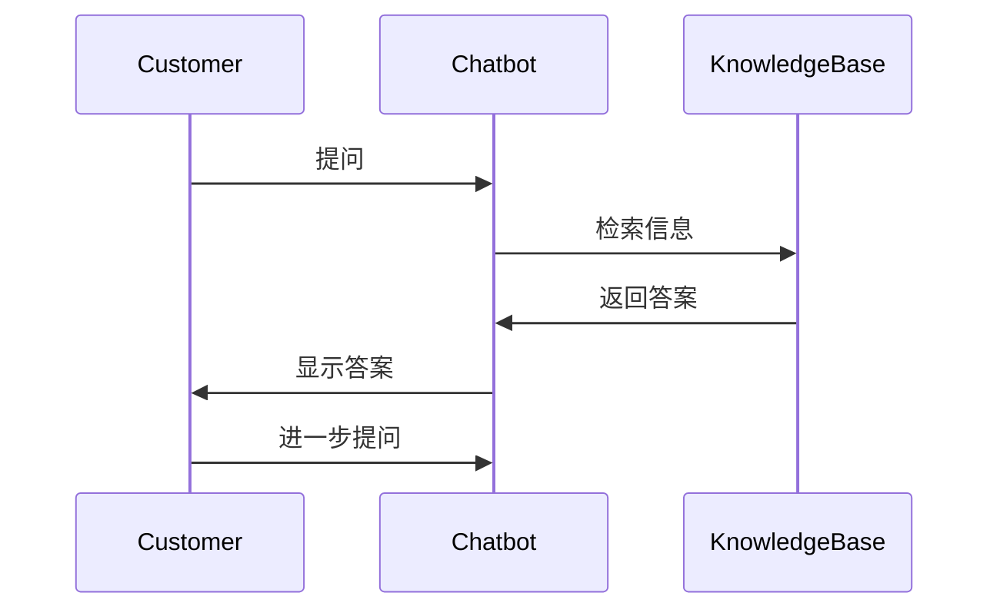
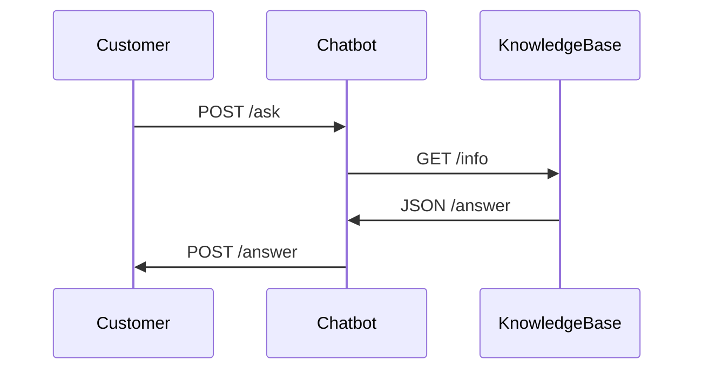

                 


### 背景介绍

在当今数字化时代，智能软件的应用已经成为企业提升效率和竞争力的关键。大型语言模型（LLM）作为人工智能领域的一项重要技术，正逐渐成为智能软件开发的核心驱动力。LLM是一种能够理解和生成自然语言的深度学习模型，其强大的语义理解和生成能力使得它在自然语言处理（NLP）、问答系统、文本生成、机器翻译等领域展现出巨大的潜力。

#### 问题背景

随着LLM技术的迅猛发展，如何高效地进行LLM应用开发成为了众多开发者和企业面临的重要挑战。在开发过程中，代码审查作为确保代码质量、提高开发效率、减少错误的重要手段，变得越来越不可或缺。然而，LLM应用开发的独特性使得传统的代码审查方法难以完全适用，需要新的最佳实践来指导。

#### 问题描述

LLM应用开发中的代码审查面临以下几个问题：

1. **模型理解和代码逻辑的复杂性**：LLM模型的复杂性和代码中涉及的语言处理逻辑使得代码审查变得异常困难。
2. **代码质量和安全性的要求**：随着应用场景的多样化和业务重要性的提升，LLM应用开发对代码质量和安全性的要求越来越高。
3. **审查效率和效果**：如何保证代码审查的高效性，同时确保审查的全面性和准确性，是开发者面临的一大难题。

#### 问题解决

为了解决上述问题，需要从以下几个方面着手：

1. **深入理解LLM技术**：开发者和审查者需要深入了解LLM的技术原理和工作机制，以便更好地理解和评估代码质量。
2. **制定适合LLM的代码审查标准**：根据LLM的特点，制定一套适合的代码审查标准和流程，确保审查的全面性和准确性。
3. **利用自动化工具**：借助自动化工具，提高代码审查的效率和准确性，减轻人工审查的负担。
4. **持续的培训和学习**：定期对开发者进行培训，提高他们对LLM技术的理解和代码审查能力。

#### 边界与外延

LLM应用开发中的代码审查不仅局限于代码本身，还包括模型训练数据的质量、模型调优过程、以及与外部系统的集成等方面。因此，代码审查的范围更加广泛，需要综合考虑各个方面的影响。

#### 概念结构与核心要素组成

LLM应用开发中的代码审查可以分为以下几个核心要素：

1. **审查流程**：包括审查的准备、执行、反馈和修复等环节。
2. **审查标准**：根据LLM的特点，制定相应的代码质量标准和安全性要求。
3. **审查工具**：利用自动化工具提高审查效率和准确性。
4. **审查参与者**：包括开发者、代码审查者、项目经理等角色。

通过以上分析，我们可以看到，LLM应用开发中的代码审查是一项复杂而重要的工作，需要开发者和审查者共同努力，才能确保代码质量，提升开发效率，为企业的智能软件开发奠定坚实基础。

### 核心概念与联系

在深入探讨LLM应用开发中的代码审查之前，我们首先需要理解LLM的核心概念及其与代码审查的紧密联系。LLM（Large Language Model）是一种基于深度学习的自然语言处理模型，能够理解和生成人类语言。其核心概念和联系如下：

#### 核心概念原理

1. **语言模型原理**：
   语言模型的基本原理是通过统计语言中的单词和句子出现的频率，来预测下一个词或句子。LLM通过大量的文本数据进行训练，学习语言的结构和语义。

2. **LLM的工作机制**：
   LLM通常采用Transformer架构，这是一种基于自注意力机制的深度神经网络。它通过多层叠加，逐层学习文本的上下文信息，从而实现高效的语义理解和生成。

3. **预训练和微调**：
   预训练是指使用大规模的通用语料库对模型进行训练，使其具备对语言的一般理解能力。微调则是针对特定任务或应用场景，使用定制化的数据对模型进行进一步训练，以适应特定需求。

#### 概念属性特征对比表格

为了更好地理解LLM的特性，我们可以通过对比表格来展示LLM与其他自然语言处理模型（如RNN、LSTM等）的不同：

| 特征                 | LLM（Transformer）        | RNN（循环神经网络）       | LSTM（长短期记忆网络）      |
|----------------------|-------------------------|-------------------------|-------------------------|
| 架构                 | Transformer架构         | RNN架构                 | LSTM架构                |
| 自注意力机制         | 支持                    | 不支持                  | 不支持                  |
| 预训练与微调         | 强调预训练，适合微调   | 可预训练，微调效果一般  | 可预训练，微调效果一般  |
| 上下文理解能力       | 高                      | 中                      | 中                      |
| 训练效率             | 高                      | 低                      | 中                      |
| 记忆能力             | 好                      | 中                      | 好                      |

#### ER实体关系图架构

在LLM应用开发中，实体关系图（ER图）是描述模型中实体及其关系的有效工具。以下是LLM应用开发中的一个简化ER图示例：

```mermaid
erDiagram
  Customer ||--|{ Order }|--|{ Product }
  Product  ||--|{ Category }
  Category ||--|{ Brand }
  Customer ||--|{ Review }
```

在这个ER图中，`Customer`（客户）与`Order`（订单）、`Product`（产品）与`Category`（分类）、`Category`（分类）与`Brand`（品牌）之间存在直接的关联关系。同时，客户还会留下`Review`（评论）。

通过上述核心概念和联系的分析，我们可以更深入地理解LLM在代码审查中的重要性，并为其制定更有效的审查策略。

### 算法原理讲解

在深入探讨LLM应用开发中的代码审查之前，我们需要对LLM的算法原理进行详细讲解。LLM通常基于Transformer架构，这是一种自注意力机制的深度神经网络。以下是算法原理的详细阐述。

#### Transformer架构

Transformer架构的核心在于其自注意力机制（Self-Attention），这使模型能够自动地关注输入序列中的关键信息，从而提高上下文理解和预测的准确性。

1. **多头注意力**：
   Transformer中的多头注意力（Multi-Head Attention）机制允许模型在不同的子空间中关注信息，从而捕获丰富的上下文关系。

   $$ 
   \text{Attention}(Q, K, V) = \text{softmax}\left(\frac{QK^T}{\sqrt{d_k}}\right)V 
   $$

   其中，$Q$、$K$和$V$分别是查询（Query）、键（Key）和值（Value）向量，$d_k$是键向量的维度。通过自注意力，模型可以关注输入序列中的不同部分，从而更好地理解上下文。

2. **编码器-解码器结构**：
   Transformer采用编码器-解码器（Encoder-Decoder）结构，其中编码器（Encoder）负责学习输入序列的上下文信息，解码器（Decoder）则负责生成输出序列。

   $$ 
   \text{Decoder}(Y) = \text{softmax}\left(\text{Decoder}_{\text{step}} Y \right) 
   $$

   其中，$Y$是解码器当前步骤的输入。

#### Python源代码阐述

为了更好地理解Transformer的算法原理，以下是一个简化版的Transformer编码器部分的Python源代码示例：

```python
import torch
import torch.nn as nn
import torch.nn.functional as F

class TransformerEncoderLayer(nn.Module):
    def __init__(self, d_model, nhead):
        super(TransformerEncoderLayer, self).__init__()
        self.self_attn = nn.MultiheadAttention(d_model, nhead)
        self.linear1 = nn.Linear(d_model, d_model // 2)
        self.dropout = nn.Dropout(0.1)
        self.linear2 = nn.Linear(d_model // 2, d_model)
        self.norm1 = nn.LayerNorm(d_model)
        self.norm2 = nn.LayerNorm(d_model)
        self.dropout1 = nn.Dropout(0.1)
        self.dropout2 = nn.Dropout(0.1)

    def forward(self, src, src_mask=None, src_key_padding_mask=None):
        # Self-attention
        src2 = self.self_attn(src, src, src, attn_mask=src_mask,
                              key_padding_mask=src_key_padding_mask)[0]
        src = src + self.dropout1(src2)
        src = self.norm1(src)

        # Linear layer
        src2 = self.linear2(self.dropout(self.linear1(src)))
        src = src + self.dropout2(src2)
        src = self.norm2(src)

        return src
```

在这个示例中，我们定义了一个Transformer编码器层（`TransformerEncoderLayer`），它包含了多头注意力机制、前馈神经网络以及两个归一化层。通过这个层，我们可以对输入序列进行处理，从而提取上下文信息。

#### 数学模型与公式

在Transformer中，数学模型和公式是理解其工作原理的关键。以下是一些重要的公式：

1. **多头注意力公式**：
   $$
   \text{Attention}(Q, K, V) = \text{softmax}\left(\frac{QK^T}{\sqrt{d_k}}\right)V
   $$

2. **前馈神经网络公式**：
   $$
   \text{FFN}(x) = \text{ReLU}(\text{Linear}(2 \cdot d_{\text{model}})(x)) 
   $$

   其中，$x$是输入向量，$\text{ReLU}$是ReLU激活函数，$\text{Linear}(2 \cdot d_{\text{model}})$是一个线性层。

#### 举例说明

为了更直观地理解Transformer的工作原理，我们可以通过一个简单的例子来说明。

假设我们有一个长度为4的输入序列`[w1, w2, w3, w4]`，我们需要预测下一个词`w5`。首先，我们将这个序列通过编码器层进行处理，得到一个上下文表示。然后，利用这个表示，通过解码器生成`w5`。

在编码器层中，首先计算自注意力得分，然后通过softmax函数得到注意力权重。这些权重表示了序列中每个词对`w5`的重要性。最后，我们将这些权重与输入序列的词值相乘，得到加权表示，并将其与原始输入相加，从而更新输入序列。

在解码器层中，我们使用类似的方法，通过多头注意力机制和前馈神经网络生成预测的词`w5`。

通过这个例子，我们可以看到Transformer如何通过自注意力机制和前馈神经网络，从输入序列中提取上下文信息，并生成高质量的输出。

通过以上详细的算法原理讲解，我们可以更好地理解LLM的工作机制，为后续的代码审查提供理论支持。

### 代码审查基础

在LLM应用开发中，代码审查是一项至关重要的质量保障措施。有效的代码审查不仅能发现潜在的错误和漏洞，还能提高代码的可维护性和安全性。以下是关于代码审查的几个核心要点。

#### 代码审查的重要性

1. **提高代码质量**：
   代码审查是确保代码质量的关键环节。通过审查，可以发现代码中的错误、逻辑漏洞和性能瓶颈，从而确保代码的稳定性和高效性。

2. **减少技术债务**：
   随着项目的演进，技术债务（Technical Debt）会不断积累。通过定期的代码审查，可以及时发现并修复问题，避免债务的累积。

3. **提升团队协作**：
   代码审查不仅是一种质量保障机制，也是团队知识共享和技术交流的重要手段。通过审查，团队成员可以相互学习，提升整体技术能力。

4. **保障安全性**：
   在LLM应用开发中，代码的质量和安全尤为重要。审查可以识别潜在的安全漏洞，防止恶意代码或不当操作对系统造成危害。

#### 代码审查的原则

1. **全面性**：
   代码审查应覆盖代码的各个方面，包括语法、逻辑、性能和安全性。只有全面审查，才能确保代码的每一个环节都符合标准。

2. **规范性**：
   遵循统一的编码规范和命名规范，有助于提高代码的可读性和一致性。在审查过程中，应确保代码遵循这些规范。

3. **客观性**：
   审查过程应保持客观公正，避免主观偏见。审查者应以事实为依据，提出建设性的意见和建议。

4. **及时性**：
   代码审查应尽量在代码提交后及时进行，以减少问题的积累。延迟的审查可能无法及时发现和解决潜在的问题。

5. **反馈与修复**：
   审查结束后，应给予开发者充分的反馈时间，让他们理解问题的本质，并提出具体的修复方案。同时，审查者应关注修复过程，确保问题得到有效解决。

#### 代码审查的方法

1. **静态代码分析**：
   静态代码分析是一种不运行代码而直接分析源代码的方法。它可以通过工具自动检测代码中的潜在问题，如语法错误、潜在漏洞和编码不规范等。

2. **动态代码分析**：
   动态代码分析是在代码运行过程中进行的，通过模拟代码的执行路径来检测运行时的问题。这种方法可以更全面地了解代码的行为和性能。

3. **人工代码审查**：
   人工代码审查是由开发者和审查者共同进行的，通过阅读代码、讨论和交流来发现和解决问题。这种方法虽然耗时，但能提供更深入和具体的反馈。

4. **代码走查（Code Walkthrough）**：
   代码走查是一种团队合作的方法，团队成员一起逐行阅读代码，讨论其逻辑和实现方式。这种方法有助于提高代码的可读性和团队协作。

通过上述方法，我们可以确保代码审查的有效性，提高LLM应用开发的整体质量。代码审查不仅是一种技术手段，更是一种团队文化，需要全体成员的共同参与和持续改进。

### 代码审查流程

在LLM应用开发中，代码审查流程是确保代码质量、提升开发效率的关键环节。一个完善的代码审查流程应包括准备阶段、审查阶段、反馈与修复阶段。以下是每个阶段的具体内容和步骤。

#### 准备阶段

1. **制定审查计划**：
   在进行代码审查之前，首先需要制定一个详细的审查计划。审查计划应包括审查的范围、时间、参与者、审查标准和预期目标等。

2. **选择审查者**：
   根据审查计划，选择合适的审查者。审查者应具备相关的技术背景和审查经验，能够客观、全面地评估代码质量。

3. **准备审查工具**：
   选择并配置适当的代码审查工具，如GitLab、Jenkins等，确保审查过程的顺利进行。同时，培训审查者熟悉这些工具的使用方法。

4. **编写审查指南**：
   编写一份详细的审查指南，明确审查的标准、流程和注意事项。审查指南应涵盖代码质量、安全性、性能等方面的要求。

#### 审查阶段

1. **审查准备**：
   审查开始前，审查者需要充分了解待审查的代码背景、功能和业务逻辑。这可以通过阅读代码注释、设计文档和与开发者的讨论来实现。

2. **静态代码分析**：
   使用静态代码分析工具对代码进行初步检查，识别潜在的语法错误、不规范代码和潜在漏洞。这一步可以帮助审查者快速定位问题所在。

3. **代码走查**：
   审查者与开发者一起进行代码走查，逐行阅读代码，讨论逻辑和实现方式。这种方法有助于发现隐藏的问题和提升代码可读性。

4. **动态代码分析**：
   在代码运行过程中，通过动态代码分析工具检测运行时的问题，如性能瓶颈、内存泄漏等。这种方法可以更全面地了解代码的实际行为。

#### 反馈与修复阶段

1. **问题反馈**：
   审查结束后，审查者应将发现的问题整理成清单，并通过会议、邮件等形式向开发者反馈。问题清单应详细说明问题的性质、影响范围和修复建议。

2. **问题讨论**：
   开发者收到反馈后，应与审查者进行讨论，理解问题的本质，并制定具体的修复方案。在讨论过程中，审查者可以提供技术支持和建议。

3. **代码修复**：
   开发者根据反馈清单进行代码修复。在修复过程中，审查者应关注修复质量，确保问题得到彻底解决。

4. **再次审查**：
   修复完成后，审查者应再次审查代码，验证问题的修复情况。如果仍有问题，应继续进行反馈和修复。

通过上述流程，我们可以确保代码审查的高效性和全面性，提升LLM应用开发的整体质量。代码审查不仅是一次质量检查，更是团队协作和技术提升的过程。

### 代码审查工具

在现代软件开发中，代码审查工具扮演着至关重要的角色，它们不仅能够自动化部分审查流程，还能够显著提高代码审查的效率和质量。以下是几种常用的代码审查工具及其选择标准和特点。

#### 选择标准

1. **易用性**：
   审查工具应易于安装和配置，界面友好，便于团队成员快速上手。

2. **集成度**：
   工具应能够与现有的开发环境（如IDE、版本控制系统等）无缝集成，减少使用成本。

3. **功能全面性**：
   工具应具备静态代码分析、动态代码分析、代码走查、缺陷跟踪等功能，能够全面覆盖代码审查的各个方面。

4. **性能**：
   工具的性能应能够满足大规模代码库的审查需求，确保审查过程高效、稳定。

5. **社区支持**：
   工具应具备良好的社区支持，包括丰富的文档、教程和社区论坛，方便用户解决问题和学习使用。

#### 常用代码审查工具介绍

1. **GitLab**：
   GitLab是一款集成版本控制、项目管理、持续集成和代码审查的平台。其代码审查功能强大，支持多层次的审查流程，易于与Git集成。

2. **GitHub**：
   GitHub不仅是全球最大的代码托管平台，还提供了一套完善的代码审查工具。GitHub的代码审查功能支持基于拉取请求的审查，能够自动化代码质量检查。

3. **SonarQube**：
   SonarQube是一个全面的代码质量平台，支持多种编程语言的静态代码分析。它能够识别代码中的漏洞、代码风格问题和潜在的性能问题。

4. **Phabricator**：
   Phabricator是一个开源的集成化代码审查工具，支持复杂的代码审查流程，包括代码走查、拉取请求和代码质量分析。

5. **Code Climate**：
   Code Climate是一款支持多种编程语言的代码质量分析工具，提供静态代码分析和动态测试覆盖，同时提供详细的分析报告。

6. **Gerrit**：
   Gerrit是一个基于Git的代码审查和项目管理工具，特别适合大型团队和企业级项目。它提供了高效的代码审查流程和详细的权限控制。

#### 代码审查工具的使用方法

1. **集成与配置**：
   在使用代码审查工具前，首先需要将其集成到现有的开发环境中。例如，GitLab可以轻松集成到Git仓库中，GitHub可以在项目设置中启用代码审查功能。

2. **创建审查流程**：
   配置工具以支持代码审查流程，包括创建审查者、设置审查标准和流程等。例如，在GitLab中，可以创建审查规则和审查阶段。

3. **执行代码审查**：
   当代码提交到仓库时，工具会自动执行代码审查流程。审查者可以查看代码变化、运行静态代码分析、进行代码走查等。

4. **反馈与修复**：
   审查结束后，工具会生成详细的审查报告，并提供反馈渠道。开发者根据反馈进行代码修复，然后再次提交审查。

通过选择合适的代码审查工具并合理使用，我们可以显著提高LLM应用开发的代码审查效率和质量，确保代码的健壮性和可靠性。

### LLM应用开发中的代码审查实战

在本节中，我们将通过一个实际项目案例，详细讲解LLM应用开发中的代码审查全过程。该案例涉及项目背景、系统功能设计、系统架构设计、代码应用解读以及实际案例分析。

#### 项目背景

某大型互联网公司开发了一款智能客服系统，旨在通过LLM技术提升客户服务体验。该系统需要处理大量的用户提问，并提供准确、快速的答案。为了确保系统的质量和稳定性，公司决定在开发过程中引入代码审查机制。

#### 系统功能设计

智能客服系统的核心功能包括：

1. **问题理解**：接收用户的提问，理解问题的意图和关键信息。
2. **知识检索**：在知识库中检索相关信息，为用户提供答案。
3. **答案生成**：利用LLM技术生成准确、自然的答案。
4. **用户交互**：与用户进行多轮对话，满足用户的进一步需求。

为了实现这些功能，系统设计了一个领域模型，其中包含以下核心类：

```mermaid
classDiagram
  Customer <<--|{asks} Question
  Question <<--|{responds} Answer
  KnowledgeBase <<--|{searches} Answer
  Chatbot <<--|{answers} Answer
```

在这个领域模型中，`Customer`（客户）发起提问，`Question`（问题）被传递给`Chatbot`（聊天机器人），`Chatbot`利用`KnowledgeBase`（知识库）进行检索，并生成答案返回给客户。

#### 系统架构设计

智能客服系统的架构设计采用微服务架构，以确保系统的灵活性和可扩展性。以下是系统架构的mermaid架构图：



在这个架构中，`Chatbot`作为核心服务，负责接收客户的提问、调用知识库检索信息并生成答案。系统还设计了多个接口，以支持与外部系统的集成，如用户管理系统、日志系统等。

#### 系统接口设计和系统交互

智能客服系统涉及多个接口，以下是系统接口设计和交互的mermaid序列图：



在这个序列图中，客户通过`POST`请求向`Chatbot`发送提问，`Chatbot`通过`GET`请求从知识库检索信息，并将答案通过`JSON`格式返回给客户。

#### 代码应用解读与分析

以下是对智能客服系统核心部分的代码解读和分析：

```python
class Chatbot:
    def __init__(self):
        self.knowledge_base = KnowledgeBase()

    def ask_question(self, question):
        # 对提问进行预处理
        processed_question = preprocess_question(question)
        # 在知识库中检索答案
        answer = self.knowledge_base.search_answer(processed_question)
        # 生成自然语言答案
        generated_answer = generate_answer(answer)
        return generated_answer

    def preprocess_question(self, question):
        # 实现文本预处理逻辑
        # 如分词、去停用词、词性标注等
        # ...
        return processed_question

    def generate_answer(self, answer):
        # 实现答案生成逻辑
        # 如使用LLM生成自然语言文本
        # ...
        return generated_answer

class KnowledgeBase:
    def search_answer(self, question):
        # 实现知识检索逻辑
        # 如使用向量相似度匹配、图谱查询等
        # ...
        return answer
```

在上面的代码中，`Chatbot`类负责接收客户提问、预处理问题和生成答案。`preprocess_question`方法实现文本预处理，包括分词、去停用词等操作。`generate_answer`方法调用知识库进行检索，并使用LLM生成自然语言答案。

#### 实际案例分析

在一个实际案例中，客户提问：“我最近在健身，想了解一些减肥的方法。”通过代码审查，发现以下问题：

1. **文本预处理不充分**：
   审查者发现`preprocess_question`方法中未对“最近”进行词义消歧处理，可能导致生成答案不准确。

2. **答案生成质量不高**：
   审查者建议在`generate_answer`方法中增加对答案质量的评估机制，如使用指标来衡量答案的准确性和自然性。

3. **错误处理机制不足**：
   审查者指出，当知识库中无法找到匹配信息时，系统应提供默认的响应，而不是抛出异常。

#### 项目小结

通过本次代码审查实战，我们不仅发现了潜在的问题，还提出了有效的解决方案。代码审查在确保系统质量和稳定性方面发挥了关键作用。在未来，我们将继续优化代码审查流程，提升开发效率和质量。

### 最佳实践与注意事项

在LLM应用开发中进行代码审查，需要遵循一系列最佳实践和注意事项，以确保代码的质量和系统的稳定性。以下是一些关键点：

#### 最佳实践

1. **代码审查流程规范化**：
   制定明确的代码审查流程和标准，确保每个阶段都有明确的任务和责任人。这有助于提高审查的效率和一致性。

2. **审查者培训**：
   定期为审查者提供培训，更新他们对最新技术和审查工具的了解。这有助于提高审查的质量和准确性。

3. **自动化与人工审查结合**：
   利用自动化工具进行初步的代码分析，快速发现常见的错误和问题。然后，通过人工审查深入挖掘潜在的问题，确保代码的完整性和正确性。

4. **及时反馈与修复**：
   审查结束后，及时向开发者反馈问题，并提供具体的修复建议。同时，监督修复过程，确保问题得到彻底解决。

5. **持续改进**：
   定期回顾代码审查过程，收集反馈，不断优化审查流程和方法。这有助于持续提升代码质量和开发效率。

#### 注意事项

1. **保护审查者独立性**：
   审查者应保持独立性和客观性，避免因个人关系或偏见影响审查结果。

2. **尊重开发者意见**：
   开发者有权对审查结果提出异议，审查者应耐心听取并合理评估开发者的意见，共同解决问题。

3. **防止过度审查**：
   过度的审查会降低开发效率，应确保审查的深度和广度与项目的实际需求相匹配。

4. **关注安全问题**：
   在LLM应用开发中，特别关注代码的安全性，确保系统不会因漏洞或错误而受到攻击。

5. **记录与跟踪**：
   记录每次代码审查的详细情况，包括发现的问题、反馈和修复过程，以便后续参考和改进。

通过遵循这些最佳实践和注意事项，我们可以确保LLM应用开发中的代码审查既高效又全面，为项目的成功奠定坚实基础。

### 拓展阅读

在LLM应用开发中，代码审查不仅是一个技术过程，更是一个团队协作和文化建设的体现。以下是一些推荐阅读资源，帮助您深入了解LLM技术、代码审查的最佳实践和相关工具。

1. **《深度学习》系列（Goodfellow, Bengio, Courville）**：
   这是一本深度学习领域的经典教材，详细介绍了包括LLM在内的各种深度学习模型和算法。

2. **《代码大全》（Steve McConnell）**：
   该书是软件工程领域的经典之作，提供了全面的代码质量和代码审查的最佳实践。

3. **《Effective Code Review: The Definitive Guide to Code Review》（Tim Petsoe）**：
   这本书专门讨论了代码审查的各个方面，包括流程、工具和最佳实践。

4. **《LLM架构设计与实践》（刘知远，等）**：
   该书详细介绍了LLM的架构设计、训练和微调方法，适合希望深入了解LLM技术的读者。

5. **GitHub官方文档**：
   GitHub提供了丰富的代码审查指南和工具文档，是了解代码审查工具使用和优化的宝贵资源。

通过阅读这些资源，您不仅可以提升自己在LLM应用开发和代码审查方面的技能，还能深入了解相关领域的最新进展和最佳实践。希望这些推荐对您有所帮助！

