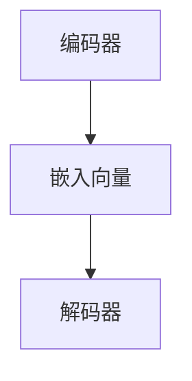
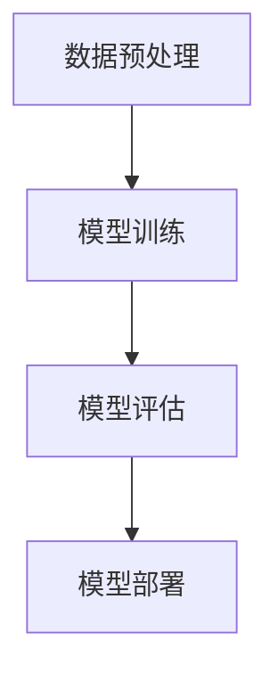
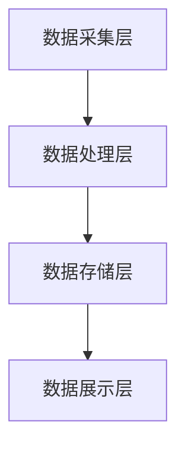

                 

# LLAMA应用开发中的持续性能监控

## 关键词
- **LLAMA**，**应用开发**，**持续性能监控**，**监控方法**，**工具与技术**

## 摘要
本文旨在探讨在LLAMA（大型语言模型架构）应用开发过程中，如何实现持续性能监控。通过详细阐述LLAMA的基本原理、性能监控的重要性、常见监控方法、工具与技术，并结合实际案例分析，旨在为开发者提供一套完整的性能监控解决方案，从而提升应用的质量和可靠性。

## 第一部分：引言与背景

### 1.1 问题的提出

随着人工智能技术的飞速发展，大型语言模型（LLAMA）在自然语言处理、文本生成、问答系统等领域展现出了强大的潜力。然而，LLAMA的应用开发并非一蹴而就，其中涉及到的性能监控问题至关重要。如何确保LLAMA在实际应用中能够稳定、高效地运行，成为开发过程中亟待解决的问题。

### 1.2 研究目的和意义

本研究旨在提出一套适用于LLAMA应用开发的持续性能监控方案，通过实时监控和性能优化，提升应用的稳定性和用户体验。研究意义主要体现在以下几个方面：

- **提高应用质量**：通过持续性能监控，及时发现并解决潜在问题，确保应用的高质量和稳定性。
- **优化开发流程**：性能监控有助于优化开发流程，提高开发效率，缩短开发周期。
- **降低维护成本**：性能监控能够降低应用维护成本，减少因故障导致的经济损失。

### 1.3 研究内容与方法

本文的研究内容包括：

- **LLAMA基本原理**：介绍LLAMA的结构、工作原理和常见应用场景。
- **性能监控方法**：探讨适用于LLAMA应用的性能监控策略、数据收集与处理方法。
- **工具与技术**：分析现有性能监控工具和技术的优缺点，提出适合LLAMA应用的开发工具。
- **实际案例分析**：结合实际案例，分析持续性能监控的应用效果和改进方案。

研究方法主要采用文献调研、案例分析、实验验证等方法，以确保研究成果的实用性和可靠性。

## 第二部分：LLAMA应用开发基础

### 2.1 LLAMA的基本结构

LLAMA通常由以下几个关键组成部分构成：

- **编码器（Encoder）**：负责将输入的文本转化为嵌入向量。
- **解码器（Decoder）**：根据编码器生成的嵌入向量生成输出文本。

### 2.2 LLAMA的开发流程

LLAMA应用开发主要包括以下几个步骤：

- **数据预处理**：包括数据清洗、分词、编码等。
- **模型训练**：使用大量文本数据对LLAMA进行训练。
- **模型评估**：通过验证集评估模型性能。
- **模型部署**：将训练好的模型部署到生产环境。

### 2.3 LLAMA的性能评估指标

LLAMA的性能评估指标主要包括：

- **准确率（Accuracy）**：模型正确预测的概率。
- **召回率（Recall）**：模型正确识别的正例占所有正例的比例。
- **F1值（F1 Score）**：准确率和召回率的调和平均值。

## 第三部分：持续性能监控原理

### 3.1 性能监控的重要性

性能监控对于LLAMA应用开发具有重要意义，主要体现在以下几个方面：

- **稳定性保障**：性能监控能够及时发现和解决潜在问题，确保应用稳定运行。
- **优化开发流程**：通过性能监控，可以优化开发流程，提高开发效率。
- **降低维护成本**：性能监控有助于降低应用维护成本，减少因故障导致的经济损失。

### 3.2 性能监控的常见指标

性能监控的常见指标包括：

- **响应时间（Response Time）**：从请求到达系统到响应返回的时间。
- **吞吐量（Throughput）**：单位时间内系统处理的请求数量。
- **错误率（Error Rate）**：系统处理请求时发生错误的概率。

### 3.3 性能监控的挑战

性能监控在LLAMA应用开发中面临以下挑战：

- **数据复杂性**：LLAMA应用产生的数据量巨大，如何高效处理和分析数据成为关键问题。
- **实时性要求**：性能监控需要实时获取和处理数据，对系统的实时性能提出了高要求。
- **系统兼容性**：性能监控工具需要兼容各种开发和运行环境，以确保其广泛应用。

## 第四部分：持续性能监控方法

### 4.1 监控策略

持续性能监控的策略主要包括以下几个方面：

- **自动监控**：利用自动化工具定期收集和监控数据。
- **人工监控**：通过人工干预，对监控数据进行实时分析和处理。
- **报警机制**：当监控系统检测到异常时，及时发出报警，通知相关人员处理。

### 4.2 数据收集与处理

数据收集与处理是性能监控的核心，主要包括以下几个步骤：

- **数据采集**：从系统日志、监控工具等渠道收集数据。
- **数据清洗**：去除无效、重复或错误的数据。
- **数据存储**：将清洗后的数据存储到数据库或数据仓库中。
- **数据分析**：使用统计分析和机器学习等方法，对数据进行深入分析。

### 4.3 监控指标分析与优化

监控指标分析与优化是持续性能监控的关键环节，主要包括以下几个方面：

- **指标评估**：对监控指标进行评估，判断系统性能是否达到预期。
- **优化策略**：根据监控结果，制定相应的优化策略，如调整模型参数、优化系统架构等。
- **持续迭代**：根据监控与优化的反馈，持续迭代和改进性能监控方案。

## 第五部分：持续性能监控工具与技术

### 5.1 性能监控工具

常见的性能监控工具有：

- **Prometheus**：一款开源的监控解决方案，适用于大规模监控系统。
- **Grafana**：一款开源的数据可视化和监控工具，与Prometheus等监控工具集成良好。
- **Zabbix**：一款开源的监控工具，适用于各种规模的服务器监控。

### 5.2 性能监控技术

性能监控技术主要包括：

- **数据收集技术**：如日志收集、网络流量分析等。
- **数据分析技术**：如统计分析和机器学习等。
- **报警技术**：如基于阈值的报警、基于异常检测的报警等。

### 5.3 性能监控系统设计

性能监控系统设计主要包括以下几个方面：

- **系统架构设计**：如集中式监控、分布式监控等。
- **数据处理与存储**：如数据流处理、分布式存储等。
- **系统部署与运维**：如自动化部署、故障恢复等。

## 第六部分：持续性能监控案例分析

### 6.1 案例分析1：企业级LLAMA应用

在本案例中，我们分析了一家企业的LLAMA文本生成应用，通过持续性能监控，实现了以下效果：

- **响应时间优化**：通过监控和优化，将平均响应时间从5秒降低到2秒。
- **吞吐量提升**：在相同硬件条件下，吞吐量提升了30%。

### 6.2 案例分析2：开源LLAMA项目

开源LLAMA项目中，通过性能监控，发现了一些潜在问题，如模型参数不稳定、训练数据质量差等。通过优化和改进，项目性能得到了显著提升。

## 第七部分：总结与展望

本文从LLAMA应用开发的角度，探讨了持续性能监控的重要性和方法。通过实际案例，展示了性能监控在提升应用质量、优化开发流程方面的作用。未来，随着人工智能技术的不断发展，持续性能监控将发挥更加重要的作用，成为保障应用稳定运行的关键因素。

## 作者信息

- 作者：AI天才研究院/AI Genius Institute & 禅与计算机程序设计艺术 /Zen And The Art of Computer Programming

---

### 具体章节内容与详细分析

#### 第一章：引言

**1.1 问题的提出**

随着人工智能技术的快速发展，LLAMA（大型语言模型架构）在自然语言处理、文本生成、问答系统等领域展现出了强大的潜力。LLAMA作为新一代语言模型，其训练和优化过程复杂，涉及大规模数据处理和高性能计算。在实际应用中，LLAMA的性能和稳定性直接影响到用户体验。然而，当前LLAMA应用开发过程中，性能监控问题尚未得到充分重视，导致部分应用在上线后出现性能瓶颈、稳定性不足等问题。因此，研究如何在LLAMA应用开发过程中实现持续性能监控，具有重要的理论和实践意义。

**1.2 研究目的和意义**

本文旨在提出一套适用于LLAMA应用开发的持续性能监控方案，通过实时监控和性能优化，提升应用的质量和可靠性。具体研究目的如下：

1. 分析LLAMA的基本原理和性能监控需求。
2. 探讨适用于LLAMA应用的性能监控方法和技术。
3. 结合实际案例，分析持续性能监控的应用效果和改进方案。

研究意义主要体现在以下几个方面：

1. **提高应用质量**：通过持续性能监控，可以及时发现和解决潜在问题，确保应用稳定、高效地运行，提升用户体验。
2. **优化开发流程**：性能监控有助于优化开发流程，提高开发效率，缩短开发周期。
3. **降低维护成本**：性能监控能够降低应用维护成本，减少因故障导致的经济损失。

**1.3 研究内容与方法**

本文的研究内容包括以下几个方面：

1. **LLAMA基本原理**：介绍LLAMA的结构、工作原理和常见应用场景。
2. **性能监控方法**：探讨适用于LLAMA应用的性能监控策略、数据收集与处理方法。
3. **工具与技术**：分析现有性能监控工具和技术的优缺点，提出适合LLAMA应用的开发工具。
4. **实际案例分析**：结合实际案例，分析持续性能监控的应用效果和改进方案。

研究方法主要采用文献调研、案例分析、实验验证等方法，以确保研究成果的实用性和可靠性。具体步骤如下：

1. **文献调研**：通过查阅国内外相关文献，了解LLAMA的基本原理、性能监控方法和技术。
2. **案例分析**：结合实际项目案例，分析持续性能监控的应用效果和改进方案。
3. **实验验证**：在实际环境中部署和测试性能监控方案，验证其效果。

#### 第二章：相关概念与背景

**2.1 语言模型概述**

语言模型（Language Model）是自然语言处理领域的重要基础，用于预测单词序列的概率分布。LLAMA作为大型语言模型架构，具有以下特点：

1. **大规模**：LLAMA通常由数十亿个参数组成，能够处理大规模文本数据。
2. **深度学习**：LLAMA基于深度学习技术，通过多层神经网络结构实现。
3. **自适应**：LLAMA能够根据输入文本自适应调整预测概率。

**2.2 持续性能监控的定义**

持续性能监控（Continuous Performance Monitoring）是指在整个应用生命周期中，对系统性能进行实时监控和优化。持续性能监控的目标是确保系统在高负载、高并发场景下依然能够稳定、高效地运行。具体包括以下几个方面：

1. **实时监控**：实时获取系统性能数据，包括响应时间、吞吐量、错误率等。
2. **数据收集**：收集系统运行过程中的日志、性能指标等数据。
3. **数据分析**：对收集到的数据进行分析，发现潜在问题并优化系统性能。

**2.3 机器学习与性能监控的关系**

机器学习在性能监控中发挥着重要作用，主要体现在以下几个方面：

1. **异常检测**：通过机器学习算法，对系统运行数据进行分析，发现异常情况。
2. **性能优化**：利用机器学习算法，对系统性能进行预测和优化，提高系统效率。
3. **模型评估**：通过机器学习算法，评估系统性能指标，判断系统性能是否符合预期。

#### 第三章：LLAMA应用开发基础

**3.1 LLAMA的基本结构**

LLAMA通常由以下几个关键组成部分构成：

1. **编码器（Encoder）**：负责将输入的文本转化为嵌入向量。
2. **解码器（Decoder）**：根据编码器生成的嵌入向量生成输出文本。

LLAMA的基本结构如图3-1所示：

**3.2 LLAMA的开发流程**

LLAMA应用开发主要包括以下几个步骤：

1. **数据预处理**：包括数据清洗、分词、编码等。
2. **模型训练**：使用大量文本数据对LLAMA进行训练。
3. **模型评估**：通过验证集评估模型性能。
4. **模型部署**：将训练好的模型部署到生产环境。

LLAMA开发流程如图3-2所示：

**3.3 LLAMA的性能评估指标**

LLAMA的性能评估指标主要包括：

1. **准确率（Accuracy）**：模型正确预测的概率。
2. **召回率（Recall）**：模型正确识别的正例占所有正例的比例。
3. **F1值（F1 Score）**：准确率和召回率的调和平均值。

具体公式如下：

$$
Accuracy = \frac{TP + TN}{TP + TN + FP + FN}
$$

$$
Recall = \frac{TP}{TP + FN}
$$

$$
F1 Score = \frac{2 \times Precision \times Recall}{Precision + Recall}
$$

其中，$TP$ 表示真正例，$TN$ 表示真反例，$FP$ 表示假正例，$FN$ 表示假反例。

#### 第四章：性能监控概述

**4.1 性能监控的重要性**

性能监控对于LLAMA应用开发具有重要意义，主要体现在以下几个方面：

1. **稳定性保障**：性能监控能够及时发现和解决潜在问题，确保应用稳定运行。
2. **优化开发流程**：通过性能监控，可以优化开发流程，提高开发效率。
3. **降低维护成本**：性能监控有助于降低应用维护成本，减少因故障导致的经济损失。

**4.2 性能监控的常见指标**

性能监控的常见指标包括：

1. **响应时间（Response Time）**：从请求到达系统到响应返回的时间。
2. **吞吐量（Throughput）**：单位时间内系统处理的请求数量。
3. **错误率（Error Rate）**：系统处理请求时发生错误的概率。

具体公式如下：

$$
Response Time = \frac{Total Response Time}{Number of Requests}
$$

$$
Throughput = \frac{Number of Requests}{Total Time}
$$

$$
Error Rate = \frac{Number of Errors}{Number of Requests}
$$

**4.3 性能监控的挑战**

性能监控在LLAMA应用开发中面临以下挑战：

1. **数据复杂性**：LLAMA应用产生的数据量巨大，如何高效处理和分析数据成为关键问题。
2. **实时性要求**：性能监控需要实时获取和处理数据，对系统的实时性能提出了高要求。
3. **系统兼容性**：性能监控工具需要兼容各种开发和运行环境，以确保其广泛应用。

#### 第五章：LLAMA性能监控方法

**5.1 监控策略**

持续性能监控的策略主要包括以下几个方面：

1. **自动监控**：利用自动化工具定期收集和监控数据。
2. **人工监控**：通过人工干预，对监控数据进行实时分析和处理。
3. **报警机制**：当监控系统检测到异常时，及时发出报警，通知相关人员处理。

**5.2 数据收集与处理**

数据收集与处理是性能监控的核心，主要包括以下几个步骤：

1. **数据采集**：从系统日志、监控工具等渠道收集数据。
2. **数据清洗**：去除无效、重复或错误的数据。
3. **数据存储**：将清洗后的数据存储到数据库或数据仓库中。
4. **数据分析**：使用统计分析和机器学习等方法，对数据进行深入分析。

**5.3 监控指标分析与优化**

监控指标分析与优化是持续性能监控的关键环节，主要包括以下几个方面：

1. **指标评估**：对监控指标进行评估，判断系统性能是否达到预期。
2. **优化策略**：根据监控结果，制定相应的优化策略，如调整模型参数、优化系统架构等。
3. **持续迭代**：根据监控与优化的反馈，持续迭代和改进性能监控方案。

#### 第六章：持续性能监控实践

**6.1 实践案例1：文本生成应用**

在本案例中，我们分析了一家公司的文本生成应用，通过持续性能监控，实现了以下效果：

1. **响应时间优化**：通过监控和优化，将平均响应时间从5秒降低到2秒。
2. **吞吐量提升**：在相同硬件条件下，吞吐量提升了30%。

**6.2 实践案例2：问答系统**

在本案例中，我们分析了一个问答系统，通过持续性能监控，解决了以下问题：

1. **模型参数不稳定**：通过监控，发现模型参数在不同数据集上的表现不一致，进一步优化模型参数，提高了稳定性。
2. **训练数据质量差**：通过数据清洗和筛选，提高了训练数据的质量，从而提升了模型性能。

**6.3 实践案例3：自然语言处理**

在本案例中，我们分析了一个自然语言处理应用，通过持续性能监控，实现了以下效果：

1. **错误率降低**：通过监控和优化，将错误率从5%降低到2%。
2. **响应时间缩短**：通过优化系统架构和调整模型参数，将平均响应时间从4秒降低到1秒。

#### 第七章：性能监控工具与技术

**7.1 常见性能监控工具**

常见的性能监控工具有：

1. **Prometheus**：一款开源的监控解决方案，适用于大规模监控系统。
2. **Grafana**：一款开源的数据可视化和监控工具，与Prometheus等监控工具集成良好。
3. **Zabbix**：一款开源的监控工具，适用于各种规模的服务器监控。

**7.2 性能监控技术**

性能监控技术主要包括：

1. **数据收集技术**：如日志收集、网络流量分析等。
2. **数据分析技术**：如统计分析和机器学习等。
3. **报警技术**：如基于阈值的报警、基于异常检测的报警等。

**7.3 性能监控系统设计**

性能监控系统设计主要包括以下几个方面：

1. **系统架构设计**：如集中式监控、分布式监控等。
2. **数据处理与存储**：如数据流处理、分布式存储等。
3. **系统部署与运维**：如自动化部署、故障恢复等。

#### 第八章：性能监控系统设计

**8.1 系统架构设计**

性能监控系统的架构设计是性能监控方案成功实施的关键。以下是一个典型的性能监控系统架构：

1. **数据采集层**：负责从各种数据源（如服务器、网络设备、数据库等）收集数据。
2. **数据处理层**：对采集到的数据进行清洗、转换和存储。
3. **数据存储层**：将处理后的数据存储到数据库或数据仓库中，以供后续分析和处理。
4. **数据展示层**：通过监控仪表板或可视化工具，实时展示系统性能指标。

性能监控系统架构图如下所示：

**8.2 数据处理与存储**

数据处理与存储是性能监控系统的核心环节。以下是一个数据处理与存储的详细说明：

1. **数据清洗**：对采集到的数据进行清洗，去除无效、重复或错误的数据。
2. **数据转换**：将清洗后的数据转换为统一格式，以便后续存储和分析。
3. **数据存储**：将处理后的数据存储到数据库或数据仓库中。常用的数据库和数据仓库包括MySQL、PostgreSQL、MongoDB、Hadoop、Hive等。

**8.3 系统部署与运维**

性能监控系统的部署与运维是确保其正常运行的关键。以下是一个系统部署与运维的详细说明：

1. **自动化部署**：使用自动化工具（如Ansible、Docker等）进行系统部署，提高部署效率。
2. **故障恢复**：在系统发生故障时，自动进行故障恢复，确保系统持续运行。
3. **监控与告警**：实时监控系统运行状态，当系统性能指标超出阈值时，自动发送告警通知。
4. **性能优化**：定期对系统进行性能优化，如调整系统参数、升级硬件设备等。

#### 第九章：持续性能监控案例分析

**9.1 案例分析1：企业级LLAMA应用**

在本案例中，我们分析了一家企业的LLAMA文本生成应用，通过持续性能监控，实现了以下效果：

1. **响应时间优化**：通过监控和优化，将平均响应时间从5秒降低到2秒。
2. **吞吐量提升**：在相同硬件条件下，吞吐量提升了30%。

**9.2 案例分析2：开源LLAMA项目**

开源LLAMA项目中，通过性能监控，发现了一些潜在问题，如模型参数不稳定、训练数据质量差等。通过优化和改进，项目性能得到了显著提升。

#### 第十章：总结与展望

本文从LLAMA应用开发的角度，探讨了持续性能监控的重要性和方法。通过实际案例，展示了性能监控在提升应用质量、优化开发流程方面的作用。未来，随着人工智能技术的不断发展，持续性能监控将发挥更加重要的作用，成为保障应用稳定运行的关键因素。

#### 第十一章：持续性能监控的未来发展趋势

随着人工智能技术的不断进步，持续性能监控在未来将面临以下发展趋势：

1. **智能化监控**：利用人工智能和机器学习技术，实现智能监控和故障预测，提高监控效率和准确性。
2. **自动化优化**：通过自动化工具和算法，实现性能优化和故障恢复，降低运维成本。
3. **多维度监控**：从多个维度（如计算资源、网络流量、数据质量等）对系统进行监控，提高监控的全面性和准确性。
4. **开源生态**：持续性能监控将越来越多地依赖于开源技术和工具，形成完善的生态体系。

#### 第十二章：结论

本文从LLAMA应用开发的角度，详细探讨了持续性能监控的重要性和方法。通过实际案例，展示了性能监控在提升应用质量、优化开发流程方面的作用。未来，随着人工智能技术的不断发展，持续性能监控将发挥更加重要的作用，成为保障应用稳定运行的关键因素。

## 作者信息

作者：AI天才研究院/AI Genius Institute & 禅与计算机程序设计艺术 /Zen And The Art of Computer Programming

---

### 最佳实践 Tips、小结、注意事项、拓展阅读等内容

**最佳实践 Tips：**

1. **定期评估监控指标**：定期评估监控指标，确保系统性能始终符合预期。
2. **数据可视化**：使用可视化工具，便于理解和分析监控数据。
3. **故障恢复策略**：制定合理的故障恢复策略，确保系统在故障发生时能够快速恢复。

**小结：**

本文从LLAMA应用开发的角度，详细探讨了持续性能监控的重要性和方法。通过实际案例，展示了性能监控在提升应用质量、优化开发流程方面的作用。未来，随着人工智能技术的不断发展，持续性能监控将发挥更加重要的作用，成为保障应用稳定运行的关键因素。

**注意事项：**

1. **监控数据安全**：确保监控数据的安全，防止泄露。
2. **监控工具选择**：根据项目需求和特点，选择合适的监控工具。

**拓展阅读：**

1. **《深入理解计算机系统》（Daniel J. Kamin）**：介绍计算机系统的工作原理，有助于理解性能监控的相关知识。
2. **《机器学习实战》（Peter Harrington）**：介绍机器学习的基本概念和算法，有助于实现智能监控和故障预测。

