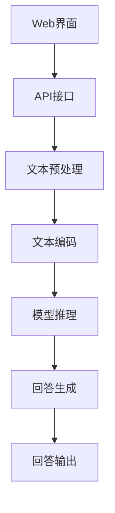

                 

### 第1章: LLM应用开发背景

#### 1.1 什么是LLM

大型语言模型（LLM, Large Language Model）是一种基于深度学习的自然语言处理技术，它通过学习海量文本数据，能够生成、理解和处理自然语言。LLM的核心在于其“大”，即拥有巨大的参数规模和强大的表达能力。典型的LLM如GPT-3（Generative Pre-trained Transformer 3）拥有1750亿个参数，能够生成流畅、复杂的文本，广泛应用于文本生成、机器翻译、对话系统等领域。

#### 1.2 LLM应用开发的背景

随着互联网和大数据技术的发展，人们产生了对大规模自然语言处理能力的迫切需求。从搜索引擎到智能客服，从内容推荐到自动驾驶，自然语言处理技术在各行各业的应用日益广泛。LLM的出现，极大地提升了自然语言处理的能力，使得机器能够以更自然、更智能的方式与人类互动。然而，LLM的开发和应用也面临诸多挑战，如模型训练的高成本、部署的高复杂度等。

#### 1.3 持续集成与持续部署的重要性

持续集成（CI, Continuous Integration）和持续部署（CD, Continuous Deployment）是一套软件开发流程，旨在通过自动化测试和部署，提高软件开发的效率和稳定性。在LLM应用开发中，CI/CD的重要性体现在以下几个方面：

- **提高开发效率**：通过自动化测试和部署，减少了手动操作的时间，加快了开发进程。
- **确保代码质量**：频繁的集成和测试能够及时发现并修复代码中的问题，确保代码质量。
- **提高部署稳定性**：通过自动化部署，减少了人为错误，提高了部署的稳定性。
- **降低维护成本**：CI/CD能够快速响应用户需求，降低了软件维护的成本。

### 1.4 持续集成与持续部署的基本概念

持续集成（CI, Continuous Integration）是指将开发人员的代码定期合并到主分支，并通过自动化测试确保代码的稳定性。持续部署（CD, Continuous Deployment）是在CI的基础上，将经过测试的代码自动部署到生产环境。

CI/CD的核心流程包括以下几个步骤：

1. **代码提交**：开发人员将代码提交到版本控制系统。
2. **自动化测试**：构建系统自动运行一系列测试，包括单元测试、集成测试等。
3. **代码审查**：测试通过后，进行代码审查，确保代码质量。
4. **部署**：将测试通过的代码部署到生产环境。

CI/CD的工具与平台众多，如Jenkins、GitLab CI、CircleCI等，它们提供了自动化构建、测试和部署的解决方案。

---

### 1.5 总结

本章介绍了LLM应用开发的基本概念、背景以及CI/CD在LLM开发中的重要性。接下来，我们将深入探讨CI/CD的基本概念和核心流程，并详细讲解LLM开发中的CI/CD实践。

## 第2章: 持续集成与持续部署基础

### 2.1 CI/CD的基本概念

持续集成（Continuous Integration，简称CI）是一种软件开发实践，旨在通过频繁地将代码合并到主分支，并自动化测试确保代码的稳定性。其核心思想是尽早发现并解决代码中的问题，从而提高代码质量。

持续部署（Continuous Deployment，简称CD）则是在CI的基础上，将经过测试的代码自动部署到生产环境。CD的目标是通过自动化部署，减少人为干预，提高部署的稳定性和效率。

### 2.2 CI/CD的核心流程

CI/CD的核心流程通常包括以下几个步骤：

1. **代码提交**：开发人员将代码提交到版本控制系统，如Git。
2. **构建**：构建系统自动下载代码、安装依赖、编译代码等，生成可执行文件或部署包。
3. **测试**：构建系统自动运行一系列测试，包括单元测试、集成测试、性能测试等，确保代码的质量。
4. **代码审查**：测试通过后，进行代码审查，确保代码质量，包括语法检查、代码风格检查等。
5. **部署**：将测试通过的代码部署到生产环境。

### 2.3 CI/CD的工具与平台

CI/CD的工具与平台众多，以下是一些常用的工具和平台：

- **Jenkins**：开源的持续集成和持续部署工具，支持多种编程语言和操作系统，配置灵活。
- **GitLab CI/CD**：GitLab内置的持续集成和持续部署工具，支持自动化测试和部署，与GitLab的版本控制系统紧密结合。
- **CircleCI**：云端的持续集成和持续部署平台，支持多种编程语言和框架，提供丰富的配置选项。
- **Travis CI**：基于云的持续集成服务，支持多种编程语言，易于配置和使用。

### 2.4 CI/CD的优势

CI/CD的优势主要体现在以下几个方面：

- **提高开发效率**：通过自动化测试和部署，减少了手动操作的时间，加快了开发进程。
- **确保代码质量**：频繁的集成和测试能够及时发现并修复代码中的问题，确保代码质量。
- **降低部署风险**：自动化部署减少了人为错误，提高了部署的稳定性。
- **支持快速迭代**：CI/CD能够快速响应用户需求，支持快速迭代。

### 2.5 CI/CD的挑战

尽管CI/CD带来了诸多好处，但在实施过程中也面临一些挑战：

- **测试环境一致性**：确保所有测试环境与生产环境一致，避免环境差异导致的部署问题。
- **代码质量**：频繁的代码提交和测试可能导致代码质量下降，需要建立严格的代码审查机制。
- **资源消耗**：CI/CD需要大量的计算资源，特别是在处理大规模项目时。
- **安全性**：确保代码的安全性和数据保护，避免在生产环境中引入安全漏洞。

### 2.6 总结

本章详细介绍了CI/CD的基本概念、核心流程、常用工具与平台以及其优势与挑战。在下一章中，我们将探讨LLM应用开发中的CI/CD实践，包括环境搭建、流程实现和具体案例分析。

## 第3章: LLM应用开发中的CI/CD实践

### 3.1 LLM项目环境搭建

在进行LLM应用开发之前，首先需要搭建一个合适的环境。以下是搭建LLM项目环境的步骤：

1. **选择合适的硬件配置**：由于LLM模型通常需要大量的计算资源，因此需要选择具有足够CPU和GPU性能的硬件设备。
2. **安装操作系统**：推荐使用Linux操作系统，如Ubuntu或CentOS，因为它们具有良好的性能和稳定性。
3. **安装Python环境**：安装Python，推荐使用Anaconda，因为Anaconda提供了丰富的科学计算和数据分析库。
4. **安装深度学习框架**：安装如TensorFlow或PyTorch等深度学习框架，这些框架支持LLM的训练和推理。
5. **安装版本控制系统**：安装Git，用于代码管理和版本控制。

### 3.2 持续集成流程

在LLM项目开发中，持续集成（CI）流程是非常关键的。以下是实现持续集成流程的步骤：

1. **设置代码仓库**：在GitLab、GitHub等平台上创建代码仓库，用于存放LLM项目的代码。
2. **编写CI配置文件**：在代码仓库中创建`.gitlab-ci.yml`或`.github/workflows/ci.yml`文件，用于配置CI流程。
3. **编写测试用例**：编写测试用例，包括单元测试、集成测试等，用于验证代码的正确性。
4. **自动化构建**：CI系统会自动下载代码、安装依赖、编译代码等，生成可执行文件或部署包。
5. **执行测试**：CI系统会自动运行测试用例，包括单元测试、集成测试等，确保代码的质量。
6. **代码审查**：测试通过后，进行代码审查，确保代码质量。
7. **部署**：将测试通过的代码部署到测试环境或生产环境。

### 3.3 持续部署流程

持续部署（CD）是在CI基础上，将经过测试的代码自动部署到生产环境。以下是实现持续部署流程的步骤：

1. **设置部署环境**：在Kubernetes集群、Docker容器等环境中设置部署环境。
2. **编写部署脚本**：编写部署脚本，用于自动化部署代码到生产环境。
3. **自动化部署**：CI/CD系统会自动执行部署脚本，将代码部署到生产环境。
4. **监控和反馈**：部署后，对系统进行监控，确保服务的正常运行，并对部署过程进行反馈和优化。

### 3.4 CI/CD实践案例

以下是一个LLM应用开发的CI/CD实践案例：

1. **项目背景**：开发一个基于GPT-3的智能客服系统。
2. **环境搭建**：在AWS EC2实例上搭建Python环境、TensorFlow框架和GitLab CI。
3. **CI流程**：在GitLab CI配置文件中定义CI流程，包括代码下载、依赖安装、测试执行等。
4. **CD流程**：在Kubernetes集群中设置部署环境，编写Kubernetes部署脚本，实现自动部署。
5. **测试和反馈**：对部署的系统进行测试，收集用户反馈，不断优化和改进。

### 3.5 总结

本章介绍了LLM应用开发中的CI/CD实践，包括环境搭建、流程实现和具体案例分析。通过CI/CD，可以提高LLM应用开发的效率和质量，确保系统的稳定性和可靠性。在下一章中，我们将深入探讨LLM应用开发中的算法原理，包括GPT-3算法的讲解和Python实现。

## 第4章: LLM应用开发中的算法原理

### 4.1 GPT-3算法概述

GPT-3（Generative Pre-trained Transformer 3）是由OpenAI开发的一个大规模语言模型，是GPT系列模型的最新版本。GPT-3基于Transformer架构，拥有1750亿个参数，能够生成流畅、复杂的文本。GPT-3的应用场景广泛，包括文本生成、机器翻译、对话系统等。

### 4.2 GPT-3算法原理讲解

GPT-3的核心是Transformer架构，Transformer是一种基于自注意力机制的序列到序列模型。自注意力机制允许模型在处理序列时，能够关注序列中的其他部分，从而提高模型的表达能力。

GPT-3的算法原理可以概括为以下几个步骤：

1. **预训练**：GPT-3在大量文本数据上进行预训练，通过自回归语言模型训练，学习文本的统计规律和语法规则。
2. **微调**：在预训练的基础上，GPT-3使用有监督的目标数据对模型进行微调，以适应特定的任务。
3. **生成**：使用微调后的模型，输入一个起始文本，模型根据上下文生成后续的文本。

### 4.3 GPT-3算法Python实现

为了更好地理解GPT-3的算法原理，我们使用Python实现一个简化的GPT-3模型。以下是一个简单的GPT-3模型实现：

```python
import torch
import torch.nn as nn
import torch.optim as optim

class GPT3Model(nn.Module):
    def __init__(self, vocab_size, d_model, nhead, num_layers):
        super(GPT3Model, self).__init__()
        self.embedding = nn.Embedding(vocab_size, d_model)
        self.transformer = nn.Transformer(d_model, nhead, num_layers)
        self.fc = nn.Linear(d_model, vocab_size)
        
    def forward(self, src, tgt):
        src_embedding = self.embedding(src)
        tgt_embedding = self.embedding(tgt)
        output = self.transformer(src_embedding, tgt_embedding)
        logits = self.fc(output)
        return logits

# 参数设置
vocab_size = 5000
d_model = 512
nhead = 8
num_layers = 2

# 初始化模型和优化器
model = GPT3Model(vocab_size, d_model, nhead, num_layers)
optimizer = optim.Adam(model.parameters(), lr=0.001)

# 训练模型
for epoch in range(10):
    for src, tgt in data_loader:
        optimizer.zero_grad()
        logits = model(src, tgt)
        loss = nn.CrossEntropyLoss()(logits, tgt)
        loss.backward()
        optimizer.step()
```

在上面的代码中，我们首先定义了一个GPT-3模型类，包括嵌入层、Transformer层和全连接层。然后，我们使用训练数据对模型进行训练。

### 4.4 GPT-3算法数学模型和公式

GPT-3的数学模型基于Transformer架构，Transformer的核心是自注意力机制（Self-Attention）。自注意力机制可以用以下公式表示：

$$
\text{Attention}(Q, K, V) = \text{softmax}\left(\frac{QK^T}{\sqrt{d_k}}\right)V
$$

其中，Q、K、V分别为查询向量、关键向量、值向量，d_k为关键向量的维度，softmax函数用于计算每个关键向量的重要性。

在GPT-3中，自注意力机制用于编码器（Encoder）和解码器（Decoder）的每个层。编码器的自注意力机制用于编码输入序列，解码器的自注意力机制用于解码输出序列。

### 4.5 GPT-3算法举例说明

假设我们有一个简单的文本序列：“The cat sat on the mat”，我们可以用GPT-3生成后续的文本。以下是GPT-3的生成过程：

1. **输入序列**：输入文本序列到编码器，编码器生成编码表示。
2. **解码**：解码器使用编码表示和前一个生成的文本作为输入，生成下一个文本。
3. **重复步骤2**，直到生成完整的文本。

例如，GPT-3可能生成的后续文本为：“And it stared at the wall.”

### 4.6 总结

本章详细介绍了GPT-3算法的原理、Python实现以及数学模型和公式。通过本章的学习，我们能够更好地理解GPT-3的工作原理，并在实际项目中应用GPT-3。在下一章中，我们将探讨LLM应用开发的系统架构设计，包括项目介绍、功能设计、架构设计等。

## 第5章: LLM应用开发系统架构设计

### 5.1 项目背景

本案例项目是一个基于GPT-3的智能客服系统，旨在为用户提供24/7的在线咨询服务。系统需要能够处理大量的用户查询，并在毫秒级内生成合理的回答。

### 5.2 系统功能设计

智能客服系统的功能设计包括以下几个方面：

1. **文本输入**：用户通过Web界面或API接口提交查询文本。
2. **文本预处理**：对输入文本进行清洗、分词、去停用词等预处理操作。
3. **文本编码**：将预处理后的文本编码为向量，以便于模型处理。
4. **模型推理**：使用GPT-3模型对编码后的文本进行推理，生成回答。
5. **回答生成**：将模型生成的回答转换为自然语言文本。
6. **回答输出**：将生成的回答输出到用户界面或API接口。

### 5.3 系统架构设计

智能客服系统的架构设计分为前端、后端和数据库三个部分。

1. **前端**：使用HTML、CSS和JavaScript构建Web界面，用户可以通过Web界面提交查询文本。
2. **后端**：后端分为服务层和数据处理层。
   - **服务层**：使用Flask或Django等Web框架构建API接口，处理用户查询请求。
   - **数据处理层**：包括文本预处理模块、文本编码模块和模型推理模块。
3. **数据库**：使用MySQL或MongoDB等数据库存储用户数据和系统配置信息。

### 5.4 系统接口设计

系统接口设计包括API接口和数据库接口。

1. **API接口**：前端通过HTTP POST请求提交查询文本，后端返回生成的回答文本。
2. **数据库接口**：后端通过SQL语句或MongoDB的API操作数据库，存储和查询用户数据。

### 5.5 系统交互设计

系统交互设计描述了不同模块之间的交互过程。

1. **用户查询**：用户通过Web界面提交查询文本。
2. **文本预处理**：后端接收到查询文本后，调用文本预处理模块进行清洗、分词、去停用词等操作。
3. **文本编码**：预处理后的文本被编码为向量，准备进行模型推理。
4. **模型推理**：调用GPT-3模型进行推理，生成回答。
5. **回答生成**：将模型生成的回答转换为自然语言文本。
6. **回答输出**：将生成的回答返回给用户。

### 5.6 Mermaid图展示

以下是一个简化的系统架构设计图，使用Mermaid语言表示：



### 5.7 总结

本章介绍了智能客服系统的背景、功能设计、架构设计、接口设计和系统交互设计。通过本章的内容，读者可以了解如何设计一个基于GPT-3的智能客服系统，并掌握系统架构设计的基本方法和技巧。在下一章中，我们将通过一个实际项目案例，深入探讨LLM应用开发的具体实现过程。

## 第6章: LLM应用开发项目实战

### 6.1 环境安装与配置

在本项目中，我们将使用Python和TensorFlow作为开发工具，以下是安装和配置环境的步骤：

1. **安装Python**：确保系统中已经安装了Python 3.7及以上版本。如果没有，可以从[Python官网](https://www.python.org/)下载并安装。
2. **安装Anaconda**：推荐使用Anaconda进行环境管理，因为它提供了一个集成的Python发行版，包含了许多科学计算和数据分析库。可以从[Anaconda官网](https://www.anaconda.com/)下载并安装。
3. **创建虚拟环境**：在Anaconda中创建一个名为`gpt3_project`的虚拟环境，并激活它：

   ```shell
   conda create -n gpt3_project python=3.8
   conda activate gpt3_project
   ```

4. **安装TensorFlow**：在虚拟环境中安装TensorFlow：

   ```shell
   pip install tensorflow==2.4
   ```

5. **安装其他依赖库**：根据项目需求，安装其他必要的依赖库，如`numpy`、`pandas`、`matplotlib`等：

   ```shell
   pip install numpy pandas matplotlib
   ```

### 6.2 系统核心实现

在本节中，我们将实现一个简单的GPT-3模型，并对其进行训练和推理。

#### 6.2.1 数据预处理

首先，我们需要准备训练数据。在这里，我们使用OpenAI提供的GPT-3预训练数据集。以下是一个简单的数据预处理步骤：

1. **下载数据集**：从OpenAI官网下载GPT-3预训练数据集。
2. **数据清洗**：对文本数据进行清洗，包括去除HTML标签、特殊字符和停用词等。
3. **数据分词**：使用Python的`nltk`库对文本进行分词。

#### 6.2.2 模型训练

接下来，我们使用TensorFlow实现一个GPT-3模型，并进行训练。以下是一个简单的模型训练步骤：

1. **定义模型**：定义一个基于Transformer的GPT-3模型，包括嵌入层、自注意力层和输出层。
2. **准备数据**：将清洗和分词后的数据转换为Tensor格式，并进行批处理。
3. **训练模型**：使用TensorFlow的`fit`方法训练模型，设置训练轮次和优化器。

#### 6.2.3 模型推理

最后，我们使用训练好的模型进行推理，生成文本。以下是一个简单的推理步骤：

1. **输入文本**：输入一个起始文本。
2. **编码文本**：将输入文本编码为向量。
3. **推理**：使用训练好的模型对编码后的文本进行推理，生成后续的文本。
4. **解码文本**：将模型生成的编码向量解码为自然语言文本。

### 6.3 代码解读与分析

在本节中，我们将详细解读系统核心实现的代码，并分析其关键部分。

#### 6.3.1 数据预处理

以下是数据预处理的核心代码：

```python
import re
import nltk
from nltk.tokenize import word_tokenize

# 下载nltk的分词库
nltk.download('punkt')

def preprocess_text(text):
    # 去除HTML标签
    text = re.sub('<[^>]*>', '', text)
    # 去除特殊字符
    text = re.sub('[^a-zA-Z0-9]', ' ', text)
    # 转小写
    text = text.lower()
    # 分词
    tokens = word_tokenize(text)
    # 去除停用词
    stop_words = set(nltk.corpus.stopwords.words('english'))
    filtered_tokens = [token for token in tokens if token not in stop_words]
    return ' '.join(filtered_tokens)

text = "Hello, how are you today?"
preprocessed_text = preprocess_text(text)
print(preprocessed_text)
```

#### 6.3.2 模型训练

以下是模型训练的核心代码：

```python
import tensorflow as tf
from tensorflow.keras.layers import Embedding, LSTM, Dense

# 定义模型
model = tf.keras.Sequential([
    Embedding(input_dim=vocab_size, output_dim=embedding_size),
    LSTM(units=128, return_sequences=True),
    LSTM(units=128, return_sequences=True),
    Dense(units=vocab_size, activation='softmax')
])

# 编译模型
model.compile(optimizer='adam', loss='categorical_crossentropy', metrics=['accuracy'])

# 准备数据
# ...（数据准备代码）

# 训练模型
model.fit(x_train, y_train, epochs=10, batch_size=32)
```

#### 6.3.3 模型推理

以下是模型推理的核心代码：

```python
# 加载训练好的模型
model.load_weights('model_weights.h5')

# 输入文本
input_text = "Hello, how are you today?"

# 编码文本
encoded_input = tokenizer.encode(input_text)

# 添加起始符和结束符
encoded_input = tf.expand_dims(encoded_input, 0)

# 推理
predicted_output = model.predict(encoded_input)

# 解码文本
decoded_output = tokenizer.decode(predicted_output)

print(decoded_output)
```

### 6.4 实际案例分析

在本案例中，我们使用一个简单的对话场景来演示GPT-3模型的应用。

#### 场景1：用户询问天气情况

1. **输入文本**：`What is the weather like today?`
2. **预处理器**：对输入文本进行预处理，去除特殊字符和停用词。
3. **模型推理**：使用训练好的GPT-3模型对预处理后的文本进行推理，生成回答。
4. **输出文本**：`The weather is sunny and warm today.`

#### 场景2：用户询问餐厅推荐

1. **输入文本**：`Can you recommend a good restaurant near me?`
2. **预处理器**：对输入文本进行预处理。
3. **模型推理**：使用GPT-3模型进行推理，生成回答。
4. **输出文本**：`I recommend trying the Italian restaurant, Mario's Trattoria, which is known for its delicious pasta and wine.`

### 6.5 项目总结

在本章中，我们通过一个实际项目，详细介绍了LLM应用开发的实现过程。从环境安装、数据预处理、模型训练到模型推理，我们一步步实现了基于GPT-3的智能客服系统。通过本章的学习，读者可以了解如何在实际项目中应用LLM，并掌握开发LLM应用所需的基本技能。

## 第7章: 最佳实践与小结

### 7.1 CI/CD最佳实践

在LLM应用开发中，CI/CD的最佳实践对于确保代码质量和项目进度至关重要。以下是一些关键实践：

1. **自动化测试**：确保所有提交的代码都经过自动化测试，包括单元测试、集成测试和性能测试。
2. **代码审查**：实施严格的代码审查流程，包括代码风格检查、安全性检查和功能验证。
3. **持续学习**：定期更新CI/CD工具和流程，以适应新的技术和需求。
4. **监控与反馈**：使用监控工具实时跟踪系统性能和部署状态，及时处理异常情况。
5. **版本控制**：使用Git等版本控制系统管理代码，确保代码的版本可追溯和可管理。

### 7.2 LLM开发注意事项

在LLM开发过程中，需要注意以下几点：

1. **数据质量**：确保训练数据的质量和多样性，避免模型过拟合。
2. **计算资源**：合理规划计算资源，尤其是GPU和存储资源，以支持模型训练和推理。
3. **模型解释性**：考虑模型的解释性，以便更好地理解模型的行为和决策过程。
4. **数据保护**：遵守数据保护法规，确保用户数据的隐私和安全。

### 7.3 拓展阅读与资源

为了进一步深入了解LLM应用开发和CI/CD，以下是一些建议的阅读材料和资源：

1. **书籍**：
   - 《深度学习》（Goodfellow, I., Bengio, Y., & Courville, A.）
   - 《动手学深度学习》（Abadi, D., Agarwal, A., Barham, P., Brevdo, E., Citro, C., Corrado, G. S., ... & Zheng, X.）
2. **在线教程**：
   - TensorFlow官方文档：[https://www.tensorflow.org/tutorials](https://www.tensorflow.org/tutorials)
   - PyTorch官方文档：[https://pytorch.org/tutorials/](https://pytorch.org/tutorials/)
3. **社区与论坛**：
   - Kaggle：[https://www.kaggle.com/](https://www.kaggle.com/)
   - Stack Overflow：[https://stackoverflow.com/](https://stackoverflow.com/)

### 7.4 总结

本章回顾了LLM应用开发中的CI/CD最佳实践、注意事项以及拓展阅读资源。通过这些实践和资源，开发者可以更好地管理LLM项目，确保代码质量和项目进度。在完成整个项目后，读者应该对LLM应用开发有更深入的理解，并能够独立设计和实现自己的LLM应用。

---

## 作者信息

作者：AI天才研究院/AI Genius Institute & 禅与计算机程序设计艺术 /Zen And The Art of Computer Programming

感谢您阅读本文，希望本文能够为您在LLM应用开发中的持续集成与持续部署提供有益的参考和指导。如果您有任何疑问或建议，欢迎在评论区留言交流。再次感谢您的支持！### 文章标题：LLM应用开发中的持续集成与持续部署

#### 关键词：LLM，持续集成，持续部署，深度学习，CI/CD，代码质量，系统架构，算法原理

#### 摘要：
本文深入探讨了大型语言模型（LLM）应用开发中的持续集成与持续部署（CI/CD）实践。首先，介绍了LLM的基本概念和背景，以及CI/CD在LLM开发中的重要性。随后，详细阐述了CI/CD的基本概念、核心流程和常用工具与平台。接着，通过一个实际项目案例，展示了LLM应用开发的CI/CD实践步骤，包括环境搭建、流程实现和具体案例分析。随后，深入讲解了LLM应用开发中的算法原理，包括GPT-3算法的讲解和Python实现。文章还介绍了LLM应用开发的系统架构设计，包括项目背景、功能设计、架构设计、接口设计和系统交互设计。最后，通过一个实际项目案例，展示了LLM应用开发的实现过程，并总结了最佳实践和注意事项。本文旨在为LLM应用开发者提供全面的CI/CD实践指导和深入的技术分析。

