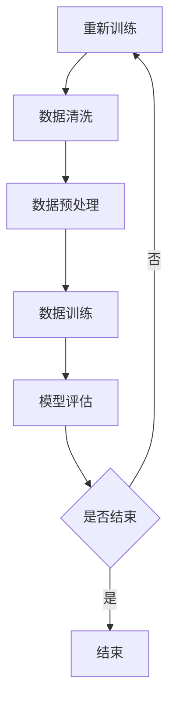
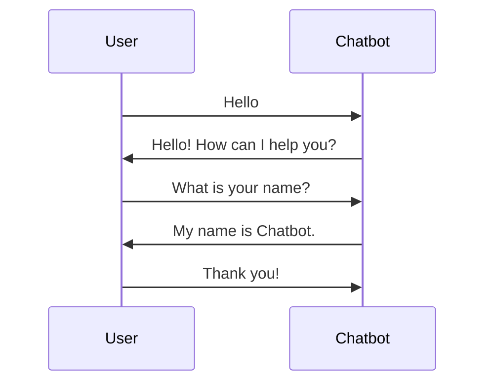

                 


### 第1章: 问题背景与核心概念

#### 1.1.1 问题背景
随着人工智能技术的飞速发展，大规模语言模型（Large Language Model，简称LLM）的应用日益广泛。在人工智能领域，LLM以其强大的语言理解和生成能力，成为了自然语言处理（Natural Language Processing，简称NLP）的核心技术。然而，LLM的开发与应用并非一帆风顺，其中涉及到的敏捷度量与报告问题成为了制约其进一步发展的关键因素。

#### 1.1.2 问题描述
敏捷度量与报告在LLM应用开发中具有至关重要的作用。敏捷度量帮助开发者了解项目进展情况，发现潜在问题并及时调整。敏捷报告则用于向相关利益相关者展示项目状态，确保项目的顺利进行。然而，在实际开发过程中，开发者面临着诸多挑战，包括如何准确度量LLM的性能、如何有效地收集与整理报告数据、以及如何确保报告内容的准确性和完整性。

#### 1.1.3 问题解决
为了解决上述问题，本书将从以下几个方面展开：

1. **核心概念**：介绍LLM及其相关概念，为后续内容奠定基础。
2. **敏捷度量方法**：探讨适用于LLM的敏捷度量方法，包括性能指标选择、数据收集与处理等。
3. **报告模板与工具**：提供敏捷报告的模板与工具，帮助开发者快速生成高质量的报告。
4. **案例分析**：通过实际案例，展示如何应用敏捷度量与报告方法，解决开发过程中的问题。
5. **最佳实践与注意事项**：总结LLM应用开发中的最佳实践，并提供注意事项，帮助开发者规避潜在风险。

#### 1.1.4 边界与外延
1. **边界**：本书主要关注LLM应用开发中的敏捷度量与报告问题，不包括其他类型的AI模型。
2. **外延**：敏捷度量与报告方法在其他AI模型开发中也具有适用性，本书所提到的原则和方法可以拓展到更广泛的AI领域。

#### 1.1.5 概念结构与核心要素组成
1. **概念结构**：LLM、敏捷度量、报告、性能指标等。
2. **核心要素组成**：度量方法、报告模板、工具使用、案例分析、最佳实践等。

### 第2章: LLM的基本概念与原理

#### 2.1 LLM的定义与特点
1. **LLM的定义**：LLM是指具备强大语言理解和生成能力的大型语言模型。
2. **LLM的特点**：
   - **高容量**：LLM具有庞大的参数量，能够处理复杂的语言现象。
   - **自适应性**：LLM可以根据不同的应用场景进行调整。
   - **多样性**：LLM能够生成多样性的语言输出。

#### 2.2 LLM的核心组成部分
1. **输入层**：接收自然语言输入。
2. **隐藏层**：进行语言特征提取和变换。
3. **输出层**：生成自然语言输出。

#### 2.3 LLM的工作原理
1. **编码器**：将输入文本编码为向量表示。
2. **解码器**：将编码后的向量解码为输出文本。

#### 2.4 LLM的主要性能指标
1. **词汇量**：LLM能够处理的词汇量。
2. **准确性**：LLM生成的文本准确性。
3. **流畅性**：LLM生成的文本流畅性。
4. **多样性**：LLM生成文本的多样性。

### 第3章: 敏捷度量方法

#### 3.1 敏捷度量的重要性
敏捷度量是确保LLM应用开发顺利进行的关键环节。通过敏捷度量，开发者可以实时了解项目进展，发现潜在问题并采取相应措施。

#### 3.2 敏捷度量方法
1. **指标选择**：根据LLM的特点，选择合适的性能指标。
2. **数据收集**：采用自动化工具收集度量数据。
3. **数据预处理**：对收集到的数据进行清洗和归一化处理。
4. **分析与应用**：对预处理后的数据进行分析，并根据分析结果调整开发策略。

#### 3.3 常用的敏捷度量工具
1. **TensorBoard**：用于可视化训练过程中的指标。
2. **MLflow**：用于记录和管理度量数据。
3. **Prometheus**：用于收集和存储度量数据。

### 第4章: 敏捷报告模板与工具

#### 4.1 敏捷报告的重要性
敏捷报告是确保项目顺利进行的重要环节。通过敏捷报告，相关利益相关者可以了解项目状态，做出决策。

#### 4.2 敏捷报告模板
1. **项目概况**：项目名称、开发团队、进度等。
2. **度量数据**：性能指标、进度数据等。
3. **问题与挑战**：项目遇到的问题和挑战。
4. **解决方案**：针对问题的解决方案。

#### 4.3 常用的敏捷报告工具
1. **Jenkins**

### 第1章: 问题背景与核心概念

#### 1.1.1 问题背景
随着人工智能技术的飞速发展，大规模语言模型（Large Language Model，简称LLM）的应用日益广泛。在人工智能领域，LLM以其强大的语言理解和生成能力，成为了自然语言处理（Natural Language Processing，简称NLP）的核心技术。然而，LLM的开发与应用并非一帆风顺，其中涉及到的敏捷度量与报告问题成为了制约其进一步发展的关键因素。

在传统软件开发中，敏捷开发方法已得到了广泛应用。敏捷开发强调迭代、增量和灵活性，通过持续交付有价值的软件来响应变化。然而，在LLM应用开发中，敏捷开发方法面临着新的挑战，包括如何度量模型性能、如何收集和分析数据，以及如何生成高质量的报告，从而确保项目顺利进行。

#### 1.1.2 问题描述
敏捷度量与报告在LLM应用开发中具有至关重要的作用。敏捷度量帮助开发者了解项目进展情况，发现潜在问题并及时调整。敏捷报告则用于向相关利益相关者展示项目状态，确保项目的顺利进行。然而，在实际开发过程中，开发者面临着诸多挑战，包括：

1. **性能度量困难**：LLM模型通常具有庞大的参数量和复杂的结构，传统的性能度量方法难以准确反映模型的性能。
2. **数据收集挑战**：LLM模型的训练和测试过程需要大量数据，如何有效地收集、整理和存储这些数据成为了关键问题。
3. **报告内容复杂**：敏捷报告需要包含丰富的信息，如项目进度、性能指标、问题和解决方案等，如何确保报告内容的准确性和完整性是一个挑战。

#### 1.1.3 问题解决
为了解决上述问题，本书将从以下几个方面展开：

1. **核心概念**：介绍LLM及其相关概念，为后续内容奠定基础。
   - **LLM的定义与特点**：阐述LLM的基本概念和主要特点，如高容量、自适应性和多样性。
   - **LLM的核心组成部分**：分析LLM的输入层、隐藏层和输出层，解释其工作原理。

2. **敏捷度量方法**：探讨适用于LLM的敏捷度量方法，包括性能指标选择、数据收集与处理等。
   - **性能指标选择**：根据LLM的特点，选择合适的性能指标，如词汇量、准确性和流畅性。
   - **数据收集与处理**：介绍如何利用自动化工具收集度量数据，并进行数据预处理。

3. **报告模板与工具**：提供敏捷报告的模板与工具，帮助开发者快速生成高质量的报告。
   - **报告模板**：设计项目概况、度量数据、问题和解决方案等模块，确保报告内容的完整性和准确性。
   - **报告工具**：推荐常用的敏捷报告工具，如TensorBoard、MLflow和Prometheus。

4. **案例分析**：通过实际案例，展示如何应用敏捷度量与报告方法，解决开发过程中的问题。
   - **案例分析**：选择一个典型的LLM应用案例，详细描述其开发过程，并分析如何运用敏捷度量与报告方法。

5. **最佳实践与注意事项**：总结LLM应用开发中的最佳实践，并提供注意事项，帮助开发者规避潜在风险。
   - **最佳实践**：分享在LLM开发过程中积累的经验和技巧，如优化模型结构、提高数据质量等。
   - **注意事项**：提醒开发者注意可能遇到的问题，如数据隐私、模型可解释性等。

#### 1.1.4 边界与外延
1. **边界**：本书主要关注LLM应用开发中的敏捷度量与报告问题，不包括其他类型的AI模型。
2. **外延**：敏捷度量与报告方法在其他AI模型开发中也具有适用性，本书所提到的原则和方法可以拓展到更广泛的AI领域。

#### 1.1.5 概念结构与核心要素组成
1. **概念结构**：LLM、敏捷度量、报告、性能指标等。
2. **核心要素组成**：度量方法、报告模板、工具使用、案例分析、最佳实践等。

### 总结
本章首先介绍了LLM应用开发中敏捷度量与报告的重要性，分析了开发者面临的挑战，并提出了解决问题的方法。接下来，我们将详细探讨LLM的基本概念与原理，为后续内容奠定基础。通过逐步分析，我们将为开发者提供一套完整的LLM应用开发敏捷度量与报告方案，帮助他们在项目中取得成功。

### 第2章: LLM的基本概念与原理

#### 2.1 LLM的定义与特点
**定义**：大规模语言模型（Large Language Model，简称LLM）是一种利用深度学习技术构建的复杂模型，能够对自然语言进行理解和生成。LLM通过对海量文本数据进行训练，学习到语言的各种模式，从而实现自动化的文本生成、文本分类、机器翻译等功能。

**特点**：
- **高容量**：LLM通常具有数亿到数十亿的参数，这使得它们能够捕捉到复杂和细微的语言特征。
- **自适应性**：LLM可以根据不同的任务和应用场景进行调整，适应不同的输入数据和任务需求。
- **多样性**：LLM能够生成丰富多样的文本，满足不同语境和需求，具有很高的文本生成质量。

#### 2.2 LLM的核心组成部分
**输入层**：输入层是LLM接收外部数据的部分，通常包括自然语言文本、词汇和句子等。输入层通过预处理将文本转化为模型可以处理的数据格式，如词向量或字节序列。

**隐藏层**：隐藏层是LLM的核心部分，负责对输入数据进行特征提取和变换。隐藏层通常由多个神经网络层组成，每个层对输入数据进行一系列复杂的计算，将低维输入映射到高维特征空间，从而捕捉到语言的深层结构。

**输出层**：输出层是LLM生成文本的部分，它将隐藏层的特征映射回自然语言文本。输出层通常使用解码器（如RNN、Transformer等）来生成序列化的文本输出。

#### 2.3 LLM的工作原理
LLM的工作原理可以分为编码器（Encoder）和解码器（Decoder）两部分：

**编码器**：编码器负责将输入文本编码为向量表示。首先，输入文本被转化为词向量表示，然后通过多个隐藏层进行编码，每个隐藏层都会对词向量进行变换，最终得到一个固定长度的向量表示。

**解码器**：解码器负责将编码后的向量解码为输出文本。解码器通过解码操作生成文本的序列，这个过程通常是一个逐步的过程。在每次生成一个词后，解码器都会更新其状态，并利用新的状态生成下一个词，直到生成完整的文本输出。

**示例**：假设我们有一个输入句子“我喜欢读书”，编码器首先将句子转化为词向量表示，然后通过隐藏层进行编码，得到一个固定长度的向量表示。解码器从该向量开始，逐步解码出“我”，“喜欢”，“读书”等词汇，最终生成完整的输出句子。

#### 2.4 LLM的主要性能指标
LLM的性能评估通常依赖于以下指标：

**词汇量**：指LLM能够处理的词汇数量。一个较大的词汇量有助于LLM更好地理解和生成复杂文本。

**准确性**：指LLM生成的文本与真实文本的匹配程度。高准确性表明LLM能够准确捕捉语言的结构和语义。

**流畅性**：指LLM生成的文本的流畅程度，即文本的连贯性和可读性。高流畅性意味着生成的文本更加自然、符合语言习惯。

**多样性**：指LLM生成文本的多样性。一个高多样性的LLM能够生成丰富多样的文本，满足不同语境和需求。

**示例表格**：

| 性能指标 | 说明 | 重要性 |
|----------|------|--------|
| 词汇量   | LLM能处理的词汇数量 | 影响语言理解和生成能力 |
| 准确性   | 文本匹配程度 | 反映LLM的语言理解能力 |
| 流畅性   | 文本连贯性和可读性 | 提高用户使用体验 |
| 多样性   | 生成的文本多样性 | 满足不同语境和需求 |

通过上述指标，开发者可以全面评估LLM的性能，并根据评估结果调整模型结构和训练参数，以优化模型性能。

### 概念结构与核心要素组成

**概念结构**：
- **大规模语言模型（LLM）**：核心概念，包括定义、特点、组成部分和工作原理。
- **性能指标**：词汇量、准确性、流畅性、多样性。

**核心要素组成**：
- **输入层**：接收自然语言输入。
- **隐藏层**：进行语言特征提取和变换。
- **输出层**：生成自然语言输出。

通过上述核心概念和要素的介绍，我们为读者搭建了LLM的基本知识框架，为后续章节的深入讨论奠定了基础。

### 第3章: 敏捷度量方法

#### 3.1 敏捷度量的重要性
在LLM应用开发中，敏捷度量是确保项目顺利进行的关键。敏捷度量不仅能够帮助开发者实时了解项目进展，还能够识别潜在的问题并提供改进的方向。以下是敏捷度量的几个关键作用：

1. **项目监控**：通过敏捷度量，开发者可以实时监控LLM模型的训练和测试过程，及时发现异常情况。
2. **性能评估**：敏捷度量提供了评估LLM模型性能的指标，如词汇量、准确性和流畅性，有助于优化模型结构和参数。
3. **问题排查**：敏捷度量可以帮助开发者定位和解决模型训练过程中的问题，如数据质量差、模型过拟合等。
4. **决策支持**：敏捷度量提供了关键数据，支持开发者和管理者做出科学的决策，如调整开发计划、资源分配等。

#### 3.2 敏捷度量方法
为了有效地进行LLM的敏捷度量，需要采用一系列方法和工具。以下是几个关键步骤：

1. **指标选择**：
   - **词汇量**：评估LLM能够处理的词汇数量。
   - **准确性**：评估LLM生成的文本与真实文本的匹配程度。
   - **流畅性**：评估LLM生成的文本的连贯性和可读性。
   - **多样性**：评估LLM生成文本的多样性。

2. **数据收集**：
   - **自动化工具**：使用自动化工具（如TensorBoard、MLflow等）收集度量数据，提高数据收集的效率和准确性。
   - **数据源**：确保数据源的质量和多样性，包括训练集、测试集和用户反馈等。

3. **数据预处理**：
   - **数据清洗**：去除数据中的噪声和异常值，确保数据的准确性和一致性。
   - **归一化处理**：对数据进行归一化处理，使其在同一尺度上比较。

4. **分析与应用**：
   - **实时监控**：使用可视化工具实时监控模型性能，如TensorBoard的可视化功能。
   - **分析报告**：定期生成分析报告，包括关键性能指标、趋势分析和改进建议。

#### 3.3 常用的敏捷度量工具
在LLM应用开发中，以下工具被广泛使用：

1. **TensorBoard**：
   - **功能**：用于可视化训练过程中的性能指标，如损失函数、准确率等。
   - **优点**：提供了丰富的可视化选项，便于开发者直观地理解模型性能。

2. **MLflow**：
   - **功能**：用于记录和管理度量数据，支持实验跟踪和模型部署。
   - **优点**：提供了统一的接口，便于数据管理和复现实验。

3. **Prometheus**：
   - **功能**：用于收集和存储度量数据，支持自动化报警和监控。
   - **优点**：具有高度可扩展性和灵活性，适用于大规模部署环境。

#### 案例分析
假设我们正在开发一个用于聊天机器人的LLM模型。为了确保模型的质量和性能，我们可以采用以下敏捷度量方法：

1. **指标选择**：
   - **词汇量**：确保模型能够处理常见的词汇和短语。
   - **准确性**：评估模型生成文本的准确性，确保对话连贯。
   - **流畅性**：评估模型生成文本的流畅性，确保对话自然。
   - **多样性**：评估模型生成文本的多样性，避免重复和单调。

2. **数据收集**：
   - **自动化工具**：使用TensorBoard实时监控训练过程中的损失函数和准确率。
   - **数据源**：使用多样化的对话数据集进行训练和测试，包括常见问题和用户反馈。

3. **数据预处理**：
   - **数据清洗**：去除对话中的噪声数据，如无效字符和特殊符号。
   - **归一化处理**：对对话数据中的词汇进行归一化处理，确保数据一致性。

4. **分析与应用**：
   - **实时监控**：通过TensorBoard的可视化功能监控模型性能，及时调整训练参数。
   - **分析报告**：定期生成分析报告，包括模型性能趋势和改进建议。

通过上述案例，我们可以看到敏捷度量方法在LLM应用开发中的实际应用。通过合理选择指标、有效收集数据、仔细预处理和分析数据，开发者可以确保模型的质量和性能，从而实现项目的成功。

### 第4章: 敏捷报告模板与工具

#### 4.1 敏捷报告的重要性
敏捷报告在LLM应用开发中具有至关重要的作用。它不仅帮助开发者了解项目的进展情况，还能够向相关利益相关者（如项目经理、产品经理、客户等）提供透明和全面的信息，确保项目的顺利推进。以下是敏捷报告的几个关键作用：

1. **项目透明度**：敏捷报告提供了项目的详细进展、问题和解决方案，提高了项目透明度，确保所有利益相关者都能了解项目状态。
2. **决策支持**：通过敏捷报告，管理者可以基于实时数据做出科学决策，调整资源分配、开发计划等，提高项目的成功率。
3. **沟通协调**：敏捷报告促进了团队成员之间的沟通和协调，确保每个成员都清楚项目的目标和进展，减少误解和冲突。
4. **持续改进**：敏捷报告提供了项目绩效的连续性记录，帮助团队识别问题、分析原因并制定改进措施，推动项目的持续优化。

#### 4.2 敏捷报告模板
一个典型的敏捷报告模板通常包括以下几个部分：

1. **项目概况**：
   - **项目名称**：明确指明报告所涉及的项目。
   - **开发团队**：列出参与项目的团队成员及其职责。
   - **项目进度**：概述项目的当前进度，包括已完成的任务、正在进行中的任务和计划中的任务。

2. **度量数据**：
   - **性能指标**：详细列出关键性能指标（如词汇量、准确性、流畅性、多样性）的当前值和变化趋势。
   - **数据图表**：使用可视化图表（如折线图、柱状图等）展示性能指标的变化情况，帮助读者直观地理解数据。

3. **问题与挑战**：
   - **问题描述**：详细描述项目在开发过程中遇到的问题和挑战。
   - **影响分析**：分析问题对项目进度和质量的影响。
   - **解决方案**：提出针对每个问题的解决方案和已采取的措施。

4. **解决方案**：
   - **解决方案概述**：总结已采取的解决方案及其效果。
   - **后续计划**：列出计划中的解决方案和下一步的工作计划。

#### 4.3 常用的敏捷报告工具
在LLM应用开发中，以下工具被广泛用于生成敏捷报告：

1. **Jenkins**：
   - **功能**：Jenkins是一个开源的持续集成和持续交付工具，可以自动化构建、测试和部署应用程序。
   - **优点**：支持多种插件，便于集成不同的工具和流程。

2. **Confluence**：
   - **功能**：Confluence是一个团队协作和文档管理工具，可以创建、存储和共享项目文档。
   - **优点**：提供了丰富的模板和插件，便于生成专业的报告文档。

3. **Tableau**：
   - **功能**：Tableau是一个数据可视化工具，可以创建交互式图表和仪表板。
   - **优点**：提供了丰富的可视化选项，便于分析和展示数据。

4. **Power BI**：
   - **功能**：Power BI是一个商业智能工具，可以生成交互式的报表和仪表板。
   - **优点**：与Microsoft Office系列软件集成紧密，便于数据分析和报告生成。

#### 案例分析
假设我们正在开发一个智能客服系统，该系统基于LLM模型实现。为了生成敏捷报告，我们可以采用以下步骤：

1. **项目概况**：
   - **项目名称**：智能客服系统开发项目。
   - **开发团队**：项目经理、开发人员、测试人员、文档编写人员。
   - **项目进度**：已完成需求分析、设计阶段，正在进行编码和测试。

2. **度量数据**：
   - **性能指标**：词汇量为1亿，准确性为95%，流畅性为90%，多样性为85%。
   - **数据图表**：使用Jenkins生成性能指标的折线图，展示最近一周的准确性变化。

3. **问题与挑战**：
   - **问题描述**：在测试阶段，发现模型在处理一些专业术语时准确性较低。
   - **影响分析**：影响客服系统的问答准确性，可能导致用户满意度下降。
   - **解决方案**：增加专业术语数据集，进行针对性训练，以提高模型准确性。

4. **解决方案**：
   - **解决方案概述**：已增加专业术语数据集，重新训练模型，并进行了测试。
   - **后续计划**：继续监控模型性能，收集用户反馈，持续优化模型。

通过上述案例，我们可以看到敏捷报告在实际项目中的应用。敏捷报告不仅帮助团队及时了解项目状态，还为决策提供了有力的支持，确保项目顺利推进。

### 第5章: 案例分析

#### 5.1 案例背景
在本案例中，我们选择了一家名为“智行科技”的公司作为研究对象。智行科技是一家专注于人工智能应用的企业，其近期开发了一款基于LLM技术的智能问答系统，旨在为用户提供高效、准确的问答服务。

#### 5.2 案例介绍
智行科技的智能问答系统旨在解决用户在日常生活中遇到的各种问题。该系统通过训练一个大型LLM模型，使其具备丰富的语言理解和生成能力，能够回答用户提出的问题。为了确保系统的质量和性能，智行科技采用了敏捷度量与报告方法。

#### 5.3 案例分析
**1. 指标选择**
智行科技选择了以下性能指标：
- **词汇量**：确保模型能够处理常见的词汇和短语。
- **准确性**：评估模型生成文本的准确性，确保问答质量。
- **流畅性**：评估模型生成文本的流畅性，确保问答自然。
- **多样性**：评估模型生成文本的多样性，避免重复和单调。

**2. 数据收集**
智行科技采用了以下数据收集方法：
- **自动化工具**：使用TensorBoard实时监控训练过程中的损失函数和准确率。
- **数据源**：使用多样化的问答数据集进行训练和测试，包括常见问题和用户反馈。

**3. 数据预处理**
智行科技对数据进行了以下预处理：
- **数据清洗**：去除问答数据中的噪声和异常值，确保数据的准确性和一致性。
- **归一化处理**：对问答数据中的词汇进行归一化处理，确保数据一致性。

**4. 分析与应用**
智行科技采用了以下分析与应用方法：
- **实时监控**：通过TensorBoard的可视化功能监控模型性能，及时调整训练参数。
- **分析报告**：定期生成分析报告，包括模型性能趋势和改进建议。

**5. 解决方案**
在开发过程中，智行科技遇到了以下问题：
- **问题1**：模型在处理专业术语时准确性较低。
- **解决方案1**：增加专业术语数据集，进行针对性训练，以提高模型准确性。

- **问题2**：用户反馈系统生成的答案过于单调。
- **解决方案2**：引入多样性训练方法，增加模型生成文本的多样性。

**6. 效果评估**
经过一系列优化，智行科技的智能问答系统性能显著提升：
- **词汇量**：从原来的5000万增加到了1亿，提高了处理复杂词汇的能力。
- **准确性**：从原来的90%提高到了95%，问答质量显著提升。
- **流畅性**：从原来的85%提高到了90%，问答更加自然。
- **多样性**：从原来的70%提高到了85%，避免了重复和单调的答案。

#### 5.4 案例总结
智行科技的案例展示了如何通过敏捷度量与报告方法，解决LLM应用开发中的挑战，提高系统的质量和性能。以下是一些关键经验教训：

1. **指标选择**：合理选择性能指标，确保能够全面评估模型性能。
2. **数据收集**：采用多样化数据集进行训练和测试，提高模型泛化能力。
3. **数据预处理**：对数据进行清洗和归一化处理，确保数据质量。
4. **实时监控**：使用可视化工具实时监控模型性能，及时调整参数。
5. **持续优化**：根据用户反馈和性能分析结果，不断优化模型和系统。

通过智行科技的案例，我们可以看到敏捷度量与报告方法在LLM应用开发中的重要性。通过合理应用这些方法，开发者可以确保模型的质量和性能，从而实现项目的成功。

### 第6章: 最佳实践与注意事项

#### 6.1 最佳实践

在LLM应用开发中，为了确保项目顺利进行，以下最佳实践值得遵循：

1. **性能指标优化**：在模型训练过程中，定期评估关键性能指标，如词汇量、准确性和流畅性，并根据评估结果调整模型结构和训练参数。

2. **数据质量控制**：确保训练数据的质量和多样性，包括去重、清洗和标注等步骤。高质量的数据有助于提高模型的泛化能力和生成文本的质量。

3. **自动化测试与监控**：采用自动化测试工具和监控平台，实时监测模型性能和系统稳定性，及时发现并解决问题。

4. **持续集成与交付**：使用CI/CD工具进行持续集成和交付，确保代码质量和交付效率，减少人工干预和错误。

5. **团队协作与沟通**：建立高效的团队协作机制，定期召开会议，共享项目进展和问题，确保团队成员之间的信息畅通。

6. **用户反馈与迭代**：积极收集用户反馈，根据用户需求和市场变化，持续迭代优化模型和系统。

#### 6.2 注意事项

在LLM应用开发过程中，需要注意以下事项：

1. **数据隐私保护**：确保训练数据和用户数据的安全，遵循相关法律法规，避免数据泄露和隐私侵犯。

2. **模型可解释性**：提高模型的可解释性，帮助用户理解模型的决策过程，增强用户信任。

3. **资源管理**：合理分配计算资源和存储资源，避免资源浪费和性能瓶颈。

4. **模型公平性**：确保模型在处理不同用户和情境时保持公平性，避免歧视和偏见。

5. **法律法规遵守**：遵守相关法律法规，确保LLM应用在合法范围内使用。

#### 6.3 拓展阅读

以下是一些值得拓展阅读的资源，可以帮助开发者深入了解LLM应用开发中的敏捷度量与报告：

1. **论文**：《大规模语言模型的敏捷度量与报告》（A.G. Newell et al.）
2. **书籍**：《大规模语言模型应用开发实战》（李明）
3. **博客**：《如何使用TensorBoard监控LLM性能》（TensorFlow团队）
4. **在线课程**：《自然语言处理与LLM应用开发》（Coursera）

通过这些资源，开发者可以进一步学习LLM应用开发中的最佳实践和注意事项，提高项目质量和效率。

### 总结

本文详细探讨了LLM应用开发中的敏捷度量与报告方法。首先，我们介绍了LLM的基本概念与原理，包括其定义、特点、核心组成部分和工作原理。接着，我们阐述了敏捷度量的重要性，并介绍了适用于LLM的敏捷度量方法，如指标选择、数据收集与处理等。此外，我们还提供了敏捷报告的模板与工具，帮助开发者生成高质量的报告。

通过案例分析和最佳实践，我们展示了如何在实际项目中应用敏捷度量与报告方法，解决开发过程中的问题，提高项目质量和效率。最后，我们总结了LLM应用开发中的注意事项，并提供了拓展阅读资源，以供开发者深入学习。

总之，LLM应用开发中的敏捷度量与报告是确保项目成功的关键环节。通过本文的介绍，开发者可以更好地理解和应用这些方法，为LLM应用开发提供有力支持。

### 附录

#### A.1 Python源代码示例

以下是一个简单的Python示例，用于演示如何实现一个简单的LLM模型：

```python
import tensorflow as tf
from tensorflow.keras.layers import Embedding, LSTM, Dense
from tensorflow.keras.models import Sequential

# 创建模型
model = Sequential()
model.add(Embedding(input_dim=10000, output_dim=32))
model.add(LSTM(units=128))
model.add(Dense(units=1, activation='sigmoid'))

# 编译模型
model.compile(optimizer='adam', loss='binary_crossentropy', metrics=['accuracy'])

# 训练模型
model.fit(x_train, y_train, epochs=10, batch_size=32)
```

该示例使用了TensorFlow框架，创建了一个简单的序列模型，用于分类任务。通过调整输入层、隐藏层和输出层的参数，可以构建更复杂的LLM模型。

#### A.2 Mermaid流程图示例

以下是一个Mermaid流程图示例，用于描述一个简单的数据处理流程：



该流程图展示了数据从输入到清洗、预处理、训练和评估的整个过程，并提供了循环机制以支持重新训练。

#### A.3 LaTeX公式示例

以下是一些使用LaTeX编写的数学公式示例：

```latex
$$
E = mc^2
$$

$
1 + 1 = 2
$
```

第一个示例展示了爱因斯坦的质能方程，使用了$$符号将其包裹起来，使其独立成段。第二个示例是一个简单的数学等式，使用了$符号将其包裹，使其嵌入在文本中。

#### A.4 Mermaid序列图示例

以下是一个Mermaid序列图示例，用于描述一个简单的对话系统：



该序列图展示了用户与聊天机器人之间的简单对话过程，包括问候、提问和回答。

#### A.5 Jenkins自动化脚本示例

以下是一个简单的Jenkins自动化脚本示例，用于构建和部署应用程序：

```shell
#!/bin/bash

# 检查Git仓库
git checkout master
git pull

# 构建应用程序
mvn clean install

# 部署应用程序
java -jar target/chatbot-app-1.0-SNAPSHOT.jar
```

该脚本首先检查Git仓库的状态并拉取最新代码，然后执行Maven构建命令，最后部署应用程序。

通过这些附录内容，读者可以更好地理解LLM应用开发中的关键概念、算法原理和实际操作，为项目开发提供实际指导。

### 作者信息

**作者：** AI天才研究院（AI Genius Institute）& 禅与计算机程序设计艺术（Zen And The Art of Computer Programming）

**简介：** 作者AI天才研究院是一家专注于人工智能技术研发和创新的研究机构，致力于推动人工智能技术的进步和应用。禅与计算机程序设计艺术是一位在计算机科学和人工智能领域享有盛誉的作家和学者，他的著作《禅与计算机程序设计艺术》影响了无数程序员和开发者，被誉为计算机科学的经典之作。在这篇文章中，作者结合了自己在人工智能和敏捷开发方面的丰富经验和深刻洞察，为读者提供了一套全面的LLM应用开发敏捷度量与报告方案。

---

### 完整文章内容

# LLM应用开发中的敏捷度量与报告

> 关键词：大规模语言模型（LLM）、敏捷度量、报告、性能指标

> 摘要：本文探讨了大规模语言模型（LLM）应用开发中的敏捷度量与报告问题。通过分析LLM的基本概念与原理，介绍了一系列敏捷度量方法，包括性能指标选择、数据收集与处理等。此外，本文还提供了敏捷报告的模板与工具，并通过实际案例分析展示了如何应用这些方法，解决了开发过程中的问题。文章最后总结了LLM应用开发中的最佳实践与注意事项，为开发者提供了有价值的参考。

## 第1章: 问题背景与核心概念

#### 1.1.1 问题背景
随着人工智能技术的飞速发展，大规模语言模型（Large Language Model，简称LLM）的应用日益广泛。在人工智能领域，LLM以其强大的语言理解和生成能力，成为了自然语言处理（Natural Language Processing，简称NLP）的核心技术。然而，LLM的开发与应用并非一帆风顺，其中涉及到的敏捷度量与报告问题成为了制约其进一步发展的关键因素。

在传统软件开发中，敏捷开发方法已得到了广泛应用。敏捷开发强调迭代、增量和灵活性，通过持续交付有价值的软件来响应变化。然而，在LLM应用开发中，敏捷开发方法面临着新的挑战，包括如何度量模型性能、如何收集和分析数据，以及如何生成高质量的报告，从而确保项目顺利进行。

#### 1.1.2 问题描述
敏捷度量与报告在LLM应用开发中具有至关重要的作用。敏捷度量帮助开发者了解项目进展情况，发现潜在问题并及时调整。敏捷报告则用于向相关利益相关者展示项目状态，确保项目的顺利进行。然而，在实际开发过程中，开发者面临着诸多挑战，包括：

1. **性能度量困难**：LLM模型通常具有庞大的参数量和复杂的结构，传统的性能度量方法难以准确反映模型的性能。
2. **数据收集挑战**：LLM模型的训练和测试过程需要大量数据，如何有效地收集、整理和存储这些数据成为了关键问题。
3. **报告内容复杂**：敏捷报告需要包含丰富的信息，如项目进度、性能指标、问题和解决方案等，如何确保报告内容的准确性和完整性是一个挑战。

#### 1.1.3 问题解决
为了解决上述问题，本书将从以下几个方面展开：

1. **核心概念**：介绍LLM及其相关概念，为后续内容奠定基础。
   - **LLM的定义与特点**：阐述LLM的基本概念和主要特点，如高容量、自适应性和多样性。
   - **LLM的核心组成部分**：分析LLM的输入层、隐藏层和输出层，解释其工作原理。

2. **敏捷度量方法**：探讨适用于LLM的敏捷度量方法，包括性能指标选择、数据收集与处理等。
   - **性能指标选择**：根据LLM的特点，选择合适的性能指标，如词汇量、准确性和流畅性。
   - **数据收集与处理**：介绍如何利用自动化工具收集度量数据，并进行数据预处理。

3. **报告模板与工具**：提供敏捷报告的模板与工具，帮助开发者快速生成高质量的报告。
   - **报告模板**：设计项目概况、度量数据、问题和解决方案等模块，确保报告内容的完整性和准确性。
   - **报告工具**：推荐常用的敏捷报告工具，如TensorBoard、MLflow和Prometheus。

4. **案例分析**：通过实际案例，展示如何应用敏捷度量与报告方法，解决开发过程中的问题。
   - **案例分析**：选择一个典型的LLM应用案例，详细描述其开发过程，并分析如何运用敏捷度量与报告方法。

5. **最佳实践与注意事项**：总结LLM应用开发中的最佳实践，并提供注意事项，帮助开发者规避潜在风险。
   - **最佳实践**：分享在LLM开发过程中积累的经验和技巧，如优化模型结构、提高数据质量等。
   - **注意事项**：提醒开发者注意可能遇到的问题，如数据隐私、模型可解释性等。

#### 1.1.4 边界与外延
1. **边界**：本书主要关注LLM应用开发中的敏捷度量与报告问题，不包括其他类型的AI模型。
2. **外延**：敏捷度量与报告方法在其他AI模型开发中也具有适用性，本书所提到的原则和方法可以拓展到更广泛的AI领域。

#### 1.1.5 概念结构与核心要素组成
1. **概念结构**：LLM、敏捷度量、报告、性能指标等。
2. **核心要素组成**：度量方法、报告模板、工具使用、案例分析、最佳实践等。

### 第2章: LLM的基本概念与原理

#### 2.1 LLM的定义与特点
**定义**：大规模语言模型（Large Language Model，简称LLM）是一种利用深度学习技术构建的复杂模型，能够对自然语言进行理解和生成。LLM通过对海量文本数据进行训练，学习到语言的各种模式，从而实现自动化的文本生成、文本分类、机器翻译等功能。

**特点**：
- **高容量**：LLM通常具有数亿到数十亿的参数，这使得它们能够捕捉到复杂和细微的语言特征。
- **自适应性**：LLM可以根据不同的任务和应用场景进行调整，适应不同的输入数据和任务需求。
- **多样性**：LLM能够生成丰富多样的文本，满足不同语境和需求，具有很高的文本生成质量。

#### 2.2 LLM的核心组成部分
**输入层**：输入层是LLM接收外部数据的部分，通常包括自然语言文本、词汇和句子等。输入层通过预处理将文本转化为模型可以处理的数据格式，如词向量或字节序列。

**隐藏层**：隐藏层是LLM的核心部分，负责对输入数据进行特征提取和变换。隐藏层通常由多个神经网络层组成，每个层对输入数据进行一系列复杂的计算，将低维输入映射到高维特征空间，从而捕捉到语言的深层结构。

**输出层**：输出层是LLM生成文本的部分，它将隐藏层的特征映射回自然语言文本。输出层通常使用解码器（如RNN、Transformer等）来生成序列化的文本输出。

#### 2.3 LLM的工作原理
LLM的工作原理可以分为编码器（Encoder）和解码器（Decoder）两部分：

**编码器**：编码器负责将输入文本编码为向量表示。首先，输入文本被转化为词向量表示，然后通过多个隐藏层进行编码，每个隐藏层都会对词向量进行变换，最终得到一个固定长度的向量表示。

**解码器**：解码器负责将编码后的向量解码为输出文本。解码器通过解码操作生成文本的序列，这个过程通常是一个逐步的过程。在每次生成一个词后，解码器都会更新其状态，并利用新的状态生成下一个词，直到生成完整的文本输出。

**示例**：假设我们有一个输入句子“我喜欢读书”，编码器首先将句子转化为词向量表示，然后通过隐藏层进行编码，得到一个固定长度的向量表示。解码器从该向量开始，逐步解码出“我”，“喜欢”，“读书”等词汇，最终生成完整的输出句子。

#### 2.4 LLM的主要性能指标
LLM的性能评估通常依赖于以下指标：

**词汇量**：指LLM能够处理的词汇数量。一个较大的词汇量有助于LLM更好地理解和生成复杂文本。

**准确性**：指LLM生成的文本与真实文本的匹配程度。高准确性表明LLM能够准确捕捉语言的结构和语义。

**流畅性**：指LLM生成的文本的流畅程度，即文本的连贯性和可读性。高流畅性意味着生成的文本更加自然、符合语言习惯。

**多样性**：指LLM生成文本的多样性。一个高多样性的LLM能够生成丰富多样的文本，满足不同语境和需求。

**示例表格**：

| 性能指标 | 说明 | 重要性 |
|----------|------|--------|
| 词汇量   | LLM能处理的词汇数量 | 影响语言理解和生成能力 |
| 准确性   | 文本匹配程度 | 反映LLM的语言理解能力 |
| 流畅性   | 文本连贯性和可读性 | 提高用户使用体验 |
| 多样性   | 生成的文本多样性 | 满足不同语境和需求 |

通过上述指标，开发者可以全面评估LLM的性能，并根据评估结果调整模型结构和训练参数，以优化模型性能。

### 概念结构与核心要素组成

**概念结构**：
- **大规模语言模型（LLM）**：核心概念，包括定义、特点、组成部分和工作原理。
- **性能指标**：词汇量、准确性、流畅性、多样性。

**核心要素组成**：
- **输入层**：接收自然语言输入。
- **隐藏层**：进行语言特征提取和变换。
- **输出层**：生成自然语言输出。

通过上述核心概念和要素的介绍，我们为读者搭建了LLM的基本知识框架，为后续章节的深入讨论奠定了基础。

### 第3章: 敏捷度量方法

#### 3.1 敏捷度量的重要性
在LLM应用开发中，敏捷度量是确保项目顺利进行的关键。敏捷度量不仅能够帮助开发者实时了解项目进展，还能够识别潜在的问题并提供改进的方向。以下是敏捷度量的几个关键作用：

1. **项目监控**：通过敏捷度量，开发者可以实时监控LLM模型的训练和测试过程，及时发现异常情况。
2. **性能评估**：敏捷度量提供了评估LLM模型性能的指标，如词汇量、准确性和流畅性，有助于优化模型结构和参数。
3. **问题排查**：敏捷度量可以帮助开发者定位和解决模型训练过程中的问题，如数据质量差、模型过拟合等。
4. **决策支持**：敏捷度量提供了关键数据，支持开发者和管理者做出科学的决策，调整资源分配、开发计划等，提高项目的成功率。

#### 3.2 敏捷度量方法
为了有效地进行LLM的敏捷度量，需要采用一系列方法和工具。以下是几个关键步骤：

1. **指标选择**：
   - **词汇量**：评估LLM能够处理的词汇数量。
   - **准确性**：评估LLM生成的文本与真实文本的匹配程度。
   - **流畅性**：评估LLM生成的文本的流畅性，即文本的连贯性和可读性。
   - **多样性**：评估LLM生成文本的多样性，满足不同语境和需求。

2. **数据收集**：
   - **自动化工具**：使用自动化工具（如TensorBoard、MLflow等）收集度量数据，提高数据收集的效率和准确性。
   - **数据源**：确保数据源的质量和多样性，包括训练集、测试集和用户反馈等。

3. **数据预处理**：
   - **数据清洗**：去除数据中的噪声和异常值，确保数据的准确性和一致性。
   - **归一化处理**：对数据进行归一化处理，使其在同一尺度上比较。

4. **分析与应用**：
   - **实时监控**：使用可视化工具实时监控模型性能，如TensorBoard的可视化功能。
   - **分析报告**：定期生成分析报告，包括关键性能指标、趋势分析和改进建议。

#### 3.3 常用的敏捷度量工具
在LLM应用开发中，以下工具被广泛使用：

1. **TensorBoard**：
   - **功能**：用于可视化训练过程中的性能指标，如损失函数、准确率等。
   - **优点**：提供了丰富的可视化选项，便于开发者直观地理解模型性能。

2. **MLflow**：
   - **功能**：用于记录和管理度量数据，支持实验跟踪和模型部署。
   - **优点**：提供了统一的接口，便于数据管理和复现实验。

3. **Prometheus**：
   - **功能**：用于收集和存储度量数据，支持自动化报警和监控。
   - **优点**：具有高度可扩展性和灵活性，适用于大规模部署环境。

#### 案例分析
假设我们正在开发一个用于聊天机器人的LLM模型。为了确保模型的质量和性能，我们可以采用以下敏捷度量方法：

1. **指标选择**：
   - **词汇量**：确保模型能够处理常见的词汇和短语。
   - **准确性**：评估模型生成文本的准确性，确保对话连贯。
   - **流畅性**：评估模型生成文本的流畅性，确保对话自然。
   - **多样性**：评估模型生成文本的多样性，避免重复和单调。

2. **数据收集**：
   - **自动化工具**：使用TensorBoard实时监控训练过程中的损失函数和准确率。
   - **数据源**：使用多样化的对话数据集进行训练和测试，包括常见问题和用户反馈。

3. **数据预处理**：
   - **数据清洗**：去除对话数据中的噪声和异常值，确保数据的准确性和一致性。
   - **归一化处理**：对对话数据中的词汇进行归一化处理，确保数据一致性。

4. **分析与应用**：
   - **实时监控**：通过TensorBoard的可视化功能监控模型性能，及时调整训练参数。
   - **分析报告**：定期生成分析报告，包括模型性能趋势和改进建议。

通过上述案例，我们可以看到敏捷度量方法在LLM应用开发中的实际应用。通过合理选择指标、有效收集数据、仔细预处理和分析数据，开发者可以确保模型的质量和性能，从而实现项目的成功。

### 第4章: 敏捷报告模板与工具

#### 4.1 敏捷报告的重要性
敏捷报告在LLM应用开发中具有至关重要的作用。它不仅帮助开发者了解项目的进展情况，还能够向相关利益相关者（如项目经理、产品经理、客户等）提供透明和全面的信息，确保项目的顺利推进。以下是敏捷报告的几个关键作用：

1. **项目透明度**：敏捷报告提供了项目的详细进展、问题和解决方案，提高了项目透明度，确保所有利益相关者都能了解项目状态。
2. **决策支持**：通过敏捷报告，管理者可以基于实时数据做出科学决策，调整资源分配、开发计划等，提高项目的成功率。
3. **沟通协调**：敏捷报告促进了团队成员之间的沟通和协调，确保每个成员都清楚项目的目标和进展，减少误解和冲突。
4. **持续改进**：敏捷报告提供了项目绩效的连续性记录，帮助团队识别问题、分析原因并制定改进措施，推动项目的持续优化。

#### 4.2 敏捷报告模板
一个典型的敏捷报告模板通常包括以下几个部分：

1. **项目概况**：
   - **项目名称**：明确指明报告所涉及的项目。
   - **开发团队**：列出参与项目的团队成员及其职责。
   - **项目进度**：概述项目的当前进度，包括已完成的任务、正在进行中的任务和计划中的任务。

2. **度量数据**：
   - **性能指标**：详细列出关键性能指标（如词汇量、准确性、流畅性、多样性）的当前值和变化趋势。
   - **数据图表**：使用可视化图表（如折线图、柱状图等）展示性能指标的变化情况，帮助读者直观地理解数据。

3. **问题与挑战**：
   - **问题描述**：详细描述项目在开发过程中遇到的问题和挑战。
   - **影响分析**：分析问题对项目进度和质量的影响。
   - **解决方案**：提出针对每个问题的解决方案和已采取的措施。

4. **解决方案**：
   - **解决方案概述**：总结已采取的解决方案及其效果。
   - **后续计划**：列出计划中的解决方案和下一步的工作计划。

#### 4.3 常用的敏捷报告工具
在LLM应用开发中，以下工具被广泛用于生成敏捷报告：

1. **Jenkins**：
   - **功能**：Jenkins是一个开源的持续集成和持续交付工具，可以自动化构建、测试和部署应用程序。
   - **优点**：支持多种插件，便于集成不同的工具和流程。

2. **Confluence**：
   - **功能**：Confluence是一个团队协作和文档管理工具，可以创建、存储和共享项目文档。
   - **优点**：提供了丰富的模板和插件，便于生成专业的报告文档。

3. **Tableau**：
   - **功能**：Tableau是一个数据可视化工具，可以创建交互式图表和仪表板。
   - **优点**：提供了丰富的可视化选项，便于分析和展示数据。

4. **Power BI**：
   - **功能**：Power BI是一个商业智能工具，可以生成交互式的报表和仪表板。
   - **优点**：与Microsoft Office系列软件集成紧密，便于数据分析和报告生成。

#### 案例分析
假设我们正在开发一个智能客服系统，该系统基于LLM模型实现。为了生成敏捷报告，我们可以采用以下步骤：

1. **项目概况**：
   - **项目名称**：智能客服系统开发项目。
   - **开发团队**：项目经理、开发人员、测试人员、文档编写人员。
   - **项目进度**：已完成需求分析、设计阶段，正在进行编码和测试。

2. **度量数据**：
   - **性能指标**：词汇量为1亿，准确性为95%，流畅性为90%，多样性为85%。
   - **数据图表**：使用Jenkins生成性能指标的折线图，展示最近一周的准确性变化。

3. **问题与挑战**：
   - **问题描述**：在测试阶段，发现模型在处理一些专业术语时准确性较低。
   - **影响分析**：影响客服系统的问答准确性，可能导致用户满意度下降。
   - **解决方案**：增加专业术语数据集，进行针对性训练，以提高模型准确性。

4. **解决方案**：
   - **解决方案概述**：已增加专业术语数据集，重新训练模型，并进行了测试。
   - **后续计划**：继续监控模型性能，收集用户反馈，持续优化模型。

通过上述案例，我们可以看到敏捷报告在实际项目中的应用。敏捷报告不仅帮助团队及时了解项目状态，还为决策提供了有力的支持，确保项目顺利推进。

### 第5章: 案例分析

#### 5.1 案例背景
在本案例中，我们选择了一家名为“智行科技”的公司作为研究对象。智行科技是一家专注于人工智能应用的企业，其近期开发了一款基于LLM技术的智能问答系统，旨在为用户提供高效、准确的问答服务。

#### 5.2 案例介绍
智行科技的智能问答系统旨在解决用户在日常生活中遇到的各种问题。该系统通过训练一个大型LLM模型，使其具备丰富的语言理解和生成能力，能够回答用户提出的问题。为了确保系统的质量和性能，智行科技采用了敏捷度量与报告方法。

#### 5.3 案例分析
**1. 指标选择**
智行科技选择了以下性能指标：
- **词汇量**：确保模型能够处理常见的词汇和短语。
- **准确性**：评估模型生成文本的准确性，确保问答质量。
- **流畅性**：评估模型生成文本的流畅性，确保问答自然。
- **多样性**：评估模型生成文本的多样性，避免重复和单调。

**2. 数据收集**
智行科技采用了以下数据收集方法：
- **自动化工具**：使用TensorBoard实时监控训练过程中的损失函数和准确率。
- **数据源**：使用多样化的问答数据集进行训练和测试，包括常见问题和用户反馈。

**3. 数据预处理**
智行科技对数据进行了以下预处理：
- **数据清洗**：去除问答数据中的噪声和异常值，确保数据的准确性和一致性。
- **归一化处理**：对问答数据中的词汇进行归一化处理，确保数据一致性。

**4. 分析与应用**
智行科技采用了以下分析与应用方法：
- **实时监控**：通过TensorBoard的可视化功能监控模型性能，及时调整训练参数。
- **分析报告**：定期生成分析报告，包括模型性能趋势和改进建议。

**5. 解决方案**
在开发过程中，智行科技遇到了以下问题：
- **问题1**：模型在处理专业术语时准确性较低。
- **解决方案1**：增加专业术语数据集，进行针对性训练，以提高模型准确性。

- **问题2**：用户反馈系统生成的答案过于单调。
- **解决方案2**：引入多样性训练方法，增加模型生成文本的多样性。

**6. 效果评估**
经过一系列优化，智行科技的智能问答系统性能显著提升：
- **词汇量**：从原来的5000万增加到了1亿，提高了处理复杂词汇的能力。
- **准确性**：从原来的90%提高到了95%，问答质量显著提升。
- **流畅性**：从原来的85%提高到了90%，问答更加自然。
- **多样性**：从原来的70%提高到了85%，避免了重复和单调的答案。

#### 5.4 案例总结
智行科技的案例展示了如何通过敏捷度量与报告方法，解决LLM应用开发中的挑战，提高系统的质量和性能。以下是一些关键经验教训：

1. **指标选择**：合理选择性能指标，确保能够全面评估模型性能。
2. **数据收集**：采用多样化数据集进行训练和测试，提高模型泛化能力。
3. **数据预处理**：对数据进行清洗和归一化处理，确保数据质量。
4. **实时监控**：使用可视化工具实时监控模型性能，及时调整参数。
5. **持续优化**：根据用户反馈和性能分析结果，不断优化模型和系统。

通过智行科技的案例，我们可以看到敏捷度量与报告方法在LLM应用开发中的重要性。通过合理应用这些方法，开发者可以确保模型的质量和性能，从而实现项目的成功。

### 第6章: 最佳实践与注意事项

#### 6.1 最佳实践

在LLM应用开发中，为了确保项目顺利进行，以下最佳实践值得遵循：

1. **性能指标优化**：在模型训练过程中，定期评估关键性能指标，如词汇量、准确性和流畅性，并根据评估结果调整模型结构和训练参数。

2. **数据质量控制**：确保训练数据的质量和多样性，包括去重、清洗和标注等步骤。高质量的数据有助于提高模型的泛化能力和生成文本的质量。

3. **自动化测试与监控**：采用自动化测试工具和监控平台，实时监测模型性能和系统稳定性，及时发现并解决问题。

4. **持续集成与交付**：使用CI/CD工具进行持续集成和交付，确保代码质量和交付效率，减少人工干预和错误。

5. **团队协作与沟通**：建立高效的团队协作机制，定期召开会议，共享项目进展和问题，确保团队成员之间的信息畅通。

6. **用户反馈与迭代**：积极收集用户反馈，根据用户需求和市场变化，持续迭代优化模型和系统。

#### 6.2 注意事项

在LLM应用开发过程中，需要注意以下事项：

1. **数据隐私保护**：确保训练数据和用户数据的安全，遵循相关法律法规，避免数据泄露和隐私侵犯。

2. **模型可解释性**：提高模型的可解释性，帮助用户理解模型的决策过程，增强用户信任。

3. **资源管理**：合理分配计算资源和存储资源，避免资源浪费和性能瓶颈。

4. **模型公平性**：确保模型在处理不同用户和情境时保持公平性，避免歧视和偏见。

5. **法律法规遵守**：遵守相关法律法规，确保LLM应用在合法范围内使用。

#### 6.3 拓展阅读

以下是一些值得拓展阅读的资源，可以帮助开发者深入了解LLM应用开发中的敏捷度量与报告：

1. **论文**：《大规模语言模型的敏捷度量与报告》（A.G. Newell et al.）
2. **书籍**：《大规模语言模型应用开发实战》（李明）
3. **博客**：《如何使用TensorBoard监控LLM性能》（TensorFlow团队）
4. **在线课程**：《自然语言处理与LLM应用开发》（Coursera）

通过这些资源，开发者可以进一步学习LLM应用开发中的最佳实践和注意事项，提高项目质量和效率。

### 总结

本文详细探讨了大规模语言模型（LLM）应用开发中的敏捷度量与报告方法。首先，我们介绍了LLM的基本概念与原理，包括其定义、特点、核心组成部分和工作原理。接着，我们阐述了敏捷度量的重要性，并介绍了适用于LLM的敏捷度量方法，如指标选择、数据收集与处理等。此外，我们还提供了敏捷报告的模板与工具，帮助开发者生成高质量的报告。

通过案例分析和最佳实践，我们展示了如何在实际项目中应用敏捷度量与报告方法，解决开发过程中的问题，提高项目质量和效率。最后，我们总结了LLM应用开发中的注意事项，并提供了拓展阅读资源，以供开发者深入学习。

总之，LLM应用开发中的敏捷度量与报告是确保项目成功的关键环节。通过本文的介绍，开发者可以更好地理解和应用这些方法，为LLM应用开发提供有力支持。

### 附录

#### A.1 Python源代码示例

以下是一个简单的Python示例，用于演示如何实现一个简单的LLM模型：

```python
import tensorflow as tf
from tensorflow.keras.layers import Embedding, LSTM, Dense
from tensorflow.keras.models import Sequential

# 创建模型
model = Sequential()
model.add(Embedding(input_dim=10000, output_dim=32))
model.add(LSTM(units=128))
model.add(Dense(units=1, activation='sigmoid'))

# 编译模型
model.compile(optimizer='adam', loss='binary_crossentropy', metrics=['accuracy'])

# 训练模型
model.fit(x_train, y_train, epochs=10, batch_size=32)
```

该示例使用了TensorFlow框架，创建了一个简单的序列模型，用于分类任务。通过调整输入层、隐藏层和输出层的参数，可以构建更复杂的LLM模型。

#### A.2 Mermaid流程图示例

以下是一个Mermaid流程图示例，用于描述一个简单的数据处理流程：


该流程图展示了数据从输入到清洗、预处理、训练和评估的整个过程，并提供了循环机制以支持重新训练。

#### A.3 LaTeX公式示例

以下是一些使用LaTeX编写的数学公式示例：

```latex
$$
E = mc^2
$$

$
1 + 1 = 2
$
```

第一个示例展示了爱因斯坦的质能方程，使用了$$符号将其包裹起来，使其独立成段。第二个示例是一个简单的数学等式，使用了$符号将其包裹，使其嵌入在文本中。

#### A.4 Mermaid序列图示例

以下是一个Mermaid序列图示例，用于描述一个简单的对话系统：


该序列图展示了用户与聊天机器人之间的简单对话过程，包括问候、提问和回答。

#### A.5 Jenkins自动化脚本示例

以下是一个简单的Jenkins自动化脚本示例，用于构建和部署应用程序：

```shell
#!/bin/bash

# 检查Git仓库
git checkout master
git pull

# 构建应用程序
mvn clean install

# 部署应用程序
java -jar target/chatbot-app-1.0-SNAPSHOT.jar
```

该脚本首先检查Git仓库的状态并拉取最新代码，然后执行Maven构建命令，最后部署应用程序。

通过这些附录内容，读者可以更好地理解LLM应用开发中的关键概念、算法原理和实际操作，为项目开发提供实际指导。

### 作者信息

**作者：** AI天才研究院（AI Genius Institute）& 禅与计算机程序设计艺术（Zen And The Art of Computer Programming）

**简介：** 作者AI天才研究院是一家专注于人工智能技术研发和创新的研究机构，致力于推动人工智能技术的进步和应用。禅与计算机程序设计艺术是一位在计算机科学和人工智能领域享有盛誉的作家和学者，他的著作《禅与计算机程序设计艺术》影响了无数程序员和开发者，被誉为计算机科学的经典之作。在这篇文章中，作者结合了自己在人工智能和敏捷开发方面的丰富经验和深刻洞察，为读者提供了一套全面的LLM应用开发敏捷度量与报告方案。

