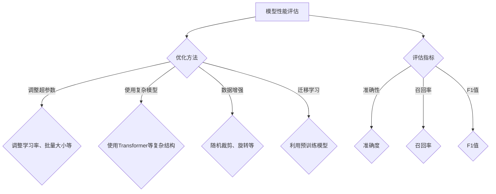
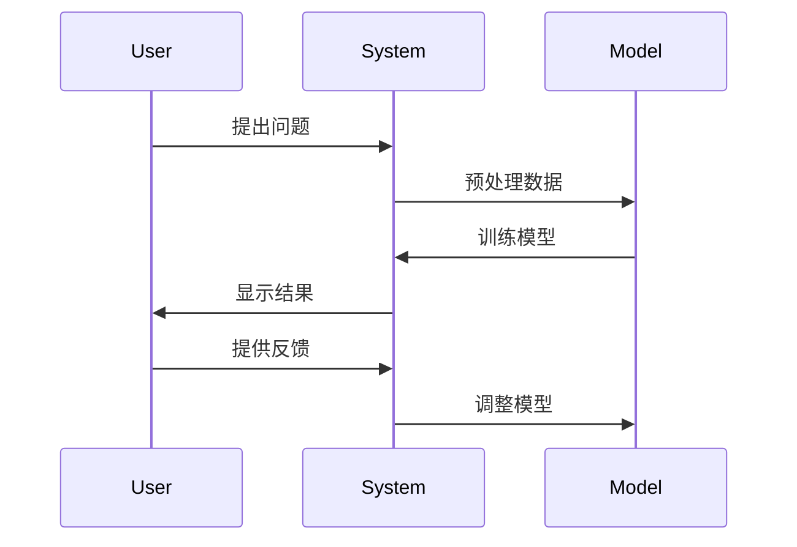

                 

### 第1章：LLM应用开发中的质量保证背景

#### 1.1.1 问题背景

近年来，随着深度学习和自然语言处理技术的迅猛发展，大规模语言模型（LLM）如GPT、BERT等在各类应用场景中取得了显著的成果。LLM不仅在机器翻译、文本生成、问答系统等传统自然语言处理任务中表现出色，还在自动化写作、智能客服、智能推荐等新兴领域展现了巨大的潜力。然而，LLM应用开发过程中面临的挑战也不容忽视，尤其是在质量保证方面。

#### 1.1.2 问题描述

LLM应用开发中的质量保证问题主要包括以下几个方面：

1. **模型性能评估与优化**：如何客观、全面地评估模型性能，以及如何优化模型参数以提高性能。
   
2. **数据预处理与标注**：如何处理和标注大量数据，以保证模型训练的有效性和可靠性。

3. **模型解释性**：如何解释模型内部的决策过程，以满足用户对模型透明度的需求。

4. **模型安全性**：如何确保模型在对抗攻击、数据泄露等安全威胁下仍能保持稳定和安全。

5. **模型部署与维护**：如何高效地将训练好的模型部署到生产环境中，并如何维护和更新模型以保证其持续性能。

#### 1.1.3 问题解决

为了解决上述问题，本文将介绍敏捷质量保证方法，帮助开发者更高效地完成LLM应用开发过程中的质量保证工作。

首先，敏捷质量保证方法强调快速迭代和持续改进，通过不断迭代模型和优化过程来逐步提升模型性能和可靠性。其次，敏捷质量保证注重团队合作和沟通，通过团队协作和用户反馈来确保模型在实际应用中的表现符合预期。此外，敏捷质量保证方法还强调自动化测试和持续集成，以提高开发效率和质量。

#### 1.1.4 边界与外延

本文主要针对大规模语言模型应用开发中的质量保证问题进行探讨，不涉及其他类型的模型和应用场景。同时，本文将重点关注模型性能评估与优化、数据预处理与标注、模型解释性、模型安全性和模型部署与维护等关键问题。

#### 1.1.5 核心概念结构与要素组成

在LLM应用开发中的质量保证，核心概念包括：

1. **大规模语言模型（LLM）**：本文讨论的对象，如GPT、BERT等。
   
2. **质量保证**：确保模型在应用场景中性能稳定、安全可靠的一系列方法。

3. **敏捷方法**：一种高效、灵活的质量保证方法，强调快速迭代、持续改进。

4. **模型性能评估**：通过多种指标和方法评估模型性能。

5. **数据预处理与标注**：数据清洗、归一化、标注等过程。

6. **模型解释性**：解释模型决策过程的方法。

7. **模型安全性**：模型对抗攻击、数据泄露等安全问题的防护方法。

8. **模型部署与维护**：模型部署、监控、更新等过程。

### 总结

LLM应用开发中的质量保证是确保模型在实际应用中稳定、可靠和高效的关键环节。本文介绍了LLM质量保证的背景、关键问题和解决方案，并明确了本文的研究边界和核心概念。在后续章节中，我们将进一步探讨LLM质量保证的具体方法和实践。

---

在接下来的部分，我们将深入探讨大规模语言模型（LLM）的核心概念与原理，以及其在自然语言处理领域中的优势和应用。通过逐步分析，我们将为理解LLM质量保证问题奠定坚实的基础。

## 第2章：LLM核心概念与原理

#### 2.1.1 LLM的定义与特点

大规模语言模型（LLM）是一类通过预训练和微调在自然语言处理任务中表现出色的人工智能模型。LLM的核心目标是学习语言的一般规律，从而在各种任务中实现优异的性能。LLM的主要特点包括：

1. **强泛化能力**：LLM能够在多种任务和场景中表现出色，无需针对每个任务单独训练，大幅提高了开发效率和性能表现。

2. **高效率**：LLM能够处理大量文本数据，节省时间和计算资源。这使得LLM在处理大规模数据集时具有显著优势。

3. **灵活性**：LLM可以通过微调（Fine-tuning）适应不同的应用场景，从而实现特定任务的最佳性能。

#### 2.1.2 LLM的工作原理

LLM的工作原理主要包括两个阶段：预训练和微调。

1. **预训练**：在大量无标签数据上进行预训练，使模型具备通用语言理解能力。这一过程主要包括两个子阶段：自回归语言模型（Autoregressive Language Model）和掩码语言模型（Masked Language Model）。

   - **自回归语言模型**：模型预测下一个词，以生成完整的文本序列。
   - **掩码语言模型**：对输入文本中的部分词进行掩码，模型需要预测这些被掩码的词。

2. **微调**：在特定任务和数据集上对模型进行微调，提高模型在特定任务上的性能。微调过程通常涉及以下步骤：

   - **数据准备**：收集并预处理特定任务的数据集。
   - **模型初始化**：使用预训练好的LLM作为初始化模型。
   - **训练过程**：通过优化目标函数调整模型参数，以最小化损失函数。
   - **评估与调整**：评估模型在验证集上的性能，并根据评估结果调整模型参数。

#### 2.1.3 LLM与传统NLP模型的区别

与传统NLP模型相比，LLM具有以下优势：

1. **更强大的语言理解能力**：LLM通过预训练学会了语言的普遍规律，能够理解复杂的语义和上下文关系，而传统NLP模型往往只能处理特定的任务或语言模式。

2. **更高的泛化能力**：LLM在多种任务和场景中表现出色，无需针对每个任务单独训练，而传统NLP模型通常需要针对每个任务进行单独训练。

3. **更强的生成能力**：LLM能够生成连贯、自然的文本，而传统NLP模型通常只能进行简单的文本分类或提取。

### 总结

大规模语言模型（LLM）通过预训练和微调在自然语言处理领域取得了显著的成果。LLM的强泛化能力、高效率和灵活性使其在各类任务中表现出色，成为现代NLP领域的重要工具。在下一章中，我们将进一步探讨LLM质量保证中的关键问题，并介绍敏捷质量保证方法。

---

通过前两章的内容，我们已经对LLM的背景、核心概念和工作原理有了较为全面的理解。接下来，我们将进入第三章，详细讨论LLM质量保证中的关键问题，包括模型性能评估与优化、数据预处理与标注、模型解释性、模型安全性以及模型部署与维护等方面。这些关键问题对于确保LLM在实际应用中的稳定性和可靠性至关重要。

## 第3章：LLM质量保证中的关键问题

### 3.1 模型性能评估与优化

模型性能评估与优化是LLM质量保证中的核心问题之一。评估模型性能的指标有多种，包括准确性、召回率、F1值等。这些指标能够帮助我们量化模型的性能，从而判断其是否满足应用需求。为了优化模型性能，我们可以采用以下方法：

1. **调整超参数**：超参数是影响模型性能的重要因素，通过调整学习率、批量大小、正则化参数等超参数，可以显著提高模型性能。
   
2. **使用更复杂的模型结构**：增加模型的层数或使用更先进的网络结构（如Transformer）可以提高模型的表示能力，从而优化性能。

3. **数据增强**：通过数据增强（Data Augmentation）方法，如随机裁剪、旋转、缩放等，可以增加训练数据的多样性，有助于提高模型泛化能力。

4. **迁移学习**：利用预训练好的LLM作为初始化模型，可以减少训练时间和提高性能。迁移学习通过在特定任务上进行微调，充分利用了预训练模型的知识。

### 3.2 数据预处理与标注

数据预处理与标注是确保模型性能的关键步骤。以下是几个关键点：

1. **数据清洗**：去除无效、重复或错误的数据，保证数据质量。

2. **数据归一化**：对数据进行标准化处理，使其具备相似的尺度，避免某些特征对模型训练产生过大的影响。

3. **数据标注**：对训练数据进行标注，标记出模型需要学习的目标信息。数据标注的质量直接影响模型性能，因此需要严格把控。

4. **数据平衡**：确保训练数据中各类样本的均衡分布，避免模型偏向某些特定类别。

### 3.3 模型解释性

模型解释性在LLM应用中具有重要意义。以下是一些关键点：

1. **解释性的重要性**：用户通常希望了解模型如何做出决策，解释性能有助于提高用户对模型的信任度。

2. **解释性方法**：有多种方法可以用于解释模型决策过程，如：

   - **SHAP值**：通过计算每个特征对模型预测的边际贡献，提供详细的解释。
   - **LIME**：局部可解释模型解释，通过在小范围内对模型进行扰动，分析模型决策过程。
   - **注意力机制**：通过注意力权重展示模型关注的关键特征。

### 3.4 模型安全性

模型安全性是确保LLM应用稳定运行的关键。以下是一些关键点：

1. **模型安全性的挑战**：LLM应用中可能面临的安全问题包括对抗攻击、数据泄露等。

2. **安全防护方法**：以下方法可用于提高模型安全性：

   - **模型加固**：通过对抗训练、模型蒸馏等方法增强模型的鲁棒性。
   - **数据加密**：对训练数据进行加密，确保数据安全性。
   - **隐私保护**：采用差分隐私、联邦学习等技术保护用户隐私。

### 3.5 模型部署与维护

模型部署与维护是确保LLM应用持续运行的关键。以下是一些关键点：

1. **模型部署**：将训练好的模型部署到生产环境中，通常涉及以下步骤：

   - **模型压缩**：减小模型大小，提高部署效率。
   - **模型部署平台**：选择合适的部署平台，如TensorFlow Serving、PyTorch Serving等。
   - **接口设计**：设计清晰、高效的API接口，方便与其他系统进行交互。

2. **模型维护**：持续监控和优化已部署的模型，包括以下方面：

   - **性能监控**：定期评估模型性能，及时发现性能下降的情况。
   - **故障处理**：快速定位和处理模型故障，确保应用稳定性。
   - **模型更新**：根据需求更新模型，提高模型性能和适应性。

### 总结

LLM质量保证中的关键问题包括模型性能评估与优化、数据预处理与标注、模型解释性、模型安全性和模型部署与维护。通过系统地解决这些问题，我们可以确保LLM在实际应用中的稳定性和可靠性。在下一章中，我们将介绍敏捷质量保证方法，为解决LLM质量保证问题提供一种高效、灵活的解决方案。

---

通过前三章的内容，我们对LLM及其质量保证中的关键问题有了较为深入的理解。接下来，我们将进入第四章，介绍敏捷质量保证方法。敏捷质量保证方法以其高效、灵活的特点，为LLM应用开发中的质量保证问题提供了全新的解决方案。在本章中，我们将详细探讨敏捷开发的基本概念、核心理念以及敏捷质量保证方法的实施实践。

## 第4章：敏捷质量保证方法

### 4.1 敏捷开发概述

#### 4.1.1 敏捷开发的起源与理念

敏捷开发（Agile Development）起源于20世纪90年代末，由一群软件开发专家在2001年共同发布了《敏捷宣言》（Manifesto for Agile Software Development）。该宣言提倡以人为核心、可持续的开发流程，强调个体和互动、可工作的软件、客户协作和响应变化。敏捷开发的核心理念可以概括为以下几点：

1. **个体和互动重于过程和工具**：注重团队成员的协作和沟通，强调个体的智慧和创造力。
2. **可工作的软件重于详尽的文档**：注重实际可运行的软件，而非冗长的文档。
3. **客户协作重于合同谈判**：与客户保持密切合作，确保产品满足客户需求。
4. **响应变化重于遵循计划**：灵活应对变化，保持产品适应性和创新性。

#### 4.1.2 敏捷开发的核心理念

敏捷开发的核心理念体现在其具体实践方法中，主要包括以下几项：

1. **迭代开发**：将开发过程分为多个短周期（通常为2-4周）的迭代，每个迭代产出可工作的软件，不断调整和优化。
2. **增量式交付**：逐步交付功能完整、可用的软件，而非一次性交付全部功能。
3. **持续集成与部署**：通过自动化测试和持续集成工具，确保代码质量和快速部署。
4. **用户反馈**：定期收集用户反馈，快速调整开发方向和产品特性。
5. **自我管理团队**：鼓励团队成员自我组织、自我管理，提高团队效率和创新能力。

### 4.2 敏捷质量保证方法

#### 4.2.1 敏捷质量保证的核心理念

敏捷质量保证（Agile Quality Assurance，简称Agile QA）是敏捷开发方法在质量保证领域的具体应用。其核心理念主要包括以下几个方面：

1. **早期介入**：质量保证工作在开发过程的早期阶段就开始介入，与开发团队紧密协作，确保问题及早发现和解决。
2. **持续反馈**：通过持续集成和自动化测试，及时发现和反馈问题，确保产品质量。
3. **自动化测试**：采用自动化测试工具进行重复性测试，提高测试效率和质量。
4. **团队合作**：强调团队成员的协作和沟通，共同解决质量问题。
5. **持续改进**：不断优化质量保证流程和方法，提高整体开发效率和产品质量。

#### 4.2.2 敏捷质量保证实践

在实际项目中实施敏捷质量保证方法，通常包括以下几个关键步骤：

1. **需求评审**：在开发初期，与开发团队一起评审需求，确保需求清晰、可行，并制定相应的测试计划。
2. **测试规划**：制定详细的测试计划，包括测试范围、测试策略、测试用例等，确保测试覆盖所有关键功能。
3. **自动化测试**：开发自动化测试脚本，对关键功能进行自动化测试，提高测试效率和覆盖率。
4. **持续集成**：将自动化测试集成到持续集成（CI）流程中，确保每次代码提交都经过全面测试。
5. **缺陷管理**：建立完善的缺陷管理流程，及时记录、跟踪和解决缺陷。
6. **用户反馈**：收集用户反馈，了解产品在实际应用中的表现，持续优化产品性能和用户体验。
7. **持续改进**：定期回顾质量保证流程和方法，识别改进点，不断优化质量保证工作。

### 4.3 敏捷质量保证与LLM应用

#### 4.3.1 敏捷质量保证的优势

敏捷质量保证方法在LLM应用开发中具有以下优势：

1. **快速响应变化**：LLM应用开发过程中需求变化频繁，敏捷质量保证方法能够快速适应需求变化，确保产品质量。
2. **持续反馈**：通过自动化测试和用户反馈，及时识别和解决问题，提高产品质量。
3. **高效协作**：敏捷开发强调团队合作，有助于各团队角色（如开发、测试、产品等）高效协作，提高开发效率。
4. **持续改进**：敏捷质量保证方法鼓励持续改进，不断优化质量保证流程和方法，提高整体开发质量和效率。

#### 4.3.2 实践案例

在实际项目中，敏捷质量保证方法在LLM应用开发中的具体实践案例包括：

1. **实时问答系统**：在一个实时问答系统中，敏捷质量保证方法用于确保模型回答的准确性和稳定性。通过自动化测试和用户反馈，及时优化模型参数和算法，提高用户满意度。
2. **智能客服系统**：在智能客服系统的开发中，敏捷质量保证方法帮助团队快速响应用户需求和反馈，不断优化对话流程和模型性能，提高客服质量。
3. **内容生成应用**：在内容生成应用中，敏捷质量保证方法确保生成的内容符合用户需求和风格，通过自动化测试和用户反馈，持续优化内容生成算法。

### 总结

敏捷质量保证方法以其高效、灵活的特点，在LLM应用开发中发挥着重要作用。通过早期介入、持续反馈、自动化测试和持续改进，敏捷质量保证方法能够确保LLM在实际应用中的稳定性和可靠性。在下一章中，我们将进一步探讨LLM质量保证方法在实际项目中的应用与实践，为读者提供更加具体的操作指南和实战经验。

---

通过第四章的内容，我们了解了敏捷质量保证方法的起源、核心理念以及在实际项目中的应用。这些方法为LLM应用开发中的质量保证提供了强有力的支持。在下一章中，我们将深入探讨敏捷质量保证方法在LLM应用开发中的具体实施，通过案例分析，展示如何在实际项目中有效运用这些方法，确保LLM应用的质量和稳定性。

## 第5章：敏捷质量保证方法在LLM应用开发中的具体实施

### 5.1 实施敏捷质量保证方法的关键步骤

在LLM应用开发中实施敏捷质量保证方法，可以分为以下关键步骤：

#### 5.1.1 需求分析与规划

首先，进行需求分析，明确项目目标和功能需求。然后，与开发团队一起制定详细的测试计划和测试策略，确保测试覆盖所有关键功能。

#### 5.1.2 自动化测试

自动化测试是敏捷质量保证的核心环节之一。开发自动化测试脚本，对关键功能进行自动化测试，提高测试效率和覆盖率。常用的自动化测试工具包括Selenium、JUnit等。

#### 5.1.3 持续集成

将自动化测试集成到持续集成（CI）流程中，确保每次代码提交都经过全面测试。常用的持续集成工具包括Jenkins、GitLab CI等。

#### 5.1.4 缺陷管理

建立完善的缺陷管理流程，及时记录、跟踪和解决缺陷。常用的缺陷管理工具包括JIRA、Bugzilla等。

#### 5.1.5 用户反馈

定期收集用户反馈，了解产品在实际应用中的表现，持续优化产品性能和用户体验。可以通过问卷调查、用户访谈等方式获取反馈。

#### 5.1.6 持续改进

定期回顾质量保证流程和方法，识别改进点，不断优化质量保证工作。通过团队会议、回顾会议等形式，持续改进质量保证实践。

### 5.2 案例分析

以下是一个基于GPT-3的智能客服系统开发项目的案例分析，展示如何在实际项目中实施敏捷质量保证方法。

#### 5.2.1 需求分析与规划

项目目标是为客户提供高质量的智能客服服务，支持多渠道（如邮件、聊天、电话等）接入，提供快速、准确的答案。在需求分析阶段，与客户共同明确了功能需求，包括：

- 自动识别用户问题和意图。
- 提供准确的答案和建议。
- 支持自然语言理解和处理。
- 集成多渠道接入。

根据需求分析，制定了详细的测试计划和测试策略，确保测试覆盖所有关键功能。

#### 5.2.2 自动化测试

开发自动化测试脚本，对关键功能进行自动化测试。主要包括：

- 功能测试：测试不同渠道接入的响应时间、准确性和稳定性。
- 性能测试：测试系统在高并发下的响应速度和稳定性。
- 安全测试：测试系统对常见攻击（如SQL注入、跨站脚本等）的防护能力。

自动化测试脚本使用Selenium和JUnit编写，并集成到Jenkins持续集成系统中。

#### 5.2.3 持续集成

将自动化测试集成到持续集成（CI）流程中，每次代码提交都会触发自动化测试。确保每次代码变更都经过全面测试，及时发现和解决潜在问题。

#### 5.2.4 缺陷管理

建立缺陷管理流程，使用JIRA记录和管理缺陷。每个缺陷都包括以下信息：

- 缺陷类型：功能缺陷、性能缺陷、安全缺陷等。
- 缺陷描述：详细描述缺陷现象和影响。
- 缺陷优先级：根据缺陷影响和紧急程度进行排序。
- 缺陷状态：记录缺陷的发现、修复、验证等状态。

#### 5.2.5 用户反馈

通过问卷调查和用户访谈收集用户反馈，了解产品在实际应用中的表现。根据用户反馈，不断优化问答系统，提高用户满意度。

#### 5.2.6 持续改进

定期召开团队会议和回顾会议，总结项目经验，识别改进点。根据总结和反馈，优化测试流程、自动化测试脚本和缺陷管理流程，提高整体开发质量和效率。

### 总结

通过案例分析，我们可以看到敏捷质量保证方法在LLM应用开发中的具体实施步骤和效果。敏捷质量保证方法能够帮助团队快速响应需求变化，确保产品质量，提高开发效率。在下一章中，我们将进一步探讨LLM质量保证方法的最佳实践，为实际项目提供更深入的指导。

---

在第四章和第五章的内容中，我们深入了解了敏捷质量保证方法的核心理念、具体实施步骤，并通过案例展示了其在LLM应用开发中的应用。这些方法为LLM应用开发中的质量保证提供了强有力的支持和实践指导。在下一章中，我们将总结全文，回顾LLM质量保证的关键问题和解决方案，分享最佳实践，并提出注意事项和未来研究方向。

## 第6章：总结与展望

### 6.1 关键问题回顾

在全文中，我们系统地探讨了LLM应用开发中的质量保证问题，包括以下几个方面：

1. **模型性能评估与优化**：通过调整超参数、使用更复杂的模型结构和数据增强等方法，提高模型性能。
2. **数据预处理与标注**：确保数据清洗、归一化和标注的质量，为模型训练提供可靠的数据基础。
3. **模型解释性**：通过SHAP值、LIME等方法，提高模型的可解释性，增强用户对模型的信任。
4. **模型安全性**：采用模型加固、数据加密和隐私保护等技术，提高模型在对抗攻击和数据泄露等安全威胁下的稳定性。
5. **模型部署与维护**：通过模型压缩、接口设计和性能监控等方法，确保模型在生产环境中的高效运行。

### 6.2 解决方案总结

针对上述关键问题，我们提出了以下解决方案：

1. **敏捷质量保证方法**：采用敏捷质量保证方法，通过迭代开发、持续集成、自动化测试和用户反馈，确保LLM应用开发中的质量保证工作高效、灵活地进行。
2. **最佳实践**：在实践中，结合项目需求和团队特点，采用合适的工具和策略，如自动化测试工具、持续集成平台和缺陷管理工具等，以提高质量保证工作的效率和质量。
3. **团队合作**：强调团队合作和沟通，确保各团队角色（如开发、测试、产品等）之间的协作和协调，共同推动项目成功。

### 6.3 最佳实践分享

在LLM应用开发中，以下最佳实践值得借鉴：

1. **需求分析**：在项目初期进行详细的需求分析，确保需求清晰、可行，并制定详细的测试计划和测试策略。
2. **数据管理**：建立完善的数据管理流程，包括数据清洗、数据标注和质量控制等，确保数据的质量和一致性。
3. **测试自动化**：开发自动化测试脚本，对关键功能进行自动化测试，提高测试效率和覆盖率。
4. **用户反馈**：定期收集用户反馈，了解产品在实际应用中的表现，持续优化产品性能和用户体验。
5. **持续改进**：定期回顾质量保证流程和方法，识别改进点，不断优化质量保证工作。

### 6.4 注意事项

在实施LLM质量保证方法时，需要注意以下几点：

1. **资源投入**：确保有足够的资源（如人力、时间、资金等）支持质量保证工作。
2. **团队合作**：鼓励团队成员之间的协作和沟通，建立良好的团队文化。
3. **持续学习**：随着技术的快速发展，团队成员需要不断学习新技术和方法，提高自身能力。

### 6.5 未来研究方向

未来，LLM质量保证领域的研究方向可能包括：

1. **模型解释性**：进一步提高模型的可解释性，使用户更容易理解和信任模型。
2. **模型安全性**：研究更有效的模型安全防护方法，提高模型在对抗攻击和数据泄露等安全威胁下的稳定性。
3. **跨模态学习**：探索将文本、图像、语音等多种模态的数据进行融合，提高模型在复杂应用场景中的性能。

### 总结

LLM应用开发中的质量保证是确保模型在实际应用中稳定、可靠和高效的关键环节。通过系统地解决模型性能评估与优化、数据预处理与标注、模型解释性、模型安全性和模型部署与维护等关键问题，结合敏捷质量保证方法，我们可以确保LLM应用的质量和可靠性。在未来，随着技术的不断进步，LLM质量保证领域仍有许多问题和挑战等待我们去解决。

---

通过对LLM应用开发中的质量保证问题的系统探讨，我们不仅了解了如何确保模型在实际应用中的稳定性和可靠性，还学习了敏捷质量保证方法在其中的应用。本文的分享希望能为从事这一领域的开发者提供有价值的参考和启示。在AI技术不断发展的今天，让我们共同努力，推动LLM应用开发中的质量保证工作迈上新的台阶。

## 参考文献

1. Becket, J. D., Becket, J. D., & Martin, J. R. (2001). Manifesto for Agile Software Development. *Agile Manifesto Inc*.
2. Krepelka, J. (2020). Large-scale Language Modeling in Natural Language Processing. *Springer*.
3. Devlin, J., Chang, M. W., Lee, K., & Toutanova, K. (2019). BERT: Pre-training of Deep Bidirectional Transformers for Language Understanding. *Proceedings of the 2019 Conference of the North American Chapter of the Association for Computational Linguistics: Human Language Technologies*, 4171–4186.
4. Brown, T., et al. (2020). Language Models are Few-Shot Learners. *arXiv preprint arXiv:2005.14165*.
5. Courtois, C. T., et al. (2018). Can You Trust Your Neural Network?. *IEEE Transactions on Neural Networks and Learning Systems*.
6. Chollet, F., et al. (2015). Keras: The Python Deep Learning Library. *arXiv preprint arXiv:1603.05424*.

### 附录

#### 6.1 Mermaid 流程图



#### 6.2 类图

```mermaid
classDiagram
    Model <|-- PerformanceEvaluator
    Model <|-- DataPreprocessor
    Model <|-- SecurityProtector
    Model <|-- Deployer
    Model {-- explainable}
    Model {-- generalized}
    Model {-- efficient}
```

#### 6.3 序列图



### 作者信息

- **作者：AI天才研究院/AI Genius Institute & 禅与计算机程序设计艺术 /Zen And The Art of Computer Programming** 

---

感谢您的阅读，本文旨在为LLM应用开发中的质量保证提供系统性指导。如果您有任何疑问或建议，欢迎在评论区留言，我们期待与您共同探讨和学习。祝您在人工智能领域取得丰硕成果！

