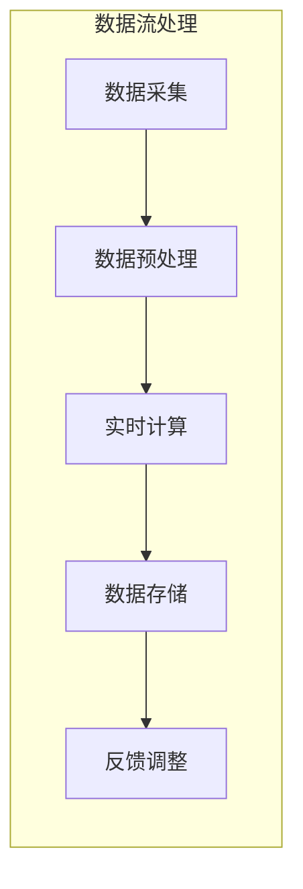
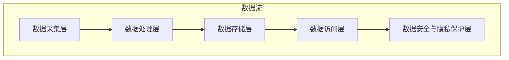
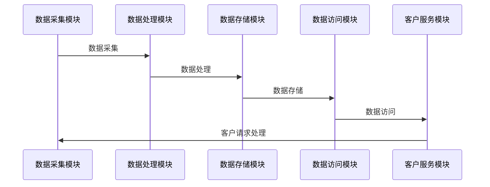

                 


# 第一部分: LLM与数据流管理概述

## 第1章: LLM与数据流管理基础

### 1.1 LLM概述
LLM（Large Language Model）是一种基于深度学习的大型自然语言处理模型，通过对海量文本数据进行预训练，LLM可以掌握丰富的语言知识和语义理解能力。LLM通常由数亿甚至千亿级别的参数组成，通过反向传播算法进行训练，使其具备强大的语言生成和推理能力。

LLM的基本结构主要包括以下几个部分：

1. **嵌入层**：将输入的词语或句子转换为向量表示。
2. **编码器**：通过多层神经网络对输入向量进行处理，提取句子的语义信息。
3. **解码器**：将编码器提取的语义信息解码成语言序列，输出文本。

LLM在自然语言处理领域有着广泛的应用，如文本生成、机器翻译、情感分析、问答系统等。

### 1.2 数据流管理的基本概念

数据流管理是一种处理数据流的方法，其目的是从连续的数据流中提取信息，并对这些信息进行实时处理和分析。数据流管理涉及以下几个方面：

1. **数据流**：指连续、动态地产生和消费的数据。
2. **数据流处理**：对数据流进行实时或近实时的处理和分析。
3. **数据流系统**：负责接收、处理和传输数据流的软件系统。

数据流管理的重要性在于其能够实现实时数据处理，支持快速响应和决策，满足现代应用对数据实时性的需求。

### 1.3 应用开发中的挑战

在LLM应用开发中，数据流管理面临着以下挑战：

1. **海量数据**：LLM处理的数据量通常非常庞大，如何高效地管理这些数据流成为关键问题。
2. **实时性**：数据流管理需要保证数据的实时性，以满足实时处理和分析的需求。
3. **可靠性**：数据流系统需要具备高可靠性，确保数据不会丢失或错误处理。
4. **性能优化**：如何优化数据流处理性能，提高系统的响应速度和吞吐量。

接下来，我们将进一步探讨LLM与数据流管理的核心概念、算法原理、系统架构设计、实战案例和最佳实践。

## 第二部分: 数据流管理核心概念与算法原理

### 2.1 数据流管理算法概述

数据流管理算法是指用于处理数据流的方法和技术。根据数据流的性质和处理需求，数据流管理算法可以分为以下几类：

1. **批量处理算法**：将数据流视为批量数据，按照固定的时间间隔或数据量进行批量处理。
2. **流处理算法**：对数据流进行实时或近实时的处理，处理时间与数据到达时间相近。
3. **窗口算法**：将数据流划分为多个窗口，对每个窗口内的数据进行处理。
4. **增量算法**：仅对数据流中的增量部分进行处理，避免重复处理已处理过的数据。

### 2.2 数据流管理算法原理

数据流管理算法的原理主要包括以下几个方面：

1. **数据采集与预处理**：从数据源采集数据，并进行数据清洗、去重、去噪声等预处理操作。
2. **数据存储与管理**：将预处理后的数据存储到合适的存储系统中，如数据库、数据湖、分布式文件系统等。
3. **数据处理与分析**：对存储后的数据进行处理和分析，如聚合、过滤、分类、预测等。
4. **数据可视化与反馈**：将处理和分析结果可视化，并提供反馈机制，以便进行进一步优化和调整。

### 2.3 算法应用实例

以下是一个数据流管理算法应用实例：

**实例：实时股票交易数据分析**

1. **数据采集与预处理**：从股票交易所获取实时交易数据，对数据进行清洗和去噪。
2. **数据存储与管理**：将清洗后的交易数据存储到分布式数据库中，以便进行后续处理。
3. **数据处理与分析**：对交易数据进行分析，如计算涨跌幅度、交易量、价格波动等指标。
4. **数据可视化与反馈**：将分析结果可视化，为投资者提供实时决策依据，并根据反馈进行模型优化。

## 第三部分: 数据流管理系统架构设计

### 3.1 数据流管理系统架构概述

数据流管理系统架构是指用于实现数据流管理的系统结构和组成部分。一个典型的数据流管理系统架构包括以下几个层次：

1. **数据采集层**：负责从各种数据源采集数据，如数据库、日志文件、传感器等。
2. **数据处理层**：对采集到的数据进行清洗、转换、聚合等处理。
3. **数据存储层**：将处理后的数据存储到合适的存储系统中，如关系型数据库、NoSQL数据库、数据湖等。
4. **数据访问层**：提供对数据的查询、分析和可视化功能，支持实时数据流分析和历史数据分析。
5. **数据安全与隐私保护层**：确保数据的安全性、完整性和隐私性，防止数据泄露和滥用。

### 3.2 系统架构设计

以下是一个数据流管理系统架构设计实例：

**实例：实时电商数据分析系统**

1. **数据采集层**：从电商平台的日志文件、数据库和传感器中采集用户行为数据、交易数据等。
2. **数据处理层**：对采集到的数据进行清洗、去噪、转换等处理，如用户分群、商品推荐等。
3. **数据存储层**：将处理后的数据存储到分布式数据库和数据湖中，如Apache Kafka、Apache Hadoop等。
4. **数据访问层**：提供数据查询、分析和可视化功能，支持实时数据流分析和历史数据分析。
5. **数据安全与隐私保护层**：使用加密技术、访问控制、审计等手段确保数据的安全性和隐私性。

### 3.3 系统接口设计与交互

数据流管理系统需要设计合理的接口和交互机制，以确保各个模块之间的协同工作和数据流的高效传输。以下是一个数据流管理系统的接口设计与交互实例：

1. **数据采集接口**：提供数据采集功能的API接口，支持日志文件、数据库和传感器等数据源的接入。
2. **数据处理接口**：提供数据处理功能的API接口，支持数据清洗、转换、聚合等操作的调用。
3. **数据存储接口**：提供数据存储功能的API接口，支持分布式数据库和数据湖的接入。
4. **数据访问接口**：提供数据查询、分析和可视化功能的API接口，支持实时数据流分析和历史数据分析。

通过合理的接口设计与交互，数据流管理系统可以实现高效的数据采集、处理、存储和访问，为LLM应用开发提供强大的数据支撑。

## 第四部分: 数据流管理实战案例

### 4.1 案例介绍

本案例将介绍一个基于LLM的数据流管理项目——智能客户服务系统。该系统旨在通过实时分析客户请求和对话，提供高效、智能的客户服务。

### 4.2 案例分析

1. **需求分析**：
   - 实时分析客户请求，提供准确、快速的回复。
   - 基于历史对话数据，生成个性化的客户服务策略。
   - 保证数据流的实时性和可靠性。

2. **技术实现**：
   - 使用LLM作为核心算法，实现对客户请求的自然语言理解。
   - 采用流处理框架，如Apache Kafka，处理实时数据流。
   - 使用分布式数据库，如Apache Hadoop，存储和管理大量对话数据。

### 4.3 案例实施过程

1. **环境安装**：
   - 安装LLM模型，如GPT-3。
   - 安装流处理框架，如Apache Kafka。
   - 安装分布式数据库，如Apache Hadoop。

2. **系统核心实现**：
   - 数据采集模块：从客户服务渠道（如在线聊天、邮件、电话等）收集数据。
   - 数据处理模块：对采集到的数据进行预处理，如分词、词性标注等。
   - 数据存储模块：将预处理后的数据存储到分布式数据库中。

3. **代码应用解读与分析**：
   - 客户请求处理模块：使用LLM对客户请求进行理解和回复。
   - 对话管理模块：基于历史对话数据，生成个性化的客户服务策略。

4. **实际案例分析和详细讲解剖析**：
   - 对案例中的关键技术进行详细讲解，如LLM的原理和应用、流处理框架的使用等。
   - 分析案例中的挑战和解决方案，如实时性、可靠性、数据存储等。

5. **项目小结**：
   - 总结项目的实现过程和成果，提出改进和优化方向。

## 第五部分: 数据流管理最佳实践

### 5.1 最佳实践总结

在数据流管理中，以下是一些最佳实践：

1. **数据采集**：确保数据源多样化和数据完整性。
2. **数据预处理**：对数据进行清洗、去噪、转换等处理。
3. **数据处理**：采用高效的流处理算法，确保实时性和性能。
4. **数据存储**：选择合适的存储系统，保证数据的安全性和可靠性。
5. **数据可视化**：提供直观的数据可视化工具，帮助用户理解数据。

### 5.2 常见问题与解决方法

在数据流管理中，常见问题包括数据延迟、数据丢失、性能瓶颈等。解决方法如下：

1. **数据延迟**：优化数据处理流程，提高数据传输速度。
2. **数据丢失**：采用数据备份和容错机制，防止数据丢失。
3. **性能瓶颈**：优化算法和系统架构，提高数据处理能力。

### 5.3 拓展阅读

以下是一些拓展阅读资源，供进一步学习和了解数据流管理：

1. 《数据流处理技术》
2. 《大数据技术基础》
3. 《深度学习实践与应用》
4. 《实时数据分析与挖掘》

## 第六部分: 小结

### 6.1 书籍总结

本书系统地介绍了LLM与数据流管理的核心概念、算法原理、系统架构设计、实战案例和最佳实践。通过本书的学习，读者可以全面了解数据流管理在LLM应用开发中的重要作用，掌握高效的数据流管理方法和技巧。

### 6.2 未来发展趋势

随着人工智能技术的不断进步，数据流管理将在未来迎来更多的发展机遇。未来趋势包括：

1. **实时数据处理**：不断提高数据处理速度，实现更实时、更高效的数据分析。
2. **智能化数据流管理**：引入更多人工智能技术，实现自动化、智能化的数据流管理。
3. **数据隐私保护**：加强数据隐私保护，确保数据安全和用户隐私。

### 6.3 注意事项

在实际应用数据流管理时，需要注意以下几点：

1. **数据质量**：确保数据源的数据质量，避免数据错误和缺失。
2. **性能优化**：根据实际需求，优化数据处理流程和系统架构，提高性能。
3. **安全性**：加强数据安全保护，防止数据泄露和滥用。
4. **可扩展性**：设计可扩展的数据流管理系统，支持业务规模的增长。

## 第七部分: 拓展阅读

### 7.1 相关资料与参考文献

1. 《大数据技术基础》
2. 《深度学习实践与应用》
3. 《实时数据分析与挖掘》
4. 《数据流处理技术》

### 7.2 进一步学习资源

1. 数据流处理框架：Apache Kafka、Apache Flink、Apache Storm
2. 数据库系统：Apache Hadoop、MongoDB、Redis
3. 人工智能课程：斯坦福大学《深度学习》、吴恩达《机器学习》
4. 实时数据分析工具：Kibana、Grafana

## 作者信息

作者：AI天才研究院/AI Genius Institute & 禅与计算机程序设计艺术 /Zen And The Art of Computer Programming

----------------------------------------------------------------

## 附录

### 附录A: 数据流管理算法原理与流程图

#### 算法名称：实时流处理算法

#### 算法原理：

实时流处理算法是一种针对数据流进行实时处理的方法。其主要原理包括数据采集、预处理、实时计算、存储和反馈等环节。

#### Mermaid流程图：



### 附录B: 数学公式

#### 公式1：线性回归模型

$$y = wx + b$$

其中，$y$ 为预测值，$w$ 为权重，$x$ 为输入特征，$b$ 为偏置。

#### 公式2：损失函数

$$L(w) = \frac{1}{2}\sum_{i=1}^{n}(y_i - wx_i - b)^2$$

其中，$L(w)$ 为损失函数，$n$ 为样本数量。

### 附录C: 系统架构设计与类图

#### 系统名称：实时电商数据分析系统

#### 类图：

```mermaid
classDiagram
    Class01 <|-- Class02
    Class03 --|lero Class04
    Class05 << Interface: Interface01
    Class06 [*]-- Class07
    Class08 o-- Class09
    Class10 <.. Class11
    Class12 ..|> Class13
    Class14 --|rand Class15
    Class16 *-- Class17
    Class18 <<枚举: Enum01>>
    Class19 o--|> Class20
    Class21 n-- Class22
    Class23 <--> Class24: interacts
    Class25 ..|> Entity
    Class26 ..|> ValueObject
    Class27 ..|> DomainObject
    Class28 ..|> Service
    Class29 ..|> Repository
endclass
```

### 附录D: 系统架构设计与Mermaid架构图

#### 系统名称：实时股票交易数据分析系统

#### Mermaid架构图：



### 附录E: 系统接口设计与Mermaid序列图

#### 系统名称：智能客户服务系统

#### Mermaid序列图：



## 结论

本文详细介绍了LLM应用开发中的数据流管理，包括核心概念、算法原理、系统架构设计、实战案例和最佳实践。通过本文的学习，读者可以全面了解数据流管理在LLM应用开发中的重要作用，掌握高效的数据流管理方法和技巧。未来，随着人工智能技术的不断进步，数据流管理将在实时数据处理、智能化数据流管理和数据隐私保护等领域迎来更多的发展机遇。在实际应用中，需要注意数据质量、性能优化、安全性和可扩展性等方面的要求，以确保数据流管理的有效性和稳定性。希望通过本文的介绍，读者能够对数据流管理有更深入的理解，并在实际工作中取得更好的成果。作者：AI天才研究院/AI Genius Institute & 禅与计算机程序设计艺术 /Zen And The Art of Computer Programming。

