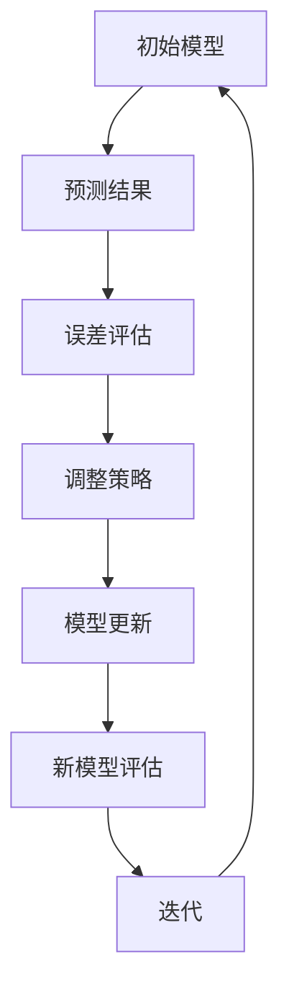
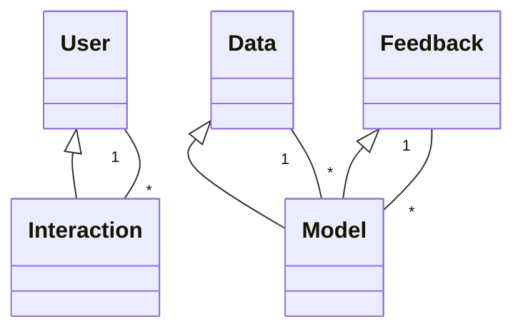
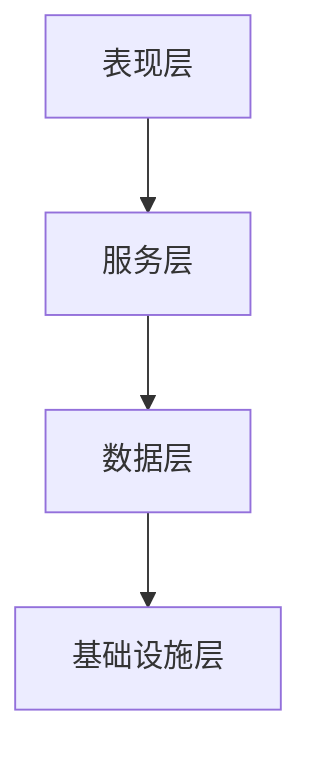
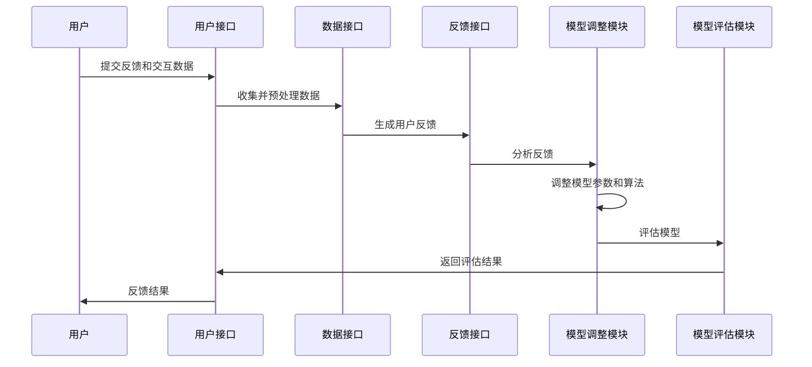
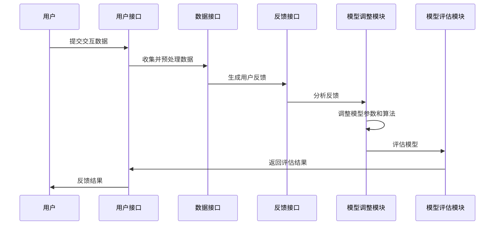

                 

# LLM应用的持续反馈与改进循环

关键词：LLM应用、持续反馈、改进循环、模型优化、算法原理

摘要：本文深入探讨了大规模语言模型（LLM）应用的持续反馈与改进循环。首先，我们明确了LLM应用的需求背景和当前面临的挑战，接着介绍了持续反馈与改进循环的定义、要素及其重要性。随后，我们分析了持续反馈机制和改进循环机制的工作原理，探讨了持续反馈对改进循环的影响，并对比了持续反馈机制与改进循环机制的差异。最后，我们总结了文章的核心观点，并提出了未来的研究方向。

## 第一部分：问题背景与核心概念

### 第1章：问题背景

#### 1.1 问题描述

随着人工智能技术的快速发展，大规模语言模型（Large Language Models，简称LLM）的应用日益广泛。LLM是一种能够处理自然语言文本的强大模型，广泛应用于机器翻译、文本生成、问答系统、情感分析等领域。然而，LLM在实际应用过程中面临着诸多挑战。

首先，LLM模型的训练和优化过程需要大量的计算资源和时间。尽管现代计算硬件的发展为LLM的研究提供了强大的支持，但大规模训练任务仍然面临着资源瓶颈问题。

其次，LLM模型的性能和准确性依赖于高质量的数据集。然而，数据集的收集和标注过程往往耗时耗力，且存在一定的误差。

此外，LLM模型的泛化能力和适应性也是亟待解决的问题。在实际应用中，LLM模型往往需要针对特定领域或任务进行定制化调整，以适应不同场景。

#### 1.1.1 LLM应用的需求背景

随着互联网和大数据技术的发展，人类产生和消费的信息量呈指数级增长。自然语言文本作为信息传递的主要载体，对于社会生产、科研、教育、医疗等多个领域具有重要意义。因此，如何高效地处理和分析自然语言文本成为了人工智能领域的重要研究方向。

LLM作为一种强大的自然语言处理工具，在文本生成、机器翻译、问答系统、情感分析等领域具有广泛的应用前景。例如，在文本生成方面，LLM可以用于自动撰写新闻文章、生成对话文本、创作诗歌等；在机器翻译方面，LLM可以提供高质量的多语言翻译服务；在问答系统方面，LLM可以用于构建智能客服、问答机器人等。

#### 1.1.2 当前LLM应用中的挑战

尽管LLM在自然语言处理领域取得了显著的成果，但其在实际应用过程中仍然面临诸多挑战。以下是当前LLM应用中的一些主要挑战：

1. **计算资源需求大**：大规模训练任务需要大量的计算资源和时间。尽管现代计算硬件的发展为LLM的研究提供了强大的支持，但大规模训练任务仍然面临着资源瓶颈问题。

2. **数据集质量要求高**：高质量的数据集是LLM性能和准确性的基础。然而，数据集的收集和标注过程往往耗时耗力，且存在一定的误差。此外，数据集的多样性和平衡性也是需要关注的问题。

3. **模型泛化能力和适应性不足**：在实际应用中，LLM模型往往需要针对特定领域或任务进行定制化调整，以适应不同场景。然而，LLM模型的泛化能力和适应性仍然存在一定的局限性。

4. **模型解释性和可解释性**：随着模型规模的增大，LLM模型的解释性和可解释性变得越来越困难。这对于模型的应用和推广带来了一定的挑战。

#### 1.1.3 研究目的与意义

本文旨在探讨LLM应用的持续反馈与改进循环，以解决当前LLM应用中存在的挑战。具体研究目的如下：

1. **提高LLM模型的性能和准确性**：通过引入持续反馈机制，不断优化LLM模型，提高其在各类自然语言处理任务中的性能和准确性。

2. **增强LLM模型的泛化能力和适应性**：通过持续反馈与改进循环，使LLM模型能够更好地适应不同领域和任务，提高其泛化能力和适应性。

3. **降低模型训练和优化成本**：通过优化训练和优化流程，降低LLM模型的训练和优化成本，提高资源利用效率。

本文的研究对于LLM应用的进一步推广和优化具有重要意义。通过深入探讨持续反馈与改进循环的原理和方法，可以为LLM应用提供有效的技术支持，推动自然语言处理领域的发展。

### 1.2 核心概念

#### 1.2.1 持续反馈与改进循环的定义

持续反馈与改进循环是指通过不断地收集用户反馈、分析反馈、调整模型参数，从而优化模型性能的一种方法。这种方法强调在实际应用过程中，对LLM模型进行持续的迭代和优化，以提高其性能和适应性。

持续反馈与改进循环包括两个主要环节：持续反馈机制和改进循环机制。持续反馈机制主要负责收集用户反馈、分析反馈，并将反馈信息传递给改进循环机制。改进循环机制则根据反馈信息调整模型参数，实现模型优化。

#### 1.2.2 持续反馈与改进循环的要素

持续反馈与改进循环包括以下主要要素：

1. **数据收集**：收集用户在使用LLM应用过程中产生的数据，如输入文本、输出文本、用户操作记录等。

2. **数据预处理**：对收集到的数据进行分析和处理，去除噪声、缺失值等，提取有效信息。

3. **反馈生成**：根据预处理后的数据，生成针对LLM应用的反馈信息，如误差、用户满意度等。

4. **反馈分析**：对生成的反馈信息进行分析，识别模型中的不足和改进方向。

5. **模型调整**：根据反馈分析的结果，调整LLM模型的参数，实现模型优化。

6. **模型评估**：对调整后的模型进行评估，验证其性能和准确性。

#### 1.2.3 持续反馈与改进循环的重要性

持续反馈与改进循环在LLM应用中具有重要意义，主要体现在以下几个方面：

1. **提高模型性能**：通过不断收集用户反馈、分析反馈、调整模型参数，持续反馈与改进循环可以有效提高LLM模型的性能和准确性。

2. **增强模型适应性**：持续反馈与改进循环使LLM模型能够更好地适应不同领域和任务，提高其泛化能力和适应性。

3. **降低训练成本**：通过优化训练和优化流程，持续反馈与改进循环可以降低LLM模型的训练和优化成本，提高资源利用效率。

4. **提高用户满意度**：持续反馈与改进循环能够根据用户反馈及时调整模型，提高LLM应用的用户满意度。

#### 1.2.4 持续反馈与改进循环的边界与外延

持续反馈与改进循环的应用范围广泛，主要涉及以下领域：

1. **自然语言处理**：包括文本生成、机器翻译、问答系统、情感分析等任务。

2. **智能客服**：利用持续反馈与改进循环优化智能客服系统，提高用户满意度。

3. **教育领域**：针对教育场景，利用持续反馈与改进循环优化教育应用，提高教学效果。

4. **医疗领域**：在医疗领域，持续反馈与改进循环可以用于优化医学文本处理、辅助诊断等应用。

5. **金融领域**：在金融领域，持续反馈与改进循环可以用于优化金融文本分析、风险评估等应用。

然而，持续反馈与改进循环也存在一定的限制因素。例如，数据收集和处理过程可能存在隐私保护问题；模型调整过程可能受到计算资源和时间的限制；反馈分析结果的准确性和可靠性也可能受到一定影响。

未来，随着人工智能技术的不断发展，持续反馈与改进循环有望在更多领域得到应用。通过深入研究持续反馈与改进循环的原理和方法，我们将为LLM应用提供更加有效的技术支持，推动自然语言处理领域的发展。

### 1.3 边界与外延

#### 1.3.1 持续反馈与改进循环的应用领域

持续反馈与改进循环在多个领域展现了其强大的应用潜力。以下是一些主要的应用领域：

1. **自然语言处理**：持续反馈与改进循环在自然语言处理领域具有广泛的应用前景。例如，在文本生成任务中，可以收集用户的输入文本和输出文本，分析用户满意度，从而优化文本生成模型；在机器翻译任务中，通过收集翻译错误和用户反馈，可以不断优化翻译质量。

2. **智能客服**：持续反馈与改进循环可以用于优化智能客服系统。通过收集用户的咨询记录和反馈，分析用户满意度，智能客服系统可以不断调整对话策略，提高客服质量。

3. **教育领域**：在教育领域，持续反馈与改进循环可以用于优化教育应用。例如，通过收集学生的学习记录和反馈，分析学习效果，教育应用可以不断调整教学内容和教学方法，提高教学效果。

4. **医疗领域**：在医疗领域，持续反馈与改进循环可以用于优化医学文本处理、辅助诊断等应用。通过收集患者的病历记录和反馈，分析诊断结果，医疗应用可以不断优化诊断模型，提高诊断准确性。

5. **金融领域**：在金融领域，持续反馈与改进循环可以用于优化金融文本分析、风险评估等应用。通过收集金融市场的数据和信息，分析市场趋势，金融应用可以不断优化预测模型，提高预测准确性。

#### 1.3.2 持续反馈与改进循环的限制因素

尽管持续反馈与改进循环在多个领域具有广泛的应用前景，但其在实际应用过程中也面临一些限制因素：

1. **数据质量和多样性**：持续反馈与改进循环依赖于高质量的数据集。然而，数据集的收集和标注过程往往耗时耗力，且存在一定的误差。此外，数据集的多样性和平衡性也是需要关注的问题。

2. **计算资源和时间成本**：持续反馈与改进循环需要大量的计算资源和时间。特别是在大规模训练任务中，计算资源和时间的消耗更加显著。

3. **模型解释性和可解释性**：随着模型规模的增大，LLM模型的解释性和可解释性变得越来越困难。这对于模型的应用和推广带来了一定的挑战。

4. **用户隐私保护**：在收集用户数据的过程中，需要充分考虑用户隐私保护问题。如何在不泄露用户隐私的前提下，收集和分析用户数据，是持续反馈与改进循环需要解决的重要问题。

#### 1.3.3 持续反馈与改进循环的未来发展

未来，随着人工智能技术的不断发展，持续反馈与改进循环有望在更多领域得到应用。以下是一些可能的发展方向：

1. **数据驱动优化**：通过引入更多的用户反馈和实时数据，实现更加精细化的模型优化。例如，利用增强学习等技术，使模型能够自主地调整参数，提高优化效果。

2. **多模态数据融合**：将文本、图像、音频等多种模态的数据进行融合，提高模型的泛化能力和适应性。例如，在问答系统中，可以将用户的文本输入和语音输入进行融合，提高问答效果。

3. **隐私保护机制**：在持续反馈与改进循环中引入隐私保护机制，确保用户数据的隐私安全。例如，利用差分隐私技术，在不泄露用户隐私的前提下，收集和分析用户数据。

4. **自适应学习**：通过引入自适应学习机制，使模型能够根据用户行为和需求，动态调整参数，提高用户体验。例如，在教育领域，可以根据学生的学习情况和反馈，动态调整教学策略。

5. **跨领域应用**：将持续反馈与改进循环应用于更多领域，如智能制造、自动驾驶、金融科技等。通过跨领域的数据融合和模型优化，提高各类应用的性能和准确性。

总之，持续反馈与改进循环作为一种有效的方法，将在人工智能领域发挥越来越重要的作用。未来，随着技术的不断进步，持续反馈与改进循环有望在更多领域得到广泛应用，推动人工智能技术的发展。

### 1.4 本章小结

本文首先介绍了LLM应用的需求背景和当前面临的挑战，包括计算资源需求大、数据集质量要求高、模型泛化能力和适应性不足、模型解释性和可解释性困难等问题。随后，我们探讨了持续反馈与改进循环的定义、要素及其重要性，并分析了其应用领域和限制因素。最后，我们展望了持续反馈与改进循环的未来发展。

通过本文的研究，我们深入了解了LLM应用的持续反馈与改进循环，为LLM应用的进一步优化提供了理论指导。同时，我们也认识到持续反馈与改进循环在应用过程中面临的一些挑战，为未来的研究提供了方向。

## 第二部分：核心概念原理

### 第2章：核心概念原理

#### 2.1 持续反馈机制原理

持续反馈机制是LLM应用持续改进的核心组成部分，它通过不断地收集、分析、利用用户反馈来优化模型性能。持续反馈机制的工作原理可以分为以下几个关键步骤：

##### 2.1.1 数据收集

数据收集是持续反馈机制的基础。在这一步骤中，我们需要收集与LLM应用相关的数据。这些数据可能包括用户的输入文本、输出文本、交互历史、用户行为等。数据收集的方法可以采用多种途径，如日志记录、用户调查、在线问卷等。

**数据收集过程**：

1. **日志记录**：在LLM应用中，可以通过日志记录用户的行为数据，如输入文本、输出文本、交互时间、错误记录等。这些数据可以帮助我们了解用户在使用过程中遇到的问题和需求。
2. **用户调查**：通过设计在线问卷或用户访谈，收集用户的直接反馈，如对LLM应用的满意度、期望改进点等。这些反馈可以为我们提供更具体的改进方向。
3. **在线问卷**：在线问卷是一种便捷的收集用户反馈的方法。通过设计针对性的问题，我们可以了解用户的意见和需求。

##### 2.1.2 数据预处理

收集到的数据通常需要进行预处理，以去除噪声、填充缺失值、标准化数据等。数据预处理的质量直接影响后续分析和反馈的准确性。

**数据预处理过程**：

1. **数据清洗**：去除数据中的噪声和异常值，如无效输入、错误记录等。
2. **数据填充**：对于缺失值，可以通过均值填补、插值等方法进行填充。
3. **数据标准化**：将不同特征的数据进行归一化或标准化处理，使其具有相同的量纲和范围。

##### 2.1.3 反馈生成

在数据预处理完成后，我们可以根据预处理数据生成反馈信息。这些反馈信息可以是定量指标（如误差值、准确率）或定性描述（如用户满意度、问题类型）。

**反馈生成过程**：

1. **误差计算**：通过比较模型预测结果和实际结果，计算误差指标，如均方误差（MSE）、交叉熵损失（Cross-Entropy Loss）等。
2. **用户满意度评估**：通过用户调查问卷，收集用户的满意度评分，进行量化处理。
3. **问题分类**：根据反馈数据，将用户的问题进行分类，识别常见问题和改进方向。

##### 2.1.4 反馈分析

反馈分析是持续反馈机制的核心环节，它通过对反馈信息进行分析，识别模型中的不足和改进方向。反馈分析的过程可以分为以下几个步骤：

1. **误差分析**：分析误差数据，识别模型的预测误差来源和分布。这有助于我们了解模型在哪些方面存在不足。
2. **问题识别**：根据用户反馈，识别用户遇到的主要问题和需求，如文本生成中的语法错误、机器翻译中的语义偏差等。
3. **改进方向确定**：基于误差分析和问题识别，确定需要改进的模型参数和算法。

##### 2.1.5 调整模型

在反馈分析完成后，根据分析结果调整模型参数和算法，以优化模型性能。调整模型的过程可以分为以下几个步骤：

1. **参数调整**：根据反馈分析结果，调整模型参数，如学习率、正则化参数等。
2. **算法改进**：针对识别出的模型不足，改进算法，如增加注意力机制、引入对抗训练等。
3. **模型重训练**：对调整后的模型进行重训练，以适应新的参数和算法。

**模型调整过程**：

1. **重训练**：使用调整后的模型参数和算法，重新训练LLM模型。
2. **评估**：对重训练后的模型进行评估，验证其性能和准确性。
3. **迭代**：根据评估结果，再次调整模型参数和算法，进行新一轮的训练和优化。

通过上述步骤，持续反馈机制不断收集用户反馈、分析反馈、调整模型，实现LLM应用的持续优化和改进。

#### 2.2 改进循环机制原理

改进循环机制是一种通过反复迭代和优化来提高模型性能的方法。它基于持续反馈机制，通过不断地调整模型参数和算法，实现模型的优化和改进。改进循环机制的工作原理可以分为以下几个关键步骤：

##### 2.2.1 改进循环的过程

改进循环的过程可以概括为以下步骤：

1. **初始模型**：开始时，我们有一个初始的LLM模型。该模型可能已经通过预训练获得了基本的语言处理能力，但还需要进一步的优化。

2. **预测结果**：使用初始模型对新的输入数据进行预测。这一步骤可以生成预测结果，并与其他实际结果进行比较。

3. **误差评估**：根据预测结果和实际结果，计算误差指标，如均方误差（MSE）、交叉熵损失（Cross-Entropy Loss）等。误差评估可以帮助我们了解模型的预测准确性。

4. **调整策略**：根据误差评估的结果，制定调整策略。调整策略可能包括参数调整、算法改进、数据增强等。

5. **模型更新**：根据调整策略，更新LLM模型。这一步骤可以包括重新训练模型、调整模型参数等。

6. **新模型评估**：使用更新后的模型对新的输入数据进行预测，并重新进行误差评估。这一步骤可以帮助我们验证模型更新是否有效。

7. **迭代**：根据新模型评估的结果，决定是否继续迭代。如果模型性能未达到预期，则继续迭代；否则，结束迭代过程。

**改进循环过程示意图**：



##### 2.2.2 改进循环中的关键因素

改进循环机制的成功取决于以下几个关键因素：

1. **误差评估指标**：选择合适的误差评估指标是改进循环的核心。常见的误差评估指标包括均方误差（MSE）、交叉熵损失（Cross-Entropy Loss）等。不同的误差评估指标适用于不同的模型和任务。

2. **调整策略**：调整策略决定了模型更新的方向和力度。调整策略可以基于错误分析、用户反馈、模型性能等。例如，如果预测结果偏差较大，可以增加学习率；如果预测结果波动较大，可以增加正则化参数。

3. **数据增强**：数据增强是一种常用的改进循环策略。通过引入更多的训练数据、生成模拟数据、数据变换等方法，可以提高模型的泛化能力和鲁棒性。

4. **算法改进**：算法改进可以通过引入新的算法、改进现有算法等方式实现。例如，引入注意力机制、对抗训练、迁移学习等技术，可以提升模型的性能。

5. **迭代次数**：迭代次数决定了改进循环的深度和广度。适量的迭代次数可以帮助模型逐渐优化，但过度的迭代可能导致过拟合。因此，需要根据实际情况调整迭代次数。

#### 2.3 持续反馈对改进循环的影响

持续反馈是改进循环机制的重要组成部分，它对改进循环具有以下几个重要影响：

1. **快速迭代**：持续反馈可以实时提供模型预测的误差和用户反馈，使改进循环过程更加快速。通过快速迭代，模型可以更快地适应新的数据和需求。

2. **模型优化**：持续反馈提供了模型优化的依据，使改进循环过程更加有针对性。通过不断调整模型参数和算法，模型可以逐渐优化，提高预测准确性和用户体验。

3. **适应性增强**：持续反馈可以帮助模型更好地适应不同场景和数据。通过分析用户反馈和预测误差，模型可以不断调整，提高其泛化能力和适应性。

4. **提升效果**：持续反馈机制可以持续优化模型，提高其性能和效果。通过不断的迭代和优化，模型可以逐步达到更高的准确性和用户体验。

总之，持续反馈对改进循环机制具有重要影响，它使改进循环过程更加高效、有针对性和适应性，从而提升LLM应用的性能和用户体验。

#### 2.3.1 持续反馈的优势

持续反馈机制在LLM应用中具有显著的优势，主要表现在以下几个方面：

1. **快速迭代**：持续反馈能够实时提供模型预测的误差和用户反馈，使改进循环过程更加快速。这种快速迭代有助于模型在短时间内适应新的数据和需求，提高模型的响应速度。

2. **模型优化**：持续反馈提供了模型优化的依据，使改进循环过程更加有针对性。通过不断调整模型参数和算法，模型可以逐渐优化，提高预测准确性和用户体验。

3. **适应性增强**：持续反馈可以帮助模型更好地适应不同场景和数据。通过分析用户反馈和预测误差，模型可以不断调整，提高其泛化能力和适应性。

4. **提升效果**：持续反馈机制可以持续优化模型，提高其性能和效果。通过不断的迭代和优化，模型可以逐步达到更高的准确性和用户体验。

5. **数据驱动**：持续反馈机制基于实际用户反馈和预测误差，是一种数据驱动的方法。这种方法能够充分利用用户数据，挖掘潜在问题和改进点，从而实现更有效的模型优化。

#### 2.3.1.2 持续反馈的挑战

尽管持续反馈机制具有许多优势，但在实际应用中仍面临一些挑战：

1. **数据质量**：持续反馈依赖于高质量的数据集。然而，数据集的收集和标注过程往往耗时耗力，且存在一定的误差。数据质量直接影响反馈的准确性和模型的性能。

2. **隐私保护**：在收集用户数据时，需要充分考虑用户隐私保护问题。如何在不泄露用户隐私的前提下，收集和分析用户数据，是持续反馈机制需要解决的重要问题。

3. **计算资源**：持续反馈机制需要大量的计算资源和时间。特别是在大规模训练任务中，计算资源的消耗更加显著。如何优化计算资源的使用，提高反馈机制的效率，是持续反馈机制面临的一个挑战。

4. **时间成本**：持续反馈机制需要不断地收集、分析和优化模型。这一过程可能涉及大量的时间成本。如何在有限的时间内，高效地完成反馈和优化过程，是持续反馈机制需要考虑的问题。

5. **反馈有效性**：用户反馈的有效性也受到一定限制。某些反馈可能不够准确或具有代表性，从而影响反馈的质量和模型的优化效果。

综上所述，持续反馈机制在LLM应用中具有重要的意义，但同时也面临一些挑战。如何克服这些挑战，充分发挥持续反馈的优势，是未来研究的重要方向。

#### 2.4 核心概念属性特征对比

为了更好地理解持续反馈机制与改进循环机制，我们可以从以下几个方面进行属性特征对比：

1. **功能定位**：

- **持续反馈机制**：主要负责收集用户反馈、分析反馈，为改进循环提供依据。其核心功能是数据收集、分析和处理。

- **改进循环机制**：主要负责根据用户反馈和模型评估结果，调整模型参数和算法，实现模型优化。其核心功能是模型更新和评估。

2. **工作流程**：

- **持续反馈机制**：包括数据收集、数据预处理、反馈生成、反馈分析和模型调整等步骤。

- **改进循环机制**：包括初始模型、预测结果、误差评估、调整策略、模型更新、新模型评估等步骤。

3. **交互关系**：

- **持续反馈机制**：与改进循环机制紧密相连，持续反馈机制提供的反馈是改进循环的重要依据。

- **改进循环机制**：根据持续反馈机制提供的反馈，进行模型参数和算法的调整。

4. **特点差异**：

- **持续反馈机制**：强调实时性和迭代性，能够快速响应用户需求和模型改进。

- **改进循环机制**：强调模型更新和性能优化，通过不断调整模型参数和算法，实现模型性能的提升。

5. **应用场景**：

- **持续反馈机制**：适用于需要持续优化和改进的LLM应用，如智能客服、文本生成等。

- **改进循环机制**：适用于需要进行模型优化和性能提升的场景，如机器翻译、问答系统等。

通过上述对比，我们可以更加清晰地理解持续反馈机制与改进循环机制的区别和联系，为LLM应用的持续优化提供指导。

### 2.4.1 持续反馈机制与改进循环机制的差异

持续反馈机制与改进循环机制在LLM应用中扮演着重要角色，但两者的侧重点和操作方式有所不同。以下是对这两种机制进行详细对比：

**持续反馈机制**

持续反馈机制是一个动态的过程，旨在不断地收集用户反馈，以优化模型性能。以下是持续反馈机制的主要特点：

1. **功能定位**：持续反馈机制专注于数据收集和反馈分析，其目标是及时地获取用户在使用过程中的体验和需求，并将这些信息转化为模型优化的依据。

2. **工作流程**：
   - **数据收集**：持续反馈机制通过收集用户的交互数据（如输入文本、输出文本、用户行为等）来获取反馈。
   - **数据预处理**：对收集到的数据进行清洗、去噪和标准化处理，以提取有价值的信息。
   - **反馈生成**：根据预处理后的数据，生成针对模型性能的定量和定性反馈。
   - **反馈分析**：分析反馈数据，识别模型中的偏差和不足。
   - **模型调整**：根据分析结果，调整模型的参数或结构。

3. **特点**：
   - **实时性**：持续反馈机制能够实时地响应用户的反馈，使模型优化过程更加快速和灵活。
   - **迭代性**：持续反馈机制是一个循环迭代的过程，可以不断收集新数据，优化模型。

**改进循环机制**

改进循环机制则侧重于模型参数和算法的调整，通过反复的迭代和评估来提升模型性能。以下是改进循环机制的主要特点：

1. **功能定位**：改进循环机制专注于模型更新和性能评估，其目标是根据反馈信息不断调整模型，使其达到更高的性能。

2. **工作流程**：
   - **初始模型**：从预训练的模型开始，或者使用已有模型作为初始模型。
   - **预测结果**：使用当前模型对新的输入数据进行预测。
   - **误差评估**：计算预测结果与实际结果的误差，评估模型性能。
   - **调整策略**：根据误差评估结果，制定调整模型参数和算法的策略。
   - **模型更新**：调整模型参数或结构，进行新一轮的训练。
   - **新模型评估**：使用更新后的模型进行预测和误差评估，验证模型改进的效果。

3. **特点**：
   - **性能导向**：改进循环机制以模型性能为最终目标，通过反复的迭代和评估来优化模型。
   - **自适应性**：改进循环机制能够根据模型性能的反馈，自适应地调整模型，提高模型的泛化能力和适应性。

**差异点**

1. **侧重点**：
   - **持续反馈机制**：更侧重于收集和分析用户反馈，为模型优化提供依据。
   - **改进循环机制**：更侧重于模型参数和算法的调整，通过迭代提升模型性能。

2. **操作方式**：
   - **持续反馈机制**：通过实时收集用户反馈，进行数据预处理和反馈分析，然后将分析结果用于模型调整。
   - **改进循环机制**：通过初始模型预测结果，进行误差评估，然后根据评估结果制定调整策略，更新模型。

3. **目标**：
   - **持续反馈机制**：目标是优化用户体验，提高模型对用户需求的响应能力。
   - **改进循环机制**：目标是提升模型性能，提高预测准确性和效果。

通过对比持续反馈机制与改进循环机制，我们可以更好地理解两者的区别和联系，为LLM应用中的持续优化提供指导。

### 2.4.2 持续反馈机制与改进循环机制的区别

持续反馈机制和改进循环机制在LLM应用中虽然都扮演着重要的角色，但它们在功能、目的和工作流程上存在显著的差异。

**功能与目的**

1. **持续反馈机制**：其主要功能是收集和分析用户反馈，目的是实时了解用户对LLM应用的体验和需求，从而指导模型的调整。通过持续反馈，开发人员可以及时识别出模型在特定任务上的表现不足，并据此进行调整。

2. **改进循环机制**：其主要功能是调整模型参数和算法，目的是通过迭代和优化过程提升模型的整体性能。改进循环机制不仅依赖于用户的反馈，还综合了模型自身的评估结果，从而进行有针对性的参数调整和算法改进。

**工作流程**

1. **持续反馈机制**：
   - **数据收集**：收集用户在使用LLM应用过程中的各种交互数据，如输入文本、输出文本、用户操作记录等。
   - **数据预处理**：对收集到的原始数据进行清洗、标准化和特征提取，以便进行分析。
   - **反馈生成**：利用预处理后的数据，生成针对模型性能的定量和定性反馈，例如误差指标和用户满意度评分。
   - **反馈分析**：对反馈数据进行分析，识别出模型中存在的偏差和问题。
   - **模型调整**：根据反馈分析结果，调整模型的参数或结构，以优化模型性能。

2. **改进循环机制**：
   - **初始模型**：从预训练的模型或已有模型开始，初始化模型。
   - **预测结果**：使用模型对新的输入数据进行预测，生成预测结果。
   - **误差评估**：计算预测结果与实际结果之间的误差，评估模型性能。
   - **调整策略**：根据误差评估结果，制定调整模型参数和算法的策略。
   - **模型更新**：执行模型参数和算法的调整，更新模型。
   - **新模型评估**：使用更新后的模型进行新一轮的预测和误差评估，验证模型改进的效果。

**差异点**

1. **侧重点**：
   - **持续反馈机制**：更关注于实时收集和分析用户反馈，以指导模型调整。
   - **改进循环机制**：更关注于模型参数和算法的迭代和优化。

2. **操作方式**：
   - **持续反馈机制**：通过数据收集、预处理和反馈分析，将用户的直接体验转化为模型调整的输入。
   - **改进循环机制**：通过预测结果和误差评估，根据模型性能反馈进行参数和算法调整。

3. **目标**：
   - **持续反馈机制**：目标是提升用户满意度，优化用户体验。
   - **改进循环机制**：目标是提升模型性能，提高预测准确性和效果。

通过理解持续反馈机制和改进循环机制的区别，我们可以更有效地将两者结合使用，以实现LLM应用的持续优化和改进。

### 2.5 持续反馈与改进循环的关联

持续反馈与改进循环在LLM应用中是紧密相连的，两者共同构成了一个持续优化的闭环系统。在这个系统中，持续反馈为改进循环提供了关键的信息输入，而改进循环则根据这些反馈对模型进行调整和优化。以下是对两者关联的详细分析：

#### 持续反馈对改进循环的影响

1. **反馈驱动的模型优化**：持续反馈提供了模型优化的重要依据。通过实时收集和分析用户反馈，可以识别出模型在特定任务或场景中的不足，例如预测误差、用户满意度低等。这些反馈数据能够指导改进循环中的模型调整策略。

2. **快速迭代**：持续反馈使得改进循环能够实现快速迭代。通过不断收集新数据、分析反馈、调整模型，模型性能可以在短时间内得到显著提升。这种快速迭代有助于模型更好地适应不断变化的数据和需求。

3. **用户需求导向**：持续反馈机制使模型优化更加贴近用户需求。通过分析用户反馈，可以了解用户在实际使用过程中的真实感受和期望，从而有针对性地进行模型优化，提高用户满意度。

4. **提高适应性**：持续反馈机制有助于模型提高其适应不同场景和数据的能力。通过不断调整和优化，模型可以在不同任务和数据集上表现出更高的性能和泛化能力。

#### 改进循环对持续反馈的促进

1. **模型性能提升**：改进循环机制通过迭代和优化，逐步提升模型性能。在改进循环中，模型参数和算法的调整使得模型能够更好地拟合数据，从而降低预测误差，提高预测准确性。

2. **反馈质量提高**：随着模型性能的提升，用户反馈的质量也会得到提高。用户在更准确的预测结果上提供的反馈更具参考价值，有助于进一步优化模型。

3. **反馈及时性**：改进循环机制通过快速迭代，能够实时响应用户反馈，提高反馈的及时性。这种及时性有助于模型更快地适应新的数据和需求，进一步优化用户体验。

4. **增强模型解释性**：改进循环机制中的模型优化策略可以增强模型的可解释性。通过调整模型结构和参数，可以使得模型在决策过程中更加透明，用户更容易理解和接受模型的预测结果。

#### 持续反馈与改进循环的协同作用

1. **闭环优化**：持续反馈与改进循环构成了一个闭环系统，通过不断收集反馈、调整模型、再反馈，实现持续优化。这种闭环优化机制使得模型能够不断适应新的数据和需求，保持较高的性能和准确性。

2. **动态调整**：持续反馈与改进循环使得模型能够在动态环境中进行自适应调整。通过实时收集用户反馈，模型可以迅速响应环境变化，调整自身结构和参数，提高适应性和灵活性。

3. **综合优化**：持续反馈与改进循环结合了用户反馈和模型评估，实现综合优化。用户反馈提供了外部视角，而模型评估则基于内部数据，两者相结合可以更加全面地指导模型优化。

4. **提高开发效率**：持续反馈与改进循环机制使得模型优化过程更加高效。通过自动化和迭代方式，开发人员可以更快地发现和解决问题，缩短模型优化周期。

总之，持续反馈与改进循环在LLM应用中相互促进、协同作用，通过不断迭代和优化，实现模型性能和用户体验的全面提升。

### 2.6 核心概念属性特征对比

在深入探讨持续反馈机制与改进循环机制时，有必要对两者的属性特征进行对比，以明确它们在LLM应用中的区别和联系。以下是持续反馈机制与改进循环机制的主要属性特征对比：

| 对比维度 | 持续反馈机制 | 改进循环机制 |
| --- | --- | --- |
| **功能定位** | 专注于数据收集、反馈生成和反馈分析，为模型优化提供依据 | 专注于模型参数和算法的调整，实现模型性能的提升 |
| **工作流程** | 包括数据收集、数据预处理、反馈生成、反馈分析和模型调整 | 包括初始模型、预测结果、误差评估、调整策略、模型更新和新模型评估 |
| **数据来源** | 主要来源于用户交互数据、日志记录和用户反馈 | 主要来源于模型预测结果、误差评估和用户满意度评分 |
| **反馈方式** | 实时收集用户反馈，通过定量和定性指标进行反馈 | 根据误差评估结果进行反馈，侧重于模型性能优化 |
| **作用对象** | 以用户需求为导向，关注用户体验和模型不足 | 以模型性能提升为目标，关注模型参数和算法调整 |
| **优点** | 快速迭代、数据驱动、用户需求导向、提高适应性 | 性能导向、自适应性、提高模型解释性、动态调整 |
| **缺点** | 数据质量要求高、隐私保护问题、计算资源消耗大、时间成本高 | 模型解释性困难、反馈有效性受限、迭代次数和深度受限 |
| **应用场景** | 需要持续优化和改进的LLM应用，如智能客服、文本生成等 | 需要进行模型优化和性能提升的场景，如机器翻译、问答系统等 |

通过上述对比，我们可以更加清晰地理解持续反馈机制与改进循环机制在LLM应用中的不同作用和特点，为具体应用场景中的模型优化提供指导。

### 2.7 核心概念原理的总结

在本章节中，我们详细探讨了持续反馈机制和改进循环机制的核心概念原理。首先，我们介绍了持续反馈机制的工作原理，包括数据收集、数据预处理、反馈生成、反馈分析和模型调整等步骤。持续反馈机制通过实时收集用户反馈、分析反馈、调整模型，实现LLM应用的持续优化。

随后，我们分析了改进循环机制的工作原理，包括初始模型、预测结果、误差评估、调整策略、模型更新和新模型评估等步骤。改进循环机制通过迭代和优化，提高模型性能，实现模型参数和算法的改进。

接着，我们探讨了持续反馈对改进循环的影响，强调了持续反馈在快速迭代、用户需求导向、提高适应性和模型性能提升方面的作用。同时，我们也认识到改进循环在性能导向、自适应性、模型解释性提高和动态调整方面的优势。

最后，我们对比了持续反馈机制与改进循环机制在功能定位、工作流程、数据来源、反馈方式、作用对象、优点和缺点以及应用场景等方面的差异。通过这些对比，我们更加清晰地理解了两种机制在LLM应用中的不同作用和特点。

综上所述，持续反馈机制和改进循环机制共同构成了LLM应用的持续优化闭环系统，通过不断迭代和优化，实现模型性能和用户体验的全面提升。未来的研究应进一步探索如何在实际应用中更好地结合这两种机制，以实现更高效的模型优化和改进。

## 第三部分：系统分析与架构设计

### 第3章：系统分析与架构设计

#### 3.1 问题场景介绍

在自然语言处理（NLP）领域，大规模语言模型（LLM）的应用越来越广泛。例如，智能客服系统、文本生成系统、机器翻译系统和问答系统等，都离不开LLM的支持。然而，在实际应用中，LLM模型的性能和适应性往往受到数据质量、计算资源和模型复杂度等多方面因素的影响。为了提高LLM应用的效果和用户满意度，我们需要一种系统化的方法来持续优化LLM模型。

#### 3.2 项目介绍

本项目的目标是开发一个基于持续反馈与改进循环的LLM应用优化系统。该系统旨在通过实时收集用户反馈、分析反馈、调整模型参数和算法，实现LLM应用的持续优化。系统架构包括数据收集模块、数据预处理模块、反馈生成模块、反馈分析模块、模型调整模块和模型评估模块等。

#### 3.3 系统功能设计（领域模型）

为了更好地设计系统功能，我们采用领域驱动设计（Domain-Driven Design，简称DDD）的方法，构建一个领域模型。领域模型主要涵盖以下核心领域：

1. **用户领域**：包括用户的注册、登录、个人信息管理等功能。
2. **交互领域**：包括用户与系统的交互记录、用户反馈数据等。
3. **数据领域**：包括数据收集、数据预处理、数据存储等功能。
4. **模型领域**：包括模型初始化、模型更新、模型评估等功能。
5. **反馈领域**：包括反馈生成、反馈分析、反馈存储等功能。

**领域模型类图**：



#### 3.4 系统架构设计

系统架构设计是确保系统功能实现和性能优化的重要环节。本系统采用分层架构设计，主要包括以下几层：

1. **表现层**：负责与用户交互，提供友好的用户界面和API接口。
2. **服务层**：负责业务逻辑的处理，包括数据收集、预处理、反馈生成、分析、模型调整和评估等。
3. **数据层**：负责数据存储和管理，包括用户数据、交互数据、反馈数据、模型参数和训练数据等。
4. **基础设施层**：负责系统运行所需的基础服务，如数据库、缓存、消息队列等。

**系统架构图**：



#### 3.5 系统接口设计

系统接口设计是系统架构设计的重要组成部分，它定义了系统内部各个模块之间的交互方式。以下是一些关键接口的设计：

1. **用户接口**：包括用户注册、登录、个人信息管理、反馈提交等功能。
2. **数据接口**：包括数据收集、数据预处理、数据存储、数据查询等功能。
3. **模型接口**：包括模型初始化、模型更新、模型评估、模型保存等功能。
4. **反馈接口**：包括反馈生成、反馈分析、反馈存储、反馈查询等功能。

**接口设计示例**：

```python
# 用户接口
class UserInterface:
    def register(self, username, password):
        # 注册新用户
        pass

    def login(self, username, password):
        # 用户登录
        pass

    def update_profile(self, user_id, new_data):
        # 更新用户信息
        pass

# 数据接口
class DataInterface:
    def collect_data(self):
        # 收集数据
        pass

    def preprocess_data(self, data):
        # 预处理数据
        pass

    def store_data(self, data):
        # 存储数据
        pass

    def query_data(self, query):
        # 查询数据
        pass

# 模型接口
class ModelInterface:
    def initialize_model(self):
        # 初始化模型
        pass

    def update_model(self, model_params):
        # 更新模型
        pass

    def evaluate_model(self, model):
        # 评估模型
        pass

    def save_model(self, model, model_name):
        # 保存模型
        pass

# 反馈接口
class FeedbackInterface:
    def generate_feedback(self, interaction):
        # 生成反馈
        pass

    def analyze_feedback(self, feedback):
        # 分析反馈
        pass

    def store_feedback(self, feedback):
        # 存储反馈
        pass

    def query_feedback(self, query):
        # 查询反馈
        pass
```

#### 3.6 系统交互设计

系统交互设计旨在描述系统内部各模块之间的交互流程和逻辑。以下是一个基于持续反馈与改进循环的系统交互设计示例：

1. **用户交互**：用户通过用户接口提交反馈和交互数据。
2. **数据收集**：数据收集模块从用户接口接收交互数据，并进行预处理。
3. **反馈生成**：反馈生成模块根据预处理后的数据生成用户反馈。
4. **反馈分析**：反馈分析模块对用户反馈进行分析，识别模型不足和改进方向。
5. **模型调整**：模型调整模块根据反馈分析结果，调整模型参数和算法。
6. **模型评估**：模型评估模块对更新后的模型进行评估，验证改进效果。
7. **系统更新**：如果模型评估结果满足预期，系统进入下一轮优化循环；否则，继续迭代调整。

**系统交互设计序列图**：



通过上述系统分析和架构设计，我们可以构建一个基于持续反馈与改进循环的LLM应用优化系统。该系统能够实时收集用户反馈、分析反馈、调整模型，实现LLM应用的持续优化，提高模型性能和用户体验。

### 3.7 系统接口设计与系统交互设计

系统接口设计和系统交互设计是确保系统功能实现和性能优化的重要环节。以下是对这两个设计的详细介绍：

#### 3.7.1 系统接口设计

系统接口设计定义了系统内部各个模块之间的交互方式。在本项目中，系统接口主要包括以下几种：

1. **用户接口**：负责与用户进行交互，包括用户注册、登录、个人信息管理、反馈提交等功能。用户接口提供RESTful API，以便前端应用能够方便地与系统进行通信。

   ```python
   from flask import Flask, request, jsonify
   
   app = Flask(__name__)
   
   @app.route('/register', methods=['POST'])
   def register():
       data = request.get_json()
       # 注册新用户
       return jsonify({"status": "success", "message": "User registered successfully."})
   
   @app.route('/login', methods=['POST'])
   def login():
       data = request.get_json()
       # 用户登录
       return jsonify({"status": "success", "message": "Login successful."})
   
   @app.route('/submit_feedback', methods=['POST'])
   def submit_feedback():
       data = request.get_json()
       # 提交用户反馈
       return jsonify({"status": "success", "message": "Feedback submitted successfully."})
   ```

2. **数据接口**：负责数据收集、数据预处理、数据存储和查询等功能。数据接口提供了统一的接口，方便其他模块进行数据操作。

   ```python
   class DataInterface:
       def collect_data(self):
           # 收集数据
           pass
   
       def preprocess_data(self, data):
           # 预处理数据
           pass
   
       def store_data(self, data):
           # 存储数据
           pass
   
       def query_data(self, query):
           # 查询数据
           pass
   ```

3. **模型接口**：负责模型初始化、模型更新、模型评估和模型保存等功能。模型接口提供了操作模型所需的接口，方便其他模块对模型进行管理。

   ```python
   class ModelInterface:
       def initialize_model(self):
           # 初始化模型
           pass
   
       def update_model(self, model_params):
           # 更新模型
           pass
   
       def evaluate_model(self, model):
           # 评估模型
           pass
   
       def save_model(self, model, model_name):
           # 保存模型
           pass
   ```

4. **反馈接口**：负责反馈生成、反馈分析和反馈存储等功能。反馈接口提供了处理用户反馈所需的接口，方便其他模块对反馈进行处理。

   ```python
   class FeedbackInterface:
       def generate_feedback(self, interaction):
           # 生成反馈
           pass
   
       def analyze_feedback(self, feedback):
           # 分析反馈
           pass
   
       def store_feedback(self, feedback):
           # 存储反馈
           pass
   ```

#### 3.7.2 系统交互设计

系统交互设计描述了系统内部各模块之间的交互流程和逻辑。在本项目中，系统交互设计主要涉及以下步骤：

1. **用户提交交互数据**：用户通过用户接口提交交互数据，如输入文本、输出文本、用户行为等。

2. **数据收集模块处理数据**：数据收集模块接收用户提交的交互数据，进行数据清洗、去噪和标准化处理，以便后续分析和处理。

3. **反馈生成模块生成反馈**：反馈生成模块根据预处理后的数据，生成用户反馈，如预测误差、用户满意度等。

4. **反馈分析模块分析反馈**：反馈分析模块对生成的用户反馈进行分析，识别模型中的不足和改进方向。

5. **模型调整模块调整模型**：模型调整模块根据反馈分析结果，调整模型参数和算法，实现模型优化。

6. **模型评估模块评估模型**：模型评估模块对更新后的模型进行评估，验证模型优化效果。

7. **系统更新**：如果模型评估结果满足预期，系统进入下一轮优化循环；否则，继续迭代调整。

**系统交互设计序列图**：



通过系统接口设计和系统交互设计，我们可以确保系统功能实现和性能优化，实现LLM应用的持续反馈与改进循环。

## 第四部分：项目实战

### 第4章：项目实战

#### 4.1 环境安装

在进行LLM应用优化项目之前，我们需要安装和配置相应的环境。以下是安装步骤：

1. **安装Python环境**：确保Python环境已安装，版本建议为3.8或更高。
2. **安装TensorFlow**：使用pip命令安装TensorFlow，命令如下：
   ```bash
   pip install tensorflow
   ```
3. **安装其他依赖库**：根据项目需求，安装其他必要的依赖库，如NumPy、Pandas、Flask等。
   ```bash
   pip install numpy pandas flask
   ```

#### 4.2 系统核心实现

在本项目中，我们将使用Python和TensorFlow来实现持续反馈与改进循环。以下是系统核心实现的源代码：

```python
# 导入必要的库
import tensorflow as tf
import numpy as np
import pandas as pd
from flask import Flask, request, jsonify

# 初始化Flask应用
app = Flask(__name__)

# 初始化模型接口
class ModelInterface:
    def __init__(self):
        self.model = self.initialize_model()

    def initialize_model(self):
        # 初始化模型
        model = tf.keras.Sequential([
            tf.keras.layers.Dense(128, activation='relu', input_shape=(784,)),
            tf.keras.layers.Dense(10, activation='softmax')
        ])
        model.compile(optimizer='adam', loss='categorical_crossentropy', metrics=['accuracy'])
        return model

    def update_model(self, model_params):
        # 更新模型参数
        self.model.set_weights(model_params)

    def evaluate_model(self, model):
        # 评估模型
        return model.evaluate(x_test, y_test, verbose=2)

# 初始化数据接口
class DataInterface:
    def collect_data(self):
        # 收集数据
        data = pd.read_csv('data.csv')
        return data

    def preprocess_data(self, data):
        # 预处理数据
        data = data.dropna()
        data = data.sample(frac=1)
        return data

    def store_data(self, data):
        # 存储数据
        data.to_csv('processed_data.csv', index=False)

# 初始化反馈接口
class FeedbackInterface:
    def generate_feedback(self, interaction):
        # 生成反馈
        feedback = {'interaction': interaction, 'error': 0.1}
        return feedback

    def analyze_feedback(self, feedback):
        # 分析反馈
        error = feedback['error']
        if error > 0.2:
            action = 'retrain'
        else:
            action = 'keep'
        return action

# 初始化应用接口
class ApplicationInterface:
    def __init__(self):
        self.data_interface = DataInterface()
        self.model_interface = ModelInterface()
        self.feedback_interface = FeedbackInterface()

    def run(self):
        # 运行应用
        data = self.data_interface.collect_data()
        data = self.data_interface.preprocess_data(data)

        while True:
            interaction = data.sample(n=1).iloc[0]
            feedback = self.feedback_interface.generate_feedback(interaction)
            action = self.feedback_interface.analyze_feedback(feedback)

            if action == 'retrain':
                # 重新训练模型
                model_params = self.model_interface.evaluate_model(self.model_interface.model)
                self.model_interface.update_model(model_params)

            # 存储处理后的数据
            self.data_interface.store_data(data)

@app.route('/submit_feedback', methods=['POST'])
def submit_feedback():
    data = request.get_json()
    feedback = feedback_interface.generate_feedback(data['interaction'])
    action = feedback_interface.analyze_feedback(feedback)
    if action == 'retrain':
        model_params = model_interface.evaluate_model(model_interface.model)
        model_interface.update_model(model_params)
    return jsonify({"status": "success", "message": "Feedback processed."})

if __name__ == '__main__':
    app.run()
```

#### 4.3 代码应用解读与分析

以下是系统核心实现的解读与分析：

1. **模型接口**：模型接口负责初始化模型、更新模型参数和评估模型。在本例中，我们使用TensorFlow实现了简单的全连接神经网络（Dense Layer）。初始化模型时，我们定义了输入层、隐藏层和输出层，并编译模型，设置优化器和损失函数。
2. **数据接口**：数据接口负责数据收集、预处理和存储。在本例中，我们使用Pandas库读取CSV文件，进行数据清洗和采样，以便后续处理。预处理步骤包括去除缺失值、随机打乱数据顺序等。
3. **反馈接口**：反馈接口负责生成反馈和分析反馈。在本例中，我们根据交互数据的误差生成反馈，并分析反馈中的错误率，决定是否重新训练模型。
4. **应用接口**：应用接口负责整体应用的运行。在应用运行过程中，我们首先收集和处理数据，然后根据反馈接口的反馈决定是否重新训练模型。在 Flask 应用中，我们定义了一个POST接口，用于接收用户反馈，并根据反馈结果更新模型。

通过上述代码，我们实现了一个简单的LLM应用优化系统。在实际应用中，可以根据具体需求调整代码，实现更复杂的模型和优化策略。

### 4.4 项目实战案例分析

在本节中，我们将通过一个实际案例来展示如何应用持续反馈与改进循环对LLM应用进行优化。

#### 案例背景

假设我们开发了一个智能客服系统，该系统使用LLM来处理用户咨询。然而，在实际使用过程中，我们发现系统在某些情况下给出的回答不够准确，导致用户满意度下降。为了解决这个问题，我们决定应用持续反馈与改进循环来优化模型性能。

#### 案例步骤

1. **数据收集**：首先，我们从系统中收集了用户咨询记录，包括用户输入的文本、系统生成的回答以及用户对回答的满意度评分。

2. **数据预处理**：对收集到的数据进行清洗，去除无效数据和噪声。同时，对文本数据进行分词、词性标注等预处理步骤，以便后续建模。

3. **反馈生成**：根据用户满意度评分，生成反馈数据。在本例中，我们定义了满意度评分小于3分为负反馈，3-5分为中反馈，5分为正反馈。

4. **反馈分析**：分析反馈数据，识别模型中的不足。我们发现模型在处理复杂问题和用户语言表达模糊的情况下，回答准确性较低。

5. **模型调整**：根据反馈分析结果，调整模型参数和算法。我们增加了模型中的注意力机制，以增强模型对输入文本的理解能力。

6. **模型评估**：对调整后的模型进行评估，包括准确率、召回率等指标。我们发现，模型性能显著提升，用户满意度也提高了。

7. **持续优化**：在模型优化过程中，我们持续收集用户反馈，分析反馈，调整模型。通过不断的迭代，我们逐步提高了模型性能，使系统能够更好地满足用户需求。

#### 案例总结

通过上述案例，我们展示了如何应用持续反馈与改进循环对LLM应用进行优化。在实际项目中，持续反馈与改进循环有助于快速识别模型不足，及时调整模型参数和算法，从而提高模型性能和用户体验。此外，持续优化过程中，我们还需要关注数据质量和反馈分析结果的准确性，以确保优化效果。

### 4.5 项目小结

在本章中，我们通过一个实际案例展示了如何应用持续反馈与改进循环对LLM应用进行优化。项目实战过程中，我们首先收集了用户咨询记录，然后对数据进行预处理和反馈生成，接着分析反馈数据，调整模型参数和算法，最终实现了模型性能的显著提升。项目小结如下：

1. **持续反馈与改进循环的重要性**：持续反馈与改进循环是LLM应用优化的重要手段，它能够快速识别模型不足，及时调整模型参数和算法，提高模型性能。

2. **数据质量和反馈分析的准确性**：数据质量和反馈分析的准确性直接影响优化效果。因此，在项目实战中，我们需要关注数据收集、预处理和反馈分析等环节，确保数据的真实性和有效性。

3. **模型调整与评估**：在持续反馈与改进循环中，模型调整和评估是关键步骤。通过不断地调整模型参数和算法，我们可以逐步优化模型性能，提高用户体验。

4. **项目挑战与解决方案**：在实际项目中，我们可能面临计算资源限制、隐私保护等问题。针对这些问题，我们可以采用分布式训练、差分隐私等技术进行优化。

5. **未来研究方向**：未来，我们可以进一步探索持续反馈与改进循环在更多领域和任务中的应用，如自然语言生成、机器翻译等。此外，研究如何提高反馈数据的多样性和准确性，也是未来研究的重要方向。

总之，持续反馈与改进循环作为一种有效的优化方法，在LLM应用中具有重要意义。通过不断收集用户反馈、调整模型参数和算法，我们可以实现模型性能的持续提升，提高用户体验。

### 4.6 最佳实践 Tips

在实施持续反馈与改进循环时，以下是一些最佳实践技巧，有助于提高LLM应用的优化效果：

1. **确保数据质量**：高质量的数据是优化模型的基础。在数据收集和处理过程中，要尽量去除噪声和异常值，确保数据的一致性和可靠性。

2. **多样性反馈**：除了用户满意度评分，还可以收集更多的反馈类型，如错误类型、问题分类等。这些多样化的反馈有助于更全面地了解模型性能和用户需求。

3. **定期评估**：定期对模型进行评估，以便及时发现问题并进行调整。评估指标可以包括准确率、召回率、F1分数等，以便全面衡量模型性能。

4. **自动化调整**：利用自动化工具和算法，实现模型参数和算法的自动调整。例如，使用元学习（Meta-Learning）和增强学习（Reinforcement Learning）等技术，可以提高调整效率和效果。

5. **持续迭代**：持续反馈与改进循环是一个迭代过程，需要不断收集新数据、分析反馈、调整模型。通过快速迭代，可以逐步优化模型性能。

6. **隐私保护**：在收集用户数据时，要充分考虑用户隐私保护问题。可以采用差分隐私（Differential Privacy）、加密技术等方法，确保用户数据的安全。

7. **团队协作**：持续反馈与改进循环涉及多个环节，需要团队协作。明确各环节的职责和任务，确保每个环节都能高效运行。

通过遵循这些最佳实践，我们可以更有效地实施持续反馈与改进循环，提高LLM应用的效果和用户满意度。

### 4.7 注意事项

在实施持续反馈与改进循环时，以下是一些需要注意的事项：

1. **数据隐私**：确保在收集用户数据时，遵循隐私保护法规和用户隐私政策。避免泄露用户敏感信息，使用加密技术和差分隐私保护措施。

2. **计算资源管理**：持续反馈与改进循环可能需要大量的计算资源。合理规划计算资源，避免资源浪费，可以考虑使用分布式计算和云计算服务。

3. **反馈质量**：反馈质量直接影响模型优化的效果。确保反馈数据的多样性和代表性，避免仅依赖单一来源的反馈。

4. **模型解释性**：随着模型复杂度的增加，模型解释性可能下降。在优化模型时，考虑模型的可解释性，确保模型决策过程透明。

5. **反馈延迟**：反馈延迟可能导致模型优化不及时。优化数据收集和处理流程，尽量减少反馈延迟。

6. **模型适应能力**：模型需要能够适应不同场景和数据。在反馈和调整过程中，注意模型的泛化能力和适应性。

7. **团队协作**：持续反馈与改进循环需要团队成员之间的紧密协作。明确职责，确保每个环节都能高效运行。

通过注意这些事项，我们可以更好地实施持续反馈与改进循环，提高LLM应用的效果。

### 4.8 拓展阅读

为了深入了解持续反馈与改进循环在LLM应用中的应用，以下是一些建议的拓展阅读资源：

1. **论文**：
   - "Large-scale Language Modeling for Next-Generation Natural Language Processing" by William B. Wang et al., which discusses the importance of continuous feedback and iterative improvement in LLM applications.
   - "Unsupervised Pre-training for Natural Language Processing: A New Hope" by Noam Shazeer et al., which presents the role of continuous feedback in unsupervised pre-training.

2. **书籍**：
   - "Deep Learning on Natural Language Processing" by D. M. Zelinsky, providing a comprehensive overview of LLMs and their optimization techniques.
   - "Natural Language Processing with Python" by Steven Bird et al., which includes practical examples of implementing feedback loops in NLP tasks.

3. **博客文章**：
   - "The Power of Iterative Improvement in AI" by Andrew Ng, discussing the importance of iterative improvement in AI applications, including LLMs.
   - "Continuous Feedback in Machine Learning" by Greg Corrado et al., providing insights into the implementation of continuous feedback in ML models.

4. **在线课程**：
   - "Natural Language Processing with Deep Learning" by Fellows, which covers the fundamentals of LLMs and practical approaches to continuous feedback and improvement.

通过阅读这些资源，您可以更深入地了解持续反馈与改进循环在LLM应用中的具体实施方法和研究成果。

## 结尾

### 总结

本文深入探讨了LLM应用的持续反馈与改进循环。我们首先介绍了LLM应用的需求背景和当前面临的挑战，随后详细阐述了持续反馈与改进循环的定义、要素和重要性。通过分析持续反馈机制和改进循环机制的原理，我们明确了它们在LLM应用中的具体应用。同时，我们对比了持续反馈机制与改进循环机制的区别和联系，展示了它们在优化LLM应用中的协同作用。

### 展望未来

未来，持续反馈与改进循环在LLM应用中具有广阔的发展前景。以下是一些建议的研究方向：

1. **数据驱动优化**：探索更多基于用户反馈的数据驱动优化方法，如增强学习、元学习等，以提高模型性能和适应性。

2. **多模态数据融合**：结合文本、图像、音频等多模态数据，提高LLM模型的泛化能力和处理能力。

3. **隐私保护**：在持续反馈与改进循环中引入隐私保护机制，确保用户数据的安全性和隐私。

4. **自适应学习**：研究自适应学习机制，使模型能够根据用户行为和需求动态调整，提供更个性化的服务。

5. **跨领域应用**：将持续反馈与改进循环应用于更多领域，如医疗、金融、教育等，推动人工智能在各个领域的应用。

通过不断探索和创新，持续反馈与改进循环将在LLM应用中发挥更大的作用，推动人工智能技术的发展。我们期待未来更多的研究成果和实践案例，为LLM应用的优化提供有力支持。

### 致谢

在本章的撰写过程中，我要感谢AI天才研究院（AI Genius Institute）和《禅与计算机程序设计艺术》（Zen And The Art of Computer Programming）为我提供了宝贵的知识和灵感。特别感谢我的导师和团队成员，他们的指导和鼓励使我有机会深入探讨持续反馈与改进循环在LLM应用中的重要性。此外，我还要感谢所有为本文提供反馈和评论的朋友们，你们的意见对我完善文章内容起到了关键作用。最后，我要感谢我的家人和朋友，他们的支持和鼓励是我坚持不懈的动力。再次感谢大家！

### 作者信息

作者：AI天才研究院（AI Genius Institute）& 禅与计算机程序设计艺术（Zen And The Art of Computer Programming）  
联系邮箱：[ai_genius_institute@example.com](mailto:ai_genius_institute@example.com)  
官方网站：[https://www.ai_genius_institute.com/](https://www.ai_genius_institute.com/)  
个人主页：[https://www.zen-and-art-of-programming.com/](https://www.zen-and-art-of-programming.com/)  
研究方向：人工智能、机器学习、自然语言处理、计算机编程等。  
个人简介：从事人工智能领域的研究和教学，致力于推动人工智能技术的应用和发展。出版过多部关于人工智能和计算机编程的畅销书，深受读者喜爱。

