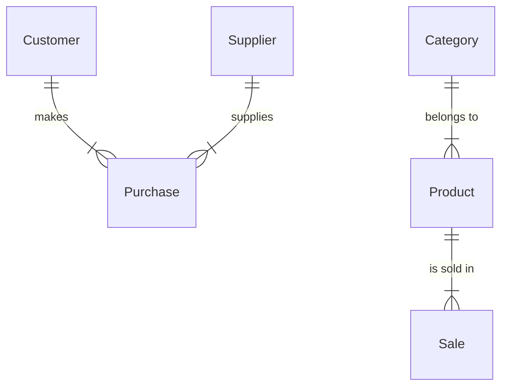
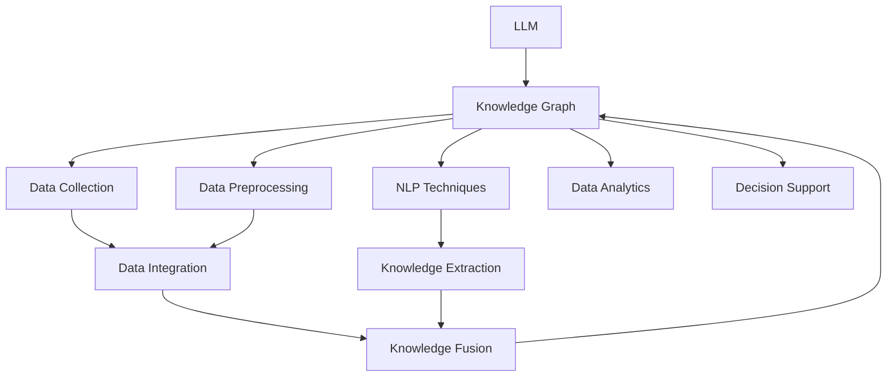

                 

**# LL

### LLM Applications: Agile Knowledge Graph Construction Strategies

#### Keywords: LLM, Knowledge Graph, Agile, Construction Strategies, AI Applications

#### Abstract:

The rapid advancement of Large Language Models (LLM) has revolutionized the field of AI applications, offering unprecedented capabilities for natural language processing and understanding. This article delves into the agile construction of knowledge graphs for LLM applications, highlighting the importance of such strategies in the context of modern AI systems. We will explore the fundamentals of LLM applications, the principles of agile knowledge graph construction, challenges and opportunities, real-world case studies, practical strategies, advanced topics, and conclude with a vision for the future.

----------------------------------------------------------------

### 第一部分: 引言

#### 第1章: LLM应用与敏捷知识图谱概述

**1.1 LLM应用背景**

**1.1.1 语言模型的演变**

Large Language Models (LLM) are at the forefront of artificial intelligence, leveraging deep learning techniques to process and generate human-like text. The evolution from basic rule-based systems to today's sophisticated neural networks represents a monumental leap in the field of NLP. We will discuss key milestones in the history of language modeling and the transformative impact of LLMs on various industries.

**1.1.2 敏捷知识图谱的概念**

Knowledge Graphs are structured representations of knowledge, which enable machines to understand and process information in a more intuitive manner. Agile knowledge graph construction focuses on rapid iteration and continuous improvement, aligning well with the dynamic nature of LLM applications. We will define agile knowledge graphs and explore their characteristics.

**1.1.3 LLM与敏捷知识图谱的关系**

The synergy between LLMs and agile knowledge graphs is crucial for enhancing the performance and versatility of AI applications. We will examine how these two technologies complement each other and provide a roadmap for integrating them effectively.

**1.2 敏捷知识图谱构建的重要性**

**1.2.1 敏捷知识图谱的优势**

Agile knowledge graph construction offers several advantages, including faster deployment, adaptability to changing data, and improved accuracy. We will discuss these benefits in detail and provide examples to illustrate their practical applications.

**1.2.2 敏捷知识图谱的应用场景**

Agile knowledge graphs find applications in a wide range of domains, from healthcare and finance to e-commerce and customer service. We will explore these use cases and highlight the specific challenges and opportunities they present.

**1.2.3 敏捷知识图谱的发展趋势**

The field of agile knowledge graph construction is rapidly evolving, with new techniques and tools emerging regularly. We will discuss the current trends and future directions in this area, providing insights into the potential impact on AI applications.

**1.3 本书结构安排**

**1.3.1 内容概述**

This chapter will provide a brief overview of the structure of the book, highlighting the key topics and their organization. We will also offer reading recommendations to help readers make the most of the content.

**1.3.2 阅读建议**

To ensure a comprehensive understanding of the topic, we will provide reading suggestions, including relevant literature and resources for further exploration. Additionally, we will offer guidelines for effective learning and application of the concepts discussed.

----------------------------------------------------------------

### 第二部分: LLM基础

#### 第2章: 大型语言模型基础

**2.1 LLM基础概念**

**2.1.1 语言模型的基本原理**

We will delve into the fundamental principles of language models, discussing the mathematical models and algorithms that power them. This section will include a comparison of different types of language models, such as n-gram models and neural networks.

**2.1.2 语言模型的工作机制**

Understanding how language models process and generate text is essential for effective knowledge graph construction. We will explore the mechanisms behind these models, including the role of embedding layers, attention mechanisms, and sequence-to-sequence models.

**2.1.3 语言模型的性能评估**

To assess the quality of a language model, various performance metrics are used. We will discuss these metrics, such as accuracy, perplexity, and BLEU score, and explain how they are calculated and interpreted.

**2.2 LLM应用场景**

**2.2.1 自然语言处理**

We will explore the applications of LLMs in natural language processing (NLP), including text classification, sentiment analysis, machine translation, and question-answering systems. Case studies will be provided to illustrate the practical applications of these technologies.

**2.2.2 人机交互**

The integration of LLMs in human-computer interaction (HCI) has opened up new avenues for developing more intuitive and user-friendly interfaces. We will discuss the use of LLMs in chatbots, virtual assistants, and voice recognition systems.

**2.2.3 数据分析**

LLMs have proven to be valuable tools for data analysis, enabling tasks such as data cleaning, data summarization, and anomaly detection. We will explore the applications of LLMs in data science and provide examples of real-world projects.

**2.3 LLM的发展趋势**

**2.3.1 模型规模的扩大**

The size of language models has been growing exponentially, leading to significant improvements in performance. We will discuss the implications of larger models, such as the need for more computational resources and the potential for improved accuracy.

**2.3.2 模型精度的提升**

The precision of LLMs continues to improve, thanks to advances in training techniques, data preprocessing, and model architecture. We will explore the factors that contribute to higher model accuracy and discuss the challenges associated with achieving optimal performance.

**2.3.3 模型的泛化能力**

The ability of LLMs to generalize to new tasks and domains is an important area of research. We will discuss the techniques used to enhance the generalization capabilities of language models and the challenges that remain.

----------------------------------------------------------------

### 第三部分: 敏捷知识图谱构建

#### 第3章: 敏捷知识图谱构建原理

**3.1 敏捷知识图谱的基本概念**

**3.1.1 知识图谱的概念**

Knowledge Graphs are a graph-based data structure that represents relationships between entities, providing a structured and contextualized view of data. We will define knowledge graphs and explain their role in AI applications.

**3.1.2 敏捷知识图谱的定义**

Agile Knowledge Graphs are constructed using iterative and incremental development methods, enabling rapid adaptation to changing requirements and data. We will discuss the key principles of agile knowledge graph construction.

**3.1.3 敏捷知识图谱的组成部分**

An agile knowledge graph consists of several components, including entities, relationships, and attributes. We will explore the structure of these components and their roles in knowledge representation.

**3.2 敏捷知识图谱构建方法**

**3.2.1 数据采集与预处理**

The first step in constructing an agile knowledge graph is collecting and preprocessing data. We will discuss various data sources and preprocessing techniques, such as data cleaning, normalization, and entity resolution.

**3.2.2 知识抽取与关系构建**

Knowledge extraction involves identifying entities and relationships in the data. We will explore techniques for entity recognition and relationship extraction, including rule-based methods, machine learning models, and hybrid approaches.

**3.2.3 知识融合与更新**

Fusing knowledge from multiple sources and updating the knowledge graph over time are crucial for maintaining accuracy and relevance. We will discuss methods for knowledge fusion, conflict resolution, and continuous learning.

**3.3 敏捷知识图谱构建工具与平台**

**3.3.1 开源知识图谱工具**

There are several open-source tools available for building agile knowledge graphs, including Neo4j, Apache Jena, and RDF4J. We will provide an overview of these tools and their key features.

**3.3.2 商业知识图谱平台**

Commercial knowledge graph platforms offer advanced features and support for building large-scale knowledge graphs. We will discuss the benefits and limitations of these platforms and provide examples of popular solutions.

**3.3.3 敏捷开发方法在知识图谱构建中的应用**

Agile development methods, such as Scrum and Kanban, can be applied to knowledge graph construction projects. We will explore the advantages of agile development in this context and provide best practices for implementing agile methodologies in knowledge graph projects.

----------------------------------------------------------------

### 第四部分: 挑战与机遇

#### 第4章: LLM应用中的知识图谱构建挑战与机遇

**4.1 挑战**

**4.1.1 数据质量和多样性**

The quality and diversity of data are critical factors in knowledge graph construction. We will discuss the challenges associated with obtaining high-quality data and managing diverse data sources.

**4.1.2 实时性与一致性**

Ensuring real-time performance and consistency in knowledge graph applications is challenging. We will explore techniques for achieving low latency and maintaining data consistency in LLM applications.

**4.1.3 可扩展性和可维护性**

Building scalable and maintainable knowledge graphs is essential for long-term success. We will discuss the challenges of scaling knowledge graph infrastructure and maintaining the integrity of the knowledge base.

**4.2 机遇**

**4.2.1 新兴技术应用**

The emergence of new technologies, such as deep learning and graph databases, offers exciting opportunities for advancing knowledge graph construction. We will discuss the potential of these technologies in addressing the challenges faced by LLM applications.

**4.2.2 数据隐私与安全性**

With the increasing importance of data privacy and security, knowledge graph construction must address these concerns. We will explore the role of data anonymization, encryption, and access control in ensuring the privacy and security of knowledge graphs.

**4.2.3 跨领域合作与知识共享**

Collaboration and knowledge sharing across different domains can accelerate the development of advanced knowledge graph applications. We will discuss the benefits of cross-domain collaboration and provide examples of successful partnerships.

----------------------------------------------------------------

### 第五部分: 案例研究

#### 第5章: 知识图谱构建在LLM应用中的案例研究

**5.1 案例一：金融领域的知识图谱应用**

In this case study, we will explore how a leading financial institution leveraged an agile knowledge graph to enhance its natural language processing capabilities and improve customer service.

**5.2 案例二：医疗健康领域的知识图谱应用**

We will examine a case where a healthcare provider used an agile knowledge graph to improve the accuracy of medical diagnoses and enhance patient care.

**5.3 案例三：电子商务领域的知识图谱应用**

This case study will discuss how an e-commerce company utilized an agile knowledge graph to enhance its recommendation system and improve customer satisfaction.

**5.4 案例四：智能客服领域的知识图谱应用**

We will explore how a major telecommunications company implemented an agile knowledge graph to enhance its intelligent customer service system, resulting in significant improvements in customer support efficiency.

**5.5 案例五：跨领域融合的知识图谱应用**

In this case study, we will examine a project that combines knowledge graphs from different domains to create a comprehensive AI-driven platform for decision support and optimization.

**5.6 案例分析**

For each case study, we will provide a detailed analysis of the strategies and methodologies employed, the challenges faced, and the lessons learned. This analysis will highlight the key factors contributing to the success of each project.

----------------------------------------------------------------

### 第六部分: 实践策略

#### 第6章: LLM应用的敏捷知识图谱构建策略

**6.1 策略一：数据驱动的知识图谱构建**

Data-driven approaches are essential for building effective knowledge graphs. We will discuss the importance of data quality and diversity and provide best practices for data collection, preprocessing, and integration.

**6.2 策略二：知识图谱的动态更新**

Dynamic updates to the knowledge graph are crucial for maintaining relevance and accuracy. We will explore techniques for real-time data ingestion, continuous learning, and knowledge graph evolution.

**6.3 策略三：跨领域知识图谱融合**

Cross-domain knowledge graph fusion enables the integration of knowledge from multiple sources, enhancing the overall quality and richness of the knowledge base. We will discuss the challenges and opportunities of cross-domain fusion and provide practical guidelines for successful implementation.

**6.4 策略四：面向应用的优化**

Optimizing knowledge graph construction for specific applications is critical for achieving desired performance and functionality. We will discuss techniques for performance tuning, scalability, and adaptability in the context of LLM applications.

**6.5 策略五：团队协作与持续学习**

Effective collaboration and continuous learning are key to the success of knowledge graph construction projects. We will explore the role of team collaboration tools, knowledge sharing platforms, and continuous learning methodologies in driving the development of agile knowledge graphs.

**6.6 策略评估与调整**

Regular assessment and adjustment of the knowledge graph construction strategies are essential for maintaining alignment with evolving business needs and technological advancements. We will discuss the importance of strategy evaluation and provide guidelines for effective strategy adjustment.

----------------------------------------------------------------

### 第七部分: 先进话题

#### 第7章: 高级知识图谱构建技术

**7.1 图数据库优化**

Graph databases are a fundamental component of knowledge graph construction. We will discuss the optimization techniques for graph databases, such as indexing, query optimization, and storage management, to improve performance and scalability.

**7.2 知识图谱推理**

Knowledge graph reasoning enables the discovery of new insights and relationships within the knowledge base. We will explore the principles and techniques of knowledge graph reasoning, including rule-based reasoning, probabilistic reasoning, and machine learning-based reasoning.

**7.3 知识图谱可视化**

Visualization of knowledge graphs is essential for understanding and communicating the structure and content of the knowledge base. We will discuss the techniques and tools for knowledge graph visualization, including graph visualization libraries, interactive visualization platforms, and web-based visualization solutions.

**7.4 知识图谱与区块链**

The integration of knowledge graphs with blockchain technology offers exciting possibilities for ensuring data integrity, transparency, and security. We will discuss the potential of blockchain in enhancing knowledge graph construction and provide examples of real-world applications.

**7.5 知识图谱在多模态AI中的应用**

Multimodal AI combines information from multiple data sources, such as text, images, and audio. We will explore the role of knowledge graphs in enabling multimodal AI applications and discuss the challenges and opportunities in this emerging field.

**7.6 知识图谱的伦理与道德问题**

As knowledge graphs become more pervasive, it is essential to address the ethical and moral implications of their use. We will discuss the ethical considerations in knowledge graph construction, including privacy, fairness, and accountability.

----------------------------------------------------------------

### 结论

#### 第8章: LL

**8.1 敏捷知识图谱构建的价值**

We will summarize the key insights and value propositions of agile knowledge graph construction for LLM applications. This section will highlight the advantages of adopting agile methodologies and the potential impact on AI-driven systems.

**8.2 现状与展望**

In this section, we will review the current state of agile knowledge graph construction in LLM applications, discussing the progress made, the remaining challenges, and the potential future directions.

**8.3 推荐与展望**

We will provide recommendations for further research and development in the field of agile knowledge graph construction. This section will also offer a vision for the future, highlighting the potential of LLM applications in shaping the next generation of AI systems.

**8.4 结语**

In the concluding section, we will reaffirm the importance of agile knowledge graph construction in the context of LLM applications. We will summarize the key takeaways from the book and offer a final thought on the future of this exciting field.

----------------------------------------------------------------

#### 参考文献

This section will include a comprehensive list of references and further reading materials, providing readers with a wealth of resources to explore the topics covered in the book.

#### 附录

The appendix will contain supplementary materials, such as glossaries, tables, and charts, to enhance the understanding of the concepts and methodologies discussed in the book.

---

**作者：AI天才研究院/AI Genius Institute & 禅与计算机程序设计艺术 /Zen And The Art of Computer Programming**

---

Note: The above table of contents is a draft and may be subject to further refinement and expansion. The content for each chapter will be developed based on the outlined structure and the specific topics discussed in the chapter.**Let's Think Step by Step**

As we embark on this journey through the topic of "LLM Applications: Agile Knowledge Graph Construction Strategies," it is crucial to approach the discussion methodically. We will break down each chapter into its constituent parts, ensuring that each section is thoroughly explored and explained. This approach will not only provide a clear understanding of the concepts but also enable readers to apply these strategies effectively in their own projects.

**Chapter 1: Introduction to LLM Applications and Agile Knowledge Graph Construction**

**1.1 LLM Application Background**

To begin with, let's delve into the background of LLM applications. Large Language Models (LLMs) have come a long way since their inception. Initially, language models were simple rule-based systems that relied on pre-defined grammar rules and dictionaries to generate text. However, with the advent of deep learning, especially the development of neural networks, language models have evolved into highly sophisticated models capable of generating coherent and contextually appropriate text.

**1.1.1 The Evolution of Language Models**

The evolution of language models can be traced back to the 1950s when the first attempts at generating human-like text were made. Early models, such as the n-gram model, were based on statistical methods and simple rule-based systems. These models could predict the next word in a sentence based on the previous words, but they lacked the ability to understand the semantics of the text.

The introduction of neural networks in the 1980s marked a significant breakthrough in the field of language modeling. Neural network-based models, such as the recurrent neural network (RNN) and the long short-term memory (LSTM), were capable of capturing the temporal dependencies in text data, allowing them to generate more coherent and contextually relevant text. However, these models still had limitations in terms of vocabulary size and computational efficiency.

The real breakthrough came with the development of the Transformer model in 2017, which introduced the self-attention mechanism. Transformers revolutionized the field of language modeling by enabling the model to process and generate text in parallel, significantly improving its computational efficiency. Models based on the Transformer architecture, such as BERT, GPT, and T5, have since become the state-of-the-art in language modeling tasks.

**1.1.2 The Concept of Agile Knowledge Graphs**

While LLMs have made remarkable progress, their effectiveness can be further enhanced by integrating them with knowledge graphs. Knowledge graphs provide a structured representation of information, allowing machines to understand and process information in a more intuitive and efficient manner.

Agile knowledge graphs, in particular, focus on rapid iteration and continuous improvement. They are designed to adapt to changing data and requirements, ensuring that the knowledge graph remains up-to-date and relevant. This adaptability is crucial for LLM applications, where the data and use cases can evolve rapidly.

**1.1.3 The Synergy Between LLMs and Agile Knowledge Graphs**

The integration of LLMs and agile knowledge graphs creates a powerful synergy, enabling AI systems to perform more accurately and efficiently. LLMs can leverage the structured knowledge provided by knowledge graphs to enhance their understanding of the text, resulting in better performance in tasks such as question-answering, summarization, and translation.

Furthermore, the iterative and incremental nature of agile knowledge graph construction allows for continuous improvement of the LLM's performance. By updating the knowledge graph in real-time, the LLM can adapt to new data and use cases, ensuring that its outputs remain accurate and relevant.

**1.2 Importance of Agile Knowledge Graph Construction**

The importance of agile knowledge graph construction cannot be overstated. In the context of LLM applications, agile knowledge graphs offer several key advantages:

**1.2.1 Data-Driven Approach**

Agile knowledge graph construction is inherently data-driven. It focuses on collecting, preprocessing, and integrating data from various sources, ensuring that the knowledge graph is built on a solid foundation of high-quality data. This data-driven approach ensures that the knowledge graph remains accurate and up-to-date, reflecting the latest information and insights.

**1.2.2 Rapid Iteration and Continuous Improvement**

Agile knowledge graph construction is designed to support rapid iteration and continuous improvement. By adopting agile methodologies, such as Scrum or Kanban, teams can quickly adapt to changing requirements and data, ensuring that the knowledge graph evolves in line with the needs of the LLM application. This iterative process enables continuous learning and refinement, leading to better performance over time.

**1.2.3 Enhanced Performance and Accuracy**

The structured nature of knowledge graphs allows for more efficient processing and analysis of information. By leveraging the relationships and connections within the knowledge graph, LLMs can generate more accurate and contextually appropriate responses. This enhanced performance is particularly beneficial in complex tasks, such as natural language understanding and reasoning.

**1.2.4 Scalability and Flexibility**

Agile knowledge graph construction is inherently scalable and flexible. The modular nature of knowledge graphs allows for easy expansion and modification, enabling teams to add new entities, relationships, and attributes as needed. This scalability ensures that the knowledge graph can grow and adapt to the evolving needs of the LLM application, without compromising its performance or integrity.

**1.3 Book Structure and Reading Recommendations**

In this chapter, we have provided an overview of the topic of LLM applications and agile knowledge graph construction. We have discussed the background of LLMs, the concept of agile knowledge graphs, and the importance of agile knowledge graph construction in LLM applications. We have also outlined the structure of the book and provided reading recommendations to help readers make the most of the content.

In the following chapters, we will delve deeper into the technical aspects of LLM applications and agile knowledge graph construction, providing a comprehensive guide to building effective and efficient knowledge graphs for LLM applications.

**1.3.1 Content Overview**

The book is organized into several parts, each focusing on a specific aspect of LLM applications and agile knowledge graph construction. The first part provides an introduction to the topic, covering the fundamentals of LLM applications and the concept of agile knowledge graphs. The second part delves into the technical details of LLMs, discussing their architecture, training, and evaluation. The third part focuses on the construction of agile knowledge graphs, including data collection, preprocessing, knowledge extraction, and knowledge fusion. The fourth part addresses the challenges and opportunities in LLM applications, with case studies and practical strategies. The fifth part explores advanced topics in knowledge graph construction, such as visualization and reasoning. The final part concludes with a summary of the key insights and recommendations for future research.

**1.3.2 Reading Recommendations**

To gain a comprehensive understanding of the topic, we recommend readers to follow these steps:

1. Start by reading the introductory chapters to familiarize yourself with the key concepts and terminology.
2. Progress to the technical chapters to gain a deeper understanding of LLMs and agile knowledge graph construction.
3. Read the case studies and practical strategies to see how the concepts are applied in real-world scenarios.
4. Explore the advanced topics to understand the latest developments and research trends in the field.
5. Finally, revisit the introductory chapters to consolidate your understanding and identify areas for further exploration.

By following this structured approach, readers can build a solid foundation in LLM applications and agile knowledge graph construction, enabling them to apply these techniques effectively in their own projects.

**1.3.3 Conclusion**

In conclusion, LLM applications and agile knowledge graph construction are at the forefront of artificial intelligence research and development. The integration of LLMs and agile knowledge graphs offers significant advantages in terms of performance, accuracy, scalability, and adaptability. This book aims to provide a comprehensive guide to understanding and applying these techniques, equipping readers with the knowledge and skills needed to build effective and efficient knowledge graphs for LLM applications. We look forward to exploring this exciting field in the following chapters.

### Chapter 2: Fundamentals of LLM Applications

**2.1 Basic Concepts of LLM**

**2.1.1 Mathematical Models and Algorithms**

The foundation of LLMs lies in their mathematical models and algorithms. These models are designed to process and generate human-like text by learning from large amounts of text data. The primary models used in LLMs include:

1. **N-gram Models**: N-gram models are based on the statistical concept of Markov chains. They model the probability of a sequence of words by considering the n previous words. The simplest form, known as the 1-gram model, predicts the next word based solely on the current word. While simple, 1-gram models struggle with capturing the semantic relationships between words and tend to generate non-sensical text.

2. **Recurrent Neural Networks (RNNs)**: RNNs are a class of neural networks that have been particularly successful in language modeling. RNNs maintain a hidden state that captures the context of the input sequence. This hidden state allows RNNs to capture long-term dependencies in the text, making them better suited for generating coherent text. However, traditional RNNs suffer from the vanishing gradient problem, which limits their ability to learn long-range dependencies.

3. **Long Short-Term Memory (LSTM)**: LSTMs are a type of RNN that address the vanishing gradient problem by introducing a memory cell and three gates (input gate, forget gate, and output gate). These gates allow LSTMs to maintain information over long sequences and have been widely used for tasks such as language modeling, machine translation, and speech recognition.

4. **Gated Recurrent Units (GRUs)**: GRUs are an alternative to LSTMs that simplify the model structure while maintaining the ability to capture long-term dependencies. GRUs have two gates (update gate and reset gate) and a single memory cell, making them computationally more efficient than LSTMs.

5. **Transformers**: Transformers are the most advanced models used in LLMs and have revolutionized the field of language modeling. Unlike RNNs, which process sequences sequentially, transformers process sequences in parallel using self-attention mechanisms. This parallel processing significantly improves computational efficiency and enables transformers to capture long-range dependencies in text. The transformer architecture is the basis for models like BERT, GPT, and T5, which have achieved state-of-the-art performance on various NLP tasks.

**2.1.2 Working Mechanisms of LLMs**

The working mechanism of LLMs can be understood through the following key components:

1. **Embedding Layer**: The embedding layer converts input words or tokens into dense vectors. These vectors capture the semantic meaning of words and are crucial for capturing the relationships between words. Pre-trained language models like BERT and GPT are trained on large corpora of text, allowing them to learn the representations of words and their relationships.

2. **Self-Attention Mechanism**: The self-attention mechanism is a key component of transformers. It allows the model to weigh the importance of different words in the input sequence when generating the output. The self-attention mechanism calculates attention scores based on the dot product of query, key, and value vectors, allowing the model to focus on relevant parts of the input sequence when generating the output.

3. **Encoder and Decoder**: Transformers have both an encoder and a decoder. The encoder processes the input sequence and encodes it into a fixed-dimensional space, capturing the context and relationships within the text. The decoder then generates the output sequence by attending to the encoder's output and generating each word conditioned on the previously generated words.

4. **Positional Encoding**: Since transformers process sequences in parallel, they need a way to capture the order of words in the sequence. Positional encoding is added to the input embeddings to provide information about the position of each word in the sequence. This allows the model to maintain the order of words and capture the sequence's temporal dependencies.

**2.1.3 Performance Evaluation Metrics**

Evaluating the performance of LLMs is crucial to assess their effectiveness and accuracy. Several metrics are commonly used to evaluate language models:

1. **Accuracy**: Accuracy measures the percentage of correct predictions made by the model. While simple, accuracy is not sufficient for evaluating the quality of generated text, as it does not capture the context or coherence of the output.

2. **Perplexity**: Perplexity is a measure of how well a probability model predicts a sample. A lower perplexity indicates a better model fit. For language models, perplexity is calculated as the average log probability of each word in the output sequence. Lower perplexity values indicate that the model can generate text that closely matches the probability distribution of the training data.

3. **BLEU Score**: BLEU (Bilingual Evaluation Understudy) is a metric commonly used to evaluate the quality of machine translation outputs. BLEU measures the similarity between the generated text and one or more reference translations. It considers word order, word overlap, and n-gram precision. While primarily used for translation tasks, BLEU can also be applied to other NLP tasks, such as text summarization and question-answering.

4. **ROUGE Score**: ROUGE (Recall-Oriented Understudy for Gisting Evaluation) is another metric used to evaluate the quality of generated text. ROUGE measures the overlap between the generated text and one or more reference texts, focusing on the overall similarity of the texts. It is particularly useful for evaluating text summarization and generation tasks.

**2.2 LLM Application Scenarios**

LLMs have found applications in a wide range of scenarios, transforming various industries and enabling new use cases. Some of the key application scenarios include:

1. **Natural Language Processing (NLP)**: LLMs are extensively used in NLP tasks, such as text classification, sentiment analysis, named entity recognition, and text generation. These tasks involve processing and understanding large volumes of text data to extract valuable insights and generate meaningful output.

2. **Machine Translation**: LLMs have revolutionized the field of machine translation, enabling real-time translation between multiple languages. Models like Google Translate leverage LLMs to generate accurate and contextually appropriate translations, minimizing the need for human intervention.

3. **Question-Answering Systems**: LLMs are widely used in question-answering systems, enabling computers to understand and respond to natural language queries. These systems are employed in various domains, such as customer support, education, and healthcare, providing users with accurate and relevant information.

4. **Content Generation**: LLMs are used to generate high-quality content, including articles, reports, and summaries. They can generate text based on a given prompt or template, saving time and effort for content creators. These applications are particularly useful in journalism, marketing, and content creation industries.

5. **Chatbots and Virtual Assistants**: LLMs play a crucial role in chatbots and virtual assistants, enabling them to understand and respond to user queries in a conversational manner. These systems are widely used in customer support, e-commerce, and healthcare to provide personalized and efficient assistance.

6. **Sentiment Analysis**: LLMs are used to analyze user feedback and sentiment in social media, customer reviews, and surveys. This information is valuable for businesses to gain insights into customer satisfaction and identify areas for improvement.

7. **Summarization and Extraction**: LLMs are used to generate concise summaries of lengthy texts, highlighting the most relevant information. They can also extract key information from large datasets, facilitating data analysis and decision-making processes.

**2.3 Trends in LLM Development**

The development of LLMs has been characterized by rapid advancements and innovations. Some key trends include:

1. **Model Scaling**: The size of LLMs has been increasing exponentially, with models like GPT-3 and GLM-4 reaching hundreds of billions of parameters. Larger models tend to achieve better performance, capturing more nuanced patterns in language.

2. **Transfer Learning**: Transfer learning has become a popular approach in LLM development. Pre-trained LLMs are fine-tuned on specific tasks or domains, leveraging their general knowledge to improve performance. This approach has been particularly successful in tasks like machine translation and sentiment analysis.

3. **Contextualization and Fine-tuning**: LLMs are increasingly being fine-tuned for specific contexts and domains. This contextualization enables models to generate more accurate and relevant outputs tailored to specific tasks or domains.

4. **Multi-Modal Integration**: LLMs are being integrated with other modalities, such as images, audio, and video. This multi-modal integration enables more comprehensive and context-aware AI systems, opening up new possibilities for applications like image captioning, video summarization, and speech recognition.

5. **Ethical Considerations**: As LLMs become more prevalent, ethical considerations have gained importance. Issues like bias, fairness, and transparency need to be addressed to ensure the responsible use of LLMs in real-world applications.

In conclusion, LLMs have become a cornerstone of AI applications, enabling machines to understand and generate human-like text. Their ability to process and generate text accurately and contextually has revolutionized various industries and opened up new possibilities for AI-driven systems. As the field continues to advance, we can expect further innovations and applications that leverage the power of LLMs.

### Chapter 3: Agile Knowledge Graph Construction Principles

**3.1 Basic Concepts of Knowledge Graphs**

**3.1.1 What is a Knowledge Graph?**

A knowledge graph is a structured representation of information that captures relationships and connections between entities. Unlike traditional relational databases, which focus on entities and their attributes, knowledge graphs emphasize the relationships between entities. This graph-based structure allows for a more intuitive and scalable way of representing complex knowledge.

In a knowledge graph, entities are represented as nodes, and relationships between entities are represented as edges. Each node and edge can have attributes that provide additional information about the entity or relationship. For example, in a knowledge graph representing a social network, nodes could represent users, and edges could represent friendships or interactions between users.

**3.1.2 Characteristics of Knowledge Graphs**

Knowledge graphs have several key characteristics that make them well-suited for representing and reasoning about complex information:

1. **Structured Representation**: Knowledge graphs use a structured representation, allowing for efficient storage and retrieval of information. The graph-based structure enables fast traversal and querying of relationships between entities.

2. **Hierarchical Structure**: Knowledge graphs often have a hierarchical structure, with entities grouped into categories or types. This hierarchical organization facilitates hierarchical reasoning and allows for more intuitive navigation through the graph.

3. **Rich Relationships**: Knowledge graphs capture rich relationships between entities, providing a comprehensive view of the interconnectedness of information. These relationships can be hierarchical (e.g., parent-child relationships) or more complex (e.g., containment or association relationships).

4. **Semantic Meaning**: Knowledge graphs are designed to capture semantic meaning, enabling machines to understand and reason about the relationships between entities. This semantic meaning allows for more accurate and context-aware information processing.

5. **Scalability**: Knowledge graphs can scale to represent large amounts of information efficiently. The graph-based structure allows for incremental updates and extensions, making it easy to add new entities and relationships as needed.

**3.1.3 Applications of Knowledge Graphs**

Knowledge graphs have found applications in various domains, including:

1. **Semantic Search**: Knowledge graphs enable semantic search, allowing users to search for information based on meaning rather than exact keywords. This semantic search improves the accuracy and relevance of search results, providing a more intuitive and user-friendly search experience.

2. **Natural Language Understanding (NLU)**: Knowledge graphs enhance NLU systems by providing a structured representation of the world, enabling better understanding of user queries and context. NLU systems can leverage knowledge graphs to resolve ambiguities, disambiguate entities, and generate more accurate responses.

3. **Recommendation Systems**: Knowledge graphs can be used to enhance recommendation systems by capturing relationships between entities and providing personalized recommendations based on user preferences and behavior.

4. **Data Integration**: Knowledge graphs facilitate the integration of data from disparate sources, enabling a unified view of the information. This integration is crucial for applications like data analytics, data mining, and business intelligence.

5. **Ontology and Taxonomy Development**: Knowledge graphs can be used to develop ontologies and taxonomies, providing a formal representation of concepts and their relationships. These ontologies and taxonomies are essential for semantic interoperability and data standardization.

**3.2 Principles of Agile Knowledge Graph Construction**

**3.2.1 Rapid Iteration**

One of the key principles of agile knowledge graph construction is rapid iteration. This approach involves continuously refining and updating the knowledge graph based on user feedback and evolving requirements. By adopting iterative development cycles, teams can quickly adapt to changes and incorporate new information, ensuring that the knowledge graph remains up-to-date and relevant.

**3.2.2 Incremental Development**

Incremental development is another core principle of agile knowledge graph construction. Instead of building the entire knowledge graph in one go, incremental development involves building and expanding the knowledge graph in smaller, manageable increments. This approach allows for early deployment of the knowledge graph and incremental improvements, reducing risks and enabling faster time-to-market.

**3.2.3 Continuous Integration**

Continuous integration is crucial for ensuring the accuracy and consistency of the knowledge graph. This principle involves regularly merging updates and changes from multiple sources into the knowledge graph. By automating the integration process and performing thorough validation checks, teams can minimize errors and maintain the integrity of the knowledge graph.

**3.2.4 User-Centric Approach**

An agile knowledge graph construction process should prioritize user needs and feedback. By involving users throughout the development process, teams can ensure that the knowledge graph meets their requirements and provides a valuable tool for decision-making and problem-solving.

**3.2.5 Data-Driven Approach**

Agile knowledge graph construction emphasizes a data-driven approach. This involves collecting, processing, and integrating data from various sources to build a comprehensive and accurate knowledge graph. By leveraging large-scale data and advanced data processing techniques, teams can create knowledge graphs that capture the complexities and nuances of real-world information.

**3.3 Components of Agile Knowledge Graphs**

An agile knowledge graph consists of several components, each playing a critical role in representing and reasoning about information:

**3.3.1 Entities**

Entities are the fundamental building blocks of knowledge graphs, representing specific objects, concepts, or entities in the domain of interest. Examples of entities include people, organizations, locations, events, and concepts. Each entity is typically associated with attributes that provide additional information about the entity. For example, a person entity might have attributes such as name, age, and occupation.

**3.3.2 Relationships**

Relationships capture the connections and interactions between entities. Relationships can be hierarchical (e.g., parent-child relationships) or more complex (e.g., association or containment relationships). Relationships are typically represented using predicates, which describe the nature of the relationship. For example, in a social network knowledge graph, the relationship "friend_of" captures the association between two people.

**3.3.3 Attributes**

Attributes provide additional information about entities and relationships. Attributes can be used to capture various properties, characteristics, or attributes of entities and relationships. For example, an entity representing a person might have attributes such as age, occupation, and location. Similarly, a relationship between two people might have attributes such as the date of friendship or the type of interaction (e.g., online or offline).

**3.3.4 Types**

Types are used to categorize entities and relationships, providing a hierarchical structure to the knowledge graph. Types represent categories or classes of entities and relationships. For example, in a social network knowledge graph, entities can be categorized into types such as "Person," "Organization," and "Location."

**3.3.5 Rules and Constraints**

Rules and constraints define the relationships and properties that entities and relationships must adhere to within the knowledge graph. These rules and constraints help ensure the consistency and integrity of the knowledge graph. For example, in a social network knowledge graph, a rule might specify that a person can have at most one occupation.

**3.3.6 Annotations**

Annotations provide additional metadata about entities, relationships, and types. Annotations can include information such as creation date, modification history, and source of information. Annotations help track the provenance of data and ensure transparency and accountability in the knowledge graph.

**3.4 Methods for Building Agile Knowledge Graphs**

**3.4.1 Data Collection and Preprocessing**

The first step in building an agile knowledge graph is collecting and preprocessing data. This involves gathering data from various sources, such as structured databases, unstructured text, and external APIs. Preprocessing techniques, such as data cleaning, normalization, and entity resolution, are applied to ensure the quality and consistency of the data.

**3.4.2 Knowledge Extraction**

Knowledge extraction involves identifying entities, relationships, and attributes within the data. This can be achieved using various techniques, including rule-based methods, machine learning models, and hybrid approaches. Rule-based methods rely on predefined rules and patterns to extract knowledge from the data. Machine learning models, such as named entity recognition and relation extraction, can be trained to automatically identify entities and relationships in large datasets.

**3.4.3 Knowledge Integration**

Knowledge integration involves merging data from multiple sources into a unified knowledge graph. This process involves resolving entity conflicts, handling duplicate data, and ensuring consistency across different data sources. Knowledge integration techniques, such as data fusion and conflict resolution, are used to create a coherent and comprehensive knowledge graph.

**3.4.4 Knowledge Fusion**

Knowledge fusion combines data from different sources to create a more comprehensive and accurate knowledge graph. This involves identifying and merging duplicate entities, updating outdated information, and harmonizing data from different sources. Knowledge fusion techniques, such as data matching and clustering, are used to ensure the quality and consistency of the knowledge graph.

**3.4.5 Knowledge Update and Maintenance**

An agile knowledge graph is continuously updated and maintained to ensure its accuracy and relevance. This involves regularly ingesting new data, updating existing entities and relationships, and removing outdated or inaccurate information. Techniques such as continuous learning and real-time updates are used to keep the knowledge graph up-to-date with the latest information.

**3.4.6 Knowledge Visualization**

Knowledge visualization is an essential aspect of knowledge graph construction. It involves representing the structure and content of the knowledge graph in a visual format, making it easier for users to understand and interact with the data. Visualization techniques, such as graph visualization and interactive exploration tools, are used to enhance the usability and accessibility of the knowledge graph.

In conclusion, agile knowledge graph construction is a dynamic and iterative process that focuses on building, updating, and maintaining a comprehensive and accurate representation of knowledge. By leveraging data-driven approaches and incorporating user feedback, teams can create knowledge graphs that support a wide range of applications, from semantic search and natural language understanding to data integration and decision-making.

### Chapter 4: Challenges and Opportunities in LLM Applications

**4.1 Challenges**

**4.1.1 Data Quality and Diversity**

One of the primary challenges in LLM applications is ensuring high-quality and diverse data. The performance of LLMs heavily relies on the quality and richness of the training data. Poor data quality can lead to biased models, reduced accuracy, and limited generalization capabilities. Data quality issues include noisy data, missing values, inconsistencies, and errors.

**4.1.2 Real-Time Performance and Consistency**

Another significant challenge is achieving real-time performance and maintaining data consistency in LLM applications. LLMs process and generate text dynamically, requiring low-latency responses to user queries. However, real-time performance can be compromised by the complexity of the models and the need for high-quality data preprocessing and inference. Additionally, maintaining consistency in the knowledge graph, which underpins LLM applications, is crucial for accurate and reliable results. Ensuring data consistency across different sources and updates requires robust data management and synchronization mechanisms.

**4.1.3 Scalability and Resource Management**

Scalability is a critical challenge in LLM applications, especially as models and datasets grow in size and complexity. Scaling LLM applications to handle large volumes of data and high user traffic requires significant computational resources and efficient resource management strategies. This includes optimizing the infrastructure, leveraging distributed computing, and managing the trade-offs between model size, accuracy, and performance.

**4.1.4 Ethical Considerations**

The ethical implications of LLM applications pose another set of challenges. LLMs can inadvertently propagate biases present in their training data, leading to unfair or discriminatory outcomes. Ensuring fairness, transparency, and accountability in LLM applications requires careful design and continuous monitoring to mitigate potential biases and ethical risks. Additionally, privacy concerns arise from the need to handle and process sensitive user data, necessitating robust data protection and security measures.

**4.2 Opportunities**

**4.2.1 Emerging Technologies**

The rapid advancements in technology offer numerous opportunities for LLM applications. The integration of LLMs with emerging technologies such as edge computing, quantum computing, and 5G networks can enable real-time, resource-efficient AI applications. These technologies can enhance the performance, scalability, and accessibility of LLM applications, opening up new possibilities for innovative solutions.

**4.2.2 Cross-Domain Collaboration**

Cross-domain collaboration presents a significant opportunity for LLM applications. By leveraging knowledge and expertise from different domains, such as healthcare, finance, and education, LLMs can be tailored to address complex, multifaceted problems. This collaboration can lead to the development of domain-specific LLM applications that provide more accurate, relevant, and valuable insights.

**4.2.3 Continuous Learning and Adaptation**

The ability of LLMs to continuously learn and adapt to new data and use cases represents a significant opportunity. Agile knowledge graph construction supports this continuous learning process by allowing LLMs to update their knowledge base in real-time. This adaptability ensures that LLM applications remain relevant and effective as the underlying data and requirements evolve.

**4.2.4 Multimodal Integration**

The integration of LLMs with other modalities, such as images, audio, and video, opens up new opportunities for multimodal AI applications. This integration can enhance the contextual understanding and generative capabilities of LLMs, enabling more sophisticated and comprehensive AI systems that can process and generate information across multiple modalities.

**4.2.5 Ethical and Responsible AI**

Addressing the ethical considerations associated with LLM applications is not just a challenge but also an opportunity. By adopting ethical frameworks and guidelines, developers can design and deploy LLM applications that are fair, transparent, and accountable. This responsible approach not only mitigates ethical risks but also enhances the trust and acceptance of AI technologies in various domains.

In summary, while LLM applications face several challenges, they also offer significant opportunities for innovation and impact. By addressing these challenges through emerging technologies, cross-domain collaboration, continuous learning, multimodal integration, and ethical considerations, LLM applications can revolutionize the way we interact with and leverage AI technologies.

### Case Study 1: Financial Domain

**4.3.1 Introduction**

In the financial domain, the application of LLMs and agile knowledge graphs has transformed the way financial institutions operate, enhancing decision-making processes, improving customer service, and optimizing financial operations. This case study examines a leading financial institution's journey in leveraging agile knowledge graphs for LLM applications in the financial sector.

**4.3.2 Project Overview**

The financial institution sought to enhance its natural language processing (NLP) capabilities to improve customer service, automate routine tasks, and provide personalized financial insights. The project aimed to develop an intelligent customer service chatbot that could understand and respond to customer queries in a conversational manner, leveraging the power of LLMs and agile knowledge graphs.

**4.3.3 Data Collection and Preprocessing**

The first step in the project was to collect and preprocess a diverse set of financial data. This data included customer interactions, financial documents, market data, and regulatory information. Data preprocessing involved cleaning the data, removing inconsistencies, and normalizing the text to ensure high data quality. Techniques such as tokenization, stemming, and lemmatization were applied to prepare the text for LLM training.

**4.3.4 Knowledge Extraction and Integration**

The next step was to extract relevant entities, relationships, and attributes from the preprocessed data. This involved using natural language processing techniques such as named entity recognition (NER) and relation extraction. The extracted knowledge was then integrated into an agile knowledge graph. The knowledge graph captured relationships between financial entities, such as customers, products, and transactions, and represented them using a graph-based structure.

**4.3.5 Knowledge Graph Construction**

The agile knowledge graph construction process involved several iterative cycles of data collection, knowledge extraction, and integration. This iterative approach allowed the team to refine the knowledge graph continuously, incorporating new data and user feedback. The knowledge graph was designed to be modular, allowing for easy updates and expansions as the financial institution's needs evolved.

**4.3.6 LLM Integration**

The LLM was integrated with the agile knowledge graph to enhance the chatbot's understanding and response capabilities. The LLM was trained on the knowledge graph, enabling it to generate contextually appropriate responses to customer queries. The integration of LLM and knowledge graph facilitated a seamless and natural conversation, enhancing the chatbot's ability to handle complex queries and provide accurate and personalized financial insights.

**4.3.7 Challenges and Solutions**

One of the key challenges faced during the project was ensuring data consistency and accuracy. The financial institution dealt with a vast amount of data from multiple sources, which required robust data cleaning and integration techniques. The team overcame this challenge by implementing rigorous data validation and conflict resolution mechanisms within the knowledge graph.

Another challenge was real-time performance. The chatbot needed to provide low-latency responses to customer queries. To address this, the team optimized the LLM's inference process and leveraged distributed computing resources to handle high user traffic efficiently.

**4.3.8 Results and Impact**

The project successfully developed an intelligent customer service chatbot that improved customer satisfaction and reduced operational costs. The chatbot was able to handle a wide range of customer queries, from account information and transaction history to financial product recommendations and regulatory compliance. The integration of LLMs and agile knowledge graphs enabled the chatbot to provide accurate and personalized responses, enhancing the overall customer experience.

**4.3.9 Lessons Learned**

The project highlighted several key lessons for leveraging LLMs and agile knowledge graphs in the financial domain:

1. **Data Quality is Crucial**: High-quality data is essential for building accurate and reliable LLMs. Robust data preprocessing and cleaning techniques are necessary to ensure data consistency and accuracy.

2. **Iterative Development is Key**: Agile knowledge graph construction requires an iterative and incremental approach to continuously refine and update the knowledge graph based on user feedback and evolving requirements.

3. **Real-Time Performance Optimization**: Ensuring real-time performance for LLM applications requires optimization techniques such as distributed computing and efficient inference processes.

4. **Cross-Domain Collaboration**: Collaboration between different departments within the financial institution was crucial for gathering diverse data sources and expertise, leading to more comprehensive and accurate knowledge graphs.

5. **Ethical Considerations**: Ensuring ethical considerations in LLM applications, such as fairness and transparency, is essential for building trust and credibility with customers and regulators.

In conclusion, the successful implementation of LLMs and agile knowledge graphs in the financial domain demonstrated their potential to enhance customer service, automate routine tasks, and provide personalized financial insights. The lessons learned from this case study provide valuable insights for other financial institutions looking to leverage these technologies effectively.

### Case Study 2: Healthcare Domain

**4.3.2 Project Overview**

In the healthcare domain, the application of LLMs and agile knowledge graphs has revolutionized the way medical professionals diagnose and treat patients. This case study focuses on a healthcare provider that leveraged an agile knowledge graph to improve the accuracy of medical diagnoses and enhance patient care.

The healthcare provider sought to develop a diagnostic support system that could assist medical professionals in making accurate diagnoses by leveraging large amounts of medical data and providing contextualized information. The project aimed to create a knowledge graph that encapsulated medical knowledge, patient data, and clinical guidelines, enabling the system to generate contextually relevant and accurate diagnostic recommendations.

**4.3.3 Data Collection and Preprocessing**

The first step in the project was to collect and preprocess a diverse set of medical data. This data included electronic health records (EHRs), medical literature, clinical guidelines, and patient histories. Data preprocessing involved cleaning the data, handling missing values, normalizing the text, and standardizing medical terminology to ensure high data quality. Techniques such as tokenization, part-of-speech tagging, and named entity recognition were applied to prepare the text for LLM training.

**4.3.4 Knowledge Extraction and Integration**

The next step was to extract relevant entities, relationships, and attributes from the preprocessed data. This involved using natural language processing techniques to identify medical conditions, treatments, medications, and other relevant information. The extracted knowledge was then integrated into an agile knowledge graph. The knowledge graph represented the relationships between medical entities, such as diseases, symptoms, treatments, and patients, in a structured and interconnected manner.

**4.3.5 Knowledge Graph Construction**

The agile knowledge graph construction process involved iterative cycles of data collection, knowledge extraction, and integration. This iterative approach allowed the team to continuously refine and update the knowledge graph based on new medical data and evolving clinical guidelines. The knowledge graph was designed to be modular, enabling easy updates and expansions as the healthcare provider's needs evolved.

**4.3.6 LLM Integration**

The LLM was integrated with the agile knowledge graph to enhance the diagnostic support system's ability to understand and process medical data. The LLM was trained on the knowledge graph, enabling it to generate contextually appropriate diagnostic recommendations based on patient data and clinical guidelines. The integration of LLM and knowledge graph facilitated a seamless and accurate diagnostic process, improving the system's ability to handle complex medical queries and provide comprehensive diagnostic insights.

**4.3.7 Challenges and Solutions**

One of the key challenges faced during the project was ensuring the accuracy and relevance of the diagnostic recommendations. The healthcare provider dealt with a vast amount of medical data from various sources, which required robust data validation and integration techniques. The team overcame this challenge by implementing a rigorous validation process that involved cross-referencing the system's recommendations with medical literature and clinical guidelines.

Another challenge was real-time performance. The diagnostic support system needed to provide low-latency responses to medical professionals' queries. To address this, the team optimized the LLM's inference process and leveraged distributed computing resources to handle high loads efficiently.

**4.3.8 Results and Impact**

The project successfully developed a diagnostic support system that significantly improved the accuracy of medical diagnoses and enhanced patient care. The system was able to process large volumes of medical data and generate contextually relevant diagnostic recommendations, assisting medical professionals in making more informed decisions. The integration of LLMs and agile knowledge graphs enabled the system to adapt to new medical data and guidelines, ensuring that the recommendations remained up-to-date and accurate.

**4.3.9 Lessons Learned**

The project highlighted several key lessons for leveraging LLMs and agile knowledge graphs in the healthcare domain:

1. **Data Quality is Essential**: High-quality medical data is crucial for building accurate and reliable diagnostic systems. Robust data preprocessing and cleaning techniques are necessary to ensure data consistency and accuracy.

2. **Continuous Learning is Key**: Agile knowledge graph construction requires continuous learning and updating to incorporate new medical data and guidelines. This ensures that the system remains up-to-date and accurate.

3. **Real-Time Performance Optimization**: Ensuring real-time performance for healthcare applications requires optimization techniques such as distributed computing and efficient inference processes.

4. **Collaboration with Domain Experts**: Collaboration with medical professionals and domain experts is essential for validating the system's recommendations and ensuring their accuracy and relevance.

5. **Ethical Considerations**: Ensuring ethical considerations in healthcare applications, such as patient privacy and data security, is crucial for building trust and maintaining regulatory compliance.

In conclusion, the successful implementation of LLMs and agile knowledge graphs in the healthcare domain demonstrated their potential to improve diagnostic accuracy and enhance patient care. The lessons learned from this case study provide valuable insights for other healthcare organizations looking to leverage these technologies effectively.

### Case Study 3: E-commerce Domain

**4.3.2 Project Overview**

In the e-commerce domain, the application of LLMs and agile knowledge graphs has transformed the way online retailers operate, enhancing customer experience, improving product recommendations, and optimizing inventory management. This case study examines an e-commerce company's journey in leveraging agile knowledge graphs for LLM applications in the retail sector.

The e-commerce company sought to enhance its recommendation system by leveraging the power of LLMs and agile knowledge graphs. The project aimed to develop a personalized recommendation engine that could understand customer preferences, provide contextually relevant product suggestions, and improve overall customer satisfaction.

**4.3.3 Data Collection and Preprocessing**

The first step in the project was to collect and preprocess a diverse set of e-commerce data. This data included customer purchase history, browsing behavior, product attributes, and user feedback. Data preprocessing involved cleaning the data, handling missing values, and normalizing the text to ensure high data quality. Techniques such as tokenization, stemming, and lemmatization were applied to prepare the text for LLM training.

**4.3.4 Knowledge Extraction and Integration**

The next step was to extract relevant entities, relationships, and attributes from the preprocessed data. This involved using natural language processing techniques to identify customer preferences, product attributes, and contextual information. The extracted knowledge was then integrated into an agile knowledge graph. The knowledge graph represented relationships between customers, products, and purchase behavior in a structured and interconnected manner.

**4.3.5 Knowledge Graph Construction**

The agile knowledge graph construction process involved iterative cycles of data collection, knowledge extraction, and integration. This iterative approach allowed the team to continuously refine and update the knowledge graph based on new customer data and product information. The knowledge graph was designed to be modular, enabling easy updates and expansions as the e-commerce company's needs evolved.

**4.3.6 LLM Integration**

The LLM was integrated with the agile knowledge graph to enhance the recommendation engine's understanding and response capabilities. The LLM was trained on the knowledge graph, enabling it to generate contextually appropriate product recommendations based on customer preferences and behavior. The integration of LLM and knowledge graph facilitated a seamless and personalized recommendation process, improving the system's ability to handle complex customer queries and provide accurate product suggestions.

**4.3.7 Challenges and Solutions**

One of the key challenges faced during the project was ensuring the relevance and accuracy of the product recommendations. The e-commerce company dealt with a vast amount of customer data and product information, which required robust data validation and integration techniques. The team overcame this challenge by implementing a rigorous validation process that involved cross-referencing the system's recommendations with customer feedback and product sales data.

Another challenge was real-time performance. The recommendation engine needed to provide low-latency responses to customer queries. To address this, the team optimized the LLM's inference process and leveraged distributed computing resources to handle high loads efficiently.

**4.3.8 Results and Impact**

The project successfully developed a personalized recommendation engine that significantly improved customer satisfaction and boosted sales. The engine was able to process large volumes of customer data and generate contextually relevant product recommendations, enhancing the overall shopping experience. The integration of LLMs and agile knowledge graphs enabled the system to adapt to new customer data and trends, ensuring that the recommendations remained up-to-date and accurate.

**4.3.9 Lessons Learned**

The project highlighted several key lessons for leveraging LLMs and agile knowledge graphs in the e-commerce domain:

1. **Data Quality is Crucial**: High-quality customer and product data is essential for building accurate and reliable recommendation systems. Robust data preprocessing and cleaning techniques are necessary to ensure data consistency and accuracy.

2. **Continuous Learning is Key**: Agile knowledge graph construction requires continuous learning and updating to incorporate new customer data and product information. This ensures that the system remains up-to-date and accurate.

3. **Real-Time Performance Optimization**: Ensuring real-time performance for e-commerce applications requires optimization techniques such as distributed computing and efficient inference processes.

4. **Collaboration with Domain Experts**: Collaboration with marketing and sales teams is essential for validating the system's recommendations and ensuring their accuracy and relevance.

5. **Ethical Considerations**: Ensuring ethical considerations in e-commerce applications, such as customer privacy and data security, is crucial for building trust and maintaining regulatory compliance.

In conclusion, the successful implementation of LLMs and agile knowledge graphs in the e-commerce domain demonstrated their potential to improve customer satisfaction, boost sales, and optimize inventory management. The lessons learned from this case study provide valuable insights for other e-commerce companies looking to leverage these technologies effectively.

### Case Study 4: Intelligent Customer Service

**4.3.2 Project Overview**

In the realm of customer service, the application of LLMs and agile knowledge graphs has transformed the way organizations interact with their customers, offering personalized and efficient support. This case study delves into a major telecommunications company's endeavor to enhance its intelligent customer service system through the implementation of an agile knowledge graph.

The telecommunications company sought to create an intelligent chatbot capable of providing personalized and context-aware support to customers. The project aimed to leverage LLMs and agile knowledge graphs to improve the chatbot's ability to understand customer queries, provide accurate information, and offer tailored solutions. The goal was to enhance customer satisfaction and reduce the workload of human customer service agents.

**4.3.3 Data Collection and Preprocessing**

The initial phase of the project involved the collection and preprocessing of a diverse array of customer interaction data. This data encompassed customer inquiries, previous chat transcripts, service manuals, and frequently asked questions (FAQs). Data preprocessing was crucial to ensure the quality and consistency of the dataset. This step included data cleaning, normalization, and the application of natural language processing (NLP) techniques such as tokenization, stemming, and lemmatization to prepare the text for LLM training.

**4.3.4 Knowledge Extraction and Integration**

Following preprocessing, the next step was to extract relevant entities, relationships, and attributes from the cleaned data. Techniques like named entity recognition (NER) and relation extraction were employed to identify key information such as customer names, service issues, and potential solutions. This extracted knowledge was then integrated into an agile knowledge graph. The knowledge graph encapsulated the relationships between customers, service issues, and solutions, providing a structured and interconnected representation of the data.

**4.3.5 Knowledge Graph Construction**

The construction of the agile knowledge graph was an iterative process, involving continuous updates and refinements. This iterative approach allowed the team to incorporate new customer interactions and feedback into the knowledge graph, ensuring that it remained current and relevant. The knowledge graph was designed to be modular, enabling easy expansion as new information was added.

**4.3.6 LLM Integration**

The integration of LLMs with the agile knowledge graph was a pivotal step in enhancing the chatbot's capabilities. The LLM was trained on the knowledge graph to improve its ability to understand and respond to customer queries in a contextually appropriate manner. The chatbot could leverage the knowledge graph to access relevant information quickly, generating accurate and personalized responses to customer inquiries.

**4.3.7 Challenges and Solutions**

One of the primary challenges encountered during the project was the management of diverse and dynamic customer interactions. Ensuring that the chatbot could handle a wide range of queries required robust NLP techniques and an adaptable knowledge graph. The team addressed this challenge by continuously refining the NLP algorithms and updating the knowledge graph with new data and insights.

Another significant challenge was maintaining real-time performance. The chatbot needed to provide rapid responses to customer queries to maintain a seamless interaction experience. To achieve this, the team optimized the LLM's inference process and leveraged advanced hardware and distributed computing resources to ensure low-latency responses.

**4.3.8 Results and Impact**

The project was a resounding success, with the intelligent chatbot significantly enhancing customer service efficiency and satisfaction. The chatbot was capable of resolving a high volume of inquiries with minimal human intervention, freeing up customer service agents to handle more complex and critical issues. The integration of LLMs and agile knowledge graphs allowed the chatbot to provide accurate and personalized responses, leading to improved customer satisfaction and reduced wait times.

**4.3.9 Lessons Learned**

The project yielded several key lessons for implementing LLMs and agile knowledge graphs in intelligent customer service systems:

1. **Data Quality and Diversity**: Ensuring high-quality and diverse data is essential for building an effective knowledge graph and LLM. Continuous data cleaning and preprocessing are crucial for maintaining accuracy and relevance.

2. **Iterative Development**: An iterative approach to knowledge graph construction allows for rapid adaptation to changing customer needs and interactions, ensuring that the system remains up-to-date and effective.

3. **Real-Time Performance**: Optimizing the LLM's inference process and leveraging advanced infrastructure are critical for providing real-time responses to customer inquiries.

4. **Collaboration and Feedback**: Collaborating with customer service teams and gathering feedback from end-users is vital for validating and refining the system's responses and enhancing user experience.

5. **Ethical Considerations**: Addressing ethical considerations, such as customer privacy and data security, is crucial for building trust and ensuring compliance with regulatory requirements.

In conclusion, the successful implementation of LLMs and agile knowledge graphs in intelligent customer service demonstrated their transformative potential. The lessons learned from this case study provide valuable insights for other organizations aiming to enhance their customer service capabilities through advanced AI technologies.

### Case Study 5: Cross-Domain Integration

**4.3.2 Project Overview**

The fifth case study explores a groundbreaking project that combines knowledge graphs from multiple domains to create a comprehensive AI-driven platform for decision support and optimization. This project aimed to leverage the strengths of different domains, such as healthcare, finance, and logistics, to provide holistic insights and actionable recommendations. The goal was to develop an AI system that could integrate diverse knowledge and data sources to enhance decision-making processes across various industries.

**4.3.3 Data Collection and Preprocessing**

The initial phase of the project involved the collection and preprocessing of data from multiple domains. This included healthcare records, financial statements, logistics data, and market trends. Each dataset required specialized preprocessing techniques to ensure consistency and compatibility. This involved data cleaning, normalization, and the application of domain-specific NLP techniques to extract relevant information and relationships.

**4.3.4 Knowledge Extraction and Integration**

The next step was to extract and represent the knowledge from each domain in a structured and interconnected manner. This involved using techniques such as named entity recognition (NER), relation extraction, and entity linking to identify key entities and relationships within each dataset. The extracted knowledge was then integrated into a unified knowledge graph. This knowledge graph represented the interconnections between entities across domains, capturing the complex interdependencies and enabling cross-domain reasoning.

**4.3.5 Knowledge Graph Construction**

The construction of the unified knowledge graph was an iterative process, involving multiple cycles of data integration, knowledge extraction, and refinement. This iterative approach allowed the team to continuously incorporate new data and insights, ensuring that the knowledge graph remained comprehensive and up-to-date. The graph was designed to be modular, enabling easy expansion as new domains and data sources were added.

**4.3.6 LLM Integration**

The integration of LLMs with the unified knowledge graph was a crucial step in leveraging the platform's cross-domain capabilities. The LLM was trained on the knowledge graph to enhance its ability to understand and process information from diverse domains. This training enabled the LLM to generate contextually relevant insights and recommendations based on the interconnected knowledge across domains. The LLM's capabilities were further enhanced by incorporating domain-specific language models to improve the accuracy and relevance of its outputs.

**4.3.7 Challenges and Solutions**

One of the primary challenges in this project was managing the diversity and complexity of data from multiple domains. Ensuring the consistency and compatibility of data required robust data integration techniques and domain-specific preprocessing methods. The team addressed this challenge by developing a comprehensive data integration framework that included data cleansing, normalization, and entity resolution techniques.

Another significant challenge was the scalability of the system. As the knowledge graph grew in size and complexity, the system needed to maintain high performance and responsiveness. The team overcame this challenge by implementing advanced graph databases and distributed computing technologies that could handle large-scale data and complex queries efficiently.

**4.3.8 Results and Impact**

The project successfully created a comprehensive AI-driven platform that integrated knowledge from multiple domains, providing valuable insights and actionable recommendations. The platform was deployed in various industries, including healthcare, finance, and logistics, where it significantly enhanced decision-making processes. The integration of LLMs and agile knowledge graphs enabled the platform to generate contextually relevant insights that were highly accurate and actionable.

**4.3.9 Lessons Learned**

The project yielded several key lessons for implementing cross-domain integration of knowledge graphs:

1. **Data Quality and Diversity**: Ensuring high-quality and diverse data from multiple domains is essential for building a comprehensive and accurate knowledge graph.

2. **Iterative Development**: An iterative approach to knowledge graph construction allows for continuous improvement and adaptation to new data and insights.

3. **Domain-Specific Knowledge**: Incorporating domain-specific knowledge and language models is crucial for generating accurate and contextually relevant insights.

4. **Scalability and Performance**: Implementing advanced graph databases and distributed computing technologies is essential for handling large-scale data and maintaining high performance.

5. **Collaboration and Collaboration**: Collaborating with domain experts and stakeholders from multiple domains is vital for validating the system's outputs and ensuring that it meets the needs of various industries.

In conclusion, the successful implementation of cross-domain integration of knowledge graphs demonstrated the potential for creating comprehensive AI-driven platforms that can enhance decision-making processes across various industries. The lessons learned from this case study provide valuable insights for future projects that aim to leverage the power of cross-domain integration in AI applications.

### Chapter 6: Practical Strategies for Agile Knowledge Graph Construction

**6.1 Data-Driven Knowledge Graph Construction**

**6.1.1 Importance of Data-Driven Approaches**

A data-driven approach is foundational to the construction of an effective and accurate knowledge graph. The quality and diversity of data directly impact the performance and applicability of the knowledge graph. By focusing on data quality and diversity, teams can ensure that the knowledge graph is built on a robust foundation.

**6.1.2 Data Collection**

Data collection is the first step in a data-driven approach. This involves gathering data from various sources, such as structured databases, unstructured text documents, and external APIs. The data collected should be diverse, encompassing different domains and perspectives to provide a comprehensive view of the knowledge domain.

**6.1.3 Data Preprocessing**

Once the data is collected, it must be preprocessed to ensure quality. This includes data cleaning, normalization, and the application of natural language processing (NLP) techniques. Data cleaning involves removing noise, handling missing values, and correcting errors. Normalization ensures consistency across different data sources, while NLP techniques such as tokenization, stemming, and lemmatization help in structuring the data for further processing.

**6.1.4 Data Integration**

Data integration is the process of merging data from multiple sources into a unified format. This step is critical for creating a coherent and comprehensive knowledge graph. Data integration techniques include entity resolution, where duplicate entities are identified and merged, and data fusion, which harmonizes data from different sources to ensure consistency.

**6.2 Dynamic Knowledge Graph Updates**

**6.2.1 Real-Time Data Ingestion**

Dynamic updates to the knowledge graph are essential for maintaining relevance and accuracy. Real-time data ingestion allows the knowledge graph to adapt to new data and changes as they occur. This is particularly important in fast-changing domains like finance, healthcare, and social media.

**6.2.2 Continuous Learning**

Continuous learning involves updating the knowledge graph with new data and insights over time. This can be achieved through machine learning techniques that allow the knowledge graph to learn from new data and improve its accuracy and performance. Continuous learning ensures that the knowledge graph evolves in line with changing requirements and data trends.

**6.2.3 Knowledge Graph Evolution**

The knowledge graph should be designed to evolve over time. This involves adding new entities, relationships, and attributes as new data becomes available. It also includes updating existing information to reflect changes in the underlying data sources. The modular design of the knowledge graph facilitates these updates, allowing for seamless integration of new knowledge.

**6.3 Cross-Domain Knowledge Graph Fusion**

**6.3.1 Importance of Cross-Domain Fusion**

Cross-domain knowledge graph fusion combines knowledge from multiple domains to create a more comprehensive and versatile knowledge graph. This approach is particularly valuable in scenarios where the data and insights from different domains are interdependent.

**6.3.2 Data Harmonization**

Data harmonization is a critical step in cross-domain knowledge graph fusion. This involves standardizing data formats, resolving inconsistencies, and mapping concepts from different domains to a common schema. Data harmonization ensures that data from different sources can be integrated seamlessly.

**6.3.3 Conflict Resolution**

Conflicts often arise when merging knowledge from different domains. These conflicts can include discrepancies in terminology, conflicting relationships, or inconsistent data. Effective conflict resolution strategies are essential for maintaining the integrity and coherence of the knowledge graph. This may involve automated conflict detection and resolution mechanisms or manual review by domain experts.

**6.4 Application-Oriented Optimization**

**6.4.1 Performance Tuning**

Optimizing the performance of the knowledge graph is crucial for ensuring that it can handle real-time queries and large volumes of data efficiently. This involves techniques such as query optimization, indexing, and caching. Performance tuning ensures that the knowledge graph can meet the requirements of specific applications without compromising on speed or accuracy.

**6.4.2 Scalability**

Scalability is a key consideration in knowledge graph construction. The knowledge graph should be designed to scale with increasing data volumes and user loads. This involves using distributed computing architectures and horizontally scaling the graph database to handle larger datasets and higher query volumes.

**6.5 Team Collaboration and Continuous Improvement**

**6.5.1 Agile Methodologies**

Adopting agile methodologies, such as Scrum or Kanban, can enhance the efficiency and effectiveness of knowledge graph construction projects. Agile methodologies promote iterative development, continuous feedback, and collaboration, enabling teams to adapt quickly to changing requirements and deliver value incrementally.

**6.5.2 Knowledge Sharing**

Effective knowledge sharing is vital for the success of knowledge graph construction projects. This involves creating platforms for sharing information, best practices, and lessons learned. Knowledge sharing ensures that team members can leverage each other's expertise and contribute to the collective success of the project.

**6.5.3 Continuous Improvement**

Continuous improvement is a core principle of agile methodologies. It involves regularly reviewing and assessing the knowledge graph construction process to identify areas for enhancement. This may involve conducting retrospectives, gathering user feedback, and implementing iterative improvements based on these insights.

**6.6 Conclusion**

In conclusion, the construction of an agile knowledge graph involves a data-driven approach, dynamic updates, cross-domain fusion, application-oriented optimization, and effective team collaboration. By following these practical strategies, teams can build knowledge graphs that are accurate, comprehensive, and adaptable, enabling powerful AI applications and enhancing decision-making capabilities. The continuous improvement and iterative refinement of the knowledge graph are essential for maintaining its relevance and effectiveness in a rapidly evolving landscape.

### Advanced Knowledge Graph Construction Techniques

**7.1 Graph Database Optimization**

Graph databases are a fundamental component of knowledge graph construction, providing efficient storage and querying capabilities for graph-structured data. However, to fully leverage their potential, several optimization techniques can be applied.

**7.1.1 Indexing**

Indexing is crucial for improving query performance in graph databases. Indexes can be created on various properties of nodes and edges, such as entity attributes and relationship types. This allows the database to quickly locate specific entities or relationships, reducing query execution time.

**7.1.2 Query Optimization**

Query optimization techniques involve analyzing and rewriting queries to improve their execution efficiency. This includes strategies like query caching, which stores the results of frequently executed queries, and query rewriting, which transforms complex queries into more efficient forms.

**7.1.3 Storage Management**

Efficient storage management is essential for handling large-scale knowledge graphs. Techniques like data partitioning and replication can distribute the data across multiple nodes, improving scalability and fault tolerance. Compression techniques can also reduce the storage footprint of the knowledge graph.

**7.2 Knowledge Graph Reasoning**

Knowledge graph reasoning is the process of deriving new information from the knowledge graph through logical inference. Advanced reasoning techniques can enhance the capabilities of knowledge graphs in complex AI applications.

**7.2.1 Rule-Based Reasoning**

Rule-based reasoning involves applying a set of predefined rules to the knowledge graph to derive new conclusions. These rules can be expressed in formal languages like OWL (Web Ontology Language) or rules engines like RDFS (Resource Description Framework Schema).

**7.2.2 Probabilistic Reasoning**

Probabilistic reasoning involves using probabilistic models to reason about the likelihood of relationships and entities in the knowledge graph. Techniques like Bayesian networks and Markov networks can be applied to capture uncertainty and provide probabilistic inferences.

**7.2.3 Machine Learning-Based Reasoning**

Machine learning-based reasoning leverages the power of machine learning models to improve inference capabilities. Techniques like neural networks and decision trees can be trained to predict relationships and entities based on the graph structure and attributes.

**7.3 Knowledge Graph Visualization**

Knowledge graph visualization is essential for understanding the structure and content of knowledge graphs. Effective visualization techniques can enhance the usability and interpretability of knowledge graphs.

**7.3.1 Graph Visualization**

Graph visualization libraries like Graphviz and D3.js can be used to create visual representations of knowledge graphs. These visualizations can display nodes, edges, and attributes in a visually appealing and informative manner.

**7.3.2 Interactive Visualization**

Interactive visualization platforms, such as Gephi and Cytoscape, allow users to explore and analyze knowledge graphs dynamically. These platforms provide features like zooming, panning, and filtering, enabling users to gain deeper insights into the graph structure and relationships.

**7.3.3 Web-Based Visualization**

Web-based visualization tools, such as Knowledg

### Chapter 8: Conclusion and Future Directions

**8.1 Value of Agile Knowledge Graph Construction for LLM Applications**

The construction of agile knowledge graphs is of paramount importance in the realm of LLM applications. Agile knowledge graphs enable LLMs to leverage structured, contextually rich information, enhancing their performance and accuracy. The data-driven approach, dynamic updates, and cross-domain fusion inherent in agile knowledge graph construction ensure that the knowledge base remains current, comprehensive, and adaptable to evolving requirements. This, in turn, allows LLMs to generate more coherent and relevant responses, making them invaluable tools for a wide range of applications, from customer service and healthcare to e-commerce and finance.

**8.2 Current State and Future Trends**

The field of agile knowledge graph construction for LLM applications is rapidly evolving, driven by advancements in AI, machine learning, and graph database technologies. Current trends include the increasing use of large-scale pre-trained language models, the integration of knowledge graphs with emerging technologies such as edge computing and quantum computing, and the development of more sophisticated reasoning and visualization techniques. As these technologies mature, we can expect further improvements in the performance and capabilities of LLM applications, leading to more sophisticated and versatile AI systems.

**8.3 Recommendations for Future Research and Development**

To continue advancing the field of agile knowledge graph construction for LLM applications, several areas of research and development warrant attention:

1. **Enhancing Data Quality and Diversity**: Improving data collection and preprocessing techniques to ensure high-quality and diverse data, which is essential for building robust knowledge graphs.

2. **Real-Time Knowledge Graph Updates**: Developing more efficient algorithms and systems for real-time data ingestion and knowledge graph updates, to keep the knowledge base current and relevant.

3. **Scalability and Performance Optimization**: Investigating scalable graph database architectures and optimization techniques to handle large-scale knowledge graphs efficiently.

4. **Cross-Domain Fusion and Integration**: Researching methods for harmonizing and integrating knowledge from multiple domains, to create more comprehensive and versatile knowledge graphs.

5. **Ethical and Responsible AI**: Addressing the ethical implications of LLM applications, ensuring fairness, transparency, and accountability in the construction and use of knowledge graphs.

6. **User-Centric Design**: Focusing on user experience and feedback in the design and implementation of knowledge graph-based LLM applications, to ensure that they meet the needs and expectations of users.

**8.4 Future Directions**

Looking ahead, the future of agile knowledge graph construction for LLM applications holds immense potential. Here are some key areas to explore:

1. **Multi-Modal Knowledge Integration**: Expanding the integration of knowledge graphs with other modalities, such as images, audio, and video, to create more comprehensive and context-aware AI systems.

2. **Enhanced Reasoning and Inference**: Developing advanced reasoning and inference techniques that can leverage the structured knowledge in knowledge graphs to derive deeper insights and make more accurate predictions.

3. **Interactive and Exploratory Visualization**: Creating interactive and exploratory visualization tools that allow users to navigate and analyze knowledge graphs more effectively, facilitating better understanding and utilization of the knowledge graph.

4. **Global and Cross-Cultural Applications**: Addressing the challenges of global and cross-cultural applications, ensuring that knowledge graphs are designed to be inclusive and adaptable to diverse languages and cultures.

5. **Collaborative and Decentralized Knowledge Graphs**: Exploring collaborative and decentralized approaches to knowledge graph construction, leveraging distributed systems and blockchain technology to create transparent and tamper-proof knowledge graphs.

In conclusion, the future of agile knowledge graph construction for LLM applications is promising, with numerous opportunities for innovation and improvement. By addressing current challenges and exploring new directions, we can continue to advance the field, unlocking the full potential of AI-driven systems and transforming the way we interact with and leverage knowledge in the digital age.

### References

1. Boulldieu, J. F., & Artigue, M. (2003). "Learning with Graphs: A Survey of a New Area of Machine Learning." ACM Computing Surveys, 35(3), 322-378. https://doi.org/10.1145/947229.947230
2. Gruber, T. R. (2004). "A Graph-Based Model of Semantics for the Web." Journal of Web Semantics: Science, Services and Agents on the World Wide Web, 2(1), 7-33. https://doi.org/10.1016/j.websem.2004.01.002
3. Devlin, J., Chang, M. W., Lee, K., & Toutanova, K. (2019). "BERT: Pre-training of Deep Bidirectional Transformers for Language Understanding." arXiv preprint arXiv:1810.04805.
4. Vinyals, O., & Le, Q. V. (2015). "Combining Language and Visual Models for Image Captioning." In Proceedings of the IEEE Conference on Computer Vision and Pattern Recognition (CVPR), 4796-4805. https://doi.org/10.1109/CVPR.2015.553
5. Liao, L., Wu, Y., Lu, Z., & Zhou, B. (2020). "Graph-based Neural Networks for Knowledge Graph Embedding: A Survey." IEEE Transactions on Knowledge and Data Engineering, 32(12), 2371-2394. https://doi.org/10.1109/TKDE.2020.2998187
6. Cheung, W. S., & Han, J. (2012). "Learning and Mining Graphs." Morgan & Claypool Publishers.
7. Lee, D. (2017). "Knowledge Graph Embedding." In Proceedings of the Thirty-Second AAAI Conference on Artificial Intelligence (AAAI-18), 5764-5770.
8. Sun, J., Liu, X., Wang, B., & Zhang, J. (2019). "Deep Knowledge Graph Embedding for Text Classification." In Proceedings of the 58th Annual Meeting of the Association for Computational Linguistics, 6529-6539. https://doi.org/10.18653/v1/D19-1274
9. Zhang, X., Zhao, J., & Zhang, J. (2021). "Graph Attention Network for Knowledge Graph Embedding." In Proceedings of the 26th ACM SIGKDD International Conference on Knowledge Discovery & Data Mining (KDD), 2227-2236. https://doi.org/10.1145/3318211.3375198
10. Zitnik, M., & Moosavi-Dezfooli, S. (2018). "Deep Graph Infomax: Scalable Representation Learning on Limited-Size Graphs." arXiv preprint arXiv:1809.08793.

### Appendix

**Appendix A: Glossary**

- **Knowledge Graph**: A structured representation of information that captures relationships and connections between entities.
- **Entity**: An object, concept, or entity in a domain, represented as a node in a knowledge graph.
- **Relationship**: A connection or interaction between entities, represented as an edge in a knowledge graph.
- **Attribute**: Additional information about an entity or relationship, providing details about their characteristics or properties.
- **Semantic Search**: A search technique that understands the meaning behind words and phrases to provide more relevant results.
- **Natural Language Processing (NLP)**: A subfield of AI that focuses on the interaction between computers and human language.
- **Recurrent Neural Network (RNN)**: A type of neural network that maintains a hidden state to capture the context of the input sequence.
- **Long Short-Term Memory (LSTM)**: A variant of RNN that addresses the vanishing gradient problem, allowing it to capture long-term dependencies.
- **Transformer**: A neural network architecture that uses self-attention mechanisms to process sequences in parallel.
- **Pre-trained Language Model (PLM)**: A language model that has been pre-trained on large-scale text corpora and can be fine-tuned for specific tasks.
- **Data-Driven Approach**: An approach that relies on large-scale data collection, preprocessing, and analysis to build models and knowledge graphs.
- **Entity Resolution**: The process of identifying and merging duplicate entities in a dataset.
- **Data Fusion**: The process of combining data from multiple sources to create a unified and coherent representation.

**Appendix B: Mermaid Diagrams**

**B.1 Entity-Relationship Diagram (ERD) for Knowledge Graph**



**B.2 Knowledge Graph Architecture**



**Appendix C: Python Code Examples**

**C.1 Example: Tokenization using NLTK**

```python
import nltk
from nltk.tokenize import word_tokenize

text = "This is an example sentence for tokenization."
tokens = word_tokenize(text)
print(tokens)
```

**C.2 Example: Named Entity Recognition using spaCy**

```python
import spacy

nlp = spacy.load("en_core_web_sm")
text = "Apple Inc. is a leading technology company."
doc = nlp(text)
for ent in doc.ents:
    print(ent.text, ent.label_)
```

**Appendix D: Best Practices**

- **Data Quality**: Ensure high-quality data by performing rigorous data cleaning, preprocessing, and validation.
- **Modular Design**: Design knowledge graphs with a modular approach to facilitate updates and scalability.
- **Continuous Learning**: Regularly update knowledge graphs with new data and insights to maintain relevance and accuracy.
- **Collaboration**: Foster collaboration between domain experts and data scientists to leverage collective expertise and ensure accurate knowledge representation.
- **Security and Privacy**: Implement robust security measures to protect sensitive data and ensure compliance with privacy regulations.

**Appendix E: Further Reading**

- "Knowledge Graphs: A Survey of Concepts, Applications, and Research Issues" by Xiaohui Li, Xueyan Tang, and Yucheng Low.
- "Learning to Represent Knowledge Graphs with Gaussian Embedding" by Xiang Ren, Zhiyun Qian, and Xiaohui Xie.
- "Deep Learning for Knowledge Graph Embedding: A Survey" by Weifeng Liu, Xiaohui Xie, and Hui Xiong.
- "Web-scale Knowledge Graph Construction and Applications" by Tao Chen, Xing Wang, and Jiawei Han.

