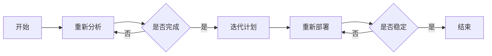
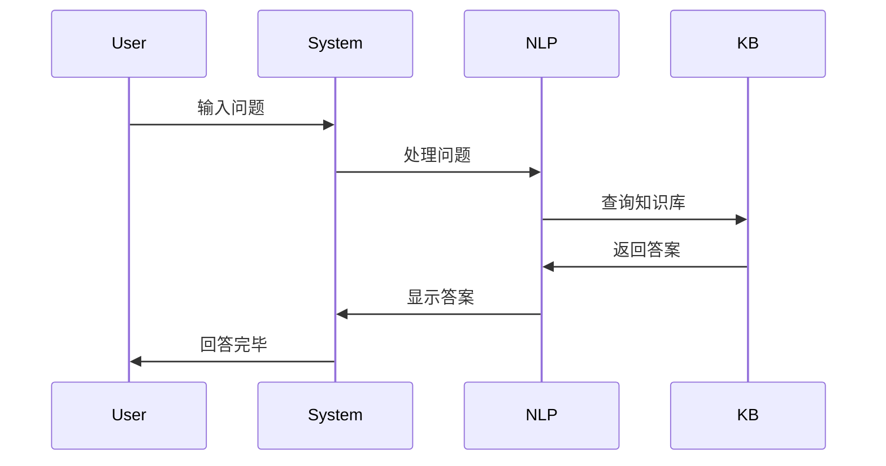
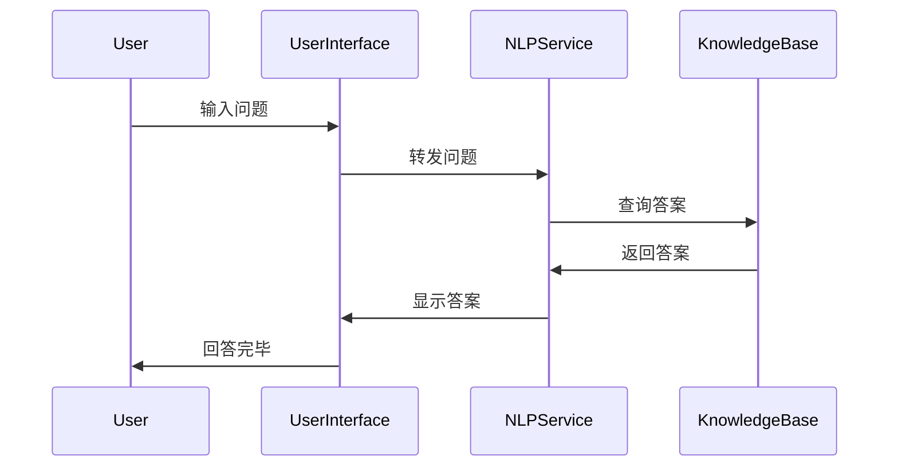

                 

### LLMAgile迭代的逻辑思考

在当今快速变化的技术环境中，Large Language Models（LLM）的应用需求日益增长，从自然语言处理到复杂的信息提取，再到智能客服和内容生成，LLM正逐渐成为各行各业的核心技术。然而，随着LLM应用场景的多样性和复杂性增加，传统的开发模式已经难以满足快速迭代和持续改进的需求。因此，采用敏捷开发方法来制定迭代计划成为了一种有效的解决方案。

#### 第一阶段：背景介绍

首先，我们需要明确什么是LLM以及为何需要敏捷迭代。

**LLM概述**：
LLM是指通过大量数据训练得到的、具备高度语言理解能力的语言模型。近年来，随着深度学习技术的发展，LLM在自然语言处理领域取得了显著的进展。常见的LLM如GPT、BERT等，已经成为许多应用程序的核心组件。

**敏捷迭代的概念**：
敏捷开发是一种软件开发方法，强调迭代、协作和快速响应变化。它通过频繁的交付和反馈循环来确保项目始终符合用户需求和市场变化。

**为何需要敏捷迭代**：
在LLM应用开发中，需求往往快速变化，模型也需要不断优化和调整。敏捷迭代方法能够帮助开发团队更快地适应这些变化，提高开发效率，降低风险。

#### 第二阶段：核心概念与联系

接下来，我们需要深入探讨LLM应用的敏捷迭代计划制定。

**核心概念**：
- **需求分析**：了解用户需求和市场趋势，确定LLM应用的方向。
- **迭代计划**：制定具体的项目里程碑和迭代周期，确保项目有序进行。
- **持续集成与持续部署**：通过自动化测试和部署，确保每次迭代的质量。
- **风险评估**：识别潜在风险，并制定应对策略。

**概念属性特征对比表格**：

| 特征             | 需求分析          | 迭代计划        | 持续集成与持续部署 | 风险评估        |
|------------------|-------------------|-----------------|---------------------|-----------------|
| 目的             | 确定项目方向      | 制定项目计划    | 保证迭代质量       | 识别和应对风险  |
| 方法             | 调研、访谈、分析  | 时间规划、目标设定 | 自动化测试、部署 | 风险评估工具、策略 |
| 结果             | 用户需求文档      | 迭代计划文档    | 部署记录、测试报告 | 风险记录、应对方案 |
| 关键性           | 项目成功的基础    | 项目实施的指南  | 项目稳定的保障    | 项目安全的保障  |

**ER实体关系图架构**：

```mermaid
erDiagram
  User ||--|{ Project }|--| Request : "发起"
  User ||--|{ Risk }|--| Assessment : "评估"
  Project ||--|{ Iteration }|--| Plan : "规划"
  Project ||--|{ Deployment }|--| CI/CD : "持续集成/部署"
  Risk ||--|{ Response }|--| Strategy : "应对策略"
```

#### 第三阶段：算法原理讲解

**算法mermaid流程图**：



**算法原理讲解**：

在LLM敏捷迭代中，算法原理的核心是快速响应需求变化和持续优化模型。以下是详细的算法原理讲解：

1. **需求分析**：首先，通过用户调研和市场分析，确定LLM应用的具体需求和目标。这一步骤需要深入了解用户需求，并将其转化为具体的开发任务。

2. **迭代计划**：根据需求分析结果，制定详细的迭代计划。迭代计划包括里程碑、任务分解、资源和时间安排。通过迭代计划，可以确保项目在规定时间内完成，并且质量得到保障。

3. **持续集成与部署**：在每次迭代结束后，进行自动化测试和部署。这一步骤的目的是确保每次迭代的质量，并且快速将新功能提供给用户。

4. **风险评估**：在每次迭代过程中，识别潜在的风险，并制定应对策略。风险评估是一个持续的过程，需要定期进行，以确保项目在遇到问题时能够快速响应。

5. **迭代优化**：根据用户反馈和模型性能评估，对LLM进行持续优化。这一步骤的目的是提高模型的效果，并满足用户的需求。

**数学模型和公式**：

在LLM敏捷迭代中，常用的数学模型包括回归模型、分类模型和生成模型。以下是这些模型的基本公式：

1. **回归模型**：

   $$y = \beta_0 + \beta_1 \cdot x$$

   其中，\(y\)是预测值，\(\beta_0\)是截距，\(\beta_1\)是斜率，\(x\)是输入变量。

2. **分类模型**：

   $$P(y = 1) = \frac{1}{1 + e^{-(\beta_0 + \beta_1 \cdot x)}}$$

   其中，\(P(y = 1)\)是目标为1的概率，\(\beta_0\)和\(\beta_1\)是参数，\(x\)是输入变量。

3. **生成模型**：

   $$p(x) = \frac{1}{Z} \exp(-E[x])$$

   其中，\(p(x)\)是生成模型概率分布，\(Z\)是归一化常数，\(E[x]\)是期望值。

**举例说明**：

假设我们要开发一个基于GPT的智能客服系统，用户可以通过文字与系统进行交互。以下是这个系统的算法原理和应用：

1. **需求分析**：通过用户调研，我们了解到用户需要一个能够快速回复常见问题的智能客服系统。

2. **迭代计划**：制定迭代计划，包括以下任务：
   - 收集和整理常见问题及其答案。
   - 训练GPT模型，使其能够生成符合用户需求的回答。
   - 开发用户界面，允许用户通过文字与系统交互。

3. **持续集成与部署**：每次迭代结束后，进行自动化测试，确保系统的稳定性和响应速度。

4. **风险评估**：识别潜在的风险，如模型无法生成合适的回答，或者用户界面用户体验差。

5. **迭代优化**：根据用户反馈，持续优化模型，提高回答的准确性和多样性。

通过这种算法原理和应用，我们可以实现一个高效的智能客服系统，满足用户的需求。

#### 第四阶段：系统分析与架构设计方案

**问题场景介绍**：

假设我们正在开发一个企业级的智能客服系统，该系统需要处理大量用户咨询，并提供快速、准确的回答。

**项目介绍**：

项目名称：智能客服系统
项目目标：提供高效、智能的客服服务，提升用户体验。

**系统功能设计**：

1. **用户接口**：允许用户通过文本输入问题，并显示答案。
2. **自然语言处理**：处理用户输入，提取关键信息，生成回答。
3. **知识库管理**：存储常见问题及其答案，以便模型查询和使用。

**系统架构设计**：



**系统接口设计**：

1. **用户接口**：提供RESTful API，允许其他系统访问智能客服服务。
2. **NLP模块**：提供文本处理和语义分析接口。
3. **知识库接口**：提供数据存储和查询接口。

**系统交互mermaid序列图**：



#### 第五阶段：项目实战

**环境安装**：

在开始项目实战之前，需要安装以下软件和工具：

- Python 3.8+
- Jupyter Notebook
- Anaconda
- TensorFlow
- GPT-2模型

**系统核心实现源代码**：

```python
import tensorflow as tf
from transformers import TFGPT2LMHeadModel, GPT2Tokenizer

# 加载预训练的GPT-2模型
tokenizer = GPT2Tokenizer.from_pretrained("gpt2")
model = TFGPT2LMHeadModel.from_pretrained("gpt2")

# 定义输入和输出
inputs = tokenizer.encode("What is the weather like today?", return_tensors="tf")

# 生成回答
outputs = model(inputs, max_length=50, num_return_sequences=1)
predicted_ids = outputs.logits.argmax(-1)

# 解码生成的内容
generated_text = tokenizer.decode(predicted_ids[0], skip_special_tokens=True)
print(generated_text)
```

**代码应用解读与分析**：

这段代码展示了如何使用GPT-2模型生成文本回答。首先，我们加载预训练的GPT-2模型，然后定义输入和输出。通过调用模型，我们可以生成与输入文本相关的回答。

**实际案例分析和详细讲解剖析**：

假设我们有一个用户输入“我需要预订机票”，以下是如何生成回答的详细分析：

1. **输入处理**：用户输入被编码为模型可以理解的格式。
2. **模型推理**：模型基于输入生成可能的回答。
3. **输出处理**：模型生成的回答被解码为可读的文本。

通过这个案例，我们可以看到GPT-2模型如何快速、准确地生成文本回答，这对于智能客服系统来说是非常有用的。

**项目小结**：

通过以上实战案例，我们可以看到如何使用GPT-2模型进行文本生成，并实现一个简单的智能客服系统。这个项目展示了LLM在敏捷迭代中的应用，为后续迭代提供了经验和基础。

### 第六阶段：最佳实践 tips、小结、注意事项、拓展阅读

**最佳实践 tips**：

1. **需求分析**：确保深入了解用户需求，避免需求变化带来的额外工作。
2. **迭代计划**：制定详细的迭代计划，确保每个迭代都有明确的任务和目标。
3. **持续集成与部署**：使用自动化测试和部署，提高开发效率和项目质量。
4. **风险评估**：定期进行风险评估，确保项目能够应对潜在的风险。

**小结**：

本文详细介绍了LLM敏捷迭代的计划制定方法，包括背景介绍、核心概念、算法原理、系统分析与架构设计、项目实战等。通过敏捷迭代，可以快速适应需求变化，提高开发效率。

**注意事项**：

1. **确保需求分析准确**：这是迭代成功的关键。
2. **合理规划迭代周期**：过短的迭代周期可能导致质量下降，过长的迭代周期则可能无法及时响应需求变化。

**拓展阅读**：

1. 《敏捷软件开发：原则、实践与模式》
2. 《大规模语言模型的训练与应用》
3. 《深度学习与自然语言处理》

通过以上内容，我们可以看到，LLM敏捷迭代计划制定是一个系统性的工程，需要充分考虑需求分析、迭代计划、持续集成与部署、风险评估等多个方面。只有通过科学的方法和有效的实施，才能实现LLM应用的快速迭代和持续优化。

### 作者信息

作者：AI天才研究院/AI Genius Institute & 禅与计算机程序设计艺术 /Zen And The Art of Computer Programming

