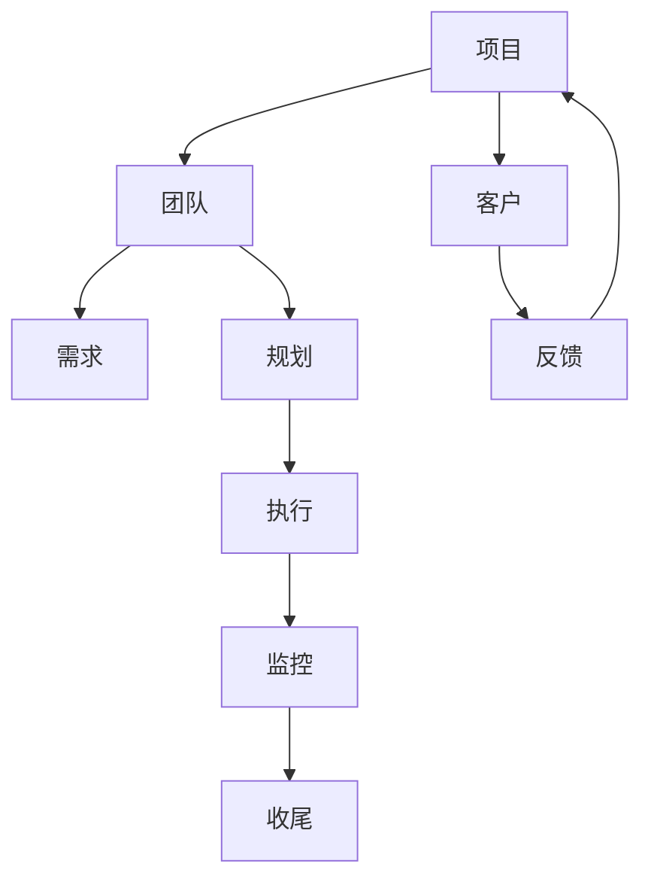

                 

# LLM应用的敏捷项目管理最佳实践

## 摘要

本文旨在探讨大型语言模型（LLM）应用项目的敏捷项目管理最佳实践。随着人工智能和深度学习技术的快速发展，LLM在各个领域得到了广泛应用。然而，LLM在应用过程中面临着项目管理方面的挑战。本文将介绍敏捷管理原理及其在LLM应用项目中的特点，并详细阐述项目规划、项目执行、项目监控与收尾等关键环节的最佳实践方法，以帮助读者掌握高效的项目管理技巧，提升项目成功率。

## 目录大纲

1. 第一部分：引言
   1.1 书籍背景与目标
   1.2 核心概念与联系
   1.3 本书结构

2. 第二部分：LLM应用敏捷项目管理核心概念
   2.1 敏捷管理原理与实践
   2.2 敏捷管理在LLM应用项目中的特点
   2.3 敏捷管理实践

3. 第三部分：项目规划
   3.1 项目目标与范围管理
   3.2 项目范围管理实践
   3.3 项目范围管理实践

4. 第四部分：项目执行
   4.1 项目执行概述
   4.2 项目执行实践

5. 第五部分：项目监控与收尾
   5.1 项目监控
   5.2 项目收尾

## 第一部分：引言

### 1.1 书籍背景与目标

#### 问题背景

随着人工智能（AI）和深度学习技术的快速发展，大型语言模型（LLM）在各个领域得到了广泛应用。从自然语言处理、机器翻译、智能客服到代码自动生成，LLM已经成为提升工作效率、优化业务流程的重要工具。

然而，在LLM应用过程中，项目管理方面的挑战也逐渐凸显。传统的项目管理方法在应对LLM项目的高复杂性、高度自动化和数据驱动特点时，显得力不从心。如何有效地进行LLM应用的敏捷项目管理，成为亟待解决的问题。

#### 问题描述

LLM应用项目的特点包括：

- 高复杂性：LLM模型通常涉及大量的参数和超参数调整，需要进行大量的迭代和优化。
- 高度自动化：LLM应用项目往往依赖于自动化工具和平台，如TensorFlow、PyTorch等，实现模型训练和部署。
- 数据驱动：LLM应用项目的效果很大程度上取决于数据质量和数据量，如何有效地收集、处理和利用数据成为关键。

在上述背景下，传统的项目管理方法难以应对这些挑战。例如，传统的项目规划方法往往假设项目需求是稳定的，而LLM应用项目的需求往往是在不断变化的。此外，传统的项目管理方法侧重于项目执行和控制，而忽略了项目启动和收尾环节的重要性。

#### 问题解决

为了解决上述问题，本文旨在探讨LLM应用的敏捷项目管理最佳实践。敏捷管理作为一种灵活、迭代、协作的方法论，能够有效地应对LLM应用项目的高复杂性、高度自动化和数据驱动特点。本文将介绍敏捷管理原理及其在LLM应用项目中的特点，并详细阐述项目规划、项目执行、项目监控与收尾等关键环节的最佳实践方法，以帮助读者掌握高效的项目管理技巧，提升项目成功率。

#### 边界与外延

本文主要涵盖LLM应用项目的规划、执行、监控和收尾等关键环节，提供实用的方法和工具。具体包括：

- 项目目标设定和范围管理：明确项目目标，确保项目范围清晰。
- 项目团队协作和风险管理：建立高效的团队协作机制，有效控制项目风险。
- 迭代开发和持续改进：采用敏捷迭代方法，持续优化项目。
- 项目监控与评估：实时监控项目进展，确保项目按计划进行。
- 项目收尾与总结：完成项目交付，总结项目经验教训。

#### 概念结构与核心要素组成

LLM应用敏捷项目管理的核心概念和要素包括：

- 敏捷管理：灵活、迭代、协作的方法论，适用于LLM应用项目。
- 项目管理：系统性的规划、执行、监控和收尾过程，确保项目成功。
- LLM应用特点：高复杂性、高度自动化、数据驱动。
- 项目目标：明确的项目目标，指导项目方向。
- 项目范围：清晰的项目范围，确保项目边界。
- 团队协作：高效的团队协作，提升项目效率。
- 风险管理：全面的风险管理，降低项目风险。
- 迭代开发：敏捷迭代方法，持续优化项目。
- 项目监控：实时监控项目进展，确保项目按计划进行。
- 项目收尾：完成项目交付，总结项目经验教训。

## 第一部分：引言

### 1.2 核心概念与联系

#### 核心概念

本文的核心概念包括敏捷管理、项目管理和LLM应用特点。以下是对这三个核心概念的简要介绍：

1. **敏捷管理**：敏捷管理是一种灵活、迭代、协作的方法论，旨在快速响应变化，提高项目成功率。敏捷管理强调用户满意度、快速迭代、持续交付、团队协作和响应变化等核心原则。

2. **项目管理**：项目管理是一种系统性的规划、执行、监控和收尾过程，旨在确保项目按照预定目标顺利完成。项目管理包括项目目标设定、项目范围管理、项目团队协作、项目风险管理、项目执行、项目监控和项目收尾等关键环节。

3. **LLM应用特点**：LLM应用特点包括高复杂性、高度自动化、数据驱动等。高复杂性源于LLM模型的参数和超参数调整需求；高度自动化得益于现代深度学习框架和平台的广泛应用；数据驱动则强调了数据质量和数据量对LLM应用效果的重要性。

#### 概念属性特征对比表格

| 特点             | 敏捷管理                | 项目管理                 | LLM应用特点               |
|----------------|---------------------|----------------------|---------------------|
| 方法论         | 灵活、迭代、协作         | 系统性、计划性、执行性       | 高复杂性、高度自动化、数据驱动   |
| 目标           | 满足客户需求、快速响应     | 完成预定目标、提高效率       | 实现语言理解与生成            |
| 适用场景         | 变更频繁、需求不确定       | 目标明确、资源有限         | 语言处理领域                |
| 核心原则         | 用户满意度、快速迭代、持续交付、团队协作、响应变化 | 项目目标实现、资源优化、风险管理、质量保证 | 高复杂性应对、模型优化、数据利用 |

#### ER实体关系图架构的 Mermaid 流程图

### 1.3 本书结构

本书共分为五个部分，包括引言、LLM应用敏捷项目管理核心概念、项目规划、项目执行、项目监控与收尾。每部分均包含相关章节，详细介绍各个方面的最佳实践和方法。

1. **引言**：介绍LLM应用项目管理背景、核心概念和本书结构。
2. **LLM应用敏捷项目管理核心概念**：阐述敏捷管理原理及其在LLM应用项目中的特点，介绍核心概念和要素。
3. **项目规划**：详细讨论项目目标与范围管理、项目范围管理实践。
4. **项目执行**：介绍项目执行概述和项目执行实践。
5. **项目监控与收尾**：讨论项目监控和项目收尾的重要性，介绍具体方法。

通过本书，读者可以系统性地了解并掌握LLM应用的敏捷项目管理技巧，提升项目成功率。

## 第二部分：LLM应用敏捷项目管理核心概念

### 2.1 敏捷管理原理与实践

#### 2.1.1 敏捷管理概述

敏捷管理是一种以用户为中心、灵活应对变化的软件开发方法论。其核心理念是快速迭代、持续交付和高效协作。敏捷管理强调在项目开发过程中，与客户的紧密沟通和反馈，以确保最终交付的产品能够真正满足用户需求。

敏捷管理的历史可以追溯到2001年，当时由17位软件工程师在一次会议上共同发布了《敏捷宣言》。此后，敏捷管理方法在全球范围内得到了广泛的应用和推广。从敏捷开发到敏捷管理，敏捷管理方法不断演变和完善，形成了多种实践方式，如Scrum、Kanban、看板等。

敏捷管理的核心原则包括：

1. **用户满意度**：以满足用户需求为目标，快速响应市场变化。
2. **快速迭代**：通过持续迭代和交付，逐步实现项目目标。
3. **持续交付**：确保项目交付物的质量，实现持续交付。
4. **团队协作**：鼓励团队成员之间的沟通和协作，提高团队效率。
5. **响应变化**：面对项目中的不确定性，灵活调整计划和策略。

#### 2.1.2 敏捷管理在LLM应用项目中的特点

LLM应用项目具有高复杂性、高度自动化和数据驱动等特点，使得传统的项目管理方法难以应对。而敏捷管理因其灵活、迭代、协作的特点，能够更好地适应这些挑战。

1. **高复杂性**：LLM模型涉及大量的参数和超参数调整，需要进行大量的迭代和优化。敏捷管理通过迭代开发和快速反馈，帮助团队在不断调整和优化的过程中，逐步实现项目目标。

2. **高度自动化**：现代深度学习框架和平台（如TensorFlow、PyTorch等）为LLM应用项目的自动化提供了强大支持。敏捷管理通过自动化工具和技术，如持续集成和持续部署，确保项目交付物的质量和效率。

3. **数据驱动**：LLM应用项目的效果很大程度上取决于数据质量和数据量。敏捷管理通过持续的数据分析和反馈，帮助团队优化模型，提升应用效果。

#### 2.1.3 敏捷管理实践

敏捷管理的实践主要包括以下几个方面：

1. **Scrum**：Scrum是一种流行的敏捷管理实践方法，强调迭代开发和团队协作。Scrum包括三个核心角色（产品负责人、Scrum Master和开发团队）、四个核心事件（冲刺计划会、每日站会、冲刺评审会和冲刺回顾会）和五个核心 artifacts（产品待办列表、冲刺待办列表、冲刺板、产品增量和管理看板）。

2. **Kanban**：Kanban是一种基于可视化流程管理的敏捷管理方法，强调持续交付和效率优化。Kanban通过看板（Kanban板）可视化任务流程，帮助团队识别瓶颈和优化流程。

3. **看板**：看板是一种用于可视化任务流程的工具，通常包含多个列，如“待办”、“进行中”、“待测试”和“已完成”。团队成员可以在看板上更新任务状态，以便其他成员了解任务进展。

4. **迭代开发**：迭代开发是一种分阶段、分批次实现项目功能的方法。每个迭代周期包括需求分析、设计、开发、测试和部署等阶段。通过迭代开发，团队可以逐步完善项目功能，确保项目质量和进度。

5. **自动化工具**：自动化工具（如Jenkins、Docker等）在敏捷管理中发挥着重要作用。通过自动化工具，团队可以实现持续集成、持续部署和自动化测试，提高项目交付物的质量和效率。

#### 2.1.4 敏捷管理实践案例

以下是一个敏捷管理在LLM应用项目中的实际案例：

某公司计划开发一款基于大型语言模型（LLM）的智能客服系统。项目团队采用Scrum方法进行项目管理和迭代开发。在项目启动阶段，产品负责人与客户进行了多次沟通，明确了项目目标和需求。在冲刺计划会中，团队将需求划分为若干个迭代周期，并确定每个迭代周期的目标。

在第一个迭代周期中，团队完成了需求分析、设计和开发工作，并进行了内部测试。在冲刺评审会中，团队向客户展示了初步成果，并收集了客户的反馈。根据客户的反馈，团队对模型进行了优化和调整，并在第二个迭代周期中重新测试和部署。

通过迭代开发和客户反馈，团队逐步完善了智能客服系统的功能，最终成功交付了一个高性能、高质量的智能客服系统。整个项目过程中，团队保持了高效的沟通和协作，确保项目按计划进行。

### 2.2 敏捷管理在LLM应用项目中的特点

#### 2.2.1 高复杂性

LLM应用项目的一个显著特点是其高复杂性。大型语言模型通常涉及数十亿甚至数千亿的参数，这些参数需要进行精细调整以实现最佳性能。此外，LLM应用项目中的模型训练和优化过程往往需要大量的计算资源和时间。因此，如何高效地处理这些复杂性成为项目管理的挑战之一。

敏捷管理通过迭代开发和持续优化，有助于应对这种高复杂性。在迭代过程中，团队可以逐步识别和解决模型中的问题，不断改进模型性能。同时，敏捷管理强调快速反馈和调整，使团队能够迅速响应项目中的变化和挑战，确保项目顺利进行。

#### 2.2.2 高度自动化

现代深度学习框架和平台（如TensorFlow、PyTorch等）提供了丰富的自动化工具和功能，使得LLM应用项目的自动化程度大大提高。这些自动化工具可以帮助团队实现模型训练、优化、测试和部署的自动化，从而提高项目的效率和质量。

敏捷管理充分借鉴了这些自动化工具的优势，通过持续集成和持续部署（CI/CD）等方法，实现项目流程的自动化。在敏捷管理实践中，团队可以使用Jenkins、Docker等工具，自动化地构建、测试和部署模型。这不仅可以减少手动操作和错误，还可以提高项目的交付速度和质量。

#### 2.2.3 数据驱动

数据驱动是LLM应用项目的另一个重要特点。大型语言模型的效果很大程度上取决于训练数据的质量和数量。因此，如何收集、处理和利用数据成为项目成功的关键因素。

敏捷管理通过持续的数据分析和反馈，帮助团队优化模型性能。在项目过程中，团队可以实时监控数据质量，识别数据中的问题，并采取相应措施进行改进。此外，敏捷管理还鼓励团队与数据科学家和分析师紧密合作，共同分析和利用数据，以提高模型效果。

#### 2.2.4 需求多变

LLM应用项目的需求往往具有较高的不确定性，可能在项目进行过程中发生较大变化。这种需求多变的特点对项目管理提出了更高的要求。

敏捷管理通过迭代开发和快速反馈，能够更好地应对需求变化。在迭代过程中，团队可以灵活调整项目计划和策略，以适应需求变化。同时，敏捷管理强调与客户的紧密沟通和协作，确保项目需求能够及时更新和反馈，从而提高项目的成功率。

#### 2.2.5 团队协作

在LLM应用项目中，团队协作至关重要。大型语言模型的训练和优化过程通常需要多个团队成员的协作，包括数据科学家、软件工程师、产品经理等。因此，如何建立高效的团队协作机制，成为项目成功的关键因素之一。

敏捷管理通过强调团队协作和沟通，有助于提高团队效率和项目成功率。在敏捷管理实践中，团队可以通过每日站会、冲刺评审会和冲刺回顾会等会议形式，保持密切的沟通和协作。此外，敏捷管理还鼓励团队成员之间的知识分享和协作，以促进项目的顺利进行。

### 2.3 敏捷管理实践

#### 2.3.1 工具与技术

在LLM应用项目中，敏捷管理的实践需要借助一系列工具和技术。以下是一些常用的工具和技术：

1. **Scrum**：Scrum是一种流行的敏捷管理实践方法，适用于项目规划和团队协作。Scrum包括三个核心角色（产品负责人、Scrum Master和开发团队）、四个核心事件（冲刺计划会、每日站会、冲刺评审会和冲刺回顾会）和五个核心 artifacts（产品待办列表、冲刺待办列表、冲刺板、产品增量和管理看板）。

2. **Kanban**：Kanban是一种基于可视化流程管理的敏捷管理方法，适用于持续交付和效率优化。Kanban通过看板（Kanban板）可视化任务流程，帮助团队识别瓶颈和优化流程。

3. **持续集成（CI）**：持续集成是一种自动化构建和测试方法，用于确保代码库的一致性和稳定性。CI工具（如Jenkins、GitLab CI等）可以帮助团队自动化地构建、测试和部署模型。

4. **持续部署（CD）**：持续部署是一种自动化部署方法，用于确保模型部署的快速和可靠。CD工具（如Docker、Kubernetes等）可以帮助团队自动化地部署和管理模型。

5. **自动化测试**：自动化测试是一种用于验证模型性能和功能的方法。自动化测试工具（如Selenium、PyTest等）可以帮助团队自动化地执行测试用例，确保模型质量。

6. **版本控制**：版本控制是一种用于管理代码变更的方法。版本控制工具（如Git、SVN等）可以帮助团队协作、代码回滚和管理代码库。

#### 2.3.2 流程

敏捷管理在LLM应用项目中的流程通常包括以下步骤：

1. **项目启动**：项目启动是项目管理的第一步，包括项目目标的确定、项目范围的界定、项目团队的组建和项目资源的配置。

2. **需求分析**：在项目启动阶段，团队需要对项目需求进行深入分析，明确项目功能、性能和用户体验等要求。

3. **迭代规划**：在需求分析的基础上，团队需要制定迭代计划，包括每个迭代周期的目标、任务和里程碑。

4. **迭代执行**：在迭代执行阶段，团队按照迭代计划进行任务分配、开发、测试和交付。

5. **迭代评审**：在迭代评审阶段，团队对已完成的功能进行验收和反馈，评估迭代目标的达成情况，为下一迭代做准备。

6. **持续改进**：在项目过程中，团队需要不断收集用户反馈、分析数据，并根据反馈和数据分析结果进行模型优化和改进。

7. **项目收尾**：在项目收尾阶段，团队对项目成果进行总结和评估，编写项目报告，归档项目文档，确保项目顺利结束。

#### 2.3.3 案例分析

以下是一个LLM应用项目中的敏捷管理实践案例：

某公司计划开发一款基于大型语言模型（LLM）的智能问答系统。项目团队采用Scrum方法进行项目管理和迭代开发。在项目启动阶段，团队明确了项目目标和需求，并确定了项目范围和资源。

在第一个迭代周期中，团队完成了需求分析、设计和开发工作，并进行了内部测试。在冲刺评审会中，团队向客户展示了初步成果，并收集了客户的反馈。根据客户的反馈，团队对模型进行了优化和调整，并在第二个迭代周期中重新测试和部署。

通过迭代开发和客户反馈，团队逐步完善了智能问答系统的功能，最终成功交付了一个高性能、高质量的智能问答系统。整个项目过程中，团队保持了高效的沟通和协作，确保项目按计划进行。

## 第三部分：项目规划

### 3.1 项目目标与范围管理

#### 3.1.1 项目目标设定

项目目标设定是项目规划过程中的关键环节，它直接关系到项目的成功与否。项目目标应具有明确性、可衡量性、可实现性、相关性和时限性（SMART原则）。

1. **明确性**：项目目标必须具体、清晰，避免模糊不清。例如，“开发一款智能问答系统”不如“开发一款能够处理用户提问并提供准确回答的智能问答系统”具体。
   
2. **可衡量性**：项目目标应具备可量化或可评估的指标，以便于在项目过程中进行跟踪和评估。例如，“系统响应时间少于1秒”就是一个可衡量的目标。

3. **可实现性**：项目目标必须符合项目团队的资源、能力和时间限制。设定过于理想化的目标可能会导致项目失败。

4. **相关性**：项目目标应与项目的整体目标和战略保持一致，确保项目能够为企业或组织带来实际价值。

5. **时限性**：项目目标应设置明确的完成时间，以便于团队进行进度管理和时间规划。

#### 3.1.2 项目范围管理

项目范围管理是确保项目团队明确了解项目需要完成的工作内容和目标，同时避免范围蔓延的重要过程。项目范围管理主要包括以下步骤：

1. **项目范围规划**：在项目启动阶段，团队需要制定项目范围管理计划，明确项目目标、可交付成果、项目边界和排除内容。

2. **项目范围定义**：通过项目范围说明书，详细描述项目的具体范围，包括项目需要完成的工作内容、项目边界、可交付成果和项目排除内容。

3. **项目范围确认**：在项目执行过程中，项目团队和利益相关者需要共同确认项目范围的准确性和完整性，确保项目按照既定的范围进行。

4. **项目范围控制**：项目范围控制旨在确保项目范围内的变更得到有效管理，避免范围蔓延和项目风险。

### 3.2 项目范围管理实践

#### 3.2.1 制定项目范围说明书

项目范围说明书是项目范围管理的重要文档，它详细描述了项目的具体范围，包括项目目标、可交付成果、项目边界和排除内容。以下是制定项目范围说明书的关键步骤：

1. **确定项目目标**：明确项目的最终目标，确保项目目标与企业的整体战略和利益相关者的期望一致。

2. **定义项目边界**：明确项目的边界，包括项目的起点和终点，以及项目所涉及的领域和活动。

3. **确定可交付成果**：列出项目需要完成的具体可交付成果，如软件模块、文档报告、系统测试结果等。

4. **明确排除内容**：明确项目不包括的工作内容，避免项目范围蔓延。

5. **获取利益相关者确认**：在项目范围说明书完成之后，与利益相关者进行沟通，确保他们对项目范围的理解和认同。

#### 3.2.2 管理项目变更

在项目执行过程中，需求变化在所难免。项目范围管理的关键在于有效地管理这些变更，确保项目目标不变，同时尽可能地减少变更带来的风险和影响。

1. **变更控制流程**：制定明确的变更控制流程，包括变更请求的提交、评估、批准和实施。

2. **变更评估**：对每个变更请求进行详细评估，包括变更的影响范围、成本、时间和资源等方面。

3. **变更审批**：根据变更评估结果，由项目经理或变更控制委员会审批变更，确保变更符合项目目标和利益相关者的期望。

4. **变更实施**：在获得批准后，及时实施变更，并确保变更不会对项目的其他方面产生负面影响。

#### 3.2.3 项目范围管理工具与技术

在项目范围管理过程中，可以借助以下工具和技术：

1. **工作分解结构（WBS）**：WBS是一种用于分解项目工作包的工具，有助于项目团队明确项目的具体任务和责任。

2. **项目范围文档**：项目范围文档包括项目范围说明书、范围确认记录和变更日志等，是项目范围管理的重要依据。

3. **项目管理软件**：如Microsoft Project、Jira等，这些软件可以帮助项目团队更好地进行项目范围管理和跟踪。

4. **范围蔓延监控**：通过定期审查项目进展和范围文档，及时发现和解决范围蔓延问题。

### 3.3 项目范围管理实践

#### 3.3.1 项目范围说明书实例

以下是一个项目范围说明书的实例：

**项目名称**：智能问答系统开发

**项目目标**：开发一款基于大型语言模型（LLM）的智能问答系统，能够处理用户提问并提供准确回答。

**项目范围**：

- **可交付成果**：
  - 完整的智能问答系统
  - 用户手册
  - 系统测试报告
  - 维护和支持计划
- **项目边界**：
  - 系统功能范围：包括问答功能、知识库管理、用户界面等
  - 技术实现：基于Python和TensorFlow框架
  - 时间范围：从项目启动到2024年12月31日
- **排除内容**：
  - 语音识别功能
  - 实时聊天功能
  - 大规模用户数据存储

**变更控制流程**：

- **变更请求提交**：任何利益相关者如需对项目范围进行变更，需填写变更请求表单。
- **变更评估**：项目经理或变更控制委员会对变更请求进行评估，包括变更的影响范围、成本和时间。
- **变更审批**：经评估后，由项目经理或变更控制委员会审批变更，确保变更符合项目目标和利益相关者的期望。
- **变更实施**：在获得批准后，及时实施变更，并确保变更不会对项目的其他方面产生负面影响。

通过上述项目范围管理实践，项目团队可以确保项目目标的明确性、项目范围的清晰性，以及变更管理的有效性，从而提高项目的成功率和客户满意度。

## 第四部分：项目执行

### 4.1 项目执行概述

项目执行是项目生命周期中最为关键的阶段，它将项目规划转化为实际的成果。在这个阶段，项目团队按照既定的计划和策略，将项目范围说明书中的可交付成果逐步实现。项目执行的成功与否直接影响到项目的最终交付质量和客户满意度。以下是对项目执行阶段的重要环节的概述：

#### 项目启动会议

项目启动会议是项目执行的开始，旨在明确项目目标和任务，确保所有项目团队成员对项目目标和预期成果有清晰的理解。在会议中，项目经理会详细介绍项目背景、项目目标、项目范围、资源分配、时间表、风险评估等方面的内容，并讨论项目团队的职责和沟通机制。

#### 任务分配与团队协作

在项目启动会议之后，项目经理将项目任务分解为若干个子任务，并分配给相应的团队成员。任务分配应考虑到团队成员的技能、经验和兴趣，以确保任务的高效完成。项目执行过程中，团队协作至关重要，团队成员需要保持良好的沟通和协作，共同解决项目中遇到的问题。

#### 迭代开发与持续集成

敏捷管理强调迭代开发和持续集成，项目执行阶段通常分为多个迭代周期。每个迭代周期包括需求分析、设计、开发、测试和部署等环节。通过迭代开发，项目团队能够逐步实现项目目标，并随时根据客户反馈进行调整。持续集成是确保代码库一致性、稳定性和质量的重要手段，通过自动化构建、测试和部署，项目团队能够快速发现并修复代码问题。

#### 风险管理与问题解决

在项目执行过程中，风险管理和问题解决是必不可少的。项目团队需要识别项目中的潜在风险，制定相应的风险应对策略，并定期进行风险评估。同时，项目团队应建立问题解决机制，及时识别和解决项目执行中的问题，确保项目按计划进行。

#### 检查与调整

在项目执行过程中，项目经理需要定期检查项目进展，与团队成员和利益相关者进行沟通，确保项目按计划进行。如果发现项目偏离计划，项目经理应采取相应的调整措施，以确保项目能够按时完成。

### 4.2 项目执行实践

#### 4.2.1 任务分配与团队协作

任务分配是项目执行的关键环节，合理的任务分配可以提高团队的工作效率，确保项目目标的实现。以下是一些任务分配和团队协作的最佳实践：

1. **任务分解**：将项目任务分解为具体的工作包，明确每个工作包的责任人和完成时间。

2. **技能匹配**：根据团队成员的技能和经验，将任务分配给最适合的人员。确保每个团队成员都能够充分发挥自己的优势。

3. **明确职责**：明确每个团队成员的职责和任务，确保每个人都清楚自己的角色和责任。

4. **沟通机制**：建立有效的沟通机制，确保团队成员之间的信息畅通，及时解决问题。

5. **协作工具**：使用协作工具（如Slack、Microsoft Teams、Jira等），方便团队成员之间的沟通和协作。

#### 4.2.2 迭代开发与持续集成

迭代开发是敏捷管理的重要实践之一，通过分阶段实现项目功能，项目团队能够更好地适应需求变化，提高项目成功率。以下是一些迭代开发和持续集成的最佳实践：

1. **迭代计划**：在每个迭代周期开始前，制定详细的迭代计划，包括需求分析、设计、开发、测试和部署等环节。

2. **需求管理**：及时收集和分析用户需求，确保需求在迭代过程中得到充分满足。

3. **代码审查**：在开发过程中，进行代码审查和测试，确保代码质量。

4. **自动化测试**：使用自动化测试工具，如Selenium、PyTest等，进行功能测试和性能测试。

5. **持续集成**：通过持续集成工具（如Jenkins、GitLab CI等），实现自动化构建、测试和部署，确保代码库的一致性和稳定性。

6. **迭代回顾**：在每个迭代周期结束后，进行迭代回顾，总结经验教训，持续改进项目执行过程。

#### 4.2.3 风险管理与问题解决

项目执行过程中，风险管理和问题解决至关重要。以下是一些风险管理和问题解决的最佳实践：

1. **风险识别**：在项目启动阶段，识别项目中的潜在风险，包括技术风险、人员风险、资源风险等。

2. **风险评估**：对识别出的风险进行评估，确定风险的概率和影响，制定相应的应对策略。

3. **风险监控**：在项目执行过程中，定期监控风险状态，及时调整应对策略。

4. **问题解决**：建立问题解决机制，确保项目团队能够及时识别和解决项目中遇到的问题。

5. **持续改进**：通过定期回顾和总结，持续改进项目执行过程，降低风险和问题发生的概率。

### 4.3 项目执行案例分析

以下是一个项目执行案例分析：

某公司计划开发一款基于大型语言模型（LLM）的智能客服系统。项目团队采用敏捷管理方法进行项目执行，分为多个迭代周期。

在第一个迭代周期中，项目团队完成了以下工作：

1. **需求分析**：与客户沟通，明确智能客服系统的主要功能和技术要求。

2. **设计**：根据需求分析结果，设计系统的架构和功能模块。

3. **开发**：按照设计文档，进行系统的开发工作，包括前端的用户界面和后端的语言模型训练。

4. **测试**：进行功能测试和性能测试，确保系统满足需求。

5. **部署**：将系统部署到客户的测试环境，进行实际测试。

在迭代评审会中，项目团队向客户展示了初步成果，并收集了客户的反馈。根据客户的反馈，项目团队对系统进行了优化和调整，并在后续的迭代周期中继续进行测试和部署。

在整个项目执行过程中，项目团队保持了良好的沟通和协作，及时识别和解决了项目中遇到的问题。通过迭代开发和持续集成，项目团队能够快速响应客户需求，确保系统的高质量和高性能。

最终，项目团队在预定的时间内成功交付了智能客服系统，并得到了客户的高度评价。这个案例展示了敏捷管理方法在LLM应用项目执行中的有效性和优势。

## 第五部分：项目监控与收尾

### 5.1 项目监控

项目监控是确保项目按计划执行和达成预期目标的关键环节。在项目执行过程中，项目团队需要定期监控项目进展、资源使用、成本控制和质量保证等方面，以确保项目顺利进行。以下是一些项目监控的最佳实践：

#### 项目进度监控

项目进度监控是确保项目按计划进行的关键。项目团队可以使用项目管理工具（如Microsoft Project、Jira等）来跟踪项目进度，定期更新任务状态，确保项目按时完成。以下是一些监控项目进度的最佳实践：

1. **制定详细的进度计划**：在项目启动阶段，制定详细的进度计划，明确每个任务的开始和结束时间，以及关键里程碑。

2. **定期更新任务状态**：项目团队应定期更新任务状态，确保每个任务的进度都得到及时更新。

3. **监控关键里程碑**：关注关键里程碑的达成情况，确保项目按计划推进。

4. **识别和解决偏差**：如果发现项目进度出现偏差，及时识别原因，采取相应措施进行调整。

#### 资源使用监控

资源使用监控是确保项目资源合理分配和有效利用的关键。项目团队需要监控项目资源的使用情况，包括人力、设备、资金等。以下是一些资源使用监控的最佳实践：

1. **制定资源使用计划**：在项目启动阶段，制定详细的资源使用计划，明确每个任务的资源需求。

2. **监控资源使用情况**：定期监控资源使用情况，确保资源得到合理分配和有效利用。

3. **调整资源分配**：如果发现资源使用出现瓶颈或资源浪费，及时调整资源分配策略。

4. **预算控制**：确保项目预算得到有效控制，避免超支。

#### 成本控制

成本控制是确保项目在经济范围内完成的关键。项目团队需要监控项目成本，确保项目在预算范围内完成。以下是一些成本控制的最佳实践：

1. **制定详细的预算计划**：在项目启动阶段，制定详细的预算计划，明确项目的总预算和每个阶段的预算。

2. **监控成本支出**：定期监控成本支出，确保项目成本在预算范围内。

3. **成本分析与报告**：定期进行成本分析，报告项目成本情况，识别成本节约的机会。

4. **成本调整**：如果发现成本超支，及时采取调整措施，确保项目在预算范围内完成。

#### 质量保证

质量保证是确保项目交付成果满足预期要求的关键。项目团队需要监控项目质量，确保项目交付物的质量得到保证。以下是一些质量保证的最佳实践：

1. **制定质量计划**：在项目启动阶段，制定详细的质量计划，明确项目的质量标准和质量控制措施。

2. **质量评审**：定期进行质量评审，确保项目交付物的质量。

3. **缺陷管理**：建立缺陷管理机制，及时发现和解决项目中的缺陷。

4. **持续改进**：通过持续改进，不断提高项目质量。

### 5.2 项目收尾

项目收尾是项目生命周期的最后一个阶段，标志着项目的正式结束。项目收尾阶段主要包括以下工作：

#### 项目交付

项目交付是将项目成果正式移交给客户或用户的过程。在项目收尾阶段，项目团队需要确保项目交付物符合预期要求，并通过客户验收。以下是一些项目交付的最佳实践：

1. **准备交付物**：确保所有项目交付物已经完成，包括软件系统、用户手册、测试报告等。

2. **客户验收**：与客户进行沟通，确保项目交付物满足客户需求，并进行客户验收。

3. **交付文档**：整理项目交付文档，包括项目范围说明书、项目计划、项目报告等，以便于项目总结和归档。

#### 项目总结

项目总结是对项目全过程的回顾和评估，有助于总结项目经验教训，为未来项目提供参考。以下是一些项目总结的最佳实践：

1. **项目回顾**：组织项目团队进行项目回顾会议，总结项目成功经验和不足之处。

2. **经验教训**：记录项目过程中的成功经验和教训，为未来项目提供参考。

3. **项目报告**：编写项目总结报告，包括项目概况、项目执行情况、项目成果和项目评估等。

#### 项目文档归档

项目文档归档是将项目相关文档进行整理和归档的过程，以便于未来查阅和参考。以下是一些项目文档归档的最佳实践：

1. **整理文档**：将项目过程中产生的文档进行整理，确保文档完整、准确。

2. **分类归档**：根据文档的类型和内容，进行分类归档，便于查找和管理。

3. **电子文档归档**：将文档电子化，存储在项目文档库中，方便团队成员随时查阅。

### 5.3 项目监控与收尾案例分析

以下是一个项目监控与收尾案例分析：

某公司计划开发一款基于大型语言模型（LLM）的智能客服系统。项目团队采用敏捷管理方法进行项目监控与收尾，分为多个迭代周期。

在项目执行过程中，项目团队定期监控项目进度、资源使用、成本控制和项目质量，确保项目按计划进行。在迭代周期结束后，项目团队进行迭代回顾，总结经验教训，并不断优化项目执行过程。

在项目收尾阶段，项目团队完成了以下工作：

1. **项目交付**：与客户进行沟通，确保智能客服系统满足客户需求，并通过客户验收。

2. **项目总结**：组织项目团队进行项目回顾会议，总结项目成功经验和不足之处，记录项目经验教训。

3. **项目文档归档**：整理项目过程中产生的文档，进行分类归档，并将文档电子化，存储在项目文档库中。

最终，项目团队在预定的时间内成功完成了智能客服系统的开发，并得到了客户的高度评价。通过有效的项目监控与收尾，项目团队确保了项目的成功交付，积累了宝贵的项目经验。

## 总结与展望

本文从引言、LLM应用敏捷项目管理核心概念、项目规划、项目执行、项目监控与收尾五个部分，详细探讨了LLM应用的敏捷项目管理最佳实践。通过本文的探讨，我们可以得出以下结论：

1. **敏捷管理在LLM应用项目中的应用**：敏捷管理因其灵活、迭代、协作的特点，能够有效应对LLM应用项目的高复杂性、高度自动化和数据驱动特点，提高项目的成功率。

2. **项目目标与范围管理的重要性**：明确的项目目标和范围管理是确保项目顺利进行的关键，有助于项目团队聚焦核心任务，避免范围蔓延。

3. **迭代开发和持续集成在项目执行中的优势**：通过迭代开发和持续集成，项目团队能够快速响应需求变化，提高项目交付物的质量和效率。

4. **项目监控与收尾的必要性**：项目监控与收尾是确保项目按计划完成和成功交付的重要环节，有助于识别和解决问题，积累项目经验。

展望未来，随着人工智能和深度学习技术的不断发展，LLM应用项目将更加广泛和复杂。敏捷项目管理方法将在LLM应用项目中发挥更大的作用，帮助项目团队应对不断变化的需求和挑战。同时，项目团队需要持续学习和优化项目管理实践，提高项目的成功率和客户满意度。

## 最佳实践 Tips

1. **明确项目目标和范围**：在项目启动阶段，确保项目目标和范围得到明确和确认，避免项目执行过程中出现范围蔓延。

2. **充分利用敏捷管理工具**：采用Scrum、Kanban等敏捷管理工具，提高团队协作效率和项目交付速度。

3. **定期进行迭代回顾**：在每次迭代结束后，及时进行迭代回顾，总结经验教训，持续优化项目执行过程。

4. **加强风险管理和问题解决**：在项目执行过程中，建立有效的风险管理和问题解决机制，确保项目按计划进行。

5. **保持与客户的紧密沟通**：与客户保持密切沟通，确保项目交付物满足客户需求，提高客户满意度。

## 注意事项

1. **避免项目范围蔓延**：在项目执行过程中，严格把控项目范围，避免项目范围蔓延导致项目延期和超支。

2. **确保团队协作**：建立高效的团队协作机制，确保团队成员之间的沟通和协作，提高项目效率。

3. **及时监控项目进展**：定期监控项目进展，及时发现和解决问题，确保项目按计划进行。

## 拓展阅读

1. 《敏捷实践指南》（Dean Leffingwell著）：详细介绍了敏捷管理的方法和实践，适用于各种类型的项目。
2. 《敏捷项目管理》（Michael Jackson著）：深入探讨了敏捷管理在项目管理中的应用，提供了实用的方法和技巧。
3. 《大型语言模型：原理、架构与应用》（宗成庆著）：介绍了大型语言模型的基本原理、架构和应用，为LLM应用项目提供了理论基础。

## 作者

作者：AI天才研究院/AI Genius Institute & 禅与计算机程序设计艺术 /Zen And The Art of Computer Programming

感谢您的阅读，希望本文对您在LLM应用项目管理方面有所启发和帮助。如果您有任何疑问或建议，欢迎在评论区留言交流。

