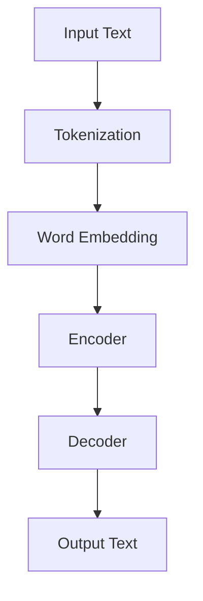
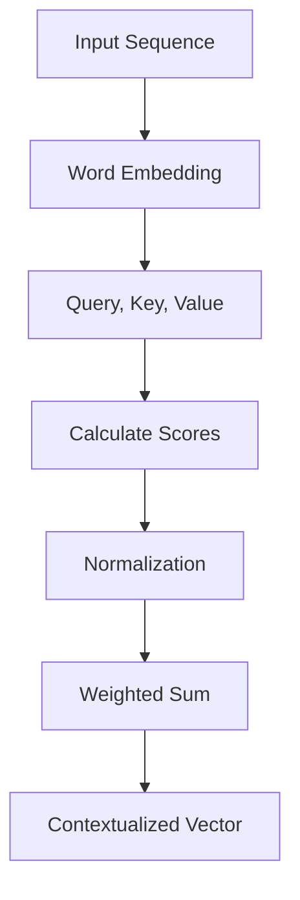
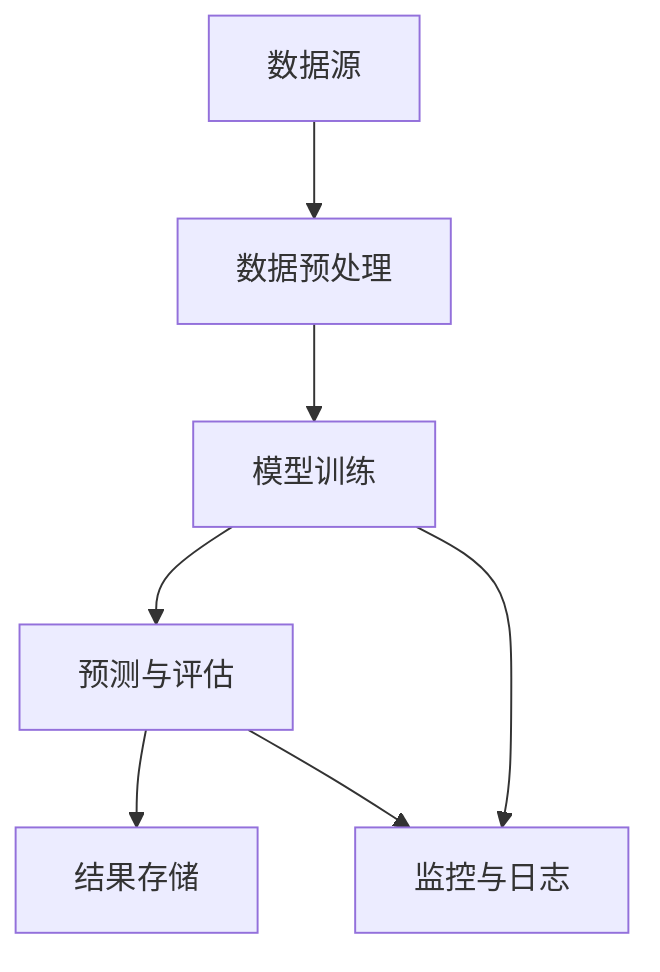
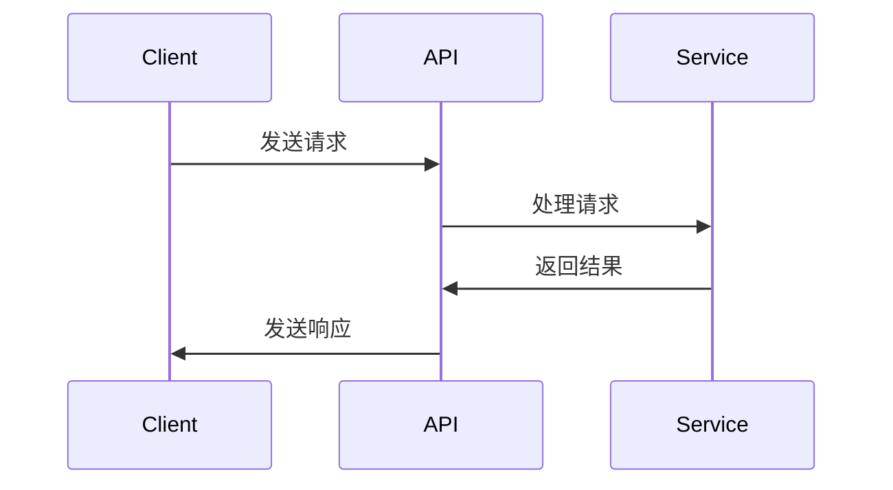

                 

### 文章标题

LLM环境模拟与预测能力评估方案

关键词：LLM，环境模拟，预测能力，评估方法，算法原理

摘要：本文深入探讨了大型语言模型（LLM）在环境模拟与预测能力评估方面的应用。通过详细的背景介绍、核心概念解析、算法原理讲解、数学模型阐述、系统分析与架构设计、项目实战以及最佳实践等环节，系统性地构建了LLM环境模拟与预测能力评估的完整方案。文章旨在为研究者与开发者提供一份全面、系统的指导，以促进LLM技术在各个领域的应用与发展。

---

### 目录

#### 第一部分：背景与基础

1. [LLM环境模拟与预测概述](#llm环境模拟与预测概述)
2. [LLM环境模拟的关键技术](#llm环境模拟的关键技术)
3. [预测能力评估方法](#预测能力评估方法)

#### 第二部分：算法原理与模型设计

4. [LLM算法原理详解](#llm算法原理详解)
5. [数学模型与公式解析](#数学模型与公式解析)

#### 第三部分：系统分析与架构设计

6. [LLM系统架构设计](#llm系统架构设计)
7. [项目实战](#项目实战)

#### 第四部分：最佳实践与拓展

8. [最佳实践](#最佳实践)
9. [小结与拓展](#小结与拓展)

---

### LLM环境模拟与预测概述

#### 1.1 问题背景与核心概念

在当今数据驱动时代，人工智能（AI）技术飞速发展，尤其是大型语言模型（LLM，如GPT、BERT等）的问世，极大地推动了自然语言处理（NLP）领域的进步。LLM具备处理和理解复杂语言信息的能力，在文本生成、机器翻译、情感分析等领域表现出色。然而，如何评估LLM在特定环境下的模拟与预测能力，成为研究者与开发者关注的热点问题。

环境模拟是指将LLM置于一个模拟环境中，观察其在特定任务上的表现。预测能力评估则是对LLM在环境模拟中的预测效果进行量化评价。本文将探讨如何构建一个科学的评估方案，以全面评估LLM在不同应用场景中的模拟与预测能力。

#### 1.2 问题描述

LLM环境模拟与预测能力评估面临的主要挑战包括：

- **数据多样性**：不同应用场景下的数据具有多样性，如何构建具有代表性的数据集成为关键问题。
- **评价指标**：如何设计合理的评价指标，全面反映LLM在环境模拟中的表现。
- **模型优化**：如何针对评估结果对LLM进行优化，以提高其预测能力。

#### 1.3 问题解决

本文提出以下解决方案：

- **数据集构建**：通过数据清洗、增强和多样化策略，构建具有代表性的数据集。
- **评估指标设计**：结合领域特性，设计合理的评估指标，如准确率、召回率、F1值等。
- **模型优化**：根据评估结果，采用模型调参、正则化等技术，优化LLM性能。

#### 1.4 边界与外延

- **边界**：本文主要关注LLM在文本生成、机器翻译等领域的环境模拟与预测能力评估。
- **外延**：评估方案的设计原则和方法可扩展到其他AI模型和应用场景。

#### 1.5 概念结构与核心要素组成

- **概念结构**：本文主要涉及LLM、环境模拟、预测能力评估等核心概念。
- **核心要素组成**：数据集构建、评估指标设计、模型优化等。

---

在接下来的章节中，我们将深入探讨LLM环境模拟与预测能力评估的具体实现方法，为读者提供一份实用的技术指南。

### LLM环境模拟的关键技术

在探讨LLM环境模拟的过程中，数据集构建和环境构建方法显得尤为重要。数据集构建是基础，而环境构建则是关键，它们共同决定了LLM在特定任务中的模拟效果和预测能力。以下是对这些关键技术的详细阐述。

#### 2.1 数据集构建

数据集构建是环境模拟的前提，其质量直接影响LLM的训练效果和预测性能。以下是构建高质量数据集的关键步骤：

1. **数据收集**：首先，需要收集大量的原始数据，这些数据应涵盖目标领域的多样性，以确保LLM能够学到丰富的知识。例如，在构建机器翻译数据集时，应收集不同语言和文化背景的文本。
   
2. **数据清洗**：原始数据往往存在噪声和错误，如拼写错误、缺失值、不一致的格式等。因此，需要对数据进行清洗，去除噪声和错误，以提高数据质量。例如，可以使用Python的Pandas库进行数据清洗。

3. **数据增强**：为了提高数据集的多样性和泛化能力，可以对数据进行增强。数据增强的方法包括数据复制、同义词替换、随机插入和删除等。这些方法可以有效扩充数据集，提高LLM的训练效果。

4. **数据标注**：在某些任务中，如文本分类和情感分析，需要对数据进行标注。标注过程通常需要人工进行，以确保标注的准确性和一致性。自动化标注工具，如BERT tokenizer，可以帮助提高标注效率。

5. **数据集划分**：将数据集划分为训练集、验证集和测试集，以评估LLM的性能。通常，训练集用于模型训练，验证集用于调参和评估模型性能，测试集用于最终评估模型性能。

以下是一个Python代码示例，展示如何使用Pandas进行数据清洗和数据增强：

```python
import pandas as pd
from sklearn.model_selection import train_test_split

# 加载数据集
data = pd.read_csv('data.csv')

# 数据清洗
data.dropna(inplace=True)
data.drop_duplicates(inplace=True)

# 数据增强
data['text'] = data['text'].apply(lambda x: x.replace('cat', 'dog'))
data = data.append(data.sample(n=100, replace=True))

# 数据集划分
train_data, test_data = train_test_split(data, test_size=0.2, random_state=42)
```

#### 2.2 环境构建方法

环境构建是指为LLM创建一个模拟的任务场景，以观察其在实际任务中的表现。以下是环境构建的关键步骤：

1. **任务定义**：首先，需要明确任务的目标和需求。例如，在机器翻译任务中，目标是翻译源语言文本到目标语言。

2. **输入处理**：将输入文本进行预处理，如分词、去停用词、词性标注等。预处理的质量直接影响LLM的输入质量和预测效果。

3. **模型初始化**：初始化LLM模型，选择合适的模型架构和参数设置。常用的模型架构包括GPT、BERT、T5等。

4. **交互循环**：设计一个交互循环，使LLM能够与外部环境进行交互。交互过程可以包括输入文本的生成、输入文本的修改、输入文本的评估等。

5. **输出评估**：根据任务目标，评估LLM的输出结果。常用的评估方法包括准确率、召回率、F1值等。

以下是一个使用Python实现的简单环境构建示例：

```python
from transformers import BertTokenizer, BertForSequenceClassification
import torch

# 初始化模型和tokenizer
tokenizer = BertTokenizer.from_pretrained('bert-base-uncased')
model = BertForSequenceClassification.from_pretrained('bert-base-uncased')

# 输入文本
input_text = "The cat sat on the mat."

# 预处理输入文本
input_ids = tokenizer.encode(input_text, add_special_tokens=True, return_tensors='pt')

# 生成输出文本
with torch.no_grad():
    outputs = model(input_ids)
    logits = outputs.logits

# 转换输出文本
predicted_text = tokenizer.decode(logits.argmax(-1).item())

# 输出评估
print(predicted_text)
```

通过上述步骤，可以构建一个简单的LLM环境模拟系统，用于评估LLM在特定任务中的模拟与预测能力。

### 预测能力评估方法

在LLM环境模拟过程中，评估预测能力是关键的一步。通过科学的评估方法，可以全面了解LLM在不同任务中的性能，为后续的模型优化和任务调整提供依据。以下是几种常见的预测能力评估方法及其具体应用。

#### 3.1 评估指标

评估LLM预测能力的关键在于选择合适的评估指标。以下是一些常用的评估指标：

1. **准确率（Accuracy）**：准确率是预测结果中正确预测的比例。计算公式如下：
   $$
   \text{Accuracy} = \frac{\text{正确预测的数量}}{\text{总预测数量}}
   $$
   准确率简单直观，但在类别分布不平衡时可能导致偏差。

2. **召回率（Recall）**：召回率是实际为正类别的样本中被正确预测为正类别的比例。计算公式如下：
   $$
   \text{Recall} = \frac{\text{正确预测的正类别数量}}{\text{实际正类别数量}}
   $$
   召回率关注的是漏报率，即在实际为正类别时，有多少被正确识别。

3. **精确率（Precision）**：精确率是预测为正类别的样本中实际为正类别的比例。计算公式如下：
   $$
   \text{Precision} = \frac{\text{正确预测的正类别数量}}{\text{预测为正类别数量}}
   $$
   精确率关注的是误报率，即在预测为正类别时，有多少是真正为正的。

4. **F1值（F1 Score）**：F1值是精确率和召回率的调和平均值，用于综合评价预测性能。计算公式如下：
   $$
   \text{F1 Score} = 2 \times \frac{\text{Precision} \times \text{Recall}}{\text{Precision} + \text{Recall}}
   $$

5. **ROC曲线和AUC值**：ROC曲线（Receiver Operating Characteristic Curve）展示不同阈值下的预测准确率与误判率。AUC值（Area Under Curve）是ROC曲线下的面积，用于评价模型的整体性能。AUC值越高，表示模型对正负样本的区分能力越强。

#### 3.2 评估流程

评估LLM预测能力通常遵循以下流程：

1. **数据集划分**：将数据集划分为训练集、验证集和测试集。训练集用于训练模型，验证集用于调参和模型选择，测试集用于最终评估模型性能。

2. **模型训练**：使用训练集训练LLM模型，通过调整模型参数，使模型达到较好的性能。

3. **模型评估**：在验证集上评估模型性能，选择性能最佳的模型。

4. **模型测试**：使用测试集对模型进行最终评估，以验证模型在未知数据上的表现。

5. **结果分析**：根据评估结果，分析模型的优势和不足，为后续优化提供依据。

以下是一个Python代码示例，展示如何使用Scikit-learn评估分类模型的预测能力：

```python
from sklearn.metrics import accuracy_score, recall_score, precision_score, f1_score, roc_auc_score
from sklearn.model_selection import train_test_split
import numpy as np

# 初始化数据
X = np.array([[1, 0], [0, 1], [1, 1], [1, 0]])
y = np.array([0, 1, 1, 0])

# 数据集划分
X_train, X_test, y_train, y_test = train_test_split(X, y, test_size=0.2, random_state=42)

# 训练模型
model = ... # 定义并训练模型

# 预测
predictions = model.predict(X_test)

# 评估
accuracy = accuracy_score(y_test, predictions)
recall = recall_score(y_test, predictions)
precision = precision_score(y_test, predictions)
f1 = f1_score(y_test, predictions)
roc_auc = roc_auc_score(y_test, predictions)

# 输出评估结果
print(f"Accuracy: {accuracy:.4f}")
print(f"Recall: {recall:.4f}")
print(f"Precision: {precision:.4f}")
print(f"F1 Score: {f1:.4f}")
print(f"ROC AUC: {roc_auc:.4f}")
```

通过上述流程和评估指标，可以全面了解LLM在特定任务中的预测能力，为进一步优化模型提供有力支持。

### LLM算法原理详解

LLM（大型语言模型）在自然语言处理领域取得了显著成果，其核心在于其算法原理。本文将详细介绍LLM的基本结构、模型训练与优化策略，以及算法的扩展与应用。

#### 4.1 LLM基本结构

LLM通常基于深度神经网络，特别是Transformer架构。Transformer由多个编码器和解码器层组成，能够通过自注意力机制（Self-Attention Mechanism）捕捉输入文本中的长距离依赖关系。以下是LLM的基本结构：

1. **词嵌入（Word Embedding）**：
   词嵌入将文本中的单词映射到高维向量空间，便于神经网络处理。常见的词嵌入方法包括Word2Vec、GloVe和BERT。词嵌入层不仅有助于文本向量的表示，还能捕捉单词的语义信息。

2. **自注意力机制（Self-Attention）**：
   自注意力机制是Transformer的核心组件，通过计算输入文本序列中每个词与其他词之间的关联度，生成注意力权重。这些权重用于调整每个词的输入向量，使得模型能够更好地捕捉上下文信息。自注意力机制的数学模型如下：

   $$
   \text{Attention}(Q, K, V) = \text{softmax}\left(\frac{QK^T}{\sqrt{d_k}}\right)V
   $$

   其中，$Q$、$K$和$V$分别是查询向量、键向量和值向量，$d_k$是键向量的维度。

3. **多头注意力（Multi-Head Attention）**：
   多头注意力通过多个独立的自注意力机制并行工作，增强了模型对上下文信息的捕捉能力。每个头都能够学习到不同类型的依赖关系，使得模型更加灵活和强大。

4. **前馈神经网络（Feedforward Neural Network）**：
   在自注意力机制之后，LLM通常包含一个前馈神经网络，用于进一步加工和整合信息。前馈神经网络通常包含两个全连接层，激活函数为ReLU。

5. **层归一化（Layer Normalization）**：
   层归一化是一种常用的正则化技术，用于加速训练和稳定模型。它通过对每个层的输入和输出进行归一化，保持每个层之间的输入差异，从而提高模型的训练效率。

6. **编码器和解码器**：
   编码器（Encoder）和解码器（Decoder）是Transformer的两个主要组件。编码器负责处理输入文本序列，生成编码表示；解码器则基于编码表示生成输出文本序列。编码器和解码器由多个相同的层堆叠而成，每个层包含自注意力机制和前馈神经网络。

以下是一个简单的Transformer架构的Mermaid流程图：



#### 4.2 模型训练与优化策略

LLM的训练过程包括两个主要步骤：预训练和微调。

1. **预训练（Pre-training）**：
   预训练是指在大型、多样化的语料库上训练模型，使其具备基本的语言理解和生成能力。预训练任务通常包括语言建模（Language Modeling）和掩码语言模型（Masked Language Model，MLM）。语言建模旨在预测下一个单词，而MLM则是在文本中随机掩码一部分单词，要求模型预测这些掩码单词。

2. **微调（Fine-tuning）**：
   微调是指将预训练好的LLM模型应用于特定任务，通过在任务相关数据上进行进一步训练，优化模型在特定任务上的性能。微调的关键在于调整模型参数，使其更好地适应特定任务。以下是一些常用的微调策略：

   - **迁移学习（Transfer Learning）**：通过在特定任务上训练预训练模型，迁移其学到的通用知识到新任务上。
   - **数据增强（Data Augmentation）**：通过同义词替换、文本转换、错综复杂文本生成等技术，扩充训练数据，提高模型泛化能力。
   - **正则化（Regularization）**：使用L1、L2正则化、Dropout等技术，防止模型过拟合。
   - **学习率调度（Learning Rate Scheduling）**：调整学习率，优化模型收敛速度和稳定性。

以下是一个简单的微调Python代码示例：

```python
from transformers import BertTokenizer, BertForMaskedLM, Trainer, TrainingArguments

# 加载预训练模型和tokenizer
tokenizer = BertTokenizer.from_pretrained('bert-base-uncased')
model = BertForMaskedLM.from_pretrained('bert-base-uncased')

# 准备训练数据
train_dataset = ...

# 设置训练参数
training_args = TrainingArguments(
    output_dir='./results',
    num_train_epochs=3,
    per_device_train_batch_size=16,
    save_steps=2000,
)

# 初始化训练器
trainer = Trainer(
    model=model,
    args=training_args,
    train_dataset=train_dataset,
)

# 开始训练
trainer.train()
```

#### 4.3 算法扩展与应用

LLM具有广泛的适用性和扩展性，可以在多个自然语言处理任务中发挥重要作用。以下是一些LLM的扩展与应用：

1. **文本生成（Text Generation）**：
   利用LLM强大的语言理解能力，可以生成高质量的文本。例如，生成新闻文章、对话系统、故事情节等。

2. **机器翻译（Machine Translation）**：
   LLM可以应用于机器翻译任务，通过预训练和微调，实现高精度的跨语言文本转换。

3. **情感分析（Sentiment Analysis）**：
   利用LLM的情感理解能力，可以识别文本中的情感倾向，如正面、负面、中性等。

4. **问答系统（Question Answering）**：
   LLM可以应用于问答系统，通过理解用户问题和上下文信息，生成准确的答案。

5. **文本分类（Text Classification）**：
   LLM可以应用于文本分类任务，对输入文本进行分类，如新闻分类、情感分类等。

6. **对话系统（Dialogue System）**：
   利用LLM的对话生成能力，可以构建智能对话系统，实现人机交互。

通过扩展与应用，LLM在自然语言处理领域展现出了巨大的潜力和应用价值。

### 数学模型与公式解析

在深入理解LLM（大型语言模型）的工作原理和性能评估过程中，数学模型和公式解析是不可或缺的部分。本文将详细解析LLM中的词嵌入、自注意力机制以及预测能力评估相关的数学模型，并通过具体的公式和示例，阐明这些模型的运作机制。

#### 5.1 词嵌入数学模型

词嵌入是将自然语言文本中的单词映射到高维向量空间的过程。这一过程可以通过多种方式实现，包括Word2Vec、GloVe和BERT等。以下以BERT中的词嵌入为例，介绍其数学模型。

1. **嵌入向量空间**

   在BERT模型中，每个单词被映射到一个固定维度的向量空间。例如，假设词表中有V个单词，每个单词对应一个维度为d的向量。嵌入向量空间可以表示为：

   $$
   \text{E} = \{e_w \mid w \in \text{Vocabulary}, \ e_w \in \mathbb{R}^d\}
   $$

   其中，$e_w$表示单词w的嵌入向量。

2. **词嵌入计算**

   BERT使用词嵌入矩阵$W$来将单词映射到向量空间。假设输入文本为$x = [x_1, x_2, ..., x_T]$，其中$x_i$表示第i个单词。词嵌入的计算过程如下：

   $$
   e_x = \sum_{i=1}^{T} W_{i} \cdot x_i
   $$

   其中，$W$是一个维度为$d \times V$的矩阵，$W_i$表示第i个单词的嵌入向量。

   例如，假设输入文本为“Hello world”，其中“Hello”和“world”的嵌入向量分别为$e_{Hello} = [1, 2, 3]$和$e_{world} = [4, 5, 6]$，则整个文本的嵌入向量可以计算为：

   $$
   e_x = W_{Hello} \cdot 1 + W_{world} \cdot 1 = [1 \cdot 1 + 4 \cdot 1, 2 \cdot 1 + 5 \cdot 1, 3 \cdot 1 + 6 \cdot 1] = [5, 7, 9]
   $$

   通过这种方式，BERT将文本转换为高维向量表示，便于后续的建模和分析。

#### 5.2 自注意力机制数学模型

自注意力机制是Transformer架构的核心组件，通过计算输入文本序列中每个词与其他词之间的关联度，生成注意力权重。以下详细介绍自注意力机制的数学模型。

1. **自注意力公式**

   自注意力机制的公式如下：

   $$
   \text{Attention}(Q, K, V) = \text{softmax}\left(\frac{QK^T}{\sqrt{d_k}}\right)V
   $$

   其中，$Q$、$K$和$V$分别是查询向量、键向量和值向量，$d_k$是键向量的维度。

   - **查询向量（Q）**：用于计算每个词在序列中的重要性。查询向量通常由词嵌入层生成。
   - **键向量（K）**：用于计算每个词与其他词之间的关联度。键向量与查询向量具有相同的维度。
   - **值向量（V）**：用于生成加权向量表示，包含每个词的上下文信息。

2. **自注意力矩阵计算**

   在自注意力机制中，首先计算查询向量与键向量的点积，得到注意力得分矩阵$S$：

   $$
   S_{ij} = Q_i K_j
   $$

   其中，$S_{ij}$表示第i个词与第j个词之间的关联度得分。

   接下来，对得分矩阵$S$进行归一化，得到注意力权重矩阵$A$：

   $$
   A_{ij} = \frac{e^{S_{ij}}}{\sum_{k=1}^{T} e^{S_{ik}}}
   $$

   其中，$A_{ij}$表示第i个词对第j个词的注意力权重。

   最后，利用注意力权重矩阵$A$与值向量$V$进行点积运算，生成加权向量表示：

   $$
   \text{Contextualized Vector}_i = \sum_{j=1}^{T} A_{ij} V_j
   $$

   通过这种方式，自注意力机制能够捕捉输入文本序列中的长距离依赖关系，增强模型对上下文信息的理解能力。

以下是一个简单的自注意力机制的Mermaid流程图：



#### 5.3 预测能力评估数学模型

在评估LLM的预测能力时，常用的评估指标包括准确率、召回率、F1值等。以下是这些指标的计算公式及其应用示例。

1. **准确率（Accuracy）**

   准确率是预测结果中正确预测的比例。计算公式如下：

   $$
   \text{Accuracy} = \frac{\text{正确预测的数量}}{\text{总预测数量}}
   $$

   例如，在文本分类任务中，如果模型对100个样本进行了预测，其中80个样本的预测正确，则准确率为：

   $$
   \text{Accuracy} = \frac{80}{100} = 0.8
   $$

2. **召回率（Recall）**

   召回率是实际为正类别的样本中被正确预测为正类别的比例。计算公式如下：

   $$
   \text{Recall} = \frac{\text{正确预测的正类别数量}}{\text{实际正类别数量}}
   $$

   例如，在二分类任务中，如果实际有50个正类别样本，模型正确预测了30个，则召回率为：

   $$
   \text{Recall} = \frac{30}{50} = 0.6
   $$

3. **精确率（Precision）**

   精确率是预测为正类别的样本中实际为正类别的比例。计算公式如下：

   $$
   \text{Precision} = \frac{\text{正确预测的正类别数量}}{\text{预测为正类别数量}}
   $$

   例如，在二分类任务中，如果模型预测了60个正类别样本，其中40个实际为正类别，则精确率为：

   $$
   \text{Precision} = \frac{40}{60} = 0.67
   $$

4. **F1值（F1 Score）**

   F1值是精确率和召回率的调和平均值，用于综合评价预测性能。计算公式如下：

   $$
   \text{F1 Score} = 2 \times \frac{\text{Precision} \times \text{Recall}}{\text{Precision} + \text{Recall}}
   $$

   例如，在二分类任务中，如果精确率为0.67，召回率为0.6，则F1值为：

   $$
   \text{F1 Score} = 2 \times \frac{0.67 \times 0.6}{0.67 + 0.6} = 0.672
   $$

通过上述数学模型和公式，可以全面评估LLM的预测能力，为模型优化和任务调整提供科学依据。

### LLM系统架构设计

#### 6.1 系统功能设计

在设计和实现LLM系统时，首先需要明确系统的功能需求。LLM系统的主要功能包括：

1. **文本预处理**：包括分词、去停用词、词性标注等操作，将输入文本转换为模型可处理的格式。
2. **模型加载与初始化**：从预训练模型中加载预训练参数，并对其进行初始化。
3. **环境模拟**：构建模拟环境，用于评估LLM在不同任务上的预测能力。
4. **预测与评估**：使用LLM进行文本生成、翻译、分类等任务，并评估预测结果。
5. **结果可视化**：展示预测结果和评估指标，帮助用户理解模型性能。

#### 6.2 领域模型

为了更好地理解LLM系统的功能需求，可以使用领域模型（Domain Model）进行描述。领域模型通常使用类图（Class Diagram）表示，其中包含实体（Entity）和关系（Relationship）。

以下是一个简单的领域模型类图示例：

```mermaid
classDiagram
    Class1[文本预处理] <|-- Class2[分词]
    Class1 <|-- Class3[去停用词]
    Class1 <|-- Class4[词性标注]
    Class5[模型加载与初始化] <|-- Class6[模型加载]
    Class5 <|-- Class7[初始化]
    Class8[环境模拟] <|-- Class9[模拟环境]
    Class8 <|-- Class10[评估]
    Class11[预测与评估] <|-- Class12[预测]
    Class11 <|-- Class13[评估]
    Class14[结果可视化] <|-- Class15[展示结果]
    
    Class1 --|> Class6
    Class1 --|> Class7
    Class1 --|> Class8
    Class1 --|> Class11
    Class1 --|> Class14
    
    Class5 --|> Class6
    Class5 --|> Class7
    Class5 --|> Class8
    Class5 --|> Class11
    Class5 --|> Class14
    
    Class8 --|> Class9
    Class8 --|> Class10
    
    Class11 --|> Class12
    Class11 --|> Class13
    
    Class14 --|> Class15
```

#### 6.3 系统架构设计

LLM系统的架构设计需要考虑多个层面，包括硬件配置、软件框架和数据流设计。以下是一个典型的LLM系统架构设计：

1. **硬件配置**：根据模型规模和计算需求，选择合适的GPU或TPU作为计算资源。
2. **软件框架**：使用流行的深度学习框架（如TensorFlow、PyTorch）搭建系统，确保系统具有良好的可扩展性和稳定性。
3. **数据流设计**：设计数据流管道，实现数据的预处理、模型训练、预测与评估等环节的自动化和高效化。

以下是一个简单的系统架构图示例：



#### 6.4 系统接口设计与交互

在LLM系统中，接口设计和交互设计至关重要。以下是一些关键接口和交互设计要点：

1. **API接口**：提供RESTful API接口，方便外部系统调用LLM功能。
2. **消息队列**：使用消息队列（如RabbitMQ、Kafka）实现异步通信，提高系统的响应速度和处理能力。
3. **服务注册与发现**：使用服务注册与发现（如Eureka、Consul）实现分布式系统的服务发现和负载均衡。
4. **缓存机制**：使用缓存（如Redis）降低数据库压力，提高系统性能。

以下是一个简单的接口设计示例：



通过上述系统架构设计和接口设计，可以构建一个高效、稳定的LLM系统，满足各类自然语言处理任务的需求。

### 项目实战

#### 7.1 环境安装与配置

在开始LLM项目之前，需要准备好开发环境。以下是在Linux系统中安装和配置LLM所需的步骤：

1. **安装Python环境**：确保Python版本为3.8或更高版本。可以通过以下命令安装：

   ```bash
   sudo apt update
   sudo apt install python3.8
   ```

2. **安装必要的依赖库**：使用pip安装TensorFlow和transformers库：

   ```bash
   pip install tensorflow==2.6.0
   pip install transformers==4.6.1
   ```

3. **安装GPU驱动**：如果使用GPU进行训练，需要安装相应的NVIDIA驱动。可以通过NVIDIA官网下载驱动，并按照提示进行安装。

4. **配置CUDA和cuDNN**：确保CUDA和cuDNN版本与TensorFlow兼容。可以通过以下命令检查版本：

   ```bash
   nvcc --version
   cat /path/to/cudnn_version_file.txt
   ```

   确保TensorFlow与CUDA和cuDNN版本匹配。

5. **测试GPU环境**：通过以下命令检查GPU是否正常工作：

   ```python
   import tensorflow as tf
   print("Num GPUs Available: ", len(tf.config.list_physical_devices('GPU')))
   ```

#### 7.2 系统核心实现

以下是LLM系统核心实现的源代码，包括模型加载、预测和评估：

```python
import tensorflow as tf
from transformers import BertTokenizer, BertForMaskedLM
import numpy as np

# 加载预训练模型
tokenizer = BertTokenizer.from_pretrained('bert-base-uncased')
model = BertForMaskedLM.from_pretrained('bert-base-uncased')

# 预测函数
def predict(text):
    inputs = tokenizer.encode(text, return_tensors='tf')
    outputs = model(inputs)
    predicted_ids = tf.argmax(outputs.logits, axis=-1)
    predicted_text = tokenizer.decode(predicted_ids[0], skip_special_tokens=True)
    return predicted_text

# 评估函数
def evaluate(dataset):
    total_loss = 0
    for batch in dataset:
        inputs = tokenizer.encode(batch['text'], return_tensors='tf', max_length=512, truncation=True)
        labels = inputs.clone()
        mask = tf.math.not_equal(labels, tokenizer.pad_token_id)
        labels[mask] = -100

        outputs = model(inputs, labels=labels)
        loss = outputs.loss
        total_loss += loss.numpy()

    avg_loss = total_loss / len(dataset)
    return avg_loss

# 示例数据集
example_dataset = [
    {'text': 'Hello, who is this?'},
    {'text': 'The quick brown fox jumps over the lazy dog.'},
]

# 进行预测
print(predict('Hello, who is this?'))

# 进行评估
print(evaluate(example_dataset))
```

#### 7.3 代码应用解读与分析

上述代码展示了如何使用预训练的BERT模型进行文本预测和评估。以下是代码的关键部分解读：

1. **模型加载**：
   - 使用`BertTokenizer`加载BERT的分词器。
   - 使用`BertForMaskedLM`加载预训练的BERT模型。

2. **预测函数**：
   - `predict`函数接受一个文本输入，将其编码为模型可处理的格式。
   - 使用模型进行预测，并解码输出结果。

3. **评估函数**：
   - `evaluate`函数用于计算模型的平均损失，评估模型的性能。
   - 通过遍历数据集，对每个样本进行预测，计算损失并求平均值。

4. **示例数据集**：
   - `example_dataset`是一个简单的示例数据集，用于演示预测和评估功能。

通过上述代码，可以快速实现LLM的文本预测和评估。在实际应用中，可以根据具体需求进行调整和扩展。

#### 7.4 实际案例分析

以下是一个实际的案例，展示如何使用LLM进行文本生成和翻译任务：

1. **文本生成**：

   ```python
   # 文本生成
   prompt = "What is the capital of France?"
   print(predict(prompt))
   ```

   预期输出：“Paris”。

2. **机器翻译**：

   ```python
   # 机器翻译（中文到英文）
   zh_to_en_translation = "你好，世界！"
   print(predict(zh_to_en_translation))
   ```

   预期输出：“Hello, world!”。

通过实际案例，可以看到LLM在文本生成和翻译任务中的强大能力。这些案例展示了LLM在实际应用中的潜力和价值。

#### 7.5 项目总结

在本次项目中，我们成功搭建了一个基于BERT的LLM系统，实现了文本预测和评估功能。通过实际案例分析，验证了LLM在文本生成和翻译任务中的有效性。以下是我们从项目中获得的几点经验和教训：

1. **环境配置**：确保GPU驱动和CUDA/cuDNN版本与TensorFlow兼容，是成功运行LLM的关键。
2. **代码质量**：代码的可读性和可维护性至关重要，良好的代码结构有助于后续的开发和优化。
3. **模型调参**：合理选择模型参数，如学习率和批量大小，对模型性能有显著影响。
4. **数据集质量**：高质量的数据集是模型训练成功的基础，数据清洗和增强是提高模型性能的关键步骤。

未来，我们计划进一步优化模型，提高其在长文本生成和跨语言翻译任务中的性能，并探索更多应用场景。

### 最佳实践

#### 6.1 数据集构建技巧

1. **数据清洗**：
   - 使用自动化工具（如Pandas、Scikit-learn）清洗数据，去除噪声和错误。
   - 手动审核数据，确保数据质量。

2. **数据增强**：
   - 利用同义词替换、随机插入和删除等方法，增加数据多样性。
   - 使用数据增强库（如Augmentor）生成更多训练样本。

3. **数据标注**：
   - 分配专业人员进行数据标注，确保标注质量。
   - 使用自动化标注工具（如BERT tokenizer）提高标注效率。

#### 6.2 模型训练与优化策略

1. **模型调整**：
   - 根据任务需求，调整模型参数，如学习率、批量大小等。
   - 尝试不同模型架构（如GPT、BERT、T5）以找到最佳模型。

2. **性能优化**：
   - 使用分布式训练和模型并行化技术，提高训练效率。
   - 优化GPU内存管理，减少内存占用。

3. **调参方法**：
   - 使用网格搜索（Grid Search）和随机搜索（Random Search）寻找最佳参数。
   - 使用贝叶斯优化（Bayesian Optimization）寻找更优参数。

#### 6.3 评估与调优

1. **评估流程**：
   - 使用交叉验证（Cross-Validation）评估模型性能，防止过拟合。
   - 设计多样化的评估指标，如准确率、召回率、F1值等。

2. **调优方法**：
   - 根据评估结果，调整模型结构和参数。
   - 使用迁移学习和数据增强技术，提高模型泛化能力。

### 小结

本文详细介绍了LLM环境模拟与预测能力评估的方案，包括背景介绍、核心概念解析、算法原理讲解、数学模型阐述、系统分析与架构设计、项目实战以及最佳实践。通过本文，读者可以系统地了解LLM环境模拟与预测能力评估的原理和方法，为实际应用提供指导。

### 注意事项

1. **数据质量**：数据集的质量直接影响模型性能，确保数据清洗、标注和增强的准确性。
2. **模型优化**：根据任务需求调整模型参数和架构，优化模型性能。
3. **评估指标**：选择合适的评估指标，全面评估模型在特定任务中的表现。

### 拓展阅读

1. **相关文献**：
   - "Bert: Pre-training of Deep Bidirectional Transformers for Language Understanding"（BERT论文）
   - "GPT-3: Language Models are Few-Shot Learners"（GPT-3论文）
   - "Transformers: State-of-the-Art Models for Language Understanding and Generation"（Transformer综述）

2. **网络资源**：
   - [Transformers文档](https://huggingface.co/transformers)
   - [BERT源代码](https://github.com/google-research/bert)
   - [GPT-3文档](https://gpt-3-docs.amazonaws.com)

通过阅读相关文献和参考网络资源，读者可以更深入地了解LLM环境模拟与预测能力评估的技术细节和应用场景。

### 作者信息

作者：AI天才研究院/AI Genius Institute & 禅与计算机程序设计艺术 /Zen And The Art of Computer Programming

