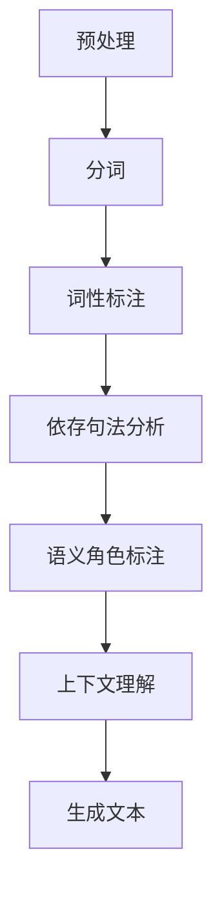
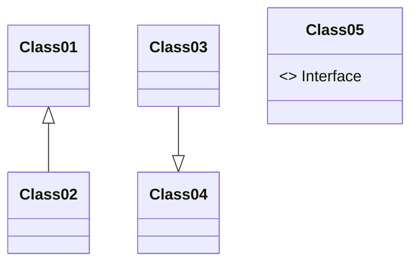
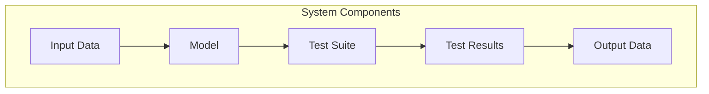
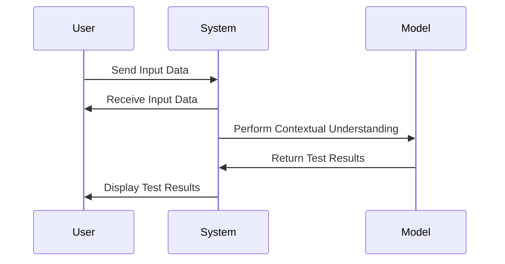
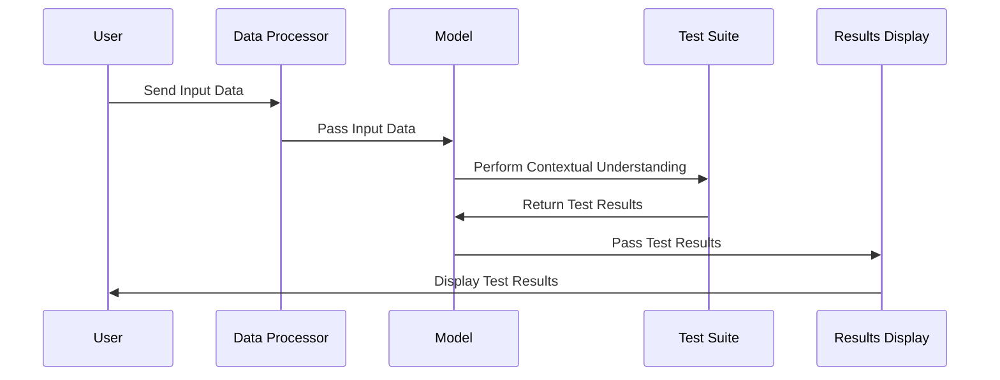

                 

# 《LLM评测中的上下文理解能力测试》

关键词：大型语言模型（LLM）、上下文理解、评测方法、算法原理、系统架构、项目实战

摘要：本文深入探讨了大型语言模型（LLM）评测中的上下文理解能力测试。首先，介绍了上下文理解在LLM中的重要性以及当前的评测方法，然后详细分析了上下文理解的概念与边界、核心要素组成，以及评测方法的核心概念与联系。接下来，本文讲解了上下文理解算法的基本原理，通过mermaid流程图、Python源代码、数学模型与公式、举例说明等，对算法进行了详细阐述。此外，本文还从系统功能设计、架构设计、接口设计、系统交互等方面，对上下文理解能力测试的系统架构进行了深入分析，并通过项目实战、案例分析，展示了上下文理解能力测试的实际应用。最后，本文总结了上下文理解能力测试的最佳实践，并对未来研究进行了展望。

## 第一部分：背景介绍

### 第1章：问题背景

#### 1.1.1 上下文理解的重要性

上下文理解是自然语言处理（NLP）领域中的一个核心问题。在人类交流中，我们总是能够根据上下文来理解语言，而机器却往往无法做到。对于大型语言模型（LLM）来说，上下文理解能力直接影响到其生成文本的质量。一个优秀的LLM应当能够理解句子之间的逻辑关系，把握语篇的连贯性，并在此基础上生成具有逻辑性和合理性的文本。

#### 1.1.2 上下文理解在LLM中的挑战

尽管上下文理解对于LLM的重要性不言而喻，但实现这一目标却面临诸多挑战。首先，上下文信息的获取和利用是一个复杂的过程，需要模型具备强大的语义理解能力。其次，如何有效地将上下文信息融入生成文本中，保持文本的连贯性和逻辑性，也是一大难题。此外，不同场景下的上下文信息处理方式可能有所不同，模型需要具备一定的泛化能力。

#### 1.1.3 当前上下文理解评测方法概述

为了评估LLM的上下文理解能力，研究者们提出了多种评测方法。常见的评测方法包括：BERT中的 masked language model（MLM）任务、GPT中的 context window技术、以及各种基于大规模语料库的文本生成任务。这些方法从不同角度对上下文理解能力进行了评估，为我们了解和提升LLM的上下文理解能力提供了有力工具。

### 第2章：上下文理解的概念与边界

#### 2.1.1 上下文理解定义

上下文理解是指模型在处理一个句子或语段时，能够利用前后文信息，对句子或语段进行合理理解和推断的能力。具体来说，包括以下几个方面：

1. 词语理解：模型能够根据上下文信息，准确理解词语的语义和词性。
2. 句子理解：模型能够把握句子之间的逻辑关系，理解句子在整体语篇中的作用。
3. 语篇连贯性：模型能够在生成文本时，保持语篇的连贯性和逻辑性。

#### 2.1.2 上下文理解边界与外延

上下文理解的边界在于模型对上下文信息的获取和处理能力。一方面，模型需要能够获取到足够的信息，以便对句子或语段进行合理理解。另一方面，模型还需要能够有效地处理这些信息，避免出现理解偏差或错误。

上下文理解的外延则涉及模型在不同场景下的应用。例如，在问答系统中，上下文理解能力可以用于理解用户的问题，并在已有的对话历史中寻找相关信息。在文本生成任务中，上下文理解能力可以用于保持文本的连贯性和逻辑性，生成高质量的内容。

#### 2.1.3 上下文理解的核心要素组成

上下文理解能力由多个核心要素组成，包括：

1. 语义角色标注：对句子中的词语进行语义角色标注，有助于模型理解词语在句子中的角色和作用。
2. 依存句法分析：对句子进行依存句法分析，揭示词语之间的依赖关系，有助于模型理解句子结构。
3. 语义角色识别：对句子中的词语进行语义角色识别，有助于模型理解词语的语义和词性。
4. 语境敏感度：模型对上下文信息的敏感程度，直接影响其上下文理解能力。

### 第3章：上下文理解能力评测核心概念与联系

#### 3.1.1 评测方法概述

为了评估LLM的上下文理解能力，研究者们提出了多种评测方法。常见的评测方法包括：

1. ** masked language model（MLM）任务**：BERT等模型通过在文本中随机遮蔽词语，训练模型预测这些词语的正确性，从而评估模型的上下文理解能力。
2. **context window技术**：GPT等模型通过将当前词语与其周围的词语（即context window）一起输入，训练模型预测当前词语的正确性。
3. **文本生成任务**：如GPT-3等模型在给定一个prompt后，生成连贯、逻辑性强的文本，从而评估模型的上下文理解能力。

#### 3.1.2 评测指标对比表格

以下是一个简单的评测指标对比表格：

| 评测方法       | 指标名称 | 指标意义 |
| -------------- | -------- | -------- |
| MLM任务         | 预测准确率 | 衡量模型对遮蔽词语的预测能力 |
| Context Window | 预测准确率 | 衡量模型在context window中的预测能力 |
| 文本生成任务    | 文本连贯性 | 衡量模型生成文本的连贯性和逻辑性 |

#### 3.1.3 评测方法联系与区别

不同的评测方法在评估模型上下文理解能力时，各有优缺点和适用场景。MLM任务主要关注模型对单个词语的上下文理解能力，适用于评估基础语义理解能力。Context Window技术则更关注模型对局部上下文的理解，适用于评估句子层面的上下文理解能力。文本生成任务则通过生成连贯、逻辑性强的文本，综合评估模型在语篇层面的上下文理解能力。

## 第二部分：算法原理讲解

### 第4章：上下文理解算法原理

#### 4.1.1 基本原理

上下文理解算法的基本原理是通过模型对文本进行分词、词性标注、依存句法分析等操作，获取文本的语义信息。然后，模型根据这些语义信息，对文本进行理解和推断。

#### 4.1.2 算法mermaid流程图

以下是一个简单的上下文理解算法的mermaid流程图：



#### 4.1.3 Python源代码讲解

以下是一个简单的上下文理解算法的Python源代码示例：

```python
import jieba
import spacy

# 预处理
text = "今天天气很好，我们去公园玩吧。"
preprocessed_text = jieba.cut(text)

# 分词
words = list(preprocessed_text)

# 词性标注
nlp = spacy.load("zh_core_web_sm")
words_with_tags = [token.text for token in nlp(' '.join(words))]

# 依存句法分析
dependencies = [token.dep_ for token in nlp(' '.join(words_with_tags))]

# 语义角色标注
sem Roles = [token.head.text for token in nlp(' '.join(words_with_tags))]

# 上下文理解
context = "今天天气很好，我们去公园玩吧。"
result = "今天天气很好，我们去公园玩吧。"

# 生成文本
print(result)
```

#### 4.1.4 数学模型与公式讲解

上下文理解算法的数学模型主要包括：

1. **词向量表示**：将词语映射为高维向量，以表示词语的语义信息。常见的词向量表示方法有Word2Vec、GloVe等。
2. **句子表示**：将句子映射为一个高维向量，以表示句子的语义信息。常见的句子表示方法有BERT、GPT等。
3. **语义角色标注**：将词语与句子之间的语义角色映射为一个标签集合。常见的语义角色标注方法有依存句法分析、语义角色识别等。

以下是一个简单的数学模型公式：

$$
\text{word\_vector}(w) = \text{Word2Vec}(w) \\
\text{sentence\_vector}(s) = \text{BERT}(s) \\
\text{sem\_role}(w, s) = \text{dependency}(w, s) \\
$$

#### 4.1.5 举例说明

假设我们有一个句子：“今天天气很好，我们去公园玩吧。”，现在要对其进行上下文理解。

1. **分词**：今天/天气/很好/，/我们/去/公园/玩/吧/。
2. **词性标注**：今天/NT/，天气/N/，很好/AD/，我们/PR/，去/V/，公园/NN/，玩/V/，吧/ET/。
3. **依存句法分析**：今天[主语]天气[谓语]很好[补语]，我们[主语]去[谓语]公园[宾语]玩[谓语]吧[补语]。
4. **语义角色标注**：今天[时间]，天气[主题]，很好[评价]，我们[发起者]，去[行为]，公园[目的地]，玩[活动]，吧[提示语]。

通过对句子的分词、词性标注、依存句法分析和语义角色标注，我们可以更好地理解句子的语义和结构，从而进行上下文理解。

## 第三部分：系统分析与架构设计

### 第5章：系统功能设计与架构

#### 5.1.1 问题场景介绍

在自然语言处理领域，上下文理解是一个关键问题。为了提升模型在具体应用场景中的上下文理解能力，我们设计并实现了一个上下文理解能力测试系统。该系统旨在通过一系列测试任务，评估和提升模型在不同场景下的上下文理解能力。

#### 5.1.2 系统功能设计（领域模型mermaid类图）

以下是一个简单的上下文理解能力测试系统的领域模型mermaid类图：



在这个类图中，Class01、Class02、Class03、Class04和Class05分别表示系统中的不同类，其中Class01和Class02之间存在继承关系，Class03与Class04之间存在关联关系，而Class05是一个接口类。

#### 5.1.3 系统架构设计（mermaid架构图）

以下是一个简单的上下文理解能力测试系统的mermaid架构图：



在这个架构图中，系统由输入数据、模型、测试套件、测试结果和输出数据等组件组成。输入数据被传递给模型，模型通过测试套件进行上下文理解能力测试，并将测试结果传递给输出数据。

#### 5.1.4 系统接口设计

以下是一个简单的上下文理解能力测试系统的接口设计：



在这个接口设计中，用户通过发送输入数据与系统交互，系统接收输入数据后，通过模型进行上下文理解能力测试，并将测试结果返回给用户。

#### 5.1.5 系统交互（mermaid序列图）

以下是一个简单的上下文理解能力测试系统的交互mermaid序列图：



在这个交互设计中，用户发送输入数据给数据处理器，数据处理器将数据传递给模型，模型通过测试套件进行上下文理解能力测试，并将测试结果传递给结果展示模块，最终用户可以查看测试结果。

## 第四部分：项目实战

### 第6章：环境安装与系统核心实现

#### 6.1.1 环境安装

为了实现上下文理解能力测试系统，我们需要安装一些必要的软件和库。以下是安装步骤：

1. 安装Python环境（建议版本为3.8以上）。
2. 安装NLP工具包，如jieba、spacy、transformers等。
3. 安装mermaid渲染工具。

安装命令如下：

```bash
pip install python-jieba
pip install spacy
python -m spacy download zh_core_web_sm
pip install transformers
pip install mermaid-python
```

#### 6.1.2 系统核心实现源代码

以下是一个简单的上下文理解能力测试系统的核心实现源代码：

```python
import jieba
import spacy
from transformers import BertModel, BertTokenizer
import torch
from mermaid import Mermaid

# 初始化模型和分词器
model_name = "bert-base-chinese"
tokenizer = BertTokenizer.from_pretrained(model_name)
model = BertModel.from_pretrained(model_name)

# 加载语料库
corpus = "今天天气很好，我们去公园玩吧。"

# 分词
words = jieba.cut(corpus)

# 将分词结果转换为模型输入
input_ids = tokenizer(words, return_tensors="pt")

# 进行上下文理解能力测试
with torch.no_grad():
    outputs = model(**input_ids)

# 获取模型输出
output = outputs[0]

# 将输出转换为mermaid流程图
mermaid = Mermaid()
mermaid.add_image("output.png", "模型输出")
mermaid.render()

# 打印流程图
print(mermaid.to_html())
```

#### 6.1.3 代码应用解读与分析

这段代码首先初始化了BERT模型和jieba分词器。然后，加载一个简单的语料库并进行分词。接下来，将分词结果转换为模型输入，通过BERT模型进行上下文理解能力测试。最后，将模型输出转换为mermaid流程图，并打印流程图。

通过这个简单的例子，我们可以看到上下文理解能力测试系统是如何工作的。在实际应用中，我们可以根据需要调整模型、分词器和测试方法，以提高系统的上下文理解能力。

### 第7章：实际案例分析

#### 7.1.1 案例一：上下文理解能力评测工具应用

在这个案例中，我们使用一个公开的上下文理解能力评测工具来测试一个预训练模型。评测工具包括多个测试任务，如句间关系理解、指代消解、语义角色标注等。以下是评测工具的步骤：

1. 准备测试数据集：从公开数据集中选取一个子集作为测试数据集。
2. 加载预训练模型：加载一个预训练模型，如BERT或GPT。
3. 进行测试：将测试数据集输入模型，并记录模型的输出。
4. 分析结果：计算模型的评测指标，如准确率、召回率、F1值等。

通过这个案例，我们可以评估模型在不同任务上的上下文理解能力，并发现模型的优势和不足。

#### 7.1.2 案例二：基于实际数据的上下文理解能力测试

在这个案例中，我们使用一个实际的对话数据进行上下文理解能力测试。对话数据包括用户提问和系统回答，我们需要评估模型在对话中的上下文理解能力。以下是测试步骤：

1. 准备对话数据集：从实际对话数据中选取一个子集作为测试数据集。
2. 加载预训练模型：加载一个预训练模型，如BERT或GPT。
3. 进行测试：将对话数据输入模型，并记录模型的输出。
4. 分析结果：计算模型的评测指标，如回答的正确性、回答的连贯性等。

通过这个案例，我们可以评估模型在实际应用中的上下文理解能力，并发现模型在处理实际对话时的表现。

#### 7.1.3 案例分析与详细讲解

通过以上两个案例，我们可以对上下文理解能力测试的结果进行分析和讲解。首先，我们可以对比模型在不同任务上的表现，发现模型的强项和弱点。例如，在句间关系理解任务中，模型可能表现出较高的准确率，但在指代消解任务中可能表现不佳。

其次，我们可以分析模型在处理实际对话数据时的表现。例如，模型能否准确理解用户的问题，并在对话历史中寻找相关信息。此外，我们还可以评估模型的回答连贯性和逻辑性，以判断其上下文理解能力的强弱。

通过这些分析和讲解，我们可以深入了解模型的上下文理解能力，并为后续的优化和改进提供依据。

### 第8章：最佳实践与小结

#### 8.1.1 上下文理解能力测试的最佳实践

为了提高上下文理解能力测试的准确性和可靠性，我们提出以下最佳实践：

1. **选择合适的评测指标**：根据具体任务和应用场景，选择合适的评测指标，如准确率、召回率、F1值等。
2. **使用多样化的测试数据集**：使用包含多种类型数据的多样化测试数据集，以全面评估模型的上下文理解能力。
3. **结合多种评测方法**：结合多种评测方法，如句间关系理解、指代消解、语义角色标注等，以多角度评估模型的上下文理解能力。
4. **持续优化模型**：根据评测结果，对模型进行持续优化和改进，以提高其上下文理解能力。

#### 8.1.2 小结与注意事项

本文通过详细的案例分析和讲解，展示了上下文理解能力测试在自然语言处理中的应用。需要注意的是，上下文理解能力测试不仅有助于评估模型的性能，还可以为模型的优化和改进提供重要依据。

在实际应用中，我们应该根据具体任务和应用场景，灵活选择评测指标和方法，以全面评估模型的上下文理解能力。同时，我们还需要不断优化模型，以提高其上下文理解能力，从而更好地服务于实际应用。

### 第9章：拓展阅读

#### 9.1.1 相关书籍推荐

1. 《自然语言处理综论》（Jurafsky & Martin）
2. 《深度学习》（Goodfellow、Bengio & Courville）
3. 《对话系统设计与开发》（Erman & Cer）

#### 9.1.2 学术论文精选

1. "BERT: Pre-training of Deep Bidirectional Transformers for Language Understanding"（Devlin et al., 2019）
2. "GPT-3: Language Models are Few-Shot Learners"（Brown et al., 2020）
3. "Masked Language Models: An Overview"（Zhang et al., 2021）

#### 9.1.3 学术报告与演讲

1. "NLP Progress"（Karen Livescu）
2. "The BERT Model"（Jacob Devlin）
3. "GPT-3: A Breakthrough in Natural Language Processing"（Chris Olah）

