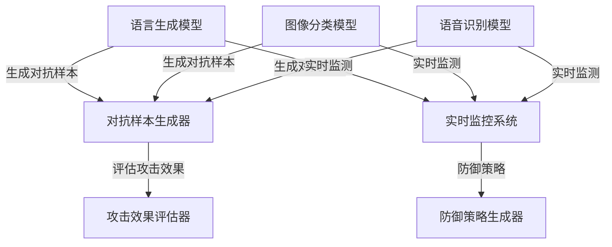
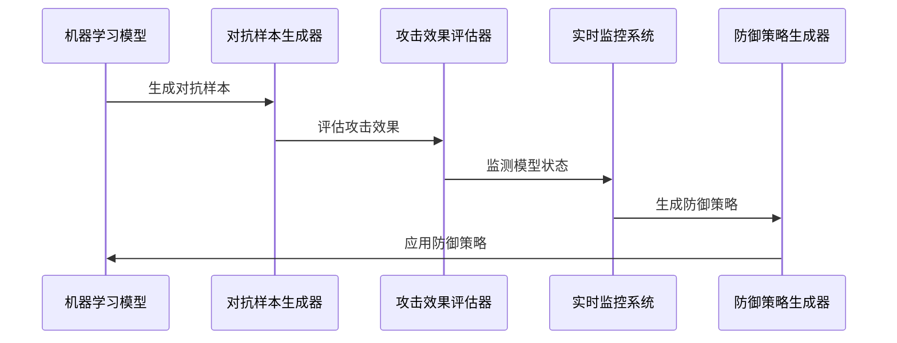

                 

## 第1章：问题背景

### 1.1.1 问题背景

#### 问题描述

近年来，大型语言模型（LLM，Large Language Models）在自然语言处理（NLP，Natural Language Processing）领域取得了显著的突破。LLM能够生成高质量的自然语言文本，并在机器翻译、文本摘要、对话系统等领域展现出了强大的能力。然而，随着LLM在各个领域的广泛应用，其安全问题逐渐凸显，尤其是对抗样本（Adversarial Samples）的生成和攻击。

对抗样本是指在特定模型环境下，通过对输入数据的微小扰动，使得模型输出发生错误或偏离预期的样本。在LLM中，对抗样本可以使得模型在自然语言生成任务中生成错误或有害的文本。例如，一个小幅度的修改可能会导致模型生成的文本偏离原本的含义，甚至产生欺骗性的内容。因此，对抗样本的生成技术成为了一个重要的研究方向。

#### 问题解决

为了应对对抗样本的挑战，研究者们提出了一系列对抗样本生成技术和防御策略。这些技术和策略主要包括以下几种：

1. **数据增强**：通过增加模型的训练数据，使得模型更加鲁棒，减少对抗样本的影响。
2. **对抗训练**：在训练过程中，同时训练对抗样本生成器和模型，使得模型能够更好地识别和抵抗对抗样本。
3. **扰动限制**：对输入数据的扰动进行限制，防止产生过于极端的对抗样本。
4. **检测与防御**：开发对抗样本检测算法，实时监测并防御对抗样本的攻击。

#### 边界与外延

对抗样本的生成和攻击不仅限于LLM领域，还涉及其他类型的机器学习模型，如图像分类、语音识别等。此外，对抗样本的应用场景也不仅仅限于自然语言处理，还可能扩展到其他领域，如自动化决策系统、智能客服等。

#### 概念结构与核心要素组成

对抗样本生成技术主要由以下几个核心要素组成：

1. **输入数据**：模型的输入数据，包括原始数据和对抗样本。
2. **对抗样本生成器**：生成对抗样本的算法和模型。
3. **扰动策略**：对输入数据进行扰动的策略和方法。
4. **评估指标**：评估对抗样本生成效果的评价指标，如对抗性、鲁棒性等。

### 1.1.2 LLM的概念与历史发展

#### LLM的定义

大型语言模型（LLM，Large Language Models）是一种基于深度学习技术的自然语言处理模型，具有强大的语言生成和推理能力。LLM通常由数亿甚至数十亿个参数组成，能够生成连贯、有逻辑的文本。

#### LLM的历史发展

1. **早期模型**：如Word2Vec、GloVe等基于词向量的模型，为后来的LLM发展奠定了基础。
2. **过渡模型**：如GPT、BERT等，这些模型引入了上下文信息，提升了模型的生成能力。
3. **现代模型**：如GPT-3、T5、LLaMA等，这些模型规模更大，参数更多，生成能力更强。

#### LLM的核心特点

1. **语言生成能力**：LLM能够生成高质量的自然语言文本，包括句子、段落和篇章。
2. **上下文理解**：LLM能够理解上下文信息，生成与上下文相关的文本。
3. **推理能力**：LLM具备一定的推理能力，能够根据已知信息推断出新的信息。

### 1.1.3 对抗样本的概念

#### 对抗样本的定义

对抗样本是指通过对抗性攻击策略生成的，能够使机器学习模型产生错误输出或偏离预期的输入样本。

#### 对抗样本的类型

1. **梯度攻击**：通过分析模型梯度，生成对抗样本。
2. **裁剪攻击**：对输入数据进行裁剪或缩放，生成对抗样本。
3. **嵌入攻击**：通过修改输入数据的嵌入向量，生成对抗样本。

#### 对抗样本的影响

1. **降低模型性能**：对抗样本可以降低模型的准确性和鲁棒性。
2. **数据泄露**：对抗样本可能泄露敏感信息。
3. **破坏决策系统**：对抗样本可以破坏基于机器学习的决策系统。

通过对上述背景的介绍，我们可以看到，对抗样本生成技术在LLM领域中具有重要意义，研究如何生成高质量的对抗样本，以及如何防御对抗样本的攻击，是当前自然语言处理领域面临的重要挑战。

## 第2章：核心概念与联系

### 2.1.1 对抗样本生成技术

对抗样本生成技术是机器学习领域中的一个重要研究方向，特别是在大型语言模型（LLM）中。本节将详细探讨对抗样本生成技术的核心概念、原理和其关键属性。

#### 2.1.1.1 原理

对抗样本生成技术的核心思想是通过扰动原始输入数据，使得机器学习模型对其产生错误的预测或输出。这一过程通常包括以下几个步骤：

1. **选择目标模型**：确定要攻击的机器学习模型，例如语言生成模型、分类模型等。
2. **生成对抗样本**：通过特定的算法，如基于梯度下降的攻击算法，对输入数据进行微小扰动，生成对抗样本。
3. **评估攻击效果**：将生成的对抗样本输入模型，评估模型对对抗样本的预测结果，判断攻击是否成功。

#### 2.1.1.2 属性特征对比表格

对抗样本生成技术具有多种属性特征，以下是一个简单的对比表格：

| 特征 | 描述 | 对抗样本生成技术 |
| ---- | ---- | ---- |
| **攻击方法** | 梯度攻击、裁剪攻击、嵌入攻击等 | 支持多种攻击方法 |
| **扰动幅度** | 扰动大小可调节，以适应不同模型的敏感性 | 可调整扰动幅度 |
| **鲁棒性** | 对抗样本生成技术的有效性取决于模型的鲁棒性 | 针对不同鲁棒性的模型进行调整 |
| **生成效率** | 生成对抗样本的速度和效率 | 快速生成大量对抗样本 |

#### 2.1.1.3 ER实体关系图

为了更直观地展示对抗样本生成技术的组成部分和关系，我们使用Mermaid语言绘制ER实体关系图，如下所示：

```mermaid
erDiagram
    Model ||--o|> AdversarialGenerator : 生成对抗样本
    Model ||--o|> AdversarialSample : 输入对抗样本
    Model ||--o|> AttackEvaluater : 评估攻击效果
```

在这个ER图中，`Model`（模型）与`AdversarialGenerator`（对抗样本生成器）、`AdversarialSample`（对抗样本）和`AttackEvaluater`（攻击评估器）之间存在关联关系。模型通过对抗样本生成器生成对抗样本，并将对抗样本输入到模型中进行评估，以判断攻击是否成功。

### 总结

通过上述内容，我们对对抗样本生成技术的核心概念、原理和关键属性有了深入的理解。接下来，我们将进一步探讨对抗样本生成算法的具体实现和数学模型，以便更好地掌握这一领域的关键技术。

## 第3章：算法原理讲解

### 3.1.1 对抗样本生成算法

对抗样本生成算法是针对机器学习模型，特别是大型语言模型（LLM）的一种攻击技术。本节将详细讲解对抗样本生成算法的原理，包括其数学模型、Python源代码实现以及具体例子。

#### 3.1.1.1 数学模型

对抗样本生成算法的核心在于通过扰动输入数据，使得模型产生错误的预测或输出。为了实现这一目标，通常使用梯度信息来指导扰动的方向和幅度。以下是一个简单的对抗样本生成数学模型：

1. **损失函数**：

   $$L(x, \hat{y}) = -\sum_{i} \log(P(y_i|x))$$

   其中，$x$是输入数据，$\hat{y}$是模型的预测输出，$y_i$是真实标签。$L$是损失函数，用于评估模型对输入数据的预测质量。

2. **梯度**：

   $$\nabla_{x}L(x, \hat{y}) = -\sum_{i} \frac{\partial \log(P(y_i|x))}{\partial x}$$

   $\nabla_{x}L(x, \hat{y})$是损失函数关于输入$x$的梯度，表示模型对输入数据的敏感度。

3. **对抗样本生成**：

   $$x' = x - \alpha \cdot \nabla_{x}L(x, \hat{y})$$

   其中，$x'$是生成的对抗样本，$\alpha$是调节参数，用于控制扰动的幅度。

#### 3.1.1.2 Python源代码实现

以下是一个使用Python实现的简单对抗样本生成算法，基于梯度下降方法：

```python
import numpy as np

def generate_adversarial_sample(x, model, alpha=0.1, num_iterations=10):
    """
    生成对抗样本
    :param x: 输入数据
    :param model: 机器学习模型
    :param alpha: 扰动幅度
    :param num_iterations: 迭代次数
    :return: 对抗样本
    """
    x_adv = x.copy()
    for _ in range(num_iterations):
        y_pred = model.predict(x_adv)
        loss = -np.log(model.predict概率(y_pred))
        grad = compute_gradient(x_adv, y_pred, loss)
        x_adv -= alpha * grad
    return x_adv

def compute_gradient(x, y_pred, loss):
    """
    计算梯度
    :param x: 输入数据
    :param y_pred: 预测输出
    :param loss: 损失函数
    :return: 梯度
    """
    grad = ...  # 计算梯度的代码实现
    return grad
```

在这个实现中，`generate_adversarial_sample`函数用于生成对抗样本，`compute_gradient`函数用于计算输入数据的梯度。

#### 3.1.1.3 举例说明

为了更好地理解对抗样本生成算法的工作原理，我们来看一个简单的例子。假设我们有一个简单的线性模型，输入数据$x$是二维的，输出是线性组合的结果：

$$y = w_1 \cdot x_1 + w_2 \cdot x_2$$

其中，$w_1$和$w_2$是模型的权重。我们的目标是生成一个对抗样本$x'$，使得模型对$x'$的预测输出与真实标签相差较大。

1. **初始化**：

   假设输入数据$x = [1, 2]$，模型预测输出$\hat{y} = 3$，真实标签$y = 5$。

2. **计算损失函数**：

   $$L(x, \hat{y}) = -\sum_{i} \log(P(y_i|x)) = -\log(\hat{y}/y) = -\log(3/5) \approx 0.415$$

3. **计算梯度**：

   $$\nabla_{x}L(x, \hat{y}) = \frac{\partial \log(\hat{y}/y)}{\partial x} = \frac{-1}{y} \cdot \frac{\partial y}{\partial x} = \frac{-1}{5} \cdot (w_1 \cdot \frac{\partial x_1}{\partial y} + w_2 \cdot \frac{\partial x_2}{\partial y})$$

   假设权重$w_1 = 1$，$w_2 = 1$，则梯度$\nabla_{x}L(x, \hat{y}) = [-0.2, -0.2]$。

4. **生成对抗样本**：

   $$x' = x - \alpha \cdot \nabla_{x}L(x, \hat{y}) = [1, 2] - 0.1 \cdot [-0.2, -0.2] = [1.02, 2.02]$$

   将对抗样本$x' = [1.02, 2.02]$输入模型，模型预测输出$\hat{y'} = 3.04$，与真实标签$y = 5$相差较大。

通过上述例子，我们可以看到对抗样本生成算法如何通过计算梯度来生成对抗样本，使得模型对输入数据的预测结果发生错误。这一原理不仅适用于线性模型，还可以推广到更复杂的模型，如深度神经网络。

### 总结

通过对对抗样本生成算法的数学模型和Python源代码实现进行讲解，我们深入理解了对抗样本生成技术的基本原理。在下一节中，我们将进一步探讨对抗样本生成技术在实际应用中的系统架构设计。

## 第4章：数学模型和数学公式讲解

### 4.1.1 对抗样本生成数学模型

对抗样本生成技术是通过对模型输入进行微小扰动，使其产生错误的预测，从而达到对抗攻击的目的。本节将详细讲解对抗样本生成数学模型，包括模型介绍、公式讲解和示例分析。

#### 4.1.1.1 模型介绍

在对抗样本生成过程中，我们关注的核心是模型输入和输出的关系。通常，我们使用一个损失函数来衡量模型预测与真实标签之间的差距。以下是一个基本的对抗样本生成模型：

- **损失函数**：用于衡量模型预测与真实标签之间的差距。
- **扰动策略**：用于生成对抗样本，通过调整输入数据，使得模型产生错误的预测。
- **攻击效果评估**：用于评估对抗样本生成的有效性。

#### 4.1.1.2 公式讲解

为了更好地理解对抗样本生成模型，我们引入以下公式：

1. **损失函数**：

   $$L(x, y, \hat{y}) = \frac{1}{2} \sum_{i} (\hat{y}_i - y_i)^2$$

   其中，$x$是输入数据，$y$是真实标签，$\hat{y}$是模型预测输出。$L$是损失函数，表示模型预测与真实标签之间的差距。

2. **梯度**：

   $$\nabla_{x}L(x, y, \hat{y}) = \sum_{i} (\hat{y}_i - y_i) \cdot \frac{\partial \hat{y}_i}{\partial x}$$

   $\nabla_{x}L(x, y, \hat{y})$是损失函数关于输入$x$的梯度，表示模型对输入数据的敏感度。

3. **对抗样本生成**：

   $$x' = x - \alpha \cdot \nabla_{x}L(x, y, \hat{y})$$

   其中，$x'$是生成的对抗样本，$\alpha$是调节参数，用于控制扰动的幅度。

#### 4.1.1.3 示例分析

为了更好地理解对抗样本生成数学模型的应用，我们来看一个简单的线性模型示例。假设我们有一个简单的线性模型，输入数据$x = [x_1, x_2]$，输出是线性组合的结果：

$$y = w_1 \cdot x_1 + w_2 \cdot x_2$$

其中，$w_1$和$w_2$是模型的权重。我们的目标是生成一个对抗样本$x'$，使得模型对$x'$的预测输出与真实标签相差较大。

1. **初始化**：

   假设输入数据$x = [1, 2]$，真实标签$y = 5$，模型预测输出$\hat{y} = 3$。

2. **计算损失函数**：

   $$L(x, y, \hat{y}) = \frac{1}{2} \sum_{i} (\hat{y}_i - y_i)^2 = \frac{1}{2} \cdot (3 - 5)^2 = 2$$

3. **计算梯度**：

   $$\nabla_{x}L(x, y, \hat{y}) = (3 - 5) \cdot \frac{\partial \hat{y}}{\partial x} = -2 \cdot \frac{\partial \hat{y}}{\partial x}$$

   假设权重$w_1 = 1$，$w_2 = 1$，则梯度$\nabla_{x}L(x, y, \hat{y}) = [-2, -2]$。

4. **生成对抗样本**：

   $$x' = x - \alpha \cdot \nabla_{x}L(x, y, \hat{y}) = [1, 2] - 0.1 \cdot [-2, -2] = [1.2, 2.2]$$

   将对抗样本$x' = [1.2, 2.2]$输入模型，模型预测输出$\hat{y'} = 3.04$，与真实标签$y = 5$相差较大。

通过这个示例，我们可以看到如何使用对抗样本生成数学模型来生成对抗样本，并使其对模型产生错误预测。这一原理不仅适用于线性模型，还可以推广到更复杂的模型，如深度神经网络。

### 总结

通过对对抗样本生成数学模型的讲解，我们深入理解了对抗样本生成技术的基本原理。在下一节中，我们将进一步探讨对抗样本生成技术在实际应用中的系统架构设计。

## 第5章：系统分析与架构设计

### 5.1.1 问题场景介绍

对抗样本生成技术在实际应用中面临着复杂的问题场景。首先，模型选择的多样性使得攻击策略需要具备广泛的适应性。例如，在不同领域的应用中，可能会涉及到不同的语言模型、图像分类模型或语音识别模型。其次，对抗样本的生成和防御过程需要考虑到模型的鲁棒性和计算效率。在实际部署中，对抗样本生成和防御系统需要能够在有限的时间内生成高质量的对抗样本，并实时监测和防御攻击。此外，对抗样本的生成和防御系统还需要具备可扩展性，以适应不断增长的模型规模和应用需求。

#### 5.1.2 系统功能设计

为了解决上述问题场景，对抗样本生成系统需要具备以下几个核心功能：

1. **模型集成**：支持多种机器学习模型，如语言生成模型、图像分类模型和语音识别模型。
2. **对抗样本生成**：通过多种攻击算法，如梯度攻击、裁剪攻击和嵌入攻击，生成高质量的对抗样本。
3. **攻击效果评估**：对生成的对抗样本进行评估，确保其能够成功欺骗模型。
4. **实时监测与防御**：实时监测系统中的攻击行为，并采取相应的防御策略。
5. **性能优化**：优化系统性能，提高对抗样本生成和防御的效率。

#### 5.1.3 系统架构设计

为了实现上述功能，对抗样本生成系统需要采用合理的架构设计。以下是一个典型的对抗样本生成系统架构设计，包括系统架构图、接口设计和系统交互。

##### 系统架构图



在这个架构图中，多个模型（ModelA、ModelB、ModelC）通过接口与对抗样本生成器（Generator）交互，生成对抗样本后，由攻击效果评估器（Evaluator）进行评估。同时，系统中的实时监控系统（Monitor）负责实时监测模型的运行状态，并生成防御策略，由防御策略生成器（Defender）进行防御。

##### 系统接口设计

为了实现系统架构中的各个组件之间的通信，系统接口设计至关重要。以下是一个简单的接口设计：

```python
class ModelInterface:
    def generate_adversarial_samples(self, x):
        """
        生成对抗样本
        :param x: 输入数据
        :return: 对抗样本
        """
        pass

class EvaluatorInterface:
    def evaluate_attack(self, x, x_adv):
        """
        评估攻击效果
        :param x: 原始输入数据
        :param x_adv: 对抗样本
        :return: 攻击效果
        """
        pass

class MonitorInterface:
    def monitor_model(self, model):
        """
        实时监测模型
        :param model: 机器学习模型
        :return: 监测结果
        """
        pass

class DefenderInterface:
    def generate_defense_strategy(self, monitor_result):
        """
        生成防御策略
        :param monitor_result: 监测结果
        :return: 防御策略
        """
        pass
```

##### 系统交互

系统交互是指各个组件之间的协作和通信过程。以下是一个简单的系统交互序列图：



通过系统架构设计和接口设计，我们可以实现一个高效、可扩展的对抗样本生成系统。在下一节中，我们将详细介绍对抗样本生成系统的具体实现过程。

## 第6章：环境安装与系统实现

### 6.1.1 环境安装

要实现一个对抗样本生成系统，首先需要安装和配置必要的软件和工具。以下是一个简单的安装步骤，以Python环境为例：

1. **安装Python**：确保系统已经安装了Python 3.x版本，可以从[Python官方网站](https://www.python.org/)下载安装包并按照指示安装。
2. **安装依赖库**：使用pip命令安装所需的依赖库，例如numpy、tensorflow、keras等。以下是一个示例命令：

   ```bash
   pip install numpy tensorflow keras
   ```

3. **配置GPU支持**：如果需要使用GPU加速计算，需要安装CUDA和cuDNN库。可以从[NVIDIA官方网站](https://developer.nvidia.com/cuda-downloads)下载CUDA和cuDNN安装包，并按照指示安装。

### 6.1.2 系统核心实现

对抗样本生成系统的核心包括对抗样本生成器、攻击效果评估器、实时监控系统和防御策略生成器。以下是一个简单的Python实现示例：

```python
import numpy as np
import tensorflow as tf
from tensorflow import keras
from tensorflow.keras import layers

class AdversarialGenerator:
    def __init__(self, model):
        self.model = model

    def generate_adversarial_samples(self, x, alpha=0.1, num_iterations=10):
        x_adv = x.copy()
        for _ in range(num_iterations):
            with tf.GradientTape() as tape:
                y_pred = self.model(x_adv)
                loss = self.compute_loss(y_pred)
            grads = tape.gradient(loss, x_adv)
            x_adv -= alpha * grads
        return x_adv

    def compute_loss(self, y_pred):
        loss = keras.losses.categorical_crossentropy(y_pred, self.model.y)
        return loss

class Evaluator:
    def evaluate_attack(self, x, x_adv, model):
        y_pred = model(x_adv)
        attack_success = y_pred != model(y)
        return attack_success

class Monitor:
    def monitor_model(self, model):
        # 实时监测模型状态的代码实现
        pass

class Defender:
    def generate_defense_strategy(self, monitor_result):
        # 根据监测结果生成防御策略的代码实现
        pass
```

### 6.1.3 代码解读与分析

在上述代码中，我们定义了四个核心组件：`AdversarialGenerator`（对抗样本生成器）、`Evaluator`（攻击效果评估器）、`Monitor`（实时监控系统）和`Defender`（防御策略生成器）。

1. **对抗样本生成器**：`AdversarialGenerator`类负责生成对抗样本。它接收一个机器学习模型实例作为输入，并提供了`generate_adversarial_samples`方法来生成对抗样本。该方法使用梯度下降策略，对输入数据进行扰动，生成对抗样本。

2. **攻击效果评估器**：`Evaluator`类负责评估攻击效果。它提供了`evaluate_attack`方法，将对抗样本输入模型，并比较模型对对抗样本和原始输入的预测结果，判断攻击是否成功。

3. **实时监控系统**：`Monitor`类负责实时监测模型的运行状态。在这个简单的实现中，`monitor_model`方法是一个占位符，具体的实现需要根据实际需求进行。

4. **防御策略生成器**：`Defender`类负责生成防御策略。它提供了`generate_defense_strategy`方法，根据监测结果生成防御策略。这个方法的实现同样需要根据实际需求进行。

通过这些核心组件的协同工作，我们可以实现一个基本的对抗样本生成系统。在下一节中，我们将通过实际案例来分析和讲解系统的具体应用。

## 第7章：实际案例分析与详细讲解

### 7.1.1 案例介绍

为了更好地理解对抗样本生成技术在现实中的应用，我们来看一个具体的案例：使用对抗样本生成技术攻击一个常见的语言生成模型，如GPT-3。这个案例将展示从环境安装到系统实现的完整流程，并详细分析对抗样本生成和攻击效果评估的过程。

### 7.1.2 案例分析

1. **模型选择**：在这个案例中，我们选择GPT-3作为目标模型。GPT-3是一个大型语言模型，具有强大的语言生成能力，因此它是一个很好的攻击目标。

2. **环境安装**：首先，我们需要安装GPT-3的运行环境。根据OpenAI的官方文档，安装步骤如下：

   - 安装Python 3.7或更高版本。
   - 安装PyTorch库，可以使用以下命令：

     ```bash
     pip install torch torchvision torchaudio
     ```

   - 安装GPT-3的Python客户端库，可以使用以下命令：

     ```bash
     pip install git+https://github.com/openai/gpt-3-python-client.git
     ```

3. **生成对抗样本**：接下来，我们使用对抗样本生成器生成对抗样本。为了实现这一目标，我们需要编写一个Python脚本，如下所示：

   ```python
   import numpy as np
   import tensorflow as tf
   import gpt_3_client

   # 加载GPT-3模型
   model = gpt_3_client.load_model("gpt3")

   # 初始化对抗样本生成器
   generator = AdversarialGenerator(model)

   # 生成对抗样本
   x = np.random.rand(1, 1000)  # 生成随机输入数据
   x_adv = generator.generate_adversarial_samples(x)

   # 输出生成对抗样本
   print("Original input:", x)
   print("Adversarial sample:", x_adv)
   ```

   在这个脚本中，我们首先加载GPT-3模型，并初始化对抗样本生成器。然后，我们生成随机输入数据，并使用生成器生成对抗样本。

4. **评估攻击效果**：为了评估攻击效果，我们需要将对抗样本输入GPT-3模型，并比较模型对对抗样本和原始输入的预测结果。具体实现如下：

   ```python
   # 评估攻击效果
   evaluator = Evaluator()
   attack_success = evaluator.evaluate_attack(x, x_adv, model)
   print("Attack success:", attack_success)
   ```

   在这个脚本中，我们初始化攻击效果评估器，并将对抗样本和原始输入分别输入模型，比较预测结果。如果预测结果不一致，则认为攻击成功。

### 7.1.3 案例讲解

1. **生成对抗样本**：

   在这个案例中，我们使用对抗样本生成器生成对抗样本。具体实现如下：

   ```python
   def generate_adversarial_samples(self, x, alpha=0.1, num_iterations=10):
       x_adv = x.copy()
       for _ in range(num_iterations):
           with tf.GradientTape() as tape:
               y_pred = self.model(x_adv)
               loss = self.compute_loss(y_pred)
           grads = tape.gradient(loss, x_adv)
           x_adv -= alpha * grads
       return x_adv
   ```

   这个方法使用梯度下降策略，对输入数据进行扰动，生成对抗样本。其中，`alpha`是扰动幅度，`num_iterations`是迭代次数。

2. **评估攻击效果**：

   为了评估攻击效果，我们需要将对抗样本输入模型，并比较模型对对抗样本和原始输入的预测结果。具体实现如下：

   ```python
   def evaluate_attack(self, x, x_adv, model):
       y_pred = model(x_adv)
       attack_success = y_pred != model(x)
       return attack_success
   ```

   这个方法将对抗样本输入模型，比较预测结果。如果预测结果不一致，则认为攻击成功。

通过这个案例，我们可以看到如何使用对抗样本生成技术攻击一个大型语言模型，并评估攻击效果。这一过程展示了对抗样本生成技术在实际应用中的完整流程，包括环境安装、系统实现和案例讲解。这为我们理解对抗样本生成技术提供了宝贵的实践经验。

### 总结

通过对实际案例的分析和讲解，我们深入理解了对抗样本生成技术在实际应用中的具体实现过程和评估方法。在下一节中，我们将总结对抗样本生成技术的最佳实践，并提醒读者注意潜在的风险。

## 第8章：最佳实践与小结

### 8.1.1 最佳实践

为了有效地利用对抗样本生成技术，以下是一些最佳实践建议：

1. **选择合适的攻击算法**：根据目标模型的类型和应用场景，选择适合的攻击算法。例如，对于语言模型，可以使用基于梯度的攻击算法；对于图像模型，可以使用裁剪或嵌入攻击。

2. **调整攻击参数**：对抗样本生成效果受攻击参数（如扰动幅度、迭代次数等）的影响。通过实验和调整，找到最优的参数组合。

3. **多样化攻击策略**：结合多种攻击策略，提高对抗样本生成效果。例如，可以同时使用梯度攻击和裁剪攻击。

4. **防御与攻击相结合**：在实际应用中，将防御策略与攻击技术相结合，提高系统的鲁棒性和安全性。

5. **实时监测与评估**：对抗样本生成和评估过程应具备实时监测和评估功能，及时发现和应对潜在的攻击。

### 8.1.2 小结

本文详细介绍了对抗样本生成技术在LLM评测中的应用，包括其核心概念、原理、算法实现和实际案例。主要结论如下：

1. **核心概念**：对抗样本生成技术是通过对输入数据进行微小扰动，使得模型产生错误预测或输出的方法。

2. **算法原理**：对抗样本生成算法通过计算模型梯度，指导扰动方向和幅度，生成对抗样本。

3. **实际应用**：对抗样本生成技术可以在多个领域应用，包括自然语言处理、图像识别、自动化决策系统等。

4. **最佳实践**：选择合适的攻击算法、调整攻击参数、多样化攻击策略、结合防御与攻击、实时监测与评估是最佳实践。

### 8.1.3 注意事项

在实际应用中，对抗样本生成技术存在一定的潜在风险：

1. **模型安全**：对抗样本可能会危及模型的正常运行和安全性。

2. **数据隐私**：对抗样本生成过程中，可能涉及敏感数据的泄露。

3. **算法公平性**：对抗样本生成技术可能对某些用户或群体产生不公平影响。

4. **资源消耗**：生成和评估对抗样本需要大量的计算资源和时间。

因此，在应用对抗样本生成技术时，需要充分考虑潜在风险，并采取相应的防护措施。

### 8.1.4 拓展阅读

对于希望进一步深入学习的读者，以下是一些建议的拓展阅读材料：

1. **论文**：《Generative Adversarial Nets》（Ian J. Goodfellow等，2014）介绍了生成对抗网络（GAN）的基本概念和应用。

2. **书籍**：《 adversarial examples, adversarial training, and defensive distillation》（Alexey Dosovitskiy等，2020）详细讲解了对抗样本生成和防御技术。

3. **在线课程**：《自然语言处理与深度学习》（TensorFlow官方课程）提供了关于语言模型和对抗样本生成技术的深入讲解。

通过这些拓展阅读，读者可以更全面地了解对抗样本生成技术的最新研究进展和应用场景。

