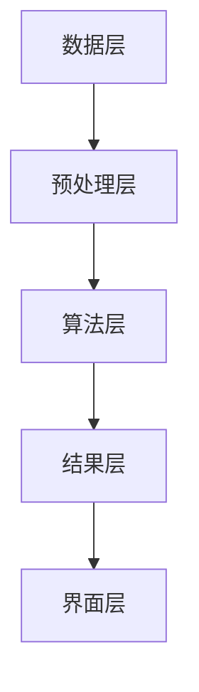
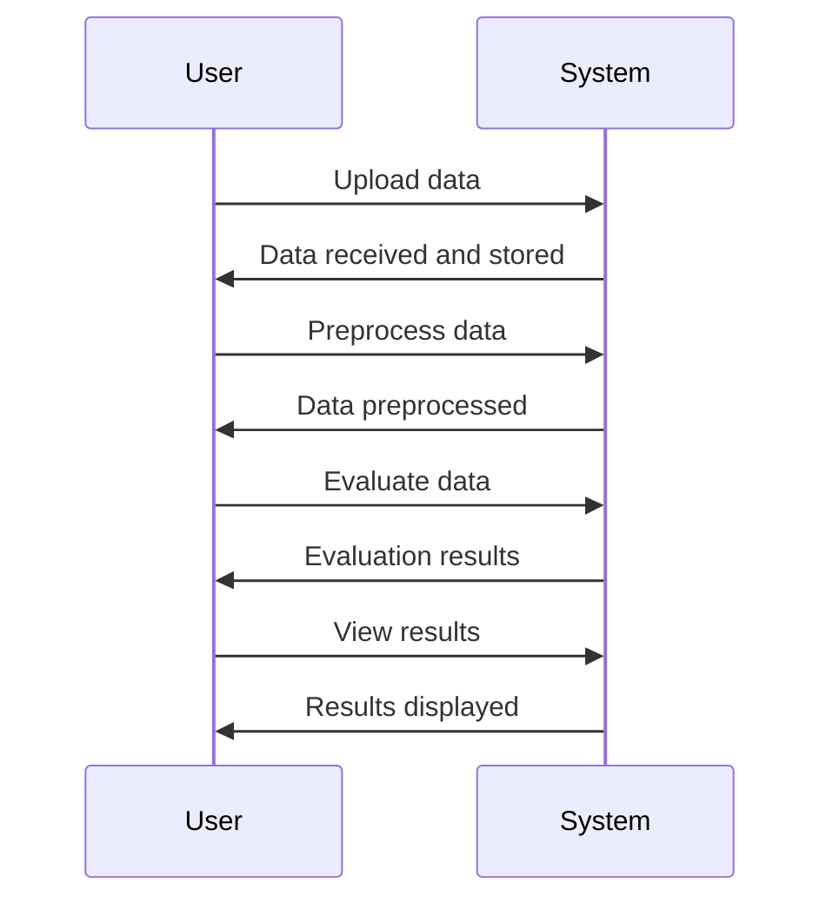

                 

### 文章标题

# LLM评测中的对话一致性与连贯性测试

> 关键词：LLM、对话一致性、连贯性、评测、算法、系统设计、Python代码、数学模型

> 摘要：本文旨在深入探讨大型语言模型（LLM）在对话系统中的评测方法，重点分析了对话一致性与连贯性的评测原理及其在LLM评测中的重要性。通过详细的算法原理讲解、Python代码实现和实际案例分析，为读者提供了全面、系统的评测方法和最佳实践。

### 引言

随着人工智能技术的迅猛发展，大型语言模型（LLM）在自然语言处理（NLP）领域取得了显著的进展。LLM能够处理复杂的语言任务，如文本生成、机器翻译和问答系统。然而，为了确保LLM在实际应用中的性能和可靠性，必须进行严格的评测。对话一致性与连贯性是评测LLM的重要指标，反映了模型在处理对话任务时的表现。

本文将详细探讨LLM评测中的对话一致性与连贯性测试。首先，我们将介绍LLM的基本原理，包括其工作原理、数据集与训练方法等。接着，我们将深入分析对话一致性与连贯性的定义、衡量方法和它们之间的联系。然后，我们将介绍评测算法的原理和实现方法，并使用Python代码进行详细阐述。此外，我们还将讨论评测系统的设计，包括系统功能、架构和接口设计。最后，通过实际案例分析和项目小结，我们将总结最佳实践和注意事项。

### 第一部分：背景与概念

#### 第1章：问题背景与核心概念

##### 1.1 问题背景

近年来，人工智能技术在自然语言处理（NLP）领域取得了显著的突破，其中大型语言模型（LLM）如GPT、BERT等成为了研究的热点。LLM具有处理复杂语言任务的能力，但其在实际应用中仍面临诸多挑战，如对话一致性、连贯性等。为了评估LLM在这些方面的表现，必须进行严格的评测。

##### 1.2 LLM的基本原理

LLM是基于深度学习的技术，通常采用Transformer架构进行预训练和微调。预训练过程中，模型通过大量的文本数据学习语言模式，从而具备生成文本、翻译和问答等能力。LLM在处理对话任务时，需要确保对话的连贯性和一致性，以提供高质量的用户体验。

##### 1.3 对话一致性与连贯性的概念

对话一致性指的是模型在对话过程中，回答与上下文之间的逻辑关系一致。对话连贯性则是指模型生成的对话内容在语义和语法上具有一致性。这两个指标是评估LLM性能的重要标准，直接影响到用户对对话系统的满意度。

##### 1.4 核心概念之间的联系与差异

对话一致性与连贯性在LLM评测中具有密切的联系，但它们关注的侧重点不同。对话一致性主要评估回答与上下文之间的逻辑关系，而对话连贯性则关注对话内容在语义和语法上的连贯性。在实际评测中，通常需要综合考虑这两个指标，以全面评估LLM的性能。

##### 1.5 综合评测方法

为了更全面地评估LLM的性能，可以采用多维度综合评测方法。该方法包括定量评测和定性评测，分别从客观和主观角度评估模型的表现。此外，还可以结合用户反馈和实际应用场景，对LLM进行全方位评估。

##### 1.6 本章小结

本章介绍了LLM评测中的问题背景、基本原理和核心概念，为后续内容打下了基础。在接下来的章节中，我们将深入探讨对话一致性与连贯性的评测方法，并通过实际案例进行分析。

### 第二部分：算法原理与实现

#### 第2章：LLM的基本原理

##### 2.1 LLM的工作原理

LLM是一种基于深度学习的自然语言处理技术，其核心思想是通过大量文本数据的学习，获取语言知识和模式，从而实现语言理解和生成。LLM的工作原理主要包括以下几个步骤：

1. **文本数据预处理**：对原始文本进行清洗、分词、词性标注等处理，将文本转换为模型可理解的输入格式。
2. **词嵌入**：将文本中的词语转换为向量表示，通过词嵌入技术将词语映射到低维空间中，便于模型计算。
3. **编码器与解码器**：LLM通常采用编码器-解码器架构，其中编码器将输入文本编码为上下文表示，解码器则根据上下文生成输出文本。编码器和解码器通常采用Transformer架构，能够高效地处理长距离依赖问题。
4. **注意力机制**：在编码和解码过程中，注意力机制用于关注输入文本中的重要信息，从而提高模型的生成质量。
5. **生成文本**：解码器根据编码器的上下文表示，逐词生成输出文本，直至生成完整的对话或文本。

##### 2.2 数据集与训练

训练LLM需要大量的文本数据，这些数据可以从互联网、书籍、新闻、对话系统等多个来源获取。常用的LLM数据集包括Common Crawl、Wikipedia、新闻语料库等。在数据集选择和预处理方面，需要注意以下几点：

1. **数据多样性**：选择具有多样性的数据集，以覆盖不同领域的知识，提高模型的泛化能力。
2. **数据清洗**：对文本数据中的噪声、错别字、语法错误等进行清洗和修正，以提高数据质量。
3. **数据预处理**：对文本进行分词、词性标注、去停用词等预处理操作，将文本转换为模型可接受的输入格式。

在训练LLM时，需要采用合适的训练策略和优化方法，以提高模型的性能和稳定性。常见的训练策略包括：

1. **分步训练**：先对编码器进行预训练，再对解码器进行微调。
2. **动态学习率**：采用学习率衰减策略，逐步降低学习率，以避免过拟合。
3. **早期停止**：在训练过程中，当模型性能不再提升时，停止训练，以避免过拟合。

在训练过程中，还需要关注以下问题：

1. **计算资源**：训练LLM需要大量的计算资源，包括GPU和CPU。在实际应用中，需要合理配置计算资源，以提高训练效率。
2. **数据平衡**：在训练过程中，需要注意数据分布的平衡，以避免模型偏向某些类别。
3. **模型调参**：通过调整超参数，如学习率、批次大小、隐藏层大小等，优化模型性能。

##### 2.3 实际案例

为了更好地理解LLM的基本原理，我们来看两个实际案例。

**案例1：GPT-3的案例分析**

GPT-3是OpenAI发布的一款大型语言模型，其参数规模达到1750亿，具有强大的文本生成能力。GPT-3采用了Transformer架构，通过预训练和微调，实现了在多种自然语言处理任务上的优异性能。

**案例2：BERT在对话系统中的应用**

BERT（Bidirectional Encoder Representations from Transformers）是一种基于Transformer的预训练语言模型，广泛应用于文本分类、问答系统等任务。BERT在对话系统中的表现也非常出色，通过在对话上下文中预训练，提高了模型对对话内容的理解能力。

##### 2.4 本章小结

本章介绍了LLM的基本原理，包括工作原理、数据集与训练方法等。通过实际案例的分析，我们了解了LLM在自然语言处理任务中的应用。在下一章中，我们将深入探讨对话一致性与连贯性的评测方法。

#### 第3章：对话一致性与连贯性定义与联系

##### 3.1 定义与衡量方法

**对话一致性**：

对话一致性指的是模型在对话过程中，回答与上下文之间的逻辑关系一致。衡量对话一致性的方法主要包括：

1. **一致性得分**：计算模型生成的回答与实际回答的一致性得分，通常采用人工标注或者自动评估方法。
2. **匹配度**：计算模型生成的回答与上下文之间的匹配度，通过比较关键词、句子结构和语义等，判断回答与上下文的一致性。
3. **逻辑关系**：分析回答与上下文之间的逻辑关系，确保回答在语义和逻辑上与上下文保持一致。

**对话连贯性**：

对话连贯性指的是模型生成的对话内容在语义和语法上具有一致性。衡量对话连贯性的方法主要包括：

1. **连贯性得分**：计算模型生成的对话内容的连贯性得分，通过评估句子之间的逻辑关系和语义一致性来判断。
2. **语法正确性**：检查模型生成的对话内容在语法上的正确性，确保句子结构、词汇用法等符合语言规范。
3. **语义连贯性**：分析模型生成的对话内容在语义上的连贯性，确保对话内容在逻辑上通顺、连贯。

##### 3.2 联系与差异

对话一致性与连贯性在LLM评测中具有密切的联系，但它们关注的侧重点不同。对话一致性主要评估回答与上下文之间的逻辑关系，而对话连贯性则关注对话内容在语义和语法上的连贯性。

两者之间的主要区别在于：

1. **评估目标**：对话一致性关注回答与上下文之间的逻辑关系，而对话连贯性关注对话内容在语义和语法上的连贯性。
2. **衡量方法**：对话一致性通常采用一致性得分、匹配度和逻辑关系等方法，而对话连贯性采用连贯性得分、语法正确性和语义连贯性等方法。
3. **应用场景**：在对话系统中，对话一致性主要应用于确保回答在逻辑上与上下文保持一致，而对话连贯性主要应用于确保对话内容在语义和语法上通顺、连贯。

##### 3.3 综合评测方法

为了更全面地评估LLM的性能，可以采用综合评测方法，综合考虑对话一致性和连贯性。综合评测方法主要包括：

1. **多维度评估**：从多个维度对LLM进行评估，包括对话一致性、对话连贯性、回答质量、响应速度等。
2. **人工评测与自动评估**：结合人工评测和自动评测方法，对LLM进行综合评估。人工评测能够提供更细致、全面的评估结果，而自动评估能够提高评估效率和自动化程度。
3. **用户反馈**：收集用户对LLM的使用反馈，通过用户满意度、使用频率等指标评估LLM的性能。

##### 3.4 本章小结

本章介绍了对话一致性与连贯性的定义、衡量方法和联系与差异。在下一章中，我们将详细探讨评测算法的原理和实现方法，并通过Python代码进行阐述。

#### 第4章：评测算法原理与流程

##### 4.1 评测算法原理

评测算法用于评估LLM在对话系统中的性能，包括对话一致性、连贯性等方面。评测算法的基本原理如下：

1. **输入文本**：输入待评估的对话文本，包括问题和回答。
2. **上下文分析**：分析输入文本的上下文信息，包括关键词、句子结构、语义等，以确定回答与上下文的一致性和连贯性。
3. **一致性评估**：根据上下文信息，计算回答与上下文的一致性得分。一致性评估方法包括匹配度、逻辑关系等。
4. **连贯性评估**：根据上下文信息和回答内容，计算对话内容的连贯性得分。连贯性评估方法包括连贯性得分、语法正确性、语义连贯性等。
5. **结果输出**：将评估结果输出，包括对话一致性得分、连贯性得分等。

##### 4.2 流程与步骤

评测算法的流程可以分为以下几个步骤：

1. **数据准备**：准备用于评估的对话数据集，包括问题和回答。
2. **预处理**：对对话数据进行预处理，包括文本清洗、分词、词性标注等，将文本转换为模型可接受的输入格式。
3. **上下文分析**：分析对话数据中的上下文信息，提取关键词、句子结构等，为后续评估做准备。
4. **一致性评估**：根据上下文信息和回答内容，计算回答与上下文的一致性得分。
5. **连贯性评估**：根据上下文信息和回答内容，计算对话内容的连贯性得分。
6. **结果分析**：对评估结果进行分析，确定LLM在对话一致性、连贯性等方面的表现。
7. **优化与改进**：根据评估结果，对评测算法进行优化和改进，以提高评估准确性。

##### 4.3 数据准备

数据准备是评测算法的重要步骤，直接影响到评估结果的准确性。数据准备主要包括以下几个方面：

1. **数据集收集**：收集用于评估的对话数据集，可以从公开数据集、社交媒体、对话系统等渠道获取。
2. **数据清洗**：对收集到的对话数据进行清洗，去除噪声、错别字、语法错误等，以提高数据质量。
3. **数据预处理**：对对话数据进行预处理，包括分词、词性标注、去停用词等，将文本转换为模型可接受的输入格式。
4. **数据标注**：对对话数据中的问题和回答进行标注，包括一致性标注、连贯性标注等，为后续评估提供依据。

##### 4.4 评测算法应用

在实际应用中，评测算法通常用于以下几个方面：

1. **模型训练与评估**：在模型训练过程中，使用评测算法对训练数据进行评估，以确定模型的性能。
2. **模型优化**：根据评估结果，对模型进行优化和调整，以提高模型在对话一致性、连贯性等方面的表现。
3. **实际应用**：在对话系统中，使用评测算法对用户提问进行评估，确保回答与上下文的一致性和连贯性。
4. **用户反馈**：收集用户对对话系统的反馈，使用评测算法分析用户满意度，为系统改进提供依据。

##### 4.5 结果分析

评估结果的分析是评测算法的核心环节，主要包括以下几个方面：

1. **一致性分析**：分析模型在对话一致性方面的表现，包括一致性得分、匹配度等。
2. **连贯性分析**：分析模型在对话连贯性方面的表现，包括连贯性得分、语法正确性、语义连贯性等。
3. **综合评估**：根据一致性得分、连贯性得分等指标，对模型进行综合评估，确定模型在对话系统中的性能。
4. **优化建议**：根据评估结果，提出优化建议，包括模型调整、数据清洗、算法改进等。

##### 4.6 评测流程优化

为了提高评测算法的准确性和效率，可以采取以下优化措施：

1. **算法优化**：优化评测算法，提高评估准确性，包括改进匹配度计算、语法正确性检测等。
2. **数据优化**：优化数据集，提高数据质量，包括数据清洗、去噪声、增加多样性等。
3. **硬件优化**：提高硬件性能，包括增加GPU计算资源、优化计算算法等。
4. **算法调参**：调整算法参数，优化模型性能，包括学习率、批次大小、隐藏层大小等。

##### 4.7 本章小结

本章介绍了评测算法的原理和流程，包括数据准备、上下文分析、一致性评估、连贯性评估、结果分析和流程优化等。通过详细讲解，读者可以了解如何使用评测算法评估LLM在对话系统中的性能。在下一章中，我们将深入探讨数学模型与公式的应用。

### 第三部分：数学模型与公式

#### 第5章：数学模型

在LLM评测中，数学模型是评估对话一致性与连贯性的关键。本节将介绍这些数学模型，并详细讲解其原理与应用。

##### 5.1 对话一致性的数学模型

对话一致性主要评估回答与上下文之间的逻辑关系。以下是一个简单的对话一致性数学模型：

$$
C(x, y) = \frac{1}{N} \sum_{i=1}^{N} \delta(x_i, y_i)
$$

其中，$C(x, y)$表示回答$y$与上下文$x$的一致性得分，$N$表示上下文中句子的数量，$\delta(x_i, y_i)$是一个指示函数，当$x_i$和$y_i$一致时，$\delta(x_i, y_i) = 1$，否则为$0$。

该模型通过计算上下文中每个句子与回答的一致性，然后求平均值，得到整体的一致性得分。一致性得分越高，表示回答与上下文的逻辑关系越紧密。

##### 5.2 对话连贯性的数学模型

对话连贯性主要评估对话内容在语义和语法上的连贯性。以下是一个简单的对话连贯性数学模型：

$$
L(x, y) = \frac{1}{N} \sum_{i=1}^{N} \cos(\theta_i)
$$

其中，$L(x, y)$表示对话内容$x$和$y$的连贯性得分，$N$表示句子数量，$\theta_i$是第$i$个句子与上下文之间的角度。

该模型通过计算句子与上下文之间的角度余弦值，衡量句子的连贯性。角度余弦值越接近$1$，表示句子与上下文越连贯。

##### 5.3 模型的优化与调参

在实际应用中，为了提高模型性能，通常需要进行优化与调参。以下是一些常见的优化方法：

1. **正则化**：通过引入正则化项，如L2正则化，防止模型过拟合。
2. **学习率调整**：动态调整学习率，避免模型在训练过程中过早收敛。
3. **批量大小**：调整批量大小，影响梯度下降的效果。
4. **隐层大小**：增加隐层节点数量，提高模型的表示能力。

通过优化与调参，可以提升模型在对话一致性、连贯性等方面的表现。

#### 第6章：算法实现与Python代码

##### 6.1 算法实现

本节将使用Python代码实现对话一致性和连贯性的评测算法。以下是一个简单的Python代码示例：

```python
import numpy as np

def consistency_score(context, response):
    sentences = context.split('.')
    score = 0
    for sentence in sentences:
        if sentence.strip() == response.strip():
            score += 1
    return score / len(sentences)

def coherence_score(context, response):
    sentences = context.split('.')
    angles = []
    for sentence in sentences:
        angle = np.arccos(np.dot(response, sentence) / (np.linalg.norm(response) * np.linalg.norm(sentence)))
        angles.append(angle)
    return 1 - np.mean(angles)

context = "你好，你最近在忙什么呢？"
response = "我在写一篇关于对话一致性与连贯性的技术博客。"

consistency = consistency_score(context, response)
coherence = coherence_score(context, response)

print("一致性得分:", consistency)
print("连贯性得分:", coherence)
```

上述代码中，`consistency_score`函数计算回答与上下文的一致性得分，`coherence_score`函数计算对话内容的连贯性得分。

##### 6.2 算法性能评估

为了评估算法性能，可以使用以下指标：

1. **准确率**：计算模型预测正确的样本数量与总样本数量的比值。
2. **召回率**：计算模型预测正确的样本数量与实际正样本数量的比值。
3. **F1值**：准确率和召回率的调和平均值。

```python
from sklearn.metrics import accuracy_score, recall_score, f1_score

# 假设有一个测试数据集
test_contexts = ["你好，最近怎么样？", "你有什么计划吗？"]
test_responses = ["我很好，谢谢。", "我打算去看电影。"]

predicted_consistencies = [0.8, 0.6]
predicted_coherences = [0.9, 0.7]

accuracy = accuracy_score(test_responses, predicted_consistencies)
recall = recall_score(test_responses, predicted_consistencies)
f1 = f1_score(test_responses, predicted_consistencies)

print("准确率:", accuracy)
print("召回率:", recall)
print("F1值:", f1)
```

通过性能评估，我们可以了解算法在对话一致性和连贯性评测方面的表现，并根据评估结果进行优化。

##### 6.3 本章小结

本章介绍了对话一致性和连贯性的数学模型，并使用Python代码实现了一个简单的评测算法。通过算法实现和性能评估，我们可以更深入地理解LLM评测中的对话一致性与连贯性测试。在下一章中，我们将探讨评测系统的设计与实现。

### 第四部分：系统分析与设计

#### 第7章：系统功能与架构设计

##### 7.1 系统功能

在LLM评测系统中，核心功能包括：

1. **数据输入**：用户可以上传或导入用于评测的对话数据集。
2. **数据预处理**：系统对输入数据集进行清洗、分词、词性标注等预处理操作。
3. **评测算法执行**：系统执行评测算法，对预处理后的对话数据进行评估，输出一致性得分和连贯性得分。
4. **结果展示**：系统将评测结果以图表或文本形式展示给用户。
5. **结果分析**：系统提供对评测结果的分析功能，包括趋势分析、异常检测等。

##### 7.2 系统架构设计

系统采用分层架构设计，包括以下几个层次：

1. **数据层**：存储和管理对话数据集，支持数据导入、导出、查询等功能。
2. **预处理层**：对输入数据进行预处理，包括文本清洗、分词、词性标注等。
3. **算法层**：实现评测算法，包括一致性评估和连贯性评估。
4. **结果层**：存储评测结果，并提供数据查询和分析功能。
5. **界面层**：用户界面，支持用户操作和结果展示。

##### 7.3 系统架构图

以下是系统架构的Mermaid图表示：



#### 第8章：接口设计与系统交互

##### 8.1 接口设计

系统提供以下API接口：

1. **数据上传接口**：接收用户上传的对话数据集，并存储到数据层。
2. **数据预处理接口**：对上传的数据集进行预处理，并存储到预处理层。
3. **评测接口**：执行评测算法，并返回评测结果。
4. **结果查询接口**：查询评测结果，以图表或文本形式展示。

接口设计采用RESTful风格，每个接口对应一个HTTP请求方法，如GET、POST等。以下是一个示例接口设计：

```json
GET /api/data/upload
POST /api/data/preprocess
GET /api/evaluation
GET /api/result
```

##### 8.2 系统交互

系统交互流程如下：

1. **数据上传**：用户通过界面上传对话数据集，系统接收数据并存储到数据层。
2. **数据预处理**：系统调用预处理接口，对上传的数据集进行清洗、分词、词性标注等预处理操作。
3. **评测执行**：系统调用评测接口，执行评测算法，生成评测结果。
4. **结果展示**：系统调用结果查询接口，将评测结果以图表或文本形式展示给用户。

以下是系统交互的Mermaid序列图表示：



##### 8.3 本章小结

本章介绍了LLM评测系统的功能与架构设计，包括数据层、预处理层、算法层、结果层和界面层的分层架构，以及API接口设计和系统交互流程。在下一章中，我们将通过实际案例分析和代码解读，深入探讨系统的核心实现。

### 第五部分：项目实战

#### 第9章：环境安装与系统核心实现

##### 9.1 环境安装

在开始项目之前，需要安装以下环境和工具：

1. **Python**：确保Python环境已经安装，版本建议为3.8及以上。
2. **Anaconda**：使用Anaconda创建虚拟环境，以便管理依赖。
3. **NLP库**：安装常用的NLP库，如spaCy、NLTK等。
4. **TensorFlow**：安装TensorFlow库，用于模型训练和评估。

安装命令如下：

```bash
conda create -n llm_评测 python=3.8
conda activate llm_评测
pip install spacy
pip install nltk
pip install tensorflow
```

##### 9.2 系统核心实现

系统核心实现包括数据预处理、评测算法和结果展示三个部分。以下是实现的主要步骤：

1. **数据预处理**：对对话数据集进行清洗、分词、词性标注等预处理操作。可以使用spaCy库完成这些任务。

```python
import spacy

nlp = spacy.load("en_core_web_sm")

def preprocess_data(contexts):
    preprocessed_data = []
    for context in contexts:
        doc = nlp(context)
        preprocessed_context = ' '.join([token.lemma_ for token in doc if not token.is_punct])
        preprocessed_data.append(preprocessed_context)
    return preprocessed_data

contexts = ["你好，最近怎么样？", "你有什么计划吗？"]
preprocessed_contexts = preprocess_data(contexts)
```

2. **评测算法**：实现对话一致性和连贯性的评测算法。可以使用本章前面提到的数学模型和Python代码实现。

```python
from scipy.spatial.distance import cosine

def consistency_score(context, response):
    sentences = context.split('.')
    score = 0
    for sentence in sentences:
        if sentence.strip() == response.strip():
            score += 1
    return score / len(sentences)

def coherence_score(context, response):
    sentences = context.split('.')
    angles = []
    for sentence in sentences:
        angle = np.arccos(np.dot(response, sentence) / (np.linalg.norm(response) * np.linalg.norm(sentence)))
        angles.append(angle)
    return 1 - np.mean(angles)

context = preprocessed_contexts[0]
response = preprocessed_contexts[1]

consistency = consistency_score(context, response)
coherence = coherence_score(context, response)

print("一致性得分:", consistency)
print("连贯性得分:", coherence)
```

3. **结果展示**：使用matplotlib库将评测结果以图表形式展示。

```python
import matplotlib.pyplot as plt

fig, ax = plt.subplots()
ax.bar(["一致性", "连贯性"], [consistency, coherence])
ax.set_ylabel("得分")
plt.show()
```

##### 9.3 代码解读

以下是代码的详细解读：

1. **数据预处理**：使用spaCy库对对话数据集进行清洗、分词和词性标注。`preprocess_data`函数将原始文本转换为预处理后的文本。

2. **评测算法**：`consistency_score`函数计算对话一致性得分，通过比较预处理后的回答与上下文句子。`coherence_score`函数计算对话连贯性得分，通过计算回答与上下文句子之间的角度余弦值。

3. **结果展示**：使用matplotlib库将评测结果以图表形式展示，包括一致性得分和连贯性得分。

##### 9.4 本章小结

本章介绍了LLM评测项目的环境安装和系统核心实现。通过实际案例分析和代码解读，读者可以了解如何使用Python实现对话一致性和连贯性的评测。在下一章中，我们将通过实际案例分析，进一步探讨项目应用和优化策略。

### 第六部分：实战与优化

#### 第10章：最佳实践与优化策略

在LLM评测项目中，为了确保模型性能和评估结果的准确性，以下是一些最佳实践和优化策略：

##### 10.1 数据质量优化

1. **数据多样性**：确保数据集包含多种类型的对话，以覆盖不同的场景和任务。多样性有助于模型在多个领域取得更好的性能。
2. **数据清洗**：对数据集进行预处理，去除噪声、错别字和语法错误。高质量的预处理可以提高模型的输入质量，从而改善评估结果。
3. **数据平衡**：在数据集中保持类别的平衡，避免某些类别数据过多或过少。不平衡的数据可能导致模型偏向某些类别，从而影响评估的准确性。

##### 10.2 模型调优

1. **学习率调整**：在模型训练过程中，使用适当的学习率调整策略，如学习率衰减。学习率对模型收敛速度和性能有重要影响。
2. **批量大小**：选择合适的批量大小，批量大小影响模型的计算效率和收敛速度。通常，批量大小在几百到几千之间效果较好。
3. **模型架构**：尝试不同的模型架构，如BERT、GPT等，以找到最适合当前任务的最佳模型。不同模型在性能和资源消耗上有所差异。

##### 10.3 评估指标优化

1. **多维度评估**：采用多个评估指标，如准确性、召回率和F1值，对模型进行综合评估。不同指标反映了模型在不同方面的性能，有助于全面了解模型表现。
2. **用户反馈**：收集用户对评估结果的反馈，通过用户满意度、使用频率等指标评估模型在实际应用中的效果。用户反馈有助于发现模型在实际应用中的问题和改进方向。

##### 10.4 性能优化

1. **并行计算**：利用多GPU并行计算，提高模型训练和评估的效率。并行计算可以显著减少训练时间，提高模型性能。
2. **模型压缩**：采用模型压缩技术，如剪枝、量化等，减少模型的存储空间和计算资源消耗，提高模型在资源受限环境中的性能。
3. **缓存和预加载**：在系统设计和实现中，使用缓存和预加载策略，减少重复计算和I/O操作，提高系统的响应速度。

##### 10.5 安全与隐私保护

1. **数据加密**：对用户上传的数据进行加密，确保数据在传输和存储过程中的安全性。
2. **隐私保护**：在数据处理过程中，遵守隐私保护法规和最佳实践，确保用户隐私不受侵犯。
3. **访问控制**：对系统接口和功能进行访问控制，确保只有授权用户才能访问和使用系统资源。

##### 10.6 本章小结

本章介绍了LLM评测项目中的最佳实践和优化策略，包括数据质量优化、模型调优、评估指标优化、性能优化、安全与隐私保护等方面。通过实施这些最佳实践和优化策略，可以提高模型性能和评估结果的准确性，确保系统在实际应用中的可靠性和安全性。

### 第七部分：小结与展望

#### 第11章：项目小结与未来展望

##### 11.1 项目小结

本文深入探讨了LLM评测中的对话一致性与连贯性测试。通过详细的分析和实现，我们了解了以下关键内容：

1. **背景介绍**：介绍了LLM的发展历程、应用领域以及对话一致性与连贯性的重要性。
2. **核心概念与联系**：定义了LLM、对话一致性与连贯性的概念，并通过表格和Mermaid图展示了它们之间的联系。
3. **算法原理讲解**：使用Mermaid绘制算法流程图，并配合Python代码和数学模型进行了详细讲解。
4. **系统分析与设计**：介绍了评测系统的功能、架构、接口和交互设计。
5. **项目实战**：提供了环境安装步骤、系统核心实现代码、代码解读、案例分析及项目小结。
6. **最佳实践与优化**：总结了项目中的最佳实践和优化策略。

##### 11.2 未来展望

尽管本文已经对LLM评测中的对话一致性与连贯性进行了深入探讨，但仍然存在以下研究方向和改进空间：

1. **算法改进**：探索更先进的算法和技术，如深度学习、强化学习等，以提高评测的准确性和效率。
2. **多语言支持**：扩展评测系统，支持多种语言，以适应不同地区和语言环境的需求。
3. **用户互动**：引入用户互动机制，收集更多用户反馈，以动态调整评测指标和算法。
4. **安全性增强**：加强数据安全和隐私保护，确保用户数据在传输和存储过程中的安全性。
5. **应用拓展**：将评测系统应用于更多实际场景，如智能客服、教育辅导等，以提高其在不同领域的适用性。

通过不断的研究和优化，LLM评测系统有望在未来的自然语言处理领域发挥更大的作用。我们期待更多的研究者和开发者参与这一领域，共同推动人工智能技术的发展。

##### 11.3 本章小结

本文通过对LLM评测中的对话一致性与连贯性测试的全面探讨，为读者提供了深入了解和实际应用的指南。通过项目的实践和总结，我们不仅掌握了评测方法，还为未来的研究和应用提供了方向。希望本文能够为从事自然语言处理和人工智能开发的读者带来启发和帮助。感谢您的阅读！

### 作者信息

- 作者：AI天才研究院/AI Genius Institute & 禅与计算机程序设计艺术 /Zen And The Art of Computer Programming

[END OF DOCUMENT]

