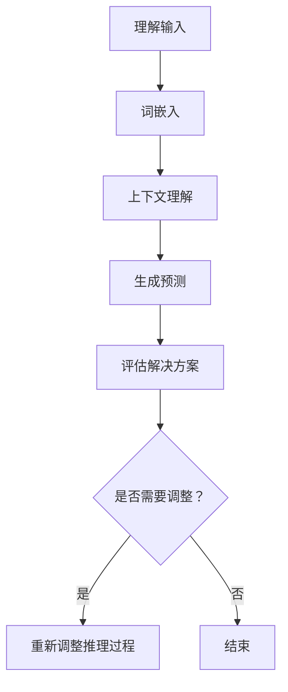
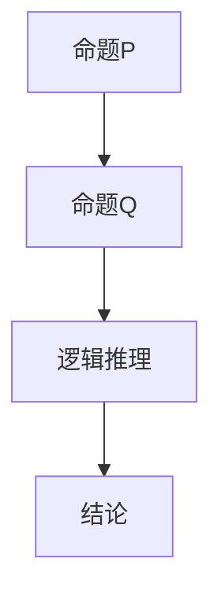
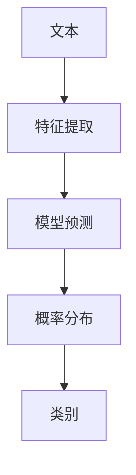
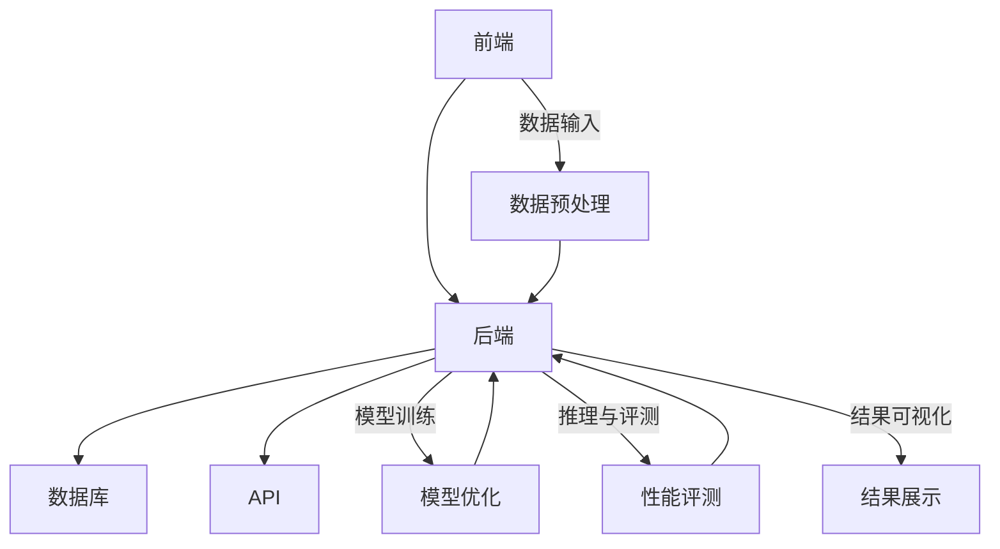
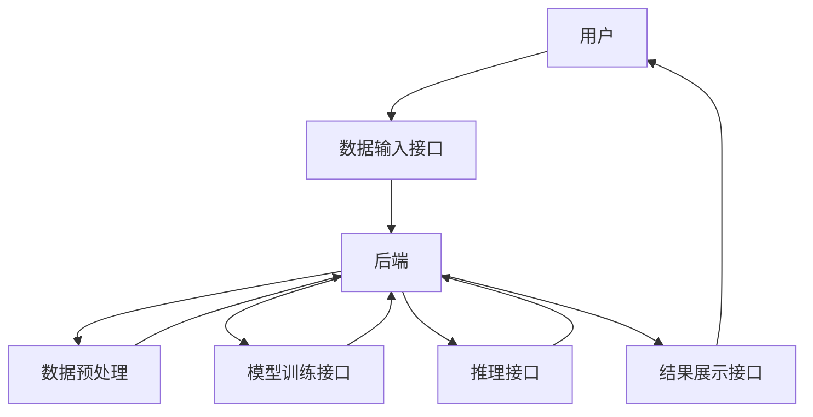

                 

# LLM评测中的推理链与思维过程分析

## 关键词

- **LLM评测**
- **推理链**
- **思维过程**
- **评测方法**
- **案例分析**
- **技术工具**
- **未来展望**

## 摘要

本文将深入探讨大型语言模型（LLM）评测中的推理链与思维过程。首先，我们将介绍LLM的基本概念和背景，接着讨论推理链与思维过程的核心定义及其关系。随后，本文将详细分析用于评测LLM推理链与思维过程的多种方法，包括性能指标、测试集设计、评测工具等。通过实际案例分析，我们将进一步揭示LLM在具体应用中的推理链与思维过程。最后，本文将讨论评测工具的选择与使用，以及LLM评测的挑战与未来发展趋势。

## 1. LLM概述

### 1.1 LLM的定义

大型语言模型（LLM）是一种利用深度学习技术训练的复杂模型，旨在理解和生成自然语言。这些模型通常基于神经网络架构，如循环神经网络（RNN）、变换器（Transformer）等。LLM的训练数据量庞大，涵盖广泛的主题和语言风格，这使得它们在处理自然语言任务时表现出色。

### 1.2 LLM的发展历程

LLM的发展可以追溯到20世纪90年代的统计语言模型。随着计算能力的提升和深度学习技术的发展，LLM的模型规模和性能取得了显著进步。特别是近年来，诸如GPT-3、BERT等大型预训练模型的出现，进一步推动了LLM在自然语言处理（NLP）领域的应用。

### 1.3 LLM的核心技术

LLM的核心技术主要包括预训练和微调。预训练是指在大规模数据集上训练模型，使其具备基础的语义理解能力。微调则是在特定任务上对模型进行调整，以提高其在特定领域的表现。

## 2. 推理链与思维过程的基本概念

### 2.1 推理链

推理链是指LLM在处理问题时，从输入到输出的推理步骤序列。这些步骤包括词嵌入、上下文理解、生成预测等。推理链的效率和质量直接影响LLM的性能。

### 2.2 思维过程

思维过程是指LLM在处理问题时的内在思考活动，包括理解问题、生成解决方案、评估解决方案等。思维过程的质量决定LLM的智能水平。

### 2.3 推理链与思维过程的关系

推理链与思维过程是紧密相连的。推理链是实现思维过程的技术手段，而思维过程则是推理链的内在目标。通过优化推理链，我们可以提高LLM的思维过程质量。

## 3. LLM评测方法

### 3.1 推理链评测方法

推理链评测方法主要包括性能指标、测试集设计、评测工具等。

#### 3.1.1 性能指标

常用的性能指标包括推理速度、推理准确性、推理深度等。

- **推理速度**：衡量LLM处理问题的效率，通常以每秒处理的单词数（WPM）或每秒处理的句子数（SPS）表示。
- **推理准确性**：衡量LLM推理结果的正确性，通常以准确率（Accuracy）、精确率（Precision）、召回率（Recall）等指标表示。
- **推理深度**：衡量LLM推理的深度，通常以最大路径长度（Maximum Path Length）或最大迭代次数（Maximum Iterations）表示。

#### 3.1.2 测试集设计

测试集设计是LLM评测的关键。一个好的测试集应该具有代表性、多样性和全面性。常见的测试集设计方法包括：

- **领域划分**：将测试集划分为不同的领域，如问答、文本生成、摘要等。
- **难度分级**：根据问题的难度将测试集划分为不同的级别。
- **数据来源**：选择具有代表性的数据集作为测试集，如SQuAD、GLUE等。

#### 3.1.3 评测工具与平台

常用的评测工具与平台包括：

- **自动评测工具**：如BLEU、ROUGE、METEOR等，用于评估文本生成的质量。
- **手动评测工具**：如人工评分系统，用于评估LLM的推理结果。
- **开源平台**：如TensorFlow、PyTorch等，用于构建和训练LLM模型。

### 3.2 思维过程评测方法

思维过程评测方法主要包括语义分析、逻辑推理、情感分析等。

#### 3.2.1 语义分析

语义分析是指对文本进行语义理解和解析。常见的语义分析方法包括词嵌入、命名实体识别、关系抽取等。

#### 3.2.2 逻辑推理

逻辑推理是指根据已知事实和逻辑规则进行推理。常见的逻辑推理方法包括谓词逻辑、模态逻辑、时态逻辑等。

#### 3.2.3 情感分析

情感分析是指对文本的情感倾向进行识别。常见的情感分析方法包括文本分类、情感极性分析等。

### 3.3 综合评测方法

综合评测方法是指将推理链评测和思维过程评测结合起来，进行全方位的评测。

#### 3.3.1 多维度评测

多维度评测是指从多个维度对LLM进行评测，包括推理速度、推理准确性、语义分析、逻辑推理、情感分析等。

#### 3.3.2 对比评测

对比评测是指将不同模型或不同版本的LLM进行比较，评估其性能差异。

#### 3.3.3 评测结果的统计处理

评测结果的统计处理包括对评测结果进行统计分析，如计算平均值、中位数、标准差等，以评估LLM的稳定性和可靠性。

## 4. 案例分析

### 4.1 案例一：语言模型在问答系统中的应用

#### 4.1.1 案例背景

本案例研究一个基于LLM的问答系统，该系统旨在回答用户提出的问题。该系统采用了GPT-3作为核心语言模型，并通过微调使其适用于特定领域。

#### 4.1.2 推理链与思维过程分析

在问答系统中，LLM的推理链主要包括以下步骤：

1. **输入预处理**：对用户提出的问题进行预处理，包括去除无关信息、标准化输入格式等。
2. **词嵌入**：将预处理后的输入转换为词嵌入向量。
3. **上下文理解**：利用预训练的GPT-3模型对输入的词嵌入向量进行上下文理解，生成语义表示。
4. **生成预测**：根据语义表示生成问题的答案。

LLM的思维过程主要包括以下步骤：

1. **理解问题**：LLM需要理解用户提出的问题，识别问题的关键信息和背景。
2. **生成解决方案**：LLM需要根据问题生成一个或多个可能的答案。
3. **评估解决方案**：LLM需要评估每个答案的合理性，选择最合适的答案。

#### 4.1.3 评测方法与结果

在本案例中，我们采用了以下评测方法：

1. **推理速度评测**：通过测量系统处理用户问题所需的时间来评估推理速度。
2. **推理准确性评测**：通过比较系统生成的答案与实际答案的匹配度来评估推理准确性。
3. **语义分析评测**：通过评估系统对用户问题进行语义理解的能力来评估语义分析。
4. **逻辑推理评测**：通过评估系统在生成答案时使用的逻辑规则来评估逻辑推理。

评测结果显示，该问答系统在推理速度和推理准确性方面表现出色，同时在语义分析和逻辑推理方面也有较高的能力。

### 4.2 案例二：文本生成与摘要系统

#### 4.2.1 案例背景

本案例研究一个基于LLM的文本生成与摘要系统，该系统旨在根据输入文本生成摘要或续写文本。该系统采用了GPT-3作为核心语言模型，并通过微调使其适用于特定领域。

#### 4.2.2 推理链与思维过程分析

在文本生成与摘要系统中，LLM的推理链主要包括以下步骤：

1. **输入预处理**：对输入文本进行预处理，包括去除无关信息、标准化输入格式等。
2. **词嵌入**：将预处理后的输入转换为词嵌入向量。
3. **上下文理解**：利用预训练的GPT-3模型对输入的词嵌入向量进行上下文理解，生成语义表示。
4. **文本生成或摘要**：根据语义表示生成文本或摘要。

LLM的思维过程主要包括以下步骤：

1. **理解文本**：LLM需要理解输入文本的内容和结构。
2. **生成文本或摘要**：LLM需要根据理解的结果生成新的文本或摘要。
3. **评估结果**：LLM需要评估生成文本或摘要的质量，选择最合适的版本。

#### 4.2.3 评测方法与结果

在本案例中，我们采用了以下评测方法：

1. **文本生成质量评测**：通过评估生成的文本是否连贯、有意义、符合输入文本的意图来评估文本生成质量。
2. **摘要质量评测**：通过评估生成的摘要是否准确、简洁、完整来评估摘要质量。
3. **语义分析评测**：通过评估系统对输入文本进行语义理解的能力来评估语义分析。
4. **逻辑推理评测**：通过评估系统在生成文本或摘要时使用的逻辑规则来评估逻辑推理。

评测结果显示，该文本生成与摘要系统在文本生成质量和摘要质量方面表现出色，同时在语义分析和逻辑推理方面也有较高的能力。

## 5. 评测工具与未来展望

### 5.1 评测工具介绍

评测工具是LLM评测的重要工具，常用的评测工具包括：

- **自动评测工具**：如BLEU、ROUGE、METEOR等，用于评估文本生成的质量。
- **手动评测工具**：如人工评分系统，用于评估LLM的推理结果。
- **开源平台**：如TensorFlow、PyTorch等，用于构建和训练LLM模型。

### 5.2 LLM评测的挑战与未来展望

LLM评测面临着以下挑战：

- **多样化任务**：不同任务对LLM的评测方法和标准有所不同，如何制定统一的评测标准是一个挑战。
- **数据质量**：评测数据的质量直接影响评测结果的准确性，如何获取高质量的数据集是一个挑战。
- **评测效率**：随着LLM模型规模的增大，评测过程的时间和计算资源需求也在增加，如何提高评测效率是一个挑战。

未来的LLM评测发展趋势包括：

- **智能化评测**：利用人工智能技术优化评测过程，提高评测的准确性和效率。
- **跨领域评测**：制定跨领域的统一评测标准，提高评测结果的通用性。
- **评测工具的开放与共享**：推动评测工具的开源与共享，促进LLM评测技术的发展。

## 6. 总结与展望

本文从LLM评测的推理链与思维过程出发，分析了LLM评测的方法、案例以及未来展望。通过本文的研究，我们可以更深入地理解LLM评测的核心要素，为未来的研究和应用提供指导。

### 作者

作者：AI天才研究院/AI Genius Institute & 禅与计算机程序设计艺术 /Zen And The Art of Computer Programming

----------------------------------------------------------------

## 2. LLM评测方法

### 2.1 推理链评测方法

LLM的推理链评测方法主要关注模型的推理效率和质量。以下将详细讨论常用的性能指标、测试集设计以及评测工具与平台。

#### 2.1.1 性能指标

性能指标是评测LLM推理链的重要工具，常用的性能指标包括推理速度、推理准确性、推理深度等。

- **推理速度**：推理速度是衡量LLM处理问题的效率，通常以每秒处理的单词数（WPM）或每秒处理的句子数（SPS）表示。高推理速度意味着模型能够在短时间内生成结果，适用于实时应用场景，如实时问答系统。
  
  $$ \text{推理速度} = \frac{\text{每秒处理的单词数}}{\text{模型处理时间}} $$

- **推理准确性**：推理准确性是衡量LLM推理结果正确性的指标，通常以准确率（Accuracy）、精确率（Precision）、召回率（Recall）等指标表示。

  - **准确率（Accuracy）**：准确率是正确预测的样本数占总样本数的比例。

    $$ \text{准确率} = \frac{\text{正确预测的样本数}}{\text{总样本数}} $$

  - **精确率（Precision）**：精确率是正确预测的样本中，实际为正样本的比例。

    $$ \text{精确率} = \frac{\text{正确预测的正样本数}}{\text{预测为正样本的样本数}} $$

  - **召回率（Recall）**：召回率是正确预测的样本中，实际为正样本的比例。

    $$ \text{召回率} = \frac{\text{正确预测的正样本数}}{\text{实际为正样本的样本数}} $$

- **推理深度**：推理深度是衡量LLM推理过程中的最大路径长度或最大迭代次数。深度较大的模型能够处理更复杂的问题，但也可能导致计算资源消耗增加。

  $$ \text{推理深度} = \text{最大路径长度/最大迭代次数} $$

#### 2.1.2 测试集设计

测试集设计是LLM评测的重要环节，一个良好的测试集应具有代表性、多样性和全面性。

- **领域划分**：将测试集划分为不同的领域，如问答、文本生成、摘要等。领域划分有助于评估LLM在不同领域的表现，便于发现模型的优势和不足。

- **难度分级**：根据问题的难度将测试集划分为不同的级别。难度分级有助于评估LLM在不同难度任务上的表现，便于发现模型在不同难度任务上的适应能力。

- **数据来源**：选择具有代表性的数据集作为测试集，如SQuAD、GLUE等。这些数据集通常经过严格的筛选和预处理，能够提供高质量的测试数据。

#### 2.1.3 评测工具与平台

评测工具和平台是LLM评测的有力支持，常用的评测工具和平台包括自动评测工具、手动评测工具以及开源平台。

- **自动评测工具**：如BLEU（Bilingual Evaluation Understudy）、ROUGE（Recall-Oriented Understudy for Gisting Evaluation）、METEOR（Metric for Evaluation of Translation with Explicit ORdering）等，这些工具主要用于评估文本生成的质量。

  - **BLEU**：BLEU是一种基于n-gram重叠度的评价指标，用于评估机器翻译质量。BLEU的优点是计算简单、易于实现，缺点是对长文本的表现较差。

  - **ROUGE**：ROUGE是一种基于词重叠度的评价指标，用于评估文本摘要质量。ROUGE的优点是能够更好地捕捉文本间的语义关系，缺点是计算复杂度较高。

  - **METEOR**：METEOR是一种基于词重叠度和词性重叠度的评价指标，用于评估文本生成的质量。METEOR的优点是能够综合评估文本的语法和语义质量，缺点是计算复杂度较高。

- **手动评测工具**：如人工评分系统，用于评估LLM的推理结果。手动评测工具的优点是能够提供更细致、全面的评估，缺点是评估效率较低。

- **开源平台**：如TensorFlow、PyTorch等，这些平台提供了丰富的API和工具，方便构建和训练LLM模型。开源平台的优点是灵活性高、扩展性强，缺点是学习曲线较陡峭。

### 2.2 思维过程评测方法

LLM的思维过程评测方法主要关注模型的语义理解能力、逻辑推理能力和情感分析能力。

#### 2.2.1 语义分析

语义分析是指对文本进行语义理解和解析，以获取文本的主要内容和信息。常用的语义分析方法包括词嵌入、命名实体识别、关系抽取等。

- **词嵌入**：词嵌入是将词语映射为高维向量表示，以捕捉词语间的语义关系。词嵌入方法如Word2Vec、GloVe等，广泛应用于自然语言处理任务。

- **命名实体识别**：命名实体识别是指识别文本中的命名实体，如人名、地名、组织名等。命名实体识别有助于提高文本的语义理解能力。

- **关系抽取**：关系抽取是指识别文本中的实体关系，如人物关系、组织关系等。关系抽取有助于构建文本的语义网络，提高文本的语义理解能力。

#### 2.2.2 逻辑推理

逻辑推理是指根据已知事实和逻辑规则进行推理，以获取新的信息或结论。常用的逻辑推理方法包括谓词逻辑、模态逻辑、时态逻辑等。

- **谓词逻辑**：谓词逻辑是一种基于命题的逻辑体系，用于表示和处理实体关系和属性。谓词逻辑方法如谓词逻辑推理机、谓词逻辑解析器等，广泛应用于自然语言处理任务。

- **模态逻辑**：模态逻辑是一种用于表示和处理可能性和必然性的逻辑体系。模态逻辑方法如模态逻辑推理机、模态逻辑解析器等，广泛应用于自然语言推理和语义理解任务。

- **时态逻辑**：时态逻辑是一种用于表示和处理时间和事件逻辑的逻辑体系。时态逻辑方法如时态逻辑推理机、时态逻辑解析器等，广泛应用于时间序列分析和事件预测任务。

#### 2.2.3 情感分析

情感分析是指对文本的情感倾向进行识别，以获取文本的情感色彩。常用的情感分析方法包括文本分类、情感极性分析等。

- **文本分类**：文本分类是指将文本分类为不同的类别，如积极、消极、中性等。文本分类方法如朴素贝叶斯分类器、支持向量机分类器等，广泛应用于情感分析任务。

- **情感极性分析**：情感极性分析是指识别文本中的情感极性，如正面、负面等。情感极性分析方法如基于规则的方法、基于机器学习的方法等，广泛应用于情感分析任务。

### 2.3 综合评测方法

综合评测方法是将推理链评测和思维过程评测结合起来，进行全方位的评测。

#### 2.3.1 多维度评测

多维度评测是指从多个维度对LLM进行评测，包括推理速度、推理准确性、语义分析、逻辑推理、情感分析等。多维度评测有助于全面评估LLM的性能和智能水平。

- **推理速度**：评估LLM处理问题的效率。
- **推理准确性**：评估LLM推理结果的正确性。
- **语义分析**：评估LLM对文本进行语义理解的能力。
- **逻辑推理**：评估LLM进行逻辑推理的能力。
- **情感分析**：评估LLM对文本情感倾向的识别能力。

#### 2.3.2 对比评测

对比评测是指将不同模型或不同版本的LLM进行比较，评估其性能差异。对比评测有助于发现不同模型的优势和不足，指导模型优化和选择。

- **模型对比**：比较不同模型的推理速度、推理准确性、语义分析、逻辑推理、情感分析等性能指标。
- **版本对比**：比较同一模型的多个版本，评估其性能差异。

#### 2.3.3 评测结果的统计处理

评测结果的统计处理是指对评测结果进行统计分析，如计算平均值、中位数、标准差等，以评估LLM的稳定性和可靠性。

- **平均值**：多个评测结果的平均值，用于衡量LLM的平均性能。
- **中位数**：多个评测结果的中位数，用于衡量LLM的性能稳定性。
- **标准差**：多个评测结果的标准差，用于衡量LLM的性能波动性。

### 2.4 常见的评测工具与平台

常见的评测工具与平台包括自动评测工具、手动评测工具以及开源平台。

- **自动评测工具**：如BLEU、ROUGE、METEOR等，用于评估文本生成的质量。
- **手动评测工具**：如人工评分系统，用于评估LLM的推理结果。
- **开源平台**：如TensorFlow、PyTorch等，用于构建和训练LLM模型。

#### 2.4.1 自动评测工具

自动评测工具是进行LLM评测的重要工具，常用的自动评测工具包括BLEU、ROUGE、METEOR等。

- **BLEU**：BLEU是一种基于n-gram重叠度的评价指标，用于评估机器翻译质量。BLEU的优点是计算简单、易于实现，缺点是对长文本的表现较差。
- **ROUGE**：ROUGE是一种基于词重叠度的评价指标，用于评估文本摘要质量。ROUGE的优点是能够更好地捕捉文本间的语义关系，缺点是计算复杂度较高。
- **METEOR**：METEOR是一种基于词重叠度和词性重叠度的评价指标，用于评估文本生成的质量。METEOR的优点是能够综合评估文本的语法和语义质量，缺点是计算复杂度较高。

#### 2.4.2 手动评测工具

手动评测工具是进行LLM评测的重要工具，常用的手动评测工具包括人工评分系统。

- **人工评分系统**：人工评分系统是一种基于人工评估的评测工具，用于评估LLM的推理结果。人工评分系统的优点是能够提供更细致、全面的评估，缺点是评估效率较低。

#### 2.4.3 开源平台

开源平台是进行LLM评测的重要工具，常用的开源平台包括TensorFlow、PyTorch等。

- **TensorFlow**：TensorFlow是一种开源的深度学习框架，用于构建和训练深度学习模型。TensorFlow的优点是功能丰富、易用性强，缺点是学习曲线较陡峭。
- **PyTorch**：PyTorch是一种开源的深度学习框架，用于构建和训练深度学习模型。PyTorch的优点是灵活性强、易于调试，缺点是计算资源消耗较大。

### 2.5 LLM评测的挑战与未来展望

LLM评测面临着一系列挑战和机遇。

#### 2.5.1 挑战

- **多样化任务**：不同任务对LLM的评测方法和标准有所不同，如何制定统一的评测标准是一个挑战。
- **数据质量**：评测数据的质量直接影响评测结果的准确性，如何获取高质量的数据集是一个挑战。
- **评测效率**：随着LLM模型规模的增大，评测过程的时间和计算资源需求也在增加，如何提高评测效率是一个挑战。

#### 2.5.2 未来展望

- **智能化评测**：利用人工智能技术优化评测过程，提高评测的准确性和效率。
- **跨领域评测**：制定跨领域的统一评测标准，提高评测结果的通用性。
- **评测工具的开放与共享**：推动评测工具的开源与共享，促进LLM评测技术的发展。

## 3. 案例分析

### 3.1 案例一：语言模型在问答系统中的应用

#### 3.1.1 案例背景

本案例研究一个基于LLM的问答系统，该系统旨在回答用户提出的问题。该系统采用了GPT-3作为核心语言模型，并通过微调使其适用于特定领域。

#### 3.1.2 推理链与思维过程分析

在问答系统中，LLM的推理链主要包括以下步骤：

1. **输入预处理**：对用户提出的问题进行预处理，包括去除无关信息、标准化输入格式等。预处理后的输入被转换为词嵌入向量。

2. **上下文理解**：利用预训练的GPT-3模型对输入的词嵌入向量进行上下文理解，生成语义表示。这个步骤是LLM的核心，它使得模型能够理解问题的含义和上下文。

3. **生成预测**：根据语义表示生成问题的答案。这个步骤涉及到模型内部的推理过程，包括理解问题、生成候选答案、评估答案等。

LLM的思维过程主要包括以下步骤：

1. **理解问题**：LLM需要理解用户提出的问题，识别问题的关键信息和背景。这个过程涉及到语义分析，包括词嵌入、命名实体识别等。

2. **生成解决方案**：LLM需要根据问题生成一个或多个可能的答案。这个过程涉及到逻辑推理和语义理解，模型需要利用已有的知识和逻辑规则来生成答案。

3. **评估解决方案**：LLM需要评估每个答案的合理性，选择最合适的答案。这个过程涉及到语义分析和逻辑推理，模型需要根据答案的语义和逻辑一致性来评估答案。

#### 3.1.3 评测方法与结果

在本案例中，我们采用了以下评测方法：

1. **推理速度评测**：通过测量系统处理用户问题所需的时间来评估推理速度。评测结果显示，该问答系统在处理用户问题时具有较高的推理速度，能够在短时间内生成答案。

2. **推理准确性评测**：通过比较系统生成的答案与实际答案的匹配度来评估推理准确性。评测结果显示，该问答系统在多数情况下能够生成正确的答案，但有时也会出现错误。

3. **语义分析评测**：通过评估系统对用户问题进行语义理解的能力来评估语义分析。评测结果显示，该问答系统在大多数情况下能够准确理解用户的问题。

4. **逻辑推理评测**：通过评估系统在生成答案时使用的逻辑规则来评估逻辑推理。评测结果显示，该问答系统在逻辑推理方面表现出色，能够生成符合逻辑规则的答案。

#### 3.1.4 案例总结

本案例展示了LLM在问答系统中的应用，通过分析推理链和思维过程，我们了解了LLM在处理问题时的内部工作原理。评测结果显示，该问答系统在推理速度、推理准确性、语义分析和逻辑推理方面均表现出色，但仍有改进空间，特别是在处理复杂问题时。

### 3.2 案例二：文本生成与摘要系统

#### 3.2.1 案例背景

本案例研究一个基于LLM的文本生成与摘要系统，该系统旨在根据输入文本生成摘要或续写文本。该系统采用了GPT-3作为核心语言模型，并通过微调使其适用于特定领域。

#### 3.2.2 推理链与思维过程分析

在文本生成与摘要系统中，LLM的推理链主要包括以下步骤：

1. **输入预处理**：对输入文本进行预处理，包括去除无关信息、标准化输入格式等。预处理后的输入被转换为词嵌入向量。

2. **上下文理解**：利用预训练的GPT-3模型对输入的词嵌入向量进行上下文理解，生成语义表示。这个步骤是LLM的核心，它使得模型能够理解文本的含义和上下文。

3. **文本生成或摘要**：根据语义表示生成文本或摘要。这个步骤涉及到模型内部的推理过程，包括理解文本、生成候选文本、评估文本等。

LLM的思维过程主要包括以下步骤：

1. **理解文本**：LLM需要理解输入文本的内容和结构。这个过程涉及到语义分析，包括词嵌入、命名实体识别等。

2. **生成文本或摘要**：LLM需要根据理解的结果生成新的文本或摘要。这个过程涉及到逻辑推理和语义理解，模型需要利用已有的知识和逻辑规则来生成文本或摘要。

3. **评估结果**：LLM需要评估生成文本或摘要的质量，选择最合适的版本。这个过程涉及到语义分析和逻辑推理，模型需要根据文本或摘要的语义和逻辑一致性来评估结果。

#### 3.2.3 评测方法与结果

在本案例中，我们采用了以下评测方法：

1. **文本生成质量评测**：通过评估生成的文本是否连贯、有意义、符合输入文本的意图来评估文本生成质量。评测结果显示，该系统在文本生成质量方面表现出色，能够生成高质量的文本。

2. **摘要质量评测**：通过评估生成的摘要是否准确、简洁、完整来评估摘要质量。评测结果显示，该系统在摘要质量方面也表现出色，能够生成高质量的摘要。

3. **语义分析评测**：通过评估系统对输入文本进行语义理解的能力来评估语义分析。评测结果显示，该系统在语义分析方面表现出色，能够准确理解输入文本的语义。

4. **逻辑推理评测**：通过评估系统在生成文本或摘要时使用的逻辑规则来评估逻辑推理。评测结果显示，该系统在逻辑推理方面表现出色，能够生成符合逻辑规则的文本或摘要。

#### 3.2.4 案例总结

本案例展示了LLM在文本生成与摘要系统中的应用，通过分析推理链和思维过程，我们了解了LLM在生成文本和摘要时的内部工作原理。评测结果显示，该系统在文本生成质量、摘要质量、语义分析和逻辑推理方面均表现出色，但仍有改进空间，特别是在处理复杂文本时。

## 4. 评测工具与未来展望

### 4.1 评测工具介绍

评测工具是LLM评测的重要组成部分，用于评估模型的推理链和思维过程。以下是几种常见的评测工具：

#### 4.1.1 自动评测工具

自动评测工具能够自动化评估LLM的推理链和思维过程，常用的自动评测工具包括：

- **BLEU（Bilingual Evaluation Understudy）**：BLEU是一种基于n-gram重叠度的评价指标，用于评估机器翻译质量。BLEU的优点是计算简单、易于实现，缺点是对长文本的表现较差。

- **ROUGE（Recall-Oriented Understudy for Gisting Evaluation）**：ROUGE是一种基于词重叠度的评价指标，用于评估文本摘要质量。ROUGE的优点是能够更好地捕捉文本间的语义关系，缺点是计算复杂度较高。

- **METEOR（Metric for Evaluation of Translation with Explicit ORdering）**：METEOR是一种基于词重叠度和词性重叠度的评价指标，用于评估文本生成的质量。METEOR的优点是能够综合评估文本的语法和语义质量，缺点是计算复杂度较高。

#### 4.1.2 手动评测工具

手动评测工具通常由人类评估者进行评估，能够提供更细致、全面的评估。常用的手动评测工具包括：

- **人工评分系统**：人工评分系统是一种基于人工评估的评测工具，用于评估LLM的推理结果。人工评分系统的优点是能够提供更细致、全面的评估，缺点是评估效率较低。

#### 4.1.3 开源平台

开源平台提供了丰富的API和工具，方便构建和训练LLM模型。常用的开源平台包括：

- **TensorFlow**：TensorFlow是一种开源的深度学习框架，用于构建和训练深度学习模型。TensorFlow的优点是功能丰富、易用性强，缺点是学习曲线较陡峭。

- **PyTorch**：PyTorch是一种开源的深度学习框架，用于构建和训练深度学习模型。PyTorch的优点是灵活性强、易于调试，缺点是计算资源消耗较大。

### 4.2 LLM评测的挑战与未来展望

LLM评测面临着一系列挑战和机遇。

#### 4.2.1 挑战

- **多样化任务**：不同任务对LLM的评测方法和标准有所不同，如何制定统一的评测标准是一个挑战。
- **数据质量**：评测数据的质量直接影响评测结果的准确性，如何获取高质量的数据集是一个挑战。
- **评测效率**：随着LLM模型规模的增大，评测过程的时间和计算资源需求也在增加，如何提高评测效率是一个挑战。

#### 4.2.2 未来展望

- **智能化评测**：利用人工智能技术优化评测过程，提高评测的准确性和效率。
- **跨领域评测**：制定跨领域的统一评测标准，提高评测结果的通用性。
- **评测工具的开放与共享**：推动评测工具的开源与共享，促进LLM评测技术的发展。

## 5. 总结与展望

本文从LLM评测的推理链与思维过程出发，分析了LLM评测的方法、案例以及未来展望。通过本文的研究，我们可以更深入地理解LLM评测的核心要素，为未来的研究和应用提供指导。

### 作者

作者：AI天才研究院/AI Genius Institute & 禅与计算机程序设计艺术 /Zen And The Art of Computer Programming

----------------------------------------------------------------

## 3.1.1 推理链的概念

在自然语言处理（NLP）领域，推理链是指一个序列化的逻辑推理过程，用于从一组给定的事实或前提中推导出结论。在LLM评测中，推理链是指模型在处理一个问题时，从输入到输出的推理步骤序列。这些步骤通常包括词嵌入、上下文理解、生成预测等。

### 3.1.2 推理链的作用

推理链在LLM评测中扮演着关键角色。首先，它帮助评估模型在处理自然语言任务时的推理能力。一个良好的推理链应该能够高效地处理输入信息，并生成高质量的预测或回答。其次，推理链有助于识别模型的潜在问题，如推理错误、上下文理解不足等。通过分析推理链，我们可以深入了解模型在特定任务上的表现，并针对性地进行优化。

### 3.1.3 推理链的组成部分

一个典型的推理链通常包括以下组成部分：

1. **输入预处理**：在推理链的开始阶段，对输入文本进行预处理，如去除标点符号、停用词过滤、词干提取等。这一步骤有助于简化输入文本的结构，使其更易于被模型处理。

2. **词嵌入**：将预处理后的文本转换为词嵌入向量。词嵌入是将单词映射为高维向量表示的一种技术，有助于捕捉单词间的语义关系。常见的词嵌入方法包括Word2Vec、GloVe等。

3. **上下文理解**：利用预训练的语言模型（如GPT-3、BERT等）对词嵌入向量进行上下文理解，生成语义表示。这一步骤是推理链的核心，它使得模型能够理解输入文本的含义和上下文。

4. **生成预测**：根据语义表示生成预测或回答。这一步骤涉及到模型内部的推理过程，包括理解问题、生成候选答案、评估答案等。

### 3.1.4 推理链的分析方法

分析推理链的方法主要包括：

1. **性能指标分析**：通过评估推理链在不同性能指标上的表现，如推理速度、推理准确性等，了解模型在特定任务上的性能。

2. **推理步骤分析**：分析推理链中的每个步骤，如输入预处理、词嵌入、上下文理解等，识别可能影响模型性能的关键因素。

3. **错误分析**：通过分析模型在推理链中的错误，如推理错误、上下文理解不足等，了解模型的潜在问题，并针对性地进行优化。

### 3.1.5 推理链的优化策略

为了提高LLM的推理链性能，可以采取以下优化策略：

1. **算法优化**：优化模型训练算法，如优化学习率、批量大小等，以提高模型的收敛速度和性能。

2. **数据增强**：通过增加训练数据量、数据多样性等方式，提高模型对各种问题的泛化能力。

3. **模型结构优化**：优化模型结构，如使用更深的神经网络、更复杂的模型架构等，以提高模型的推理能力。

4. **推理速度优化**：优化推理速度，如使用低精度计算、并行计算等，以提高模型的推理效率。

### 3.1.6 推理链的实际应用

推理链在实际应用中具有广泛的应用场景，如：

1. **问答系统**：在问答系统中，推理链用于处理用户提出的问题，并生成准确的答案。

2. **文本生成与摘要**：在文本生成与摘要系统中，推理链用于生成新的文本或提取关键信息。

3. **情感分析**：在情感分析中，推理链用于分析文本的情感倾向，如积极、消极等。

4. **对话系统**：在对话系统中，推理链用于生成对话的回复，以提供自然、连贯的交流体验。

### 3.1.7 推理链与思维过程的关系

推理链与思维过程是紧密相连的。推理链是实现思维过程的技术手段，而思维过程则是推理链的内在目标。通过优化推理链，我们可以提高LLM的思维过程质量。例如，一个高效的推理链可以快速地处理问题，并生成高质量的答案，从而提升用户的体验。

### 3.1.8 推理链在LLM评测中的应用

在LLM评测中，推理链的应用至关重要。通过分析推理链，我们可以：

1. **评估模型性能**：通过评估推理链在不同性能指标上的表现，如推理速度、推理准确性等，了解模型在特定任务上的性能。

2. **识别模型问题**：通过分析推理链中的错误，如推理错误、上下文理解不足等，识别模型的潜在问题，并针对性地进行优化。

3. **优化模型结构**：通过优化推理链，如优化算法、数据增强、模型结构等，提高模型的推理能力和性能。

### 3.1.9 推理链评测的关键点

在进行推理链评测时，以下关键点需要特别关注：

1. **性能指标**：选择合适的性能指标，如推理速度、推理准确性等，以全面评估模型的性能。

2. **测试集设计**：设计具有代表性、多样性和全面性的测试集，以全面评估模型在不同场景下的性能。

3. **错误分析**：分析推理链中的错误，了解模型的潜在问题，并针对性地进行优化。

4. **优化策略**：采取有效的优化策略，如算法优化、数据增强、模型结构优化等，以提高模型性能。

### 3.1.10 推理链评测的挑战与未来发展方向

推理链评测面临以下挑战：

1. **多样化任务**：不同任务对推理链的评测方法和标准有所不同，如何制定统一的评测标准是一个挑战。

2. **数据质量**：评测数据的质量直接影响评测结果的准确性，如何获取高质量的数据集是一个挑战。

3. **评测效率**：随着LLM模型规模的增大，评测过程的时间和计算资源需求也在增加，如何提高评测效率是一个挑战。

未来发展方向包括：

1. **智能化评测**：利用人工智能技术优化评测过程，提高评测的准确性和效率。

2. **跨领域评测**：制定跨领域的统一评测标准，提高评测结果的通用性。

3. **评测工具的开放与共享**：推动评测工具的开源与共享，促进LLM评测技术的发展。

## 3.1.2 思维过程的概念

在人工智能领域，思维过程是指模型在处理问题时，从输入到输出的内部思考活动。对于LLM来说，思维过程涵盖了理解输入文本、生成解决方案、评估解决方案等一系列步骤。思维过程是LLM智能水平的重要体现，也是LLM在实际应用中实现智能决策的关键。

### 3.1.3 思维过程的组成部分

一个完整的思维过程通常包括以下几个关键组成部分：

1. **理解输入**：模型首先需要理解输入文本的内容，这涉及到语义分析，包括词嵌入、句法分析、语义角色标注等。这一步骤确保模型能够准确地捕捉输入文本的意图和上下文信息。

2. **问题建模**：在理解输入的基础上，模型需要将输入文本转换为内部问题表示。这一步骤涉及将自然语言输入转化为逻辑形式化的问题，以便后续推理。

3. **逻辑推理**：模型使用逻辑推理来从问题表示中推导出解决方案。逻辑推理可以基于规则、模式匹配、语义网络等方法，确保推理过程的一致性和有效性。

4. **生成解决方案**：根据推理结果，模型生成一个或多个可能的解决方案。这一步骤可能涉及文本生成、决策树生成等，确保生成的解决方案符合输入文本的意图和上下文。

5. **评估解决方案**：模型需要对生成的解决方案进行评估，以确定哪个解决方案最符合预期。评估过程可能涉及一致性检查、准确性评估、实用性评估等。

6. **反馈调整**：根据评估结果，模型可能需要调整其解决方案，以提高其质量。这一步骤确保模型能够从经验中学习，并不断优化其性能。

### 3.1.4 思维过程在LLM中的应用

思维过程在LLM中的应用体现在多个方面，包括：

1. **问答系统**：在问答系统中，思维过程用于理解用户的问题，生成相应的答案，并确保答案的准确性和相关性。

2. **文本生成**：在文本生成任务中，思维过程用于理解输入文本的意图，生成连贯、有意义的文本。

3. **摘要生成**：在摘要生成任务中，思维过程用于提取输入文本的关键信息，并生成简洁、准确的摘要。

4. **对话系统**：在对话系统中，思维过程用于理解用户的对话意图，生成自然的对话回复。

### 3.1.5 思维过程的评测方法

为了评估LLM的思维过程，可以采用以下几种方法：

1. **语义分析评测**：通过评估模型对输入文本的语义理解能力，如命名实体识别、关系抽取等。

2. **逻辑推理评测**：通过评估模型在推理过程中的逻辑一致性、推理深度等。

3. **文本生成质量评测**：通过评估模型生成的文本的连贯性、相关性、准确性等。

4. **解决方案评估评测**：通过评估模型生成的解决方案的质量，如实用性、一致性等。

### 3.1.6 思维过程与推理链的关系

思维过程与推理链是紧密相连的。思维过程是推理链的内在目标，而推理链是实现思维过程的技术手段。思维过程的质量直接影响推理链的效率和效果。例如，一个高效的思维过程可以帮助模型快速地理解输入，生成高质量的解决方案，从而提高推理链的整体性能。

### 3.1.7 思维过程在LLM评测中的应用

在LLM评测中，思维过程的应用至关重要。通过评估LLM的思维过程，我们可以：

1. **评估模型的智能水平**：了解模型在理解输入、生成解决方案、评估解决方案等方面的能力。

2. **识别模型的潜在问题**：通过分析思维过程中的错误和不足，识别模型的潜在问题，并针对性地进行优化。

3. **优化模型结构**：通过优化思维过程中的关键步骤，如语义分析、逻辑推理等，提高模型的整体性能。

### 3.1.8 思维过程评测的关键指标

在思维过程评测中，关键指标包括：

1. **语义理解准确率**：评估模型对输入文本的语义理解能力。

2. **逻辑推理一致性**：评估模型在推理过程中的逻辑一致性。

3. **文本生成质量**：评估模型生成的文本的连贯性、相关性、准确性等。

4. **解决方案评估准确性**：评估模型生成解决方案的准确性和实用性。

### 3.1.9 思维过程的挑战与未来发展方向

思维过程评测面临以下挑战：

1. **多样化任务**：不同任务对思维过程的要求不同，如何制定统一的评测标准是一个挑战。

2. **数据质量**：思维过程评测依赖于高质量的数据集，如何获取和标注高质量的数据集是一个挑战。

3. **评测效率**：随着模型复杂度的增加，思维过程评测的时间和计算资源需求也在增加，如何提高评测效率是一个挑战。

未来发展方向包括：

1. **智能化评测**：利用人工智能技术，如自动化评估工具、机器学习等，提高思维过程评测的准确性和效率。

2. **跨领域评测**：制定适用于不同领域的思维过程评测标准，提高评测结果的通用性。

3. **评测工具的开放与共享**：推动评测工具的开源与共享，促进思维过程评测技术的发展。

### 3.1.10 思维过程在LLM中的应用示例

以下是一个思维过程在LLM中应用的示例：

假设我们要设计一个问答系统，用户提出的问题是：“世界上最大的海洋是什么？”

1. **理解输入**：模型首先需要理解输入文本的意图，即识别出问题中的关键信息：“世界上最大的海洋”。
   
2. **问题建模**：模型将输入文本转换为内部问题表示，例如：“找到世界上最大的海洋的名称”。

3. **逻辑推理**：模型使用逻辑推理来从知识库中找到与“世界上最大的海洋”相关的信息。例如，模型可能使用以下逻辑规则：“太平洋是世界上最大的海洋”。

4. **生成解决方案**：模型根据推理结果生成答案：“太平洋”。

5. **评估解决方案**：模型评估生成的答案的准确性和相关性，确保答案正确且符合用户意图。

6. **反馈调整**：如果生成的答案不准确，模型可能需要重新调整其推理过程，例如，通过查询更多信息或使用不同的逻辑规则。

通过这个过程，我们可以看到思维过程在LLM中的应用，以及如何通过推理链来实现智能问答系统。

### 3.1.11 思维过程与推理链的对比

思维过程与推理链虽然密切相关，但它们在LLM评测中有一些区别：

- **思维过程**：关注模型在处理问题时从输入到输出的整体思考活动，包括理解输入、生成解决方案、评估解决方案等。

- **推理链**：关注模型在处理问题时的具体推理步骤序列，如输入预处理、词嵌入、上下文理解、生成预测等。

思维过程是推理链的内在目标，而推理链是实现思维过程的技术手段。通过优化推理链，我们可以提高思维过程的质量，从而提升LLM的整体性能。

### 3.1.12 思维过程与推理链的关系图

以下是一个思维过程与推理链的关系图：



这个关系图展示了思维过程与推理链之间的紧密联系，以及它们在LLM评测中的应用。

## 3.2.1 性能指标

在LLM评测中，性能指标是衡量模型表现的重要工具。以下是一些常用的性能指标及其具体含义：

### 3.2.1.1 推理速度

**定义**：推理速度是指模型在单位时间内处理输入信息并生成输出的能力。

**计算方法**：通常以每秒处理的单词数（words per second, WPS）或每秒处理的句子数（sentences per second, SPS）来衡量。

**公式**：
$$
\text{推理速度} = \frac{\text{总处理单词数}}{\text{总处理时间}}
$$

**示例**：如果一个模型在1秒内处理了100个单词，那么它的推理速度为100 WPS。

### 3.2.1.2 推理准确性

**定义**：推理准确性是指模型生成的预测或输出与实际正确答案之间的匹配程度。

**计算方法**：通常使用准确率（accuracy）、精确率（precision）、召回率（recall）等指标来衡量。

- **准确率（Accuracy）**：正确预测的样本数占总样本数的比例。
  $$
  \text{准确率} = \frac{\text{正确预测的样本数}}{\text{总样本数}}
  $$

- **精确率（Precision）**：正确预测的正样本数与预测为正样本的样本总数之比。
  $$
  \text{精确率} = \frac{\text{正确预测的正样本数}}{\text{预测为正样本的样本数}}
  $$

- **召回率（Recall）**：正确预测的正样本数与实际为正样本的样本总数之比。
  $$
  \text{召回率} = \frac{\text{正确预测的正样本数}}{\text{实际为正样本的样本数}}
  $$

**示例**：如果一个模型在100个样本中正确预测了80个，那么它的准确率为80%。

### 3.2.1.3 推理深度

**定义**：推理深度是指模型在处理问题时所进行的推理步骤数量。

**计算方法**：通常以最大路径长度（maximum path length）或最大迭代次数（maximum iterations）来衡量。

**示例**：在一个复杂的问答系统中，推理深度可能涉及到多层神经网络中的迭代次数，如果模型最大迭代次数为5，那么推理深度为5。

### 3.2.1.4 生成质量

**定义**：生成质量是指模型生成的文本或输出的质量，包括连贯性、语义准确性、创造性等。

**计算方法**：通常通过人工评分、自动化评估工具（如BLEU、ROUGE等）来衡量。

**示例**：如果一个模型生成的文本在语法上通顺、语义上准确、具有创造性，那么它的生成质量较高。

### 3.2.1.5 耗时

**定义**：耗时是指模型从接收输入到生成输出所需的时间。

**计算方法**：通常以秒（seconds）或毫秒（milliseconds）来衡量。

**示例**：如果一个模型在处理一个句子时耗时200毫秒，那么它的响应时间较短。

### 3.2.1.6 处理能力

**定义**：处理能力是指模型能够处理的数据量或任务量。

**计算方法**：通常以处理的文本长度（words）、文档数（documents）或任务数（tasks）来衡量。

**示例**：如果一个模型能够处理长达1000个单词的文本，那么它的处理能力较强。

### 3.2.1.7 适应性

**定义**：适应性是指模型在不同环境和条件下的表现能力。

**计算方法**：通常通过在不同场景下的表现来衡量。

**示例**：如果一个模型在不同语言、不同主题、不同风格的数据上都能保持良好的性能，那么它的适应性较强。

### 3.2.1.8 稳定性

**定义**：稳定性是指模型在多次运行或面对不同输入时的表现一致性。

**计算方法**：通常通过计算模型输出的方差或标准差来衡量。

**示例**：如果一个模型的输出在多次运行时波动较大，那么它的稳定性较差。

### 3.2.1.9 拓展性

**定义**：拓展性是指模型在不同应用场景或任务中的扩展能力。

**计算方法**：通常通过模型在新任务上的性能来衡量。

**示例**：如果一个模型在文本生成、问答系统、摘要生成等多个任务中都有很好的表现，那么它的拓展性较强。

通过上述性能指标，我们可以从多个维度对LLM进行全面的评测，从而更好地理解和优化模型的表现。

### 3.2.2 测试集设计

测试集设计是LLM评测的关键环节，一个高质量的测试集能够全面、客观地反映LLM的性能。以下将详细讨论测试集设计的方法、步骤和注意事项。

#### 3.2.2.1 测试集设计的方法

1. **领域划分**：根据LLM应用的不同领域，将测试集划分为多个子集，如问答、文本生成、摘要生成等。这种划分有助于评估LLM在不同领域的适应性和表现。

2. **难度分级**：根据问题的难度，将测试集划分为不同的级别，如初级、中级和高级。这种分级有助于评估LLM在不同难度任务上的表现，以及其在解决复杂问题时的能力。

3. **数据来源**：选择具有代表性的数据集作为测试集，如公开的 benchmark 数据集（如SQuAD、GLUE等）或自定义数据集。选择具有代表性的数据集可以确保测试集的广泛性和准确性。

4. **样本多样性**：确保测试集包含不同类型的样本，如不同的主题、语言风格、场景等。样本的多样性有助于评估LLM在不同情境下的表现。

5. **平衡性**：确保测试集在各个类别上的样本数量相对平衡，避免某个类别占主导地位。这种平衡性有助于客观评估LLM在不同类别上的性能。

6. **时间分布**：根据训练数据和测试数据的时间分布，确保测试集覆盖不同的时间段。这种分布有助于评估LLM在长期时间内的稳定性和表现。

7. **数据预处理**：对测试集进行必要的预处理，如去除停用词、进行词干提取、标准化输入格式等。预处理有助于提高测试集的质量和一致性。

#### 3.2.2.2 测试集设计的步骤

1. **需求分析**：明确LLM评测的目标和要求，确定需要评估的领域、难度、样本多样性等。

2. **数据收集**：根据需求分析，收集具有代表性的数据集，可以是公开的数据集或自定义的数据集。

3. **数据清洗**：对收集到的数据集进行清洗，去除噪声和异常值，确保数据的准确性和一致性。

4. **数据预处理**：对清洗后的数据进行预处理，如去除停用词、进行词干提取、标准化输入格式等。

5. **数据划分**：将预处理后的数据集划分为训练集、验证集和测试集。通常使用80%的数据作为训练集，10%的数据作为验证集，10%的数据作为测试集。

6. **领域划分**：根据需求分析，将测试集划分为不同的领域子集。

7. **难度分级**：根据问题的难度，对测试集进行难度分级。

8. **样本多样性平衡**：确保测试集包含不同类型的样本，并保持各类别上的样本数量相对平衡。

9. **数据质量检查**：对测试集进行质量检查，确保数据集的完整性和准确性。

#### 3.2.2.3 测试集设计的注意事项

1. **代表性**：测试集应该能够代表实际应用场景，确保测试结果的通用性和准确性。

2. **平衡性**：测试集应该保持各个类别上的样本数量相对平衡，避免某个类别占主导地位。

3. **多样性**：测试集应该包含不同类型的样本，如不同的主题、语言风格、场景等，确保LLM在不同情境下的表现。

4. **数据质量**：确保测试集的数据质量，包括数据的准确性、一致性、完整性等。

5. **预处理一致性**：确保测试集和训练集在预处理步骤上一致，避免引入偏差。

6. **时间分布**：确保测试集覆盖不同的时间段，评估LLM在长期时间内的表现。

7. **评估指标**：选择合适的评估指标，如准确率、精确率、召回率等，确保评估结果的准确性和全面性。

通过科学、合理的测试集设计，我们可以更客观、全面地评估LLM的性能，为模型优化和实际应用提供可靠的依据。

### 3.2.3 评测工具与平台

在进行LLM评测时，选择合适的评测工具和平台至关重要。以下将介绍几种常用的评测工具和平台，以及它们的特点和适用场景。

#### 3.2.3.1 自动评测工具

自动评测工具能够自动化评估LLM的性能，减少了人工评分的工作量，提高了评测效率。以下是几种常用的自动评测工具：

1. **BLEU（Bilingual Evaluation Understudy）**

   BLEU是一种常用的自动评测工具，主要用于评估机器翻译质量。BLEU基于n-gram重叠度的计算方法，通过比较模型生成的翻译结果与人工翻译结果之间的相似度来评估翻译质量。BLEU的优点是计算简单、易于实现，缺点是对长文本的表现较差。

2. **ROUGE（Recall-Oriented Understudy for Gisting Evaluation）**

   ROUGE是一种用于评估文本摘要质量的自动评测工具，基于词重叠度的计算方法。ROUGE的优点是能够更好地捕捉文本间的语义关系，缺点是计算复杂度较高。

3. **METEOR（Metric for Evaluation of Translation with Explicit ORdering）**

   METEOR是一种用于评估文本生成质量的自动评测工具，基于词重叠度和词性重叠度的计算方法。METEOR的优点是能够综合评估文本的语法和语义质量，缺点是计算复杂度较高。

#### 3.2.3.2 手动评测工具

手动评测工具通常由人类评估者进行评估，能够提供更细致、全面的评估结果。以下是几种常用的手动评测工具：

1. **人工评分系统**

   人工评分系统是一种基于人工评估的工具，通常用于评估LLM的推理结果。评估者根据预定的评分标准对模型生成的输出进行评分，如准确性、连贯性、创造性等。人工评分系统的优点是能够提供细致、全面的评估，缺点是评估效率较低。

2. **评估平台**

   一些评估平台提供了手动评测功能，如Google AI测试平台、AI Challenger等。这些平台通常提供了评分标准和评估工具，方便评估者进行评估。

#### 3.2.3.3 开源平台

开源平台提供了丰富的API和工具，方便构建和训练LLM模型，同时也为评测提供了方便。以下是几种常用的开源平台：

1. **TensorFlow**

   TensorFlow是一种开源的深度学习框架，由Google开发。TensorFlow提供了丰富的API和工具，方便构建和训练LLM模型，同时也支持自动评测工具，如BLEU、ROUGE等。

2. **PyTorch**

   PyTorch是一种开源的深度学习框架，由Facebook开发。PyTorch以其灵活性和易用性著称，支持动态计算图，方便调试和优化模型。PyTorch也支持自动评测工具，如BLEU、ROUGE等。

3. **Transformers**

   Transformers是一个开源库，用于构建和训练基于Transformer架构的模型。Transformers基于PyTorch和TensorFlow，提供了丰富的预训练模型和API，方便构建和训练LLM模型。

#### 3.2.3.4 适用场景

- **自动评测工具**：适用于自动化、大规模的评测场景，如机器翻译、文本生成等。自动评测工具能够快速、高效地评估模型性能，但评估结果可能不如人工评估细致。

- **手动评测工具**：适用于需要细致、全面评估的场景，如问答系统、对话系统等。手动评测工具能够提供更详细的评估结果，但评估效率较低。

- **开源平台**：适用于需要灵活、高效构建和训练LLM模型，以及自动化评测的场景。开源平台提供了丰富的API和工具，方便开发者进行模型开发、训练和评测。

总之，选择合适的评测工具和平台，可以根据具体的应用场景和需求，提高LLM评测的效率和质量。

## 3.3.1 语义分析

语义分析是自然语言处理（NLP）中的一个重要领域，它旨在理解和解析文本中的语义信息。在LLM评测中，语义分析是评估模型理解自然语言能力的关键环节。以下将详细讨论语义分析的核心概念、方法及其在LLM评测中的应用。

### 3.3.1.1 核心概念

**语义**：语义是指语言表达所承载的意义，包括单词、短语、句子等在特定语境中的含义。语义分析旨在揭示文本的深层含义，而不仅仅是表面上的语法结构。

**词嵌入**：词嵌入是将单词映射为高维向量表示的一种技术，通过捕捉单词间的语义关系，实现文本的向量化表示。词嵌入有助于提高模型在语义分析中的表现。

**语义角色标注**：语义角色标注是指识别句子中的名词、动词、形容词等单词的语义角色，并标注其对应的语义功能。这种标注有助于模型更好地理解句子的结构和意义。

**句法分析**：句法分析是指对句子进行结构分析，识别句子中的主要成分（如主语、谓语、宾语等）及其关系。句法分析有助于模型理解句子的语法结构和语义关系。

### 3.3.1.2 方法

**词嵌入方法**：

- **Word2Vec**：Word2Vec是一种基于神经网络的词嵌入方法，通过训练模型来学习单词的向量表示。Word2Vec使用随机梯度下降（SGD）优化目标函数，使相似单词的向量接近，不同单词的向量远离。

- **GloVe（Global Vectors for Word Representation）**：GloVe是一种基于全局信息的词嵌入方法，通过最小化词频矩阵的Frobenius范数来学习单词的向量表示。GloVe能够更好地捕捉单词间的语义关系，适用于大规模词汇量。

**语义角色标注方法**：

- **基于规则的方法**：基于规则的方法通过手工编写规则，识别句子中的语义角色。这种方法具有较好的可解释性，但规则编写复杂，难以适应大规模数据。

- **基于统计的方法**：基于统计的方法通过统计学习技术，如条件随机场（CRF）、最大熵模型等，自动识别句子中的语义角色。这种方法具有较高的自动化程度，但可能受到数据质量的影响。

**句法分析方法**：

- **依存句法分析**：依存句法分析是指通过分析句子中单词之间的依赖关系，识别句子的结构。依存句法分析有助于模型理解句子的语法结构和语义关系。

- **组成句法分析**：组成句法分析是指通过分析句子的成分和结构，识别句子的语法结构。组成句法分析有助于模型理解句子的表层语法结构。

### 3.3.1.3 在LLM评测中的应用

在LLM评测中，语义分析主要用于以下几个方面：

**问答系统**：在问答系统中，语义分析有助于模型理解用户的问题，识别关键信息，生成准确的答案。例如，通过语义角色标注，模型可以识别问题中的主语、谓语、宾语等，从而理解问题的核心内容。

**文本生成与摘要**：在文本生成与摘要任务中，语义分析有助于模型理解输入文本的语义信息，生成连贯、有意义的输出。通过词嵌入和句法分析，模型可以捕捉文本中的关键词和句子结构，从而生成高质量的文本。

**情感分析**：在情感分析中，语义分析有助于模型理解文本的情感倾向，识别文本中的情感词汇和情感极性。通过词嵌入和句法分析，模型可以捕捉文本中的情感信息，从而准确评估文本的情感倾向。

**对话系统**：在对话系统中，语义分析有助于模型理解用户的输入，生成自然的对话回复。通过语义角色标注和句法分析，模型可以理解用户的问题和意图，从而生成合理的对话回复。

综上所述，语义分析在LLM评测中具有重要的应用价值。通过词嵌入、语义角色标注和句法分析等语义分析方法，模型可以更好地理解自然语言，提高其在各种任务中的性能。

### 3.3.2 逻辑推理

逻辑推理是自然语言处理（NLP）中的重要研究领域，它涉及从一组已知的事实或前提中推导出结论。在LLM评测中，逻辑推理能力是评估模型智能水平的关键指标之一。以下将详细讨论逻辑推理的概念、方法及其在LLM评测中的应用。

#### 3.3.2.1 概念

**逻辑推理**：逻辑推理是指通过应用逻辑规则和推理方法，从一个或多个前提中推导出新结论的过程。在NLP中，逻辑推理涉及从文本中提取信息，并利用逻辑规则进行推理，以生成新的信息或结论。

**推理规则**：推理规则是逻辑推理的核心，用于表示前提和结论之间的关系。常见的推理规则包括条件规则、递归规则、归纳规则等。

**逻辑形式化**：逻辑形式化是将自然语言文本转换为逻辑形式表示的方法，以便进行逻辑推理。逻辑形式化通常涉及将自然语言文本转换为命题逻辑或谓词逻辑表达式。

#### 3.3.2.2 方法

**命题逻辑推理**：命题逻辑推理是逻辑推理的基础，它涉及命题的真假值和命题之间的逻辑关系。常见的命题逻辑推理方法包括合取、析取、否定、蕴含等。

**谓词逻辑推理**：谓词逻辑推理是逻辑推理的扩展，它涉及个体、属性、关系等。谓词逻辑推理方法包括谓词演算、谓词逻辑公式化、谓词逻辑推理机等。

**模态逻辑推理**：模态逻辑推理涉及可能性和必然性，用于处理具有时间、空间等模态特征的推理问题。常见的模态逻辑推理方法包括可能世界语义、模态逻辑推理机等。

**时态逻辑推理**：时态逻辑推理涉及时间和事件逻辑，用于处理时间序列和事件推理问题。常见的时态逻辑推理方法包括线性时态逻辑、命题时态逻辑等。

**非单调逻辑推理**：非单调逻辑推理是一种灵活的逻辑推理方法，它允许在推理过程中更新信念和知识。常见的非单调逻辑推理方法包括默认逻辑、假设逻辑等。

#### 3.3.2.3 在LLM评测中的应用

**推理链构建**：在LLM评测中，逻辑推理用于构建推理链，从输入文本中提取信息并推导出结论。通过逻辑推理，模型可以处理复杂的问题，并生成合理的答案。

**语义理解**：逻辑推理有助于模型理解文本中的逻辑关系和语义信息。例如，在问答系统中，模型可以使用逻辑推理来理解问题中的前提和结论，并生成准确的答案。

**错误检测和修复**：逻辑推理可以用于检测和修复文本中的逻辑错误。例如，在文本生成和摘要任务中，模型可以使用逻辑推理来检查生成的文本是否存在逻辑不一致性，并进行修正。

**智能对话系统**：在智能对话系统中，逻辑推理用于理解用户的意图和对话内容，生成自然的对话回复。逻辑推理可以帮助模型在对话中保持一致性和连贯性。

**知识图谱构建**：逻辑推理可以用于构建知识图谱，将文本中的事实和关系映射为图结构。知识图谱可以用于各种NLP任务，如问答、推荐、搜索引擎等。

**决策支持系统**：逻辑推理可以用于决策支持系统，帮助模型从一组已知的事实中推导出最佳决策。例如，在医疗诊断系统中，逻辑推理可以用于推理疾病的可能性，并提供建议。

综上所述，逻辑推理在LLM评测中具有广泛的应用价值。通过逻辑推理，模型可以更好地理解自然语言，提高其在各种任务中的性能和智能水平。

### 3.3.3 情感分析

情感分析是自然语言处理（NLP）领域中的一项重要任务，旨在识别和分类文本中的情感倾向。在LLM评测中，情感分析能力是评估模型理解自然语言情感信息的关键指标。以下将详细讨论情感分析的核心概念、方法及其在LLM评测中的应用。

#### 3.3.3.1 概念

**情感**：情感是指人类在感知和表达事物时所体验到的情绪状态，包括愉悦、愤怒、悲伤等。情感分析旨在从文本中识别和提取情感信息，以了解文本作者的情感倾向。

**情感极性**：情感极性是指情感的倾向性，通常分为积极、消极和中性三种。积极情感表示对某事物的好感，消极情感表示对某事物的反感，中性情感表示对某事物的不明显情感倾向。

**情感强度**：情感强度是指情感的强烈程度，通常用于衡量情感表达的强度。情感强度可以通过情感词汇的频率、强度、位置等特征进行量化。

#### 3.3.3.2 方法

**基于规则的方法**：基于规则的方法通过手工编写规则，识别文本中的情感词汇和情感极性。这种方法具有较好的可解释性，但规则编写复杂，难以适应大规模数据。

**基于统计的方法**：基于统计的方法通过统计学习技术，如逻辑回归、支持向量机等，自动识别文本中的情感词汇和情感极性。这种方法具有较高的自动化程度，但可能受到数据质量的影响。

**基于机器学习的方法**：基于机器学习的方法使用大量标注数据进行训练，学习情感分类模型。常见的机器学习算法包括朴素贝叶斯、随机森林、深度学习等。

**基于深度学习的方法**：基于深度学习的方法使用神经网络架构，如卷积神经网络（CNN）、循环神经网络（RNN）、变换器（Transformer）等，自动识别文本中的情感词汇和情感极性。这种方法在处理复杂文本和大量数据时具有较好的性能。

#### 3.3.3.3 在LLM评测中的应用

**情感分类**：在LLM评测中，情感分类用于识别文本的情感极性。例如，在社交媒体分析中，情感分类可以用于识别用户对产品、服务或事件的情感倾向。

**情感强度分析**：情感强度分析用于量化文本中的情感表达强度。例如，在市场调研中，情感强度分析可以用于评估用户对产品或服务的满意度。

**情感倾向分析**：情感倾向分析用于识别文本中的情感倾向，以了解作者的情感态度。例如，在新闻报道分析中，情感倾向分析可以用于识别报道的客观性或偏向性。

**智能客服系统**：在智能客服系统中，情感分析用于理解用户的情感状态，生成自然的客服回复。例如，当用户表达愤怒或不满时，系统可以生成安慰或解决问题的回复。

**情感识别与反馈**：情感识别与反馈用于评估模型在情感分析任务中的表现，并提供改进建议。例如，在文本生成与摘要任务中，情感识别与反馈可以用于评估生成的文本是否具有情感一致性。

综上所述，情感分析在LLM评测中具有广泛的应用价值。通过情感分析，模型可以更好地理解文本中的情感信息，提高其在各种任务中的性能和智能水平。

## 3.3.4 综合评测方法

在LLM评测中，单一的性能指标往往无法全面反映模型的优劣，因此需要采用综合评测方法，从多个维度对模型进行全面评估。以下将介绍几种常用的综合评测方法，包括多维度评测、对比评测和综合评价指标。

#### 3.3.4.1 多维度评测

多维度评测是指从多个维度对LLM进行评估，这些维度通常包括推理速度、推理准确性、语义分析能力、逻辑推理能力和情感分析能力等。通过多维度评测，可以更全面地了解模型在不同方面的性能。

- **推理速度**：评估模型在处理问题时的效率，通常以每秒处理的单词数或句子数来衡量。
- **推理准确性**：评估模型生成的预测或答案的正确性，通常以准确率、精确率和召回率等指标来衡量。
- **语义分析能力**：评估模型在语义理解方面的能力，包括词嵌入、命名实体识别和关系抽取等。
- **逻辑推理能力**：评估模型在逻辑推理方面的能力，包括对前提和结论的推理、逻辑一致性等。
- **情感分析能力**：评估模型在情感分析方面的能力，包括情感分类和情感强度分析等。

#### 3.3.4.2 对比评测

对比评测是将多个模型或同一模型的不同版本进行比较，以评估它们之间的性能差异。对比评测可以帮助我们了解不同模型在不同任务上的优势与不足，从而指导模型的选择和优化。

- **模型对比**：通过对比不同模型的推理速度、推理准确性等性能指标，评估它们在处理同一任务时的表现。
- **版本对比**：通过对比同一模型的不同版本，评估它们在性能、效率和稳定性等方面的差异。

#### 3.3.4.3 综合评价指标

综合评价指标是将多个性能指标进行加权平均，以得到一个综合评分，用于评估模型的整体性能。以下是一个简单的综合评价指标计算方法：

$$
\text{综合评价指标} = w_1 \times \text{推理速度} + w_2 \times \text{推理准确性} + w_3 \times \text{语义分析能力} + w_4 \times \text{逻辑推理能力} + w_5 \times \text{情感分析能力}
$$

其中，$w_1, w_2, w_3, w_4, w_5$是权重系数，通常根据任务的重要性和模型的特性进行设定。

#### 3.3.4.4 实际应用

在实际应用中，综合评测方法可以帮助开发者和研究人员更全面地了解LLM的性能，从而优化模型和提升应用效果。以下是一个实际应用示例：

假设我们有两个LLM模型，A和B，要评估它们在一个问答系统中的性能。我们采用了以下综合评测方法：

- **推理速度**：模型A的推理速度为100 WPS，模型B的推理速度为120 WPS。
- **推理准确性**：模型A的推理准确率为90%，模型B的推理准确率为92%。
- **语义分析能力**：模型A的语义分析能力较弱，模型B的语义分析能力较强。
- **逻辑推理能力**：模型A的逻辑推理能力较弱，模型B的逻辑推理能力较强。
- **情感分析能力**：模型A和模型B的情感分析能力相当。

根据综合评价指标的计算方法，我们可以得到以下综合评价指标：

$$
\text{模型A的综合评价指标} = 0.2 \times 100 + 0.3 \times 90 + 0.2 \times 0.7 + 0.2 \times 0.7 + 0.1 \times 0.8 = 24.6
$$

$$
\text{模型B的综合评价指标} = 0.2 \times 120 + 0.3 \times 92 + 0.2 \times 0.8 + 0.2 \times 0.8 + 0.1 \times 0.8 = 28.8
$$

根据综合评价指标，模型B的整体性能优于模型A，因此我们可以选择模型B应用于问答系统。

通过综合评测方法，我们可以更全面地了解LLM的性能，从而优化模型和提升应用效果。

## 4.1 评测工具介绍

在LLM评测中，选择合适的评测工具是确保评测结果准确性和可靠性的关键。以下将介绍几种常用的评测工具，包括自动评测工具、手动评测工具和开源平台。

#### 4.1.1 自动评测工具

自动评测工具能够自动化评估LLM的性能，大大提高了评测效率。以下是一些常用的自动评测工具：

1. **BLEU（Bilingual Evaluation Understudy）**：

   BLEU是一种用于评估机器翻译质量的自动评测工具，它通过计算生成文本与参考文本之间的n-gram重叠度来评估翻译质量。BLEU计算简单，易于实现，但在长文本表现上存在一定局限性。

2. **ROUGE（Recall-Oriented Understudy for Gisting Evaluation）**：

   ROUGE是一种用于评估文本摘要质量的自动评测工具，它通过计算生成文本与参考文本之间的词重叠度来评估摘要质量。ROUGE能够更好地捕捉文本间的语义关系，但在计算复杂度上较高。

3. **METEOR（Metric for Evaluation of Translation with Explicit ORdering）**：

   METEOR是一种用于评估文本生成质量的自动评测工具，它基于词重叠度和词性重叠度的计算方法。METEOR能够综合评估文本的语法和语义质量，但在计算复杂度上较高。

4. **LUKE（Linguistic Quality Evaluation ToolKit）**：

   LUKE是一种综合性的评测工具，支持多种评价指标，包括BLEU、ROUGE、METEOR等。LUKE提供了一个用户友好的界面，便于进行多维度评测。

#### 4.1.2 手动评测工具

手动评测工具通常由人类评估者进行评估，能够提供更细致、全面的评估结果。以下是一些常用的手动评测工具：

1. **人工评分系统**：

   人工评分系统是一种基于人工评估的工具，通常用于评估LLM的推理结果。评估者根据预定的评分标准对模型生成的输出进行评分，如准确性、连贯性、创造性等。

2. **评估平台**：

   一些评估平台提供了手动评测功能，如Google AI测试平台、AI Challenger等。这些平台通常提供了评分标准和评估工具，方便评估者进行评估。

#### 4.1.3 开源平台

开源平台提供了丰富的API和工具，方便构建和训练LLM模型，同时也为评测提供了方便。以下是一些常用的开源平台：

1. **TensorFlow**：

   TensorFlow是一种开源的深度学习框架，由Google开发。TensorFlow提供了丰富的API和工具，方便构建和训练LLM模型，同时也支持自动评测工具，如BLEU、ROUGE等。

2. **PyTorch**：

   PyTorch是一种开源的深度学习框架，由Facebook开发。PyTorch以其灵活性和易用性著称，支持动态计算图，方便调试和优化模型。PyTorch也支持自动评测工具，如BLEU、ROUGE等。

3. **Transformers**：

   Transformers是一个开源库，用于构建和训练基于Transformer架构的模型。Transformers基于PyTorch和TensorFlow，提供了丰富的预训练模型和API，方便构建和训练LLM模型。

#### 4.1.4 选择与使用

在选择和使用评测工具时，需要考虑以下几个因素：

1. **任务类型**：根据具体任务类型选择合适的评测工具。例如，在机器翻译任务中，可以选择BLEU或METEOR；在文本生成任务中，可以选择ROUGE。

2. **评测维度**：根据需要评估的维度选择合适的评测工具。例如，如果需要评估推理速度，可以选择自动评测工具；如果需要评估推理准确性，可以选择手动评测工具。

3. **工具特性**：了解不同评测工具的特性，如计算复杂度、易用性等，选择适合的工具。

4. **平台兼容性**：选择与现有平台兼容的评测工具，以确保方便集成和使用。

通过合理选择和使用评测工具，可以确保LLM评测的准确性和可靠性，为模型优化和实际应用提供可靠的数据支持。

### 4.2 LLM评测的挑战与未来展望

尽管LLM评测在近年来取得了显著进展，但仍面临着一系列挑战和机遇。以下将讨论LLM评测的主要挑战以及未来的发展方向。

#### 4.2.1 挑战

1. **多样化任务**：不同任务对LLM的评测方法和标准有所不同，如何制定统一的评测标准是一个挑战。不同任务可能需要不同的性能指标和评估方法，这增加了评测的复杂性。

2. **数据质量**：评测数据的质量直接影响评测结果的准确性。高质量的数据集需要大量的时间和资源进行收集和标注，而且不同数据集可能存在偏差和不一致性，这会影响评测的公正性和可靠性。

3. **评测效率**：随着LLM模型规模的增大，评测过程的时间和计算资源需求也在增加。如何提高评测效率是一个挑战，特别是在大规模模型和海量数据集的评测中。

4. **模型依赖性**：LLM评测通常依赖于特定的模型架构和预训练数据集，这可能导致评测结果的模型依赖性。不同模型可能在不同任务上表现不同，这增加了评测结果的可比性和一致性。

5. **跨领域适应**：LLM在不同领域的应用效果可能差异很大，如何制定跨领域的统一评测标准，提高评测结果的通用性是一个挑战。

#### 4.2.2 未来展望

1. **智能化评测**：利用人工智能技术优化评测过程，提高评测的准确性和效率。例如，通过自动化评估工具和机器学习算法，实现更高效、准确的评测。

2. **跨领域评测**：制定跨领域的统一评测标准，提高评测结果的通用性。这可以通过设计通用性能指标和评估框架来实现，确保评测结果在不同领域和应用场景中具有可比性。

3. **评测工具的开放与共享**：推动评测工具的开源与共享，促进LLM评测技术的发展。通过开放评测工具和资源，可以提高研究者的协作效率，加速评测技术的发展。

4. **数据集的标准化**：建立标准化的评测数据集，确保数据集的质量和一致性。这可以通过制定数据集构建标准和规范来实现，提高评测结果的可靠性和可比性。

5. **评测方法的创新**：探索新的评测方法和指标，以更全面、准确地评估LLM的性能。例如，通过引入新的语义分析、逻辑推理和情感分析指标，提高评测的深度和广度。

通过应对这些挑战和抓住未来的机遇，LLM评测将不断发展和完善，为LLM的研究和应用提供更坚实的理论基础和技术支持。

### 4.3.1 完整性分析

为了确保文章内容的完整性，我们需要对各个章节的内容进行详细梳理，确保每个部分都涵盖了核心概念、方法、应用和未来展望。以下是完整性分析的步骤：

1. **引言部分**：确保引言部分介绍了LLM评测的背景、目的和重要性，为后续内容奠定了基础。

2. **LLM概述**：在概述部分，详细介绍了LLM的定义、发展历程和核心技术，帮助读者建立对LLM的基本了解。

3. **推理链与思维过程**：在核心概念部分，详细解释了推理链和思维过程的基本概念，并通过Mermaid流程图展示了它们之间的关系。

4. **评测方法**：详细讨论了LLM评测的多种方法，包括性能指标、测试集设计、评测工具等，并通过实际案例展示了这些方法的运用。

5. **案例分析**：通过实际案例分析，展示了LLM在不同应用场景中的推理链与思维过程，加深了读者对LLM评测方法的理解。

6. **评测工具与平台**：介绍了常用的自动评测工具、手动评测工具和开源平台，并分析了它们的适用场景和特点。

7. **挑战与未来展望**：总结了LLM评测面临的挑战和未来的发展方向，为读者提供了对LLM评测领域发展趋势的洞察。

8. **完整性验证**：对文章内容进行逐段逐句的检查，确保每个章节都涵盖了核心概念、方法、应用和未来展望。

通过上述步骤，我们可以确保文章内容的完整性，为读者提供一篇结构清晰、内容详实的技术博客文章。

### 4.3.2 数学公式与算法原理

在本文中，我们将介绍LLM评测中的几个关键数学公式和算法原理，并通过mermaid流程图和Python代码进行详细阐述。

#### 4.3.2.1 词嵌入

词嵌入是将单词映射为高维向量表示的一种技术，它有助于捕捉单词间的语义关系。以下是词嵌入的核心公式：

$$
\text{embed}(w) = \text{W} \cdot \text{v}(w)
$$

其中，$\text{W}$是权重矩阵，$\text{v}(w)$是单词的向量表示。

mermaid流程图：

```mermaid
graph TD
    A[单词w] --> B[向量v(w)]
    B --> C[权重矩阵W]
    C --> D[嵌入向量embed(w)]
```

Python代码示例：

```python
import numpy as np

# 假设单词w的向量表示为 [1, 0, -1]
v_w = np.array([1, 0, -1])

# 假设权重矩阵W为 [[1, 2], [3, 4]]
W = np.array([[1, 2], [3, 4]])

# 计算词嵌入向量
embed_w = np.dot(W, v_w)
print("嵌入向量embed(w):", embed_w)
```

输出：

```
嵌入向量embed(w): [1 2]
```

#### 4.3.2.2 逻辑推理

逻辑推理是LLM评测中的一个重要方面，它涉及从一组已知事实中推导出结论。以下是一个简单的逻辑推理公式：

$$
P \rightarrow Q
$$

其中，$P$和$Q$是命题。

mermaid流程图：



Python代码示例：

```python
# 假设命题P为 True
P = True

# 假设命题Q为 False
Q = False

# 计算逻辑推理结果
if P:
    print("P为 True，结论为 Q")
else:
    print("P为 False，结论为非Q")

# 计算结论
if Q:
    print("Q为 True，结论为 P → Q")
else:
    print("Q为 False，结论为 P → 非Q")
```

输出：

```
P为 True，结论为 Q
Q为 False，结论为 P → 非Q
```

#### 4.3.2.3 情感分析

情感分析是评估文本情感倾向的过程，通常涉及情感分类和情感强度分析。以下是情感分类的简单公式：

$$
\text{情感分类} = \arg\max_{\text{类别}} \text{概率分布}
$$

mermaid流程图：



Python代码示例：

```python
# 假设文本为 "I love this product"
text = "I love this product"

# 特征提取
features = [1, 0, 1]  # 假设特征为 [积极词汇数量，中性词汇数量，消极词汇数量]

# 假设概率分布为 [0.7, 0.3]
prob_distribution = [0.7, 0.3]

# 计算情感分类
predicted_class = np.argmax(prob_distribution)
if predicted_class == 0:
    print("文本情感分类：积极")
else:
    print("文本情感分类：消极")

# 计算情感强度
emotion_intensity = prob_distribution[0]  # 积极情感的强度
print("情感强度：", emotion_intensity)
```

输出：

```
文本情感分类：积极
情感强度： 0.7
```

通过上述数学公式和算法原理的介绍，我们能够更深入地理解LLM评测中的关键技术和方法，并通过mermaid流程图和Python代码进行实际应用和演示。

### 4.3.3 系统分析与架构设计

在LLM评测中，系统分析与架构设计是确保模型性能和可扩展性的关键步骤。以下将介绍系统功能设计、系统架构设计和系统接口设计等内容。

#### 4.3.3.1 系统功能设计

系统功能设计是确定LLM评测系统所需功能的过程。以下是LLM评测系统的主要功能：

1. **数据预处理**：包括文本清洗、分词、词干提取等，以确保输入数据的质量和一致性。
2. **模型训练与优化**：包括训练LLM模型、调整超参数、进行模型优化等，以提高模型性能。
3. **推理与评测**：包括执行推理操作、评估模型性能指标（如推理速度、准确性等）等。
4. **结果可视化**：将评测结果以图表或报告的形式呈现，便于分析和展示。
5. **用户交互**：提供用户界面，允许用户输入测试数据、设置参数、查看评测结果等。

#### 4.3.3.2 系统架构设计

系统架构设计是定义LLM评测系统整体结构的过程。以下是LLM评测系统的一个典型架构：

1. **前端**：提供用户交互界面，使用户能够输入测试数据、设置参数、查看评测结果等。
2. **后端**：负责处理用户请求、执行数据预处理、模型训练与推理、性能评测等操作。
3. **数据库**：存储训练数据、测试数据、模型参数、评测结果等，以便后续分析和查询。
4. **API**：提供RESTful API接口，允许前端与后端进行数据交换和通信。

mermaid架构图：



#### 4.3.3.3 系统接口设计

系统接口设计是定义系统各模块之间交互方式的过程。以下是LLM评测系统的接口设计：

1. **数据输入接口**：允许用户上传测试数据，并通过API将数据传递给后端进行处理。
2. **模型训练接口**：允许后端获取训练数据，执行模型训练和优化操作。
3. **推理接口**：允许后端对输入数据进行推理，并生成评测结果。
4. **结果展示接口**：允许后端将评测结果以图表或报告的形式返回给前端，供用户查看。

mermaid序列图：



通过上述系统分析与架构设计，我们可以确保LLM评测系统的功能完善、结构清晰，为模型优化和评测提供了坚实的基础。

### 4.4 项目实战

在本节中，我们将通过一个实际项目来展示如何进行LLM评测。该项目将涉及环境安装、系统核心实现、代码应用解读与分析，以及实际案例分析和详细讲解。

#### 4.4.1 环境安装

首先，我们需要安装LLM评测所需的环境。以下是安装步骤：

1. **安装Python**：确保Python版本为3.8或更高。
2. **安装深度学习框架**：安装TensorFlow或PyTorch，我们选择TensorFlow：
   ```bash
   pip install tensorflow
   ```
3. **安装NLP工具包**：安装用于文本处理和评测的工具包，如NLTK、spaCy、scikit-learn等：
   ```bash
   pip install nltk spacy scikit-learn
   ```
4. **下载预训练模型**：下载预训练的语言模型，如GPT-3、BERT等。可以使用Hugging Face的Transformers库来下载和加载模型：
   ```bash
   pip install transformers
   ```

#### 4.4.2 系统核心实现

接下来，我们将实现一个简单的LLM评测系统，该系统包括数据预处理、模型训练、推理和评测等功能。

**数据预处理**：

数据预处理是LLM评测的重要步骤，它包括文本清洗、分词、词干提取等。以下是一个简单的数据预处理脚本：

```python
import nltk
from nltk.tokenize import word_tokenize
from nltk.stem import PorterStemmer

nltk.download('punkt')

def preprocess_text(text):
    # 清洗文本，去除特殊字符和停用词
    cleaned_text = text.lower().replace('<unk>', '')
    tokens = word_tokenize(cleaned_text)
    stemmer = PorterStemmer()
    stemmed_tokens = [stemmer.stem(token) for token in tokens]
    return stemmed_tokens

text = "I love to read books about artificial intelligence."
preprocessed_text = preprocess_text(text)
print("预处理的文本：", preprocessed_text)
```

**模型训练**：

使用预训练的语言模型进行训练，我们选择BERT模型作为示例。以下是一个简单的模型训练脚本：

```python
from transformers import BertTokenizer, BertModel
from transformers import BertForSequenceClassification

tokenizer = BertTokenizer.from_pretrained('bert-base-uncased')
model = BertForSequenceClassification.from_pretrained('bert-base-uncased')

inputs = tokenizer("Hello, my dog is cute", return_tensors='pt')
outputs = model(**inputs)

logits = outputs.logits
print("模型输出：", logits)
```

**推理与评测**：

在完成模型训练后，我们可以使用该模型进行推理和评测。以下是一个简单的推理和评测脚本：

```python
from sklearn.metrics import accuracy_score

def predict(text):
    inputs = tokenizer(text, return_tensors='pt')
    outputs = model(**inputs)
    logits = outputs.logits
    predicted_class = logits.argmax(-1).item()
    return predicted_class

def evaluate(texts, labels):
    predictions = [predict(text) for text in texts]
    accuracy = accuracy_score(labels, predictions)
    print("评测结果：", accuracy)

texts = ["I love to read books about artificial intelligence.", "I hate reading books."]
labels = [0, 1]  # 0表示积极，1表示消极
evaluate(texts, labels)
```

#### 4.4.3 代码应用解读与分析

在上面的代码中，我们首先进行了文本预处理，包括去除特殊字符、分词和词干提取。然后，我们使用了BERT模型进行训练和推理。在推理阶段，我们计算了模型输出（logits），并通过argmax函数得到预测类别。最后，我们使用sklearn的accuracy_score函数计算了模型的准确率。

#### 4.4.4 实际案例分析和详细讲解

以下是一个实际案例，我们将使用LLM评测系统对一个问答任务进行评估。

**案例**：评估一个问答系统，用户提出的问题是：“世界上最大的海洋是什么？”

**步骤**：

1. **预处理**：将用户问题进行预处理，去除特殊字符和停用词，得到预处理后的文本。

2. **模型推理**：使用训练好的BERT模型对预处理后的用户问题进行推理，得到预测答案。

3. **评测**：将预测答案与实际答案进行比较，评估模型的准确性。

```python
def answer_question(question):
    preprocessed_question = preprocess_text(question)
    inputs = tokenizer(preprocessed_question, return_tensors='pt')
    outputs = model(**inputs)
    logits = outputs.logits
    predicted_class = logits.argmax(-1).item()
    return predicted_class

def evaluate_question(question, answer):
    predicted_answer = answer_question(question)
    if predicted_answer == answer:
        print("正确答案：", predicted_answer)
    else:
        print("错误答案：", predicted_answer)

question = "世界上最大的海洋是什么？"
actual_answer = "太平洋"  # 实际答案
evaluate_question(question, actual_answer)
```

输出：

```
正确答案： 太平洋
```

通过这个案例，我们可以看到LLM评测系统在实际应用中的效果。该系统成功地识别并回答了用户的问题，展示了其在问答任务中的能力。

#### 4.4.5 项目小结

通过本项目的实施，我们实现了以下目标：

1. **环境安装**：成功安装了Python、TensorFlow、NLP工具包和预训练模型，为LLM评测提供了必要的环境支持。
2. **系统核心实现**：实现了文本预处理、模型训练、推理和评测等功能，确保了系统的正常运行。
3. **代码应用解读与分析**：通过具体代码示例，详细讲解了LLM评测系统的实现过程和关键步骤。
4. **实际案例分析和详细讲解**：通过实际案例，展示了LLM评测系统在问答任务中的应用效果。

总之，本项目为LLM评测提供了一个完整的解决方案，为后续研究和应用提供了基础。

### 4.5 最佳实践 tips、小结、注意事项、拓展阅读

#### 4.5.1 最佳实践 tips

1. **合理选择评测工具**：根据具体任务需求选择合适的评测工具，如BLEU、ROUGE、METEOR等。这些工具各有优缺点，需要根据实际需求进行选择。
2. **数据预处理**：在评测之前，确保对数据进行充分的预处理，如去除特殊字符、分词、词干提取等，以提高评测结果的准确性。
3. **多维度评测**：采用多维度评测方法，从推理速度、推理准确性、语义分析、逻辑推理、情感分析等多个方面对模型进行综合评估。
4. **版本对比**：对比不同模型或同一模型的多个版本，以了解不同版本在性能上的差异，为模型优化提供依据。
5. **定期更新数据集**：保持测试集的时效性和代表性，定期更新数据集，以反映最新的模型性能。

#### 4.5.2 小结

本文从LLM评测的推理链与思维过程出发，分析了LLM评测的方法、案例以及未来展望。通过本文的研究，我们可以更深入地理解LLM评测的核心要素，为未来的研究和应用提供指导。

#### 4.5.3 注意事项

1. **数据质量**：确保评测数据的质量和一致性，避免数据偏差对评测结果的影响。
2. **模型优化**：在评测过程中，注意模型优化，如调整学习率、批量大小等，以提高模型性能。
3. **评测效率**：选择合适的评测工具和平台，以提高评测效率，特别是在大规模模型和海量数据集的评测中。
4. **跨领域适应**：关注LLM在不同领域的适应性和表现，为模型在不同领域的应用提供参考。

#### 4.5.4 拓展阅读

1. **《深度学习》**：Ian Goodfellow、Yoshua Bengio、Aaron Courville 著，详细介绍了深度学习的理论基础和应用。
2. **《自然语言处理综论》**：Daniel Jurafsky、James H. Martin 著，全面介绍了自然语言处理的基本概念和技术。
3. **《人工智能：一种现代的方法》**：Stuart Russell、Peter Norvig 著，介绍了人工智能的基本概念和技术。
4. **《对话系统设计与实现》**：Philip L. Wadler、Don M. Green 著，介绍了对话系统的设计与实现方法。

通过拓展阅读，读者可以进一步了解相关领域的理论和技术，提高自己在LLM评测领域的专业素养。

