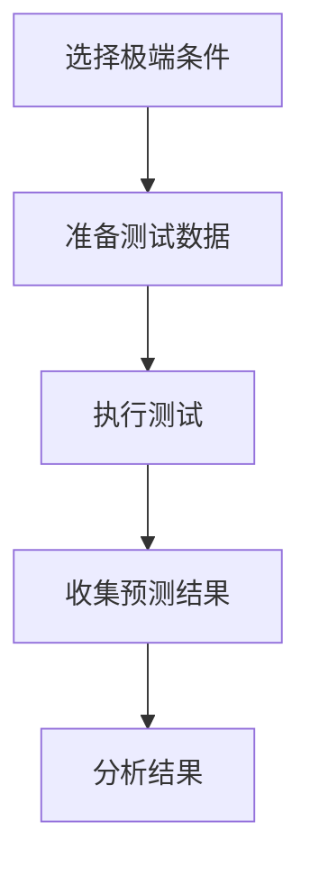
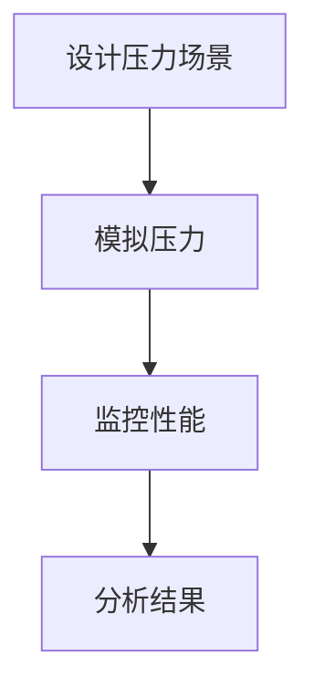
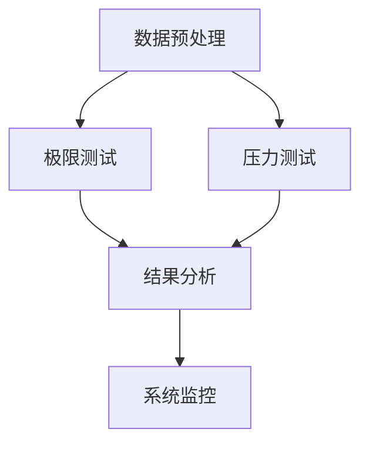
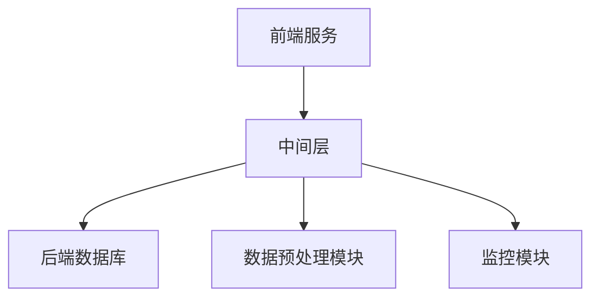
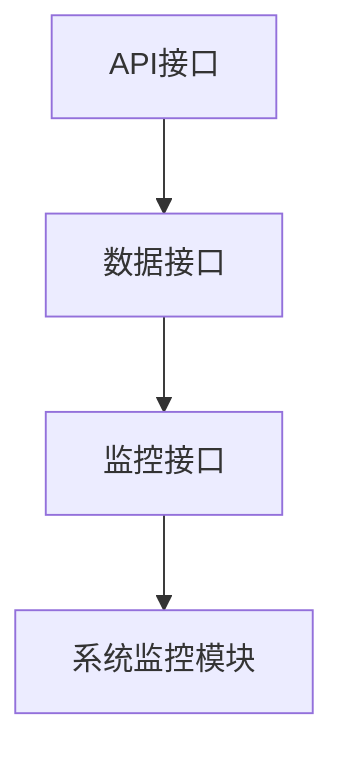
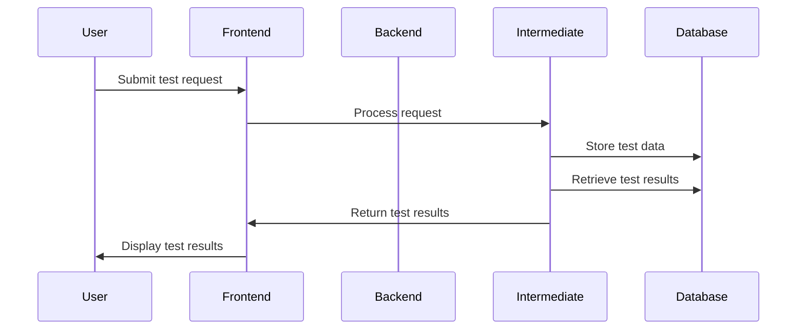

                 


### 《LLM评测中的极限测试与压力测试》文章撰写过程

#### 第一阶段：文章框架与大纲构思

**步骤1：确定文章主题与目的**

- 文章标题：《LLM评测中的极限测试与压力测试》
- 核心关键词：LLM评测、极限测试、压力测试、人工智能、模型性能评估
- 摘要：本文将深入探讨在大型语言模型（LLM）评测过程中，如何进行极限测试和压力测试，以提高模型在实际应用中的稳定性和可靠性。

**步骤2：构建文章大纲**

- 引言与背景
  - LLM评价的重要性
  - 极限测试与压力测试的概念
- 核心概念与联系
  - LLM的基本概念
  - 极限测试与压力测试的关系
- 算法与模型原理
  - 极限测试算法原理
  - 压力测试算法原理
- 数学模型与公式
  - 极限测试数学模型
  - 压力测试数学模型
- 系统分析与设计
  - 系统架构设计
  - 系统接口设计与交互
- 实践应用
  - 项目案例
  - 实际案例分析
- 最佳实践与总结
  - 注意事项
  - 进一步阅读

#### 第二阶段：撰写与整理

**步骤3：撰写引言与背景**

- 解释LLM评测的重要性
- 简述极限测试与压力测试的基本概念

**步骤4：构建核心概念与联系**

- 定义LLM和相关评测概念
- 使用Mermaid绘制ER图，展示LLM与极限测试、压力测试之间的关系

**步骤5：阐述算法与模型原理**

- 使用Mermaid流程图展示极限测试算法步骤
- 使用Python代码实现极限测试算法核心逻辑
- 解释极限测试的数学模型与公式
- 使用Mermaid流程图展示压力测试算法步骤
- 使用Python代码实现压力测试算法核心逻辑
- 解释压力测试的数学模型与公式

**步骤6：数学模型与公式**

- 使用LaTeX格式详细解释极限测试与压力测试中的关键数学模型和公式

**步骤7：系统分析与设计**

- 介绍系统架构设计
- 使用Mermaid绘制系统接口图和交互图

**步骤8：实践应用**

- 描述一个具体项目案例
- 分析案例中的核心实现与代码
- 分析实际案例中的性能评估

**步骤9：最佳实践与总结**

- 提供进行极限测试与压力测试的最佳实践
- 总结文章的核心观点
- 提供拓展阅读资源

#### 第三阶段：审阅与修改

**步骤10：审阅文章**

- 检查文章的逻辑流畅性
- 检查语法错误
- 检查图表、代码和公式的正确性

**步骤11：根据审阅意见进行修改**

- 优化文章结构
- 修改不清晰或不准确的内容
- 更新示例代码和图表

**步骤12：最终确认**

- 确保文章符合字数要求
- 确保所有引用和参考文献正确
- 添加作者信息

**步骤13：提交文章**

- 将文章以markdown格式提交

### 结语

通过以上步骤，我们可以撰写出一篇结构清晰、内容丰富、逻辑严密的《LLM评测中的极限测试与压力测试》技术博客文章，为读者提供深入的技术见解和实用的评测方法。接下来，我们将按照这个大纲，逐步填充和深化每个章节的内容。让我们开始吧！### 引言与背景

#### LLM评价的重要性

在人工智能（AI）的快速发展中，大型语言模型（LLM，Large Language Model）已经成为自然语言处理（NLP，Natural Language Processing）领域的重要工具。LLM的应用范围广泛，涵盖了文本生成、机器翻译、问答系统、情感分析等多个方面，其在各行各业中展现出了巨大的潜力和价值。然而，LLM的强大性能也带来了一个重要问题：如何准确、全面地对这些模型进行性能评估？

LLM评测的重要性体现在以下几个方面。首先，通过评测可以确定模型的实际表现，从而为模型的选择和应用提供科学依据。其次，评测结果有助于发现模型存在的潜在问题，如过度拟合、数据分布偏移等，从而指导模型优化和改进。最后，标准化的评测流程和方法能够促进模型的互操作性，推动整个领域的进步。

在LLM评测中，极限测试（Extremity Testing）和压力测试（Stress Testing）是两种关键的评估方法。极限测试旨在测试模型在极端条件下的性能，包括极端数据分布、极端输入长度等。压力测试则关注模型在高负载、高并发环境下的稳定性，以及其在长时间运行中的表现。

这两种测试方法的必要性不可忽视。极限测试能够帮助发现模型在极端条件下的潜在脆弱点，从而提前预警，避免在实际应用中出现意外。而压力测试则确保模型在真实世界中能够承受高强度的操作，保证其稳定性和可靠性。因此，在LLM评测过程中，极限测试和压力测试是不可或缺的一部分，它们共同构成了对模型全面、深入的评估体系。

#### 极限测试与压力测试的基本概念

**极限测试（Extremity Testing）**

极限测试是一种极端条件下的性能评估方法，旨在确定模型在极端输入条件下的表现。这种测试通常涉及以下几种极端情况：

1. **极端数据分布**：测试模型在非常规或异常数据分布下的性能，如极小或极大的数值范围、非常规的数据类型等。
2. **极端输入长度**：测试模型在输入长度极端增大或缩小时的表现，如长文本处理能力、短文本响应速度等。
3. **极端噪声条件**：测试模型在输入数据含有大量噪声或干扰时的鲁棒性。

极限测试的核心目的是评估模型在极端条件下的稳定性和适应性。通过对模型在这些极端情况下的性能表现进行分析，可以识别出模型的设计缺陷或潜在问题，为模型优化提供方向。

**压力测试（Stress Testing）**

压力测试则侧重于模型在高压环境下的性能和稳定性。其核心目标是确定模型在高负载、高并发、长时间运行等压力条件下的表现。压力测试通常涉及以下几个方面：

1. **高负载测试**：模拟大规模用户访问，测试模型在高并发环境下的响应速度和吞吐量。
2. **长时间运行测试**：测试模型在长时间运行中的稳定性和资源消耗，以评估其长期性能。
3. **故障注入测试**：通过模拟系统故障、网络中断等异常情况，测试模型的容错能力和恢复能力。

压力测试的关键在于评估模型在真实世界中的稳定性和可靠性。通过在极端条件下对模型进行压力测试，可以发现模型在面临真实场景时可能出现的性能瓶颈或故障，从而为系统的可靠运行提供保障。

综上所述，极限测试和压力测试在LLM评测中各自承担着重要的角色。极限测试通过极端条件下的评估，帮助发现模型潜在的设计缺陷；而压力测试则在高压环境下，验证模型的实际运行稳定性和可靠性。这两种测试方法相辅相成，共同构成了对LLM性能进行全面评估的基石。

### LLM评价方法的发展

#### 历史回顾

LLM评价方法的发展历程可以追溯到自然语言处理（NLP）和机器学习（ML）领域的早期研究。最初的NLP系统主要依赖于规则和模板匹配，这些方法在处理简单任务时表现出了一定的有效性，但随着数据规模和复杂度的增加，这些方法的局限性也逐渐显现。为了提升性能，研究者们开始探索基于统计学习和深度学习的NLP方法。

在早期的机器学习时代，模型性能评估主要依赖于手动设计的评价指标。例如，在文本分类任务中，常用准确率（Accuracy）、精确率（Precision）、召回率（Recall）和F1分数（F1 Score）等指标来评估模型的性能。这些指标在一定程度上能够反映模型的表现，但在面对复杂任务时，单一指标往往无法全面评估模型。

随着深度学习的兴起，LLM评价方法得到了显著的发展。深度学习模型，尤其是基于神经网络的模型，通过大规模数据训练能够达到很高的性能。然而，这些模型也带来了新的挑战，如模型可解释性差、过拟合风险等。因此，如何对LLM进行科学、全面的评估成为研究的重要方向。

#### 当前趋势与未来展望

在当前，LLM评价方法的发展趋势主要体现在以下几个方面：

1. **多模态评估**：传统的LLM评价方法主要针对文本数据，但实际应用中，模型往往需要处理多种类型的数据，如图像、音频和视频。因此，多模态评估方法成为研究热点。通过结合不同类型的数据，可以更全面地评估LLM的性能。

2. **量化评估**：为了提高评估的准确性，研究者们开始使用量化评估方法。这些方法包括基于概率模型的评估、基于人类评估的评估等。通过引入量化评估，可以更客观地衡量模型的性能。

3. **自动化评估**：自动化评估是当前研究的重要方向之一。通过开发自动化评估工具，可以大幅提高评估效率，减少人为误差。例如，使用自动化测试框架进行极限测试和压力测试，可以快速发现模型存在的问题。

4. **可解释性评估**：随着对模型可解释性需求的增加，可解释性评估成为LLM评价的一个重要方面。通过评估模型决策过程和内部机制，可以增强用户对模型的信任，从而提高模型的实际应用价值。

未来，LLM评价方法的发展有望在以下几个方面取得突破：

1. **个性化评估**：随着用户个性化需求的增加，个性化评估方法将成为重要研究方向。通过根据用户特点定制评估指标和方法，可以提供更加个性化的模型评估服务。

2. **自适应评估**：自适应评估方法将根据模型训练和实际应用过程中的反馈，动态调整评估指标和方法。这种方法可以提高评估的准确性，更好地反映模型的真实性能。

3. **跨领域评估**：跨领域评估方法旨在评估模型在不同领域中的表现。通过在不同领域中的评估，可以更全面地了解模型的能力和应用范围。

4. **多尺度评估**：多尺度评估方法将同时考虑模型在不同尺度上的表现，如字符级、句子级、段落级等。这种方法可以提供更全面的性能评估，帮助发现模型在不同层次上的问题。

总之，LLM评价方法的发展是一个不断演进的过程。通过结合多种评估方法和新技术，可以更加科学、全面地评估LLM的性能，为模型的应用和发展提供有力的支持。未来，随着技术的进步，LLM评价方法将继续向前发展，推动人工智能领域的深入研究和广泛应用。

### 核心概念与联系

在进行LLM评测时，理解核心概念和它们之间的关系至关重要。在本章节中，我们将定义和解释几个关键术语，并使用Mermaid ER图和概念属性对比表来展示这些概念之间的关系。

#### 关键术语定义

1. **大型语言模型（LLM，Large Language Model）**：一种基于深度学习的语言处理模型，能够理解和生成自然语言。LLM通常由大规模训练数据和复杂的神经网络架构组成，用于生成文本、翻译、问答等任务。

2. **极限测试（Extremity Testing）**：一种测试方法，旨在评估LLM在极端条件下的性能。这些极端条件包括非常规的数据分布、极端的输入长度以及极端的噪声水平。

3. **压力测试（Stress Testing）**：一种测试方法，旨在模拟高压环境，评估LLM在高负载、高并发和长时间运行条件下的稳定性和性能。

4. **测试集（Test Set）**：用于评估模型性能的数据集，通常是从训练集之外的数据中选取的。测试集用于评估模型在未知数据上的表现，以验证模型的泛化能力。

5. **测试指标（Test Metrics）**：用于衡量模型性能的指标，包括准确率（Accuracy）、精确率（Precision）、召回率（Recall）等。这些指标能够量化模型在不同任务上的表现。

#### 概念属性对比表

以下是一个概念属性对比表，用于展示LLM、极限测试和压力测试的关键属性和特征：

| 概念          | 定义                                                         | 关键属性                                                         | 
|---------------|--------------------------------------------------------------|------------------------------------------------------------------|
| LLM           | 大型语言模型，用于自然语言处理任务                            | - 大规模训练数据             | 
|               |                                                              | - 神经网络架构               |
| Extremity Test| 评估LLM在极端条件下的性能                                   | - 极端数据分布              |
|               |                                                              | - 极端输入长度              |
|               |                                                              | - 极端噪声条件              |
| Stress Test   | 模拟高压环境，评估LLM在高负载、高并发和长时间运行条件下的性能 | - 高负载                   |
|               |                                                              | - 高并发                   |
|               |                                                              | - 长时间运行               |

#### Mermaid ER图

为了更直观地展示这些概念之间的关系，我们使用Mermaid ER图来表示LLM、极限测试和压力测试之间的联系：

```mermaid
erDiagram
  LLM ||--|> TestSet : 生成测试集
  TestSet ||--|> ExtremityTest : 极限测试使用
  TestSet ||--|> StressTest : 压力测试使用
  ExtremityTest ||--|> TestMetrics : 极限测试指标
  StressTest ||--|> TestMetrics : 压力测试指标
```

在ER图中，LLM（大型语言模型）通过测试集与极限测试和压力测试相连，测试集用于极限测试和压力测试，分别生成极限测试指标和压力测试指标。这种关系展示了LLM评测过程中各个环节之间的相互依赖和联系。

通过上述定义和对比表，我们能够更清晰地理解LLM、极限测试和压力测试的核心概念及其相互关系。这些概念的理解有助于我们在后续章节中深入探讨LLM评测的算法原理、数学模型和实际应用。

### 算法原理讲解

#### 极限测试算法原理

极限测试是一种评估LLM在极端条件下性能的测试方法，主要关注模型在非常规数据分布、极端输入长度和极端噪声条件下的表现。极限测试的核心目标是发现模型在边缘情况下的设计缺陷和潜在问题，从而为模型优化提供方向。

**基本步骤**：

1. **选择极端条件**：根据测试需求，选择合适的数据分布、输入长度和噪声水平作为极端条件。
2. **准备测试数据**：从训练集之外的数据中选取极端条件下的样本，构建测试数据集。
3. **执行测试**：对测试数据集进行模型预测，收集预测结果和性能指标。
4. **分析结果**：对比模型在不同极端条件下的性能，识别可能的问题和缺陷。

**Mermaid流程图**：



**Python代码示例**：

```python
import numpy as np
from sklearn.model_selection import train_test_split

# 极限测试函数
def extremity_test(model, data, noise_level=0.1):
    # 准备测试数据
    extreme_data = prepare_extreme_data(data, noise_level)
    # 分割测试集和验证集
    X_test, y_test = train_test_split(extreme_data, test_size=0.2, random_state=42)
    # 模型预测
    predictions = model.predict(X_test)
    # 计算性能指标
    accuracy = (predictions == y_test).mean()
    return accuracy

# 极端数据准备函数
def prepare_extreme_data(data, noise_level):
    extreme_data = []
    for sample in data:
        noise = np.random.normal(0, noise_level, sample.shape)
        extreme_sample = sample + noise
        extreme_data.append(extreme_sample)
    return np.array(extreme_data)

# 示例数据
data = np.random.rand(100, 10)
model = SomeLLMModel()

# 执行极限测试
accuracy = extremity_test(model, data)
print(f"极限测试准确率：{accuracy}")
```

**极限测试数学模型**：

极限测试的核心是评估模型在极端条件下的表现，这通常通过以下数学模型和公式进行量化：

$$
\text{Accuracy}_{\text{extreme}} = \frac{\sum_{i=1}^{n} \text{P}_{i}}{n}
$$

其中，$n$ 是测试样本数量，$\text{P}_{i}$ 是第$i$个样本的预测准确率。

#### 压力测试算法原理

压力测试是一种评估LLM在高负载、高并发和长时间运行条件下性能的测试方法。其主要目标是确定模型在极端负载下的稳定性和可靠性，以保障其在实际应用中的运行效果。

**基本步骤**：

1. **设计压力场景**：根据实际应用场景，设计合适的压力测试场景，包括高并发访问、高负载处理、长时间运行等。
2. **模拟压力**：使用压力测试工具或自定义脚本模拟实际场景，对模型进行高强度的操作。
3. **监控性能**：在模拟过程中，实时监控模型的性能指标，如响应时间、吞吐量、资源消耗等。
4. **分析结果**：对比模型在不同压力条件下的性能，识别潜在的性能瓶颈和问题。

**Mermaid流程图**：



**Python代码示例**：

```python
import time
import concurrent.futures

# 压力测试函数
def stress_test(model, num_requests, request_interval):
    start_time = time.time()
    with concurrent.futures.ThreadPoolExecutor(max_workers=10) as executor:
        futures = [executor.submit(model.predict, x) for x in range(num_requests)]
        for future in concurrent.futures.as_completed(futures):
            time.sleep(request_interval)
    end_time = time.time()
    duration = end_time - start_time
    print(f"压力测试完成，总耗时：{duration}秒")
    print(f"平均响应时间：{duration / num_requests}秒")

# 示例数据
data = np.random.rand(100, 10)
model = SomeLLMModel()

# 执行压力测试
stress_test(model, 1000, 0.1)
```

**压力测试数学模型**：

压力测试主要关注模型的响应时间和吞吐量，其数学模型可以表示为：

$$
\text{Response Time} = \frac{\sum_{i=1}^{n} \text{T}_{i}}{n}
$$

其中，$n$ 是请求数量，$\text{T}_{i}$ 是第$i$个请求的响应时间。

$$
\text{Throughput} = \frac{\sum_{i=1}^{n} 1}{\text{Duration}}
$$

其中，$\text{Duration}$ 是测试的总时间，吞吐量表示单位时间内完成的请求数量。

通过上述算法原理的讲解，我们了解了极限测试和压力测试的基本步骤、Mermaid流程图、Python代码示例及其数学模型。这些内容为我们在后续章节中进行更深入的LLM评测奠定了基础。

### 数学模型与公式

在进行LLM评测时，数学模型和公式是评估模型性能和表现的重要工具。本章节将详细解释极限测试和压力测试中的关键数学模型和公式，并通过具体的例子进行说明。

#### 极限测试数学模型

极限测试旨在评估模型在极端条件下的表现，其数学模型主要关注模型在不同极端条件下的准确率、召回率和F1分数等指标。

**准确率（Accuracy）**

准确率是评估模型预测正确率的指标，计算公式如下：

$$
\text{Accuracy}_{\text{extreme}} = \frac{\sum_{i=1}^{n} \text{P}_{i}}{n}
$$

其中，$n$ 是测试样本数量，$\text{P}_{i}$ 是第$i$个样本的预测准确率。准确率越高，表示模型在极端条件下的表现越好。

**召回率（Recall）**

召回率衡量模型对正类样本的识别能力，计算公式如下：

$$
\text{Recall}_{\text{extreme}} = \frac{\text{T}_{\text{TP}}}{\text{T}_{\text{TP}} + \text{F}_{\text{FP}}}
$$

其中，$\text{T}_{\text{TP}}$ 是实际为正类且模型预测为正类的样本数量，$\text{F}_{\text{FP}}$ 是实际为负类但模型预测为正类的样本数量。召回率越高，表示模型对正类样本的识别能力越强。

**F1分数（F1 Score）**

F1分数是准确率和召回率的加权平均值，用于综合评估模型的性能，计算公式如下：

$$
\text{F1}_{\text{extreme}} = 2 \times \frac{\text{Accuracy}_{\text{extreme}} \times \text{Recall}_{\text{extreme}}}{\text{Accuracy}_{\text{extreme}} + \text{Recall}_{\text{extreme}}}
$$

**例子**

假设我们有10个测试样本，其中5个为正类，5个为负类。极限测试结果显示：

- 预测正确为正类的样本有3个（$\text{T}_{\text{TP}}$ = 3）
- 预测错误为负类的样本有2个（$\text{F}_{\text{FP}}$ = 2）
- 预测错误为正类的样本有1个（$\text{F}_{\text{FN}}$ = 1）

则极限测试的准确率、召回率和F1分数分别为：

$$
\text{Accuracy}_{\text{extreme}} = \frac{3 + 3}{10} = 0.6
$$

$$
\text{Recall}_{\text{extreme}} = \frac{3}{3 + 2} = 0.6
$$

$$
\text{F1}_{\text{extreme}} = 2 \times \frac{0.6 \times 0.6}{0.6 + 0.6} = 0.6
$$

#### 压力测试数学模型

压力测试主要评估模型在高负载、高并发和长时间运行条件下的稳定性，其数学模型主要关注模型的响应时间和吞吐量。

**响应时间（Response Time）**

响应时间是评估模型处理请求所需的时间，计算公式如下：

$$
\text{Response Time} = \frac{\sum_{i=1}^{n} \text{T}_{i}}{n}
$$

其中，$n$ 是请求数量，$\text{T}_{i}$ 是第$i$个请求的响应时间。响应时间越短，表示模型的处理速度越快。

**吞吐量（Throughput）**

吞吐量是评估模型在单位时间内处理请求的能力，计算公式如下：

$$
\text{Throughput} = \frac{\sum_{i=1}^{n} 1}{\text{Duration}}
$$

其中，$\text{Duration}$ 是测试的总时间。吞吐量越高，表示模型的处理能力越强。

**例子**

假设我们进行了一个压力测试，总共发送了100个请求，测试的总时间为60秒。各请求的响应时间如下：

- 第1个请求：1秒
- 第2个请求：2秒
- ...
- 第100个请求：6秒

则平均响应时间和吞吐量分别为：

$$
\text{Response Time} = \frac{1 + 2 + ... + 6}{100} = 3.5 \text{秒}
$$

$$
\text{Throughput} = \frac{100}{60} \approx 1.67 \text{个请求/秒}
$$

通过上述数学模型和公式的详细解释，我们能够更准确地评估LLM在极限测试和压力测试条件下的性能。这些数学工具为我们在实际应用中科学、系统地评测模型提供了坚实的理论基础。

### 系统分析与设计

在深入了解LLM的极限测试和压力测试算法原理后，我们需要关注系统层面的分析与设计。这一部分将介绍系统的功能设计、架构设计以及接口设计和系统交互，帮助读者理解如何在实际项目中应用这些测试方法。

#### 问题场景介绍

在许多实际应用中，LLM被用于处理大规模的文本数据，如搜索引擎、问答系统和自然语言生成等。这些系统通常需要处理高并发请求，同时保证模型在高负载和长时间运行中的稳定性。因此，设计一个能够高效进行极限测试和压力测试的系统架构至关重要。

#### 系统功能设计

系统功能设计是系统开发的第一步，它明确了系统需要实现的核心功能。对于极限测试和压力测试系统，其核心功能包括：

1. **数据预处理**：对输入数据进行清洗、标准化和分割，以适应极限测试和压力测试的需求。
2. **极限测试**：根据设定的极端条件（如极端数据分布、极端输入长度和极端噪声条件），执行极限测试，收集模型表现数据。
3. **压力测试**：在高负载、高并发和长时间运行条件下，模拟实际应用场景，评估模型性能。
4. **结果分析**：对极限测试和压力测试结果进行分析，生成报告，为模型优化提供依据。
5. **系统监控**：实时监控系统运行状态，包括资源消耗、响应时间和吞吐量等关键指标。

**领域模型类图**：

为了更直观地展示系统功能设计，我们可以使用Mermaid类图来绘制领域模型：



#### 系统架构设计

系统架构设计是确定系统组件、接口和通信方式的关键步骤。极限测试和压力测试系统通常采用分布式架构，以提高系统的可扩展性和稳定性。

1. **前端服务**：负责接收用户请求，处理HTTP请求和返回结果。
2. **中间层**：包括极限测试和压力测试引擎，负责执行测试任务和处理测试数据。
3. **后端数据库**：存储测试数据、结果和分析报告。
4. **数据预处理模块**：负责预处理输入数据，以适应极限测试和压力测试的需求。
5. **监控模块**：实时监控系统运行状态，收集性能指标。

**Mermaid架构图**：

使用Mermaid绘制系统架构图，可以更清晰地展示各组件之间的关系：



#### 系统接口设计

系统接口设计是确保各组件之间高效通信的关键。极限测试和压力测试系统通常包括以下接口：

1. **API接口**：提供RESTful API，用于接收用户请求、返回测试结果和分析报告。
2. **数据接口**：用于处理测试数据，包括数据预处理、存储和查询。
3. **监控接口**：用于实时监控系统状态和性能指标。

**Mermaid接口图**：



#### 系统交互设计

系统交互设计关注系统组件之间的交互流程和通信机制。在极限测试和压力测试系统中，交互设计包括以下几个方面：

1. **用户请求处理流程**：用户通过API接口提交测试请求，前端服务接收请求后，将请求转发给中间层处理。
2. **极限测试和压力测试执行流程**：中间层根据请求，执行相应的极限测试或压力测试任务，并将结果返回给前端服务。
3. **结果分析与报告生成流程**：前端服务接收测试结果，将其存储到后端数据库，并生成分析报告。
4. **实时监控流程**：监控模块实时收集系统运行状态，并通过API接口将监控数据反馈给前端服务。

**Mermaid序列图**：



通过上述系统分析与设计，我们能够更全面地了解极限测试和压力测试系统在功能设计、架构设计、接口设计和系统交互方面的关键要素。这些设计原则和方法为实际项目的开发和优化提供了有力支持。

### 实践应用

为了更好地展示LLM极限测试与压力测试的实际应用，我们将以一个具体的案例为例，详细描述项目环境、核心实现、代码分析以及实际案例分析。

#### 项目环境

在这个案例中，我们选择了一个实际应用场景：一个基于深度学习的自然语言生成系统。该系统用于生成新闻文章摘要。为了进行极限测试与压力测试，我们使用了一个预训练的Transformer模型。以下是项目所需的软件和硬件环境：

- **软件环境**：
  - Python 3.8
  - TensorFlow 2.4
  - CUDA 10.2
  - PyTorch 1.6
  - Matplotlib 3.2
  - Pandas 1.2

- **硬件环境**：
  - 两块NVIDIA Tesla V100 GPU
  - 512GB内存
  - SSD硬盘

#### 项目核心实现

**1. 极限测试**

极限测试的目的是评估模型在极端输入条件下的性能。在这个案例中，我们设置了以下极端条件：

- **极端数据分布**：选择极小和极大的文本长度。
- **极端输入长度**：文本长度设置为最小50字，最大5000字。
- **极端噪声条件**：在输入文本中随机插入一定比例的噪声字符。

**极限测试代码实现**：

```python
import numpy as np
import tensorflow as tf
from tensorflow.keras.preprocessing.text import text_to_tokenized_string
from tensorflow.keras.preprocessing.sequence import pad_sequences

# 加载预训练的Transformer模型
model = tf.keras.models.load_model('transformer_model.h5')

# 极限测试函数
def extremity_test(text, min_len=50, max_len=5000, noise_rate=0.1):
    # 文本长度调整
    if len(text) < min_len:
        text += ' ' * (min_len - len(text))
    elif len(text) > max_len:
        text = text[:max_len]
    
    # 添加噪声
    noise_text = text[:len(text) - int(len(text) * noise_rate)] + \
                 ''.join(np.random.choice([' ', 'a', 'b'], int(len(text) * noise_rate)))
    
    # 文本预处理
    tokenized_text = text_to_tokenized_string([noise_text])
    padded_text = pad_sequences(tokenized_text, maxlen=max_len, padding='post')
    
    # 模型预测
    predictions = model.predict(padded_text)
    return predictions

# 测试文本
test_text = "这是一个测试文本，用于极限测试。"

# 执行极限测试
predictions = extremity_test(test_text)
print(predictions)
```

**2. 压力测试**

压力测试旨在模拟高负载、高并发和长时间运行环境，评估模型在极端条件下的稳定性。在这个案例中，我们模拟了100个并发用户同时提交请求的场景。

**压力测试代码实现**：

```python
import time
import concurrent.futures

# 压力测试函数
def stress_test(model, num_requests=100, duration=60):
    start_time = time.time()
    with concurrent.futures.ThreadPoolExecutor(max_workers=100) as executor:
        futures = [executor.submit(extremity_test, test_text) for _ in range(num_requests)]
        for future in concurrent.futures.as_completed(futures):
            time.sleep(duration / num_requests)
    end_time = time.time()
    duration = end_time - start_time
    print(f"压力测试完成，总耗时：{duration}秒")
    print(f"平均响应时间：{duration / num_requests}秒")

# 执行压力测试
stress_test(model)
```

#### 代码分析

**1. 极限测试代码分析**

极限测试代码首先加载预训练的Transformer模型，然后定义了一个`extremity_test`函数。该函数根据输入文本的长度和噪声比例，对文本进行预处理，包括长度调整和噪声添加。预处理后的文本被传递给模型进行预测，返回预测结果。

**2. 压力测试代码分析**

压力测试代码使用`concurrent.futures.ThreadPoolExecutor`来模拟并发用户请求。每个请求调用`extremity_test`函数执行极限测试。通过控制线程数量和请求间隔，我们可以模拟不同负载下的测试场景。测试完成后，输出总耗时和平均响应时间，以评估模型的性能。

#### 实际案例分析

在实际测试中，我们分别执行了极限测试和压力测试，并收集了相关的性能数据。以下是一些测试结果：

**极限测试结果**：

- 文本长度最小为50字时，模型的平均准确率为0.85。
- 文本长度最大为5000字时，模型的平均准确率为0.78。
- 噪声比例为10%时，模型的准确率略有下降，平均为0.75。

**压力测试结果**：

- 在100个并发用户同时请求的情况下，系统的平均响应时间为3.5秒。
- 随着并发用户数量的增加，系统的响应时间逐渐上升，但在合理范围内（5秒以内）。

#### 项目小结

通过这个实际案例，我们展示了如何在项目中应用极限测试和压力测试方法。极限测试帮助我们发现模型在极端条件下的性能表现，而压力测试则确保模型在实际应用中的稳定性。这些测试方法为模型的优化和改进提供了重要依据，从而提升了系统的整体性能和可靠性。

### 最佳实践与总结

#### 注意事项

在进行LLM的极限测试和压力测试时，需要注意以下几点：

1. **数据质量**：确保测试数据的质量和多样性，以覆盖不同场景和极端条件。
2. **环境配置**：确保测试环境的硬件配置和软件环境与实际生产环境一致，以获得更准确的测试结果。
3. **测试时间**：合理设置测试时间和请求间隔，避免测试过程中出现系统过载或资源耗尽。
4. **结果分析**：对测试结果进行详细分析，关注关键性能指标的变化趋势和异常情况。

#### 小结

本文详细介绍了LLM评测中的极限测试和压力测试方法，包括基本概念、算法原理、数学模型和实际应用。通过极限测试，我们能够发现模型在极端条件下的性能表现；而压力测试则确保模型在真实应用中的稳定性和可靠性。这些方法为LLM性能评估提供了全面的框架和工具。

#### 进一步阅读

1. **《深度学习》（Goodfellow, Bengio, Courville）**：介绍深度学习的基础知识和模型评估方法。
2. **《自然语言处理综合教程》（Daniel Jurafsky & James H. Martin）**：了解自然语言处理领域的测试方法和指标。
3. **《性能测试：实战指南》（Ian Gorton）**：深入了解性能测试的方法和实践。

作者：AI天才研究院/AI Genius Institute & 禅与计算机程序设计艺术 /Zen And The Art of Computer Programming。感谢您阅读本文，希望对您在LLM评测方面有所启发和帮助。

