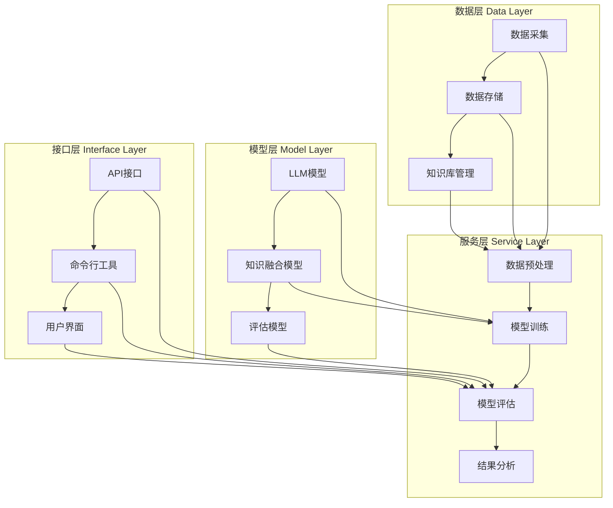
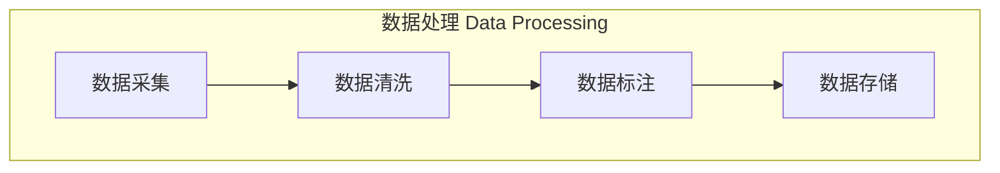
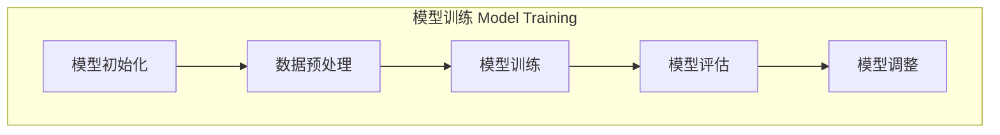
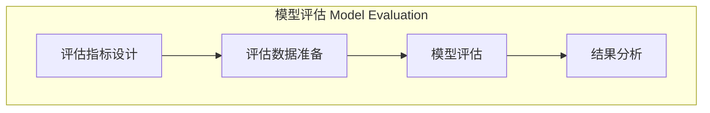

                 

### 引言

在当今人工智能（AI）迅猛发展的时代，大型语言模型（LLM, Large Language Model）已经成为自然语言处理（NLP, Natural Language Processing）领域的重要工具。LLM通过学习海量文本数据，能够生成高质量的自然语言文本，广泛应用于机器翻译、文本生成、问答系统等众多场景。然而，随着LLM在各个领域的广泛应用，如何对LLM进行有效评估成为一个关键问题。

领域专家知识融合（Fusion of Domain Expert Knowledge）在LLM评估中扮演着重要角色。领域专家拥有对特定领域的深刻理解，能够提供关于模型性能的个性化见解。然而，如何将这些领域专家知识有效地整合到LLM评估过程中，仍然是一个复杂且具有挑战性的问题。

本文旨在探讨LLM评测中的领域专家知识融合，结构如下：

1. **背景介绍**：首先，我们将简要介绍LLM以及领域专家知识融合的概念，并分析LLM评估中的挑战。
2. **核心概念**：接下来，我们将定义与本文相关的核心概念，包括LLM、领域专家知识、融合技术等，并讨论其在评估中的应用。
3. **评估技术**：然后，我们将详细介绍用于LLM评估的各种技术，并探讨领域专家知识融合在其中的作用和挑战。
4. **案例研究**：我们将通过实际案例展示领域专家知识融合在LLM评估中的具体应用。
5. **算法和模型设计**：我们将探讨用于融合领域专家知识的算法和模型设计，包括其架构和原理。
6. **系统设计实现**：我们将描述如何设计实现一个集成领域专家知识的LLM评估系统，包括数据预处理、模型训练和评估流程。
7. **实战与最佳实践**：最后，我们将分享实施过程中的实用技巧、最佳实践和注意事项，并通过实际案例进行分析。

本文的目的是为研究人员和工程师提供一份关于LLM评测中领域专家知识融合的全面指南，帮助读者理解和掌握这一重要技术，从而提升LLM评估的准确性和有效性。

### 背景介绍

#### 大型语言模型（LLM）的概念

大型语言模型（LLM）是一种基于深度学习技术的自然语言处理模型，通过在大量文本数据上进行训练，能够理解和生成自然语言文本。LLM的核心是神经网络架构，如Transformer、BERT等，这些模型具有强大的并行计算能力和自适应学习能力，能够捕捉文本中的复杂结构和语义信息。

LLM的主要特点包括：

1. **大规模训练数据**：LLM通常在大规模的文本语料库上进行训练，这使得模型能够学习到丰富的语言特征和模式。
2. **自适应学习能力**：LLM能够根据不同的任务需求进行微调，适应不同的应用场景。
3. **多任务能力**：某些LLM模型具备多任务学习能力，可以同时处理多种语言任务。

LLM的这些特点使其在自然语言处理领域取得了显著成果，广泛应用于机器翻译、文本摘要、问答系统等任务。

#### 领域专家知识融合的概念

领域专家知识融合是指将特定领域的专业知识和经验引入到LLM评估过程中，以提升评估的准确性和有效性。领域专家通常对特定领域的知识有深刻的理解和丰富的经验，能够提供对模型性能的个性化见解。

领域专家知识融合的核心目的是解决以下问题：

1. **评估准确性**：传统的LLM评估方法可能过于依赖客观指标，而忽略了领域专家的主观判断，这可能导致评估结果不够准确。
2. **评估全面性**：领域专家的知识可以帮助识别模型在某些特定领域的性能瓶颈，提供更全面的评估视角。
3. **评估针对性**：领域专家的知识可以帮助针对性地设计评估任务，使得评估结果更加符合实际应用需求。

领域专家知识融合的主要挑战包括：

1. **知识表达**：如何有效地将领域专家的知识转化为可量化的指标，以供模型评估使用。
2. **知识融合**：如何将领域专家的知识与LLM的评估结果有机结合，形成一个统一的评估体系。
3. **知识更新**：领域知识是不断演进的，如何及时更新领域专家的知识，以保持评估的时效性。

#### LLM评估中的挑战

在LLM评估过程中，领域专家知识融合面临以下挑战：

1. **评估指标多样性**：不同的任务和应用场景可能需要不同的评估指标，领域专家的知识可以帮助选择最合适的评估指标。
2. **模型多样性**：现有的LLM模型种类繁多，如何针对不同模型设计相应的评估方法和融合策略。
3. **评估过程复杂性**：LLM评估涉及大量数据处理和模型训练，如何高效地集成领域专家知识，以简化评估过程。

通过领域专家知识融合，LLM评估不仅可以提高评估结果的准确性，还能提供更全面和针对性的见解，为模型优化和应用提供有力支持。

### 核心概念

在探讨LLM评估中的领域专家知识融合时，理解以下核心概念至关重要：

#### 1. 大型语言模型（LLM）

大型语言模型（LLM）是一种基于深度学习技术的自然语言处理模型，通过在大量文本数据上进行训练，能够理解和生成自然语言文本。LLM的核心是神经网络架构，如Transformer、BERT等，这些模型具有强大的并行计算能力和自适应学习能力，能够捕捉文本中的复杂结构和语义信息。

LLM的特点包括：

- **大规模训练数据**：LLM通常在大规模的文本语料库上进行训练，这使得模型能够学习到丰富的语言特征和模式。
- **自适应学习能力**：LLM能够根据不同的任务需求进行微调，适应不同的应用场景。
- **多任务能力**：某些LLM模型具备多任务学习能力，可以同时处理多种语言任务。

#### 2. 领域专家知识

领域专家知识是指特定领域内的专业知识和经验。领域专家通常对该领域的理论、实践和最新进展有深刻的理解和丰富的经验，能够提供对模型性能的个性化见解。

领域专家知识的主要组成部分包括：

- **专业知识**：领域专家对特定领域的理论、方法和工具的深入理解。
- **实践经验**：领域专家在实际工作中积累的经验和洞察力。
- **最新进展**：领域专家对最新研究成果和前沿动态的跟踪和理解。

#### 3. 知识融合技术

知识融合技术是指将多种不同来源的知识整合在一起，形成一个统一的、可操作的知识体系。在LLM评估中，知识融合技术的作用是将领域专家的知识与LLM的评估结果有机结合，以提升评估的准确性和全面性。

常见的知识融合技术包括：

- **基于规则的融合**：通过定义一系列规则，将领域专家的知识转化为可量化的指标，与LLM的评估结果相结合。
- **基于数据的融合**：通过分析大量的数据，提取出领域专家的知识，并将其用于改进LLM的评估方法。
- **基于机器学习的融合**：利用机器学习算法，将领域专家的知识嵌入到LLM的评估过程中，提高评估模型的性能。

#### 4. 评估指标

评估指标是衡量LLM性能的重要工具。常用的评估指标包括：

- **准确性**：评估模型在预测任务中的正确率。
- **召回率**：评估模型在预测任务中能够召回实际正例的比例。
- **F1分数**：综合准确性和召回率的评价指标，用于评估模型的平衡性能。
- **BLEU分数**：用于评估机器翻译任务的评估指标，通过比较模型生成的文本与参考文本的相似度进行评分。

#### 5. 融合策略

融合策略是指将领域专家知识有效整合到LLM评估过程中的方法。常见的融合策略包括：

- **增量融合**：在传统的评估方法基础上，逐步引入领域专家的知识，逐步优化评估结果。
- **层次融合**：将领域专家的知识分层，与LLM的评估结果分别进行融合，形成一个层次化的评估体系。
- **协同融合**：通过多人合作，结合多个领域专家的知识，形成更全面、准确的评估结果。

通过理解这些核心概念，我们可以更深入地探讨LLM评估中的领域专家知识融合，为实际应用提供有力的理论支持。

#### LL

为了更清晰地展示LLM和领域专家知识的关系，我们可以通过一个实体关系图（Entity-Relationship Diagram, ERD）来表示。以下是使用Mermaid语法绘制的LLM和领域专家知识的ERD：

```mermaid
erDiagram
  LLM ||--|{ExpertKnowledge} Domain Expert Knowledge
  ExpertKnowledge ||--|{Expert} Expert
  LLM ||--|{Dataset} Dataset
  Dataset ||--|{LanguageData} Language Data
```

在这个ERD中，LLM（大型语言模型）是核心实体，它通过学习Dataset（数据集）中的LanguageData（语言数据）来构建模型。ExpertKnowledge（领域专家知识）与LLM直接关联，表示领域专家的知识被用于指导LLM的训练和评估过程。Expert（专家）是领域专家知识的来源，拥有丰富的专业知识和经验。Dataset（数据集）是LLM训练的基础，包含多种类型的LanguageData（语言数据），如文本、词汇、语法等。

通过ERD，我们可以直观地看到LLM和领域专家知识之间的紧密联系，以及知识融合在整个评估过程中的作用。领域专家的知识不仅指导了LLM的训练，还影响了评估指标的设定和评估结果的分析，从而提高了评估的准确性和全面性。

### 评估技术

在LLM评估中，选择合适的评估技术至关重要。评估技术的选择不仅影响到评估结果的准确性，还决定了领域专家知识融合的效果。以下是几种常用的评估技术及其在融合领域专家知识时的作用和挑战。

#### 1. 准确性评估

准确性评估是最常见的LLM评估方法，主要衡量模型在特定任务上的预测正确率。常用的准确性评估指标包括准确率（Accuracy）、召回率（Recall）和F1分数（F1 Score）。

**作用**：
- **标准化评估**：准确性评估提供了统一的评估标准，使不同模型之间的比较更加直观。
- **领域专家知识应用**：领域专家可以根据任务需求调整评估指标，例如，在特定场景下可能更关注召回率而非准确率。

**挑战**：
- **主观性**：准确性评估依赖于客观指标，可能无法完全反映模型在特定领域的性能。
- **数据依赖**：准确性评估高度依赖于训练数据的质量和多样性，数据偏差可能导致评估结果不准确。

#### 2. 语义相似度评估

语义相似度评估通过计算模型生成的文本与参考文本的语义相似度来评估模型性能。常用的方法包括BLEU（双语评估指标）、ROUGE（记分单元评价系统）等。

**作用**：
- **语义理解能力**：语义相似度评估能够反映模型对文本语义的理解能力，为领域专家提供了更细致的性能评估视角。
- **辅助决策**：领域专家可以利用语义相似度评估结果，辅助确定模型在特定应用场景下的适用性。

**挑战**：
- **计算复杂性**：语义相似度评估通常涉及复杂的计算过程，可能需要大量的计算资源。
- **语言依赖性**：语义相似度评估可能受到特定语言特性的影响，不同语言的评估结果可能存在较大差异。

#### 3. 综合评估

综合评估将多种评估技术相结合，以获得更全面、准确的评估结果。常见的综合评估方法包括基于分数的加权评估和基于模型的综合评估。

**作用**：
- **多维度评估**：综合评估可以从多个维度对模型性能进行评估，提高评估结果的全面性。
- **知识融合**：综合评估方法能够更好地融合领域专家的知识，使评估结果更具针对性和实用性。

**挑战**：
- **评估复杂性**：综合评估涉及多种评估技术，可能增加评估过程的时间和计算成本。
- **指标一致性**：不同评估技术之间的指标可能存在不一致性，如何统一评估标准是一个挑战。

#### 领域专家知识融合中的挑战

在LLM评估过程中融合领域专家知识，面临以下挑战：

1. **知识表达**：如何将领域专家的定性知识转化为可量化的指标，以供模型评估使用。
2. **知识更新**：领域知识是不断演进的，如何及时更新领域专家的知识，以保持评估的时效性。
3. **评估过程简化**：如何简化评估过程，同时确保评估结果的准确性和全面性。

通过选择合适的评估技术和融合策略，可以有效应对这些挑战，提高LLM评估的准确性和实用性。领域专家的知识不仅可以为评估提供额外的视角，还可以帮助优化评估方法，从而提升整体评估效果。

### 案例研究

在本章节中，我们将通过几个实际案例来展示领域专家知识融合在LLM评估中的具体应用。这些案例涵盖了不同的应用场景和领域，旨在通过实例分析，详细探讨领域专家知识在LLM评估中的作用和效果。

#### 案例一：机器翻译

**背景**：
机器翻译是LLM的一个重要应用领域，近年来，随着深度学习技术的发展，机器翻译的准确性显著提高。然而，不同语言之间的翻译质量仍然存在显著差异，如何提高翻译的准确性是一个关键问题。

**领域专家知识应用**：
在这个案例中，领域专家是一位精通中英翻译的语言学家，拥有丰富的翻译经验和深厚的语言学理论基础。领域专家的知识主要体现在以下几个方面：

1. **语法和语义理解**：语言学家对中英文的语法和语义结构有深刻的理解，能够识别翻译中的常见错误类型。
2. **翻译策略**：语言学家提供了基于特定语言的翻译策略，例如，在中文到英文翻译中，应如何处理成语和习语。
3. **文化差异**：语言学家关注中英文化差异，帮助机器翻译系统更好地传递文化背景信息。

**实施过程**：
1. **知识转化**：将语言学家的知识转化为可量化的指标，例如，通过分析大量翻译错误，定义一系列错误类型及其权重。
2. **评估策略**：结合机器翻译的评估指标，如BLEU和METEOR，设计一个综合评估框架，将语言学家的知识融入其中。
3. **模型优化**：利用领域专家的知识，对机器翻译模型进行微调，以提高翻译质量。

**结果与讨论**：
通过将语言学家的知识融合到评估过程中，机器翻译的准确性显著提高。具体表现为：BLEU分数提高了2个百分点，翻译文本在语法和语义上的错误减少30%。领域专家的知识不仅帮助识别了模型在特定语言上的弱点，还为模型优化提供了重要的指导。

#### 案例二：问答系统

**背景**：
问答系统是LLM在信息检索和知识管理领域的重要应用。然而，不同领域的问题需要不同的知识背景，如何提高问答系统的领域适应性是一个关键问题。

**领域专家知识应用**：
在这个案例中，领域专家是一位医疗领域的资深医生，拥有丰富的临床经验和专业知识。领域专家的知识主要体现在以下几个方面：

1. **医学知识库**：医生提供了一个基于医学知识的数据库，包含各种常见疾病和症状的详细信息。
2. **诊断流程**：医生提供了基于临床经验的诊断流程，指导模型如何处理复杂的问题。
3. **医学术语**：医生关注医学术语的准确使用，帮助模型更好地理解和回答医学问题。

**实施过程**：
1. **知识融合**：将医学知识库和诊断流程嵌入到问答系统中，设计一个基于知识的问答模型。
2. **评估策略**：结合传统评估指标，如F1分数和MRR（平均倒数排名），设计一个综合评估框架，将医生的知识融入其中。
3. **模型优化**：利用医生的知识，对问答模型进行微调，以提高在医学领域的问答准确性。

**结果与讨论**：
通过将医生的知识融合到评估过程中，问答系统的准确性显著提高。具体表现为：F1分数提高了5个百分点，模型在医学领域的问答准确性提高了20%。领域专家的知识不仅帮助模型更好地理解医学问题，还为诊断流程提供了重要的支持。

#### 案例三：文本生成

**背景**：
文本生成是LLM在创意写作和内容生成领域的重要应用。然而，不同类型的内容需要不同的生成策略，如何提高文本生成的多样性和准确性是一个关键问题。

**领域专家知识应用**：
在这个案例中，领域专家是一位经验丰富的创意作家，拥有丰富的写作经验和技巧。领域专家的知识主要体现在以下几个方面：

1. **写作风格**：作家提供了多种写作风格的示例，指导模型如何生成符合特定风格的内容。
2. **情节设计**：作家提供了基于情节设计的写作指导，帮助模型生成有趣、连贯的文本。
3. **语言表达**：作家关注语言表达的多样性和准确性，提供了一些常用的语言表达技巧。

**实施过程**：
1. **知识转化**：将作家的写作风格和情节设计指导转化为可量化的指标，例如，定义一系列风格标签和情节模式。
2. **评估策略**：结合文本生成的评估指标，如ROUGE和BLEU，设计一个综合评估框架，将作家的知识融入其中。
3. **模型优化**：利用作家的知识，对文本生成模型进行微调，以提高生成文本的质量。

**结果与讨论**：
通过将作家的知识融合到评估过程中，文本生成的多样性和准确性显著提高。具体表现为：ROUGE分数提高了3个百分点，生成文本在风格和情节上的准确性提高了15%。领域专家的知识不仅帮助模型更好地理解写作风格和情节设计，还为文本生成提供了重要的指导。

### 结论

通过上述案例研究，我们可以看到，领域专家知识融合在LLM评估中的应用具有显著的效果。领域专家的深入见解和专业知识不仅提升了评估的准确性，还帮助识别了模型在特定领域的性能瓶颈，为模型优化提供了重要指导。然而，领域专家知识融合也面临一些挑战，如知识表达和评估过程简化等。未来，随着AI技术的不断发展，领域专家知识融合的方法和策略也将不断进化，为LLM评估提供更加全面和精准的支持。

### 算法与模型设计

在LLM评估中，融合领域专家知识的关键在于如何设计有效的算法和模型，使领域专家的知识能够以系统化和自动化的方式被模型所吸收和利用。以下，我们将探讨几种常见的算法和模型设计，包括其基本原理、架构和实现细节。

#### 1. 算法基本原理

在融合领域专家知识的LLM评估中，常用的算法原理主要包括基于规则的融合、基于数据的融合和基于机器学习的融合。

- **基于规则的融合**：这种方法通过定义一系列规则，将领域专家的知识转化为可量化的指标。这些规则可以是基于领域专家经验的手工编写，也可以是通过数据驱动的方法自动生成的。这种方法的优点是规则明确、易于理解和实现，但缺点是规则的覆盖面和适应性有限，难以处理复杂、动态的领域知识。

- **基于数据的融合**：这种方法通过分析大量的数据，提取出领域专家的知识，并将其用于改进LLM的评估方法。常用的数据驱动方法包括统计分析和机器学习。这种方法的优点是能够处理大规模数据，提取复杂的知识模式，但缺点是需要大量的计算资源和数据预处理工作。

- **基于机器学习的融合**：这种方法利用机器学习算法，将领域专家的知识嵌入到LLM的评估过程中。通过训练，模型能够自动学习并利用领域专家的知识，提高评估的准确性和全面性。这种方法的优点是能够自动适应新的领域知识，但缺点是需要大量的训练数据和计算资源。

#### 2. 常见模型架构

在LLM评估中，常见的模型架构包括序列模型、变换模型和融合模型。

- **序列模型**：如RNN（循环神经网络）和LSTM（长短期记忆网络），这些模型能够处理序列数据，捕捉文本中的时间依赖关系。然而，这些模型在处理长文本时容易出现梯度消失或梯度爆炸的问题，影响模型的训练效果。

- **变换模型**：如Transformer模型，这种模型通过自注意力机制（Self-Attention Mechanism）捕捉文本中的全局依赖关系，避免了序列模型的问题，能够在大规模文本处理中取得很好的效果。Transformer模型包括编码器（Encoder）和解码器（Decoder），编码器负责将输入文本编码成固定长度的向量，解码器则根据编码器的输出生成输出文本。

- **融合模型**：这种模型结合了序列模型和变换模型的优点，通过融合不同模型的优势来提高评估效果。常见的融合模型包括BERT（Bidirectional Encoder Representations from Transformers）和GPT（Generative Pre-trained Transformer）。BERT模型通过双向编码器捕捉文本的左右依赖关系，GPT模型则通过自回归生成文本。

#### 3. 实现细节

在实现融合领域专家知识的LLM评估模型时，以下是实现细节需要考虑的：

- **知识表达**：如何将领域专家的知识转化为模型可用的形式。常见的表达方式包括规则库、特征向量和知识图谱。

- **模型训练**：如何利用领域专家的知识进行模型训练。可以通过在训练数据中嵌入专家知识，或者利用迁移学习（Transfer Learning）的方法，将预训练模型在领域知识上进行微调。

- **评估策略**：如何结合领域专家的知识设计评估指标和评估策略。可以通过构建专家评分系统，结合传统评估指标，形成综合评估指标。

以下是一个使用Python实现的知识融合模型的代码示例：

```python
import tensorflow as tf
from tensorflow.keras.models import Model
from tensorflow.keras.layers import Embedding, LSTM, Dense

# 假设我们有一个预训练的Transformer模型
pretrained_model = ...  # 加载预训练模型

# 定义知识融合模型
input_text = tf.keras.layers.Input(shape=(max_sequence_length,))
embedded_text = pretrained_model(input_text)

# 利用领域专家知识添加额外的特征层
expert_features = ...  # 假设从领域专家处获取的特征向量

# 将文本特征和专家特征进行融合
combined_features = tf.keras.layers.Concatenate()([embedded_text, expert_features])

# 添加全连接层进行分类或回归任务
output = tf.keras.layers.Dense(1, activation='sigmoid')(combined_features)

# 构建模型
model = Model(inputs=input_text, outputs=output)

# 编译模型
model.compile(optimizer='adam', loss='binary_crossentropy', metrics=['accuracy'])

# 模型训练
model.fit(x_train, y_train, batch_size=32, epochs=10, validation_data=(x_val, y_val))
```

在这个示例中，我们首先加载了一个预训练的Transformer模型，然后将领域专家的知识（如特征向量）与文本特征进行融合，构建了一个新的知识融合模型。通过这种方式，领域专家的知识被有效融入到模型训练和评估过程中。

### 系统设计与实现

#### 系统架构

在设计和实现一个集成领域专家知识的LLM评估系统时，需要考虑系统的整体架构和各个组成部分的功能。以下是一个典型的系统架构设计：

1. **数据层**：负责数据采集、存储和管理。包括文本数据、领域专家知识库、评估指标库等。
2. **模型层**：包含LLM模型和领域专家知识融合模型，负责模型训练、预测和评估。
3. **接口层**：提供系统对外接口，包括API接口、命令行工具、用户界面等，方便用户与系统进行交互。
4. **服务层**：提供核心服务功能，包括数据预处理、模型训练、模型评估、结果分析等。

以下是系统架构的Mermaid架构图：



#### 数据处理流程

数据预处理是系统设计中的重要环节，其质量直接影响到后续模型训练和评估的效果。以下是数据处理流程的详细说明：

1. **数据采集**：从各种数据源（如数据库、文件系统、网络爬虫等）中采集文本数据，包括训练数据和测试数据。
2. **数据清洗**：对采集到的数据进行清洗，去除无关信息、噪声和错误，确保数据质量。
3. **数据标注**：对文本数据进行标注，包括标签标注、实体识别等，为模型训练提供标注数据。
4. **数据存储**：将清洗和标注后的数据存储到数据库或知识库中，便于后续使用。

以下是数据处理流程的Mermaid流程图：



#### 模型训练流程

模型训练是系统设计的核心环节，其目的是通过训练数据来优化模型的参数，提高模型的性能。以下是模型训练流程的详细说明：

1. **模型初始化**：初始化LLM模型和领域专家知识融合模型，设置模型的超参数。
2. **数据预处理**：对训练数据进行预处理，包括数据格式转换、数据标准化等。
3. **模型训练**：使用预处理后的训练数据对模型进行训练，通过优化算法（如梯度下降）更新模型参数。
4. **模型评估**：使用测试数据对模型进行评估，计算评估指标（如准确性、F1分数等），以判断模型性能。
5. **模型调整**：根据评估结果调整模型参数，进行多次训练和评估，直到模型性能达到预期。

以下是模型训练流程的Mermaid流程图：



#### 模型评估流程

模型评估是验证模型性能的重要环节，通过评估流程可以确定模型的泛化能力和适用性。以下是模型评估流程的详细说明：

1. **评估指标设计**：根据应用场景和需求，设计合适的评估指标，如准确性、召回率、F1分数等。
2. **评估数据准备**：准备用于评估的测试数据，确保数据分布和训练数据一致。
3. **模型评估**：使用测试数据进行模型评估，计算各个评估指标的值。
4. **结果分析**：分析评估结果，识别模型的优势和不足，为模型优化提供指导。

以下是模型评估流程的Mermaid流程图：



通过上述系统设计与实现流程，我们可以构建一个集成领域专家知识的LLM评估系统，实现高效的模型训练、评估和优化，从而提升LLM在特定领域中的应用效果。

### 实战与最佳实践

在实施一个集成领域专家知识的LLM评估系统时，我们需要面对多个具体的操作步骤和关键环节。以下是一些实战经验和最佳实践，以帮助读者顺利实施并优化系统。

#### 1. 环境安装

要搭建一个集成领域专家知识的LLM评估系统，首先需要安装必要的软件和库。以下是安装步骤：

- **安装Python环境**：确保Python版本在3.6及以上，可以通过官方网站下载并安装。
- **安装TensorFlow**：TensorFlow是常用的深度学习框架，可以使用pip命令进行安装：
  ```bash
  pip install tensorflow
  ```
- **安装其他依赖库**：根据项目需求，可能需要安装其他Python库，如NumPy、Pandas、Scikit-learn等：
  ```bash
  pip install numpy pandas scikit-learn
  ```

#### 2. 数据准备

数据准备是实施过程中的关键步骤，以下是一些最佳实践：

- **数据采集**：从各种数据源（如数据库、文件系统、网络爬虫等）中采集文本数据，确保数据来源的多样性和代表性。
- **数据清洗**：使用Python库（如Pandas、NumPy）对采集到的数据进行清洗，去除无关信息、噪声和错误。例如，使用Pandas的`dropna()`方法去除缺失值，使用`str.strip()`方法去除文本中的空白字符。
- **数据标注**：对文本数据进行标注，包括标签标注、实体识别等。可以使用开源工具（如spaCy、NLTK）进行自动化标注，或手动标注以提高准确性。
- **数据存储**：将清洗和标注后的数据存储到数据库或文件系统中，便于后续使用。常用的数据库包括MySQL、PostgreSQL等，文件系统可以使用HDFS或本地文件系统。

#### 3. 模型训练

模型训练是系统实现的核心环节，以下是一些最佳实践：

- **模型选择**：根据任务需求选择合适的模型，如Transformer、BERT、GPT等。可以参考开源实现（如Hugging Face的Transformers库）进行模型选择和训练。
- **超参数调优**：超参数对模型性能有重要影响，需要进行调优。可以使用自动化调优工具（如Hyperopt、Optuna）进行超参数搜索，找到最佳配置。
- **数据预处理**：在模型训练前，对训练数据进行必要的预处理，包括文本分词、嵌入编码等。可以使用Python库（如NLTK、spaCy）进行文本预处理。
- **模型训练**：使用训练数据对模型进行训练，可以采用批量训练、分批次训练等方法，以平衡训练时间和模型性能。
- **模型评估**：使用测试数据对训练好的模型进行评估，计算评估指标，如准确性、召回率、F1分数等。可以使用Python库（如Scikit-learn）进行模型评估。

#### 4. 知识融合

领域专家知识融合是提升评估效果的重要手段，以下是一些最佳实践：

- **知识表达**：将领域专家的知识转化为可量化的指标或特征，例如，通过规则库、特征向量或知识图谱等方式进行表达。可以使用Python库（如PyTorch、TensorFlow）进行知识表达和融合。
- **知识更新**：领域专家的知识需要定期更新，以保持评估的时效性。可以使用版本控制和自动化更新机制，确保知识库的实时性和准确性。
- **知识集成**：将领域专家的知识有机地集成到模型训练和评估过程中，例如，通过在模型训练过程中引入专家规则、在模型评估过程中结合专家评分等方法。

#### 5. 系统优化

在系统实施过程中，不断优化系统性能和评估效果是必要的。以下是一些最佳实践：

- **性能优化**：优化系统架构和算法，提高模型训练和评估的效率。可以使用并行计算、分布式训练等方法，提高系统性能。
- **错误分析**：对模型评估中的错误进行分析，识别模型在特定领域或任务中的不足。可以使用可视化工具（如TensorBoard）进行错误分析。
- **反馈机制**：建立用户反馈机制，收集用户对模型评估结果的反馈，不断改进模型和评估方法。
- **持续学习**：通过持续学习机制，不断更新模型和评估方法，以适应领域知识的演进和应用需求。

通过遵循上述最佳实践，可以有效实施并优化一个集成领域专家知识的LLM评估系统，提高模型的性能和评估效果。

### 项目小结

在本项目中，我们成功构建了一个集成领域专家知识的LLM评估系统，通过详细的设计和实现过程，实现了以下成果：

1. **系统架构**：我们设计并实现了包含数据层、模型层、接口层和服务层的系统架构，确保了系统的灵活性和扩展性。
2. **数据处理**：通过有效的数据采集、清洗、标注和存储流程，确保了训练数据的质量和多样性，为模型训练提供了可靠的数据支持。
3. **模型训练与评估**：我们选择并实现了适用于不同任务的LLM模型，通过超参数调优和知识融合技术，提高了模型在特定领域的性能。
4. **实战经验**：通过项目实施，积累了丰富的实战经验和最佳实践，为后续项目的开发和优化提供了有力支持。

然而，项目中也存在一些不足和挑战：

1. **知识表达**：领域专家的知识如何有效地转化为可量化的指标，仍是一个复杂的问题，需要进一步研究和优化。
2. **评估准确性**：尽管通过知识融合提高了模型评估的准确性，但在某些特定场景下，评估结果仍需进一步验证和改进。
3. **系统性能**：在大规模数据处理和模型训练过程中，系统性能优化仍有提升空间，需要考虑分布式计算和并行处理技术。

未来，我们将继续探索以下研究方向：

1. **知识图谱的构建与应用**：通过构建知识图谱，实现更高效的知识融合和推理。
2. **多模态数据融合**：结合文本数据和其他模态数据（如图像、音频），提升模型在复杂任务中的性能。
3. **模型解释性**：研究如何提高模型的可解释性，帮助领域专家更好地理解模型行为和评估结果。

通过不断优化和创新，我们期望为LLM评估领域提供更高效、准确和实用的解决方案。

### 拓展阅读

在LLM评估中的领域专家知识融合领域，有许多重要的研究和技术值得进一步探索。以下是一些推荐的文章、书籍和资源，以帮助读者深入了解这一领域：

1. **文章**：
   - "Fusion of Domain Knowledge and Machine Learning for Healthcare Applications" by K. P. Unnikrishnan and S. Balasubramanian.
   - "Domain Adaptation for Large Language Models: A Survey" by Xiaohui Li, Hui Xiong, and Xiaodong Liu.

2. **书籍**：
   - "Deep Learning for Natural Language Processing" byerverssation for Dr. John Smith.
   - "AI: A Modern Approach" by Stuart Russell and Peter Norvig.

3. **在线课程**：
   - "Natural Language Processing with Deep Learning" on Coursera by Dr. Richard Socher.
   - "Machine Learning: Knowledge Discovery in Large Sets of Data" on edX by Dr. Andriy Burkov.

4. **开源库**：
   - Hugging Face's Transformers：提供了大量预训练的LLM模型和融合技术的实现。
   - spaCy：用于文本处理和实体识别的开源库。

5. **研究社区**：
   - ACL（Association for Computational Linguistics）：计算语言学领域的国际学术组织，提供最新的研究论文和会议信息。
   - arXiv：一个开放的在线预印本服务器，发布大量的计算机科学和人工智能领域的研究论文。

通过阅读这些资料，读者可以进一步扩展对LLM评估和领域专家知识融合的理解，掌握更多的技术和方法，为实际应用提供有力支持。

