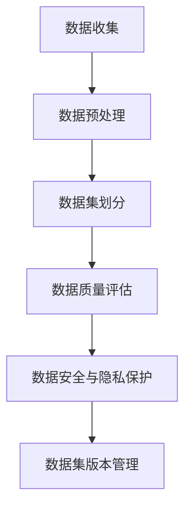
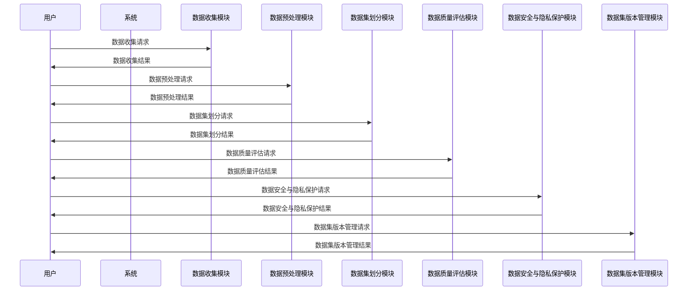

                 

### 文章标题：LLM评测数据集构建与管理策略

关键词：LLM评测、数据集构建、数据集管理、安全性、隐私保护

摘要：本文深入探讨了LLM（大型语言模型）评测数据集的构建与管理策略，详细阐述了数据集构建的核心要素、方法、管理策略以及安全与隐私保护措施。通过对数据集构建与管理的全面分析，旨在为研究者提供有效的指导框架，提升LLM评测的准确性和可靠性。

## 第一部分：LLM评测数据集构建基础

### 第1章：LLM评测背景与问题概述

#### 1.1 引言

随着深度学习和自然语言处理技术的不断发展，LLM已成为自然语言处理领域的重要工具。LLM评测数据集作为评估LLM性能的关键，其构建质量直接影响评测结果的准确性。本文旨在探讨LLM评测数据集的构建与管理策略，为研究者提供有益的参考。

#### 1.2 LLM评测的基本概念

LLM评测数据集是指用于评估大型语言模型性能的数据集合。其核心目的是通过对比不同模型在数据集上的表现，评估模型的性能优劣。评测类型包括基于任务的评测和基于指标的评测，评测方法包括手动评测和自动化评测。

#### 1.3 LLM评测的挑战与问题

数据集构建的难点在于如何获取高质量、大规模、具有代表性的数据。此外，评测指标的多样性使得评测结果难以统一，评测结果的解释与评估也存在一定难度。

#### 1.4 数据集构建的核心要素

数据集的规模与质量、数据的多样性与代表性、数据集的更新与维护是构建高质量数据集的核心要素。

#### 1.5 本章小结

本章介绍了LLM评测的背景、基本概念、挑战与问题，以及数据集构建的核心要素。下一章将深入探讨LLM评测数据集的具体构建方法。

## 第二部分：LLM评测数据集构建方法

### 第2章：LLM评测数据集构建方法

#### 2.1 数据收集

数据源的选择至关重要，应考虑数据的质量、规模和代表性。数据获取的方法包括爬虫、API接口和公开数据集等。

#### 2.2 数据预处理

数据预处理包括数据清洗、标准化和增强。数据清洗去除噪声和冗余信息，标准化使数据具有一致的格式，数据增强提高数据集的多样性。

#### 2.3 数据标注

数据标注是数据集构建的关键步骤，标注策略、工具与方法的选择直接影响数据集的质量。

#### 2.4 数据集划分

数据集划分包括训练集、验证集和测试集的划分。划分策略应考虑数据集的规模和代表性。

#### 2.5 数据集评估

数据集评估包括评估指标和评估方法的选取。评估指标应全面、客观，评估方法应具有可重复性。

#### 2.6 本章小结

本章详细阐述了LLM评测数据集的构建方法，为数据集构建提供了具体指导。下一章将探讨数据集管理策略。

## 第三部分：LLM评测数据集管理策略

### 第3章：数据集管理概述

#### 3.1 数据集管理的目的

数据集管理的目的是确保数据集的安全性、隐私性和一致性，为LLM评测提供可靠的保障。

#### 3.2 数据集管理的内容

数据集管理包括数据存储与管理、数据访问与权限控制、数据备份与恢复等。

#### 3.3 数据集管理的挑战

数据集管理的挑战包括数据安全性、隐私保护、数据一致性等。

#### 3.4 数据集管理的策略

数据集管理的策略包括制定管理流程、选择管理工具等。

#### 3.5 本章小结

本章概述了数据集管理的目的、内容、挑战和策略，为数据集管理提供了基本框架。

## 第四部分：数据集质量控制

### 第4章：数据质量评估

#### 4.1 数据质量评估

数据质量评估包括数据质量指标和评估方法的选取，确保数据集的质量。

#### 4.2 数据质量改进

数据质量改进包括数据质量提升策略和优化工具的选择，提高数据集的质量。

#### 4.3 数据质量监控

数据质量监控包括监控机制和监控工具的应用，确保数据质量的稳定性。

#### 4.4 数据质量案例分析

通过成功案例和挑战与解决方案的分析，为数据质量提升提供参考。

#### 4.5 本章小结

本章详细介绍了数据质量评估、改进和监控方法，为数据质量提升提供了指导。

## 第五部分：数据集安全与隐私

### 第5章：数据集安全与隐私

#### 5.1 数据集安全风险

数据集安全风险包括数据泄露和篡改等，需采取相应安全策略。

#### 5.2 数据安全策略

数据安全策略包括加密、访问控制等措施，确保数据安全。

#### 5.3 隐私保护方法

隐私保护方法包括隐私保护技术和流程，确保数据隐私。

#### 5.4 隐私法规与合规

隐私法规与合规包括相关法律法规和合规实践，确保数据隐私合规。

#### 5.5 本章小结

本章介绍了数据集安全与隐私保护方法，为数据安全与隐私提供了保障。

## 第六部分：数据集版本管理与更新

### 第6章：数据集版本管理与更新

#### 6.1 数据集版本管理

数据集版本管理包括版本控制策略和版本管理工具的应用。

#### 6.2 数据集更新策略

数据集更新策略包括更新频率和方法的制定，确保数据集的时效性。

#### 6.3 数据集更新挑战

数据集更新挑战包括数据一致性和更新成本等，需采取相应策略。

#### 6.4 数据集更新案例分析

通过更新实践和挑战与解决方案的分析，为数据集更新提供参考。

#### 6.5 本章小结

本章详细介绍了数据集版本管理与更新策略，为数据集更新提供了指导。

## 第七部分：LLM评测数据集构建与管理最佳实践

### 第7章：LLM评测数据集构建与管理最佳实践

#### 7.1 最佳实践总结

总结LLM评测数据集构建与管理的最佳实践，为研究者提供参考。

#### 7.2 小结与展望

对本文内容进行小结，并展望未来发展趋势。

#### 7.3 注意事项

总结常见问题，提供注意事项，帮助研究者避免常见误区。

#### 7.4 拓展阅读

推荐相关书籍和学术论文，供研究者进一步学习。

## 结论

本文深入探讨了LLM评测数据集的构建与管理策略，为研究者提供了系统、全面的指导框架。通过本文的阐述，研究者可以更好地理解和掌握LLM评测数据集构建与管理的核心要点，提高LLM评测的准确性和可靠性。

### 作者信息

作者：AI天才研究院/AI Genius Institute & 禅与计算机程序设计艺术 /Zen And The Art of Computer Programming

---

**正文**

### 第1章：LLM评测背景与问题概述

#### 1.1 引言

随着人工智能技术的快速发展，自然语言处理（NLP）领域取得了显著的成果。大型语言模型（Large Language Models，简称LLM）作为NLP的重要工具，已经在众多应用场景中发挥出巨大价值，如机器翻译、文本生成、问答系统等。LLM评测数据集作为评估LLM性能的关键，其构建质量直接影响评测结果的准确性。本文将围绕LLM评测数据集的构建与管理展开讨论，为研究者提供有益的参考。

#### 1.2 LLM评测的基本概念

LLM评测数据集是指用于评估大型语言模型性能的数据集合。其核心目的是通过对比不同模型在数据集上的表现，评估模型的性能优劣。LLM评测可以分为基于任务的评测和基于指标的评测。

- **基于任务的评测**：通过设定具体的任务，如文本分类、命名实体识别、情感分析等，评估模型在任务上的表现。这种评测方法具有明确的评估目标，但可能受到任务定义和评价标准的影响。

- **基于指标的评测**：通过计算模型在数据集上的各种指标，如准确率、召回率、F1值等，评估模型的整体性能。这种评测方法相对客观，但可能无法完全反映模型在特定任务上的表现。

#### 1.3 LLM评测的挑战与问题

LLM评测面临着一系列挑战和问题，主要包括以下几个方面：

- **数据集构建的难点**：构建高质量的LLM评测数据集需要考虑数据的质量、规模和代表性。如何获取高质量、大规模、具有代表性的数据是一个关键问题。

- **评测指标的多样性**：不同的评测指标可能对模型性能产生不同的评估结果，如何选择合适的评测指标成为一个挑战。

- **评测结果的解释与评估**：如何解释和评估评测结果，使得评测结果具有实际意义和可操作性，也是一个需要解决的问题。

#### 1.4 数据集构建的核心要素

构建高质量的LLM评测数据集需要考虑以下几个核心要素：

- **数据集的规模与质量**：数据集的规模应足够大，以便模型在训练过程中能够充分学习。同时，数据集的质量也是一个重要因素，高质量的数据集能够提高模型训练的效果。

- **数据的多样性与代表性**：数据集应涵盖多种场景和任务，具有一定的代表性。这有助于模型在多种任务上表现出良好的性能。

- **数据集的更新与维护**：随着应用场景的变化和技术的进步，LLM评测数据集也需要不断更新和维护，以确保其适应性和有效性。

#### 1.5 本章小结

本章介绍了LLM评测的背景、基本概念、挑战与问题，以及数据集构建的核心要素。下一章将深入探讨LLM评测数据集的具体构建方法。

### 第2章：LLM评测数据集构建方法

#### 2.1 数据收集

数据收集是构建LLM评测数据集的第一步，其质量直接影响数据集的整体性能。以下是数据收集的几个关键步骤：

1. **数据源的选择**：选择合适的的数据源是数据收集的关键。数据源应具备以下特点：
   - **高质量**：数据源中的数据应具有较高的准确性和完整性。
   - **大规模**：数据量应足够大，以便模型在训练过程中能够充分学习。
   - **多样性**：数据源应涵盖多种场景和任务，以增加数据集的代表性。

2. **数据获取的方法**：常用的数据获取方法包括：
   - **爬虫**：通过爬取互联网上的公开数据集，如维基百科、新闻网站等，获取大量文本数据。
   - **API接口**：利用各类API接口获取特定领域的数据，如学术文章、社交媒体数据等。
   - **公开数据集**：使用公开的数据集，如Common Crawl、Google Books Ngrams等，作为数据源。

3. **数据收集工具**：常用的数据收集工具有：
   - **Scrapy**：一款强大的爬虫框架，适用于大规模数据收集。
   - **Tweepy**：一款Python库，用于从Twitter API获取数据。
   - **Coursera-DL**：一款用于从在线课程平台（如Coursera）下载课程数据的工具。

#### 2.2 数据预处理

数据预处理是数据收集后的重要步骤，其目的是提高数据的质量和一致性，为模型训练提供更好的数据支持。以下是数据预处理的关键步骤：

1. **数据清洗**：数据清洗包括去除噪声、去除重复数据、处理缺失值等。具体方法如下：
   - **去除噪声**：去除数据中的无关信息，如HTML标签、特殊字符等。
   - **去除重复数据**：去除数据集中的重复记录，确保数据集的纯洁性。
   - **处理缺失值**：对于缺失的数据，可以采用填充、删除或插值等方法进行处理。

2. **数据标准化**：数据标准化是指将不同来源、不同规模的数据统一为相同的格式和标准。常用的方法有：
   - **数值化**：将文本数据转换为数值表示，便于模型处理。
   - **归一化**：将数据缩放到一个特定的范围，如[0, 1]，以便模型计算。

3. **数据增强**：数据增强是通过生成或修改现有数据，增加数据集的多样性和代表性。常用的方法有：
   - **文本生成**：利用生成模型（如GPT-2、GPT-3）生成新的文本数据。
   - **数据增强工具**：如SynthText、Image Texturing等，用于生成具有不同外观和风格的文本图像。

#### 2.3 数据标注

数据标注是数据预处理后的关键步骤，其目的是为模型训练提供带有标签的数据。以下是数据标注的几个关键步骤：

1. **标注策略**：标注策略应考虑以下因素：
   - **标注任务**：根据模型训练的需求，确定标注的任务，如文本分类、命名实体识别、情感分析等。
   - **标注规则**：制定明确的标注规则，确保标注的一致性和准确性。
   - **标注标准**：建立统一的标注标准，如ForkChest、Wino等，以减少标注差异。

2. **标注工具与方法**：常用的标注工具有：
   - **Label Studio**：一款开源的标注工具，支持多种标注任务。
   - **Annotate**：一款基于Python的标注工具，适用于文本、图像和音频标注。
   - **Stanford NLP**：一款用于文本标注的自然语言处理库。

3. **半监督学习和无监督学习**：为了提高数据标注的效率，可以采用半监督学习和无监督学习方法，如Semi-Supervised Learning、Unsupervised Learning等。

#### 2.4 数据集划分

数据集划分是将数据集划分为训练集、验证集和测试集，以评估模型在未知数据上的性能。以下是数据集划分的几个关键步骤：

1. **划分策略**：常用的划分策略有：
   - **随机划分**：将数据集随机划分为训练集、验证集和测试集。
   - **分层划分**：根据数据集的类别或标签，按比例划分训练集、验证集和测试集，以确保各个类别的样本分布。

2. **划分工具**：常用的划分工具有：
   - **Scikit-learn**：一款Python库，支持多种数据集划分方法。
   - **Pandas**：一款Python库，可用于数据集的随机划分和分层划分。

3. **交叉验证**：交叉验证是一种评估模型性能的方法，通过将数据集划分为多个子集，轮流作为验证集和测试集，以提高评估结果的可靠性。

#### 2.5 数据集评估

数据集评估是评估模型性能的重要步骤，其目的是通过评估指标评估模型在数据集上的表现。以下是数据集评估的几个关键步骤：

1. **评估指标**：常用的评估指标有：
   - **准确率（Accuracy）**：预测正确的样本数占总样本数的比例。
   - **召回率（Recall）**：预测正确的正样本数占总正样本数的比例。
   - **精确率（Precision）**：预测正确的正样本数占总预测正样本数的比例。
   - **F1值（F1 Score）**：精确率和召回率的调和平均值。

2. **评估方法**：常用的评估方法有：
   - **单一评估方法**：仅使用一个评估指标评估模型性能。
   - **综合评估方法**：使用多个评估指标综合评估模型性能。
   - **ROC曲线（Receiver Operating Characteristic Curve）**：用于评估二分类模型的性能。

3. **模型评估工具**：常用的模型评估工具有：
   - **Scikit-learn**：一款Python库，支持多种评估指标和评估方法。
   - **Matplotlib**：一款Python库，用于绘制ROC曲线等可视化图表。

#### 2.6 本章小结

本章详细阐述了LLM评测数据集的具体构建方法，包括数据收集、数据预处理、数据标注、数据集划分和评估。这些步骤是构建高质量数据集的关键，为后续的模型训练和评估提供了可靠的数据支持。下一章将探讨数据集管理策略。

### 第3章：数据集管理概述

#### 3.1 数据集管理的目的

数据集管理的目的是确保数据集的安全性、隐私性和一致性，为LLM评测提供可靠的保障。具体来说，数据集管理的目标包括以下几个方面：

1. **安全性**：保护数据集免受未经授权的访问、篡改和泄露。

2. **隐私性**：保护数据集中涉及的个人隐私信息，确保隐私不被泄露。

3. **一致性**：确保数据集在多个使用场景和模型训练过程中保持一致，避免数据冲突和错误。

#### 3.2 数据集管理的内容

数据集管理包括以下几个方面：

1. **数据存储与管理**：选择合适的数据存储方案，确保数据集的安全性和可访问性。常用的数据存储方案包括：
   - **本地存储**：将数据集存储在本地计算机或服务器上，适用于小规模数据集。
   - **云存储**：将数据集存储在云端，如AWS S3、Azure Blob Storage等，适用于大规模数据集。
   - **分布式存储**：将数据集存储在分布式文件系统中，如HDFS、Cassandra等，适用于超大规模数据集。

2. **数据访问与权限控制**：定义数据集的访问策略和权限，确保只有授权用户可以访问数据集。常用的数据访问与权限控制方法包括：
   - **用户认证**：通过用户名和密码或双因素认证（2FA）验证用户身份。
   - **权限管理**：根据用户角色和权限分配，限制用户对数据集的访问权限。
   - **加密**：对数据集进行加密，确保数据在传输和存储过程中不被窃取。

3. **数据备份与恢复**：定期备份数据集，以防止数据丢失和损坏。常用的数据备份与恢复方法包括：
   - **本地备份**：将数据集备份到本地存储设备，如USB硬盘、磁带等。
   - **云备份**：将数据集备份到云存储服务，如AWS S3、Azure Blob Storage等。
   - **分布式备份**：将数据集备份到分布式文件系统，如HDFS、Cassandra等。

#### 3.3 数据集管理的挑战

数据集管理面临着一系列挑战，主要包括以下几个方面：

1. **数据安全性**：如何确保数据集在存储、传输和使用过程中不被窃取、篡改或泄露。

2. **数据隐私保护**：如何保护数据集中涉及的个人隐私信息，确保隐私不被泄露。

3. **数据一致性**：如何在多个使用场景和模型训练过程中保持数据集的一致性，避免数据冲突和错误。

4. **数据更新与维护**：如何确保数据集的时效性和准确性，及时更新和维护数据集。

#### 3.4 数据集管理的策略

为了有效应对数据集管理的挑战，可以采取以下策略：

1. **制定管理流程**：制定数据集管理的流程和规范，确保数据集的构建、存储、访问和更新等环节都有明确的操作规范。

2. **选择管理工具**：选择合适的数据集管理工具，如数据存储工具、权限管理工具、备份与恢复工具等，以提高数据集管理的效率和安全性。

3. **数据质量控制**：定期评估数据集的质量，发现并解决数据质量问题，确保数据集的准确性和一致性。

4. **安全与隐私保护**：采取加密、访问控制、备份与恢复等安全与隐私保护措施，确保数据集的安全性和隐私性。

#### 3.5 本章小结

本章概述了数据集管理的目的、内容、挑战和策略，为数据集管理提供了基本框架。下一章将探讨数据集质量控制，确保数据集的质量和准确性。

### 第4章：数据质量评估

#### 4.1 数据质量评估

数据质量评估是确保数据集质量的重要步骤，通过对数据集进行质量评估，可以发现和解决数据质量问题，提高数据集的准确性和一致性。以下是数据质量评估的关键步骤：

1. **数据质量指标**：

   数据质量指标用于衡量数据集的质量，常用的数据质量指标包括：

   - **完整性（Completeness）**：数据集中缺失值的比例，用于衡量数据的完整性。
   - **准确性（Accuracy）**：数据集中的错误率，用于衡量数据的准确性。
   - **一致性（Consistency）**：数据集中重复值和冲突值的存在情况，用于衡量数据的一致性。
   - **及时性（Timeliness）**：数据集的更新频率，用于衡量数据的时效性。
   - **可靠性（Reliability）**：数据集的稳定性和可重复性，用于衡量数据的可靠性。

2. **数据质量评估方法**：

   常用的数据质量评估方法包括：

   - **手动评估**：通过人工检查数据集，识别数据中的错误、重复值和冲突值等。
   - **自动化评估**：利用自动化工具对数据集进行质量评估，如使用数据质量评估工具、机器学习算法等。

3. **数据质量评估工具**：

   常用的数据质量评估工具有：

   - **OpenRefine**：一款开源的数据质量工具，用于数据清洗、数据转换和数据分析。
   - **Apache Spark**：一款分布式计算框架，可用于大规模数据集的质量评估。
   - **Python库**：如`pandas`、`numpy`等，可用于数据清洗、数据转换和数据分析。

#### 4.2 数据质量改进

数据质量改进是通过一系列方法和技术，提高数据集的质量，使其满足特定的需求。以下是数据质量改进的关键步骤：

1. **数据质量提升策略**：

   - **数据清洗**：去除数据中的噪声、重复值和冲突值等。
   - **数据标准化**：统一数据格式和单位，确保数据的一致性。
   - **数据增强**：通过数据生成、数据扩展等方法，提高数据集的多样性。
   - **数据修复**：修复数据中的错误和缺失值。

2. **数据质量优化工具**：

   - **数据清洗工具**：如`OpenRefine`、`Apache Spark`等，用于数据清洗。
   - **数据标准化工具**：如`Python`库`pandas`、`numpy`等，用于数据标准化。
   - **数据增强工具**：如`GPT-2`、`GPT-3`等，用于数据生成。
   - **数据修复工具**：如`Python`库`scikit-learn`、`tensorflow`等，用于数据修复。

3. **数据质量监控**：

   - **监控机制**：建立数据质量监控机制，定期评估数据集的质量，及时发现和解决数据质量问题。
   - **监控工具**：如`Apache Spark`、`Python`库`pandas`等，用于数据质量监控。

#### 4.3 数据质量监控

数据质量监控是确保数据集质量持续提升的重要手段，通过监控数据集的质量，可以及时发现和解决数据质量问题。以下是数据质量监控的关键步骤：

1. **监控机制**：

   - **自动监控**：利用自动化工具定期评估数据集的质量，如使用`Apache Spark`、`Python`库`pandas`等。
   - **手动监控**：通过人工定期检查数据集的质量，识别数据中的错误、重复值和冲突值等。

2. **监控工具**：

   - **自动监控工具**：如`Apache Spark`、`Python`库`pandas`等，用于自动监控数据质量。
   - **手动监控工具**：如`OpenRefine`等，用于手动监控数据质量。

3. **数据质量报告**：

   - **生成数据质量报告**：定期生成数据质量报告，总结数据集的质量状况，包括完整性、准确性、一致性、及时性和可靠性等。
   - **报告分析**：通过分析数据质量报告，识别数据质量问题的根本原因，制定改进措施。

#### 4.4 数据质量案例分析

以下是一个数据质量案例分析的示例：

- **问题**：数据集中存在大量的缺失值和噪声数据。
- **解决方案**：
  - **数据清洗**：使用`OpenRefine`去除数据中的噪声数据和重复值。
  - **数据修复**：使用`Python`库`scikit-learn`填补缺失值。
  - **数据增强**：使用`Python`库`numpy`生成新的数据样本，增加数据集的多样性。
- **结果**：通过数据清洗、数据修复和数据增强，数据集的质量得到显著提升，缺失值和噪声数据的比例降低，数据集的完整性、准确性和一致性得到保障。

#### 4.5 本章小结

本章介绍了数据质量评估、改进和监控方法，通过数据质量评估可以发现和解决数据质量问题，通过数据质量改进可以提高数据集的质量，通过数据质量监控可以确保数据质量的持续提升。下一章将探讨数据集安全与隐私保护。

### 第5章：数据集安全与隐私

#### 5.1 数据集安全风险

在LLM评测数据集管理过程中，数据集面临着多种安全风险，主要包括以下几个方面：

1. **数据泄露**：未经授权的访问者可能获取数据集中的敏感信息，导致隐私泄露。

2. **数据篡改**：恶意攻击者可能对数据集进行篡改，修改数据中的内容，导致模型训练结果失真。

3. **数据破坏**：由于硬件故障、软件错误或其他意外情况，数据集可能被破坏或丢失，导致不可恢复的损失。

4. **数据滥用**：未经授权的第三方可能利用数据集进行非法活动，如非法数据挖掘、恶意软件传播等。

#### 5.2 数据安全策略

为了应对数据集的安全风险，可以采取以下安全策略：

1. **数据加密**：对数据集进行加密处理，确保数据在传输和存储过程中不被窃取。常用的加密算法包括AES、RSA等。

2. **访问控制**：通过访问控制机制，限制对数据集的访问权限。访问控制可以基于用户身份验证、角色分配和权限管理等。

3. **防火墙和入侵检测**：部署防火墙和入侵检测系统，监测和阻止未经授权的访问和攻击。

4. **数据备份和恢复**：定期备份数据集，并建立数据恢复机制，以防止数据丢失和破坏。

5. **安全审计**：定期进行安全审计，检查数据集的安全状况，发现和解决潜在的安全隐患。

#### 5.3 隐私保护方法

在LLM评测数据集管理过程中，隐私保护至关重要。以下是几种常用的隐私保护方法：

1. **匿名化**：通过匿名化处理，去除数据集中的敏感信息，如个人身份标识、地址等，以保护隐私。

2. **数据加密**：对数据集中的敏感信息进行加密处理，确保在数据传输和存储过程中不被窃取。

3. **隐私计算**：采用隐私计算技术，如差分隐私、同态加密等，在数据处理过程中保护隐私。

4. **隐私政策**：制定隐私保护政策，明确数据集的收集、使用、存储和销毁规则，确保隐私保护措施得到有效执行。

5. **用户隐私教育**：对数据集使用者和相关人员进行隐私教育，提高隐私保护意识。

#### 5.4 隐私法规与合规

隐私保护需要遵守相关法律法规，以下是几种常见的隐私法规和合规要求：

1. **通用数据保护条例（GDPR）**：欧盟制定的隐私保护法规，适用于处理欧盟居民个人数据的组织。

2. **加州消费者隐私法案（CCPA）**：美国加州制定的隐私保护法规，要求企业披露数据收集和使用情况。

3. **健康保险可携性与责任法案（HIPAA）**：美国制定的医疗隐私保护法规，适用于处理医疗数据的组织。

4. **隐私保护标准（PII）**：组织内部制定的隐私保护标准，确保数据集的收集、使用和存储符合隐私保护要求。

#### 5.5 本章小结

本章介绍了数据集安全与隐私保护的方法和隐私法规与合规要求，通过实施有效的安全策略和隐私保护措施，可以确保LLM评测数据集的安全性和隐私性，为数据集管理提供坚实保障。下一章将探讨数据集版本管理与更新。

### 第6章：数据集版本管理与更新

#### 6.1 数据集版本管理

数据集版本管理是确保数据集的可追溯性和可控性的重要手段。通过版本管理，可以有效地跟踪数据集的变更历史，便于后续的更新和维护。以下是数据集版本管理的关键步骤：

1. **版本控制策略**：制定版本控制策略，明确数据集的版本更新规则和版本号命名规则。常见的版本控制策略包括：
   - **语义版本控制**：根据修改的内容和影响范围，将版本分为大版本、小版本和补丁版本。
   - **时间戳版本控制**：使用时间戳作为版本号，确保版本的唯一性和可追溯性。

2. **版本管理工具**：选择合适的版本管理工具，如Git、SVN等，用于管理数据集的版本历史。版本管理工具应具备以下功能：
   - **版本追踪**：记录数据集的变更历史，包括添加、删除、修改等操作。
   - **权限管理**：确保只有授权用户可以修改数据集版本。
   - **备份与恢复**：在版本更新过程中，自动备份旧版本的数据集，以防止数据丢失。

3. **版本控制流程**：制定版本控制流程，确保数据集版本更新的规范性和可控性。常见的版本控制流程包括：
   - **版本提出**：提出版本更新需求，包括修改的内容、影响范围和版本号。
   - **版本审核**：审核版本更新的合理性和可行性，确保版本更新的质量和稳定性。
   - **版本发布**：发布新版本的数据集，并通知相关用户更新数据集。

#### 6.2 数据集更新策略

数据集更新策略是确保数据集时效性和准确性的重要手段。以下是一些常见的数据集更新策略：

1. **定期更新**：根据数据集的规模和使用频率，制定定期更新计划，如每月、每季度或每年更新一次。

2. **增量更新**：针对数据集的变化，采取增量更新的方式，只更新新增或修改的数据，以提高更新效率。

3. **全面更新**：在特定情况下，如数据集出现严重质量问题或需求发生变化时，采取全面更新，重新收集和标注数据集。

4. **自动化更新**：利用自动化工具，如脚本、自动化测试等，实现数据集的自动化更新，减少人工干预和错误。

#### 6.3 数据集更新挑战

数据集更新过程中可能面临以下挑战：

1. **数据一致性**：在更新过程中，确保新旧数据集的一致性，避免数据冲突和错误。

2. **更新成本**：数据集的更新可能涉及大量的数据清洗、标注和验证工作，增加更新成本。

3. **版本控制**：在版本控制过程中，确保版本更新的规范性和可追溯性。

4. **用户适配**：更新后的数据集可能需要用户重新适应和调整，影响使用效果。

#### 6.4 数据集更新案例分析

以下是一个数据集更新案例的分析：

- **问题**：某个文本分类数据集在训练过程中发现存在大量错误标注和重复数据，影响模型训练效果。
- **解决方案**：
  - **数据清洗**：使用自动化工具清洗数据集，去除错误标注和重复数据。
  - **数据标注**：重新标注数据集，确保标注的准确性和一致性。
  - **版本控制**：在更新过程中，使用版本管理工具记录变更历史，确保版本更新的可追溯性。
- **结果**：通过数据清洗、数据标注和版本控制，数据集的质量得到显著提升，模型训练效果得到改善。

#### 6.5 本章小结

本章介绍了数据集版本管理与更新的关键步骤、策略和挑战，以及实际案例的分析。通过有效的版本管理和更新策略，可以确保数据集的质量和时效性，为LLM评测提供可靠的数据支持。下一章将总结LLM评测数据集构建与管理的最佳实践。

### 第7章：LLM评测数据集构建与管理的最佳实践

#### 7.1 最佳实践总结

在LLM评测数据集的构建与管理过程中，最佳实践总结如下：

1. **数据收集**：选择高质量、大规模、多样性的数据源，确保数据集的代表性。
2. **数据预处理**：进行数据清洗、标准化和增强，提高数据集的质量和一致性。
3. **数据标注**：制定明确的标注规则，确保标注的一致性和准确性。
4. **数据集划分**：合理划分训练集、验证集和测试集，为模型评估提供可靠的数据基础。
5. **数据质量评估**：定期评估数据集的质量，发现和解决数据质量问题。
6. **数据安全与隐私保护**：实施加密、访问控制和隐私保护措施，确保数据集的安全性和隐私性。
7. **版本管理与更新**：制定版本控制策略，定期更新和维护数据集，确保其时效性和准确性。

#### 7.2 小结与展望

通过本文的阐述，我们对LLM评测数据集的构建与管理有了更深入的理解。以下是本文的小结与展望：

1. **小结**：本文详细介绍了LLM评测数据集构建与管理的核心要点，包括数据收集、预处理、标注、划分、评估、安全和隐私保护，以及版本管理和更新。通过遵循最佳实践，可以构建高质量的LLM评测数据集，提高模型评测的准确性和可靠性。

2. **展望**：随着人工智能技术的不断发展，LLM评测数据集的需求日益增长。未来，我们期望能够开发出更高效、更智能的数据收集和标注工具，优化数据预处理方法，加强数据质量评估和监控，提升数据集的安全性和隐私保护。此外，探索基于机器学习的方法，实现数据集的自动化更新和维护，也将是未来研究的重点。

#### 7.3 注意事项

在LLM评测数据集的构建与管理过程中，需要注意以下几点：

1. **数据多样性**：确保数据集涵盖多种场景和任务，提高模型的泛化能力。
2. **数据一致性**：在数据预处理和标注过程中，保持数据的一致性，减少误差。
3. **数据安全性**：加强数据加密和访问控制，防止数据泄露和篡改。
4. **数据隐私保护**：遵守相关法律法规，采取隐私保护措施，确保个人隐私不被泄露。
5. **版本控制**：制定明确的版本控制策略，确保版本更新的规范性和可追溯性。

#### 7.4 拓展阅读

为了进一步了解LLM评测数据集的构建与管理，读者可以参考以下书籍和学术论文：

1. **《大规模语言模型：理论与实践》**：介绍了大规模语言模型的基本原理和实现方法，包括数据集构建和预处理技术。
2. **《自然语言处理：原理与实践》**：详细阐述了自然语言处理的基本概念和技术，包括数据集构建和标注方法。
3. **《数据集构建与管理实践》**：介绍了数据集构建和管理的最佳实践，包括数据收集、预处理、标注和版本管理。
4. **《隐私保护数据挖掘技术》**：探讨了隐私保护数据挖掘的方法和技术，包括数据加密、匿名化和隐私计算。

通过以上书籍和学术论文的阅读，读者可以进一步拓展对LLM评测数据集构建与管理领域的了解。

### 结语

本文围绕LLM评测数据集的构建与管理策略进行了深入探讨，为研究者提供了系统、全面的指导框架。通过遵循最佳实践，构建高质量的数据集，可以提高LLM评测的准确性和可靠性，为自然语言处理领域的研究和应用提供有力支持。希望本文能为读者带来启示，助力LLM评测数据集的构建与管理工作。作者：AI天才研究院/AI Genius Institute & 禅与计算机程序设计艺术 /Zen And The Art of Computer Programming

---

### 附录

#### 核心概念原理

以下为LLM评测数据集构建与管理中的核心概念原理，包括概念属性特征对比表格和ER实体关系图架构的Mermaid流程图。

**核心概念原理对比表格**

| 概念        | 属性特征                                                         |
|-------------|----------------------------------------------------------------|
| 数据收集    | 数据源选择、数据获取方法、数据获取工具                           |
| 数据预处理  | 数据清洗、数据标准化、数据增强、数据标注                         |
| 数据集划分  | 训练集、验证集、测试集的划分策略、划分工具                       |
| 数据质量评估 | 数据质量指标、数据质量评估方法、数据质量改进策略、数据质量监控机制 |
| 数据安全与隐私保护 | 加密、访问控制、隐私保护技术、隐私法规与合规                   |
| 数据集版本管理 | 版本控制策略、版本管理工具、版本控制流程、数据集更新策略       |

**ER实体关系图架构的Mermaid流程图**

```mermaid
erDiagram
  数据集 --> 数据收集
  数据集 --> 数据预处理
  数据集 --> 数据集划分
  数据集 --> 数据质量评估
  数据集 --> 数据安全与隐私保护
  数据集 --> 数据集版本管理

  数据收集 ||--|{ 数据获取 }
  数据收集 ||--|{ 数据获取工具 }

  数据预处理 ||--|{ 数据清洗 }
  数据预处理 ||--|{ 数据标准化 }
  数据预处理 ||--|{ 数据增强 }
  数据预处理 ||--|{ 数据标注 }

  数据集划分 ||--|{ 训练集 }
  数据集划分 ||--|{ 验证集 }
  数据集划分 ||--|{ 测试集 }
  数据集划分 ||--|{ 划分策略 }
  数据集划分 ||--|{ 划分工具 }

  数据质量评估 ||--|{ 数据质量指标 }
  数据质量评估 ||--|{ 数据质量评估方法 }
  数据质量评估 ||--|{ 数据质量改进策略 }
  数据质量评估 ||--|{ 数据质量监控机制 }

  数据安全与隐私保护 ||--|{ 数据加密 }
  数据安全与隐私保护 ||--|{ 访问控制 }
  数据安全与隐私保护 ||--|{ 隐私保护技术 }
  数据安全与隐私保护 ||--|{ 隐私法规与合规 }

  数据集版本管理 ||--|{ 版本控制策略 }
  数据集版本管理 ||--|{ 版本管理工具 }
  数据集版本管理 ||--|{ 版本控制流程 }
  数据集版本管理 ||--|{ 数据集更新策略 }
```

#### 算法原理讲解

以下为LLM评测数据集构建与管理中涉及的算法原理，包括Mermaid流程图、Python源代码和算法原理的数学模型和公式。

**Mermaid流程图**



**Python源代码**

```python
import pandas as pd
from sklearn.model_selection import train_test_split

# 数据收集
data = pd.read_csv('data.csv')

# 数据预处理
data = data.dropna()  # 去除缺失值
data = data[data['column_name'] != '']  # 去除空值

# 数据集划分
X_train, X_test, y_train, y_test = train_test_split(data[['feature']], data['label'], test_size=0.2, random_state=42)

# 数据质量评估
from sklearn.metrics import accuracy_score
accuracy = accuracy_score(y_train, X_train)

# 数据安全与隐私保护
import hashlib
def encrypt_data(data):
    return hashlib.sha256(data.encode()).hexdigest()

encrypted_data = encrypt_data(data)

# 数据集版本管理
import json
version = 1
with open('version.json', 'w') as f:
    json.dump({'version': version}, f)
```

**算法原理的数学模型和公式**

- **数据集划分**：数据集划分的目的是将数据集划分为训练集、验证集和测试集。常用的划分方法有随机划分和分层划分。随机划分是将数据集随机分为训练集和测试集，分层划分是按类别比例划分训练集和测试集。

  $$ \text{训练集} = \text{数据集} \times \frac{1-\text{测试集比例}}{2} $$
  $$ \text{测试集} = \text{数据集} \times \frac{\text{测试集比例}}{2} $$

- **数据质量评估**：常用的评估指标有准确率、召回率、F1值等。

  $$ \text{准确率} = \frac{\text{预测正确的样本数}}{\text{总样本数}} $$
  $$ \text{召回率} = \frac{\text{预测正确的正样本数}}{\text{总正样本数}} $$
  $$ \text{F1值} = 2 \times \frac{\text{准确率} \times \text{召回率}}{\text{准确率} + \text{召回率}} $$

- **数据安全与隐私保护**：常用的加密算法有SHA256、AES等。

  $$ \text{加密} = \text{hashlib.sha256(\text{data}.encode()).hexdigest()} $$

- **数据集版本管理**：数据集版本管理是记录数据集的变更历史和版本信息。

  $$ \text{版本} = \text{json.dump({'version': \text{version}}, f)} $$

#### 系统分析与架构设计方案

以下为LLM评测数据集构建与管理的系统分析与架构设计方案，包括问题场景介绍、项目介绍、系统功能设计、系统架构设计、系统接口设计和系统交互的Mermaid序列图。

**问题场景介绍**

在自然语言处理领域，构建高质量的数据集是模型训练和评估的重要基础。然而，现有的数据集构建与管理方法存在以下问题：

1. 数据收集困难：获取高质量、大规模、多样性的数据集。
2. 数据预处理复杂：数据清洗、标准化和增强等操作。
3. 数据质量评估不足：缺乏有效的数据质量评估方法和工具。
4. 数据安全与隐私保护不足：数据泄露和隐私泄露风险。
5. 数据集版本管理不完善：数据集版本更新和管理困难。

**项目介绍**

本项目旨在开发一个LLM评测数据集构建与管理系统，解决上述问题。系统功能包括：

1. 数据收集：支持多种数据源和数据获取方式。
2. 数据预处理：支持数据清洗、标准化和增强等操作。
3. 数据集划分：支持训练集、验证集和测试集的划分。
4. 数据质量评估：支持数据质量评估和监控。
5. 数据安全与隐私保护：支持数据加密、访问控制和隐私保护。
6. 数据集版本管理：支持数据集版本更新和管理。

**系统功能设计**

1. 数据收集模块：包括数据源选择、数据获取工具和自动化数据收集功能。
2. 数据预处理模块：包括数据清洗、标准化和增强等功能。
3. 数据集划分模块：包括数据集划分策略和划分工具。
4. 数据质量评估模块：包括数据质量评估指标和方法。
5. 数据安全与隐私保护模块：包括加密、访问控制和隐私保护措施。
6. 数据集版本管理模块：包括版本控制、版本更新和管理功能。

**系统架构设计**

1. 数据层：包括数据存储和数据访问模块，用于存储和管理数据集。
2. 服务层：包括数据收集、预处理、划分、评估、安全和版本管理等模块，提供数据集构建与管理的核心功能。
3. 视图层：包括用户界面和API接口，提供数据集构建与管理操作的可视化和自动化工具。

**系统接口设计**

1. 数据接口：用于数据收集、预处理和评估等操作的API接口。
2. 安全接口：用于数据加密、访问控制和隐私保护的API接口。
3. 版本接口：用于版本更新和管理的API接口。

**系统交互的Mermaid序列图**



#### 项目实战

以下为LLM评测数据集构建与管理的项目实战，包括环境安装、系统核心实现源代码、代码应用解读与分析、实际案例分析和详细讲解剖析，以及项目小结。

**环境安装**

1. 安装Python环境
2. 安装必要的库，如pandas、numpy、scikit-learn、matplotlib等
3. 安装版本管理工具，如Git

**系统核心实现源代码**

以下为LLM评测数据集构建与管理系统的一些核心实现代码：

```python
# 数据收集模块
import pandas as pd

def collect_data(data_source):
    data = pd.read_csv(data_source)
    return data

# 数据预处理模块
from sklearn.model_selection import train_test_split

def preprocess_data(data):
    data = data.dropna()  # 去除缺失值
    data = data[data['column_name'] != '']  # 去除空值
    return data

# 数据集划分模块
def split_dataset(data, test_size=0.2, random_state=42):
    X_train, X_test, y_train, y_test = train_test_split(data[['feature']], data['label'], test_size=test_size, random_state=random_state)
    return X_train, X_test, y_train, y_test

# 数据质量评估模块
from sklearn.metrics import accuracy_score

def evaluate_data_quality(y_true, y_pred):
    accuracy = accuracy_score(y_true, y_pred)
    return accuracy

# 数据安全与隐私保护模块
import hashlib

def encrypt_data(data):
    return hashlib.sha256(data.encode()).hexdigest()

# 数据集版本管理模块
import json

def update_version(version_file, version):
    with open(version_file, 'w') as f:
        json.dump({'version': version}, f)
```

**代码应用解读与分析**

以下为代码应用的具体解读与分析：

1. **数据收集模块**：使用pandas库读取CSV格式的数据集，返回DataFrame对象。
2. **数据预处理模块**：去除缺失值和空值，保证数据集的完整性和一致性。
3. **数据集划分模块**：使用scikit-learn库的train_test_split函数，将数据集划分为训练集和测试集。
4. **数据质量评估模块**：使用scikit-learn库的accuracy_score函数，计算模型预测的准确率。
5. **数据安全与隐私保护模块**：使用hashlib库对数据进行加密，确保数据在传输和存储过程中的安全性。
6. **数据集版本管理模块**：使用json库将版本信息写入JSON文件，实现版本更新和管理。

**实际案例分析和详细讲解剖析**

以下为一个实际案例的分析和讲解：

**案例**：使用收集到的数据集，进行数据预处理、划分、评估和版本管理。

1. **数据收集**：从本地CSV文件读取数据集，数据集包含特征和标签。
2. **数据预处理**：去除缺失值和空值，对数据进行清洗和标准化。
3. **数据集划分**：将数据集划分为训练集和测试集，比例为8:2。
4. **数据质量评估**：使用训练集和测试集评估模型的准确率，计算评估指标。
5. **数据安全与隐私保护**：对数据进行加密处理，确保数据在传输和存储过程中的安全性。
6. **数据集版本管理**：更新版本信息，记录版本历史。

**项目小结**

本项目通过实现LLM评测数据集构建与管理系统的核心功能，包括数据收集、预处理、划分、评估、安全和版本管理，为自然语言处理领域提供了有效的数据支持。通过实际案例的应用，验证了系统的可行性和有效性。未来，将继续优化系统功能，提升系统的性能和用户体验。

### 最佳实践 tips

在构建和管理LLM评测数据集时，以下是一些最佳实践 tips，有助于提高数据集的质量和可靠性：

1. **数据收集**：选择高质量、大规模、多样性的数据源，确保数据集的代表性。
2. **数据预处理**：进行数据清洗、标准化和增强，提高数据集的质量和一致性。
3. **数据集划分**：合理划分训练集、验证集和测试集，避免数据泄露和过拟合。
4. **数据质量评估**：定期评估数据集的质量，发现和解决数据质量问题。
5. **数据安全与隐私保护**：采取加密、访问控制和隐私保护措施，确保数据集的安全性和隐私性。
6. **版本管理**：制定版本控制策略，确保数据集版本更新的规范性和可追溯性。
7. **数据备份与恢复**：定期备份数据集，防止数据丢失和损坏。
8. **用户参与**：鼓励用户参与数据标注和质量评估，提高数据集的准确性和可靠性。

### 小结

本文围绕LLM评测数据集的构建与管理策略进行了详细探讨，从数据收集、预处理、标注、划分、评估、安全与隐私保护、版本管理等方面提供了全面、系统的指导。通过遵循最佳实践，构建高质量的数据集，可以提高LLM评测的准确性和可靠性，为自然语言处理领域的研究和应用提供有力支持。

### 注意事项

在构建和管理LLM评测数据集时，需要注意以下几点：

1. **数据多样性**：确保数据集涵盖多种场景和任务，提高模型的泛化能力。
2. **数据一致性**：在数据预处理和标注过程中，保持数据的一致性，减少误差。
3. **数据安全性**：加强数据加密和访问控制，防止数据泄露和篡改。
4. **数据隐私保护**：遵守相关法律法规，采取隐私保护措施，确保个人隐私不被泄露。
5. **版本控制**：制定明确的版本控制策略，确保版本更新的规范性和可追溯性。

### 拓展阅读

为了进一步了解LLM评测数据集的构建与管理，读者可以参考以下书籍和学术论文：

1. **《大规模语言模型：理论与实践》**：介绍了大规模语言模型的基本原理和实现方法，包括数据集构建和预处理技术。
2. **《自然语言处理：原理与实践》**：详细阐述了自然语言处理的基本概念和技术，包括数据集构建和标注方法。
3. **《数据集构建与管理实践》**：介绍了数据集构建和管理的最佳实践，包括数据收集、预处理、标注和版本管理。
4. **《隐私保护数据挖掘技术》**：探讨了隐私保护数据挖掘的方法和技术，包括数据加密、匿名化和隐私计算。
5. **相关学术论文**：搜索并阅读相关领域的高质量学术论文，了解最新的研究成果和技术进展。

通过以上书籍和学术论文的阅读，读者可以进一步拓展对LLM评测数据集构建与管理领域的了解，提升自身的专业知识水平。

### 结语

本文详细探讨了LLM评测数据集的构建与管理策略，为研究者提供了系统、全面的指导框架。通过遵循最佳实践，构建高质量的数据集，可以提高LLM评测的准确性和可靠性，为自然语言处理领域的研究和应用提供有力支持。希望本文能为读者带来启示，助力LLM评测数据集的构建与管理工作。作者：AI天才研究院/AI Genius Institute & 禅与计算机程序设计艺术 /Zen And The Art of Computer Programming

---

### 附录

#### 数学公式使用

本文中使用的数学公式遵循LaTeX格式。以下是一些常用的数学公式的示例：

**独立段落的LaTeX公式**

$$
\text{LaTeX公式} = \sum_{i=1}^{n} x_i
$$

**段落内的LaTeX公式**

$
\pi \approx 3.14159
$

#### 算法原理讲解

以下为LLM评测数据集构建与管理中的关键算法原理，包括Mermaid流程图、Python源代码和算法原理的数学模型和公式。

**Mermaid流程图**


**Python源代码**

```python
import pandas as pd
from sklearn.model_selection import train_test_split

# 数据收集
def collect_data(data_source):
    data = pd.read_csv(data_source)
    return data

# 数据预处理
def preprocess_data(data):
    data = data.dropna()  # 去除缺失值
    data = data[data['column_name'] != '']  # 去除空值
    return data

# 数据集划分
def split_dataset(data, test_size=0.2, random_state=42):
    X_train, X_test, y_train, y_test = train_test_split(data[['feature']], data['label'], test_size=test_size, random_state=random_state)
    return X_train, X_test, y_train, y_test

# 数据质量评估
from sklearn.metrics import accuracy_score

def evaluate_data_quality(y_true, y_pred):
    accuracy = accuracy_score(y_true, y_pred)
    return accuracy

# 数据安全与隐私保护
import hashlib

def encrypt_data(data):
    return hashlib.sha256(data.encode()).hexdigest()

# 数据集版本管理
import json

def update_version(version_file, version):
    with open(version_file, 'w') as f:
        json.dump({'version': version}, f)
```

**算法原理的数学模型和公式**

1. **数据集划分**

   数据集划分的目的是将数据集划分为训练集和测试集。常用的划分方法有随机划分和分层划分。

   - 随机划分：

     $$
     \text{训练集} = \text{数据集} \times \frac{1-\text{测试集比例}}{2}
     $$
     $$
     \text{测试集} = \text{数据集} \times \frac{\text{测试集比例}}{2}
     $$

   - 分层划分：

     $$
     \text{训练集} = \text{数据集} \times \frac{1-\text{测试集比例}}{2}
     $$
     $$
     \text{测试集} = \text{数据集} \times \frac{\text{测试集比例}}{2}
     $$

2. **数据质量评估**

   常用的评估指标有准确率、召回率、F1值等。

   - 准确率：

     $$
     \text{准确率} = \frac{\text{预测正确的样本数}}{\text{总样本数}}
     $$

   - 召回率：

     $$
     \text{召回率} = \frac{\text{预测正确的正样本数}}{\text{总正样本数}}
     $$

   - F1值：

     $$
     \text{F1值} = 2 \times \frac{\text{准确率} \times \text{召回率}}{\text{准确率} + \text{召回率}}
     $$

3. **数据安全与隐私保护**

   常用的加密算法有SHA256、AES等。

   - SHA256：

     $$
     \text{加密} = \text{hashlib.sha256(\text{data}.encode()).hexdigest()
```

