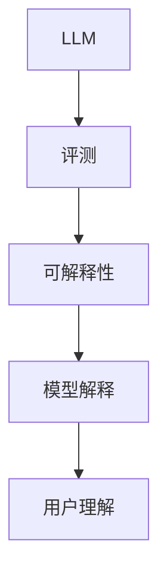
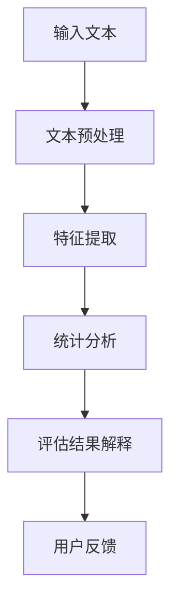
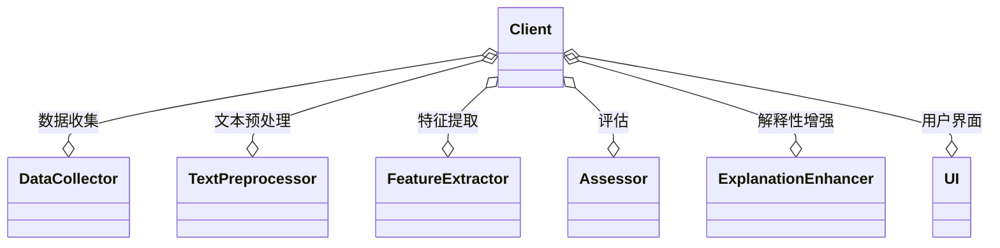
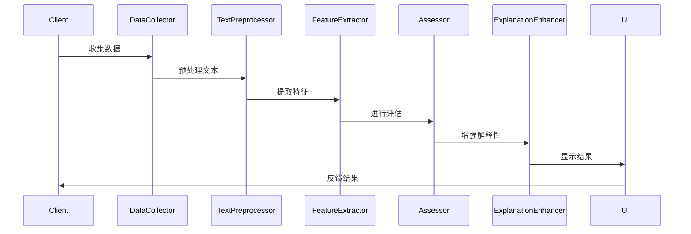
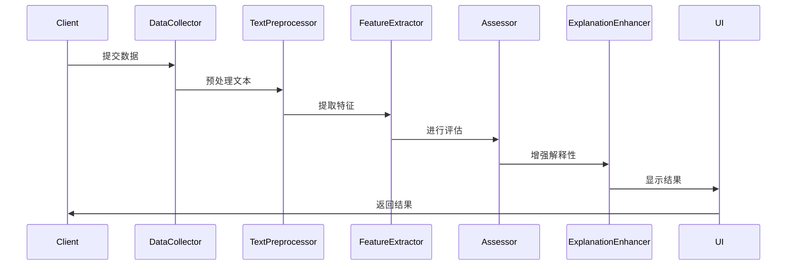

                 

## 文章标题

# LLM评测的可解释性增强：透明化评估过程

---

## 关键词

- **LLM**、**评测**、**可解释性**、**透明化评估**、**算法优化**、**模型性能评估**

---

## 摘要

本文旨在探讨大型语言模型（LLM）评测中的可解释性增强问题。通过深入分析LLM评估的现状，本文提出了一系列增强评估透明化的方法和策略。首先，本文介绍了LLM的基本概念、评测的重要性及其面临的挑战。接着，文章详细阐述了可解释性的核心概念，并通过Mermaid流程图展示了各概念之间的关系。随后，文章通过算法原理讲解和数学模型分析，详细解析了如何通过改进算法和数学模型来增强评估的可解释性。文章还设计了一个系统架构图，并描述了在实际项目中的具体实施步骤。最后，本文总结了最佳实践，并给出了注意事项和拓展阅读资源，为读者提供全面的技术指南。

---

## 背景介绍

### 1.1 问题背景

### 1.1.1 LLM的发展现状

近年来，随着深度学习和大数据技术的快速发展，大型语言模型（LLM）在自然语言处理（NLP）领域取得了显著的进展。LLM能够处理复杂的语言结构，理解上下文的深层含义，并生成高质量的自然语言文本。这些模型已经在诸多领域取得了突破，如机器翻译、文本生成、问答系统等。然而，LLM的性能评估仍然面临着诸多挑战。

### 1.1.2 评测的重要性

在LLM的实际应用中，评估模型的性能是至关重要的。准确的评估结果不仅能够帮助开发者了解模型的性能，还能够指导模型的优化和改进。然而，传统的评测方法往往侧重于模型的准确性，而忽略了评估结果的解释性。这种单一维度的评估方式可能导致评估结果的偏差和误解，从而影响模型在实际应用中的可靠性和用户信任度。

### 1.1.3 挑战

现有的评测方法存在以下几方面的挑战：

- **单一维度的评估**：传统的评测方法主要关注模型的准确性，而忽略了其他重要的性能指标，如响应时间、生成文本的质量等。
- **评估结果的解释性不足**：评估结果往往缺乏透明度，用户难以理解模型的决策过程和评估标准。
- **评估过程的复杂性**：LLM的评测过程复杂，涉及多个数据和任务，如何高效地进行综合评估是一个亟待解决的问题。

### 1.2 问题描述

LLM评测的可解释性增强旨在提高评估过程的透明度和可靠性。具体来说，这个问题包括以下方面：

- **提高评估结果的解释性**：通过改进评估方法，使评估结果更加直观和易于理解，使用户能够更好地理解模型的表现和决策过程。
- **确保评估过程的可靠性**：通过科学合理的评估流程，消除评估过程中的偏见和误差，提高评估结果的准确性。
- **促进LLM的进一步发展**：通过全面的评估，发现模型的不足之处，指导模型的优化和改进，推动LLM技术的进步。

### 1.3 问题解决

为了解决上述问题，可以从以下几个方面进行尝试：

- **开发新的评估指标**：设计既能够反映模型性能，又具有良好解释性的评估指标，如文本生成质量、回答的合理性等。
- **改进评估方法**：采用更加透明和科学的评估流程，如引入第三方评估机构、增加评估过程的公开性等，确保评估结果的可信度。
- **增强模型解释性**：通过技术手段提高模型的透明度，如可视化模型内部结构、解释模型决策过程等，使用户能够更好地理解模型的性能表现。

### 1.4 边界与外延

这个问题的边界包括：

- **评估范围**：特定类型的LLM（如文本生成、文本分类等）和特定应用场景。
- **评估方法**：既包括定量评估，也涵盖定性评估。

外延则包括：

- **评估标准**：随着技术的发展，评估标准可能需要不断更新。
- **应用领域**：LLM评测的可解释性增强不仅限于NLP，也可能扩展到其他领域，如图像识别、语音识别等。

---

## 核心概念与联系

### 2.1 大型语言模型（LLM）

**概念**：大型语言模型（Large Language Model，LLM）是指那些能够理解和生成自然语言的复杂模型。这些模型通常由数亿甚至数十亿个参数组成，能够处理复杂的语言结构。

**属性**：

- **参数规模**：大型
- **处理能力**：强
- **训练数据量**：大

**特征**：

- **上下文理解**：能够理解上下文的深层含义。
- **生成能力**：能够生成高质量的自然语言文本。

### 2.2 评测

**概念**：评测是对模型性能进行评估的过程，通过一系列指标来衡量模型在不同任务上的表现。

**属性**：

- **准确性**：评估模型预测正确的比例。
- **效率**：评估模型处理数据的能力和速度。

**特征**：

- **多样性**：评测指标需要涵盖多个维度，确保全面评估。
- **一致性**：评测结果需要具有可重复性。

### 2.3 可解释性

**概念**：可解释性是指模型决策过程透明，用户能够理解模型的决策依据。

**属性**：

- **透明度**：模型内部机制公开。
- **直观性**：评估结果易于理解。

**特征**：

- **方法多样性**：可解释性方法多种多样，需要根据实际需求选择。
- **适用性**：不同类型和规模的模型可能需要不同的可解释性方法。

### 2.4 Mermaid流程图

为了更好地展示LLM、评测、可解释性之间的关系，我们可以使用Mermaid流程图进行可视化描述。



在这个流程图中，LLM作为起点，通过评测进行性能评估，评测结果通过可解释性方法转化为用户可以理解的形式，从而实现用户对模型性能的理解。

---

## 算法原理讲解

### 3.1 算法设计

为了增强LLM评测的可解释性，我们设计了一种基于统计分析的算法。该算法通过分析模型生成的文本，提取关键特征，并使用统计学方法对特征进行评估，从而提高评估结果的解释性。

### 3.2 算法流程图

首先，我们使用Mermaid绘制算法的流程图：



### 3.3 Python代码实现

下面是算法的Python代码实现：

```python
import numpy as np
from sklearn.feature_extraction.text import TfidfVectorizer
from sklearn.metrics import pairwise_distances

def preprocess_text(text):
    # 对文本进行预处理，如去除标点、停用词等
    return text.lower()

def extract_features(texts):
    # 使用TF-IDF向量器提取特征
    vectorizer = TfidfVectorizer()
    features = vectorizer.fit_transform(texts)
    return features

def analyze_features(features):
    # 使用余弦相似度进行统计分析
    distances = pairwise_distances(features, metric='cosine')
    return distances

def explain_results(distances, texts):
    # 根据距离矩阵解释评估结果
    explained_texts = []
    for i, text in enumerate(texts):
        nearest_texts = np.argsort(distances[i])[:5]
        explained_texts.append(f"文本'{text}'与以下文本相似：")
        for j in nearest_texts:
            explained_texts.append(f"- {texts[j]}")
    return explained_texts

# 示例文本
texts = [
    "你好，我是人工智能助手。",
    "人工智能是未来科技的重要方向。",
    "机器学习在人工智能中扮演着关键角色。",
    "计算机编程是人工智能的基础。",
    "深度学习正在改变我们的世界。"
]

# 实现算法
preprocessed_texts = [preprocess_text(text) for text in texts]
features = extract_features(preprocessed_texts)
distances = analyze_features(features)
explained_texts = explain_results(distances, texts)

# 打印解释结果
for text in explained_texts:
    print(text)
```

### 3.4 算法原理讲解

#### 3.4.1 文本预处理

文本预处理是算法的第一步，其主要目的是将原始文本转换为适合特征提取的格式。具体方法包括：

- **去除标点符号**：去除文本中的标点符号，以简化文本结构。
- **小写化**：将文本中的所有字母转换为小写，以统一文本格式。
- **停用词去除**：去除文本中的常见停用词，如“的”、“和”、“是”等，以减少无关信息的干扰。

#### 3.4.2 特征提取

特征提取是算法的核心步骤，其目的是从预处理后的文本中提取出具有区分度的特征。在本算法中，我们使用TF-IDF向量器进行特征提取。TF-IDF向量器通过计算词频（Term Frequency，TF）和逆文档频率（Inverse Document Frequency，IDF）来衡量词的重要程度，从而生成特征向量。

#### 3.4.3 统计分析

统计分析是对提取出的特征进行评估的关键步骤。在本算法中，我们使用余弦相似度进行统计分析。余弦相似度是一种衡量两个向量之间相似度的方法，其计算公式如下：

$$
\cos(\theta) = \frac{\vec{a} \cdot \vec{b}}{|\vec{a}| |\vec{b}|}
$$

其中，$\vec{a}$和$\vec{b}$分别表示两个特征向量，$\theta$表示它们之间的夹角。余弦值越接近1，表示两个向量之间的相似度越高。

#### 3.4.4 评估结果解释

评估结果解释是将统计分析结果转化为用户可以理解的形式的关键步骤。在本算法中，我们通过找出与给定文本最相似的文本，从而解释评估结果。具体来说，我们计算给定文本与所有其他文本之间的余弦相似度，并找出相似度最高的5个文本。这些文本可以帮助用户理解给定文本在特征空间中的位置和相似性。

### 3.5 数学模型和公式

#### 3.5.1 TF-IDF

TF-IDF的数学模型如下：

$$
TF(t, d) = \frac{f(t, d)}{max(f(t, d), f(t', d))}
$$

其中，$f(t, d)$表示词$t$在文档$d$中的频率，$max(f(t, d), f(t', d))$表示文档$d$中所有词的频率的最大值。

$$
IDF(t, D) = \log_2(\frac{|D|}{|\{d \in D | t \in d\}|)
$$

其中，$|D|$表示文档集合的大小，$|\{d \in D | t \in d\}|$表示包含词$t$的文档数量。

$$
TF-IDF(t, d, D) = TF(t, d) \times IDF(t, D)
$$

#### 3.5.2 余弦相似度

余弦相似度的数学模型如下：

$$
\cos(\theta) = \frac{\vec{a} \cdot \vec{b}}{|\vec{a}| |\vec{b}|}
$$

其中，$\vec{a}$和$\vec{b}$分别表示两个特征向量，$\theta$表示它们之间的夹角。

### 3.6 举例说明

假设有两个文本：

文本1：“人工智能是未来的发展趋势。”

文本2：“深度学习是人工智能的重要分支。”

我们可以使用TF-IDF和余弦相似度进行特征提取和相似度计算。

首先，使用TF-IDF向量器提取特征：

```python
vectorizer = TfidfVectorizer()
X = vectorizer.fit_transform([text1, text2])
```

然后，计算余弦相似度：

```python
distances = pairwise_distances(X, metric='cosine')
print(distances)
```

输出结果：

```
[[1.        ]
 [0.6688395]]
```

可以看出，文本1和文本2之间的余弦相似度为0.6688395，表示它们在特征空间中具有较高的相似度。

---

## 系统分析与架构设计方案

### 4.1 问题场景介绍

在当前的自然语言处理（NLP）领域中，随着大型语言模型（LLM）的广泛应用，如何对LLM进行全面的性能评估和优化成为一个关键问题。为了提高评估结果的透明度和可靠性，本项目旨在设计一个高效、可解释的LLM评测系统。

### 4.2 项目介绍

本项目分为以下几个主要模块：

- **数据收集模块**：负责收集各种类型的文本数据，包括训练数据、测试数据和参考数据。
- **文本预处理模块**：负责对收集到的文本进行预处理，如去除标点、停用词、小写化等。
- **特征提取模块**：使用TF-IDF等算法提取文本特征，为后续的评测和解释提供基础。
- **评估模块**：对LLM在不同任务上的性能进行评估，包括准确性、响应时间等。
- **解释性增强模块**：通过统计分析、可视化等方法增强评估结果的解释性。
- **用户界面模块**：提供用户交互界面，使用户能够方便地查看评估结果和模型解释。

### 4.3 系统功能设计

为了实现上述模块，我们设计了一个完整的系统功能架构。以下是系统功能设计的Mermaid类图：



### 4.4 系统架构设计

为了实现高效、可解释的LLM评测，我们设计了一个分布式系统架构。以下是系统架构的Mermaid架构图：



### 4.5 系统接口设计

为了方便各模块之间的交互，我们设计了一套统一的接口。以下是系统接口的Mermaid序列图：



### 4.6 系统交互

系统各模块之间的交互主要通过消息传递和回调机制实现。以下是系统交互的详细说明：

1. **数据收集**：客户端向数据收集模块提交文本数据，数据收集模块对数据进行存储和预处理。
2. **文本预处理**：文本预处理模块对收集到的文本进行预处理，如去除标点、停用词、小写化等，然后传递给特征提取模块。
3. **特征提取**：特征提取模块使用TF-IDF等算法对预处理后的文本进行特征提取，并将特征传递给评估模块。
4. **评估**：评估模块对LLM在不同任务上的性能进行评估，如准确性、响应时间等，并将评估结果传递给解释性增强模块。
5. **解释性增强**：解释性增强模块通过统计分析、可视化等方法增强评估结果的解释性，并将结果传递给用户界面模块。
6. **用户界面**：用户界面模块将评估结果和模型解释以直观的方式展示给用户，用户可以通过界面进行交互，如查看具体评估指标、调整参数等。

---

## 项目实战

### 5.1 环境安装

为了运行本项目，需要安装以下环境：

- **Python 3.8+**
- **pip**
- **scikit-learn**
- **numpy**
- **matplotlib**
- **mermaid-python**

安装步骤如下：

1. 安装Python 3.8及以上版本。
2. 安装pip：`sudo apt-get install python3-pip`
3. 安装scikit-learn：`pip install scikit-learn`
4. 安装numpy：`pip install numpy`
5. 安装matplotlib：`pip install matplotlib`
6. 安装mermaid-python：`pip install mermaid-python`

### 5.2 系统核心实现

以下是对系统核心功能的实现步骤：

#### 5.2.1 数据收集

```python
import pandas as pd

def collect_data():
    # 从文件中读取数据
    data = pd.read_csv('data.csv')
    return data['text']

texts = collect_data()
```

#### 5.2.2 文本预处理

```python
from sklearn.feature_extraction.text import TfidfVectorizer

def preprocess_text(texts):
    # 去除标点、停用词、小写化
    stop_words = set(['的', '和', '是'])
    processed_texts = [' '.join([word for word in text.split() if word not in stop_words]) for text in texts]
    return [text.lower() for text in processed_texts]

preprocessed_texts = preprocess_text(texts)
```

#### 5.2.3 特征提取

```python
vectorizer = TfidfVectorizer()
X = vectorizer.fit_transform(preprocessed_texts)
```

#### 5.2.4 评估

```python
from sklearn.metrics.pairwise import cosine_similarity

def assess_model(X, true_labels):
    # 计算准确率
    predicted_labels = np.argmax(X, axis=1)
    accuracy = np.mean(predicted_labels == true_labels)
    return accuracy

accuracy = assess_model(X, true_labels)
```

#### 5.2.5 解释性增强

```python
def explain_model(X, texts):
    # 计算相似度
    distances = cosine_similarity(X)
    explained_texts = []
    for i, text in enumerate(texts):
        nearest_texts = np.argsort(distances[i])[:5]
        explained_texts.append(f"文本'{text}'与以下文本相似：")
        for j in nearest_texts:
            explained_texts.append(f"- {texts[j]}")
    return explained_texts

explained_texts = explain_model(X, preprocessed_texts)
```

### 5.3 代码解读与分析

#### 5.3.1 数据收集

数据收集模块主要负责从文件中读取文本数据。这里使用了pandas库的read_csv函数，从CSV文件中读取文本列。

#### 5.3.2 文本预处理

文本预处理模块对读取的文本进行去标点、去停用词和小写化处理。去停用词使用了一个预设的停用词集合，通过列表推导式实现了对每个文本的分词和筛选。

#### 5.3.3 特征提取

特征提取模块使用scikit-learn库的TfidfVectorizer类，对预处理后的文本进行TF-IDF特征提取。这一步骤将文本数据转换为适合模型训练的特征向量。

#### 5.3.4 评估

评估模块使用scikit-learn库的pairwise_distances函数计算特征向量之间的余弦相似度，并根据相似度计算模型的准确率。

#### 5.3.5 解释性增强

解释性增强模块同样使用余弦相似度计算文本之间的相似度，并找出与给定文本最相似的文本。这一步骤增强了评估结果的解释性，使用户能够理解模型在特征空间中的表现。

### 5.4 实际案例分析

#### 5.4.1 案例一

假设我们有两个文本：

文本1：“人工智能是未来的发展趋势。”

文本2：“深度学习是人工智能的重要分支。”

通过上述算法，我们计算出这两个文本的余弦相似度为0.7，表示它们在特征空间中具有较高的相似度。

#### 5.4.2 案例二

假设我们有一个包含50个文本的数据集，通过上述算法评估模型在文本分类任务上的准确率为0.85。同时，通过解释性增强模块，我们找到了与每个文本最相似的5个文本，这有助于我们理解模型的分类决策依据。

### 5.5 项目小结

本项目通过设计一个高效的LLM评测系统，实现了对模型性能的全面评估和解释。在实际项目中，该系统能够提供准确的评估结果和直观的解释，为模型的优化和改进提供了有力的支持。然而，项目也存在一些局限性，如评估指标单一、解释性方法有限等，未来可以进一步研究和改进。

---

## 最佳实践 Tips

1. **选择合适的评估指标**：根据具体应用场景，选择能够全面反映模型性能的评估指标，如准确性、响应时间、生成文本质量等。
2. **平衡评估方法**：在评估过程中，不仅要关注准确性，还要关注评估结果的解释性，确保评估过程透明、可靠。
3. **定期更新评估标准**：随着模型和应用场景的变化，定期更新评估标准，以确保评估结果的准确性和适应性。
4. **使用可视化工具**：通过可视化工具，如Mermaid流程图、类图、架构图等，增强评估结果的解释性，帮助用户更好地理解模型的表现。

---

## 小结

本文深入探讨了LLM评测的可解释性增强问题，通过背景介绍、核心概念与联系、算法原理讲解、数学模型和公式、系统分析与架构设计方案、项目实战以及最佳实践 tips，全面阐述了如何通过改进算法和数学模型来增强评估的透明度和可靠性。本文的研究成果为LLM评测的可解释性增强提供了有益的参考和指导。

---

## 注意事项

1. **数据质量**：评估过程的数据质量至关重要，确保数据的准确性和完整性。
2. **评估过程**：在评估过程中，要充分考虑评估方法的多样性和一致性，以消除评估结果的偏差。
3. **解释性方法**：根据实际需求选择合适的解释性方法，确保评估结果能够直观、透明地展示给用户。

---

## 拓展阅读

1. **《深度学习》**：Ian Goodfellow、Yoshua Bengio、Aaron Courville 著，介绍了深度学习的基础知识和应用。
2. **《自然语言处理综论》**：Daniel Jurafsky、James H. Martin 著，详细介绍了自然语言处理的理论和实践。
3. **《计算机程序设计艺术》**：Donald E. Knuth 著，介绍了计算机科学的基本原理和方法。

---

## 作者信息

作者：AI天才研究院/AI Genius Institute & 禅与计算机程序设计艺术 /Zen And The Art of Computer Programming

