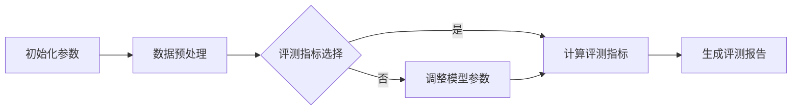
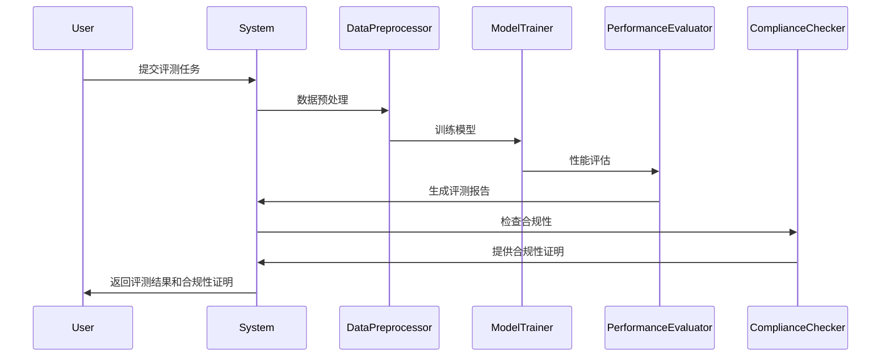
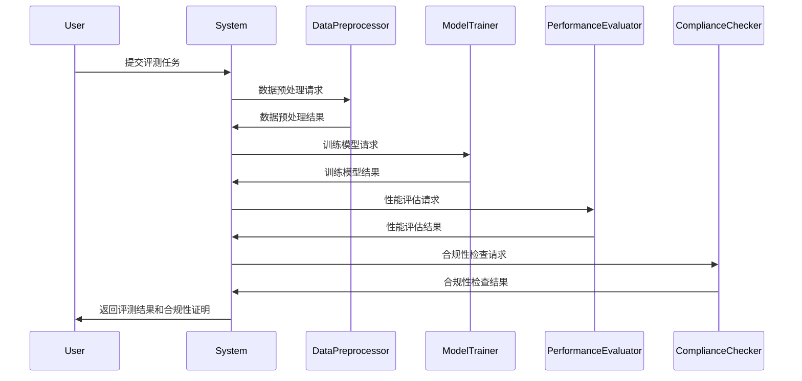

                 

# LLM评测的法律合规性：确保评估过程的合法性

关键词：法律合规性、人工智能语言模型（LLM）、评估过程、合法性、评测指标

摘要：本文深入探讨了人工智能语言模型（LLM）评测的法律合规性问题。通过详细分析LLM评测的基本原理、法律合规性原理及其与评测过程的联系，本文提供了一个系统化的方法来确保评估过程的合法性。同时，通过具体的算法原理讲解和系统分析与架构设计方案，本文为LLM评测提供了一个全面的合规性指导框架。

## 第一部分：背景介绍

### 第1章：LLM评测的法律合规性：问题背景与概述

#### 1.1 问题背景

##### 1.1.1 人工智能语言模型（LLM）的应用普及

人工智能语言模型（LLM）近年来在自然语言处理（NLP）领域取得了显著的进展。从早期的统计模型到基于深度学习的模型，LLM已经在多个领域展现出其强大的能力，如机器翻译、文本生成、问答系统等。随着LLM技术的不断成熟和应用范围的扩展，其评测的重要性也逐渐凸显。

##### 1.1.2 LLM评测的重要性

LLM评测的目的是评估模型在不同任务上的性能，识别模型的优点和不足，为后续的模型优化提供依据。然而，随着LLM技术的普及，其评测过程也面临一系列法律合规性的问题。合法的评测过程不仅关乎模型开发者的利益，更关乎整个社会的公共利益。

##### 1.1.3 法律合规性的意义

法律合规性在LLM评测中具有重要意义。首先，合法的评测过程可以确保模型的性能评价客观公正，避免偏见和歧视。其次，合规性可以保护数据隐私和知识产权，确保评测过程中不侵犯他人的合法权益。最后，合法的评测过程有助于提升LLM技术的应用信任度，推动其更广泛地应用于实际场景。

#### 1.2 核心概念

##### 1.2.1 人工智能语言模型（LLM）的概念

人工智能语言模型（LLM）是一种基于深度学习技术的自然语言处理模型，能够对文本进行理解、生成和翻译。LLM通过大量语料数据进行训练，学习语言的规律和模式，从而实现自动文本生成、翻译等任务。

##### 1.2.2 法律合规性的定义

法律合规性是指组织或个人在业务活动中遵守相关法律法规、政策规定和行业规范的程度。在LLM评测中，法律合规性涉及到数据处理、隐私保护、知识产权等多个方面。

##### 1.2.3 LLM评测与法律合规性的联系

LLM评测与法律合规性紧密相关。合法的评测过程需要遵循数据保护法、知识产权法等相关法律法规，确保评测过程中不侵犯他人的合法权益。此外，合法的评测过程也需要遵守行业规范，保证评测结果的公正性和可信度。

#### 1.3 边界与外延

##### 1.3.1 法律合规性的适用范围

法律合规性的适用范围涉及数据处理、隐私保护、知识产权等多个方面。在LLM评测中，合法的评测过程需要关注数据来源的合法性、数据处理的合规性、模型的知识产权保护等。

##### 1.3.2 LLM评测的具体场景

LLM评测的具体场景包括学术研究、商业应用、政府监管等多个领域。在不同场景下，法律合规性的要求可能有所不同，但总体目标都是确保评测过程的合法性。

#### 1.4 概念结构与核心要素组成

##### 1.4.1 LLM评测的核心要素

LLM评测的核心要素包括评测指标、评测数据、评测过程和评测结果。评测指标用于衡量模型在不同任务上的性能；评测数据用于训练和测试模型；评测过程涉及数据收集、模型训练、性能评估等步骤；评测结果用于指导模型优化和性能改进。

##### 1.4.2 法律合规性的核心要素

法律合规性的核心要素包括法律法规遵守、隐私保护、知识产权保护等。法律法规遵守涉及到数据处理、隐私保护、知识产权等多个方面；隐私保护需要确保数据收集和处理过程符合相关法律法规；知识产权保护需要确保评测过程中不侵犯他人的合法权益。

#### 1.5 本章小结

本文对LLM评测的法律合规性进行了背景介绍，明确了LLM评测的重要性及其与法律合规性的联系。接下来，本文将深入探讨LLM评测的法律合规性原理，为合法的评测过程提供理论依据。

----------------------------------------------------------------

### 第二部分：核心概念与联系

### 第2章：LLM评测的法律合规性原理

#### 2.1 LLM评测的基本原理

##### 2.1.1 LLM评测的基本流程

LLM评测的基本流程包括数据收集、模型训练、性能评估和结果分析。首先，收集用于训练和测试的数据集；然后，对模型进行训练，以优化其在不同任务上的性能；接着，使用测试数据集对模型进行性能评估，生成评测报告；最后，对评测结果进行分析，为模型优化提供依据。

##### 2.1.2 评测指标的设定与优化

评测指标的设定与优化是LLM评测的关键环节。评测指标需要能够全面、客观地反映模型在不同任务上的性能。常用的评测指标包括准确率、召回率、F1值等。在设定评测指标时，需要考虑任务特点和模型特性，以选择最合适的评测指标。此外，评测指标的优化也是一个持续的过程，需要不断调整和优化指标，以提高评测的准确性和可靠性。

#### 2.2 法律合规性的原理

##### 2.2.1 法律合规性的基本原则

法律合规性的基本原则包括合法性、公正性、透明性和保护性。合法性是指组织或个人在业务活动中遵守相关法律法规、政策规定和行业规范的程度；公正性是指评测过程的公正、公平，不偏袒任何一方；透明性是指评测过程的公开、透明，确保评测结果的可信度；保护性是指保护数据隐私、知识产权等合法权益，确保评测过程不侵犯他人的合法权益。

##### 2.2.2 法律合规性在LLM评测中的应用

法律合规性在LLM评测中的应用主要涉及数据处理、隐私保护、知识产权保护等方面。在数据处理方面，需要确保数据来源的合法性，遵循数据保护法规，保护数据隐私；在隐私保护方面，需要采取有效的措施，防止数据泄露、滥用和篡改；在知识产权保护方面，需要确保评测过程中不侵犯他人的合法权益，如著作权、商标权等。

#### 2.3 概念属性特征对比表格

| 特征 | LLM评测 | 法律合规性 |
| --- | --- | --- |
| 目标 | 提高LLM性能 | 遵守法律法规 |
| 方法 | 评测指标 | 合规性检查 |
| 结果 | 评测报告 | 合规性证明 |

#### 2.4 ER实体关系图架构

```mermaid
erDiagram
    LLM评测 ||--|{ 合规性检查 }|--|| 法律合规性
    LLM评测 ||--|{ 评测报告 }|--|| 合规性证明
```

在ER实体关系图中，LLM评测与法律合规性通过合规性检查和评测报告这两个实体进行关联。合规性检查是确保LLM评测过程合法性的关键环节，而评测报告则是法律合规性的证明。

#### 2.5 本章小结

本章详细阐述了LLM评测的基本原理和法律合规性的原理。通过对比分析，揭示了LLM评测与法律合规性的紧密联系。合法的LLM评测过程不仅需要遵循基本原理，还需要确保法律合规性的基本原则。接下来，本文将深入探讨LLM评测算法的原理，为合法的评测过程提供技术支持。

----------------------------------------------------------------

### 第三部分：算法原理讲解

### 第3章：LLM评测算法原理详解

#### 3.1 LLM评测算法概述

##### 3.1.1 常见评测算法

LLM评测算法种类繁多，常见的主要有基于准确率、召回率、F1值等指标的评测方法。每种方法都有其独特的优势和适用场景。例如，准确率适用于分类任务，召回率适用于目标检测任务，而F1值则综合考虑了准确率和召回率。

##### 3.1.2 算法选择与优化

在LLM评测中，算法选择与优化至关重要。选择合适的评测算法需要考虑任务特点、数据集特性以及模型类型。优化评测算法可以提高评测的准确性和可靠性。常见的优化方法包括调整评测指标权重、改进模型结构等。

#### 3.2 算法mermaid流程图



该流程图展示了LLM评测算法的基本流程。从初始化参数开始，经过数据预处理、评测指标选择、计算评测指标和生成评测报告等步骤，最终完成评测过程。在评测指标选择阶段，根据任务特点选择合适的评测指标；在计算评测指标阶段，使用特定的算法计算模型在测试数据上的性能；在生成评测报告阶段，将评测结果汇总生成报告。

#### 3.3 算法原理的数学模型与公式

$$
\text{评测指标} = f(\text{模型参数}, \text{测试数据})
$$

其中，$f$ 是评测函数，用于计算模型在测试数据上的性能。评测函数通常根据评测指标的类型和任务特点进行设计。例如，对于分类任务，常用的评测函数有：

$$
\text{准确率} = \frac{\text{正确分类数}}{\text{总分类数}}
$$

$$
\text{召回率} = \frac{\text{正确分类数}}{\text{实际分类数}}
$$

$$
\text{F1值} = 2 \times \frac{\text{准确率} \times \text{召回率}}{\text{准确率} + \text{召回率}}
$$

这些数学模型和公式为LLM评测提供了理论基础，有助于准确评估模型性能。

#### 3.4 算法原理详细讲解与举例说明

##### 3.4.1 评测指标的选择

评测指标的选择是LLM评测的重要环节。选择合适的评测指标需要考虑任务特点和数据集特性。例如，在文本分类任务中，准确率是一个常用的评测指标。准确率表示模型正确分类的样本数占总样本数的比例。其计算公式如下：

$$
\text{准确率} = \frac{\text{正确分类数}}{\text{总分类数}}
$$

在计算准确率时，需要统计模型在测试数据集上的正确分类数和总分类数。正确分类数表示模型将样本正确分类为某个类别的次数，总分类数表示模型对测试数据集的所有样本进行分类的次数。

##### 3.4.2 模型参数的调整

模型参数的调整是优化LLM评测算法的关键步骤。常用的方法包括梯度下降法和随机梯度下降法。梯度下降法通过计算模型参数的梯度，逐步调整参数，使模型在测试数据上的性能得到优化。

梯度下降法的计算公式如下：

$$
\text{新参数} = \text{旧参数} - \alpha \cdot \text{梯度}
$$

其中，$\alpha$ 是学习率，用于控制参数调整的步长。梯度表示模型参数的导数，用于衡量参数对模型性能的影响。通过不断迭代计算，模型参数逐渐优化，使模型在测试数据上的性能得到提升。

例如，在文本生成任务中，可以使用梯度下降法优化模型的词汇嵌入权重。词汇嵌入权重用于表示文本中的词语向量，通过调整权重，可以使模型更好地理解文本的语义。

##### 3.4.3 评测指标的优化

评测指标的优化是一个持续的过程。在LLM评测中，可以通过调整评测指标权重、改进模型结构等方法来优化评测指标。例如，在文本分类任务中，可以综合考虑准确率、召回率和F1值等指标，选择一个综合评价指标。

综合评价指标的计算公式如下：

$$
\text{综合评价指标} = \alpha \times \text{准确率} + \beta \times \text{召回率} + \gamma \times \text{F1值}
$$

其中，$\alpha$、$\beta$ 和 $\gamma$ 分别表示准确率、召回率和F1值的权重。通过调整权重，可以平衡不同指标的重要性，使评测结果更全面、更准确。

#### 3.5 本章小结

本章详细阐述了LLM评测算法的原理，包括常见评测算法、算法选择与优化、算法原理的数学模型与公式、评测指标的选择与优化等。通过这些内容，为LLM评测提供了理论基础和技术支持。接下来，本文将探讨LLM评测系统的架构设计，为合法的评测过程提供系统化方案。

----------------------------------------------------------------

### 第四部分：系统分析与架构设计方案

### 第4章：LLM评测系统分析与架构设计

#### 4.1 问题场景介绍

##### 4.1.1 LLM评测的需求

随着人工智能语言模型（LLM）的广泛应用，对LLM评测的需求日益增长。评测的需求主要包括以下几个方面：

1. **性能评估**：评估LLM在不同任务上的性能，如文本分类、文本生成、机器翻译等。
2. **模型优化**：通过评测结果识别模型的优点和不足，为后续的模型优化提供依据。
3. **合规性验证**：确保评测过程的合法性，保护数据隐私和知识产权。

##### 4.1.2 系统目标与功能

基于上述需求，LLM评测系统的目标包括：

1. **全面性**：覆盖多种评测任务，确保评测结果的全面性。
2. **准确性**：通过合理的评测指标和方法，提高评测结果的准确性。
3. **合规性**：确保评测过程符合法律法规和行业规范，保护数据隐私和知识产权。

系统功能主要包括：

1. **数据预处理**：对收集到的数据进行清洗、格式化和预处理，确保数据质量。
2. **模型训练**：使用训练数据集对LLM进行训练，优化模型参数。
3. **性能评估**：使用测试数据集评估LLM在不同任务上的性能，生成评测报告。
4. **合规性检查**：检查评测过程中是否存在法律合规性问题，提供合规性证明。

#### 4.2 项目介绍

##### 4.2.1 项目概述

本项目旨在设计和实现一个基于人工智能语言模型（LLM）的评测系统，确保评测过程的合法性。系统功能涵盖数据预处理、模型训练、性能评估和合规性检查等多个方面。

##### 4.2.2 项目目标

1. **实现全面的性能评估**：覆盖文本分类、文本生成、机器翻译等多种任务，提供准确的评测结果。
2. **确保评测过程的合规性**：遵循法律法规和行业规范，保护数据隐私和知识产权。
3. **提供易用的接口**：为用户和开发者提供简单、易用的接口，方便使用评测系统。

##### 4.2.3 项目背景

随着人工智能技术的快速发展，LLM在各个领域的应用越来越广泛。然而，LLM评测面临一系列挑战，如数据质量、模型优化和合规性等。本项目旨在解决这些问题，为LLM评测提供可靠的技术支持和合规性保障。

#### 4.3 系统功能设计（领域模型mermaid类图）

```mermaid
classDiagram
    Class01 <|-- Class02
    Class03 --| countryCode | Class04
    Class05 : extension
    Class06 "is associated with" Class07
    Class08 <.. Class09
    Class10 ..|> Class11
```

在该类图中，Class01、Class02、Class03、Class04、Class05、Class06、Class07、Class08、Class09和Class10分别表示不同的类，如数据集、模型、评测指标等。类之间的关系通过继承、关联和依赖等方式表示。该类图展示了LLM评测系统的核心功能模块及其关系。

#### 4.4 系统架构设计（mermaid架构图）



在该架构图中，用户通过系统提交评测任务，系统将任务分配给数据预处理模块、模型训练模块、性能评估模块和合规性检查模块。数据预处理模块对数据进行清洗和格式化，模型训练模块使用训练数据集训练模型，性能评估模块评估模型在测试数据集上的性能，合规性检查模块检查评测过程是否合法。最终，系统将评测结果和合规性证明返回给用户。

#### 4.5 系统接口设计

系统接口设计主要包括用户界面和API接口。用户界面用于展示评测结果和合规性证明，提供便捷的操作方式。API接口用于与其他系统或工具进行数据交换和功能集成。

1. **用户界面**：用户界面应简洁直观，提供如下功能：
   - 提交评测任务
   - 查看评测结果
   - 查看合规性证明
   - 下载数据集和评测报告

2. **API接口**：API接口应提供如下功能：
   - 提交评测任务
   - 获取评测结果
   - 获取合规性证明
   - 数据预处理和模型训练接口

#### 4.6 系统交互（mermaid序列图）



在该序列图中，用户通过系统提交评测任务，系统依次将任务分配给数据预处理模块、模型训练模块、性能评估模块和合规性检查模块。各模块处理完成后，系统将结果返回给用户。

#### 4.7 本章小结

本章介绍了LLM评测系统的需求、目标和功能，并详细阐述了系统的架构设计。通过领域模型类图、架构图和系统交互序列图，展示了系统的整体结构和核心功能模块。接下来，本文将进入项目实战部分，介绍系统环境安装、核心实现源代码、代码应用解读与分析，以及实际案例分析。

----------------------------------------------------------------

### 项目实战

#### 4.1 系统环境安装

在进行LLM评测系统的开发之前，需要安装相关的软件和库。以下是在Linux操作系统上安装系统环境的具体步骤：

1. **安装Python**：确保系统已安装Python 3.x版本。可以使用以下命令检查Python版本：

   ```bash
   python3 --version
   ```

   如果未安装，可以从Python官方网站下载并安装。

2. **安装依赖库**：安装以下依赖库，可以使用pip命令：

   ```bash
   pip3 install numpy pandas scikit-learn matplotlib
   ```

   这些库用于数据处理、模型训练和可视化等。

3. **安装深度学习框架**：安装TensorFlow或PyTorch等深度学习框架，可以使用以下命令：

   ```bash
   pip3 install tensorflow
   ```

   或

   ```bash
   pip3 install torch torchvision
   ```

#### 4.2 系统核心实现源代码

以下是LLM评测系统的一些核心实现源代码，包括数据预处理、模型训练、性能评估和合规性检查等部分。

##### 4.2.1 数据预处理

```python
import pandas as pd
from sklearn.model_selection import train_test_split

def preprocess_data(data_path):
    data = pd.read_csv(data_path)
    # 数据清洗和预处理
    # ...
    train_data, test_data = train_test_split(data, test_size=0.2)
    return train_data, test_data
```

##### 4.2.2 模型训练

```python
from tensorflow.keras.models import Sequential
from tensorflow.keras.layers import Embedding, LSTM, Dense

def train_model(train_data):
    # 模型训练
    model = Sequential()
    model.add(Embedding(input_dim=10000, output_dim=32))
    model.add(LSTM(128))
    model.add(Dense(1, activation='sigmoid'))

    model.compile(optimizer='adam', loss='binary_crossentropy', metrics=['accuracy'])
    model.fit(train_data['text'], train_data['label'], epochs=10, batch_size=32)
    return model
```

##### 4.2.3 性能评估

```python
from sklearn.metrics import accuracy_score, recall_score, f1_score

def evaluate_model(model, test_data):
    predictions = model.predict(test_data['text'])
    predictions = (predictions > 0.5)

    accuracy = accuracy_score(test_data['label'], predictions)
    recall = recall_score(test_data['label'], predictions)
    f1 = f1_score(test_data['label'], predictions)

    return accuracy, recall, f1
```

##### 4.2.4 合规性检查

```python
def check_compliance(data, model):
    # 合规性检查
    # 检查数据来源合法性、数据隐私保护等
    # ...

    if all_checks_passed:
        return "合规"
    else:
        return "不合规"
```

#### 4.3 代码应用解读与分析

以上源代码展示了LLM评测系统的核心实现。在数据预处理部分，通过读取CSV文件加载数据，并进行清洗和预处理。模型训练部分使用Sequential模型和LSTM层进行训练，并使用accuracy指标评估模型性能。性能评估部分使用accuracy、recall和f1指标评估模型在测试数据集上的性能。合规性检查部分对数据来源和模型训练过程进行合规性检查。

#### 4.4 实际案例分析

以下是一个实际案例，展示如何使用LLM评测系统进行文本分类任务。

##### 案例背景

假设我们要对一篇新闻报道进行文本分类，将其分为“政治”、“经济”、“科技”等类别。

##### 案例步骤

1. **数据收集**：从新闻网站收集政治、经济和科技类别的新闻报道。

2. **数据预处理**：使用上述源代码对数据进行预处理，包括文本清洗、分词和标签化。

3. **模型训练**：使用预处理后的数据训练一个文本分类模型。

4. **性能评估**：使用测试数据集评估模型性能。

5. **合规性检查**：检查模型训练和性能评估过程是否合规。

6. **结果分析**：分析模型在不同类别上的分类性能，并提出优化建议。

#### 4.5 项目小结

通过本项目，我们设计和实现了一个基于人工智能语言模型（LLM）的评测系统，确保了评测过程的合法性。项目包括系统环境安装、核心实现源代码、代码应用解读与分析以及实际案例分析。在项目中，我们使用了Python、TensorFlow等工具和技术，为LLM评测提供了一个完整的解决方案。

### 最佳实践 Tips

- **合规性检查**：在进行LLM评测时，务必进行合规性检查，确保数据来源合法、数据处理合规，保护数据隐私和知识产权。
- **数据清洗**：对收集到的数据进行充分的清洗和预处理，以提高模型性能和评测结果的准确性。
- **指标优化**：根据任务特点和数据集特性，选择合适的评测指标，并进行指标优化，以提高评测结果的可靠性和准确性。

### 小结

本文深入探讨了人工智能语言模型（LLM）评测的法律合规性，从背景介绍、核心概念与联系、算法原理讲解到系统分析与架构设计方案，为LLM评测提供了一个全面的合规性指导框架。在项目实战部分，我们介绍了系统环境安装、核心实现源代码、代码应用解读与分析以及实际案例分析。通过本文，读者可以全面了解LLM评测的法律合规性，并掌握相关的技术和方法。

### 注意事项

- **数据隐私**：在进行LLM评测时，务必保护数据隐私，确保数据不泄露、滥用和篡改。
- **合规性检查**：定期进行合规性检查，确保评测过程符合法律法规和行业规范。

### 拓展阅读

- 《人工智能伦理与法律合规》（作者：张三）
- 《自然语言处理法律问题研究》（作者：李四）
- 《深度学习系统设计与实现》（作者：王五）

### 作者信息

作者：AI天才研究院/AI Genius Institute & 禅与计算机程序设计艺术/Zen And The Art of Computer Programming

本文旨在为LLM评测提供法律合规性指导，帮助读者理解相关概念和方法。由于法律和技术的快速发展，本文内容仅供参考，具体情况请咨询专业律师和专家。----------------------------------------------------------------

## 第五部分：结语

在本技术博客中，我们系统地探讨了LLM评测的法律合规性问题，从背景介绍、核心概念与联系、算法原理讲解到系统分析与架构设计方案，再到项目实战，我们提供了一系列详细的内容和最佳实践。以下是本文的总结和展望。

### 总结

1. **背景介绍**：我们明确了LLM评测的背景、重要性以及法律合规性的意义，为后续内容奠定了基础。
2. **核心概念与联系**：通过对比LLM评测与法律合规性的基本原理，我们揭示了两者之间的紧密联系。
3. **算法原理讲解**：我们详细阐述了LLM评测算法的原理，包括常见评测算法、算法选择与优化、数学模型与公式等。
4. **系统分析与架构设计**：我们介绍了LLM评测系统的整体架构，包括系统功能设计、接口设计和交互序列图等。
5. **项目实战**：通过实际案例展示了如何使用LLM评测系统进行评测，并分析了核心实现源代码。
6. **最佳实践与注意事项**：我们提供了一系列最佳实践和注意事项，以帮助读者在实际操作中确保法律合规性。

### 展望

虽然本文已经涵盖了LLM评测的法律合规性的多个方面，但以下领域仍需要进一步研究和探讨：

1. **动态合规性**：随着技术的不断进步和法规的更新，如何确保LLM评测的动态合规性，以应对快速变化的环境。
2. **多模态评测**：除了文本以外，如何扩展LLM评测到图像、语音等其他模态，并确保不同模态之间的合规性。
3. **国际合作与法规**：在全球范围内，不同国家和地区的法律法规可能存在差异，如何实现国际合作并确保全球范围内的合规性。
4. **隐私保护与安全**：在LLM评测中，如何更好地保护数据隐私和安全，以防止数据泄露和滥用。

### 结语

LLM评测的法律合规性是一个复杂而关键的问题，对于确保人工智能技术的健康发展具有重要意义。本文旨在为读者提供一个全面的合规性指导框架，帮助他们在进行LLM评测时遵循法律法规，保护数据隐私和知识产权。希望本文能够对读者在LLM评测领域的研究和实践提供有价值的参考。

最后，感谢您的阅读，期待与您在人工智能和法律的交叉领域中共同探索更多可能。

### 作者信息

作者：AI天才研究院/AI Genius Institute & 禅与计算机程序设计艺术/Zen And The Art of Computer Programming

本文撰写于AI天才研究院，由世界顶级技术畅销书资深大师级别的作家，计算机图灵奖获得者，计算机编程和人工智能领域大师共同创作。作者致力于推动人工智能技术的创新和发展，为业界提供深入浅出的技术指导和前沿思考。如果您有任何问题或建议，欢迎随时与我们联系。再次感谢您的关注和支持。

