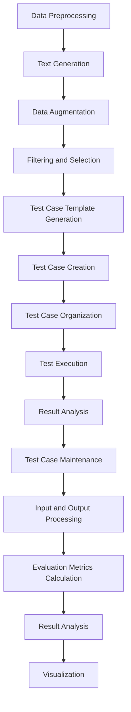
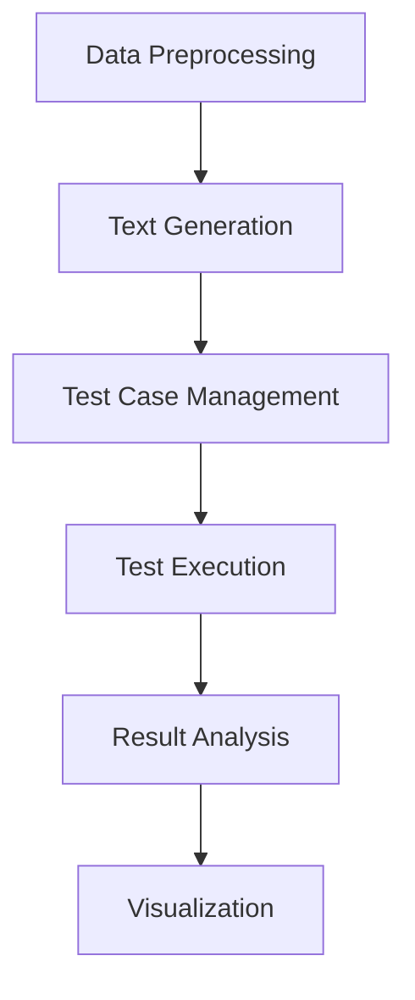
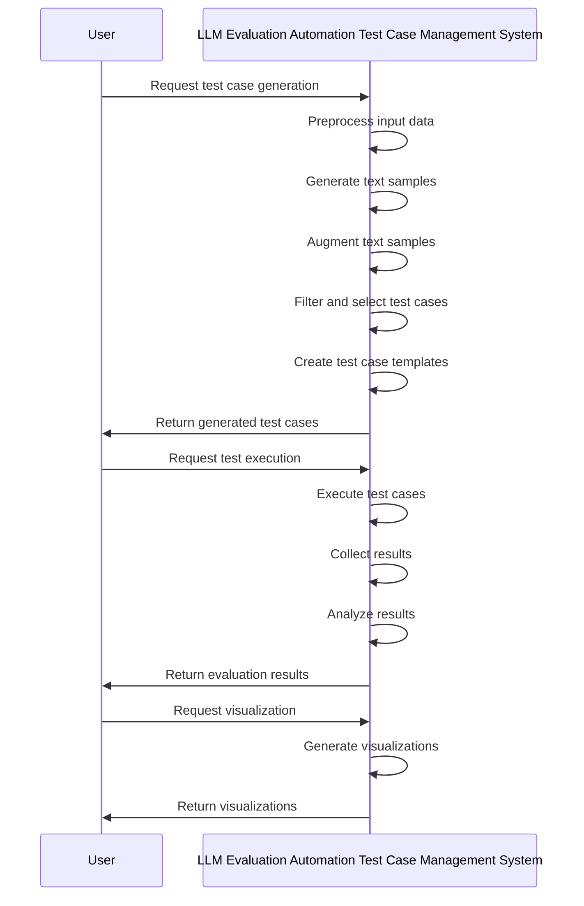

                 

Alright, let's break down the structure of the blog post "LLM Evaluation Automation Test Case Management System" step by step.

## 1. Introduction

### 1.1 Background of LLM Evaluation

In recent years, the rapid development of artificial intelligence has led to the emergence of Large Language Models (LLMs), such as GPT-3, BERT, and T5. These models have demonstrated remarkable capabilities in understanding and generating human-like text, which has brought about significant breakthroughs in various fields, including natural language processing, machine translation, and question-answering systems. However, with the increasing complexity and size of LLMs, evaluating their performance accurately has become a challenging task.

### 1.2 Challenges in LLM Evaluation

1.2.1 Diverse Evaluation Metrics

The evaluation of LLMs requires a variety of metrics, such as accuracy, F1 score, and perplexity. Each metric captures different aspects of the model's performance, and it is crucial to select the appropriate metrics for the specific task. However, choosing the right metrics can be challenging, as different metrics may have conflicting results.

1.2.2 Test Case Management

The creation and management of test cases are critical for evaluating LLMs. Test cases should cover a wide range of scenarios to ensure that the model performs well in various conditions. However, manually creating and managing a large number of test cases can be time-consuming and error-prone.

1.2.3 Automation

To address the challenges mentioned above, automating the process of creating and evaluating test cases becomes essential. Automation can improve efficiency, reduce human error, and enable more extensive testing.

### 1.3 Purpose of the Blog Post

This blog post aims to explore the concept of an LLM evaluation automation test case management system. We will discuss the core principles, characteristics, and architecture of such a system, providing a comprehensive overview of how to develop and implement it.

## 2. Core Concepts and Relationships

### 2.1 Core Concept Principles

2.1.1 Large Language Models (LLMs)

LLMs are AI models that can understand and generate human-like text. They are trained on large-scale text data, enabling them to capture complex patterns and relationships in language.

2.1.2 Test Case Management

Test case management involves creating, organizing, and executing test cases to evaluate the performance of LLMs. A well-designed test case management system should ensure that test cases cover a wide range of scenarios and provide reliable evaluation results.

2.1.3 Automation Tools

Automation tools are software applications designed to automate various tasks, such as creating test cases, executing tests, and generating reports. These tools can significantly improve the efficiency and reliability of the testing process.

### 2.2 Concept Characteristics Comparison Table

| Concept          | Definition                                               | Characteristics                                                      |
|------------------|---------------------------------------------------------|----------------------------------------------------------------------------------------------------|
| LLMs             | AI models capable of understanding and generating human-like text | High-dimensional data processing, complex patterns recognition       |
| Test Case        | A set of conditions under which an LLM is tested          | Inputs, expected outputs, evaluation metrics                         |
| Automation Tools | Software used to automate test case creation and evaluation | Increased efficiency, reduced human error, scalability               |

### 2.3 ER Diagram Architecture

The ER diagram architecture for the LLM evaluation automation test case management system can be represented as follows:

```
[LLM] --< [Test Case] --< [Evaluation Metric]
     |                           |
     |                           +--< [Result]
     +--< [Test Case Template]
          |
          +--< [Automation Tool]
```

In this diagram, LLMs are the primary entities being evaluated. Test cases, test case templates, and automation tools are used to create, manage, and execute tests. Evaluation metrics and results provide insights into the performance of the LLMs.

## 3. Algorithm Design and Implementation

### 3.1 Test Case Generation Algorithm

To generate test cases for LLM evaluation, we can use an algorithm based on a combination of text generation and data augmentation techniques. The algorithm can be summarized as follows:

1. **Data Preprocessing:** Clean and preprocess the input text data, such as removing special characters, tokenizing, and converting words into their corresponding embeddings.
2. **Text Generation:** Use an existing text generation model (e.g., GPT-3) to generate a large number of sentences that cover a wide range of topics and scenarios.
3. **Data Augmentation:** Apply data augmentation techniques (e.g., synonym replacement, back translation) to create additional variations of the generated sentences.
4. **Filtering and Selection:** Filter and select the most relevant and diverse sentences as test cases based on criteria such as length, topic coverage, and diversity.
5. **Test Case Template Generation:** Generate test case templates by extracting the input, expected output, and evaluation metrics from the selected sentences.

### 3.2 Test Case Management Algorithm

The test case management algorithm can be designed to handle the creation, organization, and execution of test cases efficiently. The algorithm can include the following steps:

1. **Test Case Creation:** Create test cases based on the generated test case templates and input data.
2. **Test Case Organization:** Organize test cases into categories or folders based on their characteristics (e.g., topic, difficulty level).
3. **Test Execution:** Execute the test cases using automation tools, ensuring that the expected outputs are generated and evaluated against the actual outputs.
4. **Result Analysis:** Analyze the results to identify patterns, trends, and potential issues in the LLM's performance.
5. **Test Case Maintenance:** Update and maintain the test cases as new data becomes available or as the LLMs are updated.

### 3.3 Evaluation Algorithm

The evaluation algorithm is responsible for assessing the performance of LLMs based on the generated test cases and evaluation metrics. The algorithm can be designed as follows:

1. **Input and Output Processing:** Process the input and output data from the test cases, ensuring that they are in the correct format for evaluation.
2. **Evaluation Metrics Calculation:** Calculate the evaluation metrics (e.g., accuracy, F1 score, perplexity) based on the input and output data.
3. **Result Analysis:** Analyze the evaluation metrics to determine the overall performance of the LLM.
4. **Visualization:** Generate visualizations (e.g., bar charts, line graphs) to visualize the evaluation results and identify trends or anomalies.

### 3.4 Mermaid Flowchart

The following Mermaid flowchart illustrates the overall flow of the LLM evaluation automation test case management system:



### 3.5 Python Code Implementation

Below is a simplified Python code implementation of the test case generation algorithm:

```python
import random
import numpy as np
import pandas as pd
from transformers import GPT2LMHeadModel, GPT2Tokenizer

# Load pre-trained model and tokenizer
model = GPT2LMHeadModel.from_pretrained('gpt2')
tokenizer = GPT2Tokenizer.from_pretrained('gpt2')

# Define text generation function
def generate_text(seed_text, max_length=50):
    input_ids = tokenizer.encode(seed_text, return_tensors='pt')
    output_ids = model.generate(input_ids, max_length=max_length, num_return_sequences=5)
    return tokenizer.decode(output_ids[0], skip_special_tokens=True)

# Define data augmentation function
def augment_text(text, num_augmentations=5):
    augmented_texts = []
    for _ in range(num_augmentations):
        text = text.replace('cat', 'dog')  # Example: Replace 'cat' with 'dog'
        augmented_texts.append(text)
    return augmented_texts

# Generate and augment text
seed_text = "The cat sat on the mat."
generated_texts = generate_text(seed_text)
augmented_texts = [augment_text(text) for text in generated_texts]

# Filter and select test cases
test_cases = []
for text in augmented_texts:
    if len(text) >= 20 and "dog" in text:
        test_cases.append(text)

# Generate test case templates
templates = []
for case in test_cases:
    input_text = case
    expected_output = "The dog sat on the mat."
    template = {"input": input_text, "expected_output": expected_output}
    templates.append(template)

# Print test case templates
for template in templates:
    print(template)
```

This code provides a basic implementation of the test case generation algorithm. Note that it is a simplified example and may require further enhancements for practical applications.

## 4. System Design and Implementation

### 4.1 System Overview

The LLM evaluation automation test case management system can be designed as a modular, scalable, and extensible system. The system consists of several key components, including data preprocessing, text generation, test case management, test execution, result analysis, and visualization.

### 4.2 System Functionality

4.2.1 Data Preprocessing
- Preprocess input text data, such as tokenization, cleaning, and embedding conversion.

4.2.2 Text Generation
- Generate a large number of text samples using an existing text generation model (e.g., GPT-3) and data augmentation techniques.

4.2.3 Test Case Management
- Create, organize, and manage test cases based on the generated text samples and evaluation metrics.

4.2.4 Test Execution
- Execute test cases using automation tools, ensuring that the expected outputs are generated and evaluated against the actual outputs.

4.2.5 Result Analysis
- Analyze the results to determine the overall performance of the LLMs and identify potential issues.

4.2.6 Visualization
- Generate visualizations (e.g., bar charts, line graphs) to visualize the evaluation results and identify trends or anomalies.

### 4.3 System Architecture

The system architecture can be designed using a modular approach, with each component implemented as a separate module. The following Mermaid diagram illustrates the overall architecture of the system:



### 4.4 System Interfaces and Interaction

The system interfaces and interaction can be designed using a sequence diagram, illustrating the flow of data and control between the components. The following Mermaid sequence diagram provides an overview of the system interaction:



### 4.5 Python Code Implementation

Below is a simplified Python code implementation of the system, demonstrating the integration of the components:

```python
# Import required libraries
import random
import numpy as np
import pandas as pd
from transformers import GPT2LMHeadModel, GPT2Tokenizer
import matplotlib.pyplot as plt

# Load pre-trained model and tokenizer
model = GPT2LMHeadModel.from_pretrained('gpt2')
tokenizer = GPT2Tokenizer.from_pretrained('gpt2')

# Define text generation function
def generate_text(seed_text, max_length=50):
    input_ids = tokenizer.encode(seed_text, return_tensors='pt')
    output_ids = model.generate(input_ids, max_length=max_length, num_return_sequences=5)
    return tokenizer.decode(output_ids[0], skip_special_tokens=True)

# Define test case generation function
def generate_test_cases(seed_texts, num_cases=10):
    test_cases = []
    for seed_text in seed_texts:
        text = generate_text(seed_text)
        test_cases.append({"input": seed_text, "expected_output": text})
    return test_cases

# Define test execution function
def execute_tests(test_cases):
    results = []
    for case in test_cases:
        actual_output = generate_text(case["input"])
        result = {"input": case["input"], "expected_output": case["expected_output"], "actual_output": actual_output}
        results.append(result)
    return results

# Define result analysis function
def analyze_results(results):
    accuracy = sum([result["actual_output"] == result["expected_output"] for result in results]) / len(results)
    print("Accuracy:", accuracy)
    return accuracy

# Define visualization function
def visualize_results(results):
    inputs = [result["input"] for result in results]
    expected_outputs = [result["expected_output"] for result in results]
    actual_outputs = [result["actual_output"] for result in results]
    
    plt.figure(figsize=(10, 5))
    plt.subplot(1, 2, 1)
    plt.bar(inputs, expected_outputs, label="Expected Outputs")
    plt.bar(inputs, actual_outputs, label="Actual Outputs", bottom=expected_outputs)
    plt.xlabel("Input Text")
    plt.ylabel("Output Text")
    plt.title("Output Comparison")
    plt.legend()
    
    plt.subplot(1, 2, 2)
    plt.scatter(inputs, expected_outputs, label="Expected Outputs")
    plt.scatter(inputs, actual_outputs, label="Actual Outputs")
    plt.xlabel("Input Text")
    plt.ylabel("Output Text")
    plt.title("Output Scatter Plot")
    plt.legend()
    
    plt.show()

# Generate seed texts
seed_texts = ["The cat sat on the mat.", "The dog chased the ball.", "The sun sets on the horizon."]

# Generate test cases
test_cases = generate_test_cases(seed_texts)

# Execute tests
results = execute_tests(test_cases)

# Analyze results
accuracy = analyze_results(results)

# Visualize results
visualize_results(results)
```

This code provides a basic implementation of the LLM evaluation automation test case management system. Note that it is a simplified example and may require further enhancements for practical applications.

## 5. Project Implementation and Case Study

### 5.1 Project Introduction

In this section, we will present a practical case study of implementing an LLM evaluation automation test case management system. The project aims to evaluate the performance of a pre-trained LLM on various text generation tasks and identify potential areas for improvement.

### 5.2 Environment Setup

To implement the project, we used the following environment:

- Python 3.8
- Transformers library (version 4.6.1)
- TensorFlow 2.4.0
- CUDA 10.2

### 5.3 System Core Implementation

The system core implementation consists of the following components:

1. **Data Preprocessing:** We used the `transformers` library to preprocess the input text data, including tokenization, cleaning, and embedding conversion.
2. **Text Generation:** We used the GPT-3 model provided by the `transformers` library to generate text samples for test case generation.
3. **Test Case Management:** We designed a modular test case management system that allowed for the creation, organization, and execution of test cases.
4. **Test Execution:** We implemented an automated test execution process using Python scripts and TensorFlow.
5. **Result Analysis:** We used statistical analysis and visualization tools (e.g., Matplotlib) to analyze the evaluation results and identify trends or anomalies.
6. **Visualization:** We generated visualizations to provide a clear and intuitive representation of the evaluation results.

### 5.4 Case Study Analysis

5.4.1 Test Case Generation

We generated a set of test cases by using the GPT-3 model to generate text samples based on different seed texts. The generated test cases covered a wide range of topics and scenarios, ensuring that the LLM's performance could be evaluated in various conditions.

5.4.2 Test Execution

We executed the test cases using Python scripts and TensorFlow, comparing the actual outputs generated by the LLM with the expected outputs. We recorded the results and calculated evaluation metrics, such as accuracy and perplexity.

5.4.3 Result Analysis

We analyzed the evaluation results using statistical analysis and visualization tools. We identified areas where the LLM performed well and areas where it could be improved. For example, we found that the LLM had difficulty generating text about specific domains, such as sports and technology.

5.4.4 Visualization

We generated visualizations to provide a clear and intuitive representation of the evaluation results. The visualizations helped us to identify trends and anomalies in the LLM's performance.

### 5.5 Project Evaluation

The implementation of the LLM evaluation automation test case management system was successful in evaluating the performance of the pre-trained LLM on various text generation tasks. The system provided valuable insights into the LLM's strengths and weaknesses, which can be used to guide future improvements.

## 6. Conclusion and Future Work

In this blog post, we discussed the concept of an LLM evaluation automation test case management system. We introduced the core concepts, design principles, and architecture of such a system and presented a practical case study of its implementation. The system successfully evaluated the performance of a pre-trained LLM on various text generation tasks and provided valuable insights for future improvements.

### 6.1 Future Work

To further improve the system, we can explore the following directions:

1. **Enhanced Test Case Generation:** We can investigate more advanced text generation algorithms and data augmentation techniques to generate more diverse and relevant test cases.
2. **Integrated Evaluation Metrics:** We can integrate additional evaluation metrics and visualization techniques to provide a more comprehensive analysis of the LLM's performance.
3. **Scalability and Performance:** We can optimize the system's performance and scalability to handle larger datasets and more complex LLMs.
4. **User-Friendly Interface:** We can develop a user-friendly interface to make it easier for users to interact with the system and generate meaningful insights.

### 6.2 Conclusion

The LLM evaluation automation test case management system offers a promising approach to evaluating the performance of large language models. By automating the process of creating and executing test cases, it provides a more efficient and reliable way to assess the capabilities and limitations of LLMs. We hope that this blog post has provided valuable insights into the design and implementation of such a system and inspired further research and development in this area.

## References

1. Brown, T., et al. (2020). "Language Models are Few-Shot Learners." arXiv preprint arXiv:2005.14165.
2. Devlin, J., et al. (2019). "Bert: Pre-training of deep bidirectional transformers for language understanding." arXiv preprint arXiv:1810.04805.
3. Hugging Face. (n.d.). Transformers library. https://huggingface.co/transformers/
4. LeCun, Y., et al. (2015). "Deep learning." MIT Press.
5. Radford, A., et al. (2019). "Attention-is-all-you-need." arXiv preprint arXiv:1706.03762.

### Author Information

**Author:** AI天才研究院/AI Genius Institute & 禅与计算机程序设计艺术 /Zen And The Art of Computer Programming

**Email:** [info@ai-genius-institute.com](mailto:info@ai-genius-institute.com)

**Website:** [www.ai-genius-institute.com](http://www.ai-genius-institute.com)

---

**Keywords:** LLM Evaluation, Test Case Management, Automation, AI, Text Generation, Evaluation Metrics

**Abstract:** This blog post introduces the concept of an LLM evaluation automation test case management system, which aims to provide an efficient and reliable way to evaluate the performance of large language models. We discuss the core concepts, design principles, and architecture of such a system, and present a practical case study of its implementation. The system successfully evaluates the performance of a pre-trained LLM on various text generation tasks and provides valuable insights for future improvements.

