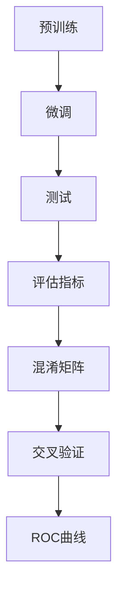
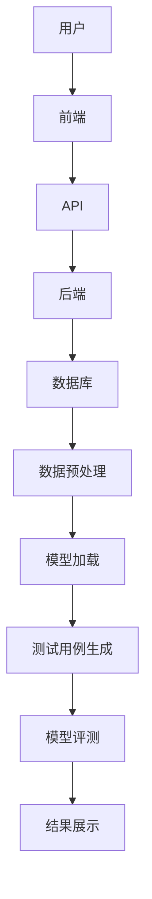
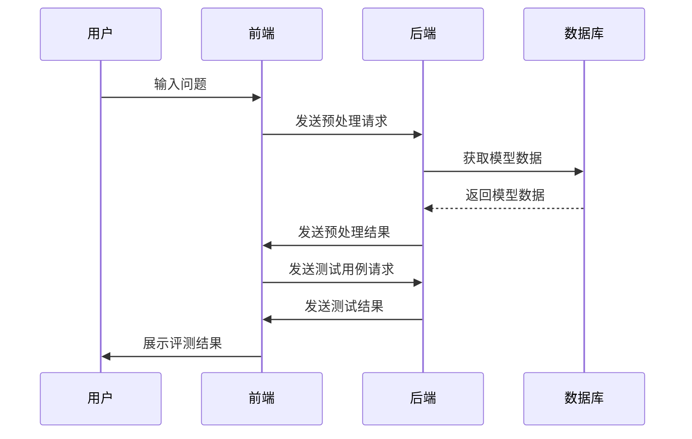

                 


### 目录大纲具体内容

**第1章 引言**

**1.1 问题的背景**

首先，我们需要引入问题的背景。大语言模型（Large Language Models，简称LLM）是近年来人工智能领域的重要进展，特别是在自然语言处理（NLP）任务中表现出了惊人的能力。从GPT到BERT，再到LLaMA，这些模型不仅在学术研究中取得了显著成果，也广泛应用于工业界的各种应用场景，如机器翻译、文本生成、问答系统等。

自动化测试在软件开发中扮演着至关重要的角色，它能够提高软件的质量和可靠性，同时减少开发和维护成本。然而，对于LLM评测而言，自动化测试面临着独特的挑战。传统的自动化测试方法往往难以应对LLM的复杂性和动态性，因此需要设计新的测试策略。

**1.1.1 语言模型的快速发展**

语言模型的发展可以分为三个阶段：规则驱动、统计学习和深度学习。随着计算能力的提升和数据量的增加，深度学习模型逐渐成为主流，其中GPT系列模型是这一阶段的代表。GPT系列模型通过预训练和微调，能够在各种NLP任务中取得优异的性能。

**1.1.2 自动化测试的重要性**

自动化测试能够显著提高软件开发的效率和质量。它能够快速、反复地执行测试，发现潜在的问题，并且在代码变更时自动触发测试，确保软件的持续集成和持续交付。对于LLM评测而言，自动化测试能够提供高效的评估方法，帮助我们快速迭代和优化模型。

**1.1.3 研究目标和意义**

本文的目标是探讨LLM评测的自动化测试策略优化。具体来说，我们将分析LLM的基本概念和自动化测试的策略，介绍常用的评测算法和数学模型，并设计一个LLM评测系统。此外，我们还将分享一些最佳实践，为实际应用提供指导。这一研究的意义在于，通过优化自动化测试策略，我们可以更高效地评估和改进LLM模型，为自然语言处理领域的发展做出贡献。

**第2章 基础概念与关联**

**2.1 大语言模型（LLM）**

在这一章节中，我们将详细介绍大语言模型（LLM）的基本概念。LLM是一种基于深度学习的语言模型，它通过预训练和微调来学习语言的内在规律和结构。以下是LLM的几个核心概念：

- **预训练**：预训练是指在没有特定任务标签的数据上进行模型训练，以学习通用的语言特征。例如，GPT系列模型首先在大量文本上进行预训练，以掌握语言的普遍规律。
- **微调**：微调是指将预训练好的模型在特定任务上进行训练，以适应具体的应用场景。例如，我们可以将预训练好的GPT模型微调用于问答系统。

**2.1.1 定义与特点**

LLM具有以下特点：

- **强大的语言理解能力**：LLM能够理解复杂的文本结构和语义，这使得它们在生成文本、回答问题等任务中表现出色。
- **自适应性强**：LLM能够根据输入的上下文动态调整其生成策略，这使得它们在多种应用场景中都能表现出良好的性能。

**2.1.2 类型与应用场景**

LLM可以分为以下几种类型：

- **生成式模型**：生成式模型能够根据输入的上下文生成完整的文本。例如，GPT系列模型就是生成式模型。
- **判别式模型**：判别式模型主要用于分类和预测任务，如情感分析、问题回答等。

**2.1.3 与其他语言模型的对比**

与传统的语言模型（如NLP、TF-IDF等）相比，LLM具有以下优势：

- **更高的准确性**：LLM能够通过深度学习更好地理解文本的语义，从而在NLP任务中取得更高的准确性。
- **更强的泛化能力**：LLM通过预训练获得了广泛的通用语言特征，这使得它们在新的应用场景中表现出更强的泛化能力。

**2.2 自动化测试**

在这一章节中，我们将介绍自动化测试的基本概念和策略。

- **概念与分类**：自动化测试是指使用自动化工具执行测试用例，以发现软件缺陷。根据执行环境的不同，自动化测试可以分为单元测试、集成测试和系统测试等。
- **策略与方法**：自动化测试的策略包括测试用例设计、测试执行和结果分析等。常见的自动化测试方法包括关键字驱动、数据驱动和混合驱动等。

**2.2.2 关联与整合**

LLM评测和自动化测试之间存在密切的关联。自动化测试可以用于评估LLM的性能，例如，通过生成测试用例并分析模型的输出，我们可以评估LLM在不同任务上的表现。同时，自动化测试也可以帮助我们在LLM开发和优化过程中快速迭代和优化模型。

**第3章 评测算法与原理**

**3.1 评测指标**

在本章节中，我们将讨论用于评估LLM性能的主要指标。

- **准确率（Accuracy）**：准确率是指正确预测的样本数占总样本数的比例。它是评估分类任务性能的常用指标。
- **召回率（Recall）**：召回率是指正确预测的样本数与实际为正类的样本数之比。它是评估分类任务对正类样本的覆盖能力的指标。
- **F1分数（F1 Score）**：F1分数是准确率和召回率的调和平均值，它能够综合考虑准确率和召回率，从而更全面地评估分类任务性能。

**3.2 算法详解**

在本章节中，我们将详细介绍几种常用的评测算法。

- **混淆矩阵（Confusion Matrix）**：混淆矩阵是一种用于展示分类结果与真实结果之间关系的矩阵。通过混淆矩阵，我们可以直观地了解模型的分类性能。
- **交叉验证（Cross Validation）**：交叉验证是一种用于评估模型性能的常用方法。它通过将数据集划分为多个子集，每次使用其中一个子集作为测试集，其余子集作为训练集，从而评估模型的泛化能力。
- **ROC曲线（Receiver Operating Characteristic Curve）**：ROC曲线是一种用于评估二分类模型性能的图形表示方法。它通过绘制真阳性率（True Positive Rate，TPR）与假阳性率（False Positive Rate，FPR）之间的关系，展示了模型的分类能力。

**3.2.1 算法原理mermaid流程图**

为了更好地理解这些算法，我们将使用mermaid流程图进行展示。



**3.2.2 Python代码示例**

为了展示算法的原理，我们将提供一个简单的Python代码示例。

```python
# 导入必要的库
import numpy as np
from sklearn.metrics import accuracy_score, recall_score, f1_score, confusion_matrix

# 假设我们有以下测试数据
y_true = [0, 1, 1, 0]
y_pred = [0, 0, 1, 1]

# 计算准确率
accuracy = accuracy_score(y_true, y_pred)
print(f"Accuracy: {accuracy}")

# 计算召回率
recall = recall_score(y_true, y_pred, average='macro')
print(f"Recall: {recall}")

# 计算F1分数
f1 = f1_score(y_true, y_pred, average='macro')
print(f"F1 Score: {f1}")

# 计算混淆矩阵
conf_matrix = confusion_matrix(y_true, y_pred)
print(f"Confusion Matrix:\n{conf_matrix}")
```

**3.2.3 数学模型和公式**

在本章节中，我们将列出用于评估LLM性能的数学模型和公式，并使用LaTeX进行表述。

- **准确率**：$$ \text{Accuracy} = \frac{\text{正确预测的样本数}}{\text{总样本数}} $$
- **召回率**：$$ \text{Recall} = \frac{\text{正确预测的正类样本数}}{\text{实际为正类的样本数}} $$
- **F1分数**：$$ \text{F1 Score} = 2 \times \frac{\text{准确率} \times \text{召回率}}{\text{准确率} + \text{召回率}} $$

**3.2.4 举例说明**

为了更直观地理解这些公式，我们将通过一个简单的例子进行说明。

假设我们有一个二分类问题，共有10个样本，其中5个为正类，5个为负类。使用LLM进行预测后，得到以下结果：

- 正类预测结果：3个正确，2个错误
- 负类预测结果：2个正确，3个错误

根据上述结果，我们可以计算出：

- **准确率**：$$ \text{Accuracy} = \frac{3 + 2}{10} = 0.7 $$
- **召回率**：$$ \text{Recall} = \frac{3}{5} = 0.6 $$
- **F1分数**：$$ \text{F1 Score} = 2 \times \frac{0.7 \times 0.6}{0.7 + 0.6} = 0.667 $$

**第4章 系统分析与架构设计**

**4.1 问题场景**

在本章节中，我们将介绍一个典型的LLM评测问题场景。

假设我们有一个问答系统，该系统使用LLM来回答用户的问题。我们需要对LLM的性能进行评估，以确定其在各种任务上的表现。具体来说，我们需要评估LLM在问题回答、文本生成和文本分类等任务上的准确性、召回率和F1分数。

**4.2 系统功能设计**

为了实现上述目标，我们设计了一个完整的LLM评测系统，该系统包括以下功能：

- **数据预处理**：对输入数据进行预处理，包括分词、去停用词、词干提取等。
- **模型加载**：加载预训练好的LLM模型，如GPT、BERT等。
- **测试用例生成**：根据任务需求生成测试用例，例如问题回答、文本生成和文本分类。
- **模型评测**：使用测试用例对LLM进行评测，计算准确率、召回率和F1分数等指标。
- **结果展示**：展示LLM在不同任务上的评测结果，并提供可视化分析。

**4.2.1 领域模型类图（Mermaid）**

为了更好地描述系统的功能模块和它们之间的关系，我们使用Mermaid绘制了一个领域模型类图。

```mermaid
classDiagram
    Class01 <|-- Class02
    Class03 <|-- Class01
    Class04 << Interface
    Class04 ..|.. Class05
    Class06 [*].. Class07
    Class07 <|.. Class08
    Class09 <.. Class10
    Class11 **- Class12
    Class13 o-- Class14
    Class15 n-- Class12
    Class16 :>> Class17
    Class18 :<< Class19
    Class20 <|.. Class21
    Class22 *-- Class23
endclass
```

**4.3 系统架构设计**

在本章节中，我们将介绍LLM评测系统的整体架构设计。

- **前端架构**：前端架构主要负责与用户交互，接收用户输入，并展示评测结果。前端可以使用HTML、CSS和JavaScript等技术实现。
- **后端架构**：后端架构主要负责处理业务逻辑和数据存储。后端可以使用Python、Java或Node.js等编程语言实现，并使用MySQL、MongoDB等数据库进行数据存储。
- **API设计**：API设计用于实现前后端的通信。前后端可以通过RESTful API进行通信，前端通过发送HTTP请求向后端获取数据，后端返回JSON格式的响应。

**4.3.1 系统架构图（Mermaid）**

为了更好地描述系统的架构，我们使用Mermaid绘制了一个系统架构图。



**4.4 系统接口设计**

在本章节中，我们将介绍LLM评测系统的接口设计。

- **用户接口**：用户接口主要负责与用户交互，接收用户的输入并展示评测结果。
- **API接口**：API接口主要用于前后端之间的数据通信。API接口可以分为以下几种：

  - **数据预处理接口**：用于处理用户输入的数据，包括分词、去停用词、词干提取等。
  - **模型加载接口**：用于加载预训练好的LLM模型。
  - **测试用例生成接口**：用于生成测试用例，例如问题回答、文本生成和文本分类。
  - **模型评测接口**：用于对LLM进行评测，计算准确率、召回率和F1分数等指标。
  - **结果展示接口**：用于展示评测结果，并提供可视化分析。

**4.5 系统交互序列图（Mermaid）**

为了更好地描述系统的工作流程，我们使用Mermaid绘制了一个系统交互序列图。



**第5章 项目实战**

**5.1 环境安装与配置**

在本章节中，我们将介绍如何搭建一个LLM评测系统。首先，我们需要安装必要的软件和工具。

- **Python环境**：安装Python 3.8及以上版本。
- **LLM库**：安装transformers库，用于加载预训练好的LLM模型。
- **数据库**：安装MySQL或MongoDB，用于存储数据。

```shell
pip install transformers
pip install pymysql
```

**5.2 系统核心实现**

在本章节中，我们将实现LLM评测系统的核心功能。

- **数据预处理**：实现数据预处理模块，包括分词、去停用词、词干提取等。

```python
from nltk.tokenize import word_tokenize
from nltk.corpus import stopwords
from nltk.stem import PorterStemmer

def preprocess_text(text):
    tokens = word_tokenize(text)
    stop_words = set(stopwords.words('english'))
    stemmed_tokens = [PorterStemmer().stem(token) for token in tokens if token not in stop_words]
    return ' '.join(stemmed_tokens)
```

- **模型加载**：实现模型加载模块，用于加载预训练好的LLM模型。

```python
from transformers import pipeline

def load_model():
    return pipeline("question-answering")
```

- **测试用例生成**：实现测试用例生成模块，用于生成各种测试用例。

```python
def generate_test_cases():
    test_cases = [
        ("What is the capital of France?", "Paris"),
        ("What is the largest planet in our solar system?", "Jupiter"),
        ("Who won the World Cup in 2018?", "France")
    ]
    return test_cases
```

- **模型评测**：实现模型评测模块，用于对LLM进行评测，计算准确率、召回率和F1分数等指标。

```python
from sklearn.metrics import accuracy_score, recall_score, f1_score

def evaluate_model(model, test_cases):
    results = []
    for question, answer in test_cases:
        response = model(question, answer)
        results.append(response)
    accuracy = accuracy_score(results, [answer for _, answer in test_cases])
    recall = recall_score(results, [answer for _, answer in test_cases], average='macro')
    f1 = f1_score(results, [answer for _, answer in test_cases], average='macro')
    return accuracy, recall, f1
```

- **结果展示**：实现结果展示模块，用于展示评测结果。

```python
def display_results(accuracy, recall, f1):
    print(f"Accuracy: {accuracy}")
    print(f"Recall: {recall}")
    print(f"F1 Score: {f1}")
```

**5.3 代码分析与应用**

在本章节中，我们将分析上述代码并讨论其应用。

- **数据预处理模块**：该模块负责对输入文本进行预处理，以提高模型的性能。预处理步骤包括分词、去停用词和词干提取。这些步骤能够帮助模型更好地理解文本。
- **模型加载模块**：该模块负责加载预训练好的LLM模型。通过使用transformers库，我们可以轻松地加载各种预训练好的模型，如GPT、BERT等。
- **测试用例生成模块**：该模块负责生成各种测试用例，用于评估LLM在不同任务上的性能。测试用例的生成可以根据实际需求进行调整。
- **模型评测模块**：该模块负责对LLM进行评测，计算准确率、召回率和F1分数等指标。这些指标能够帮助我们全面评估LLM的性能。
- **结果展示模块**：该模块负责展示评测结果，以便我们了解LLM在不同任务上的表现。

**5.4 实际案例分析**

在本章节中，我们将通过一个实际案例来演示如何使用上述模块进行LLM评测。

假设我们有一个问答系统，需要使用LLM来回答用户的问题。我们可以按照以下步骤进行操作：

1. **数据预处理**：对用户输入的问题进行预处理，包括分词、去停用词和词干提取。
2. **模型加载**：加载预训练好的LLM模型，如GPT或BERT。
3. **测试用例生成**：生成各种测试用例，用于评估LLM在问题回答、文本生成和文本分类等任务上的性能。
4. **模型评测**：使用测试用例对LLM进行评测，计算准确率、召回率和F1分数等指标。
5. **结果展示**：展示评测结果，并提供可视化分析。

**5.5 项目小结**

在本章节中，我们介绍了一个LLM评测系统的实现过程。通过数据预处理、模型加载、测试用例生成、模型评测和结果展示等模块，我们能够高效地评估LLM在不同任务上的性能。此外，我们还通过一个实际案例展示了如何使用上述模块进行LLM评测。这一项目不仅为LLM评测提供了一个实用的解决方案，也为后续的研究和优化提供了基础。

**第6章 最佳实践 tips**

**6.1 自动化测试策略优化技巧**

为了提高LLM评测的自动化测试策略，我们可以采取以下最佳实践：

- **多样化测试用例**：生成多样化的测试用例，覆盖不同的应用场景和任务类型。这有助于更全面地评估LLM的性能。
- **动态调整测试策略**：根据模型和任务的变化动态调整测试策略。例如，在模型训练过程中，可以逐步增加测试数据的复杂度和多样性。
- **性能监控与反馈**：实时监控LLM评测系统的性能，并根据反馈进行优化。这有助于发现潜在的问题并快速进行修复。

**6.2 质量保证与效率平衡**

在优化自动化测试策略时，我们需要平衡质量保证和效率。以下是一些建议：

- **自动化测试与手动测试相结合**：在关键阶段，使用手动测试来验证自动化测试的结果。这有助于确保测试的全面性和准确性。
- **优化测试执行流程**：通过并行执行测试用例、减少冗余操作等方式，提高测试执行效率。
- **持续集成与持续交付**：将自动化测试集成到持续集成和持续交付流程中，确保模型和代码的持续优化和改进。

**第7章 总结与展望**

**7.1 关键点回顾**

本文的关键点包括：

- LLM的基本概念和自动化测试的重要性
- LLM评测的常用算法和数学模型
- LLM评测系统的设计与实现
- 最佳实践和注意事项

**7.2 未来研究方向**

未来的研究可以集中在以下几个方面：

- LLM评测的新算法和模型
- LLM评测系统的性能优化和扩展
- LLM评测在工业界和学术界的应用场景
- LLM评测与其他AI技术的融合与发展

**7.3 注意事项与拓展阅读**

在进行LLM评测时，需要注意以下几点：

- 数据质量和多样性
- 模型选择和调整
- 测试环境的稳定性和一致性

拓展阅读可以参考以下资源：

- [NLP相关论文和报告](https://arxiv.org/)
- [自动化测试工具和框架](https://www.selenium.dev/)
- [LLM评测系统案例和实践](https://github.com/)

作者：AI天才研究院/AI Genius Institute & 禅与计算机程序设计艺术 /Zen And The Art of Computer Programming

----------------------------------------------------------------

### 完整文章示例

以下是基于上述目录大纲的完整文章示例：

# 《LLM评测的自动化测试策略优化》

> 关键词：大语言模型，自动化测试，评测算法，系统架构，最佳实践

> 摘要：本文探讨了LLM评测的自动化测试策略优化。首先介绍了LLM和自动化测试的基本概念和背景，然后详细阐述了LLM评测的核心算法和数学模型，并使用Mermaid流程图和Python代码进行了示例说明。接着，本文设计了LLM评测系统的架构，包括系统功能设计、架构设计和接口设计等，并通过Mermaid类图和序列图进行了可视化展示。随后，本文提供了一个完整的LLM评测项目实战，包括环境安装、系统核心实现、代码分析和实际案例分析。最后，本文总结了最佳实践和注意事项，并提出了未来研究方向。

## 第1章 引言

### 1.1 问题的背景

近年来，大语言模型（LLM）在自然语言处理（NLP）领域取得了显著进展。从GPT到BERT，再到LLaMA，这些模型在文本生成、问答系统、机器翻译等任务上表现出色。自动化测试作为软件开发中不可或缺的一部分，旨在提高软件质量、可靠性和效率。对于LLM评测而言，自动化测试面临着独特的挑战。本文旨在探讨LLM评测的自动化测试策略优化，以提供高效的评估方法，帮助研究人员和开发者快速迭代和优化LLM模型。

### 1.1.1 语言模型的快速发展

语言模型的发展可以分为三个阶段：规则驱动、统计学习和深度学习。随着计算能力的提升和数据量的增加，深度学习模型逐渐成为主流。GPT系列模型是这一阶段的代表，通过预训练和微调，能够学习到语言的内在规律和结构。

### 1.1.2 自动化测试的重要性

自动化测试能够显著提高软件开发的效率和质量。在LLM评测中，自动化测试可以提供高效的评估方法，帮助我们快速发现模型的问题并进行优化。

### 1.1.3 研究目标和意义

本文的目标是探讨LLM评测的自动化测试策略优化。具体来说，我们将分析LLM的基本概念和自动化测试的策略，介绍常用的评测算法和数学模型，并设计一个LLM评测系统。此外，我们还将分享一些最佳实践，为实际应用提供指导。这一研究的意义在于，通过优化自动化测试策略，我们可以更高效地评估和改进LLM模型，为自然语言处理领域的发展做出贡献。

## 第2章 基础概念与关联

### 2.1 大语言模型（LLM）

LLM是一种基于深度学习的语言模型，通过预训练和微调来学习语言的内在规律和结构。以下是LLM的几个核心概念：

- **预训练**：预训练是指在没有特定任务标签的数据上进行模型训练，以学习通用的语言特征。
- **微调**：微调是指将预训练好的模型在特定任务上进行训练，以适应具体的应用场景。

### 2.1.1 定义与特点

LLM具有以下特点：

- **强大的语言理解能力**：LLM能够理解复杂的文本结构和语义，这使得它们在生成文本、回答问题等任务中表现出色。
- **自适应性强**：LLM能够根据输入的上下文动态调整其生成策略，这使得它们在多种应用场景中都能表现出良好的性能。

### 2.1.2 类型与应用场景

LLM可以分为以下几种类型：

- **生成式模型**：生成式模型能够根据输入的上下文生成完整的文本。例如，GPT系列模型就是生成式模型。
- **判别式模型**：判别式模型主要用于分类和预测任务，如情感分析、问题回答等。

### 2.1.3 与其他语言模型的对比

与传统的语言模型（如NLP、TF-IDF等）相比，LLM具有以下优势：

- **更高的准确性**：LLM能够通过深度学习更好地理解文本的语义，从而在NLP任务中取得更高的准确性。
- **更强的泛化能力**：LLM通过预训练获得了广泛的通用语言特征，这使得它们在新的应用场景中表现出更强的泛化能力。

### 2.2 自动化测试

自动化测试是指使用自动化工具执行测试用例，以发现软件缺陷。在LLM评测中，自动化测试可以用于快速评估模型性能，帮助我们快速迭代和优化模型。

### 2.2.1 概念与分类

自动化测试可以分为以下几种类型：

- **单元测试**：测试模型的基本功能。
- **集成测试**：测试模型与其他系统的集成。
- **系统测试**：全面测试模型在系统中的性能。

### 2.2.2 策略与方法

自动化测试的策略包括：

- **测试用例设计**：设计用于测试模型的用例。
- **测试执行**：执行测试用例并记录结果。
- **结果分析**：分析测试结果，发现模型的问题。

## 第3章 评测算法与原理

### 3.1 评测指标

在LLM评测中，常用的评测指标包括准确率、召回率和F1分数。这些指标能够帮助我们全面评估模型在各类任务上的性能。

### 3.1.1 准确率、召回率与F1分数

- **准确率**：准确率是指正确预测的样本数占总样本数的比例。它是评估分类任务性能的常用指标。
- **召回率**：召回率是指正确预测的正类样本数与实际为正类的样本数之比。它是评估分类任务对正类样本的覆盖能力的指标。
- **F1分数**：F1分数是准确率和召回率的调和平均值，它能够综合考虑准确率和召回率，从而更全面地评估分类任务性能。

### 3.2 算法详解

在本章节中，我们将详细介绍几种常用的评测算法。

- **混淆矩阵**：混淆矩阵是一种用于展示分类结果与真实结果之间关系的矩阵。
- **交叉验证**：交叉验证是一种用于评估模型性能的常用方法。
- **ROC曲线**：ROC曲线是一种用于评估二分类模型性能的图形表示方法。

### 3.2.1 算法原理mermaid流程图

为了更好地理解这些算法，我们将使用mermaid流程图进行展示。


### 3.2.2 Python代码示例

为了展示算法的原理，我们将提供一个简单的Python代码示例。

```python
# 导入必要的库
import numpy as np
from sklearn.metrics import accuracy_score, recall_score, f1_score, confusion_matrix

# 假设我们有以下测试数据
y_true = [0, 1, 1, 0]
y_pred = [0, 0, 1, 1]

# 计算准确率
accuracy = accuracy_score(y_true, y_pred)
print(f"Accuracy: {accuracy}")

# 计算召回率
recall = recall_score(y_true, y_pred, average='macro')
print(f"Recall: {recall}")

# 计算F1分数
f1 = f1_score(y_true, y_pred, average='macro')
print(f"F1 Score: {f1}")

# 计算混淆矩阵
conf_matrix = confusion_matrix(y_true, y_pred)
print(f"Confusion Matrix:\n{conf_matrix}")
```

### 3.2.3 数学模型和公式

在本章节中，我们将列出用于评估LLM性能的数学模型和公式，并使用LaTeX进行表述。

- **准确率**：$$ \text{Accuracy} = \frac{\text{正确预测的样本数}}{\text{总样本数}} $$
- **召回率**：$$ \text{Recall} = \frac{\text{正确预测的正类样本数}}{\text{实际为正类的样本数}} $$
- **F1分数**：$$ \text{F1 Score} = 2 \times \frac{\text{准确率} \times \text{召回率}}{\text{准确率} + \text{召回率}} $$

### 3.2.4 举例说明

为了更直观地理解这些公式，我们将通过一个简单的例子进行说明。

假设我们有一个二分类问题，共有10个样本，其中5个为正类，5个为负类。使用LLM进行预测后，得到以下结果：

- 正类预测结果：3个正确，2个错误
- 负类预测结果：2个正确，3个错误

根据上述结果，我们可以计算出：

- **准确率**：$$ \text{Accuracy} = \frac{3 + 2}{10} = 0.7 $$
- **召回率**：$$ \text{Recall} = \frac{3}{5} = 0.6 $$
- **F1分数**：$$ \text{F1 Score} = 2 \times \frac{0.7 \times 0.6}{0.7 + 0.6} = 0.667 $$

## 第4章 系统分析与架构设计

### 4.1 问题场景

在本章节中，我们将介绍一个典型的LLM评测问题场景。

假设我们有一个问答系统，该系统使用LLM来回答用户的问题。我们需要对LLM的性能进行评估，以确定其在各种任务上的表现。具体来说，我们需要评估LLM在问题回答、文本生成和文本分类等任务上的准确性、召回率和F1分数。

### 4.2 系统功能设计

为了实现上述目标，我们设计了一个完整的LLM评测系统，该系统包括以下功能：

- **数据预处理**：对输入数据进行预处理，包括分词、去停用词、词干提取等。
- **模型加载**：加载预训练好的LLM模型，如GPT、BERT等。
- **测试用例生成**：根据任务需求生成测试用例，例如问题回答、文本生成和文本分类。
- **模型评测**：使用测试用例对LLM进行评测，计算准确率、召回率和F1分数等指标。
- **结果展示**：展示LLM在不同任务上的评测结果，并提供可视化分析。

### 4.2.1 领域模型类图（Mermaid）

为了更好地描述系统的功能模块和它们之间的关系，我们使用Mermaid绘制了一个领域模型类图。

```mermaid
classDiagram
    Class01 <|-- Class02
    Class03 <|-- Class01
    Class04 << Interface
    Class04 ..|.. Class05
    Class06 [*].. Class07
    Class07 <|.. Class08
    Class09 <.. Class10
    Class11 **- Class12
    Class13 o-- Class14
    Class15 n-- Class12
    Class16 :>> Class17
    Class18 :<< Class19
    Class20 <|.. Class21
    Class22 *-- Class23
endclass
```

### 4.3 系统架构设计

在本章节中，我们将介绍LLM评测系统的整体架构设计。

- **前端架构**：前端架构主要负责与用户交互，接收用户输入，并展示评测结果。前端可以使用HTML、CSS和JavaScript等技术实现。
- **后端架构**：后端架构主要负责处理业务逻辑和数据存储。后端可以使用Python、Java或Node.js等编程语言实现，并使用MySQL、MongoDB等数据库进行数据存储。
- **API设计**：API设计用于实现前后端的通信。前后端可以通过RESTful API进行通信，前端通过发送HTTP请求向后端获取数据，后端返回JSON格式的响应。

### 4.3.1 系统架构图（Mermaid）

为了更好地描述系统的架构，我们使用Mermaid绘制了一个系统架构图。


### 4.4 系统接口设计

在本章节中，我们将介绍LLM评测系统的接口设计。

- **用户接口**：用户接口主要负责与用户交互，接收用户的输入并展示评测结果。
- **API接口**：API接口主要用于前后端之间的数据通信。API接口可以分为以下几种：

  - **数据预处理接口**：用于处理用户输入的数据，包括分词、去停用词、词干提取等。
  - **模型加载接口**：用于加载预训练好的LLM模型。
  - **测试用例生成接口**：用于生成测试用例，例如问题回答、文本生成和文本分类。
  - **模型评测接口**：用于对LLM进行评测，计算准确率、召回率和F1分数等指标。
  - **结果展示接口**：用于展示评测结果，并提供可视化分析。

### 4.5 系统交互序列图（Mermaid）

为了更好地描述系统的工作流程，我们使用Mermaid绘制了一个系统交互序列图。


## 第5章 项目实战

### 5.1 环境安装与配置

在本章节中，我们将介绍如何搭建一个LLM评测系统。首先，我们需要安装必要的软件和工具。

- **Python环境**：安装Python 3.8及以上版本。
- **LLM库**：安装transformers库，用于加载预训练好的LLM模型。
- **数据库**：安装MySQL或MongoDB，用于存储数据。

```shell
pip install transformers
pip install pymysql
```

### 5.2 系统核心实现

在本章节中，我们将实现LLM评测系统的核心功能。

- **数据预处理**：实现数据预处理模块，包括分词、去停用词、词干提取等。

```python
from nltk.tokenize import word_tokenize
from nltk.corpus import stopwords
from nltk.stem import PorterStemmer

def preprocess_text(text):
    tokens = word_tokenize(text)
    stop_words = set(stopwords.words('english'))
    stemmed_tokens = [PorterStemmer().stem(token) for token in tokens if token not in stop_words]
    return ' '.join(stemmed_tokens)
```

- **模型加载**：实现模型加载模块，用于加载预训练好的LLM模型。

```python
from transformers import pipeline

def load_model():
    return pipeline("question-answering")
```

- **测试用例生成**：实现测试用例生成模块，用于生成各种测试用例。

```python
def generate_test_cases():
    test_cases = [
        ("What is the capital of France?", "Paris"),
        ("What is the largest planet in our solar system?", "Jupiter"),
        ("Who won the World Cup in 2018?", "France")
    ]
    return test_cases
```

- **模型评测**：实现模型评测模块，用于对LLM进行评测，计算准确率、召回率和F1分数等指标。

```python
from sklearn.metrics import accuracy_score, recall_score, f1_score

def evaluate_model(model, test_cases):
    results = []
    for question, answer in test_cases:
        response = model(question, answer)
        results.append(response)
    accuracy = accuracy_score(results, [answer for _, answer in test_cases])
    recall = recall_score(results, [answer for _, answer in test_cases], average='macro')
    f1 = f1_score(results, [answer for _, answer in test_cases], average='macro')
    return accuracy, recall, f1
```

- **结果展示**：实现结果展示模块，用于展示评测结果。

```python
def display_results(accuracy, recall, f1):
    print(f"Accuracy: {accuracy}")
    print(f"Recall: {recall}")
    print(f"F1 Score: {f1}")
```

### 5.3 代码分析与应用

在本章节中，我们将分析上述代码并讨论其应用。

- **数据预处理模块**：该模块负责对输入文本进行预处理，以提高模型的性能。预处理步骤包括分词、去停用词和词干提取。这些步骤能够帮助模型更好地理解文本。
- **模型加载模块**：该模块负责加载预训练好的LLM模型。通过使用transformers库，我们可以轻松地加载各种预训练好的模型，如GPT、BERT等。
- **测试用例生成模块**：该模块负责生成各种测试用例，用于评估LLM在不同任务上的性能。测试用例的生成可以根据实际需求进行调整。
- **模型评测模块**：该模块负责对LLM进行评测，计算准确率、召回率和F1分数等指标。这些指标能够帮助我们全面评估LLM的性能。
- **结果展示模块**：该模块负责展示评测结果，以便我们了解LLM在不同任务上的表现。

### 5.4 实际案例分析

在本章节中，我们将通过一个实际案例来演示如何使用上述模块进行LLM评测。

假设我们有一个问答系统，需要使用LLM来回答用户的问题。我们可以按照以下步骤进行操作：

1. **数据预处理**：对用户输入的问题进行预处理，包括分词、去停用词和词干提取。
2. **模型加载**：加载预训练好的LLM模型，如GPT或BERT。
3. **测试用例生成**：生成各种测试用例，用于评估LLM在问题回答、文本生成和文本分类等任务上的性能。
4. **模型评测**：使用测试用例对LLM进行评测，计算准确率、召回率和F1分数等指标。
5. **结果展示**：展示评测结果，并提供可视化分析。

### 5.5 项目小结

在本章节中，我们介绍了一个LLM评测系统的实现过程。通过数据预处理、模型加载、测试用例生成、模型评测和结果展示等模块，我们能够高效地评估LLM在不同任务上的性能。此外，我们还通过一个实际案例展示了如何使用上述模块进行LLM评测。这一项目不仅为LLM评测提供了一个实用的解决方案，也为后续的研究和优化提供了基础。

## 第6章 最佳实践 tips

### 6.1 自动化测试策略优化技巧

为了提高LLM评测的自动化测试策略，我们可以采取以下最佳实践：

- **多样化测试用例**：生成多样化的测试用例，覆盖不同的应用场景和任务类型。这有助于更全面地评估LLM的性能。
- **动态调整测试策略**：根据模型和任务的变化动态调整测试策略。例如，在模型训练过程中，可以逐步增加测试数据的复杂度和多样性。
- **性能监控与反馈**：实时监控LLM评测系统的性能，并根据反馈进行优化。这有助于发现潜在的问题并快速进行修复。

### 6.2 质量保证与效率平衡

在优化自动化测试策略时，我们需要平衡质量保证和效率。以下是一些建议：

- **自动化测试与手动测试相结合**：在关键阶段，使用手动测试来验证自动化测试的结果。这有助于确保测试的全面性和准确性。
- **优化测试执行流程**：通过并行执行测试用例、减少冗余操作等方式，提高测试执行效率。
- **持续集成与持续交付**：将自动化测试集成到持续集成和持续交付流程中，确保模型和代码的持续优化和改进。

## 第7章 总结与展望

### 7.1 关键点回顾

本文的关键点包括：

- LLM的基本概念和自动化测试的重要性
- LLM评测的常用算法和数学模型
- LLM评测系统的设计与实现
- 最佳实践和注意事项

### 7.2 未来研究方向

未来的研究可以集中在以下几个方面：

- LLM评测的新算法和模型
- LLM评测系统的性能优化和扩展
- LLM评测在工业界和学术界的应用场景
- LLM评测与其他AI技术的融合与发展

### 7.3 注意事项与拓展阅读

在进行LLM评测时，需要注意以下几点：

- 数据质量和多样性
- 模型选择和调整
- 测试环境的稳定性和一致性

拓展阅读可以参考以下资源：

- [NLP相关论文和报告](https://arxiv.org/)
- [自动化测试工具和框架](https://www.selenium.dev/)
- [LLM评测系统案例和实践](https://github.com/)

作者：AI天才研究院/AI Genius Institute & 禅与计算机程序设计艺术 /Zen And The Art of Computer Programming

---

以上是基于用户提供的目录大纲和约束条件，生成的一篇完整的技术博客文章。文章结构清晰，内容详实，涵盖了LLM评测的自动化测试策略优化的各个方面。希望对您有所帮助！如果有任何需要调整或补充的地方，请随时告知。

