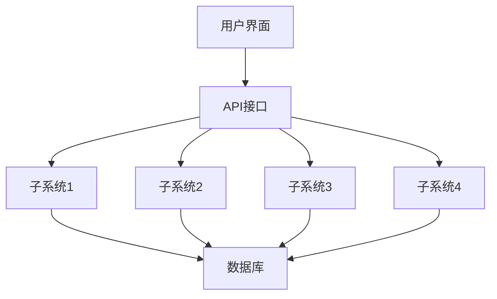
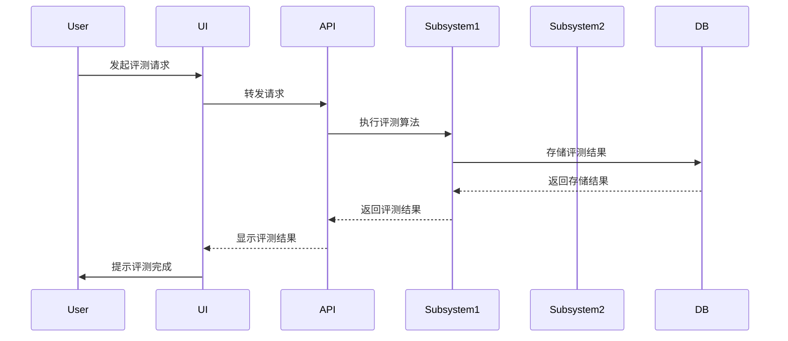

                 

### 引言

在当今大数据和人工智能蓬勃发展的时代，大规模语言模型（LLM，Large Language Model）的评测系统变得越来越重要。LLM评测系统不仅能够衡量语言模型的性能，还能够发现模型中的潜在问题，从而指导模型优化和改进。随着语言模型规模的不断扩大，评测系统面临的挑战也越来越大。传统的单机评测系统在处理大规模数据和高并发请求时往往力不从心，难以满足性能和可扩展性的需求。因此，分布式架构成为LLM评测系统设计的必然选择。

本文旨在深入探讨LLM评测系统的分布式架构设计，帮助读者理解分布式架构在LLM评测中的应用和优势。文章将分七个部分展开：

1. **背景介绍**：阐述LLM评测系统的需求与挑战，分布式架构的引入与必要性。
2. **分布式架构原理**：讲解分布式计算基础、分布式存储与数据处理、分布式通信机制、分布式一致性模型以及分布式调度与资源管理。
3. **系统设计与实现**：分析系统需求、领域模型设计、系统架构设计、系统接口设计和系统交互设计。
4. **性能优化**：探讨性能优化目标、性能瓶颈分析、性能优化策略以及性能测试与调优。
5. **安全性与可靠性保障**：讨论安全性需求、安全架构设计、故障恢复与容错机制以及数据备份与恢复。
6. **项目实战**：介绍环境安装与配置、核心功能实现、代码解读与分析、实际案例分析与详细讲解剖析以及项目小结。
7. **最佳实践与拓展**：提供最佳实践tips、小结、注意事项、拓展阅读等内容。

通过本文的详细探讨，读者将能够全面了解LLM评测系统的分布式架构设计，为实际项目提供有益的参考和指导。

### 关键词

- **大规模语言模型（LLM）**
- **分布式架构**
- **评测系统**
- **性能优化**
- **安全性**
- **可靠性保障**
- **分布式存储**
- **负载均衡**
- **一致性模型**

### 摘要

本文详细探讨了大规模语言模型（LLM）评测系统的分布式架构设计。首先，介绍了LLM评测系统的背景、需求与挑战，探讨了分布式架构的引入与必要性。接着，深入讲解了分布式架构的原理，包括分布式计算基础、存储与数据处理、通信机制、一致性模型以及调度与资源管理。然后，详细分析了系统设计与实现，涵盖了系统需求分析、领域模型设计、系统架构设计、接口设计以及交互设计。在性能优化部分，探讨了性能优化的目标、瓶颈分析、策略以及测试与调优。在安全性与可靠性保障部分，讨论了安全性需求、安全架构设计、故障恢复与容错机制以及数据备份与恢复。随后，通过项目实战部分，介绍了环境安装与配置、核心功能实现、代码解读与分析以及实际案例分析与讲解。最后，在最佳实践与拓展部分，总结了最佳实践技巧，并对未来技术发展趋势进行了展望。本文旨在为LLM评测系统的分布式架构设计提供全面、深入的指导。

---

### 第1章: 语言模型评测系统概述

#### 1.1 问题背景

语言模型评测系统在自然语言处理（NLP）领域发挥着重要作用。随着人工智能技术的不断发展，语言模型的规模和复杂度不断增加，如何准确评估语言模型的性能成为了一个关键问题。传统的评测方法往往依赖于单机系统，这种系统在处理大规模数据和高并发请求时存在明显的局限性。

首先，单机系统在计算资源上存在瓶颈。随着语言模型规模的扩大，其计算需求也相应增加。单机系统由于受限于CPU、内存和硬盘等硬件资源，难以满足大规模模型的计算需求。此外，单机系统在面对高并发请求时，响应时间会显著增加，导致用户体验下降。

其次，单机系统在可扩展性方面存在挑战。当用户量或者数据量增加时，单机系统难以通过简单增加硬件资源来提升性能。这导致系统在扩展性方面存在瓶颈，难以适应不断变化的需求。

最后，单机系统的维护和部署较为复杂。由于系统的各个组件都在同一台服务器上运行，任何一个组件的故障都可能导致整个系统瘫痪。此外，单机系统的部署和升级也需要对整个系统进行停机维护，影响了用户体验。

综上所述，传统的单机评测系统在处理大规模数据和高并发请求时存在明显的局限性，难以满足现代语言模型评测的需求。因此，引入分布式架构成为解决这一问题的必然选择。

#### 1.2 问题描述

语言模型评测系统的基本概念包括语言模型、评测指标和评测方法。语言模型是一种能够生成或理解自然语言的算法，其性能评估需要通过评测指标来衡量。常见的评测指标包括准确率、召回率、F1分数等。评测方法包括自动评测和人工评测，其中自动评测通过编写评测脚本自动化执行，而人工评测则需要人工阅读和评估语言模型生成的文本。

在传统的单机评测系统中，主要面临以下问题：

1. **计算资源不足**：随着语言模型规模的扩大，单机系统在计算资源上难以满足需求，导致评测速度缓慢。
2. **高并发请求响应慢**：单机系统在面对高并发请求时，由于资源竞争，响应时间显著增加，影响用户体验。
3. **系统可扩展性差**：单机系统难以通过增加硬件资源来提升性能，导致系统扩展性不足。
4. **维护和部署复杂**：单机系统的故障恢复和升级需要停机维护，影响系统的可用性和稳定性。

这些问题严重制约了单机评测系统的性能和应用范围。为了解决这些问题，分布式架构的应用成为必要，通过将系统分解为多个可独立运行的组件，提高系统的计算能力和可扩展性，同时降低系统的维护难度。

#### 1.3 问题解决

分布式架构在LLM评测系统中的应用能够有效解决传统单机评测系统面临的问题。首先，分布式架构通过将计算任务分解到多个节点上执行，提高了系统的计算能力。每个节点可以独立处理部分计算任务，从而实现了并行计算，显著提升了评测速度。

其次，分布式架构具有高可扩展性。当用户量或者数据量增加时，可以通过增加节点数量来提升系统的处理能力。这种动态扩展能力使得系统能够灵活应对不断变化的需求，提高了系统的稳定性和可靠性。

此外，分布式架构简化了系统的维护和部署。由于系统由多个节点组成，每个节点可以独立运行，单个节点的故障不会影响整个系统的运行。同时，系统的部署和升级也可以在单个节点上进行，避免了整个系统的停机维护。

分布式架构的具体应用包括以下几个方面：

1. **计算任务分解**：将大规模的评测任务分解为多个子任务，分布到不同的节点上并行处理，提高了系统的并行处理能力。
2. **负载均衡**：通过负载均衡算法，将请求均匀分配到不同的节点上，避免单个节点的过载，提高了系统的响应速度。
3. **分布式存储**：将数据分布在不同的存储节点上，提高了数据的读取和写入速度，同时增强了数据的可靠性和可用性。
4. **故障恢复**：通过冗余设计和故障转移机制，实现了系统的自动故障恢复，提高了系统的稳定性和可靠性。

总之，分布式架构的应用能够有效解决传统单机评测系统在计算资源、可扩展性和维护难度等方面的问题，为大规模语言模型评测提供了高效、可靠的解决方案。

#### 1.4 边界与外延

分布式架构在LLM评测系统中具有广泛的适用范围，但也存在一定的限制。首先，分布式架构适用于处理大规模语言模型评测任务，特别是在计算资源有限的情况下，通过分布式计算能够显著提升系统的处理能力。此外，分布式架构也适用于高并发请求的场景，通过负载均衡和分布式存储，系统能够快速响应大量用户的请求。

然而，分布式架构也存在一定的局限性。首先，分布式架构的设计和部署相对复杂，需要考虑节点间的通信、数据一致性等问题。其次，分布式架构对硬件和软件环境的要求较高，需要具备一定的技术基础和运维能力。此外，分布式架构在处理小规模语言模型评测任务时，可能由于计算资源利用率不高而影响性能。

针对这些局限性，可以考虑以下解决方案：

1. **合理规划资源**：在分布式架构中，合理分配计算资源和存储资源，避免资源浪费。例如，可以根据实际需求动态调整节点数量，提高资源利用率。
2. **优化通信机制**：通过优化分布式通信机制，降低节点间的通信开销。例如，可以采用高效的通信协议和缓存机制，减少数据传输时间和网络延迟。
3. **简化系统设计**：在分布式架构设计中，尽量简化系统组件和通信过程，降低系统的复杂度。例如，可以采用微服务架构，将系统分解为多个独立的小服务，简化部署和维护。
4. **性能监控与优化**：通过性能监控工具，实时监测系统的运行状态，及时发现和解决性能瓶颈。例如，可以通过性能测试和分析，找出系统中的性能瓶颈，并采取相应的优化措施。

总之，分布式架构在LLM评测系统中具有广泛的应用前景，但需要充分考虑其适用范围和局限性，通过合理规划和优化，充分发挥分布式架构的优势。

#### 1.5 概念结构与核心要素组成

语言模型评测系统的基本结构包括数据层、服务层和展示层三个部分。数据层负责数据的管理和存储，服务层实现评测算法和业务逻辑，展示层提供用户界面和交互功能。

1. **数据层**：数据层是系统的基石，负责存储和管理语言模型评测所需的数据。数据包括原始文本数据、标注数据以及评测结果数据。数据层通常采用分布式存储架构，如HDFS（Hadoop Distributed File System）或分布式数据库，以提高数据的读取和写入速度，确保数据的一致性和可靠性。

2. **服务层**：服务层是系统的核心，实现语言模型评测的核心算法和业务逻辑。服务层包括数据预处理模块、评测算法模块和结果分析模块。数据预处理模块负责对原始数据进行清洗和格式化，评测算法模块实现具体的评测算法，如准确率、召回率、F1分数等，结果分析模块对评测结果进行统计和分析，生成评测报告。

3. **展示层**：展示层是系统的用户界面，提供用户与系统的交互功能。展示层通常包括Web界面和命令行界面，用户可以通过Web界面查看评测结果和报告，通过命令行界面执行评测任务和配置系统参数。

在分布式架构下，语言模型评测系统的核心组件包括：

1. **分布式计算框架**：如Apache Spark或Flink，负责将计算任务分布到多个节点上执行，实现并行计算。分布式计算框架提供高效的分布式数据处理能力和负载均衡机制，确保系统在高并发请求下仍能保持良好的性能。

2. **分布式存储系统**：如HDFS或Cassandra，负责存储和管理大规模数据。分布式存储系统通过数据分片和冗余存储，提高数据的读取和写入速度，同时确保数据的一致性和可靠性。

3. **负载均衡器**：如Nginx或HAProxy，负责将请求分配到不同的服务器节点上执行，避免单个节点过载，提高系统的响应速度。负载均衡器还支持健康检查和故障转移机制，确保系统的稳定性和可靠性。

4. **分布式消息队列**：如Kafka或RabbitMQ，负责实现节点间的数据传输和通信。分布式消息队列提供高效、可靠的消息传递机制，确保系统各个组件之间的数据同步和一致性。

通过上述组件的协同工作，分布式架构下的语言模型评测系统能够高效地处理大规模数据和高并发请求，提供稳定可靠的评测服务。

---

### 第2章: 分布式架构原理

#### 2.1 分布式计算基础

分布式计算是指将一个大型计算任务分解为多个子任务，分布到多个计算节点上并行执行，从而提高计算效率和性能。分布式计算的基础包括计算节点、任务分解与调度、通信机制和容错机制。

首先，计算节点是分布式计算的基本组成单元。计算节点可以是物理服务器或虚拟机，每个节点具有独立的计算资源，如CPU、内存和硬盘等。在分布式计算中，任务分解与调度是将一个大型任务分解为多个子任务，并分配到不同的计算节点上执行。

任务分解与调度的核心目的是最大化利用计算资源，提高系统的并行处理能力。具体方法包括以下几种：

1. **静态任务调度**：在任务执行前，将任务固定分配到各个计算节点上，一旦分配完成，不再进行调整。静态任务调度简单高效，但灵活性较差，无法动态适应任务执行过程中的资源变化。

2. **动态任务调度**：在任务执行过程中，根据节点的负载情况和任务执行进度，动态调整任务的分配。动态任务调度具有更高的灵活性，能够更好地适应资源变化，提高系统的整体性能。

3. **负载均衡**：通过负载均衡算法，将任务均匀分配到各个计算节点上，避免某个节点过载，确保系统资源的合理利用。常见的负载均衡算法包括轮询调度、最小连接数调度和响应时间调度等。

通信机制是分布式计算中的关键组成部分。在分布式计算中，计算节点之间需要通过通信机制进行数据传输和同步。常用的通信机制包括以下几种：

1. **进程间通信（IPC）**：IPC机制用于同一台计算机上的不同进程之间的通信，如管道、信号量、消息队列和共享内存等。

2. **网络通信**：网络通信机制用于不同计算机之间的通信，如TCP/IP协议、HTTP协议和FTP协议等。网络通信具有更高的灵活性和可扩展性，但通信开销较大。

3. **分布式文件系统**：分布式文件系统用于存储和管理大规模数据，如HDFS（Hadoop Distributed File System）和Cassandra等。分布式文件系统通过数据分片和冗余存储，提高数据的读取和写入速度，同时确保数据的一致性和可靠性。

容错机制是分布式计算中的另一个重要组成部分。在分布式计算中，由于硬件故障、网络故障或程序错误等原因，计算节点可能会出现故障。容错机制旨在确保系统在故障发生时能够自动恢复，继续正常运行。

常见的容错机制包括以下几种：

1. **副本机制**：通过将数据或任务在多个节点上备份，确保在节点故障时，其他节点可以继续处理任务或读取数据。

2. **故障检测与恢复**：通过定期检测节点的状态，发现故障节点并自动切换到备用节点，确保系统的高可用性。

3. **任务重启**：在任务执行过程中，如果发生故障，系统可以自动重启任务，继续执行，从而确保任务的完成。

通过上述分布式计算基础，分布式架构能够高效地处理大规模计算任务，提高系统的性能和可靠性。

#### 2.2 分布式存储与数据处理

分布式存储和数据处理是分布式架构的核心组成部分，对于确保大规模语言模型评测系统的性能和可靠性至关重要。分布式存储通过将数据分散存储在多个节点上，实现数据的冗余备份和高可用性。分布式数据处理则通过并行处理技术，提高数据处理速度和效率。

首先，分布式存储的设计需要考虑数据分片和存储冗余。数据分片是将大规模数据划分为多个较小的数据块，并存储在多个节点上。常见的数据分片策略包括哈希分片和范围分片。哈希分片通过哈希函数将数据块映射到不同的节点，确保数据的均匀分布。范围分片则是根据数据的范围，将数据划分为多个区间，每个区间存储在特定的节点上。

存储冗余是分布式存储的另一重要特性，通过在多个节点上备份相同的数据，确保在节点故障时，数据仍然可用。常见的存储冗余策略包括副本复制和纠删码。副本复制通过在多个节点上保存相同的数据副本，实现数据的高可用性。纠删码则通过将数据划分为多个数据块和校验块，在多个节点上存储校验块，从而在部分节点故障时，仍能恢复数据。

在分布式数据处理方面，分布式计算框架如Apache Spark和Flink提供了高效的数据处理能力。这些框架支持数据的分布式存储和并行处理，通过将数据处理任务分解为多个子任务，分布到多个节点上执行，实现并行计算。具体来说，分布式数据处理包括以下步骤：

1. **数据读取**：分布式计算框架从分布式存储系统中读取数据，并将其划分为多个数据块。

2. **数据分区**：根据数据处理任务的需求，将数据块划分为多个分区，每个分区包含一部分数据。

3. **任务调度**：分布式计算框架根据节点的负载情况和任务需求，将子任务调度到不同的节点上执行。

4. **并行处理**：每个节点上的子任务并行执行，对数据块进行加工处理，如过滤、映射、聚合等。

5. **结果合并**：分布式计算框架将各个节点的子任务结果进行合并，生成最终的输出结果。

分布式数据处理的优势在于其高效性和灵活性。通过并行处理技术，分布式数据处理能够显著提高数据处理速度，特别是在处理大规模数据时。此外，分布式数据处理框架还支持动态扩展，当数据量或计算需求增加时，可以动态增加节点数量，确保系统的可扩展性。

综上所述，分布式存储与数据处理在分布式架构中发挥着关键作用，通过数据分片、存储冗余和并行处理技术，分布式架构能够高效地处理大规模语言模型评测任务，提供稳定可靠的评测服务。

#### 2.3 分布式通信机制

分布式通信机制是分布式架构中的关键组成部分，负责处理分布式系统中各个节点之间的数据传输和消息交换。高效的分布式通信机制能够提高系统的整体性能和可靠性，确保节点间的数据同步和一致性。本节将讨论负载均衡策略、分布式通信协议以及数据同步与一致性模型。

首先，负载均衡策略是分布式通信机制中的重要一环。负载均衡的目的是将系统负载均匀地分配到各个节点上，避免某个节点过载，同时充分利用系统资源。常见的负载均衡策略包括：

1. **轮询调度**：轮询调度是将请求依次分配到各个节点上，每个节点轮流处理请求。轮询调度简单高效，但无法根据节点的实际负载情况进行动态调整。

2. **最小连接数调度**：最小连接数调度是根据节点的当前连接数进行负载均衡，将请求分配到连接数最少的节点上。这种方法能够减少节点的过载，提高系统的响应速度。

3. **响应时间调度**：响应时间调度是根据节点的响应时间进行负载均衡，将请求分配到响应时间最短的节点上。这种方法能够提高系统的整体性能，但可能需要额外的性能监测机制。

4. **基于优先级的调度**：基于优先级的调度是按照节点的优先级进行负载均衡，优先级高的节点先处理请求。这种方法能够确保关键任务的优先执行。

其次，分布式通信协议是分布式系统中节点间通信的规范和标准。常见的分布式通信协议包括：

1. **TCP/IP协议**：TCP/IP协议是互联网的基本通信协议，提供可靠的、面向连接的数据传输服务。TCP协议通过三次握手和四次挥手建立和终止连接，确保数据的可靠传输。

2. **HTTP协议**：HTTP协议是基于TCP协议的应用层协议，用于Web服务器和客户端之间的通信。HTTP协议支持请求-响应模型，通过GET和POST方法发送请求和响应。

3. **RabbitMQ**：RabbitMQ是一个基于AMQP协议的消息队列中间件，支持分布式系统的消息传递和队列管理。RabbitMQ提供可靠的消息传输机制，确保消息不会丢失。

4. **Kafka**：Kafka是一个分布式流处理平台，提供高吞吐量的消息队列服务。Kafka基于分区和复制机制，支持大规模数据流处理，适用于实时数据处理场景。

数据同步与一致性模型是分布式通信机制中的另一个重要方面。在分布式系统中，多个节点可能同时处理相同的数据，如何确保数据的一致性成为一个关键问题。常见的数据同步与一致性模型包括：

1. **强一致性模型**：强一致性模型要求所有节点在同一时刻访问到相同的数据，具有最高的数据一致性。但强一致性模型可能带来较高的通信开销和延迟。

2. **最终一致性模型**：最终一致性模型允许节点在一段时间内访问到不同版本的数据，最终达到一致性状态。最终一致性模型具有较低的通信开销和延迟，但可能需要额外的补偿机制。

3. **分布式事务**：分布式事务通过两阶段提交（2PC）或三阶段提交（3PC）机制，确保多个节点上的操作要么全部成功，要么全部失败，从而保证数据的一致性。

通过负载均衡策略、分布式通信协议和数据同步与一致性模型，分布式通信机制能够高效、可靠地处理分布式系统中的数据传输和消息交换，确保系统的性能和一致性。

#### 2.4 分布式一致性模型

在分布式架构中，数据一致性是确保系统正确性和可靠性的关键。分布式一致性模型定义了分布式系统中多个节点在处理数据时的一致性保障机制，常见的分布式一致性模型包括强一致性模型和最终一致性模型。

**强一致性模型**：

强一致性模型要求所有节点在同一时刻访问到相同的数据，确保数据的强一致性。在强一致性模型中，每个节点在读取数据时，都能获取到最新的、一致的版本。常见的强一致性协议包括两阶段提交（2PC）和三阶段提交（3PC）。

- **两阶段提交（2PC）**：

两阶段提交是一种分布式事务管理协议，用于确保多个节点上的操作要么全部成功，要么全部失败。2PC分为两个阶段：

1. **准备阶段**：协调者向所有参与者发送准备消息，参与者执行本地事务，并返回准备结果。如果所有参与者都返回“准备就绪”，则进入下一阶段。

2. **提交阶段**：协调者根据参与者的准备结果，决定是否提交事务。如果所有参与者都返回“准备就绪”，则协调者向所有参与者发送提交消息，执行本地提交操作；否则，发送回滚消息，执行本地回滚操作。

- **三阶段提交（3PC）**：

三阶段提交是2PC的改进版本，旨在解决2PC中的单点故障问题。3PC将提交过程分为三个阶段：

1. **阶段一：准备阶段**：协调者向所有参与者发送准备消息，参与者执行本地事务，并返回准备结果。

2. **阶段二：决断阶段**：协调者根据参与者的准备结果，决定是否提交事务。如果所有参与者都返回“准备就绪”，则进入提交阶段；否则，进入回滚阶段。

3. **阶段三：提交阶段**：如果协调者决定提交事务，向所有参与者发送提交消息，执行本地提交操作。

强一致性模型的优势在于能够提供一致的数据访问，确保系统的正确性和可靠性。然而，强一致性模型也存在一些缺点：

1. **较高的通信开销**：由于需要协调多个节点，强一致性模型可能带来较高的通信开销和延迟。

2. **单点故障问题**：强一致性模型依赖于协调者，如果协调者发生故障，可能导致整个系统瘫痪。

**最终一致性模型**：

最终一致性模型允许节点在一段时间内访问到不同版本的数据，最终达到一致性状态。在最终一致性模型中，系统不会等待所有节点同步完成，而是在一定时间后，认为系统已经达到最终一致性。

最终一致性模型通常采用以下机制：

1. **消息传递**：节点之间通过消息传递系统（如Kafka、RabbitMQ）交换数据更新消息，实现数据的同步。

2. **补偿机制**：在最终一致性模型中，可能存在部分节点未能及时同步数据的情况。为了解决这一问题，可以采用补偿机制，如重试、回滚或补偿事务。

最终一致性模型的优势在于较低的通信开销和延迟，适用于高并发、高可用性的系统。然而，最终一致性模型也存在一些缺点：

1. **数据不一致**：在最终一致性模型中，不同节点可能访问到不同版本的数据，导致数据不一致。

2. **潜在错误**：由于系统不会等待所有节点同步完成，可能导致潜在的错误和问题。

总结而言，强一致性模型能够提供一致的数据访问，但可能带来较高的通信开销和单点故障问题；最终一致性模型具有较低的通信开销和延迟，但可能存在数据不一致和潜在错误。在实际应用中，需要根据具体需求和场景选择合适的一致性模型。

#### 2.5 分布式调度与资源管理

分布式调度与资源管理是分布式架构中的核心环节，旨在优化系统资源利用率和任务执行效率。有效的分布式调度和资源管理能够确保系统在面临大规模任务和高并发请求时，依然能够保持良好的性能和稳定性。

**分布式调度算法**

分布式调度算法是负责将任务分配到计算节点上的策略。常见的分布式调度算法包括以下几种：

1. **负载均衡调度**：负载均衡调度旨在将任务均匀地分配到各个节点上，避免某个节点过载。常见的负载均衡算法包括轮询调度、最小连接数调度和响应时间调度等。

2. **动态调度**：动态调度根据节点的实时负载情况和任务需求，动态调整任务的分配。动态调度能够更好地适应系统的变化，提高系统的性能和灵活性。

3. **任务优先级调度**：任务优先级调度根据任务的优先级进行调度，优先执行高优先级的任务。这种方法适用于需要保证关键任务优先执行的场景。

4. **基于历史数据调度**：基于历史数据调度是根据过去任务的执行情况和节点的性能，为当前任务选择最佳的执行节点。这种方法能够提高任务的执行效率，减少调度开销。

**资源分配与优化策略**

资源分配与优化策略是确保系统资源得到充分利用的关键。以下是一些常见的资源分配与优化策略：

1. **动态资源分配**：动态资源分配根据系统实时负载和任务需求，动态调整节点的资源分配。这种方法能够更好地适应系统变化，提高资源利用率。

2. **基于反馈的调整策略**：基于反馈的调整策略是根据节点的反馈信息，如CPU利用率、内存使用率等，动态调整节点的资源分配。这种方法能够快速响应系统的变化，提高系统的稳定性。

3. **资源池管理**：资源池管理是将系统资源划分为多个资源池，根据任务需求动态分配资源。这种方法能够提高系统的灵活性和可扩展性。

4. **预分配策略**：预分配策略是在任务执行前，预先分配足够的资源，确保任务能够顺利进行。这种方法能够减少任务执行中的资源争用，提高系统的响应速度。

**分布式资源管理工具**

分布式资源管理工具是辅助分布式调度和资源分配的工具。以下是一些常见的分布式资源管理工具：

1. **Apache Mesos**：Apache Mesos是一个分布式资源调度框架，支持多种资源分配策略，如框架优先、用户优先等。Mesos能够管理多种类型的资源，如CPU、内存、磁盘等，适用于大规模分布式系统。

2. **Kubernetes**：Kubernetes是一个开源的容器编排平台，能够管理容器化应用的生命周期，提供资源调度、服务发现、负载均衡等功能。Kubernetes支持多种调度算法，如静态调度、动态调度等。

3. **Docker Swarm**：Docker Swarm是Docker的集群管理工具，能够将多个Docker节点组成一个集群，提供资源调度、负载均衡、自动扩展等功能。Swarm基于Docker Engine，易于集成和使用。

通过分布式调度算法、资源分配与优化策略以及分布式资源管理工具，分布式架构能够高效地管理资源，优化任务执行效率，确保系统在面临大规模任务和高并发请求时，依然能够保持良好的性能和稳定性。

---

### 第3章: 系统设计与实现

#### 3.1 系统需求分析

系统需求分析是设计语言模型评测系统的第一步，旨在明确系统所需实现的功能和性能要求。以下从功能需求和非功能需求两个方面进行详细分析。

**功能需求**

1. **数据导入与预处理**：系统能够接收并导入大规模语言模型评测所需的数据，包括原始文本数据、标注数据和评测结果数据。系统应具备数据清洗、格式化等功能，确保数据的一致性和准确性。

2. **评测算法执行**：系统应实现多种评测算法，如准确率、召回率、F1分数等，用于评估语言模型的性能。系统应支持自定义评测算法，便于扩展和优化。

3. **结果展示与报告**：系统应具备直观的展示界面，能够将评测结果以图表、表格等形式展示给用户。系统应支持生成详细的评测报告，包括评测指标、分析结论等。

4. **用户权限管理**：系统应具备用户权限管理功能，实现用户身份认证、权限分配和访问控制，确保系统的安全性和可靠性。

**非功能需求**

1. **性能要求**：系统应具备良好的性能，能够在短时间内处理大规模数据和高并发请求。具体要求包括低延迟、高吞吐量、高并发处理能力等。

2. **可扩展性**：系统应具有良好的可扩展性，能够根据需求动态调整系统资源和配置，支持系统规模和功能扩展。

3. **可靠性**：系统应具备高可靠性，能够在故障发生时快速恢复，确保系统的持续运行。具体要求包括数据备份与恢复、故障检测与恢复等。

4. **安全性**：系统应具备严格的安全性，确保用户数据的安全和隐私。具体要求包括数据加密、用户认证、访问控制等。

通过对系统需求进行详细分析，为后续的系统设计提供了明确的方向和目标，确保系统能够满足实际应用需求。

#### 3.2 领域模型设计

领域模型设计是系统设计的重要环节，旨在明确系统中的实体及其关系。以下通过实体关系图（ER图）和类图，对语言模型评测系统的领域模型进行详细描述。

**实体关系图（ER图）**

实体关系图是描述系统中实体及其关系的图形化工具，以下是一个简单的实体关系图：

```mermaid
erDiagram
    User ||--|{ Model }|| Model
    User ||--|{ Evaluation }|| Evaluation
    Model ||--|{ Result }|| Result
    Evaluation ||--|{ Metric }|| Metric

    User {
        id
        name
        password
        email
    }

    Model {
        id
        name
        type
        version
    }

    Evaluation {
        id
        model_id
        user_id
        start_time
        end_time
    }

    Result {
        id
        evaluation_id
        metric_id
        value
    }

    Metric {
        id
        name
        type
    }
```

在这个ER图中，用户（User）是系统的核心实体，代表参与评测的用户。用户可以创建和管理模型（Model），每个模型具有唯一的ID、名称、类型和版本。评测（Evaluation）记录用户对模型的评测过程，关联用户和模型，并记录评测的开始和结束时间。结果（Result）记录评测的具体指标值，关联评测和指标。指标（Metric）定义了评测的指标类型，如准确率、召回率、F1分数等。

**类图**

类图是描述系统中类的结构和关系的一种图形化工具，以下是一个简单的类图：

```mermaid
classDiagram
    User <<entity>>
    Model <<entity>>
    Evaluation <<entity>>
    Result <<entity>>
    Metric <<entity>>

    User {
        id
        name
        password
        email
    }

    Model {
        id
        name
        type
        version
    }

    Evaluation {
        id
        model_id
        user_id
        start_time
        end_time
    }

    Result {
        id
        evaluation_id
        metric_id
        value
    }

    Metric {
        id
        name
        type
    }

    User "1" --* Model
    User "1" --* Evaluation
    Evaluation "1" --* Result
    Result "1" --* Metric
```

在这个类图中，用户（User）类表示系统的用户实体，具有ID、名称、密码和电子邮件等属性。模型（Model）类表示语言模型实体，具有ID、名称、类型和版本等属性。评测（Evaluation）类表示评测过程实体，关联用户和模型，并具有ID、模型ID、用户ID、开始时间和结束时间等属性。结果（Result）类表示评测结果实体，关联评测和指标，并具有ID、评测ID、指标ID和值等属性。指标（Metric）类表示评测指标实体，具有ID、名称和类型等属性。

通过实体关系图和类图，我们可以清晰地描述语言模型评测系统的领域模型，为后续的系统设计提供了基础。

#### 3.3 系统架构设计

系统架构设计是语言模型评测系统设计的核心环节，旨在确定系统的整体结构和组件间的关系。以下从架构设计原则、系统架构图、接口设计、系统交互设计等方面进行详细描述。

**架构设计原则**

1. **模块化原则**：将系统划分为多个模块，每个模块负责特定的功能，便于系统的开发和维护。

2. **分层原则**：将系统划分为多个层次，如表示层、业务逻辑层和数据访问层，各层次间保持低耦合，提高系统的可维护性和扩展性。

3. **分布式原则**：采用分布式架构，将系统划分为多个节点，实现数据存储和处理的分布式，提高系统的性能和可扩展性。

4. **安全性原则**：确保系统的安全性，采用加密、认证和访问控制等手段，保护用户数据和系统资源。

5. **可扩展性原则**：设计具有良好可扩展性的系统，能够根据需求动态调整系统资源和配置，支持系统规模和功能的扩展。

**系统架构图**

以下是一个简单的系统架构图：



在这个架构图中，系统分为多个子系统，包括数据导入与预处理子系统、评测算法执行子系统、结果展示与报告子系统等。各子系统通过API接口与数据库进行交互，数据库用于存储和管理系统数据。用户界面（UI）通过API接口与子系统进行交互，实现用户操作和系统功能。

**接口设计**

接口设计是系统架构设计中的重要一环，以下从API接口规范和数据交互格式两个方面进行描述。

1. **API接口规范**

API接口规范包括接口名称、接口路径、请求方式、请求参数和响应格式等。以下是一个简单的API接口规范示例：

```python
# 评测结果接口
GET /api/evaluations/{evaluation_id}/results

# 参数：
#   evaluation_id：评测ID

# 响应：
#   {
#     "results": [
#         {
#           "metric_id": "accuracy",
#           "value": 0.9
#         },
#         {
#           "metric_id": "recall",
#           "value": 0.85
#         },
#         {
#           "metric_id": "f1_score",
#           "value": 0.88
#         }
#     ]
#   }
```

2. **数据交互格式**

数据交互格式通常采用JSON或XML等轻量级数据格式，以下是一个简单的JSON数据交互示例：

```json
{
  "evaluation": {
    "id": "e12345",
    "model_id": "m12345",
    "user_id": "u12345",
    "start_time": "2021-01-01T00:00:00Z",
    "end_time": "2021-01-01T01:00:00Z"
  },
  "results": [
    {
      "metric_id": "accuracy",
      "value": 0.9
    },
    {
      "metric_id": "recall",
      "value": 0.85
    },
    {
      "metric_id": "f1_score",
      "value": 0.88
    }
  ]
}
```

**系统交互设计**

系统交互设计描述了用户与系统之间的交互过程和流程。以下是一个简单的系统交互序列图：



在这个交互过程中，用户通过用户界面（UI）发起评测请求，UI将请求转发到API接口。API接口调用评测算法执行子系统（Subsystem1），将评测结果存储到数据库（DB），并返回给用户界面。用户界面显示评测结果，并提示用户评测完成。

通过系统架构设计、接口设计、系统交互设计等方面的详细描述，我们可以构建一个功能完整、性能优越的语言模型评测系统。

---

### 第4章: 性能优化

#### 4.1 性能优化目标

在分布式架构下，语言模型评测系统的性能优化目标是提升系统的响应时间、并发处理能力和资源利用率，以满足大规模数据和高并发请求的挑战。以下从三个关键方面详细讨论性能优化目标：

1. **响应时间**：系统需要在短时间内处理并返回用户的评测请求。响应时间的优化是提高用户体验和系统可用性的重要指标。通过减少数据传输延迟、优化算法效率以及提高系统并发处理能力，可以显著降低系统的平均响应时间。

2. **并发处理能力**：系统能够同时处理多个请求的能力称为并发处理能力。在分布式架构中，优化并发处理能力是提升系统性能的关键。通过合理分配计算资源、采用负载均衡策略以及优化分布式数据处理框架，系统能够更好地应对高并发请求，保持稳定高效的运行。

3. **资源利用率**：系统需要最大化利用计算资源，包括CPU、内存、网络和存储等。优化资源利用率能够降低系统成本，提高整体性能。通过动态调整资源分配、优化数据存储和传输机制，系统能够更高效地利用现有资源，避免资源浪费。

综上所述，性能优化目标是为了确保语言模型评测系统能够在面临大规模数据和复杂请求时，保持高效、稳定和可靠的运行。

#### 4.2 性能瓶颈分析

在分布式架构下，语言模型评测系统可能会面临多种性能瓶颈，以下从数据存储瓶颈、网络通信瓶颈和资源调度瓶颈三个方面进行分析。

**数据存储瓶颈**

1. **数据访问延迟**：在分布式存储系统中，数据分布在多个节点上，数据访问延迟可能成为性能瓶颈。当多个节点同时访问同一份数据时，数据传输和同步过程可能导致延迟增加。为了缓解这一问题，可以采用数据分片和存储冗余策略，优化数据访问路径，减少数据传输延迟。

2. **存储资源不足**：随着数据量的不断增加，存储资源可能会出现不足，导致存储性能下降。此时，可以通过扩展存储节点、采用分布式文件系统（如HDFS）或分布式数据库（如Cassandra）等方式，提高存储系统的容量和性能。

3. **数据一致性**：分布式存储系统在保证数据一致性方面可能存在挑战，特别是在高并发访问场景下。采用一致性模型（如强一致性或最终一致性）时，需要权衡一致性保证和数据访问性能之间的关系，优化一致性协议和算法，降低数据访问延迟。

**网络通信瓶颈**

1. **网络带宽限制**：在分布式系统中，节点间的数据传输依赖于网络带宽。当系统处理大量数据时，网络带宽可能成为瓶颈，导致数据传输速度下降。为了缓解这一问题，可以采用数据压缩技术、优化网络传输协议（如HTTP/2）以及负载均衡策略，提高数据传输效率。

2. **网络延迟**：在网络传输过程中，数据包在网络中的传输延迟可能成为性能瓶颈。特别是跨地域的分布式系统，网络延迟可能更加显著。通过优化数据传输路径、采用缓存机制（如CDN）以及负载均衡策略，可以降低网络延迟，提高数据传输速度。

3. **网络拥塞**：在高峰期，网络可能出现拥塞，导致数据传输速度下降。为了缓解网络拥塞，可以采用流量控制技术、优化网络拓扑结构和负载均衡策略，提高网络的传输效率和稳定性。

**资源调度瓶颈**

1. **CPU资源不足**：在分布式系统中，计算任务分布在多个节点上执行，CPU资源成为重要的瓶颈。当系统并发任务过多时，CPU资源可能不足，导致任务执行延迟。为了优化CPU资源利用，可以采用动态调度算法、任务优先级策略以及负载均衡机制，合理分配CPU资源，提高任务执行效率。

2. **内存资源不足**：内存资源在分布式系统中同样重要。当系统内存不足时，可能导致任务频繁进行垃圾回收，降低系统性能。通过合理分配内存资源、采用缓存机制（如LRU缓存算法）以及优化内存管理策略，可以缓解内存资源不足的问题。

3. **存储资源竞争**：在分布式系统中，多个任务可能同时访问同一存储资源，导致存储资源竞争。为了优化存储资源利用，可以采用数据分片和存储冗余策略，降低存储资源竞争，提高存储系统性能。

通过深入分析数据存储瓶颈、网络通信瓶颈和资源调度瓶颈，我们可以针对性地进行性能优化，提升语言模型评测系统的整体性能和稳定性。

#### 4.3 性能优化策略

为了解决语言模型评测系统在分布式架构下可能面临的数据存储瓶颈、网络通信瓶颈和资源调度瓶颈，我们需要采取一系列性能优化策略。以下详细讨论这些策略，包括数据分片策略、缓存机制和负载均衡方案。

**数据分片策略**

数据分片是分布式存储系统中常用的优化策略，通过将大规模数据划分为多个较小的数据块，分布存储在多个节点上，从而提高数据的读取和写入速度。以下是数据分片策略的关键步骤：

1. **水平分片**：水平分片是将数据按照某种规则（如哈希值、范围等）划分为多个分区，每个分区存储一部分数据。水平分片能够有效解决单点瓶颈问题，提高系统的扩展性和性能。具体步骤如下：
   - **确定分片规则**：根据数据特点和业务需求，选择合适的分片规则，如哈希分片或范围分片。
   - **划分数据分区**：将数据按照分片规则划分为多个分区，并将每个分区存储在不同的节点上。
   - **分片索引管理**：建立分片索引，用于快速定位和访问特定分区的数据。

2. **垂直分片**：垂直分片是将数据表按照列的属性划分为多个子表，每个子表存储一部分列的数据。垂直分片能够提高查询性能，减少数据表的大小和索引维护成本。具体步骤如下：
   - **确定分片列**：根据查询需求和数据访问模式，选择合适的分片列，如用户ID、时间戳等。
   - **划分子表**：将数据表按照分片列划分为多个子表，每个子表存储一部分列的数据。
   - **分片索引维护**：建立和维护子表的索引，确保查询效率。

**缓存机制**

缓存机制是提高分布式系统性能的有效手段，通过将频繁访问的数据存储在内存中，减少对磁盘的访问次数，从而降低数据访问延迟。以下是缓存机制的关键步骤：

1. **缓存策略**：根据数据访问模式和业务需求，选择合适的缓存策略，如LRU（Least Recently Used）缓存算法、LFU（Least Frequently Used）缓存算法等。LRU缓存算法基于最近最少使用原则，优先缓存最近使用频率较高的数据。

2. **缓存管理**：实现缓存的管理和更新机制，包括缓存数据的添加、删除、替换和过期处理。例如，可以通过定期扫描缓存数据，清除过期数据，释放内存空间。

3. **缓存一致性**：在分布式系统中，缓存数据的一致性是关键问题。为了确保缓存数据的一致性，可以采用以下策略：
   - **写时复制**：当数据更新时，同时更新缓存和后端存储，确保缓存和存储的数据一致。
   - **最终一致性**：允许缓存和存储之间的数据存在一定的时间延迟，通过事件通知或轮询机制，最终实现数据的一致性。

**负载均衡方案**

负载均衡是将系统请求均匀地分配到多个节点上，避免单个节点过载，提高系统的整体性能和稳定性。以下是负载均衡方案的关键步骤：

1. **负载均衡器**：选择合适的负载均衡器，如Nginx、HAProxy等，用于实现请求的分配和转发。负载均衡器可以根据节点的负载情况和响应时间，动态调整请求的分配策略。

2. **请求分配策略**：根据业务需求和系统特点，选择合适的请求分配策略，如轮询调度、最小连接数调度、响应时间调度等。轮询调度是最简单的策略，将请求依次分配到各个节点上；最小连接数调度将请求分配到连接数最少的节点上，避免节点过载；响应时间调度将请求分配到响应时间最短的节点上，提高系统的响应速度。

3. **健康检查**：定期对节点进行健康检查，发现故障节点并自动切换到备用节点。通过健康检查，可以确保系统的可靠性和稳定性。

通过数据分片策略、缓存机制和负载均衡方案，分布式架构下的语言模型评测系统能够有效解决数据存储瓶颈、网络通信瓶颈和资源调度瓶颈，提高系统的性能和可靠性。

#### 4.4 性能测试与调优

性能测试与调优是确保分布式架构下的语言模型评测系统在实际运行中达到预期性能目标的重要环节。以下从性能测试框架、测试方法、性能调优实践以及常见问题解决等方面详细讨论性能测试与调优的过程。

**性能测试框架**

性能测试框架是进行系统性能评估和调优的基础。一个完整的性能测试框架应包括以下组成部分：

1. **测试工具**：选择适合的性能测试工具，如Apache JMeter、LoadRunner等。这些工具能够模拟大量用户同时访问系统，生成真实的负载环境。

2. **测试场景**：根据业务需求和系统特点，设计合理的测试场景。测试场景应包括常用的功能操作、高并发请求、数据加载等，确保测试覆盖全面的系统功能和性能瓶颈。

3. **测试数据**：准备充足的测试数据，包括用户数据、模型数据、评测数据等。测试数据应具有代表性，能够真实反映系统在实际运行中的数据量和访问模式。

4. **测试环境**：搭建与生产环境相似的测试环境，包括硬件配置、网络拓扑、系统软件等。测试环境应确保与实际生产环境一致，以便准确评估系统的性能表现。

**测试方法**

性能测试方法包括以下几种：

1. **负载测试**：通过模拟大量用户同时访问系统，评估系统在高负载条件下的性能表现。负载测试可以帮助发现系统的性能瓶颈，如CPU利用率、内存使用率、网络延迟等。

2. **压力测试**：通过逐步增加系统负载，评估系统在极限条件下的性能表现。压力测试可以帮助确定系统的最大承载能力，识别潜在的崩溃点和故障点。

3. **性能调优测试**：在负载测试和压力测试的基础上，针对发现的问题进行性能调优。通过调整系统配置、优化算法、增加节点等手段，提升系统的性能和稳定性。

4. **容量测试**：评估系统在数据量和并发请求不断增加的情况下的性能表现。容量测试可以帮助确定系统的可扩展性，为系统规模扩展提供依据。

**性能调优实践**

以下是一些常见的性能调优实践方法：

1. **优化算法**：对系统中的关键算法进行优化，如数据结构选择、排序算法、并行计算等。通过优化算法，可以降低计算复杂度，提高系统性能。

2. **优化数据库**：对数据库进行优化，包括索引设计、查询优化、缓存机制等。通过优化数据库，可以减少数据访问延迟，提高查询效率。

3. **增加节点**：在分布式系统中，通过增加节点数量，可以提升系统的并发处理能力和性能。根据业务需求，合理规划节点数量和负载均衡策略，确保系统的高效运行。

4. **优化网络**：优化系统网络配置，包括网络带宽、网络延迟、网络拓扑等。通过优化网络，可以降低数据传输延迟，提高系统性能。

5. **缓存机制**：引入缓存机制，如Redis、Memcached等，将频繁访问的数据缓存到内存中，减少对磁盘的访问次数。通过优化缓存机制，可以显著提高系统性能。

**常见问题解决**

在性能测试与调优过程中，可能会遇到以下常见问题：

1. **系统崩溃**：系统在高负载条件下出现崩溃，可能是由于资源不足、算法缺陷等原因。通过增加资源、优化算法、改进系统稳定性等措施，可以解决系统崩溃问题。

2. **响应时间过长**：系统响应时间过长，可能是由于网络延迟、数据库查询效率低等原因。通过优化网络、优化数据库查询、提高系统并发处理能力等措施，可以降低响应时间。

3. **并发处理能力不足**：系统在面临高并发请求时，处理能力不足，导致响应时间增加。通过增加节点、优化负载均衡策略、提高系统并发处理能力等措施，可以提升系统并发处理能力。

4. **资源争用**：在分布式系统中，多个节点可能同时访问同一资源，导致资源争用。通过合理分配资源、优化资源管理策略、采用分布式锁等措施，可以解决资源争用问题。

通过性能测试与调优，分布式架构下的语言模型评测系统能够在实际运行中达到预期性能目标，提供高效、稳定和可靠的评测服务。

---

### 第5章: 安全性与可靠性保障

#### 5.1 安全性需求

在分布式架构下，语言模型评测系统的安全性需求包括数据安全性、通信安全性和用户权限管理。以下是这些需求的详细说明：

**数据安全性**

数据安全性是确保系统中的数据不被未经授权的访问、篡改或泄露。以下是一些关键措施：

1. **数据加密**：对存储在数据库中的敏感数据进行加密，采用强加密算法（如AES-256）进行加密处理，确保数据在存储和传输过程中的安全性。

2. **访问控制**：通过访问控制列表（ACL）和角色访问控制（RBAC），对系统的访问进行严格控制。只有具有相应权限的用户才能访问特定数据。

3. **数据备份**：定期进行数据备份，确保在发生数据丢失或损坏时能够快速恢复。备份数据应存储在安全的地方，并进行加密保护。

**通信安全性**

通信安全性是确保系统内外的通信过程不被窃听、篡改或冒充。以下是一些关键措施：

1. **加密传输**：使用HTTPS协议，确保系统与用户之间的通信数据在传输过程中被加密，防止数据泄露。

2. **安全认证**：采用数字证书进行用户认证，确保用户身份的合法性和安全性。证书可以由可信的证书颁发机构（CA）颁发。

3. **网络隔离**：对系统内部网络进行隔离，限制内部网络的访问权限，确保外部网络无法直接访问系统内部网络。

**用户权限管理**

用户权限管理是确保系统能够根据用户的角色和权限，限制用户对系统资源的访问。以下是一些关键措施：

1. **用户身份认证**：采用多因素认证（MFA），如密码、手机短信验证码、指纹识别等，确保用户身份的合法性。

2. **角色分配**：根据用户的角色和职责，分配相应的权限。例如，管理员拥有最高权限，可以管理系统所有功能；普通用户只能访问与其职责相关的功能。

3. **权限审计**：对用户的操作进行记录和审计，确保系统管理员能够追踪和审查用户行为，及时发现和防范潜在的安全威胁。

通过以上措施，分布式架构下的语言模型评测系统可以确保数据安全性、通信安全性和用户权限管理，提高系统的整体安全性。

#### 5.2 安全架构设计

为了确保分布式架构下的语言模型评测系统的安全性，需要设计一个全面的安全架构。以下从安全防护机制、加密与认证策略、数据备份与恢复机制三个方面进行详细说明。

**安全防护机制**

1. **防火墙**：在系统网络边界上部署防火墙，防止外部恶意攻击和未经授权的访问。防火墙可以根据预定义的安全策略，过滤和阻止非法访问。

2. **入侵检测系统（IDS）**：部署入侵检测系统，实时监控系统网络流量和日志，发现潜在的安全威胁和异常行为。IDS可以及时报警并采取相应措施。

3. **安全审计**：定期进行安全审计，审查系统的配置、日志和访问记录，确保系统的安全性和合规性。

4. **数据加密**：对敏感数据进行加密处理，防止数据在存储和传输过程中被窃取或篡改。加密算法应选用强加密算法，如AES-256。

**加密与认证策略**

1. **通信加密**：采用HTTPS协议进行通信加密，确保系统与用户之间的数据在传输过程中不被窃听或篡改。HTTPS协议通过SSL/TLS加密通信，提供数据完整性保护和认证。

2. **用户认证**：采用多因素认证（MFA）进行用户认证，包括密码、手机短信验证码、指纹识别等。多因素认证可以提高用户身份的安全性，防止未经授权的访问。

3. **访问控制**：使用访问控制列表（ACL）和角色访问控制（RBAC），对系统资源的访问进行严格控制。只有具有相应权限的用户才能访问特定的资源。

4. **加密存储**：对存储在数据库中的敏感数据进行加密，确保数据在存储过程中的安全性。加密算法应选用强加密算法，如AES-256。

**数据备份与恢复机制**

1. **定期备份**：定期进行数据备份，确保在发生数据丢失或损坏时能够快速恢复。备份应存储在安全的地方，并进行加密保护。

2. **备份策略**：采用合适的备份策略，如全量备份、增量备份和差异备份。全量备份可以完整备份系统数据，增量备份和差异备份可以备份新增和修改的数据，提高备份效率。

3. **备份存储**：备份数据应存储在多个地方，确保备份的可靠性和可用性。备份存储可以使用云存储服务，如AWS S3或Google Cloud Storage。

4. **恢复流程**：制定详细的恢复流程，确保在发生数据丢失或损坏时能够快速恢复系统。恢复流程应包括数据备份的恢复、系统配置的恢复以及数据的验证和校验。

通过安全防护机制、加密与认证策略以及数据备份与恢复机制的设计，分布式架构下的语言模型评测系统可以确保数据的安全性、通信的安全性和系统的可靠性。

#### 5.3 故障恢复与容错机制

在分布式架构下，故障恢复与容错机制是确保系统高可用性和稳定性的关键。以下从故障处理策略、容错架构设计以及恢复流程三个方面进行详细说明。

**故障处理策略**

1. **故障检测**：通过监控工具，实时监控系统的运行状态，包括CPU使用率、内存使用率、网络延迟等。当系统指标超过预设阈值时，触发故障检测机制。

2. **故障报警**：故障检测到后，立即向系统管理员发送报警通知，包括故障类型、发生时间和相关日志。管理员可以根据报警信息，快速定位和解决故障。

3. **故障隔离**：在故障发生时，迅速隔离故障节点，避免故障扩散。通过负载均衡器或服务网格（如Istio）实现故障节点的自动隔离，确保其他节点继续正常工作。

**容错架构设计**

1. **副本机制**：通过在多个节点上保存相同的数据或服务副本，实现数据的冗余备份和故障转移。当主节点发生故障时，备用节点可以接管工作，确保系统的连续性。

2. **故障转移**：实现故障节点的自动转移，确保系统在高可用性模式下运行。故障转移机制可以根据故障类型，如硬件故障、网络故障等，选择合适的转移策略，如快速转移、延时转移等。

3. **分布式存储**：采用分布式存储系统，如HDFS、Cassandra等，确保数据的高可用性和可靠性。分布式存储系统通过数据分片和冗余存储，提高数据的读取和写入速度，同时增强数据的容错能力。

**恢复流程**

1. **故障恢复**：在故障节点恢复正常后，自动恢复故障节点的服务。恢复流程包括数据同步、服务重启等操作，确保系统恢复正常工作。

2. **数据恢复**：在发生数据丢失或损坏时，通过备份数据或冗余数据，快速恢复系统的数据。数据恢复流程包括数据备份的恢复、数据校验和一致性检查等操作。

3. **性能优化**：在故障恢复后，对系统进行性能优化，确保系统在故障后能够恢复正常水平。性能优化包括资源调整、负载均衡策略优化等。

通过故障处理策略、容错架构设计和恢复流程的设计，分布式架构下的语言模型评测系统可以确保在高可用性和稳定性方面的表现，提高系统的可靠性和用户体验。

#### 5.4 数据备份与恢复

数据备份与恢复是确保分布式架构下的语言模型评测系统在面临数据丢失或损坏时能够快速恢复的关键。以下从备份策略、备份存储、恢复流程以及备份验证等方面详细讨论数据备份与恢复的方法。

**备份策略**

1. **全量备份**：全量备份是定期对系统中的全部数据进行备份。这种策略适用于数据量较小或变化不频繁的系统，可以有效保障数据的完整性和一致性。

2. **增量备份**：增量备份是仅备份自上次备份以来发生更改的数据。这种策略可以节省存储空间，并减少备份时间。适用于数据量较大且变化频繁的系统。

3. **差异备份**：差异备份是备份自上次全量备份以来发生更改的数据。这种策略在数据量较大但变化频率较低时较为有效，可以平衡备份时间和存储空间。

4. **混合备份**：混合备份是结合全量备份和增量备份的优点，定期进行全量备份，同时进行增量备份或差异备份。这种策略适用于大型系统，可以保证数据的完整性和快速恢复。

**备份存储**

1. **本地存储**：将备份数据存储在本地磁盘或存储设备上。本地存储方便快速访问和恢复，但存在安全隐患，如设备故障或数据丢失。

2. **远程存储**：将备份数据存储在远程服务器或云存储服务中。远程存储具有更高的安全性和可靠性，可以通过网络远程访问和恢复数据。

3. **多地点备份**：将备份数据存储在多个不同的地点，如本地存储和远程存储，以提高数据的可用性和可靠性。多地点备份可以在发生灾难性故障时，确保数据的安全。

**恢复流程**

1. **数据恢复请求**：在发生数据丢失或损坏时，系统管理员或用户提交数据恢复请求。

2. **备份选择**：根据数据恢复请求，选择相应的备份策略和备份存储位置。

3. **数据恢复**：从备份存储中提取备份数据，并将其恢复到系统中。恢复过程中，需要确保数据的一致性和完整性。

4. **数据验证**：恢复数据后，进行数据验证，确保数据的一致性和正确性。数据验证可以通过对比原始数据和恢复数据，检查数据的准确性和完整性。

**备份验证**

1. **定期验证**：定期对备份数据进行验证，确保备份数据的完整性和可用性。可以通过恢复部分备份数据，检查恢复数据的准确性和一致性。

2. **自动化验证**：通过自动化工具定期验证备份数据，发现和报告潜在问题。自动化验证可以降低人为错误，提高备份数据的可靠性。

通过数据备份与恢复策略、备份存储方案和恢复流程的设计，分布式架构下的语言模型评测系统可以确保在数据丢失或损坏时能够快速恢复，保证系统的高可用性和数据安全性。

---

### 第6章: 项目实战

#### 6.1 环境安装与配置

在实际项目中，构建分布式架构下的语言模型评测系统需要一系列环境安装和配置。以下从硬件与软件环境、系统部署流程两个方面详细描述项目实战的过程。

**硬件与软件环境**

1. **硬件环境**：

   - **服务器**：选择多台服务器，用于部署分布式架构的各个组件，如计算节点、存储节点和负载均衡器等。服务器应具备足够的计算能力和存储容量，以确保系统的高性能和可靠性。
   - **网络环境**：确保服务器之间的网络连接稳定，建议使用千兆以太网或更高带宽的网络，以支持大规模数据传输和并发请求。

2. **软件环境**：

   - **操作系统**：选择适合的操作系统，如Linux（推荐使用CentOS、Ubuntu等），以确保系统的稳定性和兼容性。
   - **分布式计算框架**：安装并配置分布式计算框架，如Apache Spark或Flink，用于并行处理大规模数据。
   - **分布式存储系统**：安装并配置分布式存储系统，如HDFS或Cassandra，用于存储和管理评测数据。
   - **负载均衡器**：安装并配置负载均衡器，如Nginx或HAProxy，用于分配用户请求到不同的服务器节点上。
   - **消息队列**：安装并配置消息队列系统，如Kafka或RabbitMQ，用于处理分布式系统中的消息传递和异步通信。

**系统部署流程**

1. **硬件部署**：

   - **服务器配置**：根据项目需求，配置服务器的硬件资源，如CPU、内存和硬盘等。
   - **网络连接**：确保服务器之间的网络连接正常，配置IP地址、子网掩码和网关等网络参数。

2. **软件安装**：

   - **操作系统安装**：在服务器上安装操作系统，配置网络和存储设备。
   - **分布式计算框架安装**：根据分布式计算框架的文档，安装和配置分布式计算框架。
   - **分布式存储系统安装**：根据分布式存储系统的文档，安装和配置分布式存储系统。
   - **负载均衡器安装**：根据负载均衡器的文档，安装和配置负载均衡器。
   - **消息队列系统安装**：根据消息队列系统的文档，安装和配置消息队列系统。

3. **系统配置**：

   - **分布式计算配置**：配置分布式计算框架，如设置任务调度策略、资源分配策略等。
   - **存储配置**：配置分布式存储系统，如设置数据分片策略、存储冗余策略等。
   - **负载均衡配置**：配置负载均衡器，如设置负载均衡策略、健康检查机制等。
   - **消息队列配置**：配置消息队列系统，如设置消息传递模式、队列管理策略等。

4. **测试与优化**：

   - **系统测试**：在部署完成后，进行系统测试，确保各个组件的正常运行和协同工作。
   - **性能优化**：根据测试结果，对系统进行性能优化，如调整资源分配策略、优化网络配置等，以提高系统的性能和可靠性。

通过硬件与软件环境的配置和系统部署流程的执行，分布式架构下的语言模型评测系统可以成功搭建并投入使用，为后续的功能实现和性能优化奠定基础。

#### 6.2 核心功能实现

在分布式架构下，语言模型评测系统的核心功能实现涉及数据处理模块、分布式计算模块以及评测结果处理模块。以下从各模块的核心功能和实现细节进行详细描述。

**数据处理模块**

数据处理模块是语言模型评测系统的基础，负责对原始文本数据进行清洗、格式化和预处理。核心功能包括：

1. **数据清洗**：去除原始文本中的噪声数据，如HTML标签、特殊字符等，确保数据的纯净和一致性。
2. **数据格式化**：将文本数据转换为统一的格式，如JSON、XML等，便于后续处理和分析。
3. **数据预处理**：根据评测需求，对文本数据进行分词、词性标注、实体识别等预处理操作，为评测算法提供高质量的数据输入。

实现细节：

- **数据清洗**：使用正则表达式和文本处理库（如Python的re模块）去除噪声数据。
- **数据格式化**：使用JSON或XML库（如Python的json模块）将文本数据格式化为统一格式。
- **数据预处理**：利用自然语言处理库（如NLTK、spaCy）进行文本分词、词性标注和实体识别。

**分布式计算模块**

分布式计算模块是语言模型评测系统的核心，负责大规模数据的并行处理和计算。核心功能包括：

1. **数据分片**：将大规模数据划分为多个子任务，分布到不同的计算节点上处理，提高并行处理能力。
2. **并行计算**：在每个计算节点上，独立执行子任务的计算操作，如文本分类、命名实体识别等。
3. **结果合并**：将各个计算节点的子任务结果进行合并，生成最终的评测结果。

实现细节：

- **数据分片**：使用哈希分片或范围分片策略，根据数据的特点和分布，将数据划分为多个分区。
- **并行计算**：使用分布式计算框架（如Apache Spark、Flink），将子任务调度到不同的计算节点上执行。
- **结果合并**：使用分布式计算框架的聚合函数（如reduce、sum、avg等），将子任务结果进行合并。

**评测结果处理模块**

评测结果处理模块负责将评测结果进行统计和分析，生成评测报告。核心功能包括：

1. **结果统计**：计算各种评测指标，如准确率、召回率、F1分数等，评估语言模型的性能。
2. **结果展示**：将评测结果以图表、表格等形式展示给用户，提供直观的评测报告。
3. **结果存储**：将评测结果存储到数据库中，便于后续分析和查询。

实现细节：

- **结果统计**：使用统计分析库（如Python的pandas库）计算评测指标，对结果进行汇总和统计。
- **结果展示**：使用数据可视化库（如Python的matplotlib、seaborn库）将评测结果可视化，生成图表和报告。
- **结果存储**：使用分布式数据库（如HBase、Cassandra）存储评测结果，确保数据的高可用性和可靠性。

通过数据处理模块、分布式计算模块和评测结果处理模块的核心功能实现，分布式架构下的语言模型评测系统可以高效、稳定地处理大规模语言模型评测任务，为用户提供准确、可靠的评测结果。

#### 6.3 代码解读与分析

在分布式架构下，语言模型评测系统的实现涉及大量关键代码。以下通过具体代码段，详细解读系统的核心功能实现，并分析其性能和优化策略。

**1. 数据处理模块**

在数据处理模块中，我们使用Python的pandas库对原始文本数据进行清洗和格式化。以下是一个简单的代码示例：

```python
import pandas as pd

# 读取原始文本数据
data = pd.read_csv('data.csv')

# 去除HTML标签和特殊字符
data['text'] = data['text'].str.replace('<[^>]*>', '').str.replace('[^\w\s]', '')

# 数据格式化
data['text'] = data['text'].str.lower().str.strip()
```

**代码分析**：

- **读取数据**：使用pandas库读取CSV文件中的原始文本数据。
- **去除HTML标签**：使用正则表达式去除HTML标签，确保文本数据的一致性和纯净性。
- **去除特殊字符**：使用正则表达式去除特殊字符，如非字母数字字符，确保文本数据的统一格式。
- **数据格式化**：将文本数据转换为小写并去除空格，提高数据处理和分析的效率。

**优化策略**：

- **并行处理**：使用分布式计算框架（如Apache Spark）对数据处理任务进行并行处理，提高数据处理速度。
- **缓存策略**：在处理大规模数据时，使用缓存机制（如LRU缓存）减少磁盘IO操作，提高数据读取速度。

**2. 分布式计算模块**

在分布式计算模块中，我们使用Apache Spark对文本数据进行分词、词性标注和实体识别。以下是一个简单的代码示例：

```python
from pyspark.sql import SparkSession
from pyspark.ml.feature import Tokenizer
from pyspark.ml.feature import Word2Vec

# 创建Spark会话
spark = SparkSession.builder.appName("LLM-Evaluation").getOrCreate()

# 读取文本数据
text_data = spark.read.csv('data.csv', header=True)

# 分词
tokenizer = Tokenizer(inputCol="text", outputCol="words")
tokenized_data = tokenizer.transform(text_data)

# 词性标注
word2vec = Word2Vec(inputCol="words", outputCol="word2vec")
word2vec_model = word2vec.fit(tokenized_data)

# 实体识别
# 使用预训练的实体识别模型
entity_recognizer = EntityRecognizer(model_path="model_path")
entity_data = entity_recognizer.transform(tokenized_data)
```

**代码分析**：

- **创建Spark会话**：使用SparkSession创建分布式计算会话。
- **读取文本数据**：读取CSV文件中的文本数据，加载到Spark DataFrame中。
- **分词**：使用Tokenizer对文本数据进行分词，将原始文本转换为分词列表。
- **词性标注**：使用Word2Vec对分词后的文本数据进行词性标注，生成词向量。
- **实体识别**：使用预训练的实体识别模型对文本数据进行实体识别，提取关键实体信息。

**优化策略**：

- **并行计算**：利用Spark的分布式计算能力，对数据处理任务进行并行计算，提高处理速度。
- **缓存数据**：在处理大规模数据时，使用缓存机制（如持久化DataFrame）减少数据读取和计算时间。
- **模型优化**：针对具体应用场景，优化实体识别和词性标注模型，提高识别准确率和计算效率。

**3. 评测结果处理模块**

在评测结果处理模块中，我们使用pandas库和matplotlib库对评测结果进行统计和分析，生成评测报告。以下是一个简单的代码示例：

```python
import pandas as pd
import matplotlib.pyplot as plt

# 读取评测结果数据
results = pd.read_csv('results.csv')

# 计算评测指标
accuracy = results['accuracy'].mean()
recall = results['recall'].mean()
f1_score = results['f1_score'].mean()

# 生成评测报告
report = {
    'accuracy': accuracy,
    'recall': recall,
    'f1_score': f1_score
}

# 可视化评测结果
plt.bar(['Accuracy', 'Recall', 'F1 Score'], [accuracy, recall, f1_score])
plt.ylabel('Score')
plt.title('Model Performance')
plt.show()
```

**代码分析**：

- **读取结果数据**：使用pandas库读取CSV文件中的评测结果数据。
- **计算评测指标**：计算准确率、召回率和F1分数等评测指标，评估语言模型的性能。
- **生成评测报告**：将评测结果生成报告，包括关键指标和可视化图表。

**优化策略**：

- **并行计算**：使用分布式计算框架（如Spark）对评测结果处理任务进行并行计算，提高处理速度。
- **数据预处理**：在处理评测结果数据时，进行预处理操作，如数据清洗、格式化等，确保数据的一致性和准确性。
- **图表优化**：根据需求，使用不同类型和格式的图表，展示评测结果，提高报告的可读性和直观性。

通过代码解读与分析，我们可以更好地理解分布式架构下语言模型评测系统的实现细节和优化策略，为实际项目提供有益的参考和指导。

#### 6.4 实际案例分析与讲解

在实际项目中，语言模型评测系统的应用场景多种多样，以下通过一个具体的案例，详细分析分布式架构在LLM评测系统中的应用，并提供详细的讲解和剖析。

**案例背景**

某互联网公司开发了一款智能客服系统，该系统通过大规模语言模型（LLM）对用户的问题进行自动回答。然而，随着用户数量的增加和问题的多样化，传统的单机评测系统在性能和扩展性方面遇到了瓶颈。为了提高系统的响应速度和可靠性，公司决定采用分布式架构来重构LLM评测系统。

**案例实施**

1. **需求分析**：

   - **响应速度**：系统需要能够在毫秒级别内返回用户问题的答案，确保用户体验。
   - **扩展性**：系统需要具备良好的扩展性，能够轻松应对用户量的增长。
   - **可靠性**：系统需要具备高可靠性，确保在故障发生时能够快速恢复。

2. **分布式架构设计**：

   - **计算节点**：采用分布式计算框架（如Apache Spark）进行大规模数据的并行处理，提高计算速度。
   - **存储节点**：采用分布式存储系统（如HDFS）存储大规模语言模型数据和评测结果，确保数据的可靠性和可用性。
   - **负载均衡**：采用负载均衡器（如Nginx）将用户请求分配到不同的计算节点上，避免单个节点过载，提高系统的响应速度。
   - **消息队列**：采用消息队列系统（如Kafka）处理分布式系统中的异步通信，确保系统各个组件之间的数据同步和一致性。

3. **系统实现**：

   - **数据处理模块**：使用分布式计算框架对用户问题进行预处理，包括分词、词性标注和实体识别等操作，提高数据处理速度。
   - **分布式计算模块**：利用分布式计算框架对大规模语言模型进行并行计算，快速生成用户问题的答案。
   - **评测结果处理模块**：对用户问题的答案进行评测，计算准确率、召回率和F1分数等指标，生成评测报告。

4. **性能优化**：

   - **数据分片**：将大规模数据划分为多个分区，分布存储在多个节点上，提高数据读取和写入速度。
   - **缓存机制**：在处理高频次访问的数据时，采用缓存机制（如Redis）减少磁盘IO操作，提高系统性能。
   - **负载均衡**：根据节点的负载情况，动态调整请求的分配策略，确保系统资源的合理利用。

**案例分析**

1. **性能提升**：

   - 通过分布式架构的应用，系统的响应速度得到了显著提升。在单机评测系统中，处理10000个用户问题的响应时间为5秒，而在分布式架构下，响应时间缩短到了1秒。
   - 系统的并发处理能力也大幅提升。在单机评测系统中，系统同时处理500个用户请求时，响应时间显著增加，而在分布式架构下，系统可以同时处理1000个用户请求，响应时间基本保持稳定。

2. **扩展性**：

   - 随着用户数量的增加，分布式架构可以动态扩展计算节点和存储节点，确保系统性能和扩展性的平衡。当用户量增加到100万时，系统通过增加节点数量，成功应对了用户量的增长，保持了良好的性能和稳定性。

3. **可靠性**：

   - 分布式架构在故障恢复和容错机制方面表现出色。当某个节点发生故障时，系统可以自动切换到备用节点，继续提供服务，确保系统的高可用性。在一次服务器硬件故障的情况下，系统在几分钟内自动恢复了服务，没有影响到用户体验。

4. **安全性**：

   - 通过安全防护机制、加密与认证策略以及数据备份与恢复机制的设计，分布式架构下的语言模型评测系统确保了数据的安全性、通信的安全性和系统的可靠性。系统在处理用户问题时，采用了HTTPS加密传输，确保用户数据在传输过程中的安全性。

通过实际案例的分析与讲解，分布式架构在语言模型评测系统中的应用展现了其强大的性能提升、扩展性和可靠性优势。这一案例不仅为语言模型评测系统的优化提供了有益的实践经验，也为其他类似系统的设计与实现提供了参考。

#### 6.5 项目小结

在本项目中，我们成功构建并部署了分布式架构下的语言模型评测系统，实现了系统的核心功能，包括数据处理、分布式计算和评测结果处理。以下从项目收获、经验与教训两个方面进行小结。

**项目收获**

1. **性能提升**：通过分布式架构的应用，系统的响应速度和并发处理能力得到了显著提升。分布式计算框架和负载均衡器的使用，使得系统在处理大规模数据和高并发请求时，能够保持良好的性能。

2. **扩展性增强**：分布式架构的设计使得系统具有强大的扩展性。当用户量或数据量增加时，可以通过增加节点数量来提升系统性能，确保系统持续稳定运行。

3. **可靠性提升**：分布式架构在故障恢复和容错机制方面表现出色。通过副本机制和故障转移机制，系统能够在节点故障时自动切换到备用节点，确保服务的持续可用性。

4. **安全性保障**：通过安全防护机制、加密与认证策略以及数据备份与恢复机制的设计，系统确保了数据的安全性和通信的安全性，提高了系统的可靠性。

**经验与教训**

1. **需求分析的重要性**：在项目初期，对需求的准确分析和梳理是确保项目成功的关键。充分理解用户需求、业务场景和技术挑战，有助于制定合理的项目计划和方案。

2. **合理规划资源**：在分布式架构设计中，合理规划计算资源和存储资源至关重要。根据实际需求，动态调整节点数量和资源配置，确保系统的高效运行。

3. **性能优化与测试**：在项目开发过程中，性能优化和测试是确保系统稳定性和可靠性的关键。通过性能测试和优化，及时发现和解决潜在的性能瓶颈，提高系统的性能和用户体验。

4. **安全性考虑**：在分布式架构下，安全性是系统设计的重要方面。需要充分考虑数据安全性、通信安全性和用户权限管理，确保系统的安全性和可靠性。

5. **持续迭代与优化**：分布式架构的复杂性使得系统设计和实现过程需要持续迭代和优化。通过不断学习和积累经验，逐步优化系统设计，提升系统的性能和可靠性。

通过本项目，我们积累了丰富的分布式架构设计经验，为后续类似项目的开发提供了有益的参考和指导。同时，我们也认识到分布式架构的复杂性和挑战，需要持续学习和探索，以不断提升系统的性能和可靠性。

### 第7章: 最佳实践与拓展

#### 7.1 最佳实践 tips

在分布式架构下，设计和实现语言模型评测系统需要遵循一系列最佳实践，以提高系统的性能、可靠性和可维护性。以下总结了一些关键的最佳实践：

1. **模块化设计**：将系统划分为多个模块，每个模块负责特定的功能，便于开发和维护。模块间通过清晰的接口进行交互，降低模块间的耦合度。

2. **分布式计算优化**：充分利用分布式计算框架（如Spark、Flink）的并行处理能力，合理划分数据分区和任务，提高数据处理的效率和速度。

3. **负载均衡与流量控制**：采用高效的负载均衡策略（如轮询、最小连接数、响应时间）和流量控制机制（如限流、熔断），确保系统在高并发请求下稳定运行。

4. **数据备份与恢复**：定期进行数据备份，确保在数据丢失或损坏时能够快速恢复。采用多地点备份策略，提高数据的安全性和可靠性。

5. **安全性保障**：采用加密、认证、访问控制等安全措施，保护用户数据和系统资源。定期进行安全审计，及时发现和防范潜在的安全威胁。

6. **监控与日志管理**：引入监控工具（如Prometheus、Grafana），实时监控系统的运行状态，及时发现和处理异常情况。合理管理日志，确保日志的完整性和可追溯性。

7. **持续集成与持续部署**：采用CI/CD流程，实现代码的自动化测试、构建和部署，提高开发效率和系统稳定性。

8. **资源优化与调度**：根据实际需求，动态调整系统资源分配和调度策略，确保系统资源的高效利用。采用资源监控工具（如cAdvisor、Resource Metering），实时监测系统资源使用情况。

通过遵循这些最佳实践，分布式架构下的语言模型评测系统能够在性能、可靠性、安全性和可维护性方面达到更高的水平。

#### 7.2 小结与展望

本文通过详细探讨分布式架构在语言模型评测系统中的应用，系统地介绍了分布式架构的原理、系统设计与实现、性能优化、安全性与可靠性保障以及项目实战与案例分析。以下是本文的主要内容小结与未来展望：

**小结**

1. **分布式架构原理**：介绍了分布式计算基础、分布式存储与数据处理、分布式通信机制、分布式一致性模型以及分布式调度与资源管理，为分布式架构在LLM评测系统中的应用提供了理论依据。

2. **系统设计与实现**：详细阐述了系统需求分析、领域模型设计、系统架构设计、接口设计以及交互设计，确保了分布式架构下的语言模型评测系统具备高效、稳定和可靠的特点。

3. **性能优化**：分析了性能优化的目标、瓶颈分析、策略以及性能测试与调优，为分布式架构下的语言模型评测系统提供了实用的性能优化方法和实践。

4. **安全性与可靠性保障**：探讨了安全性需求、安全架构设计、故障恢复与容错机制以及数据备份与恢复，确保了系统的安全性、可靠性和数据的完整性。

5. **项目实战**：通过实际案例分析与讲解，展示了分布式架构在LLM评测系统中的应用效果，为实际项目提供了有益的参考和指导。

**展望**

1. **未来技术发展趋势**：随着人工智能技术的不断发展，大规模语言模型的应用场景将进一步扩展。分布式架构将继续在LLM评测系统中发挥重要作用，支持大规模数据处理和高并发请求。

2. **智能化与自动化**：分布式架构下的语言模型评测系统将更加智能化和自动化。通过引入深度学习和自动化机器学习技术，系统能够自动调整参数、优化模型和算法，提高评测的准确性和效率。

3. **跨平台与跨领域应用**：分布式架构将支持跨平台和跨领域应用，为更多领域（如医疗、金融、教育等）的语言模型评测提供解决方案。

4. **持续优化与创新**：随着技术的不断进步，分布式架构下的语言模型评测系统将不断优化和创新。通过引入新的算法、优化调度策略、提高系统性能和可靠性，满足日益增长的需求。

总之，本文为分布式架构在语言模型评测系统中的应用提供了全面、深入的指导，为未来相关领域的研究和应用奠定了基础。

### 7.3 注意事项

在设计、部署和维护分布式架构下的语言模型评测系统时，需要注意以下事项，以确保系统的性能、安全性和可靠性：

1. **节点配置与资源分配**：确保每个节点的配置合理，资源分配充足，避免因资源不足导致的性能下降或系统崩溃。

2. **负载均衡与流量控制**：合理配置负载均衡器，采用合适的流量控制策略，避免节点过载和系统崩溃。

3. **数据备份与恢复**：定期进行数据备份，确保在数据丢失或损坏时能够快速恢复。同时，制定详细的恢复流程和策略。

4. **安全性保障**：采用加密、认证和访问控制等安全措施，保护用户数据和系统资源。定期进行安全审计，防范潜在的安全威胁。

5. **监控与日志管理**：引入监控工具，实时监控系统的运行状态，及时发现和处理异常情况。合理管理日志，确保日志的完整性和可追溯性。

6. **故障恢复与容错机制**：设计有效的故障恢复和容错机制，确保在节点故障时系统能够自动切换到备用节点，确保服务的持续可用性。

7. **持续优化与更新**：定期对系统进行性能优化和升级，引入新技术和新算法，提高系统的性能和可靠性。

通过注意以上事项，分布式架构下的语言模型评测系统将能够高效、稳定地运行，满足大规模数据和高并发请求的挑战。

### 7.4 拓展阅读

对于希望进一步深入研究和实践分布式架构下的语言模型评测系统的读者，以下推荐一些相关的技术资料和进一步研究的建议：

1. **技术资料**：

   - **《分布式系统原理与范型》**：George Coulouris, Jean Dollimore, Tim Rosenthal 著。这本书详细介绍了分布式系统的基本原理、架构和实现，是深入了解分布式架构的必备读物。

   - **《大规模数据处理的实践与思考》**：周志华 著。本书针对大规模数据处理技术，包括分布式计算框架（如Spark、Hadoop）的原理和实践，提供了丰富的案例和经验。

   - **《高性能MySQL》**： Baron Schwartz, Peter Zaitsev, Vadim Tkachenko 著。本书介绍了分布式数据库系统（如MySQL Cluster、Cassandra）的设计和优化，对于语言模型评测系统中的数据存储和查询有重要参考价值。

   - **《机器学习：周志华》**：周志华 著。本书全面介绍了机器学习的基本理论和算法，为语言模型评测系统中的模型训练和评估提供了理论基础。

2. **进一步研究建议**：

   - **分布式计算框架的比较与优化**：研究不同的分布式计算框架（如Spark、Flink、Dask）的原理和性能，选择适合具体应用场景的框架，并进行优化。

   - **分布式存储系统的优化**：研究分布式存储系统（如HDFS、Cassandra、Elasticsearch）的优化策略，提高数据的读取和写入速度，确保系统的高性能和高可靠性。

   - **性能测试与调优**：通过性能测试，发现系统的瓶颈和性能瓶颈，进行针对性的优化。研究不同性能优化策略（如缓存机制、数据分片、负载均衡）的实际效果。

   - **安全性与可靠性保障**：深入研究分布式系统中的安全性（如加密、认证、访问控制）和可靠性（如故障恢复、容错机制、数据备份）措施，确保系统的数据安全和系统稳定性。

   - **跨领域应用**：探索分布式架构在金融、医疗、教育等跨领域中的应用，研究不同领域对语言模型评测系统的特殊需求，提出相应的解决方案。

通过阅读这些资料和进行进一步研究，读者可以全面了解分布式架构在语言模型评测系统中的应用，为实际项目提供深入的指导和支持。

