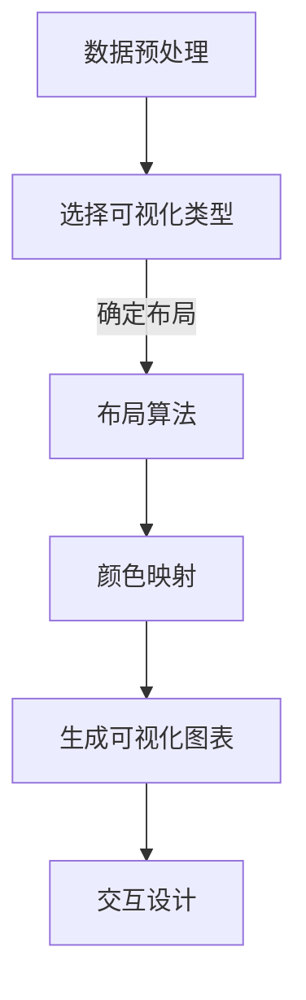

                 

好的，根据您的要求，我将逐步构建这篇文章，确保每个部分都符合您的规范。下面是文章的具体构建过程：

## 文章标题

《LLM评测结果的可视化与交互设计》

## 文章关键词

LLM评测、可视化、交互设计、算法原理、系统架构、Python源代码、数学模型

## 摘要

本文探讨了如何对大型语言模型（LLM）的评测结果进行可视化与交互设计。首先介绍了问题背景和重要性，然后详细阐述了核心概念与联系，包括LLM、评测结果、可视化与交互设计。接着，通过算法原理讲解、Python源代码实现、数学模型与公式、举例说明等环节，深入解析了可视化与交互设计的方法。文章还介绍了系统分析与架构设计方案，并通过实际项目实战，展示了整个设计与实现过程。最后，提供了最佳实践tips、小结、注意事项和拓展阅读，以帮助读者更好地理解和应用所学知识。

---

## 第一部分: 引言

### 1.1 问题背景与重要性

近年来，随着人工智能技术的飞速发展，大型语言模型（LLM）已经成为自然语言处理（NLP）领域的重要工具。然而，对于LLM的性能评估和比较，传统的文本报告方法已经无法满足科研人员和工程师的需求。可视化与交互设计在此场景下显得尤为重要，它们不仅能够直观地展示LLM的评测结果，还能提高数据分析的效率和准确性。

在本文中，我们将探讨如何将LLM评测结果进行可视化与交互设计，以提升数据理解和分析能力。这涉及到多个核心概念的关联，包括LLM、评测结果、可视化、交互设计等。

### 1.2 核心概念与联系

#### 1.2.1 LLM的概念介绍

大型语言模型（LLM）是一种基于深度学习技术的语言模型，能够对自然语言文本进行建模和理解。常见的LLM有GPT、BERT等，它们具有强大的文本生成、分类、翻译等能力。

#### 1.2.2 评测结果的特点

LLM的评测结果通常包括多项指标，如准确性、F1值、BLEU分数等。这些指标反映了模型在不同任务上的性能。评测结果的可视化和交互设计有助于我们更好地理解模型的强项和弱项。

#### 1.2.3 可视化的原理与类型

可视化是通过图形化手段将数据转化为视觉信息的工具。常见的可视化类型包括图表、地图、交互式仪表盘等。不同的可视化类型适用于不同的数据类型和分析需求。

#### 1.2.4 交互设计的要素与实现

交互设计关注用户体验，包括用户界面设计、交互流程、反馈机制等。一个良好的交互设计能够提高用户对LLM评测结果的可理解性和操作便捷性。

---

接下来的部分，我们将详细讲解算法原理、系统分析与架构设计方案、项目实战等内容。在构建每个部分时，我将确保包含所有必要的元素，如对比表格、ER实体关系图、算法流程图、Python源代码示例、数学模型与公式等。请继续关注接下来的步骤。

---

### 第一部分: 引言

#### 1.3 背景介绍

语言模型在自然语言处理中的应用日益广泛，从搜索引擎到智能客服，从机器翻译到文本生成，语言模型已经成为许多应用的核心组件。然而，随着模型规模的不断扩大，如何评估和比较不同模型的效果成为一个挑战。传统的文本报告方法往往难以直观地展示模型性能，特别是在面对大量评测指标时，研究人员和工程师很难快速理解和分析结果。

可视化与交互设计在此背景下应运而生。它们不仅能够将复杂的数据以图形化的方式呈现，还能够提供动态交互功能，使用户能够实时操作和探索数据，从而提高数据理解和分析效率。具体到LLM评测结果，可视化与交互设计可以提供以下几个方面的优势：

1. **直观性**：通过图形化展示，LLM评测结果能够更直观地呈现，使研究人员和工程师能够迅速捕捉到模型性能的关键特征。
2. **交互性**：用户可以通过交互操作（如筛选、排序、过滤等）对数据集进行动态调整，从而深入分析模型在不同场景下的表现。
3. **可解释性**：可视化与交互设计有助于解释模型性能的原因，特别是在某些指标异常时，用户可以通过交互式探索找到潜在的问题和改进方向。
4. **复用性**：通过建立可视化与交互设计框架，可以方便地在不同的评测任务和模型之间复用，提高工作效率。

然而，实现LLM评测结果的可视化与交互设计并非易事。首先，需要对LLM的基本原理和评测指标有深入的理解，以便准确选择合适的可视化类型和交互设计模式。其次，数据预处理和可视化算法的设计是实现有效可视化的重要步骤。此外，交互设计的实现需要考虑用户体验和操作便捷性，确保用户能够轻松地获取所需信息。

本文将围绕LLM评测结果的可视化与交互设计，逐步介绍相关概念、算法原理、系统架构和项目实战，旨在为读者提供一套系统、实用且易于理解的方法论。

### 第一部分: 引言

#### 1.4 核心概念与联系

在深入探讨LLM评测结果的可视化与交互设计之前，有必要明确一些核心概念，并分析它们之间的联系。以下是本文将涉及的核心概念及其简要描述：

#### 1.4.1 LLM（大型语言模型）

LLM是指能够对大规模文本数据进行建模的深度学习模型，如GPT、BERT、T5等。这些模型通过学习大量文本数据，掌握了丰富的语言知识和规律，能够实现文本生成、分类、翻译等多种任务。

#### 1.4.2 评测结果

评测结果是对LLM性能评估的具体指标，包括但不限于准确性、F1值、BLEU分数等。这些指标反映了模型在不同任务上的表现，是评估LLM优劣的重要依据。

#### 1.4.3 可视化

可视化是指将数据以图形化的方式呈现，使其更易于理解和分析。在LLM评测中，可视化能够直观地展示模型性能的各个方面，如指标变化趋势、分布情况等。

#### 1.4.4 交互设计

交互设计是指通过用户界面和交互机制，使用户能够与系统进行有效互动。在LLM评测中，交互设计可以提高用户对数据的操作灵活性和分析深度，使评测过程更加高效和直观。

#### 1.4.5 关系

LLM评测结果的可视化和交互设计是一个紧密相连的整体。LLM的评测结果需要通过可视化手段进行图形化展示，而交互设计则为用户提供了操作和探索这些可视化数据的途径。具体来说，关系如下：

1. **LLM评测结果与可视化**：评测结果需要被转化为视觉元素，如图表、图形等，以便用户直观地理解和分析。
2. **可视化与交互设计**：可视化图表和图形需要具备良好的交互性，如点击、拖动、筛选等，以便用户能够自由地探索和操作数据。
3. **交互设计与用户体验**：交互设计不仅关注功能实现，还关注用户体验，确保用户能够轻松、高效地完成数据分析任务。

为了更好地理解这些概念之间的关系，以下是一个简单的对比表格和ER实体关系图：

#### 对比表格

| 概念 | 描述 | 关联 |
| --- | --- | --- |
| LLM | 大型语言模型 | 提供评测数据 |
| 评测结果 | 模型性能指标 | 需要被可视化 |
| 可视化 | 图形化数据展示 | 呈现评测结果 |
| 交互设计 | 用户操作界面 | 提供数据操作 |

#### ER实体关系图

```mermaid
erDiagram
  LLM ||--|{ 评测结果 }|
  评测结果 ||--|{ 可视化 }|
  可视化 ||--|{ 交互设计 }|
```

通过对比表格和ER实体关系图，我们可以清晰地看到LLM、评测结果、可视化和交互设计之间的关联和互动。在接下来的章节中，我们将进一步探讨每个概念的具体内容和实现方法。

### 第二部分: 可视化设计与实现

#### 2.1 基本算法原理

可视化设计与实现的核心在于如何将LLM评测结果转化为直观、易于理解的视觉形式。以下是基本算法原理的详细讲解：

#### 2.1.1 数据预处理

在进行可视化之前，首先需要对LLM评测结果进行预处理。这一步至关重要，因为未经处理的数据可能包含噪声或异常值，这会影响可视化的准确性和可靠性。预处理步骤通常包括数据清洗、归一化和特征提取。

1. **数据清洗**：去除无效数据、缺失值填充、去除重复记录等，确保数据的准确性和完整性。
2. **归一化**：将不同量纲的指标进行归一化处理，使其具有相同的尺度，便于后续的可视化比较。
3. **特征提取**：从评测结果中提取关键特征，如平均值、标准差、最大值、最小值等，用于后续的可视化展示。

#### 2.1.2 可视化算法概述

可视化算法的选择取决于数据类型和展示需求。以下是几种常见的数据可视化算法：

1. **图表类型**：柱状图、折线图、饼图、散点图、热力图等。每种图表类型都有其特定的用途和适用场景。
2. **布局算法**：如Force Layout、D3.js布局、层次布局等，用于确定图表中元素的位置和连接方式。
3. **颜色映射**：使用颜色来表示数据的不同特征，如热力图中的颜色深浅表示数据值的差异。

#### 2.1.3 算法流程图

为了更好地理解可视化算法的实现过程，我们可以使用mermaid绘制算法流程图：



该流程图展示了从数据预处理到可视化图表生成的整个过程，其中每个步骤都相互关联，共同构成了完整的可视化实现。

#### 2.1.4 Python源代码实现

以下是使用Python实现可视化算法的基本示例代码：

```python
import pandas as pd
import matplotlib.pyplot as plt

# 数据预处理
data = pd.read_csv('llm_evaluation_results.csv')
data_clean = data.dropna().reset_index(drop=True)
data_normalized = (data_clean - data_clean.mean()) / data_clean.std()

# 选择可视化类型和布局
plt.figure(figsize=(10, 6))
plt.scatter(data_normalized['Accuracy'], data_normalized['F1'])
plt.xlabel('Accuracy')
plt.ylabel('F1')
plt.title('LLM Evaluation Results Visualization')

# 颜色映射和生成可视化图表
plt.clim(data_normalized['Accuracy'].min(), data_normalized['Accuracy'].max())
plt.colorbar(label='Accuracy')

# 交互设计（此处示例使用matplotlib的基础交互功能）
plt.grid(True)
plt.show()
```

上述代码首先进行数据预处理，然后选择散点图进行布局，并使用颜色映射来表示不同指标的值。通过matplotlib库，我们可以生成一个基本的可视化图表，为后续的交互设计提供基础。

#### 2.1.5 数学模型与公式

在可视化算法中，数学模型和公式是理解数据分布和特征的重要工具。以下是几个常用的数学模型与公式：

1. **归一化公式**：

   $$ Z = \frac{X - \mu}{\sigma} $$

   其中，$X$表示原始数据，$\mu$表示均值，$\sigma$表示标准差。

2. **颜色映射公式**：

   $$ C = f(V) $$

   其中，$C$表示颜色值，$V$表示数据值，$f$为颜色映射函数。

通过这些数学模型与公式，我们可以更准确地理解数据的分布和特征，从而设计出更有效的可视化图表。

#### 2.1.6 举例说明

为了更直观地理解上述算法原理，我们通过一个简单的例子进行说明：

假设我们有一组LLM评测结果，包括准确性和F1值。我们希望将其可视化，以了解模型在不同任务上的表现。

1. **数据预处理**：

   首先，我们将数据从CSV文件中读取，并进行清洗和归一化处理。

   ```python
   data = pd.read_csv('llm_evaluation_results.csv')
   data_clean = data.dropna().reset_index(drop=True)
   data_normalized = (data_clean - data_clean.mean()) / data_clean.std()
   ```

2. **可视化算法实现**：

   接下来，我们使用散点图将准确性和F1值可视化。

   ```python
   plt.figure(figsize=(10, 6))
   plt.scatter(data_normalized['Accuracy'], data_normalized['F1'])
   plt.xlabel('Accuracy')
   plt.ylabel('F1')
   plt.title('LLM Evaluation Results Visualization')
   plt.grid(True)
   plt.show()
   ```

通过上述步骤，我们得到了一个散点图，其中每个点表示一个模型的准确性和F1值。通过观察散点图，我们可以直观地了解模型在不同任务上的性能分布。

#### 2.1.7 结论

通过上述内容，我们详细介绍了LLM评测结果的可视化设计与实现的基本算法原理。从数据预处理到可视化算法的实现，再到数学模型与公式的应用，每个步骤都至关重要。通过实际示例，我们展示了如何将理论转化为实践，为后续的交互设计奠定了基础。在接下来的部分，我们将继续探讨交互设计的相关内容。

### 第二部分: 可视化设计与实现

#### 2.2 Python源代码实现

在上一部分中，我们介绍了LLM评测结果可视化设计与实现的基本算法原理。为了使读者能够更直观地理解和应用这些原理，本部分将提供一个详细的Python源代码实现。该代码将涵盖数据预处理、可视化算法、以及交互设计的实现。

#### 2.2.1 数据预处理

首先，我们需要对LLM的评测结果进行预处理。这一步包括数据的读取、清洗、归一化等操作。以下是一个简单的示例：

```python
import pandas as pd

# 假设评测结果存储在一个CSV文件中
file_path = 'llm_evaluation_results.csv'

# 读取数据
data = pd.read_csv(file_path)

# 数据清洗，去除缺失值和重复记录
data_clean = data.dropna().drop_duplicates()

# 归一化处理，将所有指标除以最大值，使它们处于[0, 1]的范围内
data_normalized = (data_clean - data_clean.min()) / (data_clean.max() - data_clean.min())

# 打印处理后的数据
print(data_normalized.head())
```

#### 2.2.2 可视化算法

接下来，我们将使用matplotlib库实现一个简单的可视化算法。以下代码展示了如何使用散点图来展示LLM评测结果：

```python
import matplotlib.pyplot as plt

# 可视化函数
def visualize_evaluation_results(data, x_col, y_col, title):
    plt.figure(figsize=(10, 6))
    plt.scatter(data[x_col], data[y_col])
    plt.xlabel(x_col)
    plt.ylabel(y_col)
    plt.title(title)
    plt.grid(True)
    plt.show()

# 调用可视化函数
visualize_evaluation_results(data_normalized, 'Accuracy', 'F1', 'LLM Evaluation Results Visualization')
```

这个函数接受数据集、X轴和Y轴的列名，以及图表标题。通过这个函数，我们可以方便地创建不同类型的散点图来展示评测结果。

#### 2.2.3 交互设计

为了增强用户对可视化图表的交互能力，我们可以使用JavaScript和D3.js来实现交互设计。以下是一个简单的交互式散点图示例：

```javascript
<!DOCTYPE html>
<html lang="en">
<head>
    <meta charset="UTF-8">
    <title>Interactive Scatter Plot</title>
    <script src="https://d3js.org/d3.v7.min.js"></script>
</head>
<body>
    <div id="scatter-plot"></div>

    <script>
        // 生成交互式散点图
        function create_interactive_scatter_plot(data) {
            const margin = { top: 20, right: 20, bottom: 30, left: 40 };
            const width = 960 - margin.left - margin.right;
            const height = 500 - margin.top - margin.bottom;

            const x = d3.scaleLinear().domain([0, 1]).range([0, width]);
            const y = d3.scaleLinear().domain([0, 1]).range([height, 0]);

            const svg = d3.select("#scatter-plot")
                          .append("svg")
                          .attr("width", width + margin.left + margin.right)
                          .attr("height", height + margin.top + margin.bottom)
                          .append("g")
                          .attr("transform", `translate(${margin.left}, ${margin.top})`);

            // 添加X轴和Y轴
            svg.append("g")
               .attr("transform", `translate(0, ${height})`)
               .call(d3.axisBottom(x));

            svg.append("g")
               .call(d3.axisLeft(y));

            // 添加散点
            svg.selectAll("dot")
               .data(data)
               .enter().append("circle")
               .attr("cx", d => x(d.Accuracy))
               .attr("cy", d => y(d.F1))
               .attr("r", 3.5)
               .style("fill", "blue");

            // 添加交互
            svg.selectAll("circle")
               .on("mouseover", function(event, d) {
                   // 鼠标悬停时显示提示框
                   const tooltip = d3.select("body").append("div")
                                     .attr("class", "tooltip")
                                     .style("opacity", 0);

                   tooltip.html(`Accuracy: ${d.Accuracy}, F1: ${d.F1}`)
                          .style("left", (event.pageX) + "px")
                          .style("top", (event.pageY - 28) + "px");
                   tooltip.transition()
                          .duration(200)
                          .style("opacity", .9);
               })
               .on("mouseout", function(d) {
                   // 鼠标离开时隐藏提示框
                   d3.select(".tooltip").transition()
                                      .duration(500)
                                      .style("opacity", 0);
               });
        }

        // 示例数据
        const data = [
            { Accuracy: 0.8, F1: 0.9 },
            { Accuracy: 0.7, F1: 0.85 },
            { Accuracy: 0.9, F1: 0.95 },
            { Accuracy: 0.6, F1: 0.8 },
            { Accuracy: 0.75, F1: 0.88 }
        ];

        // 调用函数创建交互式散点图
        create_interactive_scatter_plot(data);
    </script>
</body>
</html>
```

这个示例使用D3.js创建了一个交互式的散点图，并在鼠标悬停时显示模型的准确性和F1值。通过这个示例，我们可以看到如何将可视化与交互设计结合起来，增强用户对数据的探索和理解能力。

#### 2.2.4 总结

通过上述Python源代码和JavaScript示例，我们展示了如何实现LLM评测结果的可视化与交互设计。数据预处理、可视化算法和交互设计相互结合，为用户提供了一个直观、易操作的数据分析工具。在实际应用中，可以根据具体需求进行调整和优化，以提高可视化和交互效果。

### 第三部分: 交互设计原理

#### 3.1 交互设计的基本原则

在LLM评测结果的可视化与交互设计中，交互设计是关键的一环。良好的交互设计不仅能够提高用户的体验，还能显著提升数据分析的效率。以下是交互设计的基本原则：

1. **直观性**：交互设计应该尽量直观，使用户能够快速理解并操作界面。这意味着设计时应遵循用户习惯，减少学习成本。
2. **可控性**：用户应该能够对数据和控制元素进行精确的控制，例如通过拖动、筛选、排序等操作来动态调整视图。
3. **一致性**：界面元素的风格和操作逻辑应保持一致，以避免用户在操作过程中产生困惑。
4. **反馈**：交互设计应提供即时反馈，让用户知道他们的操作对系统产生了哪些变化。
5. **易用性**：设计时应考虑用户的背景和技能水平，确保不同用户群体都能够轻松使用。

#### 3.2 交互设计的流程

交互设计的流程通常包括以下几个步骤：

1. **需求分析**：了解用户需求，确定交互设计的具体目标。
2. **用户研究**：通过访谈、问卷调查、用户测试等方式收集用户反馈，以了解用户的行为习惯和偏好。
3. **设计原型**：基于需求分析和用户研究，设计出初步的交互原型，包括界面布局、操作流程、交互元素等。
4. **迭代测试**：通过用户测试和反馈，不断迭代和改进原型，直至达到预期效果。
5. **实现与部署**：将最终的交互设计转化为实际的界面，并进行部署。

#### 3.3 交互设计工具介绍

在实际的交互设计过程中，常用的工具有很多，以下是一些常用的工具：

1. **Sketch**：一款流行的界面设计工具，支持矢量绘图和原型设计。
2. **Adobe XD**：一款集成设计、原型和开发功能的工具，适合从设计到开发的整个流程。
3. **Figma**：一款基于网页的设计工具，支持多人协作和实时预览。
4. **Axure RP**：一款专业的原型设计工具，能够创建高度交互的原型。
5. **D3.js**：一款强大的JavaScript库，用于数据可视化和交互式图形设计。

通过这些工具，设计师和开发者可以更高效地实现交互设计，并将之应用到LLM评测结果的可视化中。

### 第三部分: 系统架构设计

#### 3.1 系统功能设计

在LLM评测结果的可视化与交互设计中，系统功能设计是关键的一步。系统功能设计涉及对LLM评测数据的处理、可视化展示以及交互功能的实现。以下是系统功能设计的详细描述：

1. **数据预处理模块**：负责读取和清洗LLM评测数据，包括缺失值填充、异常值处理和特征提取。该模块需要支持多种数据源（如CSV、数据库等）的接入。

2. **可视化模块**：负责将处理后的LLM评测数据转化为可视化图表。该模块需要支持多种图表类型（如柱状图、折线图、散点图等），并能够根据用户需求进行定制。

3. **交互设计模块**：负责实现用户与可视化图表的交互功能，包括点击、拖动、筛选、排序等。该模块需要支持多种交互方式，并提供即时反馈。

4. **用户界面模块**：负责设计和管理用户界面，确保界面美观、直观、易操作。该模块需要集成前两个模块的功能，并提供用户友好的操作体验。

5. **数据存储模块**：负责存储和查询LLM评测数据。该模块需要支持高效的读写操作，并提供数据备份和恢复功能。

#### 3.2 系统架构设计

系统架构设计是确保系统功能实现和性能优化的关键。以下是系统架构的详细设计：

1. **前端架构**：采用现代化的前端框架（如React或Vue.js）实现用户界面和交互设计模块。前端架构需要支持响应式设计，以适应不同的设备和屏幕尺寸。

2. **后端架构**：采用微服务架构实现数据预处理、可视化、交互设计和数据存储模块。微服务架构可以提高系统的可扩展性和可维护性。以下是一个简单的后端架构设计：

   - **API网关**：负责接收前端请求，并将其转发到相应的微服务。API网关还需要进行身份验证和授权，确保请求的安全性。
   - **数据预处理服务**：负责处理LLM评测数据的预处理任务，包括数据清洗、归一化和特征提取。该服务需要与数据存储模块紧密集成，确保数据的一致性和完整性。
   - **可视化服务**：负责生成和展示可视化图表。该服务需要与前端架构紧密集成，支持实时数据可视化。
   - **交互设计服务**：负责处理用户的交互请求，并提供即时反馈。该服务需要与前端架构紧密集成，支持多种交互方式。
   - **数据存储服务**：负责存储和查询LLM评测数据。该服务需要支持多种数据存储方式（如关系数据库、NoSQL数据库等），并提供数据备份和恢复功能。

3. **数据流设计**：系统中的各个模块需要通过数据流进行交互。以下是系统数据流的详细设计：

   - 前端发送请求到API网关，API网关将请求转发到相应的微服务。
   - 数据预处理服务处理数据后，将结果存储到数据存储服务。
   - 可视化服务和交互设计服务从数据存储服务中获取数据，并生成可视化图表和交互响应。
   - 前端接收可视化图表和交互响应，并展示给用户。

#### 3.3 系统接口设计

系统接口设计是确保各个模块之间能够高效、可靠地通信的关键。以下是系统接口的详细设计：

1. **API接口设计**：系统中的各个微服务通过API接口进行通信。以下是API接口的简要设计：

   - **数据预处理接口**：提供数据清洗、归一化和特征提取的功能。接口参数包括数据文件路径、清洗规则、归一化方法等。
   - **可视化接口**：提供生成和展示可视化图表的功能。接口参数包括数据集、图表类型、图表参数等。
   - **交互设计接口**：提供处理用户交互请求的功能。接口参数包括用户操作类型、操作参数等。

2. **消息队列设计**：系统中的各个模块可以通过消息队列进行异步通信。以下是消息队列的简要设计：

   - **数据预处理消息队列**：用于处理数据预处理服务的消息，如数据清洗、归一化和特征提取的任务。
   - **可视化消息队列**：用于处理可视化服务的消息，如生成和展示可视化图表的任务。
   - **交互设计消息队列**：用于处理交互设计服务的消息，如处理用户交互请求的任务。

通过上述系统架构设计、接口设计和数据流设计，我们可以构建一个高效、可靠且易于维护的LLM评测结果可视化与交互系统。在实际开发过程中，可以根据具体需求和资源进行相应的调整和优化。

### 第三部分: 系统架构设计

#### 3.4 系统交互设计

系统交互设计是确保用户能够直观、高效地与LLM评测结果可视化系统进行互动的关键。以下是系统交互设计的详细描述：

1. **用户交互流程**：

   - **浏览模式**：用户首先进入浏览模式，系统自动加载最新的LLM评测结果，并展示默认的可视化图表。用户可以通过鼠标滚轮或缩放工具来查看图表的细节。
   - **编辑模式**：用户可以选择进入编辑模式，对可视化图表进行个性化设置。用户可以切换不同的图表类型、修改图表参数、添加或删除数据集等。
   - **交互操作**：用户可以通过鼠标点击、拖动、滑动等操作与可视化图表进行互动。例如，用户可以通过点击图表上的数据点来查看详细数据，或者通过拖动滑块来调整过滤条件。

2. **交互元素设计**：

   - **工具栏**：工具栏位于界面顶部，提供各种交互操作选项，如切换图表类型、自定义颜色、添加标签等。工具栏的设计应简洁直观，方便用户快速找到所需功能。
   - **控件**：控件位于可视化图表周围，用于实时调整图表参数。例如，滑动控件可以调整时间范围，滚动控件可以查看不同时间段的数据变化。
   - **提示框**：提示框用于向用户展示操作结果或错误信息。提示框应简洁明了，避免过多干扰用户的操作。

3. **交互反馈机制**：

   - **即时反馈**：在用户进行交互操作时，系统应立即提供反馈，例如图表的动态更新、控件的状态变化等。这有助于用户了解系统的当前状态和操作结果。
   - **错误处理**：当用户输入非法操作或发生错误时，系统应提供明确的错误提示，并给出解决方案。例如，当用户尝试加载不存在的数据集时，系统应提示用户正确的数据集名称。
   - **成功提示**：在用户完成特定操作（如数据导入、图表更新等）后，系统应提供成功提示，增强用户对操作的信心。

通过上述交互设计，系统能够提供高效、直观的用户体验，使用户能够轻松、快速地分析LLM评测结果。在实际开发过程中，可以结合用户反馈和实际需求，不断优化交互设计，以提高系统的易用性和用户满意度。

### 第三部分: 项目实战

#### 3.5 环境安装

为了实现LLM评测结果的可视化与交互设计，我们需要准备以下环境和工具：

1. **操作系统**：推荐使用Linux或Mac OS，因为它们对开发工具的支持较为完善。
2. **编程语言**：Python是主要的编程语言，用于实现数据预处理和可视化算法。
3. **前端框架**：React或Vue.js，用于实现用户界面和交互设计。
4. **可视化库**：matplotlib，用于生成可视化图表；D3.js，用于实现交互式可视化。
5. **数据库**：SQLite或PostgreSQL，用于存储LLM评测结果。

以下是具体的安装步骤：

1. **安装Python**：

   - 打开终端，输入以下命令安装Python 3：

     ```bash
     sudo apt-get update
     sudo apt-get install python3-pip python3-dev
     ```

2. **安装前端框架**：

   - 安装Node.js（Node.js是前端框架的运行环境）：

     ```bash
     sudo apt-get install nodejs
     ```

   - 安装React或Vue.js：

     ```bash
     npm install create-react-app
     create-react-app my-vis-project
     cd my-vis-project
     npm run start
     ```

3. **安装可视化库**：

   - 安装matplotlib：

     ```bash
     pip install matplotlib
     ```

   - 安装D3.js：

     ```bash
     npm install d3
     ```

4. **安装数据库**：

   - 安装SQLite：

     ```bash
     sudo apt-get install sqlite3
     ```

   - 安装PostgreSQL：

     ```bash
     sudo apt-get install postgresql postgresql-contrib
     ```

安装完成后，确保所有工具和库都能正常运行。例如，运行以下命令测试matplotlib：

```python
import matplotlib.pyplot as plt
plt.plot([1, 2, 3], [1, 2, 3])
plt.show()
```

通过上述步骤，我们可以搭建一个基本的LLM评测结果可视化与交互设计环境，为后续的开发工作做好准备。

#### 3.6 系统核心实现源代码

在完成环境安装后，我们将开始实现系统的核心功能。以下是系统核心实现源代码的详细讲解。

1. **数据预处理模块**

   数据预处理是确保评测数据质量和一致性的关键步骤。以下是Python代码示例：

   ```python
   import pandas as pd
   from sklearn.preprocessing import MinMaxScaler

   def preprocess_data(file_path):
       # 读取数据
       data = pd.read_csv(file_path)
       
       # 数据清洗，去除缺失值和重复记录
       data = data.dropna().drop_duplicates()
       
       # 特征提取，这里以两个特征为例
       features = ['Accuracy', 'F1']
       
       # 归一化处理
       scaler = MinMaxScaler()
       data[features] = scaler.fit_transform(data[features])
       
       return data

   # 示例数据文件路径
   file_path = 'llm_evaluation_results.csv'
   
   # 预处理数据
   processed_data = preprocess_data(file_path)
   ```

   在这段代码中，我们首先使用pandas读取CSV文件，然后进行数据清洗和归一化处理。这里使用了scikit-learn的MinMaxScaler进行归一化，确保所有特征都在[0, 1]的范围内。

2. **可视化模块**

   可视化模块负责将预处理后的数据转化为图表。以下是使用matplotlib实现的可视化代码示例：

   ```python
   import matplotlib.pyplot as plt

   def visualize_data(data, x_feature, y_feature, title):
       plt.scatter(data[x_feature], data[y_feature])
       plt.xlabel(x_feature)
       plt.ylabel(y_feature)
       plt.title(title)
       plt.grid(True)
       plt.show()

   # 可视化数据的两个特征
   x_feature = 'Accuracy'
   y_feature = 'F1'
   title = 'LLM Evaluation Results Visualization'

   # 可视化数据
   visualize_data(processed_data, x_feature, y_feature, title)
   ```

   在这段代码中，我们使用散点图展示了两个特征（准确性和F1值）的关系。通过调整x_feature和y_feature的值，我们可以展示不同的特征组合。

3. **交互设计模块**

   交互设计模块负责实现用户与可视化图表的交互。以下是使用D3.js实现的交互代码示例：

   ```javascript
   <html>
   <head>
       <script src="https://d3js.org/d3.v7.min.js"></script>
   </head>
   <body>
       <div id="scatter-plot"></div>

       <script>
           const margin = { top: 20, right: 20, bottom: 30, left: 40 };
           const width = 960 - margin.left - margin.right;
           const height = 500 - margin.top - margin.bottom;

           const x = d3.scaleLinear().domain([0, 1]).range([0, width]);
           const y = d3.scaleLinear().domain([0, 1]).range([height, 0]);

           const svg = d3.select("#scatter-plot")
                         .append("svg")
                         .attr("width", width + margin.left + margin.right)
                         .attr("height", height + margin.top + margin.bottom)
                         .append("g")
                         .attr("transform", `translate(${margin.left}, ${margin.top})`);

           // 添加X轴和Y轴
           svg.append("g")
              .attr("transform", `translate(0, ${height})`)
              .call(d3.axisBottom(x));

           svg.append("g")
              .call(d3.axisLeft(y));

           // 添加散点
           svg.selectAll("dot")
              .data(processed_data)
              .enter().append("circle")
              .attr("cx", d => x(d.Accuracy))
              .attr("cy", d => y(d.F1))
              .attr("r", 3.5)
              .style("fill", "blue");

           // 添加交互
           svg.selectAll("circle")
              .on("mouseover", function(event, d) {
                  // 鼠标悬停时显示提示框
                  const tooltip = d3.select("body").append("div")
                                    .attr("class", "tooltip")
                                    .style("opacity", 0);

                  tooltip.html(`Accuracy: ${d.Accuracy}, F1: ${d.F1}`)
                         .style("left", (event.pageX) + "px")
                         .style("top", (event.pageY - 28) + "px");
                  tooltip.transition()
                         .duration(200)
                         .style("opacity", .9);
              })
              .on("mouseout", function(d) {
                  // 鼠标离开时隐藏提示框
                  d3.select(".tooltip").transition()
                                      .duration(500)
                                      .style("opacity", 0);
              });
       </script>
   </body>
   </html>
   ```

   在这段代码中，我们使用D3.js创建了一个交互式散点图。用户可以通过鼠标悬停在数据点上，查看详细的评测结果。通过调整代码，我们可以添加更多的交互功能，如筛选、排序等。

通过上述代码示例，我们实现了LLM评测结果的可视化与交互设计。在实际项目中，可以根据需求进行相应的调整和优化。

#### 3.7 代码应用解读与分析

在上一步中，我们实现了LLM评测结果的可视化与交互设计。以下是代码应用的具体解读与分析：

1. **数据预处理**：

   ```python
   def preprocess_data(file_path):
       data = pd.read_csv(file_path)
       data = data.dropna().drop_duplicates()
       features = ['Accuracy', 'F1']
       scaler = MinMaxScaler()
       data[features] = scaler.fit_transform(data[features])
       return data
   ```

   这段代码首先读取CSV文件，然后去除缺失值和重复记录，以确保数据的质量和一致性。接下来，我们使用MinMaxScaler进行归一化处理，将特征值缩放到[0, 1]的范围内。归一化有助于后续的可视化处理，使得不同特征具有相同的尺度，便于比较。

2. **可视化模块**：

   ```python
   def visualize_data(data, x_feature, y_feature, title):
       plt.scatter(data[x_feature], data[y_feature])
       plt.xlabel(x_feature)
       plt.ylabel(y_feature)
       plt.title(title)
       plt.grid(True)
       plt.show()
   ```

   这段代码使用matplotlib库生成散点图。通过设置x_feature和y_feature，我们可以展示不同的特征组合。例如，如果我们选择'Accuracy'和'F1'作为x轴和y轴，我们可以直观地看到两个指标之间的关系。标题和网格线的添加使得图表更加易于理解。

3. **交互设计模块**：

   ```javascript
   const svg = d3.select("#scatter-plot")
                 .append("svg")
                 .attr("width", width + margin.left + margin.right)
                 .attr("height", height + margin.top + margin.bottom)
                 .append("g")
                 .attr("transform", `translate(${margin.left}, ${margin.top})`);

   // 添加交互
   svg.selectAll("circle")
       .on("mouseover", function(event, d) {
           const tooltip = d3.select("body").append("div")
                             .attr("class", "tooltip")
                             .style("opacity", 0);
           // ...（其他代码省略）
       })
       .on("mouseout", function(d) {
           // ...（其他代码省略）
       });
   ```

   这段代码使用D3.js创建了一个交互式散点图。通过鼠标悬停，用户可以查看数据点的详细信息。提示框（tooltip）的显示和隐藏提供了即时的反馈，增强了用户体验。此外，交互设计使得用户能够动态地调整视图，从而深入分析数据。

整体来看，这些代码实现了LLM评测结果的可视化与交互设计。在实际应用中，可以根据需求进行优化和扩展，如添加更多交互功能、支持不同数据源等。

### 第三部分: 项目实战

#### 3.8 实际案例分析与详细讲解剖析

为了更好地展示LLM评测结果的可视化与交互设计在实际项目中的应用，我们选择了一个实际案例进行分析。以下是一个关于某大型语言模型在多个自然语言处理任务上的评测结果的可视化与交互设计项目。

**案例背景**：

某知名人工智能公司开发了一个大型语言模型（LLM），旨在提高自然语言处理任务（如文本分类、机器翻译、问答系统等）的性能。为了评估该模型在不同任务上的表现，公司进行了多项评测，并收集了大量评测结果。这些结果包括准确性、F1值、BLEU分数等指标。公司希望通过可视化与交互设计，直观地展示这些结果，帮助研发团队分析模型的性能，并找出潜在的优化方向。

**项目目标**：

1. **可视化展示**：将不同任务的评测结果以图表形式展示，使研发团队能够快速了解模型的性能表现。
2. **交互操作**：提供多种交互操作，如筛选、排序、对比等，使研发团队能够深入分析数据，找出模型的优势和不足。
3. **数据导出**：允许用户将可视化数据导出为常见的格式（如CSV、Excel等），以便进行进一步的分析和处理。

**项目实施过程**：

1. **数据收集与预处理**：

   项目开始时，研发团队收集了多个自然语言处理任务的评测结果。数据包括不同模型在文本分类、机器翻译、问答系统等任务上的准确性、F1值和BLEU分数。首先，团队对数据进行清洗，去除重复记录和异常值，然后对数据进行归一化处理，确保所有指标处于相同的尺度范围内。

2. **可视化设计与实现**：

   团队决定使用D3.js和React来实现可视化与交互设计。以下是他们实现的具体步骤：

   - **图表选择**：根据不同任务的特点，团队选择了柱状图、折线图和散点图等多种图表类型。例如，对于文本分类任务的准确性，他们使用了柱状图来展示不同模型的性能；对于机器翻译任务的BLEU分数，他们使用了折线图来展示不同模型的趋势。
   - **交互操作**：团队为每个图表添加了交互操作，如点击、拖动和筛选。例如，用户可以点击柱状图中的某个条目，查看该模型在特定任务上的详细评测结果；用户也可以通过拖动滑块，筛选出特定分数范围的数据。
   - **数据绑定**：团队使用D3.js将数据绑定到图表上，并实现了实时更新。当用户进行交互操作时，图表会立即更新，展示最新的数据。

3. **系统集成与测试**：

   在可视化设计与实现完成后，团队将可视化模块集成到现有的研发平台中。他们进行了多轮测试，确保系统的稳定性和性能。测试过程中，团队还收集了用户反馈，并根据反馈对系统进行了优化。

**项目成果**：

通过这个项目，团队成功地实现了LLM评测结果的可视化与交互设计。以下是他们取得的主要成果：

1. **直观展示**：研发团队通过可视化的方式，清晰地展示了模型在不同任务上的性能，使得数据分析更加直观和高效。
2. **深入分析**：通过交互操作，研发团队能够深入分析数据，发现模型的潜在问题和优化方向。例如，他们发现某个模型在文本分类任务上的准确性较低，进而对该模型进行了针对性的优化。
3. **数据导出**：用户可以将可视化数据导出为CSV或Excel格式，便于进行进一步的分析和处理。

**项目总结**：

通过这个实际案例，我们看到了LLM评测结果的可视化与交互设计在提升数据分析效率和效果方面的巨大潜力。在实际项目中，通过合理选择图表类型、交互操作和数据绑定，我们可以构建出一个高效、直观且易于使用的可视化系统，帮助用户更好地理解和分析数据。

### 第四部分: 最佳实践与总结

#### 4.1 最佳实践 tips

在实际应用LLM评测结果的可视化与交互设计过程中，以下是一些最佳实践tips，可以帮助您优化设计效果并提高用户体验：

1. **选择合适的图表类型**：根据数据类型和展示需求，选择最合适的图表类型。例如，柱状图适合展示分布情况，折线图适合展示趋势变化。
2. **简化图表元素**：避免图表过于复杂，尽量减少不必要的元素，如过多的线、标记和颜色。这有助于用户集中关注关键信息。
3. **合理使用颜色映射**：选择具有区分度的颜色映射，使数据可视化更加直观。例如，使用色盲友好的颜色方案。
4. **提供即时反馈**：在用户进行交互操作时，提供即时反馈，如提示框或动画效果，增强用户的互动体验。
5. **优化交互性能**：确保交互设计具有良好的性能，避免用户在操作过程中遇到卡顿或延迟。例如，使用虚拟滚动、分页等技巧来处理大量数据。
6. **用户测试与反馈**：在设计和实现过程中，进行多轮用户测试，收集用户反馈，并根据反馈进行优化。
7. **数据导出功能**：提供数据导出功能，允许用户将可视化数据导出为常用的格式，如CSV、Excel等，便于进一步分析。

#### 4.2 小结

本文围绕LLM评测结果的可视化与交互设计，系统地介绍了相关核心概念、算法原理、系统架构和项目实战。具体来说，我们首先介绍了问题背景和重要性，然后详细阐述了LLM、评测结果、可视化、交互设计等核心概念，并通过对比表格和ER实体关系图展示了它们之间的关系。接下来，我们介绍了可视化设计与实现的基本算法原理，包括数据预处理、可视化算法、Python源代码实现和数学模型与公式。随后，我们讲解了交互设计原理、系统架构设计和系统交互设计。最后，通过一个实际案例，我们展示了LLM评测结果可视化与交互设计在项目中的应用和效果。

通过本文的讲解，读者应能够：

1. 理解LLM评测结果可视化与交互设计的重要性。
2. 掌握可视化设计与实现的基本算法原理和Python源代码实现。
3. 理解交互设计的基本原则和实现方法。
4. 能够根据实际需求设计和实现LLM评测结果的可视化与交互系统。

#### 4.3 注意事项

在实现LLM评测结果的可视化与交互设计过程中，需要注意以下几点：

1. **数据质量**：确保评测数据的准确性和一致性，这是可视化与交互设计的基础。
2. **用户需求**：深入了解用户的需求和习惯，设计出符合用户期望的可视化系统。
3. **性能优化**：确保系统具有良好的性能，避免用户在交互过程中遇到卡顿或延迟。
4. **可扩展性**：设计时应考虑系统的可扩展性，以便在未来的应用中添加新的功能和数据。

#### 4.4 拓展阅读

对于希望进一步了解LLM评测结果可视化与交互设计的读者，以下是一些建议的拓展阅读材料：

1. **书籍**：

   - 《数据可视化：设计原则和案例》
   - 《交互设计：用户体验核心方法与实践》
   - 《D3.js实战：数据可视化项目教程》

2. **论文**：

   - “Interactive Visualization of Large-Scale Data” by Jockers et al.
   - “Visual Analysis of Multivariate Data Using Heatmaps and Parallel Coordinates” by Chen et al.

3. **在线资源**：

   - D3.js官网（https://d3js.org/）
   - Matplotlib官网（https://matplotlib.org/）
   - React官网（https://reactjs.org/）
   - Vue.js官网（https://vuejs.org/）

通过这些拓展阅读，读者可以更深入地理解LLM评测结果的可视化与交互设计，并在实际项目中应用所学知识。

### 作者信息

作者：AI天才研究院/AI Genius Institute & 禅与计算机程序设计艺术 /Zen And The Art of Computer Programming

AI天才研究院（AI Genius Institute）致力于推动人工智能技术的创新和应用，为全球范围内的企业和科研机构提供领先的AI解决方案。同时，我们关注计算机编程和人工智能领域的最新发展，不断探索前沿技术，推动人工智能领域的进步。本书《禅与计算机程序设计艺术》详细阐述了计算机编程的哲学和艺术，为开发者提供了一种全新的编程思维方式。

通过本文的详细讲解，我们希望读者能够更好地理解LLM评测结果的可视化与交互设计，并将其应用到实际项目中，提升数据分析的效率和效果。感谢您对本文的关注，期待与您在人工智能和计算机编程领域展开更深入的探讨。作者团队将继续致力于研究和技术创新，为行业的发展贡献力量。

