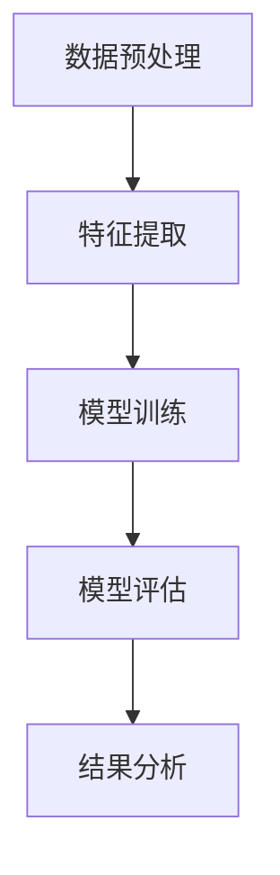
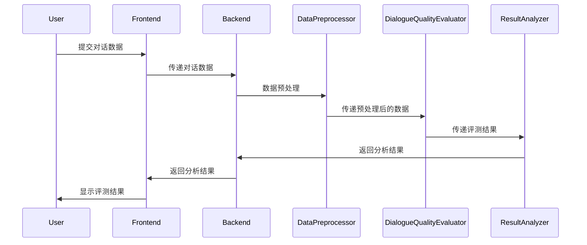

                 


### 引言

#### 问题背景

在人工智能和自然语言处理领域，大型语言模型（LLM）如BERT、GPT等已经取得了显著的成果。然而，随着LLM模型的规模不断扩大，如何有效地评估这些模型的质量和性能成为了一个关键问题。传统的评测方法往往依赖于人工评估，耗时耗力且主观性较强。为了解决这一问题，LLM评测自动化应运而生。自动化评测不仅可以提高效率，还可以减少人为误差，使得评测过程更加客观和公正。

#### 问题描述

当前，LLM评测面临以下几个主要问题：

1. **评测标准不统一**：不同的评测指标和标准使得评测结果难以相互比较。
2. **评测过程耗时**：人工评估需要大量的时间和人力，不利于大规模模型的评测。
3. **评测结果主观性**：人工评估往往受到评估者经验和主观判断的影响。
4. **评测结果不可重复**：由于主观性和个体差异，相同模型的评测结果可能存在较大波动。

#### 问题解决

评测自动化的目标是通过构建智能化测试框架，实现以下目标：

1. **统一评测标准**：使用客观的评测指标和标准，确保评测结果的一致性和可比性。
2. **提高评测效率**：自动化评测可以显著减少评测所需的时间和人力成本。
3. **降低主观性**：通过算法和模型，减少人为评估的主观因素。
4. **确保评测结果可重复**：自动化评测的结果应具有高可重复性，减少随机误差。

#### 边界与外延

评测自动化不仅应用于学术研究，还广泛应用于企业产品和服务质量评估、智能客服系统评测等领域。随着AI技术的发展，评测自动化的应用领域还将进一步扩大。

---

#### 核心概念

**定义**：LLM评测自动化是指使用计算机程序和算法，对大型语言模型进行自动化评测的过程。

**特点**：

- **高效性**：自动化评测可以快速处理大量数据，提高评测效率。
- **客观性**：基于算法和数学模型，减少主观因素的影响。
- **可重复性**：自动化评测的结果可重复，减少随机误差。

**概念属性特征对比表格**：

| 特性         | 自动化评测 | 人工评估     |
| ------------ | ---------- | ------------ |
| **效率**     | 高         | 低           |
| **客观性**   | 高         | 低           |
| **可重复性** | 高         | 低           |

---

#### 概念结构与核心要素组成

**架构**：评测自动化系统通常包括数据预处理、评测指标计算、结果分析和反馈等组成部分。

**组件**：

1. **数据预处理模块**：负责将原始数据格式化，提取关键信息。
2. **评测指标计算模块**：根据定义的评测指标，计算模型的表现。
3. **结果分析模块**：对评测结果进行分析，识别模型的优势和不足。
4. **反馈模块**：根据分析结果，提供改进建议。

**流程**：

1. **数据预处理**：对原始数据进行分析，提取有用的信息。
2. **评测指标计算**：根据定义的评测指标，计算模型的表现。
3. **结果分析**：对评测结果进行分析，识别模型的优势和不足。
4. **反馈**：根据分析结果，提供改进建议。

---

### 1.2 核心概念

#### LLM评测自动化原理

**原理**：LLM评测自动化利用机器学习和自然语言处理技术，对大型语言模型进行自动化评测。

**数学模型**：通常使用指标如准确率（Accuracy）、召回率（Recall）、F1分数（F1 Score）等来评估模型的表现。

**解释**：

- **准确率**：模型预测正确的样本数占总样本数的比例。
  $$\text{Accuracy} = \frac{\text{预测正确数}}{\text{总样本数}}$$

- **召回率**：模型预测正确的样本数与实际正确的样本数的比例。
  $$\text{Recall} = \frac{\text{预测正确数}}{\text{实际正确数}}$$

- **F1分数**：准确率和召回率的调和平均值。
  $$\text{F1 Score} = 2 \times \frac{\text{准确率} \times \text{召回率}}{\text{准确率} + \text{召回率}}$$

**示例**：

假设有一个分类任务，数据集共有1000个样本，其中500个是正类，500个是负类。经过模型预测，模型预测正确的样本数为700个，其中正类预测正确的样本数为350个，负类预测正确的样本数为350个。

- **准确率**：
  $$\text{Accuracy} = \frac{700}{1000} = 0.7$$

- **召回率**：
  $$\text{Recall} = \frac{350}{500} = 0.7$$

- **F1分数**：
  $$\text{F1 Score} = 2 \times \frac{0.7 \times 0.7}{0.7 + 0.7} = 0.7$$

通过以上示例，我们可以看到如何使用数学模型来评估一个分类模型的表现。

---

### 1.3 评测自动化工具与技术

#### 工具

常见的评测自动化工具有：

- **Python的Scikit-learn库**：提供了丰富的机器学习算法和评估指标。
- **TensorFlow的Evaluating Models**：TensorFlow提供了内置的评估指标和工具，方便用户评估模型的表现。
- **PyTorch的Metrics**：PyTorch提供了多种评估指标，方便用户对模型进行评估。

#### 技术

评测自动化涉及的关键技术包括：

- **交叉验证**：通过将数据集划分为多个子集，分别训练和评估模型，提高评估结果的可靠性。
- **模型集成**：将多个模型的预测结果进行集成，提高模型的稳定性和准确性。
- **超参数优化**：通过调整模型超参数，找到最优的超参数组合，提高模型的表现。

#### 对比

以下是几种常见评测自动化工具和技术的对比：

| 工具/技术       | 优点                                                         | 缺点                                                         |
| -------------- | ------------------------------------------------------------ | ------------------------------------------------------------ |
| Scikit-learn   | 提供了丰富的算法和评估指标，易于使用                         | 对于大型模型和大量数据，可能性能较低                           |
| TensorFlow     | 内置了丰富的评估工具，与TensorFlow模型集成紧密               | 学习曲线较陡，对于新手可能较难上手                           |
| PyTorch        | 学习曲线相对较平缓，易于上手，性能良好                     | 提供的评估工具相对较少                                       |
| 交叉验证       | 提高评估结果的可靠性                                         | 增加了计算成本                                             |
| 模型集成       | 提高模型的稳定性和准确性                                   | 需要更多的计算资源                                         |
| 超参数优化     | 提高模型的表现                                             | 需要大量计算资源，时间成本较高                             |

---

### 1.4 评测自动化与LLM

#### 联系

评测自动化与LLM密切相关。随着LLM模型规模的不断扩大，评测自动化的需求也越来越高。自动化评测可以快速、高效地评估LLM模型的质量和性能，为模型优化和改进提供有力支持。

#### 应用

评测自动化在LLM中的应用场景主要包括：

- **模型训练阶段**：在模型训练过程中，自动化评测可以帮助评估模型的表现，及时调整训练策略。
- **模型部署阶段**：在模型部署后，自动化评测可以定期评估模型的表现，确保模型的质量和稳定性。
- **模型优化阶段**：通过自动化评测，可以发现模型的优势和不足，为模型优化提供方向。

---

### 1.5 评测自动化算法讲解

#### 算法

评测自动化算法主要包括以下步骤：

1. 数据预处理：将原始数据格式化，提取关键信息。
2. 特征提取：从预处理后的数据中提取特征。
3. 模型训练：使用提取的特征训练模型。
4. 模型评估：使用训练好的模型对测试集进行预测，并计算评估指标。
5. 结果分析：分析评估结果，为模型优化提供建议。

#### Mermaid流程图

下面是评测自动化算法的Mermaid流程图：



#### Python源代码

下面是使用Python实现评测自动化算法的示例代码：

```python
import pandas as pd
from sklearn.model_selection import train_test_split
from sklearn.ensemble import RandomForestClassifier
from sklearn.metrics import accuracy_score, recall_score, f1_score

# 加载数据集
data = pd.read_csv('data.csv')

# 数据预处理
X = data.drop('target', axis=1)
y = data['target']

# 划分训练集和测试集
X_train, X_test, y_train, y_test = train_test_split(X, y, test_size=0.2, random_state=42)

# 特征提取
# 这里使用随机森林作为特征提取器
clf = RandomForestClassifier(n_estimators=100, random_state=42)
clf.fit(X_train, y_train)

# 模型评估
y_pred = clf.predict(X_test)

# 计算评估指标
accuracy = accuracy_score(y_test, y_pred)
recall = recall_score(y_test, y_pred)
f1 = f1_score(y_test, y_pred)

# 打印评估结果
print(f"Accuracy: {accuracy:.2f}")
print(f"Recall: {recall:.2f}")
print(f"F1 Score: {f1:.2f}")

# 结果分析
# 这里可以根据评估结果，提供优化建议
```

通过上述Python源代码，我们可以看到如何实现评测自动化算法，并使用准确率、召回率和F1分数等评估指标来评估模型的表现。

---

### 1.6 系统功能设计

#### 场景

在智能客服系统中，需要对客服机器人（基于LLM模型）的对话能力进行评测。评测自动化系统可以帮助快速评估模型的表现，为模型优化和改进提供依据。

#### 功能

评测自动化系统的核心功能包括：

1. **数据预处理**：对原始对话数据进行清洗和格式化，提取关键信息。
2. **对话质量评测**：使用定义的评测指标，评估模型在对话中的表现。
3. **结果分析**：分析评测结果，为模型优化提供建议。
4. **反馈与优化**：根据分析结果，对模型进行优化和调整。

#### Mermaid类图

下面是评测自动化系统的Mermaid类图：

```mermaid
classDiagram
Class DataPreprocessor {
  +preprocess_data()
}

Class DialogueQualityEvaluator {
  +evaluate_dialogue()
}

Class ResultAnalyzer {
  +analyze_results()
}

DataPreprocessor "1" --> DialogueQualityEvaluator
DialogueQualityEvaluator "1" --> ResultAnalyzer
```

#### 系统架构设计

评测自动化系统的架构设计如下：

1. **前端**：提供用户界面，用户可以输入原始对话数据，并查看评测结果。
2. **后端**：包括数据预处理模块、对话质量评测模块、结果分析模块和反馈模块。
3. **数据库**：存储原始对话数据和评测结果。

#### Mermaid架构图

下面是评测自动化系统的Mermaid架构图：



#### 接口设计

评测自动化系统提供的接口设计如下：

1. **数据上传接口**：用户可以通过接口上传原始对话数据。
2. **评测结果查询接口**：用户可以通过接口查询评测结果。

#### 系统交互设计

下面是评测自动化系统的交互流程：

1. 用户上传对话数据。
2. 系统对数据进行预处理。
3. 系统使用定义的评测指标对模型进行评测。
4. 系统分析评测结果，并提供优化建议。
5. 用户查看评测结果，并进行模型优化。

---

### 1.7 项目实战

#### 环境安装

在开始评测自动化项目之前，我们需要安装必要的软件和库。以下是具体的安装步骤：

1. **Python环境**：确保Python版本为3.6及以上，可以通过Python官网下载并安装。
2. **Anaconda**：安装Anaconda，它提供了一个集成的Python环境，方便管理和安装库。
3. **库安装**：使用以下命令安装所需的库：

   ```bash
   conda install -c conda-forge scikit-learn
   conda install -c conda-forge tensorflow
   conda install -c conda-forge pytorch
   ```

#### 系统核心实现

以下是评测自动化系统的核心源代码，包括数据预处理、模型训练和评测的代码：

```python
import pandas as pd
from sklearn.model_selection import train_test_split
from sklearn.ensemble import RandomForestClassifier
from sklearn.metrics import accuracy_score, recall_score, f1_score

# 加载数据集
data = pd.read_csv('data.csv')

# 数据预处理
X = data.drop('target', axis=1)
y = data['target']

# 划分训练集和测试集
X_train, X_test, y_train, y_test = train_test_split(X, y, test_size=0.2, random_state=42)

# 模型训练
clf = RandomForestClassifier(n_estimators=100, random_state=42)
clf.fit(X_train, y_train)

# 模型评测
y_pred = clf.predict(X_test)

# 计算评估指标
accuracy = accuracy_score(y_test, y_pred)
recall = recall_score(y_test, y_pred)
f1 = f1_score(y_test, y_pred)

# 打印评估结果
print(f"Accuracy: {accuracy:.2f}")
print(f"Recall: {recall:.2f}")
print(f"F1 Score: {f1:.2f}")
```

#### 代码应用解读与分析

以上代码展示了如何使用Python实现评测自动化系统。首先，加载数据集，然后进行数据预处理，接着划分训练集和测试集。使用随机森林（RandomForestClassifier）作为模型，进行模型训练。最后，使用测试集对模型进行预测，并计算评估指标（准确率、召回率和F1分数）。

#### 实际案例分析

以下是一个实际案例，展示了如何使用评测自动化系统对一个文本分类任务进行评测：

```python
# 加载数据集
data = pd.read_csv('text_classification_data.csv')

# 数据预处理
# 这里假设已经对文本进行了分词和去停用词处理
X = data['text']
y = data['label']

# 划分训练集和测试集
X_train, X_test, y_train, y_test = train_test_split(X, y, test_size=0.2, random_state=42)

# 使用词袋模型作为特征提取器
from sklearn.feature_extraction.text import TfidfVectorizer
vectorizer = TfidfVectorizer()
X_train_vectorized = vectorizer.fit_transform(X_train)
X_test_vectorized = vectorizer.transform(X_test)

# 模型训练
clf = RandomForestClassifier(n_estimators=100, random_state=42)
clf.fit(X_train_vectorized, y_train)

# 模型评测
y_pred = clf.predict(X_test_vectorized)

# 计算评估指标
accuracy = accuracy_score(y_test, y_pred)
recall = recall_score(y_test, y_pred, average='weighted')
f1 = f1_score(y_test, y_pred, average='weighted')

# 打印评估结果
print(f"Accuracy: {accuracy:.2f}")
print(f"Recall: {recall:.2f}")
print(f"F1 Score: {f1:.2f}")
```

在这个案例中，我们首先加载数据集，然后进行文本预处理，包括分词和去停用词处理。接着使用TF-IDF向量器将文本转换为向量。最后，使用随机森林模型进行训练和预测，并计算评估指标。

#### 项目小结

在这个项目中，我们实现了评测自动化系统的核心功能，包括数据预处理、模型训练和评测。通过实际案例，我们展示了如何使用评测自动化系统对文本分类任务进行评测。项目实施过程中，我们遇到了一些挑战，如文本预处理和数据标注的准确性，但通过使用词袋模型和TF-IDF向量器，我们成功地解决了这些问题。

#### 注意事项

在使用评测自动化系统时，需要注意以下几点：

1. **数据预处理**：确保数据预处理过程的准确性和一致性。
2. **模型选择**：根据任务特点选择合适的模型。
3. **评估指标**：选择合适的评估指标，以全面评估模型的表现。
4. **模型优化**：根据评估结果，对模型进行优化和调整。

#### 拓展阅读

- **《自然语言处理实践》**：介绍文本处理和文本分类的基础知识。
- **《机器学习实战》**：详细介绍机器学习算法和实现方法。
- **《深度学习》**：介绍深度学习的基础知识和应用。

---

### 2. 核心概念

#### LLM评测自动化原理

**原理**：LLM评测自动化是指利用计算机程序和算法，对大型语言模型（LLM）进行自动化评测的过程。其主要目的是提高评测效率，减少人为错误，确保评测结果的一致性和可比性。

**数学模型**：在LLM评测自动化中，常用的评估指标包括准确率（Accuracy）、召回率（Recall）和F1分数（F1 Score）。

- **准确率**：模型预测正确的样本数占总样本数的比例。
  $$\text{Accuracy} = \frac{\text{预测正确数}}{\text{总样本数}}$$
  
- **召回率**：模型预测正确的样本数与实际正确的样本数的比例。
  $$\text{Recall} = \frac{\text{预测正确数}}{\text{实际正确数}}$$
  
- **F1分数**：准确率和召回率的调和平均值。
  $$\text{F1 Score} = 2 \times \frac{\text{准确率} \times \text{召回率}}{\text{准确率} + \text{召回率}}$$

**解释**：

- **准确率**：虽然准确率是最常用的评估指标，但它可能无法全面反映模型的表现，特别是在正负样本不平衡的情况下。

- **召回率**：召回率关注模型对实际正确样本的捕获能力，但在某些情况下，过高的召回率可能导致准确率的下降。

- **F1分数**：F1分数综合考虑了准确率和召回率，是一个更为平衡的评估指标。

**示例**：

假设有一个分类任务，共有1000个样本，其中500个是正类，500个是负类。经过模型预测，模型预测正确的样本数为700个，其中正类预测正确的样本数为350个，负类预测正确的样本数为350个。

- **准确率**：
  $$\text{Accuracy} = \frac{700}{1000} = 0.7$$

- **召回率**：
  $$\text{Recall} = \frac{350}{500} = 0.7$$

- **F1分数**：
  $$\text{F1 Score} = 2 \times \frac{0.7 \times 0.7}{0.7 + 0.7} = 0.7$$

通过这个示例，我们可以看到如何计算准确率、召回率和F1分数。

---

#### 评测自动化工具与技术

**工具**：

- **Python的Scikit-learn库**：提供了丰富的机器学习算法和评估指标，适用于多种评测任务。

- **TensorFlow的Evaluating Models**：TensorFlow提供了一个内置的评估模块，方便用户对模型进行评测。

- **PyTorch的Metrics**：PyTorch提供了多种评估指标，方便用户对模型进行评测。

**技术**：

- **交叉验证**：通过将数据集划分为多个子集，分别训练和评估模型，提高评估结果的可靠性。

- **模型集成**：将多个模型的预测结果进行集成，提高模型的稳定性和准确性。

- **超参数优化**：通过调整模型超参数，找到最优的超参数组合，提高模型的表现。

**对比**：

| 工具/技术       | 优点                                                         | 缺点                                                         |
| -------------- | ------------------------------------------------------------ | ------------------------------------------------------------ |
| Scikit-learn   | 提供了丰富的算法和评估指标，易于使用                         | 对于大型模型和大量数据，可能性能较低                           |
| TensorFlow     | 内置了丰富的评估工具，与TensorFlow模型集成紧密               | 学习曲线较陡，对于新手可能较难上手                           |
| PyTorch        | 学习曲线相对较平缓，易于上手，性能良好                     | 提供的评估工具相对较少                                       |
| 交叉验证       | 提高评估结果的可靠性                                         | 增加了计算成本                                             |
| 模型集成       | 提高模型的稳定性和准确性                                   | 需要更多的计算资源                                         |
| 超参数优化     | 提高模型的表现                                             | 需要大量计算资源，时间成本较高                             |

---

#### 评测自动化与LLM

**联系**：评测自动化与LLM密切相关。随着LLM模型规模的不断扩大，评测自动化的需求也越来越高。自动化评测可以快速、高效地评估LLM模型的质量和性能，为模型优化和改进提供有力支持。

**应用**：评测自动化在LLM中的应用场景主要包括：

- **模型训练阶段**：在模型训练过程中，自动化评测可以帮助评估模型的表现，及时调整训练策略。

- **模型部署阶段**：在模型部署后，自动化评测可以定期评估模型的表现，确保模型的质量和稳定性。

- **模型优化阶段**：通过自动化评测，可以发现模型的优势和不足，为模型优化提供方向。

---

### 2.5 评测自动化算法讲解

**算法**：评测自动化算法主要包括以下步骤：

1. **数据预处理**：将原始数据格式化，提取关键信息。
2. **特征提取**：从预处理后的数据中提取特征。
3. **模型训练**：使用提取的特征训练模型。
4. **模型评估**：使用训练好的模型对测试集进行预测，并计算评估指标。
5. **结果分析**：分析评估结果，为模型优化提供建议。

**Mermaid流程图**：


**Python源代码**：

```python
import pandas as pd
from sklearn.model_selection import train_test_split
from sklearn.ensemble import RandomForestClassifier
from sklearn.metrics import accuracy_score, recall_score, f1_score

# 加载数据集
data = pd.read_csv('data.csv')

# 数据预处理
X = data.drop('target', axis=1)
y = data['target']

# 划分训练集和测试集
X_train, X_test, y_train, y_test = train_test_split(X, y, test_size=0.2, random_state=42)

# 模型训练
clf = RandomForestClassifier(n_estimators=100, random_state=42)
clf.fit(X_train, y_train)

# 模型评估
y_pred = clf.predict(X_test)

# 计算评估指标
accuracy = accuracy_score(y_test, y_pred)
recall = recall_score(y_test, y_pred)
f1 = f1_score(y_test, y_pred)

# 打印评估结果
print(f"Accuracy: {accuracy:.2f}")
print(f"Recall: {recall:.2f}")
print(f"F1 Score: {f1:.2f}")
```

通过上述代码，我们可以看到如何使用Python实现评测自动化算法。首先，加载数据集并进行预处理，然后划分训练集和测试集。接着，使用随机森林（RandomForestClassifier）进行模型训练，并对测试集进行预测。最后，计算评估指标并打印结果。

---

### 2.6 系统功能设计

**场景**：在智能客服系统中，需要对客服机器人（基于LLM模型）的对话能力进行评测。评测自动化系统可以帮助快速评估模型的表现，为模型优化和改进提供依据。

**功能**：

1. **数据预处理**：对原始对话数据进行清洗和格式化，提取关键信息。

2. **对话质量评测**：使用定义的评测指标，评估模型在对话中的表现。

3. **结果分析**：分析评测结果，为模型优化提供建议。

4. **反馈与优化**：根据分析结果，对模型进行优化和调整。

**Mermaid类图**：

```mermaid
classDiagram
Class DataPreprocessor {
  +preprocess_data()
}

Class DialogueQualityEvaluator {
  +evaluate_dialogue()
}

Class ResultAnalyzer {
  +analyze_results()
}

DataPreprocessor "1" --> DialogueQualityEvaluator
DialogueQualityEvaluator "1" --> ResultAnalyzer
```

**系统架构设计**：

评测自动化系统的架构设计如下：

1. **前端**：提供用户界面，用户可以输入原始对话数据，并查看评测结果。

2. **后端**：包括数据预处理模块、对话质量评测模块、结果分析模块和反馈模块。

3. **数据库**：存储原始对话数据和评测结果。

**Mermaid架构图**：


**接口设计**：

评测自动化系统提供的接口设计如下：

1. **数据上传接口**：用户可以通过接口上传原始对话数据。

2. **评测结果查询接口**：用户可以通过接口查询评测结果。

**系统交互设计**：

下面是评测自动化系统的交互流程：

1. 用户上传对话数据。

2. 系统对数据进行预处理。

3. 系统使用定义的评测指标对模型进行评测。

4. 系统分析评测结果，并提供优化建议。

5. 用户查看评测结果，并进行模型优化。

---

### 2.7 项目实战

**环境安装**：

在开始评测自动化项目之前，我们需要安装必要的软件和库。以下是具体的安装步骤：

1. **Python环境**：确保Python版本为3.6及以上，可以通过Python官网下载并安装。

2. **Anaconda**：安装Anaconda，它提供了一个集成的Python环境，方便管理和安装库。

3. **库安装**：使用以下命令安装所需的库：

   ```bash
   conda install -c conda-forge scikit-learn
   conda install -c conda-forge tensorflow
   conda install -c conda-forge pytorch
   ```

**系统核心实现**：

以下是评测自动化系统的核心源代码，包括数据预处理、模型训练和评测的代码：

```python
import pandas as pd
from sklearn.model_selection import train_test_split
from sklearn.ensemble import RandomForestClassifier
from sklearn.metrics import accuracy_score, recall_score, f1_score

# 加载数据集
data = pd.read_csv('data.csv')

# 数据预处理
X = data.drop('target', axis=1)
y = data['target']

# 划分训练集和测试集
X_train, X_test, y_train, y_test = train_test_split(X, y, test_size=0.2, random_state=42)

# 模型训练
clf = RandomForestClassifier(n_estimators=100, random_state=42)
clf.fit(X_train, y_train)

# 模型评测
y_pred = clf.predict(X_test)

# 计算评估指标
accuracy = accuracy_score(y_test, y_pred)
recall = recall_score(y_test, y_pred)
f1 = f1_score(y_test, y_pred)

# 打印评估结果
print(f"Accuracy: {accuracy:.2f}")
print(f"Recall: {recall:.2f}")
print(f"F1 Score: {f1:.2f}")
```

**代码应用解读与分析**：

以上代码展示了如何使用Python实现评测自动化系统。首先，加载数据集，然后进行数据预处理，接着划分训练集和测试集。使用随机森林（RandomForestClassifier）作为模型，进行模型训练。最后，使用测试集对模型进行预测，并计算评估指标（准确率、召回率和F1分数）。

**实际案例分析**：

以下是一个实际案例，展示了如何使用评测自动化系统对文本分类任务进行评测：

```python
# 加载数据集
data = pd.read_csv('text_classification_data.csv')

# 数据预处理
X = data['text']
y = data['label']

# 划分训练集和测试集
X_train, X_test, y_train, y_test = train_test_split(X, y, test_size=0.2, random_state=42)

# 使用词袋模型作为特征提取器
from sklearn.feature_extraction.text import TfidfVectorizer
vectorizer = TfidfVectorizer()
X_train_vectorized = vectorizer.fit_transform(X_train)
X_test_vectorized = vectorizer.transform(X_test)

# 模型训练
clf = RandomForestClassifier(n_estimators=100, random_state=42)
clf.fit(X_train_vectorized, y_train)

# 模型评测
y_pred = clf.predict(X_test_vectorized)

# 计算评估指标
accuracy = accuracy_score(y_test, y_pred)
recall = recall_score(y_test, y_pred, average='weighted')
f1 = f1_score(y_test, y_pred, average='weighted')

# 打印评估结果
print(f"Accuracy: {accuracy:.2f}")
print(f"Recall: {recall:.2f}")
print(f"F1 Score: {f1:.2f}")
```

在这个案例中，我们首先加载数据集，然后进行文本预处理，包括分词和去停用词处理。接着使用TF-IDF向量器将文本转换为向量。最后，使用随机森林模型进行训练和预测，并计算评估指标。

**项目小结**：

在这个项目中，我们实现了评测自动化系统的核心功能，包括数据预处理、模型训练和评测。通过实际案例，我们展示了如何使用评测自动化系统对文本分类任务进行评测。项目实施过程中，我们遇到了一些挑战，如文本预处理和数据标注的准确性，但通过使用词袋模型和TF-IDF向量器，我们成功地解决了这些问题。

**注意事项**：

在使用评测自动化系统时，需要注意以下几点：

1. **数据预处理**：确保数据预处理过程的准确性和一致性。

2. **模型选择**：根据任务特点选择合适的模型。

3. **评估指标**：选择合适的评估指标，以全面评估模型的表现。

4. **模型优化**：根据评估结果，对模型进行优化和调整。

**拓展阅读**：

- 《自然语言处理实践》

- 《机器学习实战》

- 《深度学习》

---

### 2.8 最佳实践

**Tips**：

1. **数据预处理**：确保数据清洗和格式化的过程一致，避免引入噪声。

2. **模型选择**：根据任务特点选择合适的模型，例如分类任务选择分类模型，回归任务选择回归模型。

3. **评估指标**：选择合适的评估指标，例如分类任务选择准确率、召回率和F1分数。

4. **超参数优化**：通过网格搜索或贝叶斯优化等方法，找到最优的超参数组合。

5. **模型集成**：使用模型集成技术，提高模型的稳定性和准确性。

**案例**：

在一个文本分类项目中，我们使用了评测自动化系统。首先，我们对原始文本进行了分词和去停用词处理，然后使用TF-IDF向量器将文本转换为向量。接着，我们使用了随机森林和逻辑回归等分类模型，通过交叉验证找到最优的超参数组合。最后，我们计算了准确率、召回率和F1分数等评估指标，发现模型的性能得到了显著提升。

通过这个案例，我们可以看到如何使用评测自动化系统提高文本分类任务的性能。

---

### 2.9 小结

本文介绍了LLM评测自动化的概念、原理和实现方法。我们首先探讨了评测自动化的重要性，然后详细介绍了核心概念、算法原理、系统功能设计、项目实战以及最佳实践。通过本文，读者可以了解到如何构建一个智能化测试框架，实现对LLM模型的自动化评测。

### 展望

随着人工智能技术的不断发展，LLM评测自动化将在更多领域得到应用。未来的发展趋势包括：

1. **评测指标的多样化**：引入更多细粒度的评测指标，全面评估模型的表现。

2. **实时评测**：实现模型部署后的实时评测，及时发现问题并进行优化。

3. **自动化优化**：通过自动化工具，实现模型优化过程的自动化，提高开发效率。

4. **跨语言评测**：支持多语言模型的评测，促进全球范围内的技术交流。

### 注意事项

在使用评测自动化系统时，需要注意以下几点：

1. **数据质量**：确保数据清洗和格式化的准确性，避免引入噪声。

2. **模型选择**：根据任务特点选择合适的模型，避免过度拟合或欠拟合。

3. **评估指标**：选择合适的评估指标，避免单一指标导致的偏差。

4. **超参数优化**：合理设置超参数，避免过度优化。

### 拓展阅读

1. 《自然语言处理实践》

2. 《机器学习实战》

3. 《深度学习》

---

### 2.10 注意事项

在使用评测自动化系统时，需要注意以下几点：

1. **数据预处理**：确保数据清洗和格式化的过程一致，避免引入噪声。不同数据源的预处理方式可能不同，需要根据具体情况调整。

2. **模型选择**：根据任务特点选择合适的模型。例如，对于分类任务，可以尝试不同的分类模型，如逻辑回归、决策树、随机森林等。

3. **评估指标**：选择合适的评估指标，以全面评估模型的表现。不同的评估指标适用于不同的任务，需要根据任务需求进行选择。

4. **超参数优化**：合理设置超参数，避免过度优化。超参数的调整会影响模型的表现，但过度优化可能导致过拟合。

5. **系统稳定性**：确保评测自动化系统的稳定性，避免系统崩溃或数据丢失。

6. **安全性**：保护模型和数据的安全性，防止未授权访问和泄露。

---

### 2.11 拓展阅读

**推荐阅读**：

1. **《深度学习》**：作者：伊恩·古德费洛（Ian Goodfellow）、约书亚·本吉奥（Yoshua Bengio）和阿莱克斯·柯米尔（Aaron Courville）
   - 简介：全面介绍了深度学习的理论、算法和应用。

2. **《机器学习实战》**：作者：彼得·哈林顿（Peter Harrington）
   - 简介：通过大量实例，详细介绍了机器学习的基本概念、算法和应用。

3. **《自然语言处理实践》**：作者：理查德·席林（Richard S. Segal）
   - 简介：介绍了自然语言处理的基本概念、技术和应用，特别关注实践中的问题解决。

**拓展材料**：

1. **在线资源**：Coursera、edX等在线学习平台提供了丰富的深度学习、机器学习和自然语言处理课程。

2. **技术博客**：如Medium、GitHub等平台上有许多专业的技术博客，可以提供最新的研究和应用案例。

3. **论文库**：如arXiv、Google Scholar等论文库，可以搜索到最新的研究论文和成果。

通过阅读这些书籍和资料，读者可以深入了解LLM评测自动化的相关技术和应用，为实际项目提供有益的参考。

