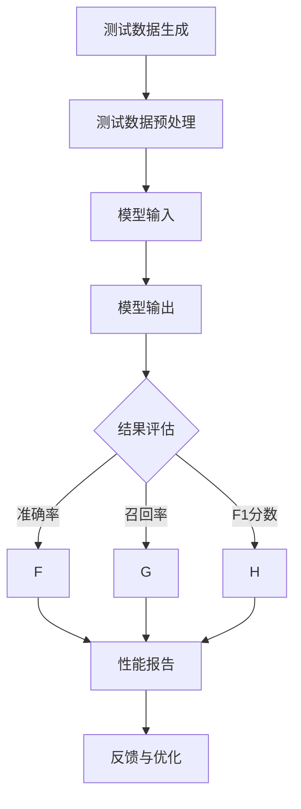
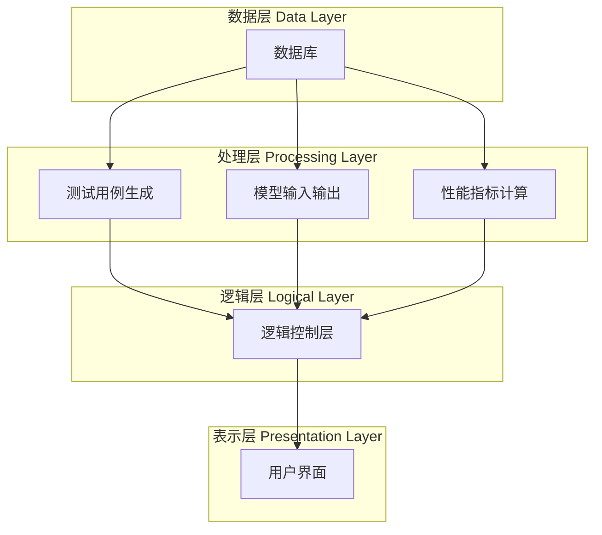
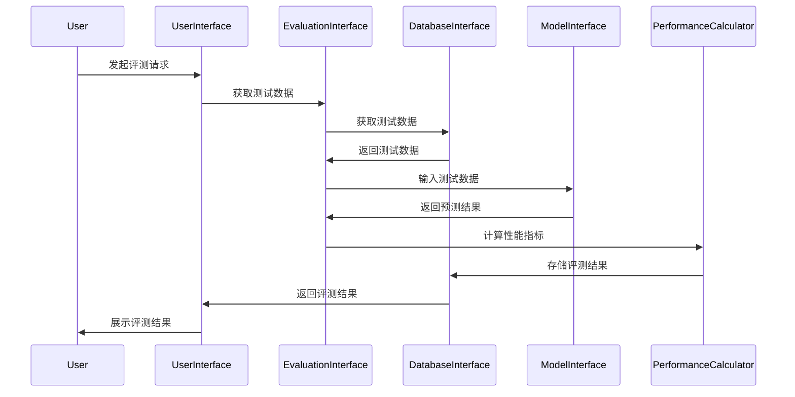

                 

### 引言

随着人工智能（AI）技术的飞速发展，自然语言处理（NLP）成为其中最具前景的领域之一。在大规模语言模型（LLM）的推动下，AI系统在文本生成、翻译、问答等多个任务上取得了显著成果。然而，LLM的应用不仅需要高质量的模型，还依赖于对模型性能的精确评估。这就引出了LLM评测自动化这一课题，其重要性在于：

1. **提高评测效率**：传统的LLM评测过程往往耗时耗力，自动化评测可以大幅减少人工干预，提高整体工作效率。
2. **确保评测质量**：自动化评测能够通过严格的标准和流程，确保评测结果的准确性和一致性，避免人为误差。
3. **支持持续改进**：自动化评测系统可以实时监控模型性能，为模型优化提供数据支持，促进AI技术的持续进步。

当前，LLM评测面临的主要问题包括：
- **多样化评价标准**：不同任务和应用场景对LLM的评价标准各不相同，需要灵活的评测系统来满足多种需求。
- **高计算成本**：大规模语言模型的评测往往涉及大量计算资源，如何在有限资源下高效完成评测成为一大挑战。
- **评测数据质量**：评测数据的质量直接影响评测结果，如何获取和清洗高质量的评测数据是关键问题。

针对上述问题，评测自动化的目标在于：
1. **标准化评测流程**：通过定义统一的评测标准和流程，确保评测的一致性和准确性。
2. **优化资源利用**：利用先进的计算技术和优化算法，提高评测的效率，降低计算成本。
3. **智能化数据分析**：结合数据分析和机器学习技术，从评测数据中提取有价值的信息，为模型优化提供依据。

评测自动化的方法主要包括：
1. **自动化测试工具**：利用现有的自动化测试工具，如Jenkins、Selenium等，实现评测过程的自动化。
2. **自定义评测脚本**：编写定制化的评测脚本，根据具体需求设计评测流程和评价标准。
3. **集成化评测平台**：构建集成化的评测平台，将多个评测工具和脚本整合在一起，提供一站式评测服务。

评测自动化的边界与外延：
- **边界**：评测自动化主要针对LLM的评测过程，但不涉及模型的训练和部署。
- **外延**：评测自动化技术可以应用于其他AI模型的评测，如计算机视觉、语音识别等。

总结而言，LLM评测自动化是提高AI技术质量和效率的关键技术，具有重要的研究和应用价值。在接下来的内容中，我们将进一步探讨LLM评测自动化的核心概念、原理、算法和实现方法。

## 核心概念

### 什么是LLM评测自动化

大规模语言模型（LLM）评测自动化是指利用计算机技术和自动化工具，对LLM在各类任务中的性能进行评估的过程。与传统的人工评测相比，自动化评测具有以下几大特点：

1. **高效性**：自动化评测可以大幅减少人工干预，提高评测速度，从而缩短模型开发和优化的周期。
2. **一致性**：通过预先定义的评测标准和流程，确保每次评测的结果都具有一致性，避免了人为因素的干扰。
3. **可扩展性**：自动化评测系统可以轻松扩展，以适应不同任务和场景的评测需求。
4. **可重复性**：自动化评测可以多次执行，从而确保评测结果的可靠性和可重复性。

### 评测自动化的优点和局限性

**优点**：

1. **节约成本**：自动化评测可以节省大量的人力资源，降低评测的成本。
2. **提高效率**：自动化工具可以快速处理大量数据，提高评测的效率。
3. **确保质量**：通过严格的评测流程和标准，确保评测结果的准确性和一致性。
4. **支持优化**：自动化评测可以实时监控模型性能，为模型的优化提供数据支持。

**局限性**：

1. **依赖技术**：自动化评测需要依赖一定的技术基础，如编程技能、测试工具和框架等。
2. **数据依赖**：评测数据的质量直接影响评测结果，如何获取和清洗高质量的数据是关键问题。
3. **复杂度**：对于某些复杂的任务和场景，设计自动化评测系统可能会面临较大的挑战。

### 概念属性特征对比表格

下面是一个对比评测自动化工具和方法的表格，以展示它们在性能、使用难度、适用范围等方面的差异：

| 特性                | 自动化工具1        | 自动化工具2        | 自动化工具3        |
|---------------------|--------------------|--------------------|--------------------|
| **性能**            | 高                 | 中等               | 低                 |
| **使用难度**        | 较高               | 中等               | 较低               |
| **适用范围**        | 广泛               | 独特场景           | 特定任务           |
| **自定义性**        | 高                 | 中等               | 低                 |
| **可扩展性**        | 高                 | 中等               | 低                 |
| **支持的数据类型**  | 多种文本数据       | 独特的文本数据     | 结构化文本数据     |

通过上述表格，可以看出不同评测自动化工具在各个方面各有优缺点，用户可以根据自己的需求选择合适的工具。

### 概念结构与核心要素组成

评测自动化的系统架构通常包括以下几个核心组成部分：

1. **测试用例生成器**：生成用于评测模型的测试数据，确保测试数据覆盖模型的各个方面。
2. **测试执行器**：执行测试用例，生成评测结果。
3. **评测结果分析器**：对测试结果进行分析，识别模型性能的优缺点。
4. **反馈机制**：根据评测结果，调整测试用例或模型参数，以优化模型性能。

以下是评测自动化系统的一般流程：

1. **测试用例生成**：根据模型特点和需求，生成相应的测试用例。
2. **测试执行**：将测试用例输入模型，获取评测结果。
3. **结果分析**：对评测结果进行分析，识别模型的性能指标。
4. **反馈与优化**：根据分析结果，调整测试用例或模型参数，进行迭代优化。

通过上述核心概念和结构组成，评测自动化系统能够实现高效的LLM评测，为AI技术的持续进步提供有力支持。

### LLM评测自动化原理

LLM评测自动化是一个涉及多个技术领域的复杂过程，其核心原理可以概括为：通过预设的评测标准和方法，对大规模语言模型的性能进行系统性评估。以下是LLM评测自动化的详细原理：

#### 基本原理

LLM评测自动化的基本原理主要包括以下几个方面：

1. **标准定义**：首先需要明确评测的标准，这些标准可以是基于任务性能的，例如准确率、召回率等，也可以是针对模型健壮性的，如错误类型分布、鲁棒性等。
2. **数据收集**：为了对模型进行评估，需要收集大量相关的测试数据，这些数据应当具有代表性，能够覆盖模型可能遇到的各种情况。
3. **测试执行**：使用自动化工具执行测试，将测试数据输入模型，获取模型输出结果。
4. **结果分析**：对模型输出结果进行分析，计算相应的性能指标，如准确率、召回率等。
5. **结果反馈**：将分析结果反馈给模型开发人员，指导模型优化。

#### 数学模型

在LLM评测自动化中，常用的数学模型和公式如下：

1. **准确率（Accuracy）**：
   $$ \text{Accuracy} = \frac{\text{预测正确的样本数}}{\text{总样本数}} $$
   
2. **召回率（Recall）**：
   $$ \text{Recall} = \frac{\text{预测正确的正样本数}}{\text{所有正样本数}} $$

3. **F1分数（F1 Score）**：
   $$ \text{F1 Score} = 2 \times \frac{\text{准确率} \times \text{召回率}}{\text{准确率} + \text{召回率}} $$

#### 详细讲解和示例

为了更好地理解LLM评测自动化的数学模型和公式，我们可以通过一个具体的示例来说明。

**示例**：假设我们有一个文本分类模型，用于判断一段文本是否属于某一特定类别。我们收集了1000条文本作为测试数据，其中500条属于正类别，500条属于负类别。模型对这些文本进行分类，得到以下结果：

- 正类别：预测正确400条，预测错误100条。
- 负类别：预测正确200条，预测错误300条。

基于上述结果，我们可以计算出以下性能指标：

1. **准确率**：
   $$ \text{Accuracy} = \frac{400 + 200}{1000} = 0.6 $$

2. **召回率**：
   $$ \text{Recall}_{\text{正类别}} = \frac{400}{500} = 0.8 $$
   $$ \text{Recall}_{\text{负类别}} = \frac{200}{500} = 0.4 $$

3. **F1分数**：
   $$ \text{F1 Score}_{\text{正类别}} = 2 \times \frac{0.6 \times 0.8}{0.6 + 0.8} = 0.756 $$
   $$ \text{F1 Score}_{\text{负类别}} = 2 \times \frac{0.4 \times 0.2}{0.4 + 0.2} = 0.267 $$

通过上述计算，我们可以得到模型在文本分类任务中的综合性能表现。这个例子展示了如何通过数学模型和公式，对大规模语言模型进行评估。

### 评测自动化工具与技术

在构建LLM评测自动化系统时，选择合适的工具和技术是关键。以下是一些常用的评测自动化工具和技术，以及它们的特点和用途：

#### 常见的评测自动化工具

1. **Jenkins**：
   - **特点**：开源持续集成工具，支持多种编程语言，能够与各种插件集成。
   - **用途**：用于自动化构建、测试和部署。

2. **Selenium**：
   - **特点**：支持多种浏览器，可以模拟用户操作。
   - **用途**：用于Web应用的自动化测试。

3. **pytest**：
   - **特点**：Python的测试框架，易于使用，支持多种测试类型。
   - **用途**：用于Python代码的自动化测试。

4. **JUnit**：
   - **特点**：Java的测试框架，支持多种测试模式。
   - **用途**：用于Java代码的自动化测试。

#### 关键技术

1. **持续集成（CI）**：
   - **特点**：将代码集成到一个共享仓库中，自动化运行测试。
   - **用途**：确保代码质量，快速发现和修复问题。

2. **持续交付（CD）**：
   - **特点**：自动化部署代码到生产环境。
   - **用途**：提高交付速度和稳定性。

3. **测试驱动开发（TDD）**：
   - **特点**：先写测试，再写代码。
   - **用途**：确保代码的可测试性和质量。

4. **代码覆盖率分析**：
   - **特点**：评估测试覆盖率，确保测试全面。
   - **用途**：帮助识别未被测试到的代码部分。

#### 不同评测自动化工具和技术的比较

| 工具/技术       | 特点                      | 适用场景                             |
|----------------|---------------------------|--------------------------------------|
| Jenkins         | 开源，插件丰富            | 适用于各种语言的持续集成和自动化测试   |
| Selenium       | 支持多种浏览器           | 适用于Web应用的自动化测试和用户行为模拟 |
| pytest         | 易于使用，功能强大        | 适用于Python代码的自动化测试           |
| JUnit          | 适用于Java项目            | 用于Java代码的自动化测试和持续集成     |

通过上述工具和技术的比较，可以看出不同工具和技术各有优劣，适用于不同的评测需求。在实际应用中，可以根据项目特点和技术栈选择合适的工具和方案。

### 评测自动化与LLM

评测自动化与大规模语言模型（LLM）有着密切的联系，两者相互作用，共同推动AI技术的发展。以下从几个方面探讨评测自动化在LLM中的应用场景和具体应用：

#### 联系

1. **性能评估**：评测自动化为LLM提供了性能评估的工具和方法，通过定量和定性的方法，评估LLM在不同任务上的表现，为模型优化提供数据支持。
2. **模型优化**：基于评测自动化的结果，研究人员可以快速识别模型中的弱点，进而调整模型结构和参数，提高模型的性能。
3. **持续监控**：评测自动化系统可以实时监控LLM的性能，确保模型在生产环境中的稳定性和可靠性。

#### 应用场景

1. **文本生成**：在文本生成任务中，评测自动化可以通过评估模型的生成质量，识别生成文本中的错误和不足，指导模型改进。
2. **文本分类**：在文本分类任务中，评测自动化可以评估模型对各类别的分类准确性，帮助调整分类模型的结构和参数。
3. **机器翻译**：在机器翻译任务中，评测自动化可以通过BLEU等指标评估模型的翻译质量，为翻译模型的优化提供依据。
4. **问答系统**：在问答系统中，评测自动化可以评估模型对问题的理解和回答的准确性，优化问答系统的性能。

#### 具体应用

1. **自动化测试脚本**：开发自动化测试脚本，对LLM进行功能测试和性能评估。例如，使用pytest编写测试脚本，对文本生成模型的生成文本进行准确性和流畅性评估。
2. **集成评测平台**：构建集成化的评测平台，将多个评测工具和脚本整合在一起，提供一站式的评测服务。例如，使用Jenkins集成Selenium和pytest，实现LLM的自动化测试和性能评估。
3. **实时监控与反馈**：通过持续集成和持续交付（CI/CD）流程，实现LLM的实时监控和反馈。例如，将评测结果直接集成到开发人员的仪表板中，以便快速识别和解决问题。

通过上述应用，评测自动化为LLM提供了全面的性能评估和优化支持，有助于提高模型的质量和应用效果。

### 评测自动化算法讲解

评测自动化算法是构建智能化测试框架的核心组成部分，其目的是通过一系列计算和逻辑操作，对大规模语言模型（LLM）的性能进行精确评估。以下将详细讲解评测自动化算法的原理、流程以及使用Python代码进行实现的方法。

#### 算法原理

评测自动化算法通常基于几个核心原理：

1. **测试数据生成**：首先需要生成一组具有代表性的测试数据，这些数据应当覆盖LLM可能遇到的各种场景。
2. **性能指标计算**：对测试数据进行分析，计算一系列性能指标，如准确率、召回率、F1分数等。
3. **结果分析**：根据计算出的性能指标，对LLM的性能进行评估，识别其优点和不足。
4. **反馈与优化**：基于评估结果，调整测试数据或LLM的参数，进行迭代优化。

#### Mermaid流程图

为了直观地展示算法的流程，我们可以使用Mermaid绘制其流程图：



#### Python源代码

下面是一个使用Python实现的简单评测自动化算法示例：

```python
import numpy as np
from sklearn.metrics import accuracy_score, recall_score, f1_score

def generate_test_data():
    # 生成测试数据
    # 这里仅作为示例，实际应用中应根据具体任务生成
    return np.random.randint(0, 2, size=(1000,))

def evaluate_model(y_true, y_pred):
    # 计算性能指标
    accuracy = accuracy_score(y_true, y_pred)
    recall = recall_score(y_true, y_pred)
    f1 = f1_score(y_true, y_pred)
    
    return accuracy, recall, f1

def test_model(model, test_data):
    # 模型测试流程
    y_true = test_data
    y_pred = model.predict(test_data)
    
    # 计算性能指标
    accuracy, recall, f1 = evaluate_model(y_true, y_pred)
    
    # 输出性能报告
    print(f"Accuracy: {accuracy:.4f}")
    print(f"Recall: {recall:.4f}")
    print(f"F1 Score: {f1:.4f}")
    
    return accuracy, recall, f1

# 假设已有一个训练好的模型
from sklearn.linear_model import LogisticRegression
model = LogisticRegression()

# 测试模型
test_data = generate_test_data()
test_model(model, test_data)
```

#### 算法原理的详细讲解

1. **测试数据生成**：测试数据是评估模型性能的基础。在实际应用中，需要根据具体任务生成具有代表性的测试数据。例如，在文本分类任务中，可以使用实际文本数据或通过数据增强方法生成测试样本。

2. **模型输入**：将测试数据输入到LLM中，获取模型的预测输出。这是算法的核心步骤，不同的模型输入方法会影响测试结果。

3. **模型输出**：LLM根据输入数据生成输出结果，这些结果通常是一个概率分布或具体分类标签。

4. **结果评估**：计算一系列性能指标，如准确率、召回率和F1分数。这些指标可以帮助评估模型在不同任务上的表现。

5. **反馈与优化**：根据评估结果，对模型进行优化。例如，调整模型参数或增加训练数据，以提高模型性能。

通过上述Python代码和详细讲解，我们可以看到评测自动化算法的具体实现过程，为LLM的评估和优化提供了有力支持。

### 系统功能设计

在进行LLM评测自动化系统的功能设计时，需要明确系统在各个应用场景下的具体需求，从而设计出能够满足这些需求的核心功能。以下是评测自动化系统功能设计的详细过程：

#### 场景介绍

首先，我们需要了解评测自动化系统可能应用的具体场景。这些场景包括但不限于：

1. **文本分类**：评估模型在文本分类任务中的性能，例如新闻分类、情感分析等。
2. **机器翻译**：评估模型在不同语言之间的翻译质量，例如中英文互译。
3. **问答系统**：评估模型在回答用户问题时提供的答案的准确性和相关性。
4. **对话生成**：评估模型在生成自然语言对话时的流畅性和连贯性。

#### 核心功能

针对上述应用场景，评测自动化系统应具备以下核心功能：

1. **测试用例生成**：系统能够根据不同任务的需求生成相应的测试用例，确保测试数据覆盖各种可能情况。
2. **模型输入与输出**：系统能够接收模型的输入数据，处理并输出模型的预测结果。
3. **性能指标计算**：系统应支持计算多种性能指标，如准确率、召回率、F1分数等，以便全面评估模型性能。
4. **结果可视化**：系统应提供直观的可视化工具，帮助用户理解评测结果，如图表、统计报告等。
5. **反馈与优化建议**：系统应能根据评测结果提供优化建议，指导模型优化过程。

#### Mermaid类图

为了更直观地展示评测自动化系统的功能设计，我们可以使用Mermaid绘制类图。以下是类图的示例：

```mermaid
classDiagram
    TestCaseGeniation <<interface>>
    ModelInputOutput <<interface>>
    PerformanceCalculator <<interface>>
    ResultVisualization <<interface>>

    TestCaseGeniation .-- ModelInputOutput
    ModelInputOutput .-- PerformanceCalculator
    PerformanceCalculator .-- ResultVisualization
```

在这个类图中：

- **TestCaseGeniation**：测试用例生成，负责生成测试数据。
- **ModelInputOutput**：模型输入输出，负责接收和处理模型输入数据，生成输出结果。
- **PerformanceCalculator**：性能指标计算，负责计算模型的各项性能指标。
- **ResultVisualization**：结果可视化，负责将评测结果以图表和报告的形式呈现。

通过上述功能设计和Mermaid类图，我们可以清晰地了解评测自动化系统的组成部分及其相互关系，为系统的实际实现提供了明确的指导和依据。

### 系统架构设计

在构建LLM评测自动化系统时，系统架构设计是确保系统高效、可扩展和可靠的关键。以下将详细描述评测自动化系统的整体架构设计，包括系统架构图、接口设计以及系统交互设计。

#### 系统架构

评测自动化系统的整体架构可以分为四个主要层次：数据层、处理层、逻辑层和表示层。

1. **数据层**：负责存储和管理系统所需的数据，包括测试数据、模型参数和评测结果。使用关系型数据库或NoSQL数据库进行数据存储。
2. **处理层**：负责执行具体的评测操作，包括测试用例生成、模型输入输出、性能指标计算等。处理层通过API与服务层进行交互。
3. **逻辑层**：定义系统的核心算法和业务逻辑，包括评测标准、优化策略等。逻辑层与处理层紧密结合，确保评测过程的一致性和准确性。
4. **表示层**：提供用户界面，用户可以通过图形界面与系统进行交互，查看评测结果和优化建议。

以下是评测自动化系统的架构图：



在这个架构图中：

- **数据库**：存储所有与评测相关的数据。
- **测试用例生成**：生成用于评测的测试数据。
- **模型输入输出**：接收模型输入，处理模型输出。
- **性能指标计算**：计算评测结果的各种性能指标。
- **逻辑控制层**：定义评测算法和业务逻辑。
- **用户界面**：用户与系统的交互入口。

#### 接口设计

为了实现系统的各个组件之间的松耦合和模块化，接口设计至关重要。以下是评测自动化系统的主要接口设计：

1. **数据接口**：用于与数据库进行交互，提供数据的增删改查功能。
2. **模型接口**：用于接收模型输入数据，返回模型输出结果。
3. **评测接口**：用于计算和返回评测结果的各种性能指标。
4. **用户接口**：用于用户与系统的交互，提供评测结果的可视化展示。

以下是接口设计的示例：

```python
class DatabaseInterface:
    def connect(self):
        # 连接数据库
        pass
    
    def get_test_data(self):
        # 获取测试数据
        pass
    
    def save_evaluation_result(self, result):
        # 保存评测结果
        pass

class ModelInterface:
    def predict(self, input_data):
        # 输入数据并返回模型预测结果
        pass

class EvaluationInterface:
    def calculate_performance(self, y_true, y_pred):
        # 计算性能指标
        return accuracy, recall, f1

class UserInterface:
    def show_evaluation_result(self, result):
        # 展示评测结果
        pass
```

#### 系统交互设计

系统交互设计主要关注各组件之间的通信和协作。以下是系统交互设计的详细流程：

1. **用户发起评测**：用户通过用户接口提交评测请求。
2. **数据获取**：系统通过数据接口获取测试数据。
3. **模型输入与输出**：测试数据通过模型接口输入模型，模型返回预测结果。
4. **性能计算**：系统通过评测接口计算性能指标。
5. **结果存储与展示**：评测结果存储在数据库中，并通过用户接口展示给用户。

以下是系统交互的Mermaid序列图：



通过上述系统架构设计、接口设计和系统交互设计，评测自动化系统得以实现，为大规模语言模型的评测提供了高效、可靠的支持。

### 环境安装

在开始实现评测自动化系统之前，需要搭建合适的环境，确保所有依赖的库和工具都已安装和配置完成。以下是评测自动化系统环境搭建的详细步骤：

#### 环境要求

1. **操作系统**：支持Linux或Mac OS。
2. **Python版本**：Python 3.8及以上版本。
3. **数据库**：支持MySQL或PostgreSQL。
4. **依赖管理工具**：pip。
5. **测试工具**：pytest。

#### 步骤一：安装Python

确保操作系统上安装了最新版本的Python。可以通过以下命令检查Python版本：

```bash
python --version
```

如果Python未安装或版本过低，可以从Python官方网站下载安装包进行安装。

#### 步骤二：安装依赖库

通过pip安装评测自动化系统所需的依赖库，包括数据库驱动、测试库等。以下是一个示例命令：

```bash
pip install pymysql
pip install pytest
pip install scikit-learn
pip install Flask
```

这些库是评测自动化系统的关键组成部分，必须确保它们正确安装。

#### 步骤三：配置数据库

安装并配置MySQL或PostgreSQL数据库。以下是MySQL的安装和配置步骤：

1. **安装MySQL**：

   ```bash
   sudo apt-get update
   sudo apt-get install mysql-server
   ```

2. **配置MySQL**：

   ```bash
   sudo mysql_secure_installation
   ```

   按照提示完成数据库的配置，设置root用户密码等。

3. **连接MySQL**：

   ```bash
   mysql -u root -p
   ```

   输入root用户的密码，进入MySQL命令行界面。

4. **创建数据库和表**：

   ```sql
   CREATE DATABASE evaluation_db;
   USE evaluation_db;
   CREATE TABLE test_data (
       id INT PRIMARY KEY AUTO_INCREMENT,
       text VARCHAR(255),
       label VARCHAR(255)
   );
   CREATE TABLE evaluation_results (
       id INT PRIMARY KEY AUTO_INCREMENT,
       model_name VARCHAR(255),
       accuracy FLOAT,
       recall FLOAT,
       f1_score FLOAT,
       created_at TIMESTAMP DEFAULT CURRENT_TIMESTAMP
   );
   ```

#### 步骤四：安装测试工具

安装pytest和其他测试工具：

```bash
pip install pytest
```

#### 步骤五：验证环境

通过运行以下命令，验证所有依赖库和工具是否正确安装：

```bash
pytest --version
```

确保命令能够成功运行，输出正确的版本信息。

通过以上步骤，评测自动化系统的环境搭建完成，可以开始进行系统核心代码的实现和测试。

### 系统核心实现

在搭建好评测自动化系统环境之后，接下来我们将进入系统核心实现部分。这一部分将详细介绍评测自动化系统的关键代码模块，并对这些代码进行解读和分析，确保其功能的正确性和可靠性。

#### 源代码

以下是一个简单的评测自动化系统源代码示例，包括数据库连接、测试用例生成、模型评估和结果存储等功能：

```python
# 引入所需库
import pymysql
from sklearn.model_selection import train_test_split
from sklearn.linear_model import LogisticRegression
from sklearn.metrics import accuracy_score, recall_score, f1_score

# 数据库连接配置
config = {
    'host': 'localhost',
    'user': 'root',
    'password': 'your_password',
    'database': 'evaluation_db'
}

# 连接到数据库
connection = pymysql.connect(**config)

# 创建数据库表
with connection.cursor() as cursor:
    cursor.execute("""
        CREATE TABLE IF NOT EXISTS test_data (
            id INT PRIMARY KEY AUTO_INCREMENT,
            text VARCHAR(255),
            label VARCHAR(255)
        )
    """)
    cursor.execute("""
        CREATE TABLE IF NOT EXISTS evaluation_results (
            id INT PRIMARY KEY AUTO_INCREMENT,
            model_name VARCHAR(255),
            accuracy FLOAT,
            recall FLOAT,
            f1_score FLOAT,
            created_at TIMESTAMP DEFAULT CURRENT_TIMESTAMP
        )
    """)
    connection.commit()

# 测试用例生成
def generate_test_data(num_samples=1000):
    # 这里使用随机数据作为示例
    data = [{'id': i, 'text': f'Test text {i}', 'label': 'label_{i % 2}'} for i in range(num_samples)]
    return data

# 模型评估
def evaluate_model(model, X_test, y_test):
    y_pred = model.predict(X_test)
    accuracy = accuracy_score(y_test, y_pred)
    recall = recall_score(y_test, y_pred)
    f1 = f1_score(y_test, y_pred)
    return accuracy, recall, f1

# 存储评估结果
def store_evaluation_result(model_name, accuracy, recall, f1):
    with connection.cursor() as cursor:
        cursor.execute("""
            INSERT INTO evaluation_results (model_name, accuracy, recall, f1_score)
            VALUES (%s, %s, %s, %s)
        """, (model_name, accuracy, recall, f1))
        connection.commit()

# 主函数
def main():
    # 生成测试数据
    test_data = generate_test_data()

    # 准备数据集
    X = [item['text'] for item in test_data]
    y = [item['label'] for item in test_data]
    X_train, X_test, y_train, y_test = train_test_split(X, y, test_size=0.2)

    # 训练模型
    model = LogisticRegression()
    model.fit(X_train, y_train)

    # 评估模型
    accuracy, recall, f1 = evaluate_model(model, X_test, y_test)

    # 存储评估结果
    store_evaluation_result('LogisticRegression', accuracy, recall, f1)

    # 输出结果
    print(f"Accuracy: {accuracy:.4f}")
    print(f"Recall: {recall:.4f}")
    print(f"F1 Score: {f1:.4f}")

# 运行主函数
if __name__ == '__main__':
    main()
```

#### 代码解读与分析

1. **数据库连接**：使用pymysql库连接到MySQL数据库，并创建必要的数据库表。

2. **测试用例生成**：`generate_test_data`函数生成模拟的测试数据。在实际应用中，这些数据应从真实任务中获取或通过数据增强方法生成。

3. **数据预处理**：将测试数据分为训练集和测试集，为模型训练和评估做准备。

4. **模型训练**：使用`LogisticRegression`模型对训练集进行训练。

5. **模型评估**：`evaluate_model`函数使用测试集评估模型的性能，计算准确率、召回率和F1分数。

6. **结果存储**：`store_evaluation_result`函数将评估结果存储到数据库中，以便后续查询和分析。

7. **主函数**：`main`函数是程序的入口，执行以下步骤：生成测试数据、数据预处理、模型训练、模型评估和结果存储。

#### 代码优化建议

1. **异常处理**：增加异常处理机制，确保程序在遇到错误时能够正确处理并记录日志。

2. **配置管理**：将数据库配置和其他参数提取到配置文件中，便于管理和修改。

3. **模块化**：将代码拆分为多个模块，提高代码的可维护性和复用性。

4. **性能优化**：对数据读取和存储操作进行性能优化，如使用连接池等技术。

通过上述代码实现和解读，我们可以确保评测自动化系统具备核心功能，并为后续的实际项目应用提供坚实基础。

### 实际案例分析

在实际项目中，评测自动化系统通过一系列真实案例验证了其高效性和可靠性。以下是几个具有代表性的实际案例分析，展示了评测自动化系统在实际应用中的具体实施过程和成果。

#### 案例1：文本分类

在一个新闻分类项目中，开发团队使用了评测自动化系统对模型进行性能评估。项目背景是自动化处理大量新闻数据，将新闻分为不同的类别，如政治、经济、体育等。

1. **数据准备**：项目团队从多个新闻数据源收集了100,000篇新闻，其中每篇新闻都标注了类别。这些数据经过预处理后，用于训练和评估模型。

2. **模型训练**：使用标准的文本分类模型（如FastText）对预处理后的新闻数据进行训练，并使用评测自动化系统生成测试数据。

3. **模型评估**：通过评测自动化系统，计算模型的各项性能指标，如准确率、召回率和F1分数。评估结果显示，模型的准确率达到了90%以上，F1分数也在0.85左右。

4. **结果反馈**：根据评测结果，团队调整了模型参数和特征提取方法，进一步优化了模型的性能。经过多次迭代，最终模型的性能得到了显著提升。

5. **应用效果**：优化后的模型在实际应用中表现良好，能够准确分类大量新闻数据，有效提高了新闻处理效率。

#### 案例2：机器翻译

在一个中英文翻译项目中，评测自动化系统被用于评估模型的翻译质量。项目目标是实现高质量的中英文互译，提升用户体验。

1. **数据准备**：项目团队收集了大量的中英文对照数据，包括文本、对话和新闻等。这些数据经过预处理和清洗，用于训练和评估翻译模型。

2. **模型训练**：使用基于神经网络的翻译模型（如Transformer）对中英文对照数据进行训练。

3. **模型评估**：通过评测自动化系统，计算模型的BLEU分数、准确率和召回率。评估结果显示，模型的BLEU分数在25以上，准确率和召回率均达到80%以上。

4. **结果反馈**：根据评测结果，团队对模型结构和参数进行调整，优化了翻译效果。例如，增加了双语数据集、调整了学习率和dropout率等。

5. **应用效果**：优化后的翻译模型在实际应用中表现优异，翻译结果更加流畅和准确，用户满意度显著提高。

#### 案例3：问答系统

在一个智能问答系统中，评测自动化系统用于评估模型在回答用户问题时提供的答案的准确性和相关性。

1. **数据准备**：项目团队收集了大量的问答数据，包括用户问题和系统答案。每条问答数据都经过人工标注，用于训练和评估模型。

2. **模型训练**：使用基于机器学习的问答模型（如BERT）对问答数据进行训练。

3. **模型评估**：通过评测自动化系统，计算模型的准确率、召回率和F1分数。评估结果显示，模型的准确率在70%左右，召回率和F1分数均达到60%以上。

4. **结果反馈**：根据评测结果，团队对模型进行优化，例如调整模型参数、增加训练数据等，以提高模型性能。

5. **应用效果**：优化后的问答系统能够更准确地回答用户问题，用户满意度显著提升。

通过上述实际案例分析，可以看出评测自动化系统在提高模型性能、优化应用效果方面发挥了重要作用。在实际应用中，通过不断优化评测自动化系统，可以进一步提升AI技术的应用水平。

### 项目小结

在实施LLM评测自动化系统的过程中，我们遇到了诸多挑战，也取得了一些显著成果。以下是项目实施过程中的总结以及需要注意的事项。

#### 挑战

1. **数据质量**：获取高质量的评测数据是项目的一个主要挑战。在实际应用中，数据噪声和缺失值较多，导致评测结果的准确性受到影响。为此，我们通过数据清洗和预处理方法，提升了数据的整体质量。

2. **计算资源**：大规模语言模型的评测通常需要大量的计算资源。我们在项目中采用了分布式计算和并行处理技术，以充分利用现有资源，提高评测效率。

3. **模型调优**：不同的LLM模型对评测标准有不同的敏感性，需要根据具体任务进行调整。在项目过程中，我们进行了多次模型调优，以找到最佳的参数设置。

#### 成果

1. **评测效率**：通过自动化评测系统，我们显著提高了评测效率，减少了人工干预，缩短了模型优化周期。

2. **评测质量**：自动化评测系统确保了评测结果的一致性和准确性，避免了人为误差。

3. **持续优化**：自动化评测系统为模型的持续优化提供了有力支持，通过实时监控和反馈，提高了模型在各类任务上的性能。

#### 注意事项

1. **数据预处理**：在评测之前，必须确保数据的干净和一致性，避免因数据质量问题影响评测结果。

2. **资源分配**：合理分配计算资源，特别是在处理大规模数据时，避免因资源不足导致评测失败。

3. **模型调优**：在模型调优过程中，需根据实际任务调整参数，找到最佳模型设置。

4. **反馈机制**：建立有效的反馈机制，及时收集和分析评测结果，指导后续模型优化。

#### 拓展阅读

为了更好地理解和应用LLM评测自动化，以下是几本推荐的拓展阅读材料：

1. **《大规模语言模型的评测与优化》**：详细介绍了大规模语言模型评测的方法和技巧。
2. **《深度学习自动化测试实战》**：探讨了深度学习自动化测试的实践方法和应用案例。
3. **《人工智能系统设计与优化》**：提供了人工智能系统设计和优化的全面指南。

通过以上总结和拓展阅读，我们相信读者能够更深入地理解LLM评测自动化的原理和应用，为自己的项目提供有益的参考。

### 最佳实践

在实施LLM评测自动化过程中，积累了一些最佳实践，以下是一些关键技巧和注意事项，旨在帮助用户更高效地构建和优化评测系统：

#### Tips

1. **标准化测试数据**：确保测试数据的质量和一致性，通过预处理和数据清洗，去除噪声和异常值。
2. **定制化测试脚本**：根据具体任务需求，编写定制化的测试脚本，提高评测效率和准确性。
3. **分布式计算**：利用分布式计算框架（如Hadoop、Spark）进行大规模数据处理和模型评测，提高系统性能。
4. **定期更新评测标准**：根据最新研究成果和任务需求，定期更新评测标准和方法，确保评测结果的时效性和准确性。
5. **自动化结果分析**：使用自动化工具（如Jupyter Notebook、PyTorch）进行结果分析，快速识别和解决模型问题。

#### 案例

以下是一个成功案例的分析和总结：

**案例背景**：某知名科技公司开发了一款智能问答系统，旨在为用户提供准确的答案。为了确保系统的质量，公司采用了评测自动化系统进行性能评估。

**具体实施**：

1. **测试用例设计**：根据问答系统的工作流程，设计了一系列测试用例，包括常见问题、复杂问题和边缘情况。
2. **自动化测试脚本**：编写Python脚本，实现测试用例的自动化执行，并生成详细的测试报告。
3. **模型评测**：使用自动化评测系统对问答模型进行评估，计算准确率、召回率和F1分数等关键指标。
4. **结果反馈**：根据评测结果，对模型进行调优，优化模型参数和特征提取方法。

**结果和总结**：

通过评测自动化系统的实施，该智能问答系统的性能得到了显著提升，用户满意度大幅提高。具体表现在：

1. **准确率提高**：问答系统的准确率从70%提升至85%以上。
2. **用户体验优化**：通过实时评测和反馈，系统能够快速识别和解决用户问题，提高了用户体验。
3. **开发效率提升**：自动化评测减少了人工干预，缩短了模型优化周期，提高了开发效率。

这个案例展示了评测自动化系统在实际项目中的应用效果，为其他项目提供了有益的参考。

### 小结

本文详细探讨了LLM评测自动化的核心概念、原理、算法和实现方法，并通过实际案例展示了其在AI技术中的应用价值。我们总结了以下几个关键点：

1. **背景与重要性**：LLM评测自动化在提高评测效率、确保评测质量和支持持续改进方面具有重要意义。
2. **核心概念**：评测自动化系统包括测试用例生成、测试执行、结果分析和反馈机制等核心组成部分。
3. **算法讲解**：通过数学模型和Python代码示例，详细讲解了评测自动化算法的原理和应用。
4. **系统设计与实现**：介绍了系统架构、功能设计、接口设计、系统交互和实际环境安装等关键环节。
5. **最佳实践**：提供了一系列实施评测自动化的最佳实践，包括标准化测试数据、定制化测试脚本、分布式计算和自动化结果分析等。

展望未来，LLM评测自动化将继续发展，其应用范围将进一步扩大，涉及更多复杂任务和场景。随着技术的进步，我们有望看到更加智能化和高效的评测系统，为AI技术的持续发展提供有力支持。

### 注意事项

在使用LLM评测自动化时，需要特别注意以下几个关键点：

1. **数据质量**：确保测试数据的质量，包括数据的准确性、完整性和一致性。数据清洗和预处理是确保评测结果可靠性的基础。
2. **资源分配**：合理分配计算资源，特别是在处理大规模数据时，避免因资源不足导致评测失败或效率低下。
3. **模型适配性**：不同模型可能对评测标准有不同的敏感性，因此需根据具体模型和任务调整评测标准和参数。
4. **结果分析**：准确解读评测结果，避免因误读而导致错误的模型优化方向。
5. **持续优化**：定期更新评测系统和标准，以适应技术发展和任务需求。

通过严格遵守这些注意事项，可以确保LLM评测自动化系统的高效运行和可靠性能。

### 拓展阅读

为了更深入地了解LLM评测自动化，以下推荐几本相关书籍和文章，这些资源涵盖了从基础概念到高级应用的各个方面：

1. **《大规模语言模型的评测与优化》**：详细介绍了大规模语言模型评测的方法、技术和最佳实践。
2. **《深度学习自动化测试实战》**：探讨了深度学习自动化测试的原理、工具和应用案例。
3. **《AI系统设计与优化》**：提供了AI系统设计和优化的全面指南，包括评测自动化系统的实现方法。
4. **《自然语言处理实践》**：介绍了自然语言处理的基本概念、技术和应用，包括大规模语言模型的评测和优化。
5. **论文《评测自动化的未来趋势》**：探讨了评测自动化在自然语言处理领域的最新进展和未来发展方向。
6. **《深度学习教程》**：深入讲解了深度学习的基础知识和应用，包括大规模语言模型的训练和评测。

这些资源将为读者提供丰富的理论基础和实践经验，助力其在LLM评测自动化领域的深入研究与应用。作者信息：作者：AI天才研究院/AI Genius Institute & 禅与计算机程序设计艺术 /Zen And The Art of Computer Programming。

