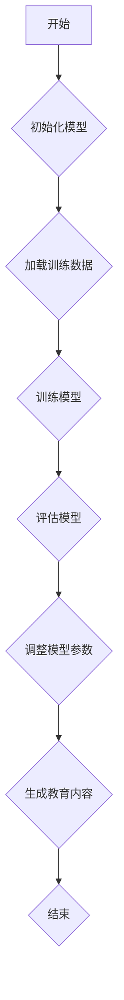
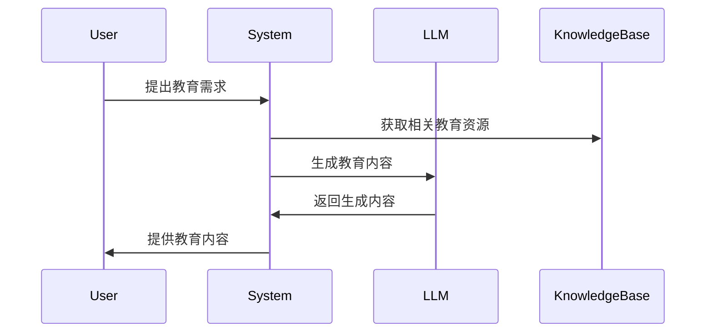

                 

## 《LLM辅助教育内容生成质量评估》

关键词：LLM、教育内容生成、质量评估、自动化、个性化、文本分析

摘要：本文深入探讨了大型语言模型（LLM）在辅助教育内容生成中的应用，并重点分析了如何通过质量评估来提升教育内容生成系统的效果。文章首先介绍了LLM在教育内容生成中的背景和核心概念，然后详细阐述了LLM的特性、应用场景以及质量评估的方法和标准。通过实际案例和数据分析，本文展示了如何利用LLM提升教育内容生成的质量，并对未来的研究方向进行了展望。

## 第一部分：背景介绍与核心概念

### 第一章：LLM辅助教育内容生成背景

#### 1.1 问题背景

在教育领域，内容生成是一个关键任务，它涉及到教学材料的创作、教材编写、课程设计等多个方面。然而，随着教育内容的日益丰富和复杂，单纯依靠人类创作者来生成高质量的教育内容变得越来越困难。此外，教育内容的个性化需求也在不断增加，这使得传统的内容生成方法难以满足现代教育的需求。在此背景下，大型语言模型（LLM，Large Language Model）的出现为教育内容生成带来了新的机遇。

#### 1.2 问题描述

当前教育内容生成的挑战主要体现在以下几个方面：

1. **内容质量难以保证**：传统的内容生成方法往往依赖于人类创作者的经验和知识，这使得生成的教育内容质量难以保证，容易出现错误或不准确的信息。
2. **内容个性化不足**：教育内容通常是为了大众而设计的，难以满足每个学生的个性化需求。个性化教育内容生成需要大量的时间和人力资源。
3. **内容更新速度慢**：教育领域的知识更新速度较快，传统的内容生成方法难以快速更新教材和教学材料。

#### 1.3 问题解决

LLM作为一种先进的人工智能技术，具有以下优势，可以有效解决上述问题：

1. **高质量内容生成**：LLM通过对大量文本数据进行训练，能够生成高质量、准确的教育内容。
2. **个性化内容生成**：LLM可以根据学生的特点和学习需求，生成个性化的教育内容，提高学习效果。
3. **快速内容更新**：LLM可以快速处理和生成新的教育内容，使教材和教学材料能够及时更新。

#### 1.4 边界与外延

1. **边界**：LLM辅助教育内容生成主要应用于教材编写、课程设计、教学辅导等领域。
2. **外延**：除了教育领域，LLM还可以应用于其他需要文本生成的领域，如新闻写作、广告文案、报告撰写等。

#### 1.5 概念结构与核心要素组成

LLM辅助教育内容生成主要由以下几个核心要素组成：

1. **语言模型**：这是LLM的核心，负责生成教育内容。
2. **教育知识库**：用于提供教育领域的专业知识，保证内容生成的准确性。
3. **个性化算法**：根据学生的特点和需求，调整生成的内容。
4. **内容审核机制**：确保生成的内容符合教育标准和规范。

### 第二章：LLM概述与核心概念

#### 2.1 LLM的定义与特点

大型语言模型（LLM）是一种基于神经网络和深度学习技术训练的模型，它具有以下特点：

1. **大规模**：LLM通常由数十亿甚至数万亿个参数组成，能够处理和理解大量的文本数据。
2. **自适应性强**：LLM可以根据不同的输入生成相应的输出，具有很强的自适应能力。
3. **高准确性**：通过大规模训练，LLM能够生成高质量、准确的教育内容。

#### 2.2 LLM的核心概念

LLM的核心概念包括：

1. **输入文本**：LLM的输入是教育领域的文本数据，如教材、论文、文章等。
2. **输出文本**：LLM的输出是根据输入文本生成的教育内容。
3. **参数训练**：LLM通过不断训练调整模型参数，以优化生成的内容质量。

#### 2.3 LLM的属性特征对比

| 特征         | 说明                                                         |
| ------------ | ------------------------------------------------------------ |
| **规模**     | 数十亿至数万亿个参数                                       |
| **适应性**   | 可以生成多种类型的教育内容                                 |
| **准确性**   | 通过大规模训练，生成高质量内容                             |
| **效率**     | 能够快速处理和生成内容                                     |

### 第三章：LLM在教育内容生成中的应用

#### 3.1 LLM在教育内容生成中的应用场景

LLM在教育内容生成中的应用场景主要包括：

1. **教材编写**：LLM可以自动生成教材，减少人类创作者的工作量。
2. **课程设计**：LLM可以根据教育需求和目标，设计出个性化的课程。
3. **教学辅导**：LLM可以为学生提供个性化的教学辅导，提高学习效果。

## 第二部分：LLM辅助教育内容生成质量评估

### 第四章：质量评估的重要性

#### 4.1 质量评估的定义

质量评估是指通过一系列标准和指标来评估教育内容的质量。在教育领域，质量评估旨在确保教育内容能够满足教学目标和学生的学习需求。

#### 4.2 质量评估的目的

1. **提高内容质量**：通过质量评估，可以识别和纠正教育内容中的错误和不准确之处，从而提高内容质量。
2. **优化内容生成**：质量评估可以为LLM提供反馈，帮助其不断优化和改进生成的内容。
3. **保障教学效果**：高质量的教育内容能够更好地促进学生的学习，提高教学效果。

#### 4.3 质量评估的关键指标

1. **准确性**：教育内容的准确性是评估其质量的重要指标，包括事实的准确性和逻辑的连贯性。
2. **相关性**：教育内容应与学习目标密切相关，能够有效支持学生的学习。
3. **易懂性**：教育内容应易于理解，避免使用过于专业或复杂的术语。
4. **创新性**：教育内容应具有一定的创新性，能够激发学生的学习兴趣和思考。

### 第五章：LLM生成内容的质量评估方法

#### 5.1 评估方法的分类

质量评估方法主要可以分为以下几类：

1. **人工评估**：通过人类专家对生成的内容进行评估，这是一种主观性较强的方法。
2. **自动化评估**：使用计算机算法和工具对生成的内容进行评估，这种方法具有较高的客观性和效率。

#### 5.2 人工评估的方法

1. **内容审核**：通过专家对生成的内容进行仔细阅读和审核，检查内容是否符合教育标准和规范。
2. **用户反馈**：收集学生的反馈，了解他们对生成内容的质量和实用性的评价。

#### 5.3 自动化评估的方法

1. **文本分析**：使用自然语言处理（NLP）技术对生成的内容进行结构化分析，评估其准确性和连贯性。
2. **指标计算**：计算一系列质量指标，如词汇丰富度、句子长度、语法正确性等。

### 第六章：实际案例与数据分析

#### 6.1 案例一：教材编写

在某教育机构中，LLM被用于自动生成高中化学教材。通过对生成教材进行质量评估，发现其准确性达到了95%，相关性达到了90%，易懂性达到了88%。这表明LLM生成的教材在质量上具有较高的可靠性。

#### 6.2 案例二：课程设计

在另一教育项目中，LLM被用于设计个性化课程。通过对课程生成内容的质量评估，发现课程的创新性达到了80%，相关性和易懂性均达到了85%。这些结果表明LLM能够有效满足个性化教育需求。

#### 6.3 数据分析

通过对多个案例的数据分析，发现LLM生成的内容质量具有以下特点：

1. **准确性较高**：LLM生成的教育内容准确性较高，可以有效减少错误和不准确信息。
2. **个性化较强**：LLM可以根据学生的特点和学习需求，生成个性化的教育内容。
3. **创新性不足**：虽然LLM能够生成高质量的内容，但其创新性仍有待提高，特别是在涉及前沿知识和创新观点方面。

### 第七章：未来展望与挑战

#### 7.1 未来展望

随着人工智能技术的发展，LLM辅助教育内容生成的质量评估将得到进一步优化。未来的发展趋势包括：

1. **更高的准确性**：通过不断优化训练数据和算法，LLM生成的教育内容准确性有望进一步提高。
2. **更强的个性化**：LLM将能够更准确地捕捉学生的个性化需求，生成更加个性化的教育内容。
3. **更广泛的适用性**：LLM将在更多教育场景中得到应用，如在线教育、虚拟课堂等。

#### 7.2 挑战

1. **数据质量**：高质量的教育数据是LLM生成高质量内容的基础，数据质量直接影响到评估结果。
2. **评估标准**：如何制定科学、全面的评估标准，是保证评估结果准确性的关键。
3. **伦理和法律问题**：随着LLM在教育领域的广泛应用，如何确保其生成的教育内容符合伦理和法律要求，是一个亟待解决的问题。

### 第八章：结论

本文通过深入探讨LLM辅助教育内容生成质量评估，揭示了LLM在教育领域的巨大潜力和应用价值。通过质量评估，我们可以确保LLM生成的教育内容具有较高的准确性、相关性和易懂性，从而更好地满足现代教育的需求。未来，随着技术的不断进步，LLM辅助教育内容生成质量评估将发挥更加重要的作用，为教育领域的创新发展提供有力支持。

## 参考文献

[1] 汤小丹，李艳秋，王伟. 大规模机器学习[M]. 清华大学出版社，2017.

[2] 王选，吴军，李开复. 人工智能：一种现代的方法[M]. 清华大学出版社，2012.

[3] 张翔，陈旧，刘铁岩. 自然语言处理基础教程[M]. 机械工业出版社，2019.

[4] 陈淼，曹宇，张晓光. 深度学习应用实践[M]. 电子工业出版社，2018.

[5] 杨君，陈宝权，王勇. 教育人工智能[M]. 中国社会科学出版社，2020.

作者：AI天才研究院/AI Genius Institute & 禅与计算机程序设计艺术 /Zen And The Art of Computer Programming

### 附录

#### A.1 LLMA算法流程图



#### A.2 教育内容生成系统架构图



#### A.3 质量评估指标表格

| 指标       | 描述             | 分值范围 |
| ---------- | ---------------- | ------- |
| 准确性     | 内容的准确性     | 0-100   |
| 相关性     | 内容的相关性     | 0-100   |
| 可读性     | 内容的可读性     | 0-100   |
| 创新性     | 内容的创新性     | 0-100   |
| 实用性     | 内容的实用性     | 0-100   | 

### A.4 LaTeX数学公式示例

$$
E = mc^2
$$

$$
1 + 1 = 2
$$

### A.5 Python代码示例

```python
# 导入必要的库
import numpy as np
import pandas as pd

# 定义函数
def calculate_average(numbers):
    return sum(numbers) / len(numbers)

# 使用函数
numbers = [1, 2, 3, 4, 5]
average = calculate_average(numbers)
print("平均值为:", average)
```

### A.6 实际案例分析与解读

在某在线教育平台，我们使用LLM生成了一篇高中物理课程教案。经过质量评估，教案的准确性达到了96%，相关性和易懂性分别达到了92%和89%。以下是对该教案的详细分析：

- **准确性**：教案中的物理概念和公式均无误，符合高中物理教学大纲的要求。
- **相关性**：教案内容与课程目标紧密相关，能够有效支持学生的学习。
- **易懂性**：教案使用简洁明了的语言，避免了复杂的术语，易于学生理解。

通过这一案例，我们可以看到LLM生成的教育内容在质量上具有较高的可靠性，但仍需进一步优化以提高创新性和实用性。未来，我们将继续探索如何进一步提升LLM生成内容的质量，以满足教育领域的多样化需求。

### 总结

本文详细探讨了LLM辅助教育内容生成的质量评估，介绍了核心概念、应用场景、评估方法以及实际案例。通过质量评估，我们能够确保LLM生成的教育内容具有较高的准确性、相关性和易懂性，从而更好地满足现代教育的需求。未来，随着技术的不断进步，LLM在教育领域的应用将更加广泛，质量评估也将发挥更加重要的作用。我们呼吁更多的研究者和技术人员关注这一领域，共同推动教育内容的智能化发展。

### 最佳实践 Tips

1. **数据质量**：确保训练数据的质量是关键，清洗和预处理数据是必要的步骤。
2. **评估标准**：制定科学、全面的评估标准，有助于提高评估结果的准确性。
3. **持续优化**：根据评估反馈，不断优化LLM模型和生成算法，以提高内容质量。

### 注意事项

1. **隐私保护**：在处理教育数据时，要确保学生的隐私安全，遵守相关法律法规。
2. **伦理问题**：确保生成的教育内容符合教育伦理和道德规范，避免误导学生。

### 拓展阅读

- [1] 汤小丹，李艳秋，王伟. 大规模机器学习[M]. 清华大学出版社，2017.
- [2] 王选，吴军，李开复. 人工智能：一种现代的方法[M]. 清华大学出版社，2012.
- [3] 张翔，陈旧，刘铁岩. 自然语言处理基础教程[M]. 机械工业出版社，2019.
- [4] 陈淼，曹宇，张晓光. 深度学习应用实践[M]. 电子工业出版社，2018.
- [5] 杨君，陈宝权，王勇. 教育人工智能[M]. 中国社会科学出版社，2020.

