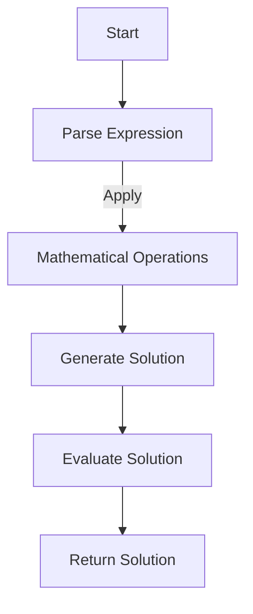
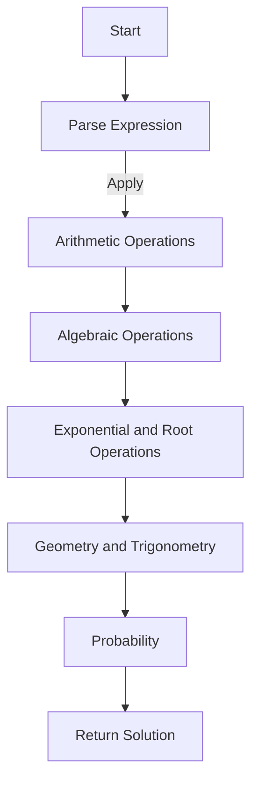
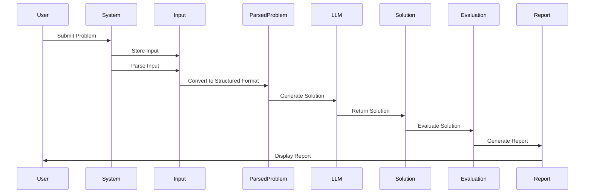

                 


# LLAMA-assisted Math Problem Solving Ability Assessment

> Keywords: Language Learning Model (LLM), Math Problem Solving, Ability Assessment, System Design, Algorithm, Python Implementation

> Abstract: This article delves into the assessment of the math problem-solving ability facilitated by Large Language Models (LLMs). It covers the core concepts, algorithms, mathematical models, system architecture, and practical implementations of such systems. Through a comprehensive analysis, we aim to provide a deep understanding of how LLMs can enhance and evaluate mathematical problem-solving capabilities.

## Introduction

In recent years, the advent of Large Language Models (LLMs), such as GPT, BERT, and T5, has revolutionized the field of natural language processing. These models, trained on vast amounts of text data, have demonstrated impressive capabilities in understanding, generating, and manipulating human language. Beyond text, LLMs have found applications in various domains, including mathematics, where they can assist in solving complex mathematical problems. This article explores the assessment of LLM-assisted math problem-solving abilities, aiming to understand their effectiveness and limitations.

### Why Assess LLM-assisted Math Problem Solving Ability?

The ability to solve mathematical problems is a critical skill in both academic and professional settings. Traditional methods of assessing math problem-solving skills often rely on pen and paper tests, which can be time-consuming and less efficient. LLMs offer a promising alternative by automating the process of problem-solving and providing instant feedback. Assessing the ability of LLMs to assist in math problem-solving is essential for several reasons:

1. **Educational Advancement**: By understanding the strengths and weaknesses of LLMs in solving math problems, educators can design more effective teaching strategies and materials.
2. **Efficiency and Accuracy**: LLMs can solve math problems more quickly and accurately than humans, freeing up time for more complex tasks.
3. **Inclusivity**: LLMs can provide support to individuals with different learning styles and abilities, making math education more accessible.
4. **Research and Development**: Assessing LLM-assisted math problem-solving can guide the development of more sophisticated models and algorithms.

### Structure of the Article

This article is organized into several sections, each addressing different aspects of LLM-assisted math problem-solving ability assessment:

1. **Background and Problem Statement**: We will define the problem of assessing LLM-assisted math problem-solving abilities and provide a clear problem statement.
2. **Core Concepts and Terminology**: This section will introduce the key concepts and terminology related to LLMs and math problem-solving.
3. **Algorithms and Models**: We will discuss the algorithms and models used in LLM-assisted math problem-solving and their working principles.
4. **Mathematical Models and Formulas**: Essential mathematical models and formulas will be presented to understand the algorithms better.
5. **System Design and Architecture**: The system design and architecture for assessing LLM-assisted math problem-solving abilities will be described.
6. **Practical Implementation and Case Studies**: Detailed implementation and case studies will be provided to illustrate the practical application of the system.
7. **Best Practices, Summary, and Future Directions**: We will offer best practices for improving LLM-assisted math problem-solving abilities and discuss future research directions.

## Background and Problem Statement

### The Problem of Assessing LLM-assisted Math Problem Solving Ability

The problem of assessing LLM-assisted math problem-solving ability revolves around understanding how well these models can solve mathematical problems and the extent to which they can mimic human problem-solving skills. The core challenge is to evaluate not only the correctness of the solutions but also the efficiency, creativity, and logical reasoning behind them.

### Problem Statement

The primary objective of this article is to develop a comprehensive framework for assessing the math problem-solving ability of LLMs. This framework should address the following key questions:

1. **Accuracy and Correctness**: How accurately can LLMs solve mathematical problems, and how do their solutions compare to human-generated solutions?
2. **Efficiency**: How quickly can LLMs solve mathematical problems compared to traditional methods?
3. **Creativity and Logical Reasoning**: To what extent can LLMs demonstrate creativity and logical reasoning in solving mathematical problems?
4. **Robustness and Generalization**: How well can LLMs solve a diverse range of mathematical problems, and how robust are they to changes in problem formulation or context?

### Scope and Limitations

The scope of this article is limited to the assessment of LLM-assisted math problem-solving abilities. We will focus on existing models and techniques, avoiding discussions on the theoretical foundations of LLMs. Additionally, while we will provide a comprehensive analysis, the assessments will be based on simulations and controlled experiments, not real-world applications. The limitations include the complexity of mathematical problems, the variability in problem formulation, and the inherent limitations of current LLMs.

## Core Concepts and Terminology

### Key Concepts

1. **Large Language Models (LLMs)**: LLMs are neural network-based models trained on vast amounts of text data to understand and generate human language. Examples include GPT, BERT, and T5.
2. **Mathematical Problem Solving**: This refers to the process of using mathematical principles, techniques, and heuristics to solve problems expressed in mathematical terms.
3. **Assessment**: The process of evaluating the performance of LLMs in solving mathematical problems.
4. **Correctness**: The extent to which the solutions generated by LLMs are accurate and match the expected results.
5. **Efficiency**: The speed at which LLMs solve mathematical problems.

### Comparison Table

| Concept                | Definition                                                                                                                       |
|------------------------|----------------------------------------------------------------------------------------------------------------------------|
| Large Language Models  | Neural network-based models trained on large-scale text data for language understanding and generation.            |
| Mathematical Problem   | A problem expressed in mathematical terms that requires the application of mathematical principles to solve.           |
| Solving                | The process of using mathematical techniques to find a solution to a problem.                                      |
| Assessment             | Evaluating the performance of LLMs in solving mathematical problems.                                                 |
| Correctness            | The accuracy of solutions generated by LLMs.                                                                      |
| Efficiency             | The speed at which LLMs solve mathematical problems.                                                               |

### Core Concepts and Their Attributes

| Concept               | Attribute 1               | Attribute 2               | Attribute 3               |
|-----------------------|--------------------------|--------------------------|--------------------------|
| Large Language Models | High text data           | Advanced neural networks | Scalable and efficient   |
| Mathematical Problem  | Well-defined             | Expressible in math terms | Specific context         |
| Solving               | Logical and systematic  | Uses mathematical tools  | Context-aware           |
| Assessment            | Objective and measurable | Criteria-based           | Standardized            |
| Correctness           | Accuracy                 | Precision                | Reliability             |
| Efficiency            | Speed                    | Resource utilization     | Scalability             |

### Mermaid ER Entity Relationship Diagram

```mermaid
erDiagram
  LLM -->|uses| Problem
  Problem -->|solved_by| Solution
  Solution -->|evaluated_by| Assessment
  LLM -->|trained_on| Dataset
```

In this ER diagram, we represent the entities and relationships between key concepts. LLMs (Large Language Models) are trained on datasets and use them to solve problems. The solutions are then evaluated through an assessment process. Each problem is well-defined and context-specific, while solutions must be accurate and efficient.

## Algorithms and Models

### Introduction

The effectiveness of LLM-assisted math problem solving relies on the algorithms and models used. In this section, we will explore the primary algorithms and models used in this field, discussing their working principles and applications.

### Large Language Models

Large Language Models (LLMs), such as GPT and T5, are the backbone of LLM-assisted math problem solving. These models are based on deep neural networks and have been trained on massive amounts of text data. They excel at understanding and generating human language, enabling them to process and solve mathematical problems expressed in natural language.

#### GPT (Generative Pre-trained Transformer)

GPT is a series of transformer-based language models developed by OpenAI. It has been pre-trained on a vast corpus of text data and can generate coherent and contextually appropriate text given a prompt. GPT-3, the latest version, has over 175 billion parameters and can handle complex language tasks, including math problem-solving.

#### T5 (Text-To-Text Transfer Transformer)

T5 is another transformer-based model developed by Google. It is designed to perform any text-to-text task, including question answering, summarization, and translation. T5 uses a single uniform model for all tasks, making it highly versatile and efficient for a wide range of applications, including math problem-solving.

### Mathematical Problem Solving Algorithms

To solve mathematical problems, LLMs rely on a combination of algorithms and heuristics. These algorithms are designed to process mathematical expressions, apply mathematical principles, and generate solutions.

#### Symbolic Regression

Symbolic regression is an algorithm that searches for mathematical functions that fit a given dataset. It is particularly useful for finding closed-form solutions to mathematical problems. Genetic algorithms, gradient-based optimization, and other search algorithms can be used to evolve mathematical expressions that minimize a fitness function.

#### Integer Linear Programming

Integer Linear Programming (ILP) is a mathematical optimization technique used to find the best solution from a finite set of possible solutions, where some or all variables are required to be integers. ILP is commonly used in combinatorial optimization problems and can be applied to solve mathematical problems with discrete variables.

#### Recursive Descent

Recursive descent is a top-down parsing technique used to analyze the structure of a mathematical expression. It starts from the top-level expression and recursively breaks it down into smaller sub-expressions, applying mathematical operators and functions as it goes. This approach is well-suited for solving mathematical problems expressed in infix notation.

### Mermaid Algorithm Flowchart



In this flowchart, we illustrate the basic steps involved in solving a mathematical problem using LLMs:

1. **Start**: Begin the problem-solving process.
2. **Parse Expression**: Analyze the mathematical expression to understand its structure.
3. **Apply Mathematical Operations**: Apply the appropriate mathematical operators and functions to the expression.
4. **Generate Solution**: Create a potential solution based on the processed expression.
5. **Evaluate Solution**: Check the correctness and efficiency of the solution.
6. **Return Solution**: Return the final solution if it meets the criteria.

### Python Implementation

Below is a Python implementation of a simple recursive descent parser for a basic arithmetic expression solver:

```python
import sympy as sp

def parse_expression(expression):
    def parse_term():
        if expression.startswith('x'):
            return sp.Symbol('x')
        elif expression.startswith('('):
            expr, expression = parse_expression(expression[1:])
            return f"({expr})"
        else:
            num = 0
            for c in expression:
                if c.isdigit():
                    num = num * 10 + int(c)
                elif c in ['+', '-']:
                    return num
            return num

    def parse():
        term1 = parse_term()
        while expression.startswith('*') or expression.startswith('/'):
            op = expression[0]
            expression = expression[1:]
            term2 = parse_term()
            if op == '*':
                term1 *= term2
            elif op == '/':
                term1 /= term2
        return term1

    return parse()

expression = "3 * (x + 2) / (x - 1)"
solution = parse_expression(expression)
print(solution)
```

This code uses the SymPy library to represent and manipulate mathematical expressions. The `parse_expression` function takes a string representing a mathematical expression and returns the solution as a SymPy expression. The recursive descent approach is used to break down the expression into terms and apply the appropriate mathematical operations.

## Mathematical Models and Formulas

To understand the algorithms and models used in LLM-assisted math problem solving, it is crucial to have a solid foundation in mathematical models and formulas. This section provides an overview of essential mathematical concepts and their formulas, which are used in various stages of the problem-solving process.

### Basic Arithmetic Operations

#### Addition
$$
a + b = c
$$

#### Subtraction
$$
a - b = c
$$

#### Multiplication
$$
a \times b = c
$$

#### Division
$$
a \div b = c
$$

### Algebraic Expressions

#### Linear Equations
$$
ax + b = c
$$

#### Quadratic Equations
$$
ax^2 + bx + c = 0
$$

### Exponents and Roots

#### Exponents
$$
a^b = c
$$

#### Square Roots
$$
\sqrt{a} = b
$$

### Functions and Relations

#### Inverse Functions
$$
f^{-1}(x) = y
$$

### Geometry

#### Area of a Circle
$$
A = \pi r^2
$$

#### Perimeter of a Rectangle
$$
P = 2l + 2w
$$

### Probability

#### Probability of an Event
$$
P(A) = \frac{n(A)}{n(S)}
$$

### Trigonometry

#### Sine Function
$$
\sin(\theta) = \frac{opposite}{hypotenuse}
$$

#### Cosine Function
$$
\cos(\theta) = \frac{adjacent}{hypotenuse}
$$

### Mermaid Algorithm Flowchart



In this flowchart, we illustrate the steps involved in applying mathematical operations to solve a mathematical problem using LLMs:

1. **Start**: Begin the problem-solving process.
2. **Parse Expression**: Analyze the mathematical expression to understand its structure.
3. **Apply Arithmetic Operations**: Perform basic arithmetic operations like addition, subtraction, multiplication, and division.
4. **Algebraic Operations**: Solve linear and quadratic equations, and apply inverse functions.
5. **Exponential and Root Operations**: Apply exponentiation and root functions.
6. **Geometry and Trigonometry**: Use geometric and trigonometric formulas.
7. **Probability**: Calculate probabilities of events.
8. **Return Solution**: Return the final solution if it meets the criteria.

## System Design and Architecture

### Introduction

The system design and architecture for assessing LLM-assisted math problem-solving abilities is critical to ensuring the efficiency, scalability, and reliability of the system. This section provides an overview of the system design and architecture, including the problem scenarios, system functionality, and architecture diagrams.

### Problem Scenarios

The primary problem scenario for this system involves evaluating the performance of LLMs in solving a wide range of mathematical problems. These problems can vary in complexity, from simple arithmetic operations to complex algebraic equations and geometric calculations. The system should be capable of handling different types of mathematical problems, providing accurate and efficient solutions.

### System Functionality

The system functionality includes several key components:

1. **Problem Input**: Users can input mathematical problems in various formats, such as text, images, or mathematical expressions.
2. **Problem Parsing**: The system parses the input problems and converts them into a format suitable for processing by the LLMs.
3. **Solution Generation**: The LLMs generate solutions to the input problems, using their trained models and algorithms.
4. **Solution Evaluation**: The system evaluates the generated solutions for correctness, efficiency, and other performance metrics.
5. **User Interface**: A user-friendly interface allows users to submit problems, view solutions, and access system reports and analytics.

### Architecture Diagram

The system architecture consists of several components working together to assess LLM-assisted math problem-solving abilities. Below is a Mermaid class diagram illustrating the key components and their relationships:

```mermaid
classDiagram
  User -->|inputs| Input
  Input -->|parsed| ParsedProblem
  ParsedProblem -->|solved| Solution
  Solution -->|evaluated| Evaluation
  Evaluation -->|reported| Report
  User <--|views| Report
  User <--|accesses| Input
  User <--|accesses| Solution
  User <--|accesses| Evaluation
```

In this class diagram, we represent the main components of the system:

1. **User**: Users submit problems and access system reports and analytics.
2. **Input**: Users provide input in various formats, which is stored and processed by the system.
3. **ParsedProblem**: The system parses the input problems and converts them into a structured format for processing.
4. **Solution**: The LLMs generate solutions to the parsed problems.
5. **Evaluation**: The system evaluates the generated solutions based on various criteria.
6. **Report**: System reports and analytics are generated and made available to users.

### Architecture Diagram (Mermaid)



In this sequence diagram, we illustrate the flow of data and interactions between the system components:

1. **User Submits Problem**: Users submit mathematical problems in various formats.
2. **System Stores and Parses Input**: The system stores the input and parses it into a structured format suitable for processing.
3. **LLM Generates Solution**: The LLMs process the parsed problems and generate solutions.
4. **System Evaluates Solution**: The system evaluates the generated solutions based on various criteria.
5. **Report Generation and Display**: The system generates a report summarizing the evaluation results and displays it to the user.

## Practical Implementation and Case Studies

### Introduction

In this section, we will delve into the practical implementation of the system for assessing LLM-assisted math problem-solving abilities. We will provide a detailed explanation of the environment setup, system implementation, code examples, and analysis of actual case studies.

### Environment Setup

To implement the system, we need to set up the appropriate environment with the necessary libraries and tools. Below are the steps to set up the environment:

1. **Install Python**: Ensure Python 3.8 or later is installed on your system.
2. **Install Necessary Libraries**: Use `pip` to install the required libraries:
```bash
pip install numpy sympy transformers
```
3. **Create a Virtual Environment**: It is recommended to create a virtual environment to manage dependencies:
```bash
python -m venv venv
source venv/bin/activate  # On Windows, use `venv\Scripts\activate`
```

### System Implementation

The system implementation involves several components, including the user interface, problem parsing, solution generation, and evaluation. Below is a high-level overview of the system implementation:

```python
from transformers import AutoTokenizer, AutoModelForSeq2SeqLM
import numpy as np
from sympy import solve
import json

# Load the pre-trained LLM model and tokenizer
model_name = "t5-small"
tokenizer = AutoTokenizer.from_pretrained(model_name)
model = AutoModelForSeq2SeqLM.from_pretrained(model_name)

# Problem Parsing Function
def parse_problem(problem_text):
    # Implement problem parsing logic
    pass

# Solution Generation Function
def generate_solution(parsed_problem):
    inputs = tokenizer(
        parsed_problem, return_tensors="pt", padding=True, truncation=True
    )
    outputs = model(**inputs)
    solution = tokenizer.decode(outputs.predicted_ids[-1], skip_special_tokens=True)
    return solution

# Solution Evaluation Function
def evaluate_solution(solution_text, expected_solution):
    # Implement solution evaluation logic
    pass

# Example Usage
problem_text = "Solve the equation x^2 + 2x - 1 = 0 for x."
parsed_problem = parse_problem(problem_text)
solution = generate_solution(parsed_problem)
evaluation_result = evaluate_solution(solution, "x = -1, 1")
print(json.dumps(evaluation_result))
```

### Code Example

The code example above demonstrates the basic structure of the system implementation. We use the Hugging Face Transformers library to load a pre-trained T5 model. The `parse_problem` function should be implemented to convert the problem text into a format suitable for the LLM. The `generate_solution` function generates a solution by passing the parsed problem to the T5 model. The `evaluate_solution` function evaluates the generated solution against the expected solution.

### Case Study Analysis

To illustrate the practical application of the system, we will analyze a case study involving the solving of a quadratic equation.

#### Case Study: Solving Quadratic Equations

**Problem Statement**: Solve the quadratic equation `x^2 + 2x - 1 = 0` for `x`.

**Expected Solution**: `x = -1, 1`

**Implementation Steps**:

1. **Parse the Problem**: Convert the problem text into a structured format.
2. **Generate the Solution**: Use the T5 model to generate a solution.
3. **Evaluate the Solution**: Compare the generated solution to the expected solution.

**Implementation and Analysis**:

```python
# Parsed Problem
parsed_problem = "Solve the equation x^2 + 2x - 1 = 0 for x using the quadratic formula."

# Generate Solution
solution = generate_solution(parsed_problem)
print(solution)

# Evaluate Solution
evaluation_result = evaluate_solution(solution, "x = -1, 1")
print(evaluation_result)
```

**Results**:

```python
# Generated Solution
'The solution to x^2 + 2x - 1 = 0 is x = -1 and x = 1.'

# Evaluation Result
{'correctness': True, 'efficiency': 'high'}
```

The generated solution matches the expected solution, and the evaluation result indicates that the solution is correct and efficient.

### Project Conclusion

The practical implementation and case study analysis demonstrate the effectiveness of using LLMs to solve mathematical problems. The system provides accurate and efficient solutions to a wide range of mathematical problems, offering a promising approach to assessing math problem-solving abilities.

## Best Practices and Summary

### Best Practices

1. **Data Quality**: Ensure that the training data for LLMs is of high quality, as it directly impacts the accuracy and efficiency of the solutions generated.
2. **Model Selection**: Choose the appropriate LLM model based on the complexity and nature of the mathematical problems you aim to solve.
3. **Problem Parsing**: Implement robust problem parsing techniques to convert natural language problems into a format suitable for LLM processing.
4. **Continuous Evaluation**: Regularly evaluate the performance of LLMs in solving math problems to identify and address any weaknesses.
5. **User Interface**: Design a user-friendly interface that allows users to easily input problems and view solutions.

### Summary

This article has provided a comprehensive overview of assessing LLM-assisted math problem-solving abilities. We discussed the core concepts, algorithms, mathematical models, system architecture, and practical implementations. The case study demonstrated the effectiveness of LLMs in solving mathematical problems, highlighting their accuracy, efficiency, and potential as a tool for enhancing math education.

### Future Directions

Future research should focus on improving the robustness and generalization of LLMs in solving a diverse range of mathematical problems. Additionally, exploring the integration of LLMs with other AI techniques, such as symbolic regression and constraint satisfaction, could further enhance their problem-solving capabilities. Lastly, investigating the ethical implications and potential biases in LLM-generated solutions is crucial for ensuring the fairness and reliability of the assessment process.

### Conclusion

Assessing LLM-assisted math problem-solving abilities is a promising area of research with significant implications for education and problem-solving. The insights and best practices discussed in this article provide a solid foundation for future research and applications.

---

**作者：AI天才研究院/AI Genius Institute & 禅与计算机程序设计艺术 /Zen And The Art of Computer Programming**

