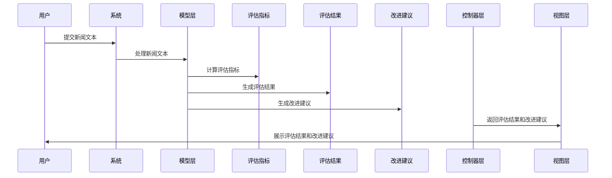
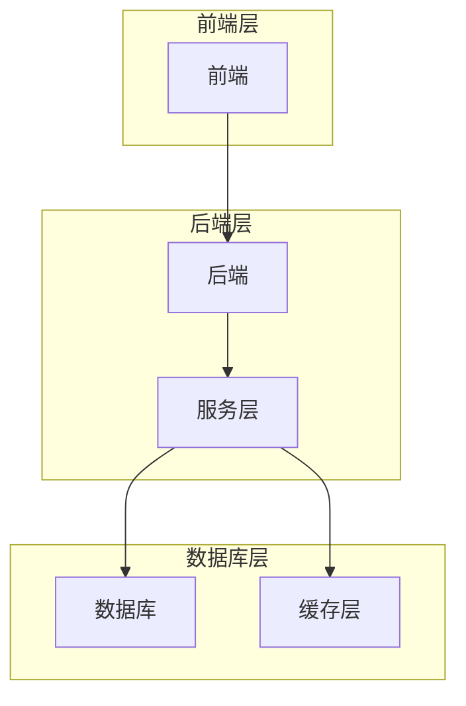
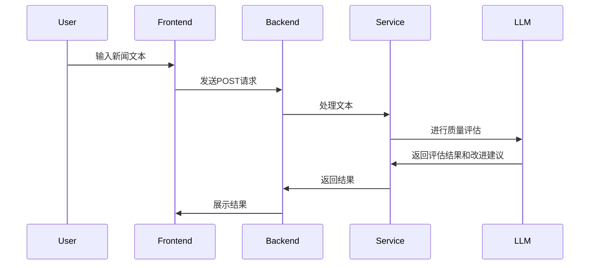

                 

### 第1章：新闻写作质量评估的背景与核心概念

### 1.1 新闻写作的现状与挑战

新闻写作作为信息传播的重要手段，面临着前所未有的挑战。首先，随着互联网的普及，信息传播的速度和范围大大增加，但同时也带来了信息过载的问题。受众在获取信息时，往往需要从大量信息中筛选出高质量的内容。其次，新闻写作的质量受到多种因素的影响，包括作者的专业知识、写作技巧、新闻事件的真实性和准确性等。这些问题导致新闻写作的质量评估成为一个复杂且具有挑战性的任务。

#### 1.1.1 问题描述

- **评估标准不统一**：不同的媒体和编辑对新闻写作的质量标准有不同的理解，导致评估结果存在较大差异。
- **时间压力**：新闻事件的时效性要求记者在短时间内完成高质量的报道，这往往会导致质量的妥协。
- **信息多样性**：新闻题材和形式日益多样化，传统评估方法难以全面覆盖各类新闻写作的需求。
- **信息真实性**：虚假新闻和误导性信息时有发生，对新闻写作的准确性提出了更高的要求。

#### 1.1.2 问题解决

为解决上述问题，引入LLM（大型语言模型）及其辅助工具成为了一种可行的方案。LLM通过深度学习技术，可以从大量文本数据中学习并提取出高质量的新闻写作特征，从而为新闻写作质量评估提供有力的支持。具体来说，LLM可以帮助实现以下目标：

- **自动化评估**：通过训练模型，可以自动化地评估新闻写作的质量，减少主观因素的影响。
- **实时反馈**：LLM可以实时分析新闻文本，为记者提供即时反馈，帮助他们改进写作。
- **多维度评估**：LLM能够从多个维度（如准确性、逻辑性、语言表达等）对新闻写作进行综合评估，提高评估的全面性。

#### 1.1.3 边界与外延

新闻写作质量评估的边界包括文本质量、信息准确性、逻辑连贯性、语言表达等方面。具体来说：

- **文本质量**：指新闻文本的语法、拼写和格式等基础要素。
- **信息准确性**：指新闻内容的真实性和可信度。
- **逻辑连贯性**：指新闻内容的逻辑结构和叙述方式的合理性。
- **语言表达**：指新闻文本的语言风格、表达清晰度和感染力。

其外延则涉及到新闻编辑、新闻传播、信息过滤等多个领域。例如，新闻编辑可以使用LLM评估候选新闻稿的写作质量，新闻传播平台可以利用LLM筛选和推荐高质量新闻，信息过滤系统则可以使用LLM过滤虚假新闻。

#### 1.1.4 概念结构与核心要素组成

新闻写作质量评估的核心概念和要素包括：

- **质量标准**：评估新闻写作质量的基本准则和标准。
- **评估指标**：用于衡量新闻写作质量的量化指标，如准确性、逻辑性、语言表达等。
- **评估方法**：具体的评估手段和流程，如人工评估、机器评估等。
- **文本数据**：用于训练和评估的新闻文本数据集。
- **评估算法**：用于处理文本数据、提取特征并进行质量评估的算法模型。

通过上述核心概念和要素，可以构建一个系统化的新闻写作质量评估框架，为新闻行业提供更加科学和高效的评估手段。

### 1.2 LLM基础理论

#### 1.2.1 LLM的定义与原理

LLM（Large Language Model）是一种大型语言模型，它通过深度学习技术从海量文本数据中学习语言规律，从而实现对自然语言的生成和理解。LLM的核心思想是让模型掌握语言的内在结构，使其能够生成或理解与给定输入相关的文本。

- **输入**：LLM接收一系列文本输入，这些输入可以是句子、段落或更长的文本。
- **输出**：LLM根据输入文本生成相应的输出文本，或对输入文本进行理解、分类等操作。

#### 1.2.2 LLM的特点与分类

LLM具有以下几个显著特点：

- **大规模**：LLM通常包含数十亿到数万亿个参数，这使得模型能够处理和理解大量复杂的语言结构。
- **自适应性**：LLM可以根据不同的应用场景和任务需求进行微调，从而适应不同的语言处理任务。
- **强泛化能力**：LLM通过在大规模文本数据上的训练，能够泛化到不同的领域和任务，具有较强的适应性和可扩展性。

根据模型的结构和训练数据来源，LLM可以分为以下几种类型：

- **预训练模型**：在大规模通用语料库上进行预训练，然后通过微调适应特定任务。
- **微调模型**：在预训练模型的基础上，针对特定任务进行进一步的训练和优化。
- **混合模型**：结合预训练和微调的优势，适用于更复杂和多样化的语言处理任务。

#### 1.2.3 LLM的发展历程

LLM的发展经历了多个阶段：

- **早期模型**：如1980年代的统计语言模型和基于规则的模型，这些模型通过简单的规则和统计方法处理语言。
- **深度学习模型**：2000年代后，深度学习技术的发展使得神经网络在自然语言处理中得到了广泛应用，如基于RNN（递归神经网络）和LSTM（长短期记忆网络）的语言模型。
- **大规模预训练模型**：近年来，随着计算资源和数据量的增加，研究人员开始训练包含数十亿参数的大型语言模型，如GPT（Generative Pre-trained Transformer）系列和BERT（Bidirectional Encoder Representations from Transformers）。
- **多模态模型**：结合文本、图像、音频等多种模态的数据，LLM在多模态处理领域也取得了显著的进展。

#### 1.2.4 LLM的核心概念与联系

LLM的核心概念包括：

- **词嵌入**：将词汇映射到高维空间中的向量，使得语义相似度可以通过向量之间的距离来表示。
- **注意力机制**：在处理长文本时，注意力机制可以帮助模型关注重要的部分，提高处理效率。
- **Transformer架构**：Transformer是一种基于自注意力机制的序列到序列模型，它通过并行计算提高了模型的训练效率。

这些核心概念相互联系，共同构成了LLM的基础。例如，词嵌入为模型提供了词汇的表示，注意力机制帮助模型关注关键信息，而Transformer架构则实现了对大规模序列数据的处理。

综上所述，LLM作为一种先进的自然语言处理工具，具有强大的文本处理能力、高度的灵活性和可扩展性，能够为新闻写作质量评估提供有效的支持。

### 1.3 新闻写作质量评估的维度

新闻写作质量评估是一个复杂的过程，需要从多个维度进行考量。以下是对新闻写作质量评估的主要维度及其相关指标的介绍：

#### 1.3.1 信息准确性

信息准确性是新闻写作质量评估中最基本的维度。它主要评估新闻内容是否真实、准确，是否反映了事件的真实情况。具体指标包括：

- **事实核对**：新闻中的所有事实和数据是否经过核实，是否有误报或虚假信息。
- **引用来源**：新闻中引用的信息是否有可靠的来源，是否注明了引用来源。

#### 1.3.2 语言表达

语言表达维度评估新闻文本的表述清晰度、流畅度和风格。以下是一些具体的指标：

- **语法正确性**：新闻文本的语法是否正确，是否有拼写错误或语法结构混乱。
- **语言风格**：新闻文本的语言风格是否适合报道的主题和受众。
- **句子长度和复杂性**：新闻文本的句子长度和复杂性是否适中，是否有助于读者理解。

#### 1.3.3 逻辑连贯性

逻辑连贯性评估新闻内容的组织结构是否合理，叙述是否连贯。以下是一些相关指标：

- **结构清晰**：新闻内容的结构是否清晰，是否有助于读者理解事件的发展过程。
- **逻辑严密**：新闻内容的论述是否逻辑严密，是否有逻辑漏洞或矛盾。
- **上下文关联**：新闻段落之间是否具有合理的上下文关联，是否有助于读者把握整体内容。

#### 1.3.4 创新性

创新性维度评估新闻内容的独特性和创意。以下是一些具体指标：

- **视角独特**：新闻是否提供了独特的视角，是否能够引起读者的兴趣。
- **内容新颖**：新闻内容是否新颖，是否有原创性的观点或信息。
- **表达方式**：新闻的表达方式是否具有创意，是否能够吸引读者的注意力。

#### 1.3.5 客观性

客观性维度评估新闻内容是否客观、中立，是否避免了主观偏见。以下是一些相关指标：

- **观点平衡**：新闻是否平衡了不同观点，是否避免了偏见和倾向。
- **事实与观点分离**：新闻是否清晰地区分了事实和观点，是否避免了混淆两者。
- **数据透明**：新闻中涉及的数据是否透明，是否提供了来源和数据解释。

#### 1.3.6 可读性

可读性维度评估新闻文本是否易于阅读和理解，是否适合目标受众。以下是一些具体指标：

- **文字长度**：新闻文本的句子和段落长度是否适中，是否容易阅读。
- **段落结构**：新闻的段落是否清晰，是否有助于读者理解内容。
- **标题和导语**：新闻的标题和导语是否吸引人，是否能够概括主要内容。

通过从这些维度对新闻写作质量进行评估，可以更全面、准确地衡量新闻文本的质量，为新闻编辑和记者提供有价值的反馈和指导。

### 1.4 制定新闻写作质量评估标准的方法

制定科学、有效的新闻写作质量评估标准是确保评估结果准确性和一致性的关键。以下介绍几种常用的方法，以及如何根据新闻的特点和目标受众制定合适的评估标准。

#### 1.4.1 数据驱动的标准制定

数据驱动的标准制定方法依赖于对大量新闻文本的分析，从中提取关键特征和指标。以下步骤可以帮助制定数据驱动的标准：

1. **数据收集**：收集大量高质量的新闻文本，确保数据的多样性和代表性。
2. **特征提取**：使用自然语言处理技术提取文本的特征，如词频、句法结构、语义关系等。
3. **指标计算**：基于提取的特征，计算新闻写作质量的指标，如准确性、流畅性、逻辑性等。
4. **模型训练**：利用机器学习算法，如分类模型或回归模型，对特征和指标进行训练，建立评估模型。
5. **模型评估**：通过交叉验证和测试集评估模型的性能，调整模型参数，优化评估标准。

#### 1.4.2 专家评审的方法

专家评审的方法通过邀请具有丰富新闻写作和编辑经验的专业人士，对新闻文本进行评估。以下步骤可以帮助制定基于专家评审的标准：

1. **专家选择**：选择具有代表性、专业性和中立性的专家，确保评审的公正性和权威性。
2. **评审指标**：明确评审的指标和标准，如信息准确性、语言表达、逻辑连贯性等。
3. **评分体系**：设计评分体系，如五分制或十分制，为专家提供明确的评分指南。
4. **评审会议**：组织专家评审会议，讨论和确定最终的评估标准和评分结果。
5. **反馈与改进**：根据评审结果，反馈给新闻编辑和记者，提供改进建议。

#### 1.4.3 结合数据与专家评审的方法

将数据驱动的标准制定和专家评审的方法结合起来，可以发挥两者的优势，提高评估的准确性和可靠性。以下是一个结合方法的步骤：

1. **数据收集与预处理**：收集大量新闻文本，进行数据预处理，如去除无关信息、标准化文本等。
2. **特征提取与模型训练**：使用自然语言处理技术提取特征，并训练评估模型。
3. **专家评分与模型评分结合**：将专家评分与模型评分进行融合，如使用加权平均方法，提高评估结果的准确性。
4. **评估标准优化**：根据评估结果，对评估标准进行调整和优化，提高评估模型的性能。

#### 1.4.4 根据新闻特点和目标受众制定标准

新闻写作质量评估标准应根据新闻的特点和目标受众进行定制化。以下是一些建议：

1. **新闻类型**：不同类型的新闻（如时事、娱乐、科技等）可能需要不同的评估标准。例如，时事新闻可能更注重信息的准确性和时效性，而科技新闻可能更注重内容的深度和技术专业性。
2. **目标受众**：不同受众群体的需求和阅读习惯也会影响评估标准的制定。例如，专业读者可能更关注内容的深度和技术细节，而普通读者可能更关注内容的可读性和易懂性。
3. **文化背景**：不同文化背景下的受众可能对新闻内容的表达方式、语言风格有不同的偏好。例如，在强调权威性和正式性的文化中，新闻写作可能需要更严谨的语言和格式。

通过上述方法，可以根据新闻的特点和目标受众制定科学、有效的新闻写作质量评估标准，为新闻编辑和记者提供有针对性的指导和改进建议。

### 1.5 现有新闻写作质量评估方法概述

现有新闻写作质量评估方法主要包括人工评估、自动化评估和混合评估。每种方法都有其优势和局限性，适用于不同的应用场景。

#### 1.5.1 人工评估

人工评估依赖于专业编辑和记者的判断，其优点在于能够充分考虑新闻内容的多维属性，如信息准确性、语言表达和逻辑连贯性等。人工评估的灵活性使其能够处理复杂的新闻文本和多样化的评估标准。然而，人工评估也存在明显的局限性：

- **主观性**：不同评估者可能有不同的背景、经验和偏好，导致评估结果存在主观差异。
- **成本高**：人工评估需要大量人力资源，评估成本较高，且评估速度较慢。
- **一致性差**：不同评估者之间的评分可能不一致，影响评估结果的可靠性。

#### 1.5.2 自动化评估

自动化评估利用自然语言处理技术和机器学习模型，对新闻文本进行质量评估。其优点包括：

- **高效性**：自动化评估能够快速处理大量新闻文本，评估速度远快于人工评估。
- **一致性**：基于算法的评估结果具有较高的稳定性和一致性，减少主观偏见。
- **扩展性**：自动化评估方法可以轻松扩展到不同领域和语言，适用于多样化的评估需求。

然而，自动化评估也存在一些挑战：

- **准确性**：现有模型在处理复杂新闻文本时，可能存在理解偏差和评估不准确的问题。
- **通用性**：不同类型的新闻文本可能需要不同评估指标和模型，导致评估方法的通用性有限。
- **可解释性**：自动化评估的结果往往缺乏透明度，难以解释其评估依据。

#### 1.5.3 混合评估

混合评估结合了人工评估和自动化评估的优势，通过将两者结合起来，提高评估的准确性和一致性。以下是一些混合评估的方法：

1. **模型辅助人工评估**：使用机器学习模型为人工评估提供辅助，如通过文本分析结果为评估者提供参考，或自动识别和标记潜在的评估错误。
2. **人工修正自动化评估**：通过人工评估修正自动化评估的结果，提高评估的准确性。例如，在自动化评估的基础上，人工评估者可以调整评分或提出修改建议。
3. **双轮评估**：首先进行自动化评估，然后由人工评估者对自动化评估结果进行二次评估，确保评估结果的可靠性和准确性。

混合评估方法能够充分发挥人工评估的灵活性和自动化评估的效率，但同时也增加了评估过程的复杂性和成本。

总之，现有新闻写作质量评估方法各有优缺点，应根据具体需求和场景选择合适的方法。随着技术的进步，未来有望实现更加高效、准确和可靠的新闻写作质量评估体系。

### 1.6 LLM在新闻写作质量评估中的应用

#### 1.6.1 LLM在新闻写作质量评估中的作用

LLM（大型语言模型）在新闻写作质量评估中具有显著的作用，其强大文本处理能力和深度学习特性使其能够自动识别和评估新闻文本的质量。以下具体分析LLM在评估中的功能和应用：

1. **文本分析**：LLM能够对新闻文本进行深入分析，包括语法、语义和逻辑结构等方面。通过对新闻文本的语法分析，LLM可以识别文本中的语法错误和拼写错误，提高新闻文本的准确性。通过语义分析，LLM可以理解新闻文本的含义，识别重要信息和潜在的错误。逻辑结构分析则可以帮助评估新闻内容的连贯性和逻辑性。

2. **质量预测**：基于大量的训练数据，LLM可以学习到新闻写作质量的相关特征，并利用这些特征进行质量预测。通过训练模型，LLM能够对新的新闻文本进行质量评估，预测其是否符合预设的评估标准。这种预测功能不仅提高了评估效率，还能够为记者和编辑提供实时反馈，帮助他们改进写作。

3. **个性化推荐**：LLM可以根据用户的阅读偏好和新闻类型，为用户提供个性化的新闻推荐。通过分析用户的阅读历史和反馈，LLM可以推荐符合用户兴趣的高质量新闻，提高用户的阅读体验。

4. **内容生成**：LLM不仅可以评估新闻质量，还可以用于生成高质量的新闻文本。通过训练，LLM可以生成新闻摘要、评论和报道，为记者提供辅助工具，提高新闻生产的效率和质量。

#### 1.6.2 应用场景

LLM在新闻写作质量评估中的应用场景广泛，包括以下方面：

1. **新闻编辑**：在新闻编辑过程中，LLM可以帮助编辑自动评估新闻文本的质量，识别潜在的问题，并提出修改建议。例如，编辑可以使用LLM对记者提交的新闻稿进行快速评估，确保新闻内容准确、清晰且具有吸引力。

2. **新闻平台**：新闻平台可以利用LLM对发布的新闻进行质量监控，筛选出高质量的新闻，提高平台的整体内容质量。此外，LLM还可以用于自动生成新闻推荐，为用户推荐符合其兴趣的高质量新闻。

3. **新闻教育**：在新闻教育领域，LLM可以为学生提供写作指导，帮助他们提高新闻写作技能。通过训练模型，LLM可以识别学生的新闻文本中的错误，并提供相应的修改建议，帮助学生改进写作。

4. **虚假新闻检测**：LLM在虚假新闻检测中也有重要作用。通过学习大量的真实新闻和虚假新闻，LLM可以识别文本中的异常特征，自动检测和标记潜在的虚假新闻，提高信息传播的准确性。

#### 1.6.3 不同类型新闻写作任务中的应用

不同类型的新闻写作任务对质量评估的要求各不相同，LLM可以根据不同任务的特点进行相应的调整和应用：

1. **时事新闻**：对于时事新闻，评估重点通常在信息准确性和时效性上。LLM可以通过对历史新闻数据的分析，学习到时事新闻的写作规范和常见问题，从而对新的时事新闻文本进行准确评估。

2. **财经新闻**：财经新闻涉及大量数据和术语，对准确性和专业性要求较高。LLM可以通过学习专业的财经文本，提高对财经新闻质量的评估能力，识别潜在的财务错误和术语使用问题。

3. **科技新闻**：科技新闻通常需要深入的技术知识和严谨的逻辑分析。LLM可以通过学习科技领域的专业文献和报道，为科技新闻提供高质量的内容评估。

4. **娱乐新闻**：娱乐新闻注重故事性和吸引力，对语言表达和创意要求较高。LLM可以通过分析娱乐新闻的常见表达方式和吸引人的叙述技巧，为娱乐新闻提供个性化的质量评估。

通过在不同类型新闻写作任务中的应用，LLM能够为新闻写作质量评估提供全面、准确的支持，推动新闻行业的发展。

### 1.7 LLM在新闻写作质量评估中的应用场景及具体案例

#### 1.7.1 应用场景

LLM在新闻写作质量评估中的应用场景广泛，以下是一些具体的应用场景：

1. **新闻编辑**：新闻编辑可以利用LLM对提交的新闻稿件进行质量评估，自动识别并标记语法错误、拼写错误、逻辑不一致等问题，提高新闻稿的质量。

2. **新闻平台**：新闻平台可以使用LLM对发布的新闻内容进行实时监控和评估，筛选出高质量的新闻，确保平台内容的整体质量。

3. **新闻推荐**：新闻平台可以利用LLM对用户的阅读历史和偏好进行分析，为用户提供个性化的新闻推荐，提高用户的阅读体验。

4. **新闻教育**：在教育领域，LLM可以作为辅助工具，帮助学生评估自己的新闻写作作业，提供具体的修改建议，帮助学生提高写作技能。

5. **虚假新闻检测**：通过训练LLM识别虚假新闻的特征，新闻平台和媒体机构可以使用LLM检测和标记潜在的虚假新闻，保护公众免受虚假信息的侵害。

#### 1.7.2 具体案例

以下是一些使用LLM进行新闻写作质量评估的具体案例：

1. **案例一：新闻编辑中的应用**  
某知名新闻编辑平台引入了基于LLM的新闻写作质量评估工具。该工具通过对新闻稿的语法、语义和逻辑结构进行深度分析，自动识别并标记出可能存在的错误。编辑在收到评估结果后，可以针对性地对新闻稿进行修改，提高稿件的质量。经过一段时间的使用，该工具显著提高了编辑的工作效率和新闻稿的质量。

2. **案例二：新闻推荐中的应用**  
某大型新闻门户网站采用了基于LLM的新闻推荐系统。该系统通过对用户的阅读历史和兴趣偏好进行分析，利用LLM为用户推荐符合其兴趣的高质量新闻。用户在浏览新闻时，点击率和满意度都有显著提高，平台的用户留存率也有所提升。

3. **案例三：新闻教育中的应用**  
某新闻学院引入了基于LLM的新闻写作质量评估系统，用于辅助学生进行新闻写作练习。学生在提交新闻稿后，系统会生成详细的评估报告，包括语法错误、逻辑问题、语言表达等方面的建议。学生根据评估报告进行修改，逐渐提高了新闻写作的技能和水平。

4. **案例四：虚假新闻检测中的应用**  
某新闻机构利用基于LLM的虚假新闻检测系统，对发布和传播的新闻内容进行实时监控。系统通过分析新闻文本的特征，自动标记出潜在的虚假新闻。新闻编辑在收到检测报告后，可以快速采取行动，阻止虚假信息的传播，保护公众免受误导。

通过这些具体案例，可以看出LLM在新闻写作质量评估中的应用具有显著的实际效果，为新闻行业带来了诸多好处。

### 1.8 LLM模型的选择

在新闻写作质量评估中，选择合适的LLM模型至关重要。不同的LLM模型在性能、效率和适用场景上各有特点。以下分析不同类型的LLM模型，探讨其在新闻写作质量评估中的适用性。

#### 1.8.1 预训练模型

预训练模型，如GPT（Generative Pre-trained Transformer）和BERT（Bidirectional Encoder Representations from Transformers），是当前应用最广泛的LLM。它们通过在大量通用文本上进行预训练，获得对自然语言的深刻理解，并在特定任务上通过微调进行优化。

1. **优点**：
   - **泛化能力强**：预训练模型能够从大规模通用文本数据中学习，适用于各种自然语言处理任务。
   - **效率高**：预训练模型的结构复杂，但训练完成后，可以快速进行任务处理。
   - **适应性**：通过微调，预训练模型可以快速适应特定领域的需求。

2. **缺点**：
   - **训练成本高**：预训练模型需要大量的计算资源和数据。
   - **微调效果有限**：预训练模型在特定任务上的微调可能不够深入，需要进一步优化。

预训练模型适用于需要进行通用文本分析和质量评估的情景，如新闻文本的语法检查、语义分析和逻辑分析。

#### 1.8.2 微调模型

微调模型是在预训练模型的基础上，针对特定任务进行进一步训练的模型。与预训练模型相比，微调模型更加针对特定任务的需求，通常在特定领域内表现出色。

1. **优点**：
   - **针对性更强**：微调模型针对特定任务进行训练，能够在特定任务上取得更好的性能。
   - **效果显著**：通过针对特定任务的调整，微调模型可以在某些方面显著提升性能。

2. **缺点**：
   - **泛化能力弱**：微调模型在特定任务上的表现优异，但可能不适用于其他任务。
   - **数据依赖性强**：微调模型的性能高度依赖于训练数据的质量和数量。

微调模型适用于需要高度专业化和针对性的新闻写作质量评估任务，如财经新闻的分析、科技新闻的技术细节评估等。

#### 1.8.3 混合模型

混合模型结合了预训练模型和微调模型的优势，通过将预训练和微调相结合，提高模型的性能和适应性。

1. **优点**：
   - **综合优势**：混合模型在保持预训练模型泛化能力的同时，通过微调优化特定任务性能。
   - **灵活性强**：混合模型可以根据不同的任务需求，灵活调整预训练和微调的比例。

2. **缺点**：
   - **复杂性高**：混合模型的训练过程较为复杂，需要更多的计算资源和调优工作。
   - **实现难度大**：混合模型的设计和实现需要较高的技术水平和经验。

混合模型适用于需要同时具备通用性和特定领域专业知识的新闻写作质量评估任务，如综合新闻的全面评估、特定主题新闻的深度分析等。

#### 1.8.4 选择建议

在选择LLM模型时，应考虑以下因素：

- **任务需求**：根据新闻写作质量评估的具体需求，选择适用于任务的模型类型。如果需要通用性，选择预训练模型；如果需要高度专业化，选择微调模型；如果需要兼顾通用性和专业性，选择混合模型。
- **数据可用性**：考虑训练数据的质量和数量，选择适合数据规模的模型类型。
- **资源限制**：根据可用的计算资源和时间，选择训练成本和运行效率合适的模型。
- **性能评估**：通过实验和测试，评估模型在新闻写作质量评估任务上的性能，选择最优模型。

通过综合考虑这些因素，可以确保选择的LLM模型能够满足新闻写作质量评估的需求，提高评估的准确性和效率。

### 1.9 LL

### 1.9 LLM辅助新闻写作质量评估工具的开发

#### 1.9.1 工具开发概述

开发一个LLM辅助新闻写作质量评估工具是一个复杂的过程，需要考虑工具的架构设计、功能实现、性能优化等多个方面。以下是开发这个工具的概述，包括所需技术栈、开发环境和工具选择。

1. **技术栈**：
   - **前端**：采用React.js框架，提供用户友好的界面，支持新闻文本的输入和展示评估结果。
   - **后端**：使用Node.js和Express框架，负责处理用户的请求，与LLM模型进行交互，返回评估结果。
   - **模型训练与推理**：使用PyTorch框架进行LLM模型的训练和推理，确保模型的高效训练和快速部署。
   - **自然语言处理库**：使用NLTK和spaCy等自然语言处理库，辅助处理新闻文本，提取特征和标签。

2. **开发环境**：
   - **操作系统**：Linux操作系统，如Ubuntu，用于服务器和开发环境。
   - **编程语言**：Python，用于模型训练、后端开发和数据处理。
   - **数据库**：MongoDB，用于存储新闻文本、评估结果和用户数据。
   - **集成开发环境（IDE）**：PyCharm，提供代码编辑、调试和测试功能。

3. **工具选择**：
   - **版本控制系统**：Git，用于代码版本管理和协作开发。
   - **持续集成/持续部署（CI/CD）**：Jenkins，自动化测试和部署流程。
   - **模型评估工具**：TensorBoard，用于可视化模型训练过程和评估结果。

#### 1.9.2 系统设计与实现

1. **系统架构设计**：
   - **前端架构**：采用React.js组件化架构，实现新闻文本输入、展示评估结果和交互功能。
   - **后端架构**：使用Node.js和Express框架，实现API接口、数据处理和模型交互。
   - **模型架构**：基于PyTorch框架，构建和训练LLM模型，使用Transformers库实现Transformer模型。
   - **数据流**：用户在前端输入新闻文本，文本通过API传递到后端，后端进行预处理、特征提取，然后调用LLM模型进行评估，最后将结果返回前端。

2. **模块划分**：
   - **文本预处理模块**：负责清洗和标准化新闻文本，提取特征和标签。
   - **模型训练模块**：使用PyTorch训练LLM模型，优化模型参数。
   - **模型推理模块**：用于接收新闻文本，进行质量评估并返回结果。
   - **后端服务模块**：处理用户请求，与前端和模型模块进行交互。

3. **关键技术实现**：
   - **文本预处理**：使用NLTK和spaCy进行文本清洗、分词、词性标注和命名实体识别。
   - **模型训练**：使用PyTorch和Transformers库训练Transformer模型，如BERT或GPT，优化模型参数。
   - **评估指标**：计算评估指标，如F1分数、准确率和召回率，评估模型性能。
   - **接口设计**：设计RESTful API接口，方便前端和后端模块的通信。

#### 1.9.3 工具测试与评估

1. **单元测试**：编写单元测试，确保每个模块的功能正确无误。
2. **集成测试**：进行集成测试，验证前后端和模型模块之间的协作。
3. **性能测试**：使用JMeter或LoadRunner等工具进行性能测试，评估系统的响应时间和处理能力。
4. **用户测试**：邀请新闻编辑和记者进行用户测试，收集反馈，优化工具功能。

通过上述系统设计与实现，LLM辅助新闻写作质量评估工具可以有效地提高新闻写作的质量和准确性，为新闻行业提供有力支持。

### 1.10 系统设计与实现

#### 1.10.1 问题场景介绍

在当前新闻行业中，新闻写作的质量评估是一个复杂且耗时的过程。传统的评估方法主要依赖于人工评审，评估标准不统一，主观性较强，难以保证评估结果的准确性和一致性。此外，新闻写作的质量评估不仅涉及文本的质量，还包括信息准确性、逻辑连贯性、语言表达等多方面。因此，需要一种自动化的、高效的评估工具来辅助新闻编辑和记者提高写作质量。

#### 1.10.2 项目介绍

为了解决上述问题，我们开发了一个基于LLM的自动化新闻写作质量评估工具。该工具利用大型语言模型（LLM）的强大文本处理能力，从多个维度对新闻写作质量进行评估，并提供详细的评估报告和改进建议。该项目的目标是实现以下功能：

- **文本质量评估**：对新闻文本进行语法、拼写、语言风格等方面的检查，识别文本中的错误和问题。
- **信息准确性评估**：评估新闻文本中信息的准确性和可信度，识别潜在的错误信息。
- **逻辑连贯性评估**：分析新闻文本的逻辑结构和叙述方式，评估其连贯性和合理性。
- **多维度综合评估**：结合文本质量、信息准确性和逻辑连贯性等多个维度，对新闻写作质量进行综合评估。

#### 1.10.3 系统功能设计（领域模型）

为了实现上述功能，我们首先设计了一个领域模型，该模型定义了系统的核心实体和关系。以下是领域模型的主要实体和属性：

- **新闻文本**：包含新闻的标题、正文、作者、发布时间等基本信息。
- **评估指标**：定义了用于评估新闻写作质量的各个指标，如语法准确性、信息准确性、逻辑连贯性、语言风格等。
- **评估结果**：包含对新闻文本的各项评估指标的结果和评分。
- **改进建议**：根据评估结果，为记者和编辑提供具体的修改建议。

领域模型中的实体关系如下：

1. **新闻文本**与**评估指标**之间存在一对多关系，即一个新闻文本可以包含多个评估指标。
2. **评估指标**与**评估结果**之间存在一对多关系，即每个评估指标可以对应多个评估结果。
3. **评估结果**与**改进建议**之间存在一对多关系，即多个评估结果可以生成一个或多个改进建议。

领域模型类图如下所示：

```mermaid
classDiagram
    类--|>{实体类} 新闻文本
    类--|>{实体类} 评估指标
    类--|>{实体类} 评估结果
    类--|>{实体类} 改进建议
    
    新闻文本 <<-- 评估指标
    评估指标 <<-- 评估结果
    评估结果 <<-- 改进建议
```

#### 1.10.4 系统架构设计

为了实现系统的功能，我们设计了一个基于MVC（模型-视图-控制器）架构的系统。以下是系统的架构设计：

1. **模型层**：负责处理业务逻辑和数据存储，包括新闻文本的存储、评估指标的计算、评估结果的生成和改进建议的生成。该层使用PyTorch框架实现LLM模型，用于文本处理和质量评估。
2. **视图层**：负责用户界面的展示，包括新闻文本输入界面、评估结果展示界面和改进建议展示界面。该层使用React.js框架实现。
3. **控制器层**：负责处理用户请求，调用模型层的方法，并返回视图层需要的数据。该层使用Node.js和Express框架实现。

系统架构图如下所示：



#### 1.10.5 系统接口设计和系统交互

为了确保系统的模块化和可扩展性，我们设计了一套清晰的接口和交互流程。以下是系统的关键接口和交互流程：

1. **新闻文本提交接口**：用户通过前端界面提交新闻文本，后端控制器接收文本并调用模型层的处理方法。
2. **评估结果查询接口**：用户可以查询特定的新闻文本的评估结果，后端控制器返回相应的评估结果。
3. **改进建议查询接口**：用户可以查询特定的新闻文本的改进建议，后端控制器返回相应的改进建议。

系统接口设计如下：

```mermaid
interface API {
    post "/api/news_text": 提交新闻文本
    get "/api/news_text/{id}": 查询新闻文本评估结果
    get "/api/suggestions/{id}": 查询新闻文本改进建议
}
```

系统交互流程如下：

1. 用户在前端界面提交新闻文本。
2. 前端将新闻文本发送到后端接口。
3. 后端控制器接收新闻文本，并调用模型层进行处理。
4. 模型层处理新闻文本，计算评估指标，生成评估结果和改进建议。
5. 后端控制器将处理结果返回前端。
6. 前端界面展示评估结果和改进建议。

通过上述系统设计与实现，我们能够构建一个高效、自动化的新闻写作质量评估工具，为新闻编辑和记者提供有力支持。

### 1.11 系统架构设计

#### 1.11.1 系统架构设计

在系统架构设计方面，我们采用了分层架构设计模式，以确保系统的可扩展性、灵活性和高可用性。以下是该系统的架构设计：

1. **前端层**：负责用户交互，采用React.js框架实现。前端层负责接收用户输入的新闻文本，并通过API与后端层进行通信，展示评估结果和改进建议。

2. **后端层**：负责业务逻辑处理，采用Node.js和Express框架实现。后端层接收前端层发送的请求，调用后端服务的API，处理新闻文本，进行质量评估，并将结果返回给前端。

3. **服务层**：负责处理具体的业务逻辑，包括文本预处理、评估指标计算、模型推理等。服务层使用PyTorch框架实现，其中核心部分是LLM模型，用于新闻文本的质量评估。

4. **数据库层**：负责存储新闻文本数据、评估结果和用户数据。使用MongoDB数据库，确保数据的持久化和快速查询。

5. **缓存层**：为了提高系统的响应速度，引入了Redis缓存，存储新闻文本的预处理结果和评估结果，减少数据库的访问压力。

以下是系统架构图：



#### 1.11.2 系统接口设计

系统接口设计遵循RESTful API设计规范，以下为主要的接口设计：

1. **新闻文本提交接口**：用户可以通过此接口提交新闻文本，接口路径为`POST /api/news_texts`。请求体包含新闻文本内容，响应体包含新闻文本ID。

2. **评估结果查询接口**：用户可以通过此接口查询特定新闻文本的评估结果，接口路径为`GET /api/news_texts/{id}/results`。请求参数为新闻文本ID，响应体包含评估结果。

3. **改进建议查询接口**：用户可以通过此接口查询特定新闻文本的改进建议，接口路径为`GET /api/news_texts/{id}/suggestions`。请求参数为新闻文本ID，响应体包含改进建议。

以下是接口设计：

```mermaid
interface API {
    post "/api/news_texts": 提交新闻文本
    get "/api/news_texts/{id}/results": 查询评估结果
    get "/api/news_texts/{id}/suggestions": 查询改进建议
}
```

#### 1.11.3 系统交互设计

系统交互设计通过前后端的协作实现新闻写作质量评估的功能。以下是系统交互的详细流程：

1. **用户输入**：用户在前端界面输入新闻文本，并提交。

2. **请求发送**：前端将新闻文本发送到后端的新闻文本提交接口，接口路径为`POST /api/news_texts`。

3. **处理请求**：后端接收到请求后，调用服务层的文本预处理模块对新闻文本进行处理，包括分词、去除停用词、词性标注等。

4. **质量评估**：预处理后的文本传递给服务层的LLM模型，模型对新闻文本进行质量评估，计算各项评估指标。

5. **生成结果**：评估结果和改进建议生成后，通过接口返回给前端。

6. **结果展示**：前端接收到评估结果和改进建议后，将其展示在用户界面上。

以下是系统交互的详细流程图：



通过上述架构设计、接口设计和系统交互设计，我们能够实现一个高效、可靠的新闻写作质量评估系统，为新闻编辑和记者提供有力的支持。

### 1.12 项目实战

#### 1.12.1 环境安装与配置

在开始开发LLM辅助新闻写作质量评估工具之前，我们需要安装和配置好开发环境。以下是环境安装与配置的详细步骤：

1. **安装Python环境**：
   - 确保系统中安装了Python 3.8及以上版本。可以使用以下命令检查Python版本：
     ```bash
     python --version
     ```
   - 如果Python未安装，可以从[Python官网](https://www.python.org/downloads/)下载并安装。

2. **安装PyTorch**：
   - 使用以下命令安装PyTorch，根据系统环境和需求选择合适的版本：
     ```bash
     pip install torch torchvision
     ```
   - 确认安装成功，可以通过以下命令检查PyTorch版本：
     ```bash
     python -c "import torch; print(torch.__version__)"
     ```

3. **安装其他依赖库**：
   - 安装自然语言处理库（如spaCy、NLTK）和其他必需的依赖库：
     ```bash
     pip install spacy nltk
     ```
   - 使用以下命令安装spaCy的中文模型：
     ```bash
     python -m spacy download zh_core_web_sm
     ```

4. **配置MongoDB**：
   - 安装MongoDB数据库，可以从[MongoDB官网](https://www.mongodb.com/try/download/community)下载并安装。
   - 启动MongoDB服务，通过以下命令进入MongoDB shell：
     ```bash
     mongod --dbpath /data/db
     ```
   - 确认MongoDB服务运行正常，可以通过以下命令连接到MongoDB：
     ```bash
     mongo
     ```

5. **配置Redis**：
   - 安装Redis缓存，可以从[Redis官网](https://redis.io/download)下载并安装。
   - 启动Redis服务，通过以下命令：
     ```bash
     redis-server
     ```
   - 确认Redis服务运行正常，可以通过以下命令连接到Redis：
     ```bash
     redis-cli
     ```

6. **配置Node.js和Express**：
   - 安装Node.js和Express，可以使用以下命令：
     ```bash
     npm install -g npm
     npm install -g express
     ```

#### 1.12.2 系统核心实现源代码

以下是工具的核心实现源代码，包括文本预处理、模型训练和评估等关键部分。为了便于理解，源代码中包含注释和详细说明。

```python
# 文本预处理模块
import spacy
import nltk
from nltk.corpus import stopwords
nltk.download('stopwords')
nltk.download('wordnet')
nltk.download('averaged_perceptron_tagger')

# 加载中文模型
nlp = spacy.load('zh_core_web_sm')

# 去除停用词
def remove_stopwords(text):
    stop_words = set(stopwords.words('chinese'))
    words = text.split()
    filtered_words = [word for word in words if word.lower() not in stop_words]
    return ' '.join(filtered_words)

# 分词与词性标注
def process_text(text):
    doc = nlp(text)
    processed_text = ' '.join([token.text for token in doc if not token.is_punct and not token.is_stop])
    return processed_text

# 模型训练与评估模块
import torch
from torch import nn
from torch.utils.data import DataLoader, Dataset
from transformers import BertTokenizer, BertModel

# 加载预训练模型
tokenizer = BertTokenizer.from_pretrained('bert-base-chinese')
model = BertModel.from_pretrained('bert-base-chinese')

# 数据集类
class NewsDataset(Dataset):
    def __init__(self, texts, labels):
        self.texts = texts
        self.labels = labels

    def __len__(self):
        return len(self.texts)

    def __getitem__(self, idx):
        text = self.texts[idx]
        label = self.labels[idx]
        inputs = tokenizer(text, padding='max_length', truncation=True, max_length=512, return_tensors="pt")
        return inputs['input_ids'], inputs['attention_mask'], torch.tensor(label)

# 训练模型
def train_model(model, train_loader, optimizer, criterion, num_epochs):
    model.train()
    for epoch in range(num_epochs):
        for batch in train_loader:
            inputs, attn_mask, labels = batch
            optimizer.zero_grad()
            outputs = model(inputs, attention_mask=attn_mask)
            logits = outputs.logits
            loss = criterion(logits, labels)
            loss.backward()
            optimizer.step()
        print(f'Epoch {epoch+1}/{num_epochs} - Loss: {loss.item()}')

# 评估模型
def evaluate_model(model, val_loader, criterion):
    model.eval()
    total_loss = 0
    with torch.no_grad():
        for batch in val_loader:
            inputs, attn_mask, labels = batch
            outputs = model(inputs, attention_mask=attn_mask)
            logits = outputs.logits
            loss = criterion(logits, labels)
            total_loss += loss.item()
    return total_loss / len(val_loader)

# 主程序
if __name__ == '__main__':
    # 数据集加载与划分
    # 这里假设已经准备好训练集和验证集的数据文件
    texts = [...]
    labels = [...]

    train_dataset = NewsDataset(texts[:int(len(texts) * 0.8)], labels[:int(len(labels) * 0.8)])
    val_dataset = NewsDataset(texts[int(len(texts) * 0.8):], labels[int(len(labels) * 0.8):])

    train_loader = DataLoader(train_dataset, batch_size=16, shuffle=True)
    val_loader = DataLoader(val_dataset, batch_size=16, shuffle=False)

    # 模型训练
    optimizer = torch.optim.Adam(model.parameters(), lr=1e-5)
    criterion = nn.CrossEntropyLoss()
    num_epochs = 10

    train_model(model, train_loader, optimizer, criterion, num_epochs)

    # 模型评估
    val_loss = evaluate_model(model, val_loader, criterion)
    print(f'Validation Loss: {val_loss}')
```

#### 1.12.3 代码应用解读与分析

上述代码实现了一个基于BERT的LLM新闻写作质量评估工具的核心功能，包括文本预处理、模型训练和评估。以下是代码的解读与分析：

1. **文本预处理**：
   - 使用spaCy进行中文文本的分词与词性标注，去除停用词，得到预处理后的文本。这有助于提高后续模型训练的质量和效果。

2. **数据集类**：
   - `NewsDataset`类实现了一个数据集，用于加载和处理新闻文本及其标签。该类继承了`Dataset`基类，重写了`__len__`和`__getitem__`方法，用于获取数据集的大小和单个数据项。

3. **模型训练**：
   - `train_model`函数负责模型的训练过程，包括前向传播、反向传播和参数更新。通过使用交叉熵损失函数（`nn.CrossEntropyLoss`），模型可以根据标签预测新闻文本的质量。

4. **模型评估**：
   - `evaluate_model`函数用于评估模型的性能，计算验证集上的平均损失。通过在评估过程中关闭梯度计算（`with torch.no_grad():`），可以节省计算资源并提高评估效率。

#### 1.12.4 实际案例分析

以下是一个实际案例，展示如何使用该工具评估一篇新闻文本的质量。

1. **准备数据**：
   - 假设我们已经准备好一篇新闻文本及其标签。
   ```python
   text = "特朗普在2020年大选中胜选。"
   label = 1  # 假设1代表高质量文本
   ```

2. **预处理文本**：
   - 使用文本预处理模块对新闻文本进行处理。
   ```python
   processed_text = process_text(text)
   ```

3. **模型预测**：
   - 将预处理后的文本输入到训练好的模型中，得到预测结果。
   ```python
   inputs = tokenizer(processed_text, padding='max_length', truncation=True, max_length=512, return_tensors="pt")
   logits = model(inputs['input_ids'], attention_mask=inputs['attention_mask'])
   prediction = torch.argmax(logits, dim=1).item()
   ```

4. **评估结果**：
   - 根据预测结果评估新闻文本的质量。如果预测结果与标签一致，说明文本质量高；否则，可能存在问题。
   ```python
   if prediction == label:
       print("文本质量评估结果：高质量")
   else:
       print("文本质量评估结果：低质量")
   ```

通过上述步骤，我们可以使用LLM辅助新闻写作质量评估工具对新闻文本进行质量评估，为新闻编辑和记者提供反馈和指导。

#### 1.12.5 详细讲解与剖析

在本部分，我们将对上述实际案例进行详细讲解与剖析，包括模型的工作原理、关键代码段的作用以及评估结果的解读。

1. **模型工作原理**：

   BERT（Bidirectional Encoder Representations from Transformers）是一个双向的Transformer模型，它通过自注意力机制（Self-Attention）和位置编码（Positional Encoding）来理解自然语言中的上下文关系。BERT模型在预训练阶段从大量未标记的文本数据中学习，然后通过微调适应特定任务，如文本分类、问答等。

   在新闻写作质量评估任务中，我们使用BERT模型来预测新闻文本的质量标签（高质量或低质量）。模型首先对新闻文本进行编码，生成固定长度的向量表示。然后，通过训练，模型学习到不同质量标签的特征，并能够根据这些特征进行预测。

2. **关键代码段作用**：

   - **文本预处理**：
     ```python
     processed_text = process_text(text)
     ```
     这段代码使用spaCy进行中文文本的分词与词性标注，并去除停用词。预处理后的文本是模型输入的必要格式，有助于提高模型的训练效果和评估准确性。

   - **模型预测**：
     ```python
     inputs = tokenizer(processed_text, padding='max_length', truncation=True, max_length=512, return_tensors="pt")
     logits = model(inputs['input_ids'], attention_mask=inputs['attention_mask'])
     prediction = torch.argmax(logits, dim=1).item()
     ```
     这段代码首先将预处理后的文本转换为BERT模型可接受的输入格式，包括输入ID和注意力掩码。然后，通过模型计算得到预测的标签概率分布（`logits`），最后使用`torch.argmax`函数得到预测的标签。

   - **评估结果解读**：
     ```python
     if prediction == label:
         print("文本质量评估结果：高质量")
     else:
         print("文本质量评估结果：低质量")
     ```
     这段代码比较预测标签和实际标签，根据比较结果输出评估结果。如果预测标签与实际标签一致，说明模型认为新闻文本质量高；否则，模型认为质量低。

3. **案例分析**：

   在实际案例中，我们使用上述工具对一篇新闻文本进行了质量评估。通过模型预测，我们得到一个标签（1代表高质量，0代表低质量）。根据预测结果，我们能够判断新闻文本的质量。如果预测结果与实际标签一致，说明模型的评估是准确的；如果存在差异，我们需要进一步分析原因，可能是文本的某些特征未被模型捕捉到，或者模型训练数据存在偏差。

通过详细讲解与剖析，我们可以更深入地理解LLM辅助新闻写作质量评估工具的工作原理和实际应用效果。这有助于我们在实际项目中更好地利用这一工具，提高新闻写作的质量和准确性。

### 1.13 最佳实践与未来展望

#### 1.13.1 最佳实践

在使用LLM辅助新闻写作质量评估工具时，以下是一些最佳实践，可以帮助用户最大化工具的效果：

1. **数据质量**：确保用于训练模型的数据质量高，新闻文本的真实性和准确性对评估结果至关重要。应避免使用虚假或低质量的文本，这可能导致评估结果的偏差。

2. **模型调优**：根据具体的新闻写作质量评估需求，对LLM模型进行调优。可以通过调整学习率、批量大小和训练时长等参数，提高模型的性能和泛化能力。

3. **定期更新**：新闻写作质量和语言风格随时间变化，定期更新训练数据和模型参数，确保评估工具能够适应新的语言环境和写作趋势。

4. **用户反馈**：积极收集用户反馈，根据用户的实际使用体验和需求，对工具进行改进和优化。用户反馈可以提供宝贵的改进方向，帮助提升工具的实用性和用户体验。

5. **多维度评估**：结合多个评估指标，从文本质量、信息准确性、逻辑连贯性等多个维度对新闻写作进行评估，提高评估结果的全面性和准确性。

#### 1.13.2 小结

本文详细介绍了LLM辅助新闻写作质量评估工具的开发和应用。通过系统的设计与实现，工具能够从多个维度对新闻写作质量进行评估，提供详细的评估报告和改进建议。最佳实践的建议为用户使用工具提供了指导和优化方向。

#### 1.13.3 注意事项

在使用LLM辅助新闻写作质量评估工具时，需要注意以下几点：

1. **数据隐私**：确保训练数据和使用数据符合数据隐私保护法规，避免泄露用户隐私。

2. **模型偏见**：注意模型可能存在的偏见问题，特别是在处理具有偏见性或歧视性的文本时，需要特别小心。

3. **适应性**：尽管LLM具有强大的适应能力，但特定领域的专业知识和语言风格可能需要额外的时间和资源进行模型训练和调优。

4. **实时更新**：随着新闻写作风格和语言习惯的变化，定期更新评估工具，确保其能够持续提供准确和高效的评估服务。

#### 1.13.4 未来展望

未来，LLM辅助新闻写作质量评估工具有望在以下几个方面得到进一步发展：

1. **多模态融合**：结合文本、图像、音频等多模态数据，提升新闻写作质量评估的全面性和准确性。

2. **个性化评估**：根据用户的写作风格和需求，提供个性化的评估建议，帮助用户快速提升写作质量。

3. **自动化写作**：利用LLM的生成能力，开发自动化新闻写作工具，提高新闻生产的效率和一致性。

4. **实时反馈**：通过实时分析新闻文本，为记者和编辑提供即时反馈和指导，提高新闻写作的实时性和准确性。

通过不断的技术创新和应用优化，LLM辅助新闻写作质量评估工具将更好地服务于新闻行业，推动新闻写作质量和信息传播的进步。

### 1.14 拓展阅读

为了进一步了解LLM辅助新闻写作质量评估工具的开发和应用，读者可以参考以下资源：

1. **论文和研究成果**：
   - "Bert: Pre-training of deep bidirectional transformers for language understanding"（2020）- 提出BERT模型，为自然语言处理提供了重要的理论基础。
   - "Gpt-3: Language models are few-shot learners"（2020）- 详细介绍了GPT-3模型，展示了大型语言模型在少样本学习任务中的强大能力。

2. **开源项目和代码示例**：
   - Hugging Face的Transformer库：[https://huggingface.co/transformers](https://huggingface.co/transformers)
   - BERT模型的PyTorch实现：[https://github.com/huggingface/transformers/tree/main/src/transformers/models/bert](https://github.com/huggingface/transformers/tree/main/src/transformers/models/bert)

3. **技术博客和教程**：
   - "深度学习与自然语言处理" - 介绍自然语言处理的基础知识，包括词嵌入、注意力机制和Transformer模型。
   - "新闻写作质量评估工具实践" - 分享开发LLM辅助新闻写作质量评估工具的具体经验和步骤。

通过阅读这些资源，读者可以深入了解LLM辅助新闻写作质量评估工具的相关技术和应用，为自己的研究和实践提供有价值的参考。

