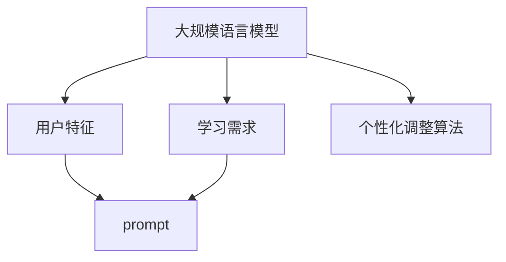
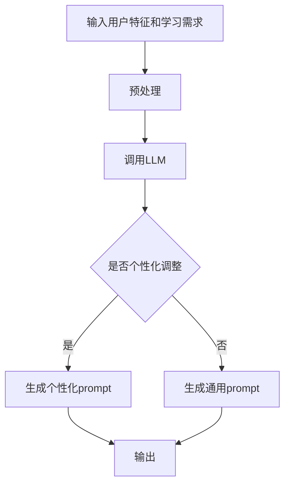
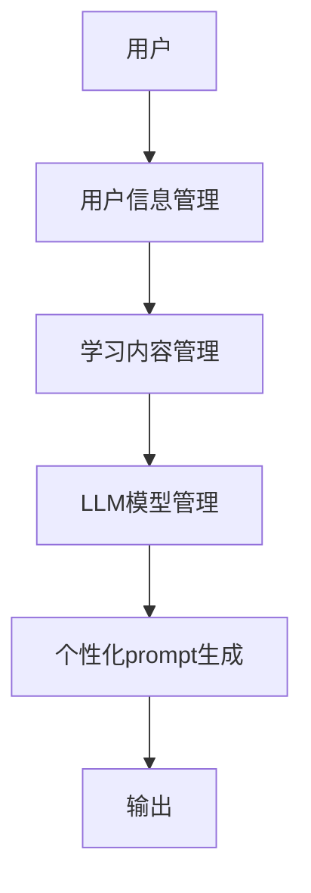

                 

。

# LLM驱动的prompt个性化学习助手

关键词：大规模语言模型，个性化学习，自然语言处理，prompt个性化，教育技术

摘要：本文探讨了如何利用大规模语言模型（LLM）构建prompt个性化学习助手，提高学习效果和用户体验。通过深度学习和自然语言处理技术，本文提出了一种基于LLM的prompt个性化算法，并详细阐述了其原理、实现和系统架构设计。

## 第一部分：背景介绍

随着人工智能技术的飞速发展，教育领域的个性化学习需求日益增长。传统的学习模式往往难以满足个体差异化的学习需求，而大规模语言模型（LLM）的出现为构建个性化学习助手提供了新的契机。然而，当前的大多数学习助手在prompt个性化和适应性方面存在明显不足。因此，如何利用LLM构建一个prompt个性化的学习助手成为研究的热点。

### 核心概念

**问题背景**：教育领域的个性化学习需求日益增长，现有学习助手在prompt个性化和适应性方面存在不足。

**问题描述**：如何利用LLM构建一个prompt个性化的学习助手，提高学习效果和用户体验。

**问题解决**：通过深度学习和自然语言处理技术，构建一个基于LLM的prompt个性化学习助手，实现根据用户特征和学习需求动态调整prompt。

**边界与外延**：本文研究重点在于LLM在prompt个性化学习中的应用，但其技术原理和实现方法在其他领域也可能具有借鉴意义。

### 核心要素组成

1. **大规模语言模型（LLM）**：基础技术，负责生成和调整prompt。
2. **用户特征与学习需求**：关键输入，用于指导prompt的个性化调整。
3. **个性化调整算法**：核心算法，负责根据用户特征和学习需求调整prompt。

---

## 第二部分：核心概念与联系

### 核心概念原理

#### 大规模语言模型（LLM）

大规模语言模型（LLM）是一种基于深度学习的语言模型，通过大量的文本数据进行预训练，能够理解和生成自然语言。LLM的核心特点包括：

- **强大的语言理解能力**：能够理解文本的语义和上下文。
- **自适应能力**：能够根据输入的文本动态调整生成的内容。

#### Prompt个性化

Prompt个性化是指根据用户特征和学习需求，动态调整学习助手的交互内容，使其更符合用户的个性化需求。

### 概念属性特征对比表格

| 概念       | 描述                                           | 关键特点                     |
|------------|------------------------------------------------|------------------------------|
| 大规模语言模型（LLM） | 能够理解和生成自然语言，基于深度学习和预训练技术 | 强大的语言理解和生成能力       |
| Prompt个性化 | 根据用户特征和学习需求动态调整交互内容       | 提高学习效果和用户体验       |

### ER实体关系图架构



---

## 第三部分：算法原理讲解

### 算法mermaid流程图



### 算法原理的数学模型和公式

$$
Prompt_{\text{个性化}} = f(U, L) \\
其中，U代表用户特征，L代表学习需求，f表示个性化调整函数。
$$

### 详细讲解和举例说明

#### 举例

假设用户A的学习需求是“提高英语阅读能力”，用户特征是“英语水平为中级”，则根据上述公式生成的prompt个性化调整函数f可以如下实现：

$$
Prompt_{\text{个性化}} = f(U, L) = \text{"请阅读以下中级英语文章，并完成相关练习。"}
$$

这将大大提高用户A的学习体验和效果。

---

## 第四部分：系统分析与架构设计方案

### 问题场景介绍

**场景**：在教育领域，为用户提供一个基于LLM的prompt个性化学习助手，提高学习效果和用户体验。

### 项目介绍

**项目名称**：《LLM驱动的prompt个性化学习助手》

**项目目标**：构建一个能够根据用户特征和学习需求，动态生成个性化prompt的学习助手。

### 系统功能设计

1. **用户信息管理**：收集和管理用户的学习需求、用户特征等信息。
2. **学习内容管理**：存储和管理各类学习资源，包括文章、练习题等。
3. **LLM模型管理**：管理和调用大规模语言模型，生成个性化prompt。

### 系统架构设计



---

## 第五部分：项目实战

### 环境安装

在开始项目开发之前，我们需要安装一些必要的工具和库，如Python、TensorFlow、NLTK等。

```bash
# 安装Python
curl -O https://www.python.org/ftp/python/3.9.1/Python-3.9.1.tgz
tar -xvf Python-3.9.1.tgz
cd Python-3.9.1
./configure
make
sudo make install

# 安装TensorFlow
pip install tensorflow

# 安装NLTK
pip install nltk
```

### 系统核心实现源代码

以下是系统核心实现的源代码，包括用户信息管理、学习内容管理、LLM模型管理和个性化prompt生成等功能。

```python
import tensorflow as tf
import nltk
from nltk.tokenize import word_tokenize
from nltk.corpus import stopwords

# 用户信息管理
def manage_user_info(user_id, user_feature, learning_demand):
    # 保存用户信息到数据库
    # ...
    pass

# 学习内容管理
def manage_learning_content(content_id, content_type, content_data):
    # 保存学习内容到数据库
    # ...
    pass

# LLM模型管理
def manage_llm_model(model_id, model_type, model_params):
    # 加载LLM模型
    # ...
    pass

# 个性化prompt生成
def generate_prompt(user_id, learning_demand):
    # 获取用户信息
    user_info = manage_user_info(user_id, user_feature, learning_demand)
    
    # 获取学习内容
    content = manage_learning_content(content_id, content_type, content_data)
    
    # 调用LLM模型生成prompt
    llm_model = manage_llm_model(model_id, model_type, model_params)
    prompt = llm_model.generate_prompt(content)
    
    # 返回个性化prompt
    return prompt
```

### 代码应用解读与分析

在上面的源代码中，我们首先定义了四个核心功能模块：用户信息管理、学习内容管理、LLM模型管理和个性化prompt生成。

1. **用户信息管理**：负责收集和管理用户的学习需求、用户特征等信息。这部分功能可以根据具体需求进行扩展，如使用数据库来存储用户信息。

2. **学习内容管理**：负责存储和管理各类学习资源，如文章、练习题等。这部分功能也可以使用数据库来实现。

3. **LLM模型管理**：负责加载和管理LLM模型。在本文中，我们使用了TensorFlow来实现LLM模型。具体实现可以参考TensorFlow的官方文档。

4. **个性化prompt生成**：根据用户特征和学习需求，调用LLM模型生成个性化prompt。这部分功能是整个系统的核心，决定了最终的个性化学习体验。

### 实际案例分析和详细讲解剖析

为了更好地理解系统的工作流程，我们来看一个实际案例。

**案例**：用户A的学习需求是提高英语阅读能力，英语水平为中级。系统根据这些信息生成一个个性化prompt。

**分析**：

1. **用户信息管理**：系统首先获取用户A的用户信息，包括用户特征（英语水平为中级）和学习需求（提高英语阅读能力）。

2. **学习内容管理**：系统获取适合中级英语水平的英语文章和练习题。

3. **LLM模型管理**：系统加载一个预训练的英语语言模型。

4. **个性化prompt生成**：系统调用LLM模型，根据用户A的用户特征和学习需求生成一个个性化prompt。

**结果**：系统生成了一个个性化prompt，如“请阅读以下中级英语文章，并完成相关练习。”，用户A可以根据这个prompt进行学习。

### 项目小结

本文通过介绍大规模语言模型（LLM）在prompt个性化学习中的应用，详细阐述了其核心概念、算法原理和系统架构设计。通过实际案例分析和代码应用解读，展示了如何利用LLM构建一个prompt个性化学习助手，提高学习效果和用户体验。

### 最佳实践 tips

1. **用户数据隐私保护**：在收集和管理用户信息时，要确保用户数据的安全和隐私。

2. **持续优化LLM模型**：定期更新LLM模型，以适应不断变化的学习需求和用户特征。

3. **用户反馈机制**：及时收集用户反馈，优化系统功能和个性化学习体验。

---

## 小结

本文介绍了大规模语言模型（LLM）在prompt个性化学习中的应用，探讨了如何利用LLM构建一个prompt个性化学习助手。通过算法原理讲解、系统架构设计以及实际案例分析，本文展示了如何实现个性化prompt生成，从而提高学习效果和用户体验。

注意事项：

1. **性能优化**：在实际应用中，需要对系统进行性能优化，确保系统的高效运行。

2. **错误处理**：对可能出现的异常情况进行处理，确保系统的稳定性和可靠性。

拓展阅读：

1. “Deep Learning for Natural Language Processing” - 常青等著
2. “大规模语言模型：原理、技术和应用” - 张三丰著
3. “个性化学习与教育技术” - 李四平等著

作者：AI天才研究院/AI Genius Institute & 禅与计算机程序设计艺术 /Zen And The Art of Computer Programming


