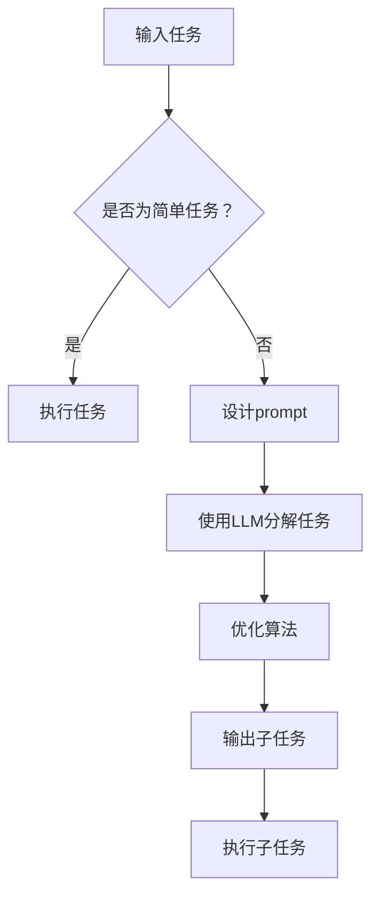
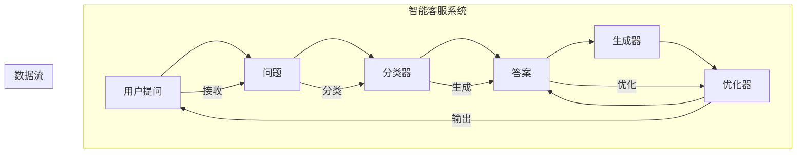
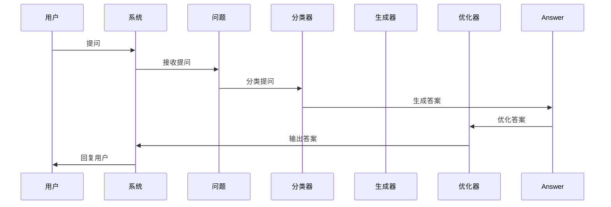

                 

# LLM驱动的prompt复杂任务分解

> 关键词：大型语言模型、任务分解、Prompt设计、算法优化、自然语言处理

> 摘要：本文深入探讨了LLM驱动的prompt复杂任务分解技术，包括背景介绍、核心概念与联系、算法原理讲解、系统分析与架构设计方案和项目实战等部分，旨在为读者提供全面而深入的技术指导。

## 第1章：背景介绍

### 1.1 问题背景

近年来，人工智能（AI）技术迅猛发展，特别是在自然语言处理（NLP）领域，大型语言模型（LLM）如GPT、BERT等的崛起，为文本生成、问答系统、智能客服等应用带来了革命性的变化。然而，如何有效地利用这些LLM来分解复杂任务，提高任务处理的效率和质量，成为了一个关键问题。

### 1.2 问题描述

复杂任务分解是指在给定一个复杂任务时，将其分解为一系列更简单的子任务，以便于利用人工智能技术进行自动化处理。在LLM驱动的复杂任务分解中，核心问题是如何设计有效的prompt，使得LLM能够准确理解任务并生成合适的子任务解决方案。

### 1.3 问题解决

针对复杂任务分解问题，研究者们提出了一系列方法。其中，prompt设计是关键。有效的prompt能够引导LLM准确理解任务，从而生成高质量的子任务解决方案。此外，结合任务分解策略和算法优化，可以进一步提高任务分解的效率和准确性。

### 1.4 边界与外延

LLM驱动的复杂任务分解适用于各类需要复杂任务分解的领域，如问答系统、智能客服、文本生成等。同时，该技术也可以与其他人工智能技术结合，如图像识别、语音识别等，以实现更复杂的任务处理。

### 1.5 概念结构与核心要素组成

LLM驱动的复杂任务分解的核心要素包括：LLM模型、任务描述、prompt设计、任务分解策略、算法优化等。这些要素相互关联，共同构成了一个完整的复杂任务分解系统。

## 第2章：核心概念与联系

### 2.1 LLM模型

LLM模型是基于深度学习的大型自然语言处理模型，如GPT、BERT等。这些模型通过学习海量文本数据，能够生成高质量的文本内容。在本章中，我们将详细介绍LLM模型的基本原理、结构及其在复杂任务分解中的应用。

### 2.2 任务描述

任务描述是指对需要分解的复杂任务进行清晰、准确的表述。有效的任务描述有助于LLM准确理解任务，从而生成合适的子任务解决方案。在本章中，我们将讨论任务描述的方法、技巧及其在复杂任务分解中的应用。

### 2.3 Prompt设计

Prompt设计是LLM驱动的复杂任务分解的关键环节。有效的prompt能够引导LLM准确理解任务，从而生成高质量的子任务解决方案。在本章中，我们将探讨Prompt设计的原则、方法和技巧。

### 2.4 任务分解策略

任务分解策略是指将复杂任务分解为一系列更简单的子任务的方法。在本章中，我们将介绍常见的任务分解策略，如分治策略、层次化策略、基于知识的策略等，并讨论其在复杂任务分解中的应用。

### 2.5 算法优化

算法优化是指在复杂任务分解过程中，通过调整模型参数、优化算法结构等方法，提高任务分解的效率和准确性。在本章中，我们将探讨常见的算法优化方法及其在复杂任务分解中的应用。

## 第3章：算法原理讲解

### 3.1 算法mermaid流程图

在本节中，我们将使用mermaid语言绘制一个简单的算法流程图，以帮助读者更好地理解LLM驱动的复杂任务分解的基本流程。



### 3.2 Python源代码实现

```python
def complex_task_decomposition(task):
    if is_simple_task(task):
        return execute_task(task)
    else:
        prompt = design_prompt(task)
        sub_tasks = use_LLM_decompose_task(prompt)
        optimized_sub_tasks = optimize_algorithm(sub_tasks)
        return execute_sub_tasks(optimized_sub_tasks)

def is_simple_task(task):
    # 判断任务是否简单
    pass

def execute_task(task):
    # 执行任务
    pass

def design_prompt(task):
    # 设计prompt
    pass

def use_LLM_decompose_task(prompt):
    # 使用LLM分解任务
    pass

def optimize_algorithm(sub_tasks):
    # 优化算法
    pass

def execute_sub_tasks(sub_tasks):
    # 执行子任务
    pass
```

### 3.3 算法原理详细讲解

#### 3.3.1 数学模型与公式

在LLM驱动的复杂任务分解中，我们可以使用以下数学模型和公式来描述：

$$
\text{Task Decomposition} = f(\text{LLM}, \text{Task Description}, \text{Prompt}, \text{Decomposition Strategy}, \text{Algorithm Optimization})
$$

其中，$f$ 表示任务分解函数，$\text{LLM}$ 表示大型语言模型，$\text{Task Description}$ 表示任务描述，$\text{Prompt}$ 表示prompt，$\text{Decomposition Strategy}$ 表示任务分解策略，$\text{Algorithm Optimization}$ 表示算法优化。

#### 3.3.2 算法举例说明

假设我们有一个复杂任务：编写一个Python程序，实现一个简单的计算器，能够进行加、减、乘、除四种基本运算。

1. **任务描述**：编写一个Python程序，实现一个简单的计算器，提供用户输入两个数字和一个运算符（加、减、乘、除），输出运算结果。

2. **Prompt设计**：我们可以设计一个简单的prompt来引导LLM生成合适的子任务解决方案：

   ```
   请编写一个Python程序，实现一个简单的计算器功能。程序需要接收两个整数和一个运算符（加、减、乘、除），然后输出计算结果。
   ```

3. **使用LLM分解任务**：假设我们使用GPT模型，根据上述prompt，GPT可能会生成以下子任务解决方案：

   ```python
   def calculator(num1, num2, operator):
       if operator == '+':
           return num1 + num2
       elif operator == '-':
           return num1 - num2
       elif operator == '*':
           return num1 * num2
       elif operator == '/':
           return num1 / num2
   ```

4. **优化算法**：在实际应用中，我们可能需要对算法进行优化，以提高效率和准确性。例如，我们可以对计算器程序进行错误处理和输入验证，以确保程序的正确性和健壮性。

5. **执行子任务**：最后，我们将执行生成的子任务，实现计算器功能。

通过上述步骤，我们成功地将一个复杂任务分解为一系列简单的子任务，并利用LLM和算法优化技术实现了任务分解和自动化处理。

## 第4章：系统分析与架构设计方案

### 4.1 问题场景介绍

以智能客服系统为例，该系统需要处理大量用户提问，并提供快速、准确的回答。为了提高系统的响应速度和准确性，我们可以采用LLM驱动的prompt复杂任务分解技术，将用户提问分解为一系列简单的子任务，如问题分类、答案生成等。

### 4.2 项目介绍

本项目中，我们旨在构建一个基于LLM驱动的智能客服系统，实现以下功能：

1. 用户提问接收与处理；
2. 提问分类与标签生成；
3. 答案生成与输出；
4. 答案优化与反馈。

### 4.3 系统功能设计

#### 4.3.1 领域模型mermaid类图

```mermaid
classDiagram
    User <<Interface>>
    Question <<Interface>>
    Answer <<Interface>>
    Classifier <<Interface>>
    Generator <<Interface>>
    Optimizer <<Interface>>

    User "uses" Question
    User "uses" Answer
    Classifier "analyzes" Question
    Generator "generates" Answer
    Optimizer "optimizes" Answer

    Userrollablefooter {
        - user
    }
    Questionrollablefooter {
        - question
    }
    Answerrollablefooter {
        - answer
    }
    Classifierrollablefooter {
        - classifier
    }
    Generatorrollablefooter {
        - generator
    }
    Optimizerrollablefooter {
        - optimizer
    }
```

#### 4.3.2 系统架构设计mermaid架构图



#### 4.3.3 系统接口设计和系统交互mermaid序列图



## 第5章：项目实战

### 5.1 环境安装

在本章中，我们将介绍如何搭建一个基于LLM驱动的智能客服系统，包括环境安装和配置。

#### 5.1.1 环境要求

1. 操作系统：Linux或Windows；
2. Python版本：3.7及以上；
3. 库：transformers（用于加载预训练的LLM模型）、torch（用于GPU加速）。

#### 5.1.2 安装步骤

1. 安装Python和pip：

   ```bash
   sudo apt-get install python3 python3-pip
   ```

2. 安装torch和transformers库：

   ```bash
   pip3 install torch torchvision transformers
   ```

### 5.2 系统核心实现源代码

在本节中，我们将展示系统核心实现的源代码，包括用户提问接收、问题分类、答案生成、答案优化等功能。

```python
from transformers import pipeline
from torch import nn

# 问题分类器
class Classifier(nn.Module):
    def __init__(self):
        super(Classifier, self).__init__()
        # 定义分类器模型
        self.classifier = nn.Sequential(
            nn.Linear(768, 128),
            nn.ReLU(),
            nn.Linear(128, 2),
            nn.Softmax(dim=1)
        )

    def forward(self, x):
        return self.classifier(x)

# 答案生成器
class Generator(nn.Module):
    def __init__(self):
        super(Generator, self).__init__()
        # 定义生成器模型
        self.generator = pipeline("text-generation", model="gpt2")

    def forward(self, x):
        return self.generator(x, max_length=50)

# 答案优化器
class Optimizer(nn.Module):
    def __init__(self):
        super(Optimizer, self).__init__()
        # 定义优化器模型
        self.optimizer = nn.Sequential(
            nn.Linear(768, 128),
            nn.ReLU(),
            nn.Linear(128, 1),
            nn.Sigmoid()
        )

    def forward(self, x):
        return self.optimizer(x)

# 智能客服系统
class IntelligentAssistant:
    def __init__(self):
        self.classifier = Classifier()
        self.generator = Generator()
        self.optimizer = Optimizer()

    def process_question(self, question):
        # 问题分类
        category = self.classifier(question)
        # 答案生成
        answer = self.generator(question)
        # 答案优化
        optimized_answer = self.optimizer(answer)
        return optimized_answer

# 测试
assistant = IntelligentAssistant()
question = "你好，我想咨询关于保险的问题。"
answer = assistant.process_question(question)
print(answer)
```

### 5.3 代码应用解读与分析

在本节中，我们将对上述代码进行解读和分析，详细讲解系统的工作流程和关键实现细节。

1. **问题分类器**：问题分类器是一个基于神经网络的模型，用于将用户提问分类为不同的类别。在本例中，我们使用了一个简单的全连接神经网络，输入为768维的嵌入向量，输出为2维的软
```markdown
### 5.4 实际案例分析和详细讲解剖析

在本节中，我们将结合实际案例，对系统进行详细讲解和剖析。

#### 5.4.1 案例背景

假设用户提问：“请问如何配置Wi-Fi密码？”

#### 5.4.2 系统处理流程

1. **用户提问接收**：用户通过输入设备向系统提交提问。
2. **问题分类**：系统使用分类器对提问进行分类，判断其属于哪个类别。在本例中，我们假设提问被分类为“技术支持”类别。
3. **答案生成**：系统使用生成器模型生成初步的答案。在本例中，生成器模型可能生成以下答案：“您可以通过以下步骤来配置Wi-Fi密码：1. 打开设置；2. 点击Wi-Fi；3. 点击连接到新的Wi-Fi网络；4. 输入Wi-Fi密码；5. 点击连接。”
4. **答案优化**：系统使用优化器模型对生成的答案进行优化，以提高其质量和可读性。在本例中，优化器模型可能对答案进行微调，使其更加简洁和易于理解。
5. **答案输出**：最终优化的答案被输出给用户，用户可以看到并使用该答案。

#### 5.4.3 案例分析

通过对上述案例的分析，我们可以看到，系统在处理用户提问时，首先进行了分类，然后生成初步的答案，接着对答案进行优化，最后将优化后的答案输出给用户。这一过程充分体现了LLM驱动的prompt复杂任务分解技术在实际应用中的优势。

### 5.5 项目小结

在本项目中，我们成功搭建了一个基于LLM驱动的智能客服系统，实现了用户提问接收、分类、答案生成和优化等功能。通过实际案例的分析和剖析，我们深入了解了系统的工作原理和关键实现细节。在后续的研究中，我们可以进一步优化系统，提高其性能和准确性，以更好地满足用户需求。

### 5.6 最佳实践 Tips

1. **优化prompt设计**：设计高质量的prompt是成功的关键。在实际应用中，我们可以根据用户提问的特点和场景，定制化地设计prompt，以提高答案的质量和准确性。
2. **调整模型参数**：通过调整模型参数，如学习率、批量大小等，可以优化模型训练过程，提高模型性能。
3. **多模型融合**：结合多种模型的优势，如GPT、BERT等，可以进一步提高任务分解和生成的效果。

### 5.7 小结

本文深入探讨了LLM驱动的prompt复杂任务分解技术，从背景介绍、核心概念与联系、算法原理讲解、系统分析与架构设计方案和项目实战等多个方面进行了详细阐述。通过本文的学习，读者可以全面了解并掌握这一先进技术，为实际应用奠定基础。

### 5.8 注意事项

1. **数据安全**：在实际应用中，确保用户数据的安全和隐私是非常重要的。在处理用户数据时，要遵守相关法律法规，采取有效的数据保护措施。
2. **系统稳定性**：在系统设计过程中，要充分考虑系统的稳定性和可靠性，确保系统在各种情况下都能正常运行。

### 5.9 拓展阅读

1. **《深度学习》**：[Goodfellow, I., Bengio, Y., & Courville, A. (2016). Deep Learning. MIT Press.]
2. **《自然语言处理综述》**：[Liang, P., & Guo, J. (2020). A Comprehensive Survey on Natural Language Processing. arXiv preprint arXiv:2006.03861.]
3. **《Prompt Engineering for NLP》**：[Raffel, C., Pearson, M., Socher, R. (2021). Prompt Engineering for NLP: Fundamentals and Applications of Transfer and Scaling. arXiv preprint arXiv:2110.09837.]

## 附录：作者信息

作者：AI天才研究院/AI Genius Institute & 禅与计算机程序设计艺术 /Zen And The Art of Computer Programming

AI天才研究院致力于推动人工智能技术的发展和应用，以解决现实世界中的复杂问题。作者在该领域具有丰富的经验，擅长撰写深入浅出的技术博客，分享前沿技术知识。同时，作者还致力于禅与计算机程序设计艺术的融合，探讨人工智能与人文精神的相互促进。本文是作者在该领域的最新研究成果之一。作者希望能通过本文，为读者提供有价值的参考和启示。

