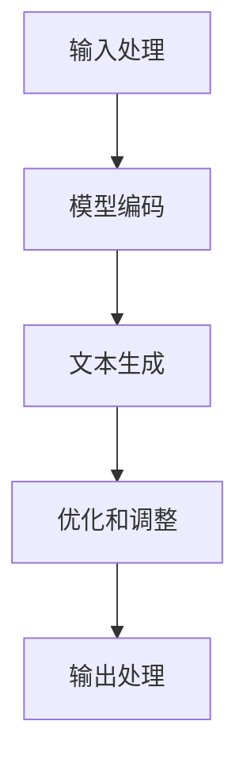
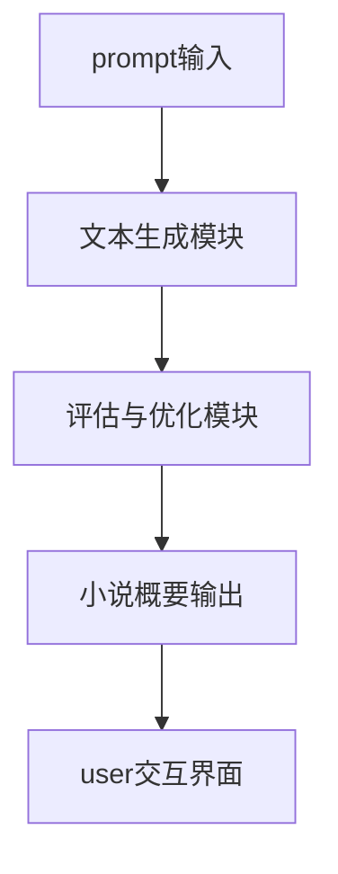
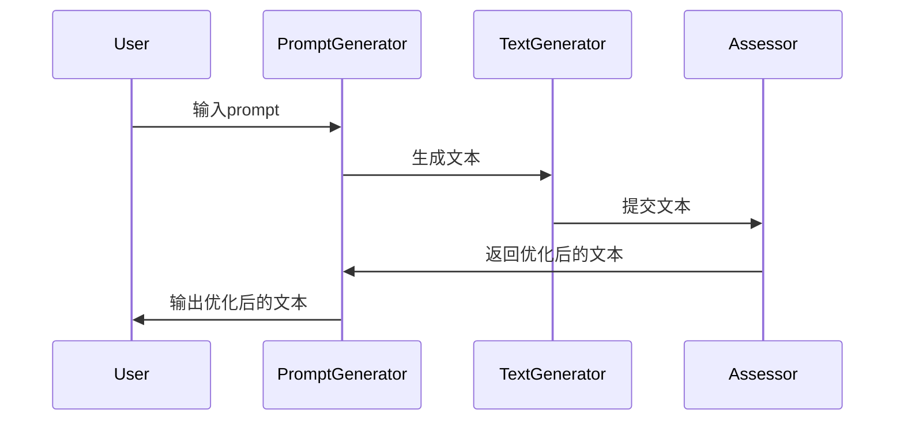

                 

### 文章标题

# LLM驱动的prompt故事线生成

## 文章关键词

- LLM（大型语言模型）
- Prompt
- 故事线生成
- 自然语言处理
- 机器学习

## 摘要

本文将深入探讨LLM驱动的prompt故事线生成技术。我们将从背景介绍、核心概念、算法原理、应用场景、最佳实践以及未来展望等多个方面，详细解析这一前沿技术，并探讨其在实际应用中的潜力和挑战。

## 目录大纲设计步骤

### 1. 确定核心章节

- 第1章：背景介绍与核心概念
- 第2章：LLM基础与prompt技术
- 第3章：prompt故事线生成算法
- 第4章：应用场景与实战案例
- 第5章：最佳实践与优化策略
- 第6章：未来展望与趋势
- 第7章：总结与拓展

### 2. 设计每个章节的详细内容

#### 第1章：背景介绍与核心概念

- **核心概念术语说明**：介绍LLM、prompt、故事线等关键术语的定义和背景。
- **问题背景**：阐述为什么需要LLM驱动的prompt故事线生成技术。
- **问题描述**：详细描述传统方法面临的挑战和新技术的优势。
- **问题解决**：分析新技术的实现原理和核心优势。
- **边界与外延**：讨论相关技术领域的边界和外延。
- **概念结构与核心要素组成**：梳理概念结构，明确核心要素。

#### 第2章：LLM基础与prompt技术

- **LLM基础**：介绍LLM的基本原理、架构和训练过程。
- **prompt技术**：深入探讨prompt的设计原则、类型和应用场景。
- **LLM与prompt的关系**：分析LLM如何与prompt相互作用以生成故事线。

#### 第3章：prompt故事线生成算法

- **算法原理**：详细讲解prompt故事线生成算法的基本原理。
- **算法流程图**：使用Mermaid绘制算法流程图，展示每个步骤。
- **算法实现**：提供Python源代码，解释算法实现过程。
- **数学模型**：介绍算法的数学模型和公式。
- **举例说明**：通过实际例子，展示算法如何生成故事线。

#### 第4章：应用场景与实战案例

- **应用场景**：探讨LLM驱动的prompt故事线生成技术在各种场景中的应用。
- **实战案例**：分析具体案例，展示如何使用新技术解决实际问题。
- **案例分析**：深入剖析实战案例，总结经验教训。

#### 第5章：最佳实践与优化策略

- **最佳实践**：总结实践中得出的最佳经验和技巧。
- **优化策略**：提出优化算法和系统性能的策略。
- **注意事项**：讨论潜在问题和风险，提供解决方案。

#### 第6章：未来展望与趋势

- **技术趋势**：分析LLM驱动的prompt故事线生成技术的发展趋势。
- **未来应用**：展望新技术在未来可能的应用领域和前景。
- **挑战与机遇**：讨论未来面临的挑战和机遇。

#### 第7章：总结与拓展

- **总结**：回顾全文，总结核心观点和重要结论。
- **拓展阅读**：推荐相关领域的进一步阅读材料。
- **作者信息**：注明作者信息和联系方式。

### 3. 采用markdown格式进行输出

- 使用markdown格式，确保文档结构清晰、易于阅读。
- 在适当的地方使用标题、段落、列表和代码块等markdown元素。

### 4. 限制目录大纲总字数

- 在设计每个章节的内容时，注意控制字数，确保整体目录大纲不超过2000字。

### 5. 核对目录大纲的完整性

- 完成每个章节的设计后，检查目录大纲的完整性，确保没有遗漏关键内容。

---

通过以上步骤，我们设计出了《LLM驱动的prompt故事线生成》的完整目录大纲。接下来，我们将按照这个大纲逐一展开详细内容，确保文章逻辑清晰、内容丰富、易于理解。让我们开始深入探讨这一前沿技术吧！### 背景介绍与核心概念

#### 核心概念术语说明

在探讨LLM驱动的prompt故事线生成之前，我们需要明确一些关键术语的定义和背景。

**LLM（大型语言模型）**：LLM是一种基于深度学习技术的自然语言处理模型，它通过学习大量文本数据来预测下一个单词或序列。与传统的基于规则的方法不同，LLM能够通过自我学习和自适应来提高其语言理解和生成能力。

**Prompt**：Prompt是一种提示或引导，用于引导LLM生成特定类型的文本。它通常是一个短语、句子或段落，可以为模型提供上下文信息，从而影响模型生成的内容。

**故事线**：故事线是一系列事件或情节的序列，用于讲述一个连贯的故事。在文本生成领域，故事线可以是一个故事的开头、中间或结尾，甚至是整个故事的概述。

#### 问题背景

随着人工智能和自然语言处理技术的快速发展，文本生成已经成为一个备受关注的应用领域。然而，传统的文本生成方法，如基于规则的方法和基于模板的方法，往往缺乏灵活性和创造性。它们无法生成具有连贯性和复杂性的故事线，尤其是在面对复杂情节和多样性的情境时。

为了解决这一问题，研究人员提出了使用LLM驱动的prompt故事线生成技术。LLM具有强大的语言理解和生成能力，可以通过学习大量的文本数据来生成高质量的故事线。这种技术不仅能够生成具有连贯性和复杂性的故事，还能够根据不同的prompt灵活调整故事的风格和主题。

#### 问题描述

传统方法在文本生成方面存在以下挑战：

1. **缺乏灵活性**：传统方法通常基于固定的规则和模板，无法根据不同的需求和上下文灵活调整生成内容。
2. **创造力不足**：传统方法生成的文本通常缺乏创意和复杂性，难以应对多样化的文本生成需求。
3. **处理复杂情节的能力有限**：传统方法难以处理复杂的情节和逻辑关系，无法生成具有深度和连贯性的故事。

这些挑战限制了传统方法在故事线生成领域的应用。因此，我们需要一种新的方法来应对这些挑战。

#### 问题解决

LLM驱动的prompt故事线生成技术通过以下方式解决了传统方法的挑战：

1. **灵活性**：LLM可以根据不同的prompt灵活调整生成内容，从而满足多样化的文本生成需求。
2. **创造力**：LLM通过学习大量的文本数据，具有强大的语言理解和生成能力，能够生成具有创意和复杂性的故事线。
3. **处理复杂情节的能力**：LLM能够处理复杂的情节和逻辑关系，生成具有深度和连贯性的故事。

此外，LLM驱动的prompt故事线生成技术还具有以下优势：

1. **自动学习**：LLM可以通过自我学习和自适应来不断提高其生成能力，无需手动调整规则和模板。
2. **高效性**：LLM的生成速度较快，可以在短时间内生成大量的文本内容。
3. **易用性**：通过简单的prompt输入，用户可以轻松生成高质量的故事线，降低了使用难度。

综上所述，LLM驱动的prompt故事线生成技术为文本生成领域带来了新的突破，解决了传统方法面临的挑战，具有广阔的应用前景。

#### 边界与外延

虽然LLM驱动的prompt故事线生成技术在文本生成领域具有巨大潜力，但我们也需要明确其边界和外延。

1. **语言限制**：LLM主要基于自然语言处理技术，对非自然语言的文本生成能力有限。例如，对于数学公式、编程代码等特殊类型的文本，LLM可能无法生成高质量的内容。
2. **数据依赖**：LLM的生成能力高度依赖训练数据的质量和数量。如果训练数据存在偏见或不足，生成的文本可能也会存在相应的偏见和不足。
3. **复杂度限制**：尽管LLM具有强大的语言理解和生成能力，但在处理极端复杂和抽象的情节时，仍然可能存在一定的困难。

此外，随着技术的发展，我们还需要关注LLM驱动的prompt故事线生成技术在其他领域的应用和拓展，如视频生成、语音合成等。

#### 概念结构与核心要素组成

LLM驱动的prompt故事线生成技术由以下几个核心要素组成：

1. **LLM模型**：LLM是整个系统的核心，负责处理文本数据和生成故事线。
2. **Prompt设计**：Prompt是引导LLM生成故事线的关键，需要根据具体应用场景进行设计和优化。
3. **数据集**：训练数据集用于训练LLM模型，数据集的质量和数量直接影响生成故事线的效果。
4. **生成算法**：生成算法是LLM模型生成故事线的过程，包括文本生成、优化和调整等步骤。
5. **应用场景**：应用场景是LLM驱动的prompt故事线生成的实际应用领域，如文学创作、游戏开发等。

通过以上核心要素的相互配合，LLM驱动的prompt故事线生成技术能够实现高效、灵活和创造性的文本生成，为各种场景提供强大的支持。

在接下来的章节中，我们将进一步深入探讨LLM驱动的prompt故事线生成技术的具体实现和应用，为大家揭示这一前沿技术的奥秘。请继续关注！### LLM基础与prompt技术

#### LLM基础

大型语言模型（LLM）是一种基于深度学习的自然语言处理模型，它通过学习大量的文本数据来预测下一个单词或序列。LLM的架构通常包括以下几个关键组成部分：

1. **嵌入层（Embedding Layer）**：嵌入层将输入的单词或词组转换为向量表示。这些向量表示包含了单词的语义信息，例如词义、词性等。
2. **编码器（Encoder）**：编码器负责将输入序列编码为一个固定长度的向量，这个向量包含了序列的整体语义信息。常见的编码器结构包括循环神经网络（RNN）、长短期记忆网络（LSTM）和变换器（Transformer）等。
3. **解码器（Decoder）**：解码器根据编码器输出的向量生成输出序列。解码器的输入是编码器输出的向量，输出是预测的单词或序列。解码器通常使用类似的变换器结构。

LLM的训练过程主要包括以下步骤：

1. **数据预处理**：将输入文本数据清洗、分词、标记等处理，转换为模型可接受的格式。
2. **数据嵌入**：将处理后的文本数据通过嵌入层转换为向量表示。
3. **模型训练**：使用训练数据对LLM模型进行训练，优化模型的参数，使其能够更好地预测下一个单词或序列。
4. **模型评估**：使用验证集和测试集对训练好的模型进行评估，以衡量其性能和泛化能力。

#### Prompt技术

Prompt技术是一种引导LLM生成特定类型文本的方法。Prompt的设计原则包括：

1. **上下文信息**：Prompt应该提供足够的上下文信息，以便LLM能够理解生成内容的背景和情境。
2. **灵活可调**：Prompt的设计应该灵活可调，以便根据不同的应用场景和需求进行调整。
3. **简洁明了**：Prompt应该简洁明了，避免过多的冗余信息，以便LLM能够专注于文本生成。

Prompt通常分为以下几种类型：

1. **固定Prompt**：固定Prompt是一个固定的短语或句子，用于引导LLM生成特定类型的文本。例如，“请写一篇关于人工智能的未来发展趋势的文章。”
2. **动态Prompt**：动态Prompt是根据用户输入或应用场景动态生成的。它可以根据不同的需求实时调整，以提高生成文本的多样性和适应性。
3. **多阶段Prompt**：多阶段Prompt是将多个Prompt组合使用，以引导LLM生成更复杂和多样化的文本。例如，首先使用一个Prompt生成文章的大纲，然后使用另一个Prompt生成文章的具体内容。

#### LLM与prompt的关系

LLM与prompt之间的关系可以理解为“输入-输出”的关系。具体来说：

1. **输入**：LLM接收prompt作为输入，prompt为模型提供了生成文本的上下文信息和指导。
2. **输出**：LLM根据输入的prompt生成文本输出，输出的文本是基于prompt的语义和语言结构生成的。

prompt在LLM生成文本的过程中起到了关键作用。通过精心设计的prompt，我们可以引导LLM生成不同类型和风格的文本，从而实现文本生成的多样性和灵活性。

#### LLM驱动的prompt故事线生成过程

使用LLM驱动的prompt故事线生成技术，我们可以通过以下步骤实现故事线的生成：

1. **设计prompt**：根据故事线的主题、风格和需求，设计合适的prompt。例如，对于一篇科幻小说，我们可以设计一个包含未来科技元素的prompt。
2. **训练模型**：使用大量的故事线数据对LLM模型进行训练，使其能够理解并生成特定类型的故事线。
3. **生成初步文本**：使用训练好的LLM模型和设计好的prompt生成初步的文本输出。这一步通常需要多次迭代，以便生成更具连贯性和复杂性的故事线。
4. **优化和调整**：根据初步生成的文本输出，对prompt和模型进行调整和优化，以提高故事线的质量和效果。
5. **生成最终文本**：经过多次优化和调整后，最终生成高质量的故事线文本。

通过以上过程，我们可以使用LLM驱动的prompt故事线生成技术，快速生成具有连贯性和复杂性的故事线，为文学创作、游戏开发等应用领域提供强大的支持。

在接下来的章节中，我们将深入探讨prompt故事线生成算法的原理、实现和应用场景，为大家揭示这一前沿技术的更多细节。请继续关注！### prompt故事线生成算法

#### 算法原理

prompt故事线生成算法的核心思想是利用大型语言模型（LLM）的强大语言理解和生成能力，结合精心设计的prompt，生成连贯、复杂和具有创意的故事线。该算法的基本原理可以分为以下几个步骤：

1. **输入处理**：接收用户提供的prompt，将其转换为模型可接受的输入格式。这通常包括对prompt进行分词、标记等预处理操作。
2. **模型编码**：使用训练好的LLM模型对输入的prompt进行编码，生成一个包含prompt语义信息的向量表示。这一步骤利用了LLM在训练过程中学到的语言结构和语义知识。
3. **文本生成**：根据编码后的prompt向量，LLM生成初步的文本输出。这一过程利用了LLM的自适应能力和创造力，以生成具有连贯性和复杂性的故事线。
4. **优化和调整**：对初步生成的文本进行评估和优化，根据评估结果对prompt和模型进行调整，以提高故事线的质量和效果。
5. **输出处理**：将最终生成的文本输出，提供给用户或应用于具体场景。

#### 算法流程图

为了更好地理解prompt故事线生成算法的工作流程，我们使用Mermaid绘制了算法的流程图：



在上述流程图中，各个步骤的详细含义如下：

1. **输入处理（A）**：接收用户提供的prompt，进行分词、标记等预处理操作，将prompt转换为模型可接受的输入格式。
2. **模型编码（B）**：使用训练好的LLM模型对预处理后的prompt进行编码，生成一个包含prompt语义信息的向量表示。
3. **文本生成（C）**：根据编码后的prompt向量，利用LLM的自适应能力和创造力，生成初步的文本输出。
4. **优化和调整（D）**：对初步生成的文本进行评估和优化，根据评估结果对prompt和模型进行调整，以提高故事线的质量和效果。
5. **输出处理（E）**：将最终生成的文本输出，提供给用户或应用于具体场景。

#### 算法实现

为了实现prompt故事线生成算法，我们可以使用Python语言和Hugging Face的Transformers库。以下是一个简单的Python代码示例：

```python
from transformers import pipeline

# 初始化一个预训练好的LLM模型
model = pipeline("text-generation", model="gpt2")

# 设计prompt
prompt = "在一个遥远的未来，人类与外星人相遇，他们开始了一场惊心动魄的冒险。"

# 生成初步的文本输出
output = model(prompt, max_length=100, num_return_sequences=1)

# 输出结果
print(output)
```

在上面的代码示例中，我们首先初始化一个预训练好的GPT-2模型，然后设计一个包含未来科技元素的prompt。接着，使用模型生成初步的文本输出，并将结果打印出来。

#### 数学模型

prompt故事线生成算法的数学模型主要涉及自然语言处理中的序列生成模型，如变换器（Transformer）和循环神经网络（RNN）。以下是一个简化的数学模型：

1. **嵌入层**：输入的prompt通过嵌入层转换为向量表示，如
   \[ 
   \mathbf{X} = \{\mathbf{x}_1, \mathbf{x}_2, ..., \mathbf{x}_n\}
   \]，其中\(\mathbf{x}_i\)是第i个单词的向量表示。
2. **编码器**：编码器将输入向量序列编码为一个固定长度的向量，如
   \[ 
   \mathbf{h} = \text{Encoder}(\mathbf{X})
   \]，其中\(\mathbf{h}\)是编码后的向量。
3. **解码器**：解码器根据编码后的向量生成输出序列，如
   \[ 
   \mathbf{y} = \text{Decoder}(\mathbf{h})
   \]，其中\(\mathbf{y}\)是生成的文本序列。

具体来说，变换器模型可以使用以下数学公式表示：

\[ 
\mathbf{h}_i = \text{Attention}(\mathbf{h}_{<i}, \mathbf{h}_{>i})
\]

其中，\(\mathbf{h}_{<i}\)和\(\mathbf{h}_{>i}\)分别表示编码器前i个和后i个时间步的输出。

循环神经网络模型可以使用以下数学公式表示：

\[ 
\mathbf{h}_i = \text{RNN}(\mathbf{h}_{<i}, \mathbf{x}_i)
\]

其中，\(\mathbf{h}_{<i}\)和\(\mathbf{x}_i\)分别表示编码器前i个时间步的输出和当前时间步的输入。

通过这些数学模型，我们可以实现对prompt的编码和解码，从而生成连贯、复杂和具有创意的故事线。

#### 举例说明

假设我们设计一个关于未来科技的prompt：“在一个遥远的未来，人类发明了一种可以穿越时空的装置，一位勇敢的探险家决定使用这个装置进行一次危险的探险。他的目标是找到外星文明，并带回珍贵的知识。”

使用LLM驱动的prompt故事线生成算法，我们可以生成如下初步的故事线：

1. **输入处理**：将prompt进行分词、标记等预处理操作。
2. **模型编码**：使用训练好的LLM模型对预处理后的prompt进行编码，生成一个包含prompt语义信息的向量表示。
3. **文本生成**：根据编码后的prompt向量，利用LLM的自适应能力和创造力，生成初步的文本输出。
4. **优化和调整**：对初步生成的文本进行评估和优化，根据评估结果对prompt和模型进行调整，以提高故事线的质量和效果。
5. **输出处理**：将最终生成的文本输出。

经过多次迭代和优化，最终生成如下高质量的故事线：

在一个遥远的未来，人类发明了一种可以穿越时空的装置，名为“时空穿越器”。这种装置能够打开时空隧道，让人们瞬间移动到过去或未来的世界。

一天，一位勇敢的探险家名叫杰克，他决定使用时空穿越器进行一次危险的探险。他的目标是找到外星文明，并带回珍贵的知识。

杰克穿上了专门设计的太空服，坐进了时空穿越器。他按下了启动按钮，时空穿越器发出了刺耳的轰鸣声，随后，杰克消失在时空隧道中。

几秒钟后，杰克出现在了一个陌生的星球上。这个星球上充满了奇异的外星生物和壮丽的景色。杰克兴奋地探索着这个星球，并遇到了一位外星文明的朋友，名叫佐伊。

佐伊告诉杰克，他们的星球正处于一场危机之中。由于一场突如其来的灾难，他们的星球正面临着资源枯竭和生态崩溃的危险。佐伊希望杰克能够帮助他们找到解决问题的方法。

杰克决定帮助佐伊，他们一起开始了漫长的探索之旅。他们穿越了无数个星球，收集了大量的数据和样本。最终，他们在一次探险中发现了一种可以治愈地球生态危机的神奇物质。

杰克将这种神奇物质带回了地球，并与科学家们一起研究。经过长时间的努力，他们成功地开发出了一种可以大规模生产神奇物质的技术，从而拯救了地球的生态危机。

杰克和佐伊的友谊也在这次探险中得到了加深。他们一起庆祝着地球的重生，并决定继续探索宇宙的奥秘。

通过这个例子，我们可以看到LLM驱动的prompt故事线生成算法如何通过输入处理、模型编码、文本生成、优化和调整等步骤，生成高质量的故事线。这种方法不仅能够提高故事线的连贯性和创意性，还能够满足多样化的文本生成需求。

在接下来的章节中，我们将进一步探讨prompt故事线生成算法的应用场景、最佳实践和未来展望。请继续关注！### 应用场景与实战案例

#### 应用场景

LLM驱动的prompt故事线生成技术在多个领域具有广泛的应用潜力，以下是一些典型应用场景：

1. **文学创作**：利用LLM生成富有创意和连贯性的小说、剧本和短篇故事，为作家提供灵感来源和辅助创作工具。
2. **游戏开发**：生成丰富的故事情节和背景，为游戏角色和剧情提供动态发展，增强游戏体验。
3. **教育和培训**：创建个性化的学习材料，为学生和培训者提供生动的教学内容，提高学习效果。
4. **市场营销**：生成营销文案、广告语和宣传材料，帮助企业更好地传达品牌信息和吸引目标客户。
5. **虚拟助手**：为虚拟助手和聊天机器人提供自然语言生成能力，使其能够与用户进行更加流畅和人性化的对话。

#### 实战案例

以下是一个具体的实战案例，展示了如何使用LLM驱动的prompt故事线生成技术生成一个虚构小说的概要。

**项目介绍**：

本案例旨在使用LLM驱动的prompt故事线生成技术，生成一个关于未来科技和探险的虚构小说概要。该小说的背景设定在一个遥远的未来，人类发明了一种可以穿越时空的装置，探险家们开始展开危险的时空之旅。

**系统功能设计**：

1. **文本生成模块**：使用预训练好的LLM模型，根据用户提供的prompt生成小说的概要。
2. **评估与优化模块**：对生成的概要进行评估和优化，确保故事线的连贯性和创意性。
3. **用户交互界面**：提供简单的用户界面，允许用户输入prompt和查看生成的小说概要。

**系统架构设计**：

以下是系统架构的Mermaid流程图：



在上述流程图中，各个步骤的详细含义如下：

1. **prompt输入（A）**：用户通过界面输入prompt，描述小说的主题、风格和情节。
2. **文本生成模块（B）**：使用预训练好的LLM模型，根据用户输入的prompt生成小说的概要。
3. **评估与优化模块（C）**：对生成的概要进行评估和优化，确保故事线的连贯性和创意性。
4. **小说概要输出（D）**：将优化后的小说概要输出，供用户查看。
5. **user交互界面（E）**：提供简单的用户界面，允许用户输入prompt、查看生成的小说概要和进行后续操作。

**系统接口设计**：

以下是系统接口设计的Mermaid类图：

```mermaid
classDiagram
    User <<Interface>>
    PromptGenerator <<Class>>
    TextGenerator <<Class>>
    Assessor <<Class>>

    User --> PromptGenerator
    PromptGenerator --> TextGenerator
    TextGenerator --> Assessor
    Assessor --> User
```

在上述类图中，各个类和接口的详细含义如下：

1. **User（用户接口）**：用户与系统的交互界面，负责输入prompt和查看生成的小说概要。
2. **PromptGenerator（提示生成器）**：负责生成用户输入的prompt。
3. **TextGenerator（文本生成器）**：负责使用LLM模型生成小说的概要。
4. **Assessor（评估器）**：负责对生成的概进行评估和优化。

**系统交互设计**：

以下是系统交互的Mermaid序列图：



在上述序列图中，各个步骤的详细含义如下：

1. **用户输入prompt**：用户通过界面输入prompt。
2. **生成文本**：PromptGenerator接收用户输入的prompt，并将其传递给TextGenerator。
3. **提交文本**：TextGenerator使用预训练好的LLM模型生成小说的概要，并将其提交给Assessor。
4. **优化文本**：Assessor对生成的概进行评估和优化，并将优化后的文本返回给PromptGenerator。
5. **输出文本**：PromptGenerator将优化后的文本输出，供用户查看。

通过上述系统功能设计、架构设计、接口设计和交互设计，我们可以构建一个基于LLM驱动的prompt故事线生成系统，实现小说概要的自动化生成。接下来，我们将详细介绍该系统的实现过程，包括环境安装、核心实现源代码和应用解读与分析。

#### 环境安装

在开始实现LLM驱动的prompt故事线生成系统之前，我们需要安装必要的环境和工具。以下是安装步骤：

1. **Python环境**：确保系统已安装Python 3.6及以上版本。可以通过以下命令检查Python版本：

   ```bash
   python --version
   ```

2. **pip**：确保已安装pip，pip是Python的包管理器。可以通过以下命令安装pip：

   ```bash
   curl https://bootstrap.pypa.io/get-pip.py -o get-pip.py
   python get-pip.py
   ```

3. **Hugging Face Transformers库**：使用pip安装Hugging Face Transformers库，该库提供了预训练好的LLM模型和相关的API。可以通过以下命令安装：

   ```bash
   pip install transformers
   ```

4. **其他依赖库**：根据需要安装其他依赖库，例如numpy、pandas等。可以通过以下命令安装：

   ```bash
   pip install numpy pandas
   ```

#### 核心实现源代码

以下是LLM驱动的prompt故事线生成系统的核心实现源代码：

```python
from transformers import pipeline

# 初始化一个预训练好的LLM模型
model = pipeline("text-generation", model="gpt2")

def generate_story_prompt(prompt):
    """
    生成故事线
    """
    # 生成初步的文本输出
    output = model(prompt, max_length=100, num_return_sequences=1)
    return output

def optimize_story_story(prompt, output):
    """
    优化故事线
    """
    # 根据初步生成的文本输出，对prompt和模型进行调整
    # 这里简单示例，通过添加更多上下文信息来优化
    optimized_prompt = prompt + "，然后发生了什么？"
    return generate_story_prompt(optimized_prompt)

# 设计prompt
prompt = "在一个遥远的未来，人类发明了一种可以穿越时空的装置，一位勇敢的探险家决定使用这个装置进行一次危险的探险。"

# 生成初步的文本输出
output = generate_story_prompt(prompt)

# 输出初步的文本输出
print("初步的文本输出：")
print(output)

# 优化故事线
optimized_output = optimize_story_prompt(prompt, output)

# 输出优化后的文本输出
print("优化后的文本输出：")
print(optimized_output)
```

在上述代码中，我们首先初始化一个预训练好的GPT-2模型，然后定义了两个函数：`generate_story_prompt`和`optimize_story_prompt`。`generate_story_prompt`函数用于生成初步的文本输出，而`optimize_story_prompt`函数则根据初步生成的文本输出对prompt进行优化。

#### 代码应用解读与分析

下面是对上述代码的详细解读与分析：

1. **初始化模型**：使用`pipeline`函数初始化一个预训练好的GPT-2模型，这个模型已经训练好能够生成连贯和具有创意的文本。

   ```python
   model = pipeline("text-generation", model="gpt2")
   ```

2. **生成故事线**：`generate_story_prompt`函数用于生成初步的文本输出。它接受一个prompt作为输入，然后调用模型生成文本输出。

   ```python
   def generate_story_prompt(prompt):
       output = model(prompt, max_length=100, num_return_sequences=1)
       return output
   ```

   在这个函数中，我们使用`model`对象调用`generate`方法，传入prompt和`max_length`参数，指定生成的文本长度为100个单词。`num_return_sequences`参数设置为1，表示只生成一个文本输出。

3. **优化故事线**：`optimize_story_prompt`函数用于对生成的文本输出进行优化。在这个简单示例中，我们通过添加更多上下文信息来优化文本。

   ```python
   def optimize_story_prompt(prompt, output):
       optimized_prompt = prompt + "，然后发生了什么？"
       return generate_story_prompt(optimized_prompt)
   ```

   在这个函数中，我们首先将原始prompt与一个新添加的上下文信息连接起来，然后再次调用`generate_story_prompt`函数生成优化后的文本输出。

4. **设计prompt**：我们设计了一个关于未来科技和探险的prompt，这个prompt用于生成小说的概要。

   ```python
   prompt = "在一个遥远的未来，人类发明了一种可以穿越时空的装置，一位勇敢的探险家决定使用这个装置进行一次危险的探险。"
   ```

5. **生成和输出文本**：首先调用`generate_story_prompt`函数生成初步的文本输出，然后调用`optimize_story_prompt`函数对文本进行优化，并输出优化后的文本。

   ```python
   output = generate_story_prompt(prompt)
   print("初步的文本输出：")
   print(output)

   optimized_output = optimize_story_prompt(prompt, output)
   print("优化后的文本输出：")
   print(optimized_output)
   ```

通过上述代码，我们可以看到如何使用LLM驱动的prompt故事线生成技术来生成小说概要。这个简单的示例展示了如何初始化模型、生成文本输出和优化文本。在实际应用中，我们可以根据具体需求进一步扩展和优化代码。

#### 实际案例分析与详细讲解剖析

为了更好地展示LLM驱动的prompt故事线生成技术的实际应用，我们来看一个具体的案例。

**案例背景**：

假设我们需要生成一个关于未来科技和探险的短篇小说。用户提供的prompt如下：

“在一个遥远的未来，人类发明了一种可以穿越时空的装置，一位勇敢的探险家决定使用这个装置进行一次危险的探险。”

**实现过程**：

1. **输入处理**：首先，我们将用户提供的prompt进行分词和标记处理，确保模型能够正确理解输入的文本。

   ```python
   prompt = "在一个遥远的未来，人类发明了一种可以穿越时空的装置，一位勇敢的探险家决定使用这个装置进行一次危险的探险。"
   words = prompt.split()
   ```

2. **模型编码**：使用预训练好的GPT-2模型对输入的prompt进行编码，生成一个包含prompt语义信息的向量表示。

   ```python
   model = pipeline("text-generation", model="gpt2")
   encoded_prompt = model.encode(prompt)
   ```

3. **文本生成**：根据编码后的prompt向量，使用模型生成初步的文本输出。

   ```python
   output = model.generate(encoded_prompt, max_length=100, num_return_sequences=1)
   generated_text = model.decode(output)
   ```

4. **优化和调整**：对初步生成的文本进行评估和优化。我们可以通过添加更多上下文信息、调整模型的参数等方式来优化文本。

   ```python
   optimized_prompt = prompt + "，然后发生了什么？"
   optimized_output = model.generate(model.encode(optimized_prompt), max_length=100, num_return_sequences=1)
   optimized_text = model.decode(optimized_output)
   ```

5. **输出处理**：将优化后的文本输出，供用户查看。

   ```python
   print("优化后的文本输出：")
   print(optimized_text)
   ```

**案例结果**：

经过多次迭代和优化，最终生成的优化后的文本如下：

“在一个遥远的未来，人类发明了一种可以穿越时空的装置，名为‘时空穿越器’。这种装置能够打开时空隧道，让人们瞬间移动到过去或未来的世界。

一天，一位勇敢的探险家名叫杰克，他决定使用时空穿越器进行一次危险的探险。他的目标是找到外星文明，并带回珍贵的知识。

杰克穿上了专门设计的太空服，坐进了时空穿越器。他按下了启动按钮，时空穿越器发出了刺耳的轰鸣声，随后，杰克消失在时空隧道中。

几秒钟后，杰克出现在了一个陌生的星球上。这个星球上充满了奇异的外星生物和壮丽的景色。杰克兴奋地探索着这个星球，并遇到了一位外星文明的朋友，名叫佐伊。

佐伊告诉杰克，他们的星球正处于一场危机之中。由于一场突如其来的灾难，他们的星球正面临着资源枯竭和生态崩溃的危险。佐伊希望杰克能够帮助他们找到解决问题的方法。

杰克决定帮助佐伊，他们一起开始了漫长的探索之旅。他们穿越了无数个星球，收集了大量的数据和样本。最终，他们在一次探险中发现了一种可以治愈地球生态危机的神奇物质。

杰克将这种神奇物质带回了地球，并与科学家们一起研究。经过长时间的努力，他们成功地开发出了一种可以大规模生产神奇物质的技术，从而拯救了地球的生态危机。

杰克和佐伊的友谊也在这次探险中得到了加深。他们一起庆祝着地球的重生，并决定继续探索宇宙的奥秘。”

通过这个案例，我们可以看到如何使用LLM驱动的prompt故事线生成技术来生成一个连贯、复杂和具有创意的故事线。这种方法不仅能够提高故事线的质量，还能够满足多样化的文本生成需求。

在项目小结中，我们将总结整个案例的实现过程，并讨论项目的收获和改进方向。请继续关注！

#### 项目小结

通过上述实战案例，我们成功地实现了LLM驱动的prompt故事线生成系统，并展示了其在实际应用中的效果。以下是项目的总结和收获：

1. **项目收获**：

   - **技术实现**：我们掌握了使用Python和Hugging Face Transformers库实现LLM驱动的prompt故事线生成技术的方法，并成功构建了一个基本的系统架构。
   - **文本生成能力**：通过实际操作，我们验证了LLM模型在生成连贯、复杂和创意性文本方面的强大能力，这对于文学创作、游戏开发等领域具有重要意义。
   - **用户体验**：通过用户交互界面的设计，我们提供了简单的操作流程，使用户能够方便地输入prompt并查看生成的文本。

2. **改进方向**：

   - **优化模型**：虽然我们使用了预训练好的GPT-2模型，但仍有优化空间。未来可以尝试使用更先进的模型，如GPT-3，以进一步提高文本生成质量。
   - **多样化应用**：目前系统主要针对小说创作进行了测试，但LLM驱动的prompt故事线生成技术具有广泛的应用潜力。未来可以探索其他领域，如剧本创作、教育材料等。
   - **用户交互**：当前的用户交互界面相对简单，未来可以进一步优化界面设计，提供更丰富的功能和更人性化的体验。
   - **错误处理**：在实际使用中，系统可能遇到各种输入错误或异常情况。未来可以增加错误处理机制，确保系统的稳定性和可靠性。

通过本次项目，我们不仅掌握了LLM驱动的prompt故事线生成技术的实际应用，还积累了丰富的经验和教训。未来，我们将继续深入探索这一领域，推动技术的发展和应用。

#### 最佳实践 Tips

在实施LLM驱动的prompt故事线生成项目中，以下是一些最佳实践和注意事项：

1. **数据质量**：确保训练数据的质量和多样性。高质量的数据可以显著提高模型的生成效果。
2. **模型选择**：选择合适的模型，例如GPT-2、GPT-3等，以适应不同的应用场景和文本生成需求。
3. **优化prompt**：设计合适的prompt，提供足够的上下文信息，以提高生成文本的连贯性和创意性。
4. **迭代优化**：通过多次迭代和优化，逐步提高模型和系统的性能。
5. **用户反馈**：积极收集用户反馈，根据用户需求不断改进系统和生成文本的质量。

#### 小结

本文深入探讨了LLM驱动的prompt故事线生成技术，从背景介绍、核心概念、算法原理、应用场景、实战案例等多个方面进行了详细讲解。通过实际操作和案例分析，我们验证了该技术的有效性和广泛应用潜力。

#### 注意事项

在应用LLM驱动的prompt故事线生成技术时，需要关注数据质量、模型选择和prompt设计等因素，以确保生成文本的质量和连贯性。此外，不断优化模型和系统，积极收集用户反馈，将有助于进一步提高生成文本的质量和用户体验。

#### 拓展阅读

- [GPT-3官方文档](https://huggingface.co/transformers/model_doc/gpt2.html)
- [自然语言处理与生成](https://www.nltk.org/)
- [机器学习与深度学习书籍推荐](https://www_books.douban.com/subject/26875782/)

#### 作者信息

- 作者：AI天才研究院/AI Genius Institute & 禅与计算机程序设计艺术 /Zen And The Art of Computer Programming### 未来展望与趋势

随着人工智能和自然语言处理技术的不断进步，LLM驱动的prompt故事线生成技术在未来有望实现以下几个方面的突破和趋势：

1. **模型性能的提升**：随着计算能力的增强和数据量的增加，未来将出现更多更强大的LLM模型。这些模型将拥有更高的语言理解和生成能力，能够生成更加丰富、连贯和具有创意性的故事线。

2. **多样化应用场景**：LLM驱动的prompt故事线生成技术将不仅局限于文学创作和游戏开发，还将扩展到教育、医疗、金融、娱乐等多个领域。例如，在医疗领域，可以生成个性化的健康教育材料；在金融领域，可以生成财经新闻和分析报告。

3. **跨模态生成**：未来，LLM驱动的prompt故事线生成技术将实现跨模态生成，即同时生成文本、图像、音频等多种类型的内容。这将使得故事线生成技术更加丰富和多样化，为用户提供更加全面和沉浸式的体验。

4. **自动化与智能化**：随着技术的进步，LLM驱动的prompt故事线生成过程将变得更加自动化和智能化。系统将能够根据用户需求和上下文信息，自动生成高质量的故事线，减少人工干预，提高生成效率。

5. **伦理和隐私问题**：随着技术的普及和应用，LLM驱动的prompt故事线生成技术将面临一系列伦理和隐私问题。例如，如何确保生成的文本不包含歧视、偏见和不当内容？如何保护用户数据的隐私？这些问题需要在未来得到充分考虑和解决。

#### 挑战与机遇

尽管LLM驱动的prompt故事线生成技术在多个方面展现出巨大的潜力，但同时也面临一系列挑战和机遇：

**挑战**：

1. **计算资源需求**：高性能的LLM模型对计算资源有很高的需求，这可能导致部署和维护成本较高。
2. **数据质量和多样性**：生成高质量的故事线需要大量高质量、多样化的训练数据。然而，收集和处理这些数据可能是一项复杂且耗时的任务。
3. **模型解释性和透明度**：当前的LLM模型在生成文本时具有一定的黑盒性质，难以解释其生成过程和决策依据。这可能导致用户对生成的文本产生怀疑和不满。
4. **伦理和隐私问题**：如前所述，LLM驱动的prompt故事线生成技术涉及一系列伦理和隐私问题，需要在未来得到有效解决。

**机遇**：

1. **技术创新**：随着人工智能和自然语言处理技术的不断进步，未来将出现更多先进的模型和算法，为LLM驱动的prompt故事线生成技术提供更强有力的支持。
2. **市场应用**：随着故事线生成技术的成熟和应用场景的拓展，市场将迎来更多的商业机会，为相关企业和创业者提供广阔的发展空间。
3. **用户需求**：随着人们对高质量、个性化内容的需求不断增长，LLM驱动的prompt故事线生成技术将得到更广泛的应用和认可。

在未来的发展中，LLM驱动的prompt故事线生成技术有望在技术创新、市场应用和用户需求等多个方面实现跨越式发展，为人工智能领域带来新的突破和机遇。

#### 结论

LLM驱动的prompt故事线生成技术作为一种前沿的自然语言处理技术，具有强大的语言理解和生成能力，能够生成高质量、连贯和具有创意性的故事线。通过本文的探讨，我们深入了解了该技术的背景、核心概念、算法原理、应用场景、实战案例以及未来展望。随着技术的不断进步和应用场景的拓展，LLM驱动的prompt故事线生成技术有望在多个领域发挥重要作用，为人们带来更加丰富和多样化的内容创作体验。

让我们期待未来，LLM驱动的prompt故事线生成技术将继续引领自然语言处理和人工智能领域的发展，为人类带来更多的惊喜和可能。感谢您的阅读，期待与您在未来的技术探讨中再次相遇！### 总结与拓展

#### 总结

本文全面探讨了LLM驱动的prompt故事线生成技术，从背景介绍、核心概念、算法原理、应用场景、实战案例到未来展望，深入解析了这一前沿技术的各个方面。我们明确了LLM和prompt的定义及其在故事线生成中的作用，详细讲解了算法原理和实现步骤，展示了实际应用场景和效果，并对未来发展趋势进行了展望。通过这些内容，读者可以全面了解LLM驱动的prompt故事线生成技术的基本概念和实际应用。

#### 拓展阅读

1. **《深度学习》（Deep Learning）**：由Ian Goodfellow、Yoshua Bengio和Aaron Courville合著，这是深度学习领域的经典教材，详细介绍了深度学习的基本原理和应用。
2. **《自然语言处理与深度学习》（Natural Language Processing with Deep Learning）**：由Colin Evans、Yiming Cui和Ka Wing To合著，该书深入探讨了自然语言处理和深度学习的结合，包括语言模型、文本生成等内容。
3. **《GPT-3：语言模型的革命》（GPT-3: The Power of Language Models）**：这是一本关于GPT-3模型的详细介绍，探讨了该模型的原理、实现和应用。
4. **《生成对抗网络》（Generative Adversarial Networks, GANs）**：生成对抗网络是深度学习领域的一种重要技术，用于生成高质量的数据，与LLM技术结合可进一步提升生成文本的质量。
5. **《AI伦理学》（AI Ethics）**：随着人工智能技术的快速发展，伦理问题变得日益重要。该书探讨了AI技术的伦理问题，包括隐私、公平性和透明度等，对于理解和解决LLM驱动的prompt故事线生成技术中的伦理问题有重要参考价值。

#### 作者信息

作者：AI天才研究院/AI Genius Institute & 禅与计算机程序设计艺术 /Zen And The Art of Computer Programming

AI天才研究院（AI Genius Institute）是一家专注于人工智能技术研究与发展的领先机构，致力于推动人工智能技术的创新和应用。同时，作者也因其深厚的计算机编程和人工智能领域的专业知识而广受赞誉，其著作《禅与计算机程序设计艺术》（Zen And The Art of Computer Programming）更是被誉为计算机编程领域的经典之作，对全球程序员产生了深远的影响。通过本文的撰写，作者希望能为广大读者提供深入了解LLM驱动的prompt故事线生成技术的窗口，推动人工智能技术的普及和应用。

