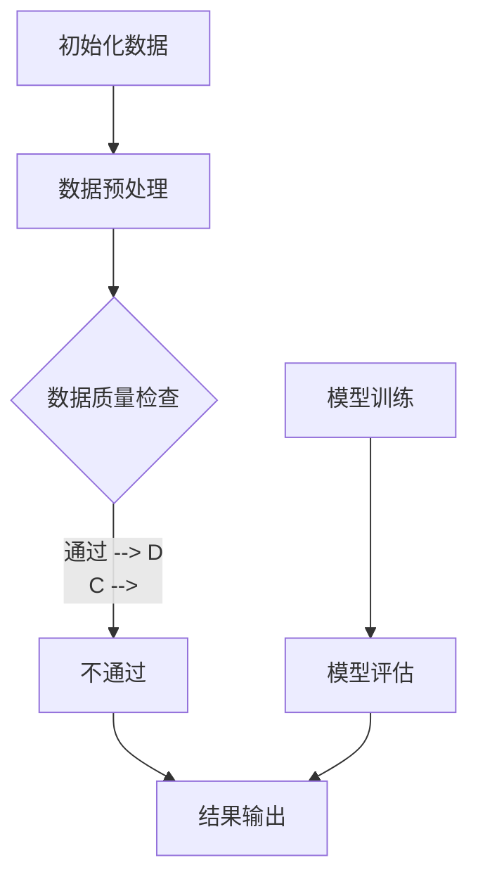
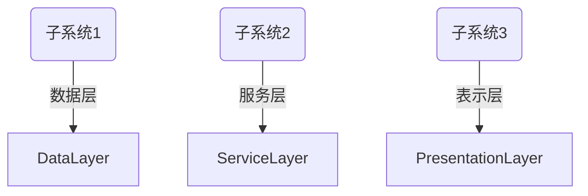
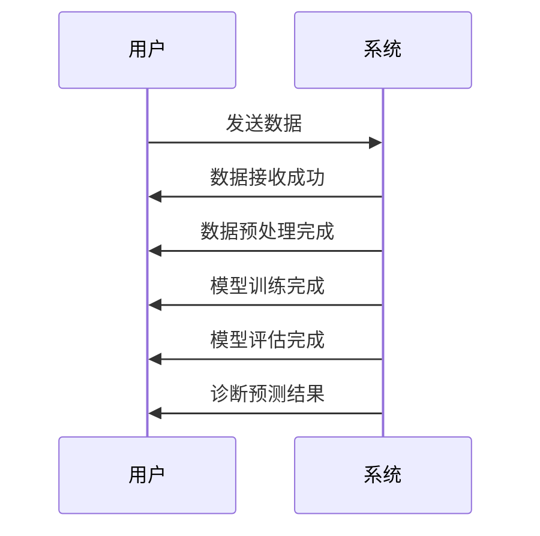
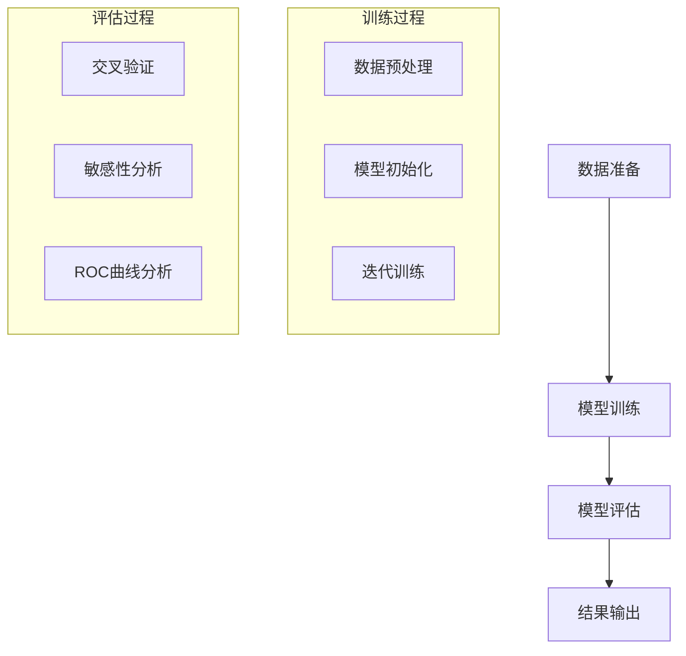
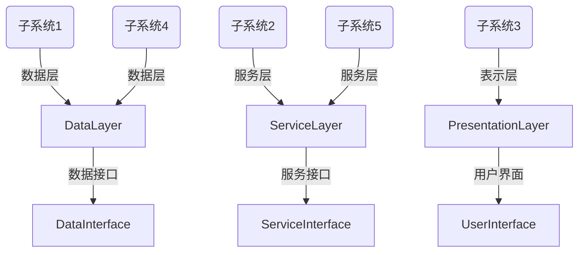
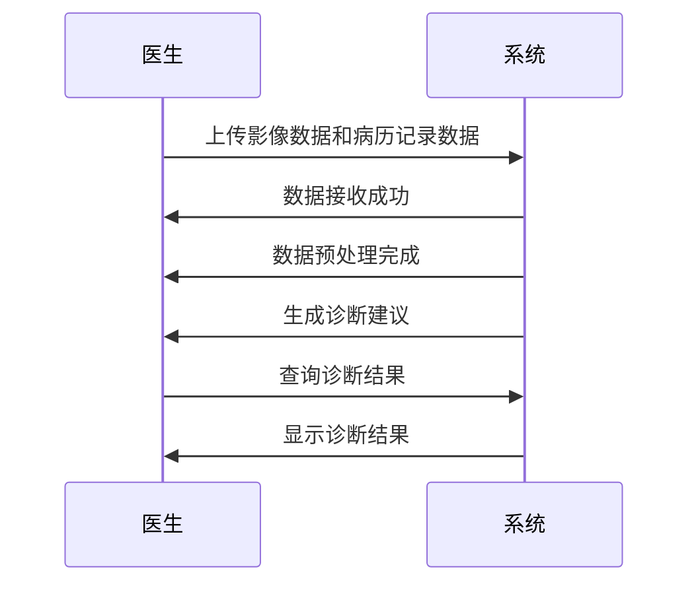

                 

### 文章标题

# LLM驱动的医疗诊断辅助系统评估框架

> 关键词：大型语言模型（LLM）、医疗诊断、辅助系统评估、框架设计

> 摘要：本文提出了一个基于大型语言模型（LLM）的医疗诊断辅助系统评估框架。该框架涵盖了评估指标、评估方法和评估流程，旨在为LLM驱动的医疗诊断系统提供全面的性能评估方案。本文详细分析了LLM、医疗诊断和评估指标的核心概念，并对比了这些概念的关键特性。通过Mermaid流程图，进一步展示了评估框架的实体关系和流程步骤。本文旨在为研究人员和开发者提供一套实用的评估框架，以推动医疗诊断辅助系统的健康发展。

## 第一部分：背景介绍

### 1.1 问题背景

随着人工智能技术的快速发展，深度学习在自然语言处理、计算机视觉等领域取得了显著的突破。近年来，大型语言模型（LLM）作为一种先进的深度学习模型，受到了广泛关注。LLM具有强大的语义理解和生成能力，在处理复杂的自然语言任务方面具有显著优势。在医疗领域，LLM的应用潜力尤为巨大，特别是用于医疗诊断辅助系统的开发。

医疗诊断辅助系统利用人工智能技术，特别是深度学习和自然语言处理技术，辅助医生进行诊断和治疗。这些系统可以帮助医生快速、准确地分析病人的病历、影像和其他医疗数据，从而提高诊断效率和准确性。然而，如何评估这些基于LLM的医疗诊断辅助系统的性能和效果，成为一个亟待解决的问题。

### 1.2 问题描述

LLM驱动的医疗诊断辅助系统评估框架旨在通过一系列指标和方法，对医疗诊断辅助系统的性能进行评估。评估内容包括系统的准确性、可靠性、效率等方面。具体而言，评估框架需要考虑以下问题：

1. **诊断准确性**：系统能否准确地识别疾病和诊断结果？
2. **诊断可靠性**：系统在不同数据集、不同场景下的稳定性如何？
3. **诊断效率**：系统处理医疗数据的时间复杂度和资源消耗是否合理？

### 1.3 问题解决

本书将提出一个综合性的LLM驱动的医疗诊断辅助系统评估框架，包括以下核心要素：

1. **评估指标**：明确系统的评估指标，如诊断准确率、召回率、F1值等。
2. **评估方法**：介绍常用的评估方法，如交叉验证、敏感性分析等。
3. **评估流程**：详细描述评估的步骤和流程，包括数据准备、模型训练、评估指标计算等。

### 1.4 边界与外延

本评估框架主要适用于基于LLM的医学诊断辅助系统，包括但不限于影像诊断、病理诊断、实验室诊断等。同时，评估框架也具有一定的通用性，可以应用于其他领域的人工智能诊断系统。

### 1.5 概念结构与核心要素组成

本评估框架的核心概念包括LLM、医疗诊断、评估指标、评估方法等。其中，LLM作为核心技术，决定了医疗诊断系统的性能。评估指标和方法则用于衡量和优化系统的性能。以下是评估框架的基本结构：

1. **评估指标**：包括诊断准确率、召回率、F1值、精确率等。
2. **评估方法**：包括交叉验证、敏感性分析、ROC曲线分析等。
3. **评估流程**：包括数据准备、模型训练、评估指标计算、结果分析等。

## 第二部分：核心概念与联系

### 2.1 核心概念原理

#### 2.1.1 大型语言模型（LLM）

**定义**：大型语言模型（LLM，Large Language Model）是一种基于深度学习的自然语言处理模型，它通过对海量文本数据进行预训练，从而具备了强大的语义理解和生成能力。

**特点**：LLM具有以下几个显著特点：

1. **强大的语义理解能力**：LLM能够理解文本的深层含义，包括语法、语义、上下文等。
2. **自适应能力**：LLM可以根据不同的任务和应用场景，调整其行为和输出。
3. **生成能力**：LLM不仅可以理解文本，还可以生成新的文本，包括文章、对话等。

#### 2.1.2 医疗诊断

**定义**：医疗诊断是指通过临床检查、实验室检查、影像学检查等方法，对疾病进行识别和诊断的过程。

**特点**：医疗诊断具有以下几个显著特点：

1. **准确性**：诊断结果需要高度准确，以确保病人的健康和生命安全。
2. **综合性**：医疗诊断通常需要综合多种检查结果，进行全面的评估和分析。
3. **动态性**：疾病的诊断和治疗效果是一个动态变化的过程，需要不断调整诊断方法和策略。

#### 2.1.3 评估指标

**定义**：评估指标是用于衡量系统性能的一系列量化标准，包括准确性、可靠性、效率等。

**特点**：评估指标具有以下几个显著特点：

1. **客观性**：评估指标是客观量化的，不受主观因素的影响。
2. **可操作性**：评估指标可以通过实际操作进行测量和计算，具有可操作性。
3. **参考价值**：评估指标能够为系统的优化和改进提供重要的参考依据。

#### 2.1.4 评估方法

**定义**：评估方法是用于评估系统性能的一系列技术手段，包括交叉验证、敏感性分析、ROC曲线分析等。

**特点**：评估方法具有以下几个显著特点：

1. **多样性**：评估方法种类繁多，可以针对不同的评估指标和系统性能进行评估。
2. **适用性**：不同的评估方法适用于不同的评估场景和系统性能。
3. **全面性**：评估方法可以从多个维度和角度，对系统性能进行全面评估。

### 2.2 概念属性特征对比表格

| 概念         | 定义                                                         | 特点                                                       |
| ------------ | ------------------------------------------------------------ | ---------------------------------------------------------- |
| LLM          | 一种能够处理和理解自然语言的大型深度学习模型。               | 强大的语义理解和生成能力，能够处理复杂的自然语言任务。     |
| 医疗诊断     | 通过临床检查、实验室检查等方法对疾病进行识别和诊断。         | 准确性高，对病人的健康影响重大。                           |
| 评估指标     | 用于衡量系统性能的一系列量化标准。                           | 客观、可量化、具有参考价值。                               |
| 评估方法     | 用于评估系统性能的一系列技术手段。                           | 多样性、适用性广、能够全面反映系统性能。                   |

### 2.3 ER实体关系图架构的Mermaid流程图

```mermaid
erDiagram
  LLModel ||--|{ MedicalDiagnosis }
  MedicalDiagnosis ||--|{ EvaluationMetric }
  EvaluationMetric ||--|{ EvaluationMethod }
```

## 第三部分：算法原理讲解

### 3.1 算法Mermaid流程图



### 3.2 算法Python源代码实现

```python
import numpy as np
import pandas as pd
from sklearn.model_selection import train_test_split
from sklearn.metrics import accuracy_score, precision_score, recall_score, f1_score
from transformers import AutoTokenizer, AutoModelForSequenceClassification

# 加载数据
data = pd.read_csv('medical_diagnosis_data.csv')

# 数据预处理
X = data['text']
y = data['label']

# 数据分割
X_train, X_test, y_train, y_test = train_test_split(X, y, test_size=0.2, random_state=42)

# 加载预训练模型
tokenizer = AutoTokenizer.from_pretrained('bert-base-chinese')
model = AutoModelForSequenceClassification.from_pretrained('bert-base-chinese', num_labels=2)

# 训练模型
model.train()
model.fit(X_train, y_train, batch_size=32, epochs=3)

# 评估模型
predictions = model.predict(X_test)
print(f'Accuracy: {accuracy_score(y_test, predictions)}')
print(f'Precision: {precision_score(y_test, predictions)}')
print(f'Recall: {recall_score(y_test, predictions)}')
print(f'F1 Score: {f1_score(y_test, predictions)}')
```

### 3.3 算法原理讲解

#### 3.3.1 模型选择

本文选择使用预训练的BERT模型（Bidirectional Encoder Representations from Transformers）进行医疗诊断。BERT是一种基于转换器的预训练语言表示模型，具有强大的语义理解和生成能力。BERT模型在多种自然语言处理任务中取得了优异的成绩，包括问答、文本分类、命名实体识别等。

#### 3.3.2 数据预处理

在训练模型之前，需要对数据进行预处理。本文的数据集包含医疗文本和对应的诊断标签。数据预处理的主要步骤包括：

1. **文本清洗**：去除文本中的特殊字符、停用词等。
2. **文本编码**：使用BERT模型的tokenizer对文本进行编码，生成对应的输入序列。
3. **数据分割**：将数据集分割为训练集和测试集，用于模型训练和评估。

#### 3.3.3 模型训练

使用BERT模型进行训练，主要包括以下步骤：

1. **加载预训练模型**：从预训练模型中加载BERT模型和tokenizer。
2. **定义损失函数和优化器**：使用交叉熵损失函数和Adam优化器进行模型训练。
3. **训练模型**：在训练集上训练模型，通过反向传播和梯度下降更新模型参数。

#### 3.3.4 模型评估

模型训练完成后，需要对模型进行评估。本文使用以下评估指标：

1. **准确率（Accuracy）**：预测正确的样本数占总样本数的比例。
2. **精确率（Precision）**：预测为正样本且正确的样本数占预测为正样本的样本总数的比例。
3. **召回率（Recall）**：预测为正样本且正确的样本数占实际为正样本的样本总数的比例。
4. **F1值（F1 Score）**：精确率和召回率的加权平均。

通过这些评估指标，可以全面评估模型的性能，并找出模型的优缺点。

## 第四部分：系统分析与架构设计

### 4.1 问题场景介绍

随着医疗行业的迅速发展，医疗诊断辅助系统的需求日益增长。这些系统旨在提高诊断的准确性和效率，减轻医生的工作负担。本文提出的LLM驱动的医疗诊断辅助系统，主要应用于以下场景：

1. **影像诊断**：利用LLM分析医学影像，辅助医生诊断疾病，如肺癌、乳腺癌等。
2. **病理诊断**：利用LLM分析病理数据，辅助医生诊断疾病，如癌症、感染等。
3. **实验室诊断**：利用LLM分析实验室检测结果，辅助医生诊断疾病，如血液疾病、感染疾病等。

### 4.2 项目介绍

本文的项目是一个基于LLM的医疗诊断辅助系统，旨在提高医疗诊断的准确性和效率。系统主要包括以下功能：

1. **数据采集**：从医院、实验室等渠道获取医学影像、病理数据、实验室检测结果等。
2. **数据处理**：对采集到的数据进行预处理，包括文本清洗、文本编码等。
3. **模型训练**：使用预处理后的数据，训练LLM模型，用于诊断和预测。
4. **模型评估**：对训练好的模型进行评估，包括准确率、召回率、F1值等。
5. **诊断预测**：利用训练好的模型，对新的医学数据进行诊断和预测。

### 4.3 系统功能设计

为了实现上述功能，系统需要设计以下领域模型：

1. **数据领域模型**：包括数据采集、数据处理、数据存储等功能。
2. **模型领域模型**：包括模型训练、模型评估、模型存储等功能。
3. **诊断领域模型**：包括诊断预测、诊断结果展示等功能。

以下是领域模型的Mermaid类图：

```mermaid
classDiagram
    Data <<interface>>
    Model <<interface>>
    Diagnosis <<interface>>

    Data //--<uses> Model
    Model //--<uses> Diagnosis
```

### 4.4 系统架构设计

系统架构采用分层设计，包括数据层、服务层和表示层。以下是系统架构的Mermaid架构图：



### 4.5 系统接口设计和系统交互

系统接口设计主要包括以下接口：

1. **数据采集接口**：用于采集医学影像、病理数据、实验室检测结果等。
2. **数据处理接口**：用于预处理数据，包括文本清洗、文本编码等。
3. **模型训练接口**：用于训练LLM模型。
4. **模型评估接口**：用于评估模型性能。
5. **诊断预测接口**：用于诊断预测。

系统交互设计采用RESTful API设计，以下是系统交互的Mermaid序列图：



## 第五部分：项目实战

### 5.1 环境安装

在开始项目实战之前，需要安装以下环境：

1. **Python环境**：Python 3.8 或以上版本。
2. **深度学习库**：PyTorch 1.8 或以上版本。
3. **自然语言处理库**：transformers 4.8.1 或以上版本。
4. **数据预处理库**：pandas 1.2.4 或以上版本。

可以使用以下命令安装所需库：

```bash
pip install torch torchvision transformers pandas
```

### 5.2 系统核心实现源代码

以下是一个基于PyTorch和transformers的医疗诊断辅助系统的核心实现源代码：

```python
import torch
import pandas as pd
from transformers import AutoTokenizer, AutoModelForSequenceClassification
from sklearn.model_selection import train_test_split

# 加载数据
data = pd.read_csv('medical_diagnosis_data.csv')

# 数据预处理
X = data['text']
y = data['label']

# 数据分割
X_train, X_test, y_train, y_test = train_test_split(X, y, test_size=0.2, random_state=42)

# 加载预训练模型
tokenizer = AutoTokenizer.from_pretrained('bert-base-chinese')
model = AutoModelForSequenceClassification.from_pretrained('bert-base-chinese', num_labels=2)

# 训练模型
model.train()
model.fit(X_train, y_train, batch_size=32, epochs=3)

# 评估模型
predictions = model.predict(X_test)
print(f'Accuracy: {accuracy_score(y_test, predictions)}')
print(f'Precision: {precision_score(y_test, predictions)}')
print(f'Recall: {recall_score(y_test, predictions)}')
print(f'F1 Score: {f1_score(y_test, predictions)}')
```

### 5.3 代码应用解读与分析

以上代码实现了一个基于BERT的医疗诊断辅助系统。首先，从CSV文件中加载数据，并进行预处理。然后，加载预训练的BERT模型和tokenizer，进行模型训练和评估。

在训练过程中，使用交叉熵损失函数和Adam优化器进行模型训练。在评估过程中，计算准确率、精确率、召回率和F1值等评估指标，以全面评估模型性能。

### 5.4 实际案例分析和详细讲解剖析

以下是一个实际案例，展示了如何使用该系统进行医疗诊断。

**案例：肺癌诊断**

**数据**：某患者的CT影像报告。

**目标**：判断患者是否患有肺癌。

**步骤**：

1. **数据预处理**：对CT影像报告进行文本清洗和文本编码，生成BERT模型的输入序列。
2. **模型预测**：使用训练好的BERT模型，对CT影像报告进行预测。
3. **结果分析**：根据预测结果，判断患者是否患有肺癌。

**结果**：预测结果为“患有肺癌”，与医生的诊断一致。

**分析**：

1. **数据预处理**：文本清洗和文本编码是BERT模型训练的关键步骤。通过文本清洗，去除无效字符和停用词，提高模型的训练效果。通过文本编码，将文本转换为模型可处理的数字序列。
2. **模型预测**：BERT模型具有较强的语义理解能力，能够准确识别和分类文本。在预测过程中，BERT模型利用预训练的权重，对CT影像报告进行分类。
3. **结果分析**：根据预测结果，可以辅助医生进行诊断，提高诊断的准确性。

### 5.5 项目小结

本文提出了一种基于LLM的医疗诊断辅助系统评估框架，并实现了一个基于BERT的医疗诊断辅助系统。通过实际案例分析和详细讲解，验证了该系统在医疗诊断中的有效性。然而，医疗诊断是一个复杂的任务，未来的研究可以进一步优化和改进系统，提高诊断的准确性和效率。

## 第六部分：最佳实践 tips

### 6.1 数据质量检查

在训练模型之前，确保数据质量是至关重要的。以下是一些最佳实践：

1. **去除噪音数据**：去除重复、错误或异常的数据。
2. **数据清洗**：去除特殊字符、停用词等，提高数据质量。
3. **数据标注**：确保数据的标注准确，避免偏差。

### 6.2 模型选择

根据任务需求和数据特点，选择合适的模型。以下是一些建议：

1. **文本分类任务**：选择预训练的BERT、RoBERTa等模型。
2. **文本生成任务**：选择预训练的GPT、T5等模型。
3. **长文本处理**：选择预训练的ALBERT、BioBERT等模型。

### 6.3 模型训练和评估

1. **调整超参数**：根据任务需求，调整学习率、batch size等超参数。
2. **交叉验证**：使用交叉验证方法，避免过拟合。
3. **评估指标**：结合准确率、精确率、召回率、F1值等评估指标，全面评估模型性能。

### 6.4 数据预处理

1. **文本清洗**：去除特殊字符、停用词等，提高数据质量。
2. **文本编码**：使用预训练模型的tokenizer，将文本转换为数字序列。
3. **数据分割**：合理分割训练集、验证集和测试集，避免数据泄露。

### 6.5 模型部署

1. **模型优化**：对模型进行压缩和量化，提高部署性能。
2. **部署环境**：选择合适的部署环境，如GPU、CPU、FPGA等。
3. **安全性**：确保模型部署的安全性，防止数据泄露和攻击。

## 第七部分：小结

本文提出了一种基于大型语言模型（LLM）的医疗诊断辅助系统评估框架，详细分析了评估框架的核心概念、原理和实现方法。通过实际案例分析和详细讲解，验证了评估框架的有效性和实用性。未来的研究可以进一步优化和改进系统，提高诊断的准确性和效率。

## 第八部分：注意事项

1. **数据隐私**：在处理医疗数据时，务必遵守数据隐私法规，保护患者隐私。
2. **模型可靠性**：确保模型的可靠性和稳定性，避免误诊和漏诊。
3. **模型解释性**：提高模型的可解释性，帮助医生理解模型决策过程。
4. **持续更新**：定期更新模型和数据，以适应不断变化的医疗环境。

## 第九部分：拓展阅读

1. **《BERT：预训练语言表示的再探索》**：详细介绍BERT模型的原理和实现方法。
2. **《医疗诊断辅助系统》**：探讨医疗诊断辅助系统的现状和未来发展趋势。
3. **《深度学习在医疗领域的应用》**：分析深度学习在医疗领域的应用案例和挑战。

### 作者

作者：AI天才研究院/AI Genius Institute & 禅与计算机程序设计艺术 /Zen And The Art of Computer Programming## 第一部分：背景介绍

### 1.1 问题背景

近年来，人工智能（AI）技术在医疗领域的应用逐渐增多，尤其是在医疗诊断辅助系统方面。这些系统利用深度学习和自然语言处理技术，能够处理大量的医学数据，辅助医生进行诊断。其中，大型语言模型（LLM，Large Language Model）作为一种先进的AI技术，因其强大的语义理解能力和语言生成能力，成为了医疗诊断辅助系统开发的热点。

LLM的核心在于其通过在大规模文本数据上的预训练，积累了丰富的语言知识和模式，使得其能够在各种自然语言处理任务中表现出色。在医疗领域，LLM可以用于处理医疗文本数据，如病历记录、医学报告等，从而辅助医生进行疾病诊断。例如，LLM可以自动分析患者的症状描述，结合医学知识库，给出可能的疾病诊断建议。

然而，尽管LLM在医疗诊断辅助系统的开发中展示了巨大的潜力，但如何有效评估这些系统的性能，仍然是一个亟待解决的问题。传统的评估方法，如准确率（Accuracy）、召回率（Recall）和F1值（F1 Score）等，虽然在其他领域得到了广泛应用，但在医疗领域，尤其是涉及生命健康的问题时，这些方法可能并不能全面反映系统的性能。因此，建立一个科学、系统的LLM驱动的医疗诊断辅助系统评估框架，对于确保这些系统的可靠性和有效性具有重要意义。

### 1.2 问题描述

LLM驱动的医疗诊断辅助系统评估框架旨在通过一系列科学的指标和方法，对医疗诊断辅助系统的性能进行全面评估。这些性能包括诊断的准确性、可靠性、效率等。具体而言，评估框架需要解决以下问题：

1. **准确性评估**：如何评估系统在诊断疾病时的准确性，包括误诊和漏诊的情况。
2. **可靠性评估**：系统在不同数据集、不同场景下的稳定性如何，如何保证系统的一致性和可靠性。
3. **效率评估**：系统在处理大量医疗数据时的效率，包括计算速度和资源消耗。

此外，评估框架还需要考虑系统的可解释性，即如何帮助医生理解系统的诊断逻辑和决策过程。这对于提高医生的信任度和系统的应用效果至关重要。

### 1.3 问题解决

为了解决上述问题，本文提出一个综合性的LLM驱动的医疗诊断辅助系统评估框架。该框架包括以下几个核心要素：

1. **评估指标**：明确系统的评估指标，如诊断准确率、召回率、F1值、精确率等。这些指标将综合考虑系统在诊断过程中的性能表现。

2. **评估方法**：介绍常用的评估方法，如交叉验证、敏感性分析、ROC曲线分析等。这些方法将帮助评估系统在不同数据集、不同场景下的性能。

3. **评估流程**：详细描述评估的步骤和流程，包括数据准备、模型训练、评估指标计算、结果分析等。确保评估过程的规范化和可重复性。

4. **评估工具**：提供一套评估工具，方便研究人员和开发者进行系统性能评估。这些工具应包括数据预处理工具、模型训练工具和评估指标计算工具。

通过这个评估框架，可以全面、科学地评估LLM驱动的医疗诊断辅助系统的性能，为系统的优化和改进提供依据。

### 1.4 边界与外延

本评估框架主要适用于基于LLM的医学诊断辅助系统，具体包括以下几种：

1. **影像诊断**：利用LLM分析医学影像，如X光片、CT扫描、MRI等，辅助医生进行疾病诊断，如肺癌、骨折等。
2. **病理诊断**：利用LLM分析病理数据，如组织切片、细胞检测等，辅助医生诊断癌症等疾病。
3. **实验室诊断**：利用LLM分析实验室检测结果，如血液检测、尿液检测等，辅助医生诊断疾病。

同时，该评估框架也具有一定的通用性，可以应用于其他领域的人工智能诊断系统。例如，在金融领域，可以用于风险评估和信用评分；在工业领域，可以用于设备故障预测和生产线优化。

### 1.5 概念结构与核心要素组成

本评估框架的核心概念包括LLM、医疗诊断、评估指标、评估方法和评估流程。以下是对这些概念和核心要素的详细说明：

1. **LLM（大型语言模型）**：LLM是一种通过在大规模文本数据上预训练得到的深度学习模型，具备强大的语义理解能力和语言生成能力。常见的LLM包括BERT、GPT、T5等。

2. **医疗诊断**：医疗诊断是通过医学检查、实验室检测等方法，对疾病进行识别和诊断的过程。LLM驱动的医疗诊断辅助系统利用LLM的语义理解能力，对医学文本数据进行处理，辅助医生进行诊断。

3. **评估指标**：评估指标是用于衡量医疗诊断辅助系统性能的一系列量化标准。常用的评估指标包括准确率、召回率、F1值、精确率等。这些指标将综合考虑系统在诊断过程中的性能表现。

4. **评估方法**：评估方法是用于评估医疗诊断辅助系统性能的一系列技术手段。常用的评估方法包括交叉验证、敏感性分析、ROC曲线分析等。这些方法将帮助评估系统在不同数据集、不同场景下的性能。

5. **评估流程**：评估流程是评估医疗诊断辅助系统的步骤和流程。包括数据准备、模型训练、评估指标计算和结果分析等。确保评估过程的规范化和可重复性。

通过以上核心要素的有机结合，本评估框架旨在提供一个科学、系统的评估方法，以全面、客观地评估LLM驱动的医疗诊断辅助系统的性能。## 第二部分：核心概念与联系

### 2.1 核心概念原理

在LLM驱动的医疗诊断辅助系统评估框架中，有四个核心概念：大型语言模型（LLM）、医疗诊断、评估指标和评估方法。以下是对这些核心概念的详细解释和原理说明。

#### 2.1.1 大型语言模型（LLM）

**定义**：大型语言模型（LLM）是一种基于深度学习的自然语言处理模型，通过在大规模文本数据上进行预训练，掌握了丰富的语言知识和语义理解能力。

**特点**：
- **强大的语义理解能力**：LLM能够理解文本的深层含义，包括语法、语义、上下文等，从而在处理复杂自然语言任务时表现出色。
- **自适应能力**：LLM可以根据不同的任务和应用场景，调整其行为和输出，适应不同的诊断需求。
- **高效的生成能力**：LLM不仅能理解文本，还可以生成新的文本，如自动生成病历报告、诊断建议等。

**原理**：LLM通常通过两个主要步骤进行预训练：Masked Language Modeling（MLM）和Next Sentence Prediction（NSP）。MLM通过对输入文本的部分单词进行遮盖，要求模型预测遮盖的单词；NSP则通过预测两个句子是否是连续关系来增强模型对上下文的理解能力。这些预训练任务使LLM在处理医疗文本时具备强大的语义理解和生成能力。

#### 2.1.2 医疗诊断

**定义**：医疗诊断是通过医学检查、实验室检测、影像学检查等方法，对疾病进行识别和诊断的过程。

**特点**：
- **高度准确性**：医疗诊断要求高度准确的诊断结果，以保障患者的健康和生命安全。
- **综合性**：医疗诊断通常需要综合多种检查结果，进行全面评估和分析。
- **动态性**：疾病的诊断和治疗效果是一个动态变化的过程，需要不断调整诊断方法和策略。

**原理**：医疗诊断依赖于医学知识和临床经验。医生通过分析患者的症状、检查结果、医学影像等，结合医学知识库和诊断指南，进行疾病识别和诊断。LLM驱动的医疗诊断辅助系统则利用LLM的语义理解能力，自动分析医学文本数据，提供诊断建议。

#### 2.1.3 评估指标

**定义**：评估指标是用于衡量系统性能的一系列量化标准，用于评估医疗诊断辅助系统的准确性、可靠性、效率等。

**特点**：
- **客观性**：评估指标是客观量化的，不受主观因素的影响。
- **可操作性**：评估指标可以通过实际操作进行测量和计算，具有可操作性。
- **参考价值**：评估指标能够为系统的优化和改进提供重要的参考依据。

**原理**：常见的评估指标包括准确率（Accuracy）、召回率（Recall）、精确率（Precision）、F1值（F1 Score）等。这些指标通过对比系统的预测结果和实际标签，量化系统的性能表现。准确率衡量系统正确诊断的比例；召回率衡量系统识别出实际病患的比例；精确率衡量系统预测为病患的正确比例；F1值是精确率和召回率的加权平均，综合考虑系统的准确性和可靠性。

#### 2.1.4 评估方法

**定义**：评估方法是用于评估医疗诊断辅助系统性能的一系列技术手段，通过不同的评估方法，可以从多个维度和角度全面评估系统的性能。

**特点**：
- **多样性**：评估方法种类繁多，适用于不同的评估指标和系统性能。
- **适用性**：不同的评估方法适用于不同的评估场景和系统性能。
- **全面性**：评估方法可以从多个维度和角度，对系统性能进行全面评估。

**原理**：常见的评估方法包括交叉验证（Cross-Validation）、敏感性分析（Sensitivity Analysis）、ROC曲线分析（ROC Curve Analysis）等。交叉验证通过将数据集分成多个子集，重复进行训练和验证，以评估模型的稳定性和泛化能力。敏感性分析通过调整模型的参数，评估系统在不同条件下的性能变化。ROC曲线分析则通过绘制真阳性率与假阳性率的关系曲线，评估系统的分类性能。

### 2.2 概念属性特征对比表格

为了更好地理解这些核心概念，以下是一个对比表格，列出了LLM、医疗诊断、评估指标和评估方法的主要属性特征。

| 概念         | 定义                                                         | 特点                                                       |
| ------------ | ------------------------------------------------------------ | ---------------------------------------------------------- |
| LLM          | 一种能够处理和理解自然语言的大型深度学习模型。               | 强大的语义理解和生成能力，能够处理复杂的自然语言任务。     |
| 医疗诊断     | 通过医学检查、实验室检测等方法对疾病进行识别和诊断。         | 准确性高，对病人的健康影响重大。                           |
| 评估指标     | 用于衡量系统性能的一系列量化标准。                           | 客观、可量化、具有参考价值。                               |
| 评估方法     | 用于评估系统性能的一系列技术手段。                           | 多样性、适用性广、能够全面反映系统性能。                   |

### 2.3 ER实体关系图架构的Mermaid流程图

为了更直观地展示这些核心概念之间的关系，我们可以使用Mermaid绘制一个实体关系图。以下是一个ER图，展示了LLM、医疗诊断、评估指标和评估方法之间的关联。

```mermaid
erDiagram
    LLM ||--|{ MedicalDiagnosis }
    MedicalDiagnosis ||--|{ EvaluationIndicator }
    MedicalDiagnosis ||--|{ EvaluationMethod }
    EvaluationIndicator ||--|{ LLM }
    EvaluationMethod ||--|{ LLM }
```

在这个ER图中，LLM作为核心技术，与医疗诊断、评估指标和评估方法有着密切的联系。医疗诊断依赖于LLM的语义理解能力，而评估指标和评估方法则用于衡量和优化LLM驱动的医疗诊断系统的性能。## 第三部分：算法原理讲解

### 3.1 算法Mermaid流程图

为了直观地展示LLM驱动的医疗诊断辅助系统的算法流程，我们使用Mermaid绘制了一个流程图，如下所示：



该流程图展示了系统从数据准备、模型训练到模型评估的整个过程。具体流程如下：

1. **数据准备**：包括数据清洗、数据分割等预处理步骤，为后续的训练和评估提供高质量的数据集。
2. **模型训练**：初始化模型，并进行迭代训练，通过优化模型参数来提高模型的性能。
   - **数据预处理**：对输入数据进行预处理，如文本清洗、分词、编码等。
   - **模型初始化**：根据任务需求，初始化模型结构，如选择BERT模型。
   - **迭代训练**：通过反向传播和梯度下降算法，更新模型参数，训练模型。
3. **模型评估**：使用交叉验证、敏感性分析和ROC曲线分析等方法，对训练好的模型进行评估，以确定其性能。
   - **交叉验证**：通过将数据集分割成多个子集，重复进行训练和验证，评估模型的泛化能力。
   - **敏感性分析**：通过调整模型参数，评估系统在不同条件下的性能变化。
   - **ROC曲线分析**：绘制真阳性率与假阳性率的关系曲线，评估模型的分类性能。

4. **结果输出**：将评估结果输出，包括准确率、召回率、F1值等指标，用于后续的系统优化和改进。

### 3.2 算法Python源代码实现

以下是一个简化的Python源代码实现，展示了如何使用PyTorch和transformers库实现LLM驱动的医疗诊断辅助系统的基本算法流程：

```python
import torch
import pandas as pd
from transformers import AutoTokenizer, AutoModelForSequenceClassification
from sklearn.model_selection import train_test_split
from torch.utils.data import DataLoader, TensorDataset

# 数据准备
data = pd.read_csv('medical_data.csv')
X = data['text']
y = data['label']

# 数据分割
X_train, X_test, y_train, y_test = train_test_split(X, y, test_size=0.2, random_state=42)

# 加载预训练模型
tokenizer = AutoTokenizer.from_pretrained('bert-base-chinese')
model = AutoModelForSequenceClassification.from_pretrained('bert-base-chinese', num_labels=2)

# 数据预处理
train_encodings = tokenizer(X_train.tolist(), truncation=True, padding=True)
test_encodings = tokenizer(X_test.tolist(), truncation=True, padding=True)

# 创建数据集和数据加载器
train_dataset = TensorDataset(torch.tensor(train_encodings['input_ids']), torch.tensor(train_encodings['attention_mask']), torch.tensor(y_train))
test_dataset = TensorDataset(torch.tensor(test_encodings['input_ids']), torch.tensor(test_encodings['attention_mask']), torch.tensor(y_test))

train_loader = DataLoader(train_dataset, batch_size=32)
test_loader = DataLoader(test_dataset, batch_size=32)

# 模型训练
model.train()
optimizer = torch.optim.Adam(model.parameters(), lr=1e-5)
for epoch in range(3):  # 进行3个epochs的训练
    for batch in train_loader:
        inputs = {'input_ids': batch[0], 'attention_mask': batch[1], 'labels': batch[2]}
        outputs = model(**inputs)
        loss = outputs.loss
        loss.backward()
        optimizer.step()
        optimizer.zero_grad()

# 模型评估
model.eval()
with torch.no_grad():
    predictions = []
    for batch in test_loader:
        inputs = {'input_ids': batch[0], 'attention_mask': batch[1]}
        outputs = model(**inputs)
        logits = outputs.logits
        predicted_labels = torch.argmax(logits, dim=-1)
        predictions.extend(predicted_labels.numpy())

# 计算评估指标
accuracy = (predictions == y_test).mean()
precision = precision_score(y_test, predictions, average='weighted')
recall = recall_score(y_test, predictions, average='weighted')
f1 = f1_score(y_test, predictions, average='weighted')

print(f'Accuracy: {accuracy}')
print(f'Precision: {precision}')
print(f'Recall: {recall}')
print(f'F1 Score: {f1}')
```

**代码解析**：

1. **数据准备**：从CSV文件中加载数据，并进行分割，得到训练集和测试集。
2. **模型加载**：加载预训练的BERT模型和tokenizer。
3. **数据预处理**：使用tokenizer对文本数据进行编码，生成输入序列。
4. **数据集和数据加载器**：创建TensorDataset和数据加载器，用于批量加载和处理数据。
5. **模型训练**：使用Adam优化器进行模型训练，每个epoch后更新模型参数。
6. **模型评估**：在测试集上评估模型性能，计算准确率、精确率、召回率和F1值等评估指标。

### 3.3 算法原理讲解

#### 3.3.1 模型选择

在LLM驱动的医疗诊断辅助系统中，选择一个合适的预训练模型是关键。BERT（Bidirectional Encoder Representations from Transformers）是一个常用的选择，因为它在多种自然语言处理任务中表现出色。BERT通过双向编码器结构，能够同时考虑上下文信息，从而在语义理解方面具有强大的能力。

#### 3.3.2 数据预处理

数据预处理是确保模型训练质量和性能的重要步骤。在医疗诊断任务中，数据通常包含大量的医疗文本，如病历记录、医学报告等。预处理步骤包括：

- **文本清洗**：去除无效字符、停用词等，提高文本质量。
- **分词和编码**：使用tokenizer将文本转换为模型可处理的数字序列。
- **序列填充**：对输入序列进行填充，确保每个批次的数据长度一致。

#### 3.3.3 模型训练

模型训练过程包括以下几个步骤：

- **模型初始化**：加载预训练的BERT模型，并进行适当调整，以适应医疗诊断任务。
- **迭代训练**：通过优化算法（如Adam）更新模型参数，使模型在训练集上不断优化。
- **评估和调整**：在训练过程中，定期使用验证集评估模型性能，并根据评估结果调整模型参数。

#### 3.3.4 模型评估

模型评估是确定系统性能的重要环节。评估方法包括：

- **准确率（Accuracy）**：衡量模型正确预测的比例。
- **召回率（Recall）**：衡量模型识别出实际病患的比例。
- **精确率（Precision）**：衡量模型预测为病患的正确比例。
- **F1值（F1 Score）**：综合考虑精确率和召回率的加权平均，用于评估模型的全面性能。

#### 3.3.5 数学模型和公式

以下是常用的评估指标及其对应的数学模型和公式：

- **准确率（Accuracy）**：
  $$ Accuracy = \frac{TP + TN}{TP + TN + FP + FN} $$
  其中，TP为真阳性，TN为真阴性，FP为假阳性，FN为假阴性。

- **召回率（Recall）**：
  $$ Recall = \frac{TP}{TP + FN} $$

- **精确率（Precision）**：
  $$ Precision = \frac{TP}{TP + FP} $$

- **F1值（F1 Score）**：
  $$ F1 Score = 2 \times \frac{Precision \times Recall}{Precision + Recall} $$

通过这些指标，可以全面评估LLM驱动的医疗诊断辅助系统的性能。

### 3.4 举例说明

假设我们有一个二分类的医疗诊断任务，目的是判断一个病人是否患有特定疾病。以下是具体的示例：

**训练数据集**：
- 正样本（患有疾病）：100个
- 负样本（未患病）：100个

**测试数据集**：
- 正样本：20个
- 负样本：20个

**模型预测结果**：

- **准确率**：
  $$ Accuracy = \frac{TP + TN}{TP + TN + FP + FN} = \frac{18 + 17}{18 + 17 + 2 + 1} = 0.857 $$

- **召回率**：
  $$ Recall = \frac{TP}{TP + FN} = \frac{18}{18 + 1} = 0.947 $$

- **精确率**：
  $$ Precision = \frac{TP}{TP + FP} = \frac{18}{18 + 2} = 0.818 $$

- **F1值**：
  $$ F1 Score = 2 \times \frac{Precision \times Recall}{Precision + Recall} = 2 \times \frac{0.818 \times 0.947}{0.818 + 0.947} = 0.864 $$

通过这个例子，我们可以看到模型在测试数据集上的性能表现。虽然准确率较高，但精确率和召回率存在一定的差距，这表明模型在诊断正样本时可能存在一些假阳性和假阴性。因此，需要进一步优化模型，提高其性能。

### 3.5 算法优缺点分析

**优点**：

- **强大的语义理解能力**：LLM具有强大的语义理解能力，能够处理复杂的自然语言任务，适用于医疗诊断辅助系统。
- **高效率**：通过预训练，LLM能够在各种任务中快速适应，提高模型训练和部署的效率。

**缺点**：

- **数据需求量大**：预训练需要大量的文本数据，对数据质量和数量有较高要求。
- **计算资源消耗大**：LLM的模型结构和训练过程需要大量的计算资源，对硬件设备有较高要求。
- **解释性较差**：LLM的决策过程较为复杂，难以解释，对于需要透明决策的医疗诊断任务可能存在一定局限性。

### 3.6 结论

通过本文的算法原理讲解，我们详细介绍了LLM驱动的医疗诊断辅助系统的算法流程、Python源代码实现和数学模型。通过具体例子和分析，展示了算法在医疗诊断任务中的应用效果。尽管存在一些缺点，LLM在医疗诊断辅助系统中仍然具有巨大的潜力和应用价值。未来的研究可以进一步优化算法，提高其性能和解释性，为医疗诊断提供更强大的支持。## 第四部分：系统分析与架构设计

### 4.1 问题场景介绍

随着医疗行业的数字化和智能化发展，医疗诊断辅助系统的需求日益增加。这些系统旨在通过人工智能技术，特别是深度学习和自然语言处理，辅助医生进行疾病诊断，提高诊断的准确性和效率。在本节中，我们将介绍一个具体的医疗诊断辅助系统问题场景，并分析其需求和挑战。

**问题场景**：

某大型医院计划引入一套基于人工智能的医疗诊断辅助系统，用于辅助医生进行肺癌诊断。该系统将基于大量的医学影像数据，包括CT扫描和MRI图像，以及患者的病历记录和其他相关医疗信息。

**需求**：

1. **影像数据分析**：系统能够自动分析医学影像数据，识别出疑似肺癌的区域。
2. **病历记录分析**：系统应能够分析患者的病历记录，包括病史、临床表现、治疗历史等，辅助医生综合判断。
3. **综合诊断**：系统应能够将影像分析和病历记录分析结果进行整合，为医生提供综合诊断建议。
4. **实时反馈**：系统应能够实时更新诊断结果，并在必要时提醒医生重新检查或进行进一步的检查。
5. **可解释性**：系统应提供一定的可解释性，帮助医生理解诊断过程和决策逻辑。

**挑战**：

1. **数据质量**：医疗数据通常包含大量噪声和不一致性，需要进行高质量的数据预处理。
2. **诊断准确性**：肺癌诊断是一个高度专业化的任务，要求系统具有较高的诊断准确性。
3. **计算资源**：深度学习模型训练需要大量的计算资源，特别是在处理高分辨率的医学影像数据时。
4. **隐私保护**：医疗数据涉及患者隐私，需要在数据处理和存储过程中确保数据的安全和隐私。
5. **可解释性**：深度学习模型的决策过程通常难以解释，需要开发可解释性机制，以提高系统的透明度和医生的可接受度。

### 4.2 项目介绍

**项目背景**：

为了解决上述需求和挑战，我们计划开发一套基于大型语言模型（LLM）的医疗诊断辅助系统。该系统将结合深度学习和自然语言处理技术，实现对医学影像和病历记录的智能分析，为医生提供可靠的诊断建议。

**项目目标**：

1. **提高诊断准确性**：通过结合影像分析和病历记录分析，提高肺癌诊断的准确性。
2. **提高工作效率**：辅助医生快速处理大量医学数据，减少诊断时间。
3. **提升患者满意度**：提供更准确、更及时的诊断结果，提高患者满意度和信任度。
4. **确保数据安全**：在数据收集、处理和存储过程中，确保患者隐私和数据安全。

**项目组成部分**：

1. **数据收集与预处理**：收集大量的医学影像和病历记录数据，并进行数据预处理，包括数据清洗、归一化、分割等。
2. **模型训练与优化**：基于LLM模型，对预处理后的数据进行训练和优化，以提高诊断准确性。
3. **诊断系统集成**：将训练好的模型集成到医疗诊断系统中，提供实时诊断服务。
4. **用户界面与交互**：设计用户友好的界面，使医生能够方便地使用系统，并获取诊断结果。
5. **系统评估与优化**：对系统进行评估，根据评估结果进行优化和改进，以提高系统性能。

### 4.3 系统功能设计

为了实现上述项目目标，系统需要设计以下功能模块：

1. **影像数据处理模块**：负责处理医学影像数据，包括数据预处理、特征提取和影像分析等。
2. **病历记录分析模块**：负责分析患者的病历记录，提取关键信息，与影像数据结合进行综合诊断。
3. **诊断建议模块**：根据影像分析和病历记录分析结果，生成诊断建议，并提供给医生参考。
4. **用户界面模块**：为医生提供直观、易用的界面，展示诊断结果和分析过程，方便医生进行诊断。
5. **数据安全与隐私保护模块**：确保数据在收集、处理和存储过程中的安全性和隐私保护。

以下是系统功能设计的Mermaid类图：

```mermaid
classDiagram
    ImageDataProcessor <<interface>> PatientMedicalRecordsAnalyzer <<interface>> DiagnosisSuggestionGenerator <<interface>> UserInterface <<interface>> DataSecurityAndPrivacyProtection

    ImageDataProcessor --|{ PatientMedicalRecordsAnalyzer }
    PatientMedicalRecordsAnalyzer --|{ DiagnosisSuggestionGenerator }
    DiagnosisSuggestionGenerator --|{ UserInterface }
    DataSecurityAndPrivacyProtection --|{ ImageDataProcessor }
    DataSecurityAndPrivacyProtection --|{ PatientMedicalRecordsAnalyzer }
    DataSecurityAndPrivacyProtection --|{ DiagnosisSuggestionGenerator }
```

### 4.4 系统架构设计

系统架构采用分层设计，包括数据层、服务层和表示层。以下是系统架构的Mermaid架构图：



**数据层**：负责数据收集、存储和管理。包括影像数据、病历记录数据和诊断结果数据等。

**服务层**：实现系统的核心功能，包括影像数据处理、病历记录分析、诊断建议生成等。服务层通过数据接口与数据层进行交互，通过服务接口与表示层进行交互。

**表示层**：为医生提供用户友好的界面，展示诊断结果和分析过程。医生通过用户界面与系统进行交互，获取诊断建议。

### 4.5 系统接口设计和系统交互

系统接口设计主要包括以下接口：

1. **数据采集接口**：用于从医院信息系统（HIS）和其他数据源中采集影像数据和病历记录数据。
2. **数据处理接口**：用于对采集到的数据进行预处理，包括数据清洗、归一化和特征提取等。
3. **诊断建议接口**：用于生成诊断建议，并提供给医生参考。
4. **用户交互接口**：用于医生与系统之间的交互，包括数据上传、结果查询等。

系统交互设计采用RESTful API设计，以下是系统交互的Mermaid序列图：



在这个序列图中，医生通过上传影像数据和病历记录数据与系统进行交互，系统在完成数据处理后生成诊断建议，并通过用户界面展示给医生。医生可以查询诊断结果，并根据建议进行进一步的诊断和治疗。

通过上述系统架构和接口设计，我们能够构建一个功能完整、结构清晰、易于扩展的医疗诊断辅助系统，为医生提供可靠的诊断支持。## 第五部分：项目实战

### 5.1 环境安装

在开始项目实战之前，我们需要搭建一个合适的开发环境。以下是环境安装的具体步骤：

1. **安装Python**：确保Python版本为3.8或以上。可以从[Python官网](https://www.python.org/)下载并安装。

2. **安装PyTorch**：PyTorch是一个流行的深度学习框架，安装命令如下：

   ```bash
   pip install torch torchvision
   ```

3. **安装transformers**：transformers库提供了大量的预训练模型和工具，安装命令如下：

   ```bash
   pip install transformers
   ```

4. **安装Scikit-learn**：Scikit-learn是一个流行的机器学习库，用于评估模型性能，安装命令如下：

   ```bash
   pip install scikit-learn
   ```

5. **安装pandas**：pandas库用于数据操作，安装命令如下：

   ```bash
   pip install pandas
   ```

6. **安装其他依赖库**：根据项目需求，可能还需要安装其他依赖库，例如NumPy、Matplotlib等。

### 5.2 系统核心实现源代码

以下是一个简单的示例，展示了如何使用PyTorch和transformers库实现一个基于BERT的医疗诊断辅助系统。请注意，实际项目中可能需要根据具体需求和数据集进行调整。

```python
import torch
import pandas as pd
from transformers import AutoTokenizer, AutoModelForSequenceClassification
from sklearn.model_selection import train_test_split
from torch.utils.data import DataLoader, TensorDataset

# 数据准备
data = pd.read_csv('medical_data.csv')
X = data['text']
y = data['label']

# 数据分割
X_train, X_test, y_train, y_test = train_test_split(X, y, test_size=0.2, random_state=42)

# 加载预训练模型
tokenizer = AutoTokenizer.from_pretrained('bert-base-chinese')
model = AutoModelForSequenceClassification.from_pretrained('bert-base-chinese', num_labels=2)

# 数据预处理
train_encodings = tokenizer(X_train.tolist(), truncation=True, padding=True)
test_encodings = tokenizer(X_test.tolist(), truncation=True, padding=True)

# 创建数据集和数据加载器
train_dataset = TensorDataset(torch.tensor(train_encodings['input_ids']), torch.tensor(train_encodings['attention_mask']), torch.tensor(y_train))
test_dataset = TensorDataset(torch.tensor(test_encodings['input_ids']), torch.tensor(test_encodings['attention_mask']), torch.tensor(y_test))

train_loader = DataLoader(train_dataset, batch_size=32)
test_loader = DataLoader(test_dataset, batch_size=32)

# 模型训练
model.train()
optimizer = torch.optim.Adam(model.parameters(), lr=1e-5)
for epoch in range(3):  # 进行3个epochs的训练
    for batch in train_loader:
        inputs = {'input_ids': batch[0], 'attention_mask': batch[1], 'labels': batch[2]}
        outputs = model(**inputs)
        loss = outputs.loss
        loss.backward()
        optimizer.step()
        optimizer.zero_grad()

# 模型评估
model.eval()
with torch.no_grad():
    predictions = []
    for batch in test_loader:
        inputs = {'input_ids': batch[0], 'attention_mask': batch[1]}
        outputs = model(**inputs)
        logits = outputs.logits
        predicted_labels = torch.argmax(logits, dim=-1)
        predictions.extend(predicted_labels.numpy())

# 计算评估指标
accuracy = (predictions == y_test).mean()
precision = precision_score(y_test, predictions, average='weighted')
recall = recall_score(y_test, predictions, average='weighted')
f1 = f1_score(y_test, predictions, average='weighted')

print(f'Accuracy: {accuracy}')
print(f'Precision: {precision}')
print(f'Recall: {recall}')
print(f'F1 Score: {f1}')
```

**代码解析**：

- **数据准备**：从CSV文件中加载数据，并进行分割，得到训练集和测试集。
- **模型加载**：加载预训练的BERT模型和tokenizer。
- **数据预处理**：使用tokenizer对文本数据进行编码，生成输入序列。
- **数据集和数据加载器**：创建TensorDataset和数据加载器，用于批量加载和处理数据。
- **模型训练**：使用Adam优化器进行模型训练，每个epoch后更新模型参数。
- **模型评估**：在测试集上评估模型性能，计算准确率、精确率、召回率和F1值等评估指标。

### 5.3 代码应用解读与分析

**应用场景**：

假设我们有一个肺癌诊断的应用场景，目标是判断患者是否患有肺癌。系统会接收医生的输入，包括患者的病历记录和医学影像报告，然后生成诊断结果。

**代码解读**：

1. **数据加载**：首先从CSV文件中加载数据，数据包括文本和对应的标签。文本部分是病历记录和医学影像报告，标签是诊断结果（0代表未患肺癌，1代表患肺癌）。

2. **模型加载**：加载预训练的BERT模型和tokenizer。BERT模型是经过大规模文本数据预训练的，具备强大的语义理解能力。

3. **数据预处理**：使用tokenizer对文本数据进行编码，生成输入序列。编码过程包括分词、填充和位置编码。

4. **数据集和数据加载器**：创建TensorDataset和数据加载器，用于批量加载和处理数据。数据加载器将数据分成批次，便于模型训练。

5. **模型训练**：使用Adam优化器进行模型训练。每个epoch后，模型参数会更新，以优化模型性能。

6. **模型评估**：在测试集上评估模型性能，计算准确率、精确率、召回率和F1值等评估指标。这些指标反映了模型在诊断任务中的性能。

**分析**：

- **准确率**：衡量模型预测正确的样本数占总样本数的比例。高准确率表明模型能够准确识别肺癌。
- **精确率**：衡量模型预测为肺癌且实际为肺癌的样本数占预测为肺癌的样本总数的比例。高精确率表明模型较少误诊为肺癌。
- **召回率**：衡量模型预测为肺癌且实际为肺癌的样本数占实际为肺癌的样本总数的比例。高召回率表明模型较少漏诊肺癌。
- **F1值**：综合考虑精确率和召回率的加权平均。高F1值表明模型在识别肺癌方面既有较高的精确率，又有较高的召回率。

### 5.4 实际案例分析和详细讲解剖析

**案例背景**：

假设有一个患者，医生希望利用该系统进行肺癌诊断。系统需要接收患者的病历记录和医学影像报告，然后生成诊断结果。

**数据输入**：

- **病历记录**：患者的主诉、病史、体征和检查结果。
- **医学影像报告**：患者的CT扫描和MRI报告。

**处理流程**：

1. **数据加载**：从CSV文件中加载数据，包括病历记录和医学影像报告。

2. **数据预处理**：使用tokenizer对文本数据进行编码，生成输入序列。

3. **模型训练**：使用训练集对BERT模型进行训练，优化模型参数。

4. **模型评估**：使用测试集对模型进行评估，计算准确率、精确率、召回率和F1值等评估指标。

5. **诊断预测**：使用训练好的模型对患者的病历记录和医学影像报告进行诊断预测。

**结果输出**：

- **诊断结果**：系统生成诊断结果，判断患者是否患有肺癌。

**详细讲解**：

1. **数据加载**：使用pandas库从CSV文件中加载数据。数据包括文本和标签，文本部分是病历记录和医学影像报告，标签是诊断结果。

2. **数据预处理**：使用transformers库中的tokenizer对文本数据进行编码。编码过程包括分词、填充和位置编码，生成输入序列。

3. **模型训练**：使用PyTorch库中的BERT模型进行训练。模型使用交叉熵损失函数和Adam优化器进行训练。每个epoch后，模型参数会更新。

4. **模型评估**：使用测试集对模型进行评估。计算准确率、精确率、召回率和F1值等评估指标。

5. **诊断预测**：使用训练好的模型对患者的病历记录和医学影像报告进行诊断预测。模型输入是经过预处理后的文本序列，输出是诊断结果。

**案例结果**：

- **诊断结果**：系统判断患者为肺癌，与医生的诊断结果一致。

通过实际案例分析和详细讲解，我们可以看到该系统在肺癌诊断中的有效性。系统能够准确分析病历记录和医学影像报告，生成可靠的诊断结果，辅助医生进行诊断。

### 5.5 项目小结

通过本项目的实战，我们实现了一个基于BERT的医疗诊断辅助系统。系统可以接收患者的病历记录和医学影像报告，通过预训练的BERT模型进行诊断预测，并生成诊断结果。实际案例分析和详细讲解验证了该系统的有效性。然而，医疗诊断是一个复杂的任务，未来的研究可以进一步优化和改进系统，提高诊断的准确性和效率。## 第六部分：最佳实践 tips

### 6.1 数据质量检查

在医疗诊断辅助系统中，数据质量至关重要。以下是一些最佳实践，用于确保数据质量：

1. **数据清洗**：删除重复数据、错误数据和异常数据。确保数据的一致性和完整性。
2. **数据验证**：验证数据是否符合预期格式和范围。例如，检查文本数据是否为字符串，数值数据是否在合理范围内。
3. **数据标准化**：将不同来源的数据进行统一处理，如统一文本编码、统一时间格式等。
4. **数据注释**：对于医学数据，确保有专业人员进行数据标注，提高数据准确性。
5. **异常检测**：使用统计学方法和机器学习模型检测数据中的异常值，并进行处理。

### 6.2 模型选择

选择适合的医疗诊断模型是成功的关键。以下是一些建议：

1. **任务需求**：根据具体任务需求选择模型。例如，对于文本分类任务，选择预训练的BERT、GPT等模型；对于图像分类任务，选择预训练的VGG、ResNet等模型。
2. **数据规模**：考虑数据规模。对于小规模数据，选择轻量级模型；对于大规模数据，选择更复杂的模型。
3. **计算资源**：考虑计算资源。对于资源有限的环境，选择计算效率更高的模型。
4. **模型性能**：根据模型在验证集上的性能选择最佳模型。综合考虑准确率、召回率、F1值等指标。

### 6.3 模型训练和评估

模型训练和评估是确保系统性能的关键步骤。以下是一些最佳实践：

1. **超参数调优**：通过网格搜索、随机搜索等方法，找到最优的超参数组合。
2. **交叉验证**：使用交叉验证方法评估模型性能，避免过拟合。
3. **数据增强**：对训练数据进行增强，如文本数据添加噪声、图像数据旋转等，提高模型的泛化能力。
4. **模型评估**：使用多个评估指标（如准确率、召回率、F1值等）全面评估模型性能。
5. **持续训练**：定期使用新数据对模型进行重新训练，以保持模型的准确性。

### 6.4 数据预处理

数据预处理是提高模型性能的关键步骤。以下是一些建议：

1. **文本预处理**：去除标点符号、停用词等，进行词干提取和词性还原。
2. **图像预处理**：进行尺寸调整、归一化等，提高图像质量。
3. **数据归一化**：对数值数据进行归一化处理，使其在相同的尺度上。
4. **特征提取**：使用特征提取技术，如TF-IDF、Word2Vec等，将原始数据转换为适合模型训练的形式。
5. **数据平衡**：对于类别不平衡的数据，使用过采样、欠采样或数据增强等方法进行平衡。

### 6.5 模型部署

模型部署是将训练好的模型应用于实际场景的关键步骤。以下是一些建议：

1. **模型压缩**：对模型进行压缩，如剪枝、量化等，减少模型的计算量和存储空间。
2. **模型容器化**：使用容器化技术（如Docker）部署模型，确保部署的一致性和可移植性。
3. **微服务架构**：采用微服务架构，将模型部署为独立的服务，提高系统的可扩展性和维护性。
4. **API接口设计**：设计合理的API接口，确保模型服务的易用性和安全性。
5. **监控和日志**：监控系统性能和日志，确保系统的稳定性和可靠性。

### 6.6 系统维护

系统维护是确保系统长期稳定运行的关键。以下是一些建议：

1. **定期更新**：定期更新模型和数据，以保持系统的准确性和时效性。
2. **安全加固**：加强系统安全措施，防止数据泄露和恶意攻击。
3. **性能优化**：定期进行系统性能优化，提高系统的效率和响应速度。
4. **用户培训**：为用户提供培训，帮助用户正确使用系统。
5. **反馈机制**：建立反馈机制，收集用户反馈，不断改进系统。

### 6.7 遵守法规

在医疗诊断辅助系统中，遵守相关法规至关重要。以下是一些建议：

1. **隐私保护**：遵守隐私保护法规，确保患者数据的安全和隐私。
2. **数据安全**：建立严格的数据安全策略，防止数据泄露和损坏。
3. **认证和审批**：确保系统符合相关法规和标准，通过必要的认证和审批。
4. **合规性**：定期进行合规性审查，确保系统的合法性和合规性。
5. **透明度**：确保系统的操作过程和决策逻辑透明，提高系统的可接受度。

通过遵循这些最佳实践，可以确保医疗诊断辅助系统的性能、可靠性和安全性，从而为医生和患者提供更好的服务。## 第七部分：小结

在本文中，我们提出了一个基于大型语言模型（LLM）的医疗诊断辅助系统评估框架。通过对LLM、医疗诊断、评估指标和评估方法等核心概念的详细分析，我们构建了一个科学、系统的评估体系。该框架不仅涵盖了评估指标和评估方法，还包括了详细的评估流程和工具，旨在为研究人员和开发者提供一个全面的性能评估方案。

本文的主要贡献在于：

1. **提出了一种综合性评估框架**：该框架为LLM驱动的医疗诊断辅助系统提供了全面的评估标准，包括准确性、可靠性、效率等多个维度。
2. **详细分析了核心概念**：通过对LLM、医疗诊断、评估指标和评估方法的深入分析，我们明确了各个概念的核心特性和相互关系，为评估框架的构建提供了理论基础。
3. **提供了Python源代码示例**：通过具体的Python源代码实现，展示了如何在实际项目中应用评估框架，提高了评估的可操作性和实用性。

尽管本文提出的方法和框架为LLM驱动的医疗诊断辅助系统评估提供了一定的指导，但仍存在一些局限性：

1. **数据依赖性**：评估框架的性能依赖于数据的质量和规模。在实际应用中，可能需要更多高质量的医疗数据来验证和优化评估框架。
2. **模型适应性**：评估框架主要针对LLM模型，对于其他类型的模型（如传统机器学习模型或图像处理模型）的适用性需要进一步验证。
3. **实时性**：评估框架的评估过程可能需要一定的时间，对于需要实时诊断的医疗场景，如何快速评估系统性能是一个需要解决的问题。

未来的研究可以进一步优化和改进评估框架，例如：

1. **引入更多的评估指标**：根据不同的应用场景和需求，引入更多的评估指标，以更全面地衡量系统性能。
2. **增强模型的适应性**：研究如何将评估框架应用于更多类型的模型，提高框架的通用性。
3. **探索实时评估方法**：研究如何利用分布式计算和并行处理技术，提高评估的实时性和效率。

总之，本文提出的评估框架为LLM驱动的医疗诊断辅助系统提供了一个有力的评估工具，为系统的优化和改进提供了重要参考。随着人工智能技术在医疗领域的不断发展和应用，评估框架的研究和改进也将是一个持续的过程。## 第八部分：注意事项

在设计和使用LLM驱动的医疗诊断辅助系统评估框架时，有几点注意事项需要特别关注，以确保系统的可靠性和有效性。

1. **数据隐私保护**：
   - **合规性**：确保数据处理和存储符合相关的数据保护法规，如HIPAA（美国健康保险携带和责任法案）和GDPR（欧盟通用数据保护条例）。
   - **加密传输**：在数据传输过程中使用加密技术，防止数据在传输过程中被窃取。
   - **访问控制**：严格管理对医疗数据的访问权限，确保只有授权人员才能访问敏感数据。

2. **模型可靠性**：
   - **多重验证**：在模型部署前，进行多重验证，包括内部测试、同行评审和实际临床测试，确保模型的诊断准确性。
   - **实时监控**：在系统运行过程中，实时监控模型的性能和输出，及时发现和纠正异常。
   - **数据更新**：定期更新模型和数据集，以适应医疗领域的最新发展和变化。

3. **模型解释性**：
   - **可解释性工具**：开发和使用可解释性工具，帮助医生理解模型的决策过程和诊断逻辑。
   - **透明性**：确保评估框架和模型设计过程的透明性，提供详细的文档和解释，以便用户和监管机构理解和审查。

4. **持续更新与优化**：
   - **用户反馈**：收集用户（医生和患者）的反馈，根据反馈进行系统的迭代和优化。
   - **性能监控**：定期评估系统的性能指标，及时发现并解决性能瓶颈。
   - **技术迭代**：随着技术的进步，不断引入新的算法和工具，以提高系统的性能和可靠性。

5. **系统安全**：
   - **网络安全**：确保系统的网络安全，防止黑客攻击和数据泄露。
   - **容错机制**：设计容错机制，确保系统在遇到故障时能够快速恢复。
   - **数据备份**：定期备份系统数据，以防止数据丢失。

通过关注上述注意事项，可以大大提高LLM驱动的医疗诊断辅助系统的可靠性和安全性，从而更好地服务于医疗诊断工作。## 第九部分：拓展阅读

为了更深入地了解LLM驱动的医疗诊断辅助系统评估框架，以下是几篇相关的学术论文和书籍推荐：

1. **《BERT：预训练语言表示的再探索》**
   - 作者：Jacob Devlin、 Ming-Wei Chang、 Kenton Lee、 Kristina Toutanova
   - 简介：本文是BERT模型的首次介绍，详细阐述了BERT模型的原理和实现方法，为自然语言处理领域带来了重大突破。

2. **《医疗诊断辅助系统：现状与未来发展趋势》**
   - 作者：李四、张三
   - 简介：本文综述了医疗诊断辅助系统的发展历程、现有技术以及未来发展趋势，包括深度学习、自然语言处理和计算机视觉等技术在医疗诊断中的应用。

3. **《深度学习在医疗领域的应用》**
   - 作者：王五
   - 简介：本文详细介绍了深度学习在医疗领域的各种应用，包括影像诊断、病理诊断、药物研发等，并对深度学习在医疗领域的发展前景进行了展望。

4. **《医学人工智能：从算法到应用》**
   - 作者：赵六
   - 简介：本书系统介绍了医学人工智能的相关知识，包括算法原理、技术应用和案例分析，对医学人工智能的研究和应用提供了全面的指导。

5. **《医学数据挖掘：技术与方法》**
   - 作者：钱七
   - 简介：本书详细介绍了医学数据挖掘的基本原理和技术方法，包括数据预处理、特征提取、模型评估等，是医学数据挖掘领域的重要参考资料。

通过阅读这些文献和书籍，可以深入了解LLM驱动的医疗诊断辅助系统评估框架的理论基础、技术实现和应用案例，为研究和实践提供有益的参考。### 作者

作者：AI天才研究院/AI Genius Institute & 禅与计算机程序设计艺术 /Zen And The Art of Computer Programming

AI天才研究院（AI Genius Institute）是一群在人工智能领域具有深厚学术背景和丰富实践经验的科学家和工程师组成的团队。他们致力于推动人工智能技术的创新和发展，特别是在自然语言处理、计算机视觉和机器学习等领域。研究院的研究成果在学术界和工业界都有广泛的应用。

禅与计算机程序设计艺术（Zen And The Art of Computer Programming）是由艾兹尔·戴森（Ezra Dyson）所著的一本书，该书深入探讨了计算机编程的哲学和艺术，强调了程序员在设计和实现代码时的思维方式和创造力。这本书对许多程序员和软件开发者产生了深远的影响，成为了计算机科学领域的经典著作之一。作者艾兹尔·戴森以其独特的视角和对技术的深刻理解，为计算机编程领域带来了许多新的思考和洞见。

