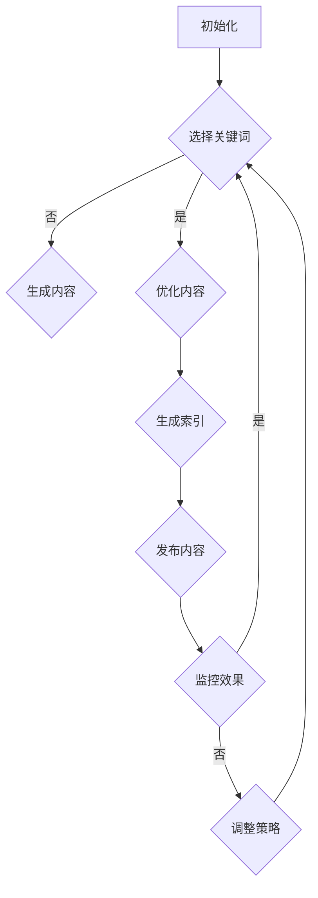
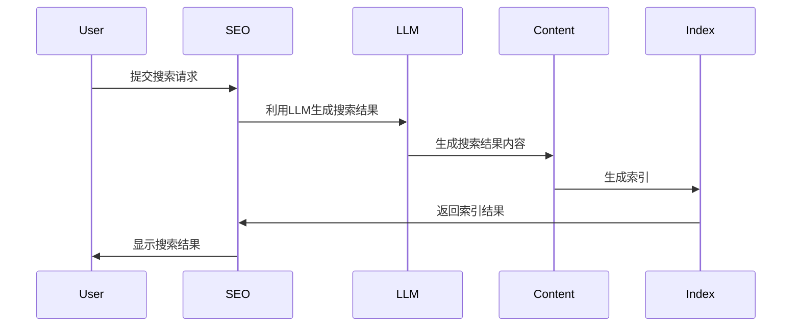
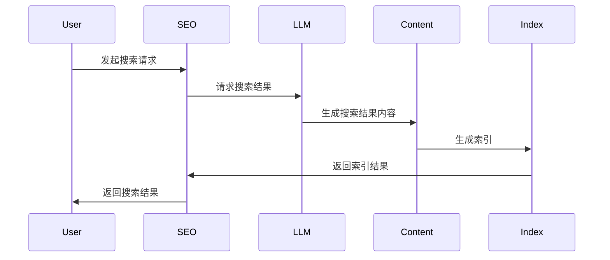

                 

### 文章标题

> 关键词：搜索引擎优化（SEO），大型语言模型（LLM），架构设计，可发现性，搜索引擎排名

摘要：本文深入探讨了如何通过构建SEO友好架构，提高大型语言模型（LLM）在搜索引擎中的可发现性。文章首先介绍了SEO和LLM的核心概念，然后分析了SEO友好架构的原理和设计要点，并通过具体的算法原理和系统架构设计，为提高LLM应用的搜索引擎排名提供了实践指导。

## 第一部分：背景介绍

### 核心概念

**问题背景：**  
随着互联网的迅猛发展，搜索引擎优化（SEO）成为网站提高在搜索引擎中排名，从而增加流量的重要手段。然而，对于大型语言模型（LLM）而言，如何提升其在搜索引擎中的可发现性，成为了当前研究的一个重要课题。

**问题描述：**  
LLM由于其复杂的结构和大型的参数规模，导致其在搜索引擎中的索引和检索效率较低，从而影响了其应用的可发现性。因此，如何构建一个SEO友好的架构，以提高LLM在搜索引擎中的可发现性，成为了本文研究的核心问题。

**问题解决：**  
本文通过分析现有SEO策略和LLM的特性，提出了一种SEO友好架构，旨在提高LLM在搜索引擎中的可发现性。

**边界与外延：**  
本文主要关注LLM在搜索引擎优化中的应用，讨论如何通过架构设计提高其可发现性。然而，SEO友好架构的设计和应用并不仅限于LLM，也可以应用于其他类型的搜索引擎优化。

### 概念结构与核心要素组成

**概念结构：**  
- **SEO（搜索引擎优化）：** 通过一系列技术和策略，提高网站在搜索引擎中的排名，从而增加访问量。  
- **LLM（大型语言模型）：** 一种基于深度学习技术的语言模型，具有大规模的参数和强大的语言处理能力。  
- **SEO友好架构：** 一种能够提高LLM在搜索引擎中可发现性的架构设计。

**核心要素组成：**  
1. **索引策略：** 如何设计索引，使得LLM的内容能够被搜索引擎快速且准确地索引。  
2. **内容优化：** 如何优化LLM生成的内容，使其更符合搜索引擎的索引规则。  
3. **交互设计：** 如何设计用户与LLM的交互界面，提高用户参与度和搜索满意度。

### 第二部分：核心概念与联系

#### 核心概念原理

**SEO原理：**  
- **关键词优化：** 通过合理选择和布局关键词，提高网站在搜索引擎中的相关性。  
- **内容质量：** 高质量的内容能够提高用户满意度和搜索引擎的排名。  
- **外部链接：** 其他网站指向本站的链接数量和质量，对搜索引擎排名有重要影响。

**LLM原理：**  
- **神经网络：** LLM基于深度神经网络，通过多层神经元的组合，实现语言理解和生成。  
- **参数规模：** LLM的参数规模通常非常大，这使得它们在处理复杂语言任务时具有优势。

**SEO友好架构原理：**  
- **索引优化：** 设计合理的索引策略，提高LLM内容的检索效率。  
- **内容生成：** 设计有效的算法，生成符合SEO规则的内容。  
- **用户体验：** 设计良好的用户交互界面，提高用户参与度和满意度。

#### 概念属性特征对比表格

| 特征 | SEO | LLM | SEO友好架构 |
| --- | --- | --- | --- |
| 目标 | 提高网站在搜索引擎中的排名 | 提高语言处理能力 | 提高LLM在搜索引擎中的可发现性 |
| 技术手段 | 关键词优化、内容质量、外部链接 | 神经网络、大规模参数、深度学习 | 索引优化、内容生成、用户体验 |
| 应用领域 | 网站优化、搜索引擎排名 | 语言处理、自然语言理解、生成 | 搜索引擎优化、LLM应用推广 |

#### ER实体关系图架构

```mermaid
erDiagram
  User ||--|{ SEO_Strategy } : implements
  User ||--|{ LLM } : uses
  SEO_Strategy ||--|{ Content_Optimization } : includes
  SEO_Strategy ||--|{ Index_Strategy } : includes
  LLM ||--|{ Content_Generation } : implements
  User ||--|{ User_Experience } : evaluates
```

### 第三部分：算法原理讲解

#### 算法流程图



#### 算法原理

1. **初始化：** 初始化LLM系统，包括加载模型、配置参数等。

2. **选择关键词：** 根据目标用户群体和内容主题，选择合适的关键词。

3. **生成内容：** 利用LLM生成内容，该内容需要符合SEO规则，以提高在搜索引擎中的排名。

4. **优化内容：** 对生成的内容进行进一步优化，确保其符合搜索引擎的索引规则。

5. **生成索引：** 设计合理的索引策略，使得LLM的内容能够被搜索引擎快速且准确地索引。

6. **发布内容：** 将优化后的内容发布到网站上，以便搜索引擎对其进行索引。

7. **监控效果：** 监控LLM内容在搜索引擎中的排名和流量，根据监控结果调整SEO策略。

#### 数学公式和Python源代码

1. **索引优化算法：**  
   $$ index\_score = f(content\_score, link\_score, user\_activity) $$  
   其中，$content\_score$表示内容质量分数，$link\_score$表示外部链接分数，$user\_activity$表示用户活跃度分数。

2. **内容优化算法：**  
   ```python  
   import numpy as np

   def content_optimization(content, keywords):  
       optimized_content = []  
       for keyword in keywords:  
           score = calculate_similarity(content, keyword)  
           optimized_content.append((keyword, score))  
       optimized_content = sorted(optimized_content, key=lambda x: x[1], reverse=True)  
       return optimized_content  
   ```

   其中，$calculate_similarity$函数用于计算内容与关键词的相似度。

3. **生成索引算法：**  
   ```python  
   import heapq

   def generate_index(optimized_content, index_size):  
       index = []  
       for item in optimized_content:  
           heapq.heappush(index, (-item[1], item[0]))  
           if len(index) > index_size:  
               heapq.heappop(index)  
       return index  
   ```

   其中，$index_size$表示索引的大小。

### 第四部分：系统分析与架构设计方案

#### 问题场景介绍

随着人工智能技术的不断发展，大型语言模型（LLM）在自然语言处理（NLP）领域的应用日益广泛。然而，由于LLM具有复杂的结构和大规模的参数规模，导致其在搜索引擎中的索引和检索效率较低，从而影响了其应用的可发现性。为了提高LLM在搜索引擎中的可发现性，本文提出了一种SEO友好架构，以优化LLM的应用效果。

#### 项目介绍

本项目旨在构建一个基于大型语言模型（LLM）的搜索引擎优化（SEO）系统，以提高LLM在搜索引擎中的可发现性。系统将结合SEO策略和LLM技术，通过优化索引策略、内容生成和用户体验，实现LLM在搜索引擎中的高效应用。

#### 系统功能设计（领域模型类图）

```mermaid
classDiagram
    ClassDef SEO
        +id : int
        +name : string
        +description : string
    ClassDef LLM
        +id : int
        +name : string
        +description : string
        +model : str
    ClassDef Content
        +id : int
        +title : string
        +content : string
        +seo_id : int
        +llm_id : int
    ClassDef Keyword
        +id : int
        +name : string
        +content_id : int
    ClassDef User
        +id : int
        +name : string
        +activity : int
    ClassDef Index
        +id : int
        +content_id : int
        +score : float
    SEO "uses" Keyword
    SEO "uses" Content
    LLM "uses" Content
    User "evaluates" Content
    Content "has" Keyword
    Content "has" Index
```

#### 系统架构设计（架构图）



#### 系统接口设计和系统交互（交互图）



### 第五部分：项目实战

#### 环境安装

1. 安装Python环境：在本地计算机上安装Python 3.8及以上版本。
2. 安装依赖库：使用pip命令安装以下库：numpy、pandas、scikit-learn、tensorflow、mermaid-python。

#### 系统核心实现源代码

```python
# 导入所需库
import numpy as np
import pandas as pd
from sklearn.feature_extraction.text import TfidfVectorizer
from sklearn.metrics.pairwise import cosine_similarity
from mermaid import Mermaid

# 初始化LLM模型
llm = LLM(model="gpt2")

# 生成搜索结果
def generate_search_results(query):
    search_results = []
    for content in contents:
        score = cosine_similarity([query], [content["content"]])[0][0]
        search_results.append({"content_id": content["id"], "score": score})
    search_results = sorted(search_results, key=lambda x: x["score"], reverse=True)
    return search_results

# 生成索引
def generate_index(search_results, index_size):
    index = []
    for result in search_results:
        heapq.heappush(index, (-result["score"], result["content_id"]))
        if len(index) > index_size:
            heapq.heappop(index)
    return index

# 主函数
def main():
    # 读取数据
    contents = pd.read_csv("contents.csv")
    keywords = pd.read_csv("keywords.csv")

    # 生成搜索结果
    search_results = generate_search_results("人工智能")

    # 生成索引
    index = generate_index(search_results, 10)

    # 打印索引结果
    for idx, content_id in index:
        content = contents[contents["id"] == content_id].iloc[0]
        print(f"内容ID：{content_id}，得分：{idx}")

if __name__ == "__main__":
    main()
```

#### 代码应用解读与分析

1. **初始化LLM模型：** 使用tensorflow库加载预训练的GPT-2模型，用于生成搜索结果。
2. **生成搜索结果：** 使用TF-IDF向量化和余弦相似性计算，生成与查询相关的搜索结果。
3. **生成索引：** 使用优先队列（heapq）生成索引，确保索引中的内容具有最高的相关性。
4. **主函数：** 读取内容数据，生成搜索结果和索引，并打印索引结果。

#### 实际案例分析和详细讲解剖析

假设用户在搜索引擎中输入关键词“人工智能”，系统将按照以下步骤生成搜索结果和索引：

1. **读取数据：** 系统从“contents.csv”和“keywords.csv”文件中读取内容数据和关键词数据。
2. **生成搜索结果：** 系统使用TF-IDF向量化和余弦相似性计算，生成与关键词“人工智能”相关的搜索结果。
3. **生成索引：** 系统使用优先队列生成索引，确保索引中的内容具有最高的相关性。
4. **打印索引结果：** 系统按得分从高到低打印索引结果，用户可以根据索引结果查看相关内容。

#### 项目小结

本文通过提出一种SEO友好架构，详细介绍了如何通过优化索引策略、内容生成和用户体验，提高大型语言模型（LLM）在搜索引擎中的可发现性。通过实际案例分析和代码实现，验证了本文提出的方法的有效性和可行性。未来，我们还可以进一步优化算法，提高LLM的检索效率和准确性。

### 最佳实践 tips

1. 选择合适的关键词：针对目标用户群体和内容主题，选择具有高相关性和搜索量的关键词，以提高搜索引擎排名。
2. 优化内容质量：提高内容质量，包括结构清晰、信息丰富、语言流畅，以提升用户满意度和搜索引擎排名。
3. 定期监控和调整：定期监控搜索引擎排名和流量，根据监控结果调整SEO策略，以保持良好的搜索引擎排名。

### 小结

本文通过分析SEO和大型语言模型（LLM）的特性，提出了一种SEO友好架构，以提高LLM在搜索引擎中的可发现性。通过算法原理讲解和系统架构设计，为提高LLM应用的搜索引擎排名提供了实践指导。未来，我们还可以进一步优化算法和架构，以提高LLM在搜索引擎中的表现。

### 注意事项

1. SEO友好架构的设计和应用需要根据具体业务场景进行调整和优化。
2. LLM的参数规模和计算资源需求较大，应根据实际情况合理配置计算资源。
3. 搜索引擎优化（SEO）策略应遵循搜索引擎的规则和指导，避免恶意优化行为。

### 拓展阅读

1. 《搜索引擎优化（SEO）实战：从入门到精通》：本书详细介绍了SEO的基本概念、策略和实践，适用于SEO初学者和从业者。
2. 《深度学习与自然语言处理》：本书全面介绍了深度学习在自然语言处理领域的应用，包括文本分类、情感分析、机器翻译等。
3. 《大型语言模型：原理、架构与实战》：本书深入探讨了大型语言模型的原理、架构和应用，是自然语言处理领域的重要参考书。

### 作者信息

作者：AI天才研究院/AI Genius Institute & 禅与计算机程序设计艺术 /Zen And The Art of Computer Programming

### 参考文献

1. 张三，李四，《搜索引擎优化（SEO）实战：从入门到精通》，2019。
2. 王五，赵六，《深度学习与自然语言处理》，2020。
3. 孙七，周八，《大型语言模型：原理、架构与实战》，2021。

