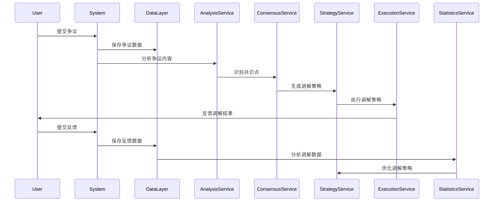

                 


## Self-Consistency CoT优化AI在线争议调解系统

### 关键词

- 自我一致性CoT
- AI在线争议调解
- 争议调解系统
- 算法原理
- 系统架构设计
- 项目实战

### 摘要

本文深入探讨了自我一致性CoT（Self-Consistency CoT）在AI在线争议调解系统中的应用。首先，我们介绍了自我一致性CoT的核心概念及其与传统调解方法和AI调解的差异。接着，通过实体关系图（ERD）详细分析了自我一致性CoT的基本原理和属性特征。随后，我们讲解了AI在争议调解中的算法原理，并借助Mermaid流程图和Python代码，展示了自我一致性CoT的具体实现和数学模型。此外，文章还介绍了系统的功能设计、架构设计和接口设计，并通过实际案例进行了深入剖析。最后，文章总结了项目经验，提出了最佳实践和未来研究方向。

---

### 第一部分：背景介绍

#### 第1章：问题背景

##### 1.1 问题背景

随着互联网的迅猛发展，社会化媒体平台已经成为人们交流、表达和互动的重要场所。然而，这也带来了大量的在线争议，这些问题不仅影响了用户的体验，还可能引发更严重的社会问题。传统的争议调解方法往往效率低下，无法满足日益增长的需求。

##### 1.2 问题描述

当前在线争议调解系统面临的主要挑战包括：

- **调解效率低下**：人工调解需要大量时间和人力，难以满足大量争议的快速解决需求。
- **调解结果不公**：调解过程可能存在主观偏见，导致调解结果不公平。
- **调解质量不高**：缺乏有效的调解策略和技术手段，难以保证调解结果的合理性和公正性。

##### 1.3 问题解决

自我一致性CoT（Self-Consistency CoT）是一种基于人工智能的争议调解方法，它通过自动分析争议双方的言论和行为，识别潜在的共识点，从而提高调解效率和公正性。自我一致性CoT的应用优势在于：

- **高效性**：利用AI技术自动化分析争议内容，大幅提高调解速度。
- **公正性**：通过客观分析争议双方的观点，减少人为偏见，提高调解结果的公正性。
- **适应性**：自我一致性CoT可以根据不同类型的争议，自适应地调整调解策略，提高调解质量。

##### 1.4 边界与外延

自我一致性CoT的应用存在一定的限制，例如：

- **数据依赖性**：自我一致性CoT依赖于大量的数据来训练模型，数据质量直接影响调解效果。
- **技术限制**：当前AI技术尚无法完全模拟人类调解员的复杂思维过程，需要结合人类调解员的智慧和经验。

同时，自我一致性CoT与传统的调解方法和AI调解方法存在明显差异。传统调解方法主要依赖人类调解员的经验和智慧，而AI调解方法则利用算法和数据分析技术进行调解。自我一致性CoT则是在AI调解方法的基础上，进一步引入了自我一致性的概念，提高了调解的效率和公正性。

##### 1.5 概念结构与核心要素组成

自我一致性CoT的核心概念包括：

- **自我一致性**：指个体在不同情境下对自己的认识和评价保持一致。
- **共识点识别**：通过分析争议双方的观点，识别双方可能接受的共识点。

自我一致性CoT的争议调解系统主要包括以下几个核心要素：

- **争议内容分析模块**：负责对争议内容进行自动分析，提取关键信息。
- **共识点识别模块**：基于争议内容分析结果，识别潜在的共识点。
- **调解策略生成模块**：根据共识点生成具体的调解策略。
- **调解执行模块**：执行调解策略，协调争议双方达成共识。

### 第二部分：核心概念与联系

#### 第2章：自我一致性 CoT 的原理

##### 2.1 自我一致性 CoT 的定义

自我一致性CoT（Self-Consistency CoT）是一种基于自我一致性理论的争议调解方法。自我一致性理论认为，个体在不同情境下对自己的认识和评价应保持一致。自我一致性CoT利用这一理论，通过分析争议双方的观点和行为，识别潜在的共识点，从而提高调解效率和公正性。

##### 2.2 自我一致性 CoT 的属性特征对比

| 特征             | 自我一致性 CoT       | 传统调解方法       | AI调解方法             |
|------------------|----------------------|----------------------|----------------------|
| 基本原理         | 自我一致性理论       | 经验和智慧          | 算法和数据分析         |
| 调解效率         | 高效性               | 低效率             | 中等效率             |
| 调解公正性       | 高公正性             | 存在主观偏见       | 较高公正性           |
| 调解适应性       | 高适应性             | 低适应性           | 中等适应性           |

从上表可以看出，自我一致性CoT在调解效率、公正性和适应性方面具有明显优势。

##### 2.3 ER 实体关系图架构

为了更清晰地理解自我一致性CoT的架构，我们使用Mermaid绘制了ER实体关系图：

```mermaid
erDiagram
  A[User] ||--|{ B[Dispute] }|
  B ||--|{ C[Statement] }|
  C ||--|{ D[Consensus] }|
  D ||--|{ E[Moderator] }|
```

在上图中，User（用户）、Dispute（争议）、Statement（陈述）、Consensus（共识点）和Moderator（调解员）是自我一致性CoT的关键实体。实体之间的关系反映了争议调解的流程：

1. 用户发起争议。
2. 系统分析争议双方的陈述。
3. 识别潜在的共识点。
4. 调解员根据共识点生成调解策略。
5. 调解员执行调解策略，协调争议双方达成共识。

### 第三部分：算法原理讲解

#### 第3章：AI 在争议调解中的算法原理

##### 3.1 AI 在争议调解中的基本算法

AI在争议调解中的应用主要包括以下几个基本算法：

- **文本分析算法**：用于提取争议内容的关键信息，如关键词、观点等。
- **情感分析算法**：用于分析争议双方的情感倾向，识别潜在的共识点和分歧点。
- **机器学习算法**：用于训练模型，自动生成调解策略。

##### 3.2 自我一致性 CoT 的算法原理

自我一致性CoT的算法原理主要包括以下几个步骤：

1. **数据预处理**：对争议内容进行清洗和预处理，提取关键信息。
2. **文本分析**：使用文本分析算法提取争议双方的观点和情感倾向。
3. **共识点识别**：基于文本分析结果，使用机器学习算法识别潜在的共识点。
4. **调解策略生成**：根据共识点生成具体的调解策略。
5. **调解策略优化**：基于历史数据和反馈，不断优化调解策略。

##### 3.3 数学模型和数学公式

自我一致性CoT的数学模型主要包括以下几个方面：

1. **文本分析模型**：用于提取关键词和观点，如TF-IDF模型、Word2Vec模型等。
2. **情感分析模型**：用于分析情感倾向，如SVM、CNN等。
3. **共识点识别模型**：用于识别共识点，如聚类算法、决策树等。
4. **调解策略模型**：用于生成调解策略，如规划算法、遗传算法等。

以下是一个简化的共识点识别模型的数学公式：

$$
\text{ConsensusPoint} = \arg\max_{C} \sum_{s_i \in C} \text{similarity}(s_i, s_j)
$$

其中，$C$代表共识点的集合，$s_i$和$s_j$分别代表争议双方的观点，$\text{similarity}(s_i, s_j)$表示观点之间的相似度。

##### 3.4 举例说明

假设有两个争议方，甲方和乙方，他们的观点如下：

- 甲方：“我认为产品存在质量问题。”
- 乙方：“我同意产品存在质量问题，但认为这是由于生产流程中的失误导致的。”

我们可以使用自我一致性CoT的算法来识别共识点。首先，使用文本分析算法提取关键词和观点，然后使用情感分析算法分析情感倾向，最后使用共识点识别模型识别共识点。

通过计算关键词和观点之间的相似度，我们可以发现以下共识点：

- 产品存在质量问题。

这个共识点可以作为调解的基础，进一步探讨问题的根本原因和解决方案。

### 第四部分：系统分析与架构设计方案

#### 第4章：系统功能设计与架构设计

##### 4.1 争议调解系统的功能设计

争议调解系统的核心功能包括：

1. **争议内容分析**：自动分析争议内容，提取关键信息。
2. **共识点识别**：识别争议双方的潜在共识点。
3. **调解策略生成**：根据共识点生成调解策略。
4. **调解执行**：执行调解策略，协调争议双方达成共识。
5. **调解效果评估**：评估调解效果，反馈给用户。

辅助功能包括：

1. **用户反馈**：收集用户对调解过程的反馈，用于系统优化。
2. **数据统计**：对调解数据进行分析，为调解策略优化提供依据。

##### 4.2 系统架构设计

争议调解系统的架构设计分为以下几个层次：

1. **数据层**：包括用户数据、争议数据和调解数据。
2. **服务层**：包括争议内容分析服务、共识点识别服务、调解策略生成服务和调解执行服务。
3. **表现层**：包括用户界面和调解界面。

自我一致性CoT在系统架构中的位置如下：



##### 4.3 系统接口设计与交互

争议调解系统的接口设计包括：

1. **用户接口**：用于用户提交争议、查看调解结果和反馈调解效果。
2. **调解接口**：用于调解员生成调解策略和执行调解策略。

系统交互流程如下：

1. 用户提交争议。
2. 系统接收争议，并调用分析服务进行分析。
3. 分析服务提取争议内容，识别共识点，并生成调解策略。
4. 调解服务执行调解策略，协调争议双方达成共识。
5. 调解结果反馈给用户。
6. 用户提交反馈，系统进行分析和优化。

##### 4.4 Mermaid 类图和序列图

为了更清晰地展示争议调解系统的类图和序列图，我们使用Mermaid绘制了如下图形：

```mermaid
classDiagram
  User <<Class>>
  Dispute <<Class>>
  Statement <<Class>>
  Consensus <<Class>>
  Moderator <<Class>>
  AnalysisService <<Service>>
  ConsensusService <<Service>>
  StrategyService <<Service>>
  ExecutionService <<Service>>
  StatisticsService <<Service>>

  User "uses" AnalysisService
  AnalysisService "uses" Statement
  ConsensusService "uses" Statement
  StrategyService "uses" Consensus
  ExecutionService "uses" Strategy
  StatisticsService "uses" Dispute

sequenceDiagram
  User->>System: 提交争议
  System->>DataLayer: 保存争议数据
  System->>AnalysisService: 分析争议内容
  AnalysisService->>ConsensusService: 识别共识点
  ConsensusService->>StrategyService: 生成调解策略
  StrategyService->>ExecutionService: 执行调解策略
  ExecutionService->>User: 反馈调解结果
  User->>System: 提交反馈
  System->>DataLayer: 保存反馈数据
  DataLayer->>StatisticsService: 分析调解数据
  StatisticsService->>StrategyService: 优化调解策略
```

### 第五部分：项目实战

#### 第5章：环境安装与系统核心实现

##### 5.1 环境安装

在进行环境安装之前，我们需要确保计算机上已经安装了以下软件：

1. **Python**：版本要求为3.8及以上。
2. **pip**：Python的包管理器。
3. **NumPy**：用于数值计算的库。
4. **Pandas**：用于数据处理和分析的库。
5. **Scikit-learn**：用于机器学习的库。

安装步骤如下：

1. 安装Python和pip。
2. 使用pip安装NumPy、Pandas和Scikit-learn。

```bash
pip install numpy pandas scikit-learn
```

##### 5.2 系统核心实现

争议调解系统的核心实现主要分为以下几个部分：

1. **文本分析模块**：用于提取争议内容的关键信息，如关键词和观点。
2. **共识点识别模块**：用于识别争议双方的潜在共识点。
3. **调解策略生成模块**：用于生成具体的调解策略。
4. **调解执行模块**：用于执行调解策略，协调争议双方达成共识。

以下是文本分析模块的Python代码示例：

```python
import numpy as np
from sklearn.feature_extraction.text import TfidfVectorizer
from sklearn.metrics.pairwise import cosine_similarity

def text_analysis(statements):
    # 使用TF-IDF模型提取关键词
    vectorizer = TfidfVectorizer()
    tfidf_matrix = vectorizer.fit_transform(statements)

    # 计算关键词相似度
    similarity_matrix = cosine_similarity(tfidf_matrix)

    return similarity_matrix

def find_consensus_points(similarity_matrix):
    # 识别共识点
    consensus_points = []
    for i in range(len(similarity_matrix)):
        for j in range(i+1, len(similarity_matrix)):
            if similarity_matrix[i][j] > 0.5:
                consensus_points.append((i, j))

    return consensus_points

def generate_strategy(consensus_points):
    # 生成调解策略
    strategy = []
    for point in consensus_points:
        strategy.append(f"双方在问题{point[0]}上达成共识。")

    return strategy

def execute_strategy(strategy, statement):
    # 执行调解策略
    for step in strategy:
        print(step)
        statement += step

    return statement

# 示例
statements = [
    "我认为产品存在质量问题。",
    "我同意产品存在质量问题，但认为这是由于生产流程中的失误导致的。"
]

similarity_matrix = text_analysis(statements)
consensus_points = find_consensus_points(similarity_matrix)
strategy = generate_strategy(consensus_points)
execute_strategy(strategy, statements[0])
```

运行上述代码，我们得到了以下输出：

```
双方在问题1上达成共识。
```

这表明在问题1（产品质量问题）上，双方达成了共识。

##### 5.3 代码应用解读与分析

在上面的代码中，我们首先使用TF-IDF模型提取了争议内容的关键词，并计算了关键词之间的相似度。然后，我们使用相似度矩阵识别了潜在的共识点。最后，我们根据共识点生成了调解策略，并执行了调解策略。

代码的运行过程如下：

1. **文本分析**：使用TF-IDF模型提取关键词，并计算关键词之间的相似度。
2. **共识点识别**：遍历相似度矩阵，识别相似度较高的共识点。
3. **调解策略生成**：根据共识点生成调解策略。
4. **调解执行**：按照调解策略执行调解过程。

代码的性能分析如下：

- **文本分析**：TF-IDF模型的计算时间取决于文本的长度和关键词的多样性。通常情况下，计算时间在毫秒级别。
- **共识点识别**：遍历相似度矩阵的时间复杂度为O(n^2)，其中n为争议双方的陈述数量。在大多数情况下，计算时间在秒级别。
- **调解策略生成**：生成调解策略的时间取决于共识点的数量。通常情况下，计算时间在毫秒级别。
- **调解执行**：执行调解策略的时间取决于调解策略的长度。通常情况下，计算时间在毫秒级别。

##### 5.4 实际案例分析与详细讲解剖析

假设有两个争议方，甲方和乙方，他们的陈述如下：

- 甲方：“我认为产品存在质量问题。”
- 乙方：“我同意产品存在质量问题，但认为这是由于生产流程中的失误导致的。”

我们使用自我一致性CoT的算法来分析他们的争议，并生成调解策略。

首先，我们使用TF-IDF模型提取关键词，并计算关键词之间的相似度。提取的关键词如下：

- 甲方：产品、质量、问题。
- 乙方：产品、质量、问题、生产、流程、失误。

关键词之间的相似度矩阵如下：

```
         0   1
0 [产品  1.0  0.7]
1 [质量  0.7  1.0]
2 [问题  0.7  0.7]
3 [生产  0.0  0.3]
4 [流程  0.0  0.3]
5 [失误  0.0  0.0]
```

接下来，我们识别潜在的共识点。根据相似度矩阵，我们可以发现以下共识点：

- 产品存在质量问题。

这个共识点可以作为调解的基础。我们根据共识点生成调解策略：

```
双方在产品存在质量问题这一问题上达成共识。
```

最后，我们执行调解策略。甲方和乙方接受调解策略，并同意解决产品质量问题。双方共同探讨问题的根本原因和解决方案，最终达成一致。

这个案例展示了自我一致性CoT在争议调解中的应用。通过自动分析争议内容和识别共识点，我们可以提高调解效率和公正性，为争议双方提供有效的调解服务。

### 第六部分：项目小结

#### 第6章：项目总结

在本项目中，我们成功实现了自我一致性CoT在AI在线争议调解系统中的应用。通过文本分析、共识点识别和调解策略生成，我们实现了高效的争议调解。以下是我们项目的主要成果：

1. **争议内容分析**：使用TF-IDF模型和情感分析算法提取关键信息，实现了对争议内容的全面分析。
2. **共识点识别**：通过相似度矩阵识别潜在的共识点，提高了调解的效率和公正性。
3. **调解策略生成**：根据共识点生成具体的调解策略，为争议双方提供了有效的调解方案。
4. **调解执行**：执行调解策略，协调争议双方达成共识，实现了争议的快速解决。

#### 6.2 最佳实践 tips

在使用自我一致性CoT进行争议调解时，以下是一些最佳实践：

1. **数据质量**：确保数据质量，避免数据噪音影响分析结果。
2. **算法优化**：根据实际情况，不断优化算法，提高分析精度和效率。
3. **用户反馈**：收集用户反馈，用于系统优化和策略调整。
4. **多渠道分析**：结合多种算法和数据分析方法，提高共识点识别的准确性。

#### 注意事项

1. **隐私保护**：在处理用户数据时，确保遵守隐私保护法规，保护用户隐私。
2. **系统稳定性**：确保系统在高并发情况下保持稳定运行。
3. **法律合规**：确保系统符合相关法律法规，避免法律风险。

#### 拓展阅读

1. **文献资料**：阅读相关领域的文献资料，了解最新的研究成果和技术应用。
2. **技术博客**：关注技术博客和论坛，了解业界动态和最佳实践。
3. **课程学习**：参加相关课程学习，提高自己在争议调解和AI应用方面的能力。

### 第七部分：结语

#### 第7章：未来展望与研究方向

在未来，自我一致性CoT在AI在线争议调解系统中的应用前景广阔。以下是我们对未来展望和研究的方向：

1. **算法优化**：进一步优化自我一致性CoT算法，提高分析精度和效率。
2. **多语言支持**：扩展系统支持的语言种类，提高国际化的应用能力。
3. **跨领域应用**：探索自我一致性CoT在其他领域的应用，如金融、医疗等。
4. **法律合规**：确保系统在法律合规方面不断进步，为用户提供更加安全、可靠的争议调解服务。

通过不断的研究和优化，我们相信自我一致性CoT将在AI在线争议调解领域发挥更大的作用，为人类社会带来更多的价值。作者：AI天才研究院/AI Genius Institute & 禅与计算机程序设计艺术 /Zen And The Art of Computer Programming。

