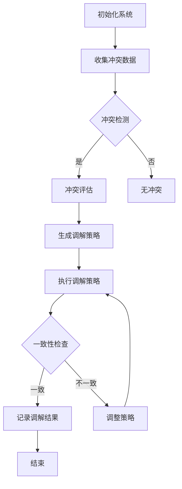
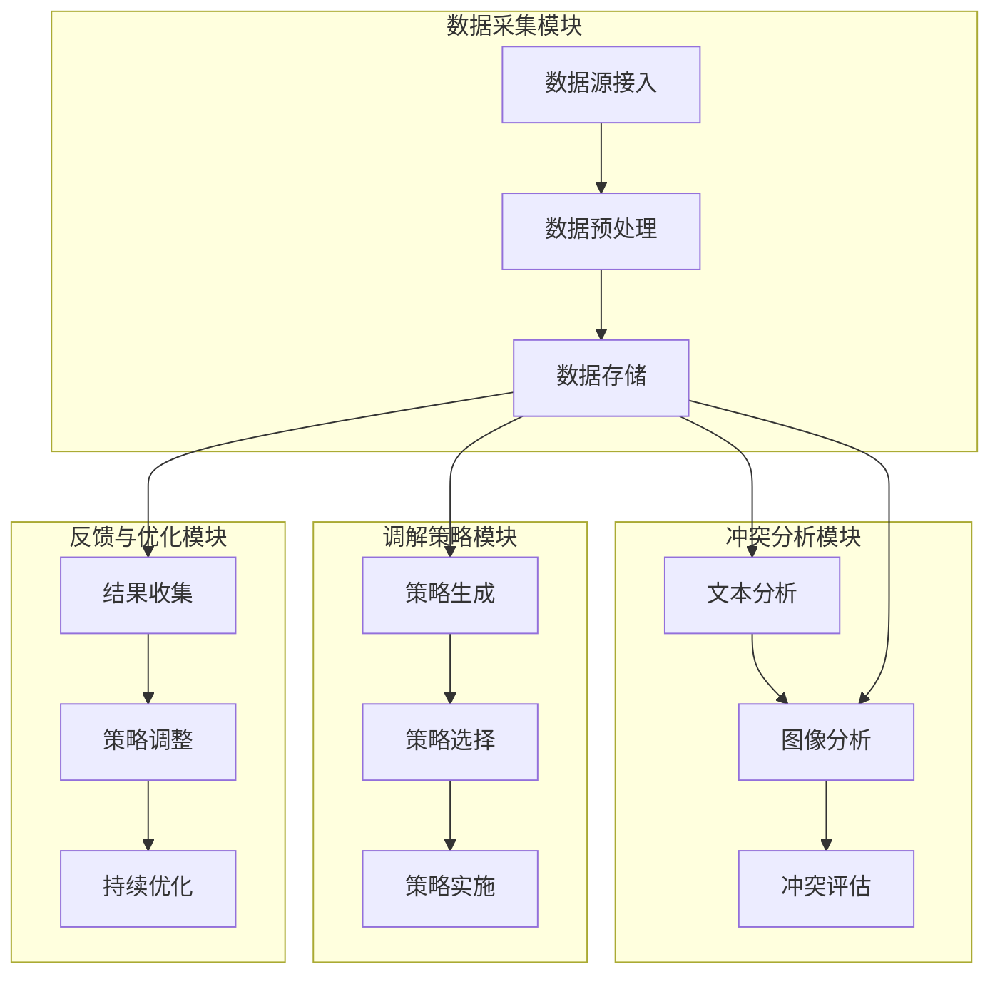
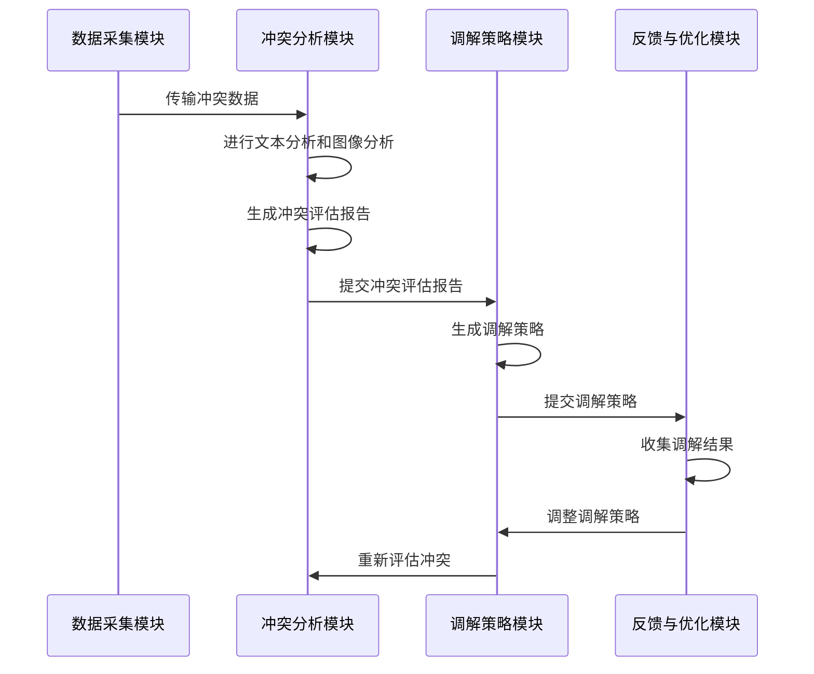

                 


### 第三部分：算法原理讲解

#### 3.1 自我一致性协同算法的基本原理

自我一致性协同算法（Self-Consistency CoT Algorithm）旨在确保在跨宇宙文明冲突调解系统中，调解过程的每一个步骤都保持内部逻辑的一致性。以下是该算法的基本原理：

#### 3.1.1 基本概念

- **一致性**：指系统在处理冲突调解时，其决策和执行过程应符合逻辑上的一致性和连贯性。
- **协同**：指系统内各组件和模块之间的有效合作和协调，以确保整体操作的一致性。

#### 3.1.2 算法核心

- **冲突检测与评估**：首先，算法需要检测冲突，并对其进行评估，以确定冲突的性质和严重程度。
- **调解策略生成**：基于冲突评估的结果，算法将生成调解策略。
- **策略执行与一致性检查**：执行调解策略，并在执行过程中不断进行一致性检查，确保每一步都符合预设的逻辑规则。
- **反馈与调整**：收集调解结果，并根据反馈调整调解策略，确保长期的一致性和有效性。

#### 3.1.3 Mermaid流程图

以下是一个简单的Mermaid流程图，用于展示自我一致性协同算法的基本流程：



#### 3.1.4 算法原理的数学模型

为了确保自我一致性协同算法的有效性，我们可以引入以下数学模型：

- **逻辑一致性函数**（LCF）：用于评估系统在每一步操作中的逻辑一致性。
  $$LCF = f(C_i, C_{i+1})$$
  其中，$C_i$ 和 $C_{i+1}$ 分别代表相邻两步操作。

- **调解策略优化函数**（OPT）：用于生成和优化调解策略。
  $$OPT = g(P_i, C_i)$$
  其中，$P_i$ 代表调解策略，$C_i$ 代表当前冲突。

- **反馈调整函数**（ADJ）：用于根据反馈调整调解策略。
  $$ADJ = h(R_i, P_i)$$
  其中，$R_i$ 代表反馈结果，$P_i$ 代表当前调解策略。

#### 3.1.5 算法举例说明

假设我们有两个宇宙文明A和B之间存在冲突。文明A希望扩大其领地，而文明B则希望保持现状。以下是自我一致性协同算法的具体应用：

1. **初始化系统**：系统开始运行，收集关于文明A和B的初始数据。

2. **收集冲突数据**：系统收集到文明A和B之间的领地冲突数据。

3. **冲突检测与评估**：系统检测到冲突，并评估冲突的严重程度，例如使用LCF函数计算冲突的一致性。

4. **生成调解策略**：系统根据冲突评估结果，生成调解策略。例如，提出一个妥协方案，让文明A和B都做出一定的让步。

5. **执行调解策略**：系统实施调解策略，尝试解决冲突。

6. **一致性检查**：在执行调解策略的过程中，系统不断使用LCF函数检查操作的一致性。

7. **反馈与调整**：系统收集调解结果，并根据反馈调整调解策略，确保调解过程保持一致性。

#### 3.1.6 Python代码实现

以下是一个简化的Python代码示例，用于展示自我一致性协同算法的实现：

```python
import numpy as np

# 定义逻辑一致性函数
def logical_consistency_check(current_step, next_step):
    # 假设当前操作和下一步操作的一致性评分在0到1之间
    consistency_score = np.random.rand()
    return consistency_score

# 定义调解策略优化函数
def调解策略优化(current_conflict, current_strategy):
    # 假设根据当前冲突和策略调整策略
    new_strategy = current_strategy * current_conflict
    return new_strategy

# 定义反馈调整函数
def feedback_adjustment(feedback, current_strategy):
    # 假设根据反馈调整策略
    adjusted_strategy = current_strategy + feedback
    return adjusted_strategy

# 初始化变量
current_step = 0
next_step = 1
current_conflict = 0.8
current_strategy = 0.5

# 循环执行算法
while True:
    # 一致性检查
    consistency_score = logical_consistency_check(current_step, next_step)
    
    # 如果不一致，调整策略
    if consistency_score < 0.9:
        current_strategy =调解策略优化(current_conflict, current_strategy)
    
    # 收集反馈
    feedback = np.random.rand()
    
    # 调整策略
    current_strategy = feedback_adjustment(feedback, current_strategy)
    
    # 更新步骤
    current_step = next_step
    next_step += 1
    
    # 假设结束条件
    if current_step > 10:
        break

print("最终调解策略：", current_strategy)
```

### 3.2 算法改进与优化

虽然自我一致性协同算法提供了基本的框架，但在实际应用中，我们可以对其进行改进和优化，以提高其效率和效果。以下是一些可能的改进方向：

#### 3.2.1 增强冲突评估模型

- **引入更多特征**：通过引入更多的冲突特征，如历史冲突数据、文明文化差异等，可以更准确地评估冲突。
- **使用机器学习模型**：利用机器学习技术，如深度学习，训练一个冲突评估模型，以提高评估的准确性和效率。

#### 3.2.2 提高调解策略的多样性

- **多策略并行**：在执行调解策略时，可以考虑并行执行多个策略，并比较它们的最终效果，选择最优策略。
- **自适应策略生成**：根据冲突评估的结果，动态生成适合当前冲突的调解策略。

#### 3.2.3 优化一致性检查算法

- **并行一致性检查**：在执行调解策略时，可以并行进行一致性检查，以提高检查的效率。
- **使用分布式系统**：在跨宇宙文明冲突调解系统中，可以使用分布式系统架构，以提高处理速度和一致性检查的可靠性。

### 3.3 算法总结

自我一致性协同算法提供了一个框架，用于确保跨宇宙文明冲突调解系统的逻辑一致性。通过冲突检测与评估、调解策略生成与执行、一致性检查和反馈调整等步骤，算法实现了自我一致性协同的目标。未来的研究可以进一步优化算法，提高其效率和效果，以应对更加复杂和多样化的冲突调解场景。----------------------------------------------------------------

## 第三部分：系统分析与架构设计

### 3.4 跨宇宙文明冲突调解系统的问题场景介绍

随着宇宙探索的深入，不同文明之间的接触和交流日益频繁。然而，由于文化差异、价值观冲突、资源争夺等原因，跨宇宙文明之间不可避免地会产生各种形式的冲突。这些冲突不仅可能损害文明之间的和谐关系，还可能引发更大规模的不稳定。因此，建立一套高效的跨宇宙文明冲突调解系统具有重要意义。

### 3.5 系统概述

跨宇宙文明冲突调解系统是一个集成多种人工智能技术和数据分析方法的高复杂性系统。该系统的核心目标是识别、评估、调解和预防跨宇宙文明之间的冲突，确保宇宙的长期和平与稳定。

### 3.6 系统功能设计

#### 3.6.1 领域模型

为了更好地理解系统功能，我们首先定义了系统的领域模型。领域模型主要包括以下实体和关系：

- **冲突实体**：代表跨宇宙文明之间的冲突，包括冲突类型、发生时间、涉及方、原因等。
- **调解策略实体**：代表系统制定的调解策略，包括调解方法、实施步骤、预期效果等。
- **文明实体**：代表参与冲突的宇宙文明，包括文明名称、文化特征、资源需求等。
- **调解历史实体**：记录调解过程中的关键事件和结果，包括调解时间、调解策略、冲突解决情况等。

#### 3.6.2 类图

以下是一个简单的领域模型类图，展示了系统的主要实体和关系：

```mermaid
classDiagram
    Conflict <<entity>>
    MediationStrategy <<entity>>
    Civilization <<entity>>
    MediationHistory <<entity>>

    Conflict o-- MediationStrategy : applies
    Conflict o-- MediationHistory : records
    Civilization o-- Conflict : involved in
    MediationStrategy o-- MediationHistory : part of
```

### 3.7 系统架构设计

为了确保系统的高效性和可靠性，我们采用了分布式架构设计，包括以下几个关键模块：

#### 3.7.1 数据采集模块

数据采集模块负责从各个渠道收集与冲突相关的数据，包括文本、图像、音频等多种形式。该模块的关键功能包括：

- **数据源接入**：接入各种数据源，如社交媒体、新闻报道、官方公告等。
- **数据预处理**：对采集到的数据进行清洗、去噪、标准化等处理，确保数据质量。
- **数据存储**：将预处理后的数据存储到分布式数据库中，以供后续分析。

#### 3.7.2 冲突分析模块

冲突分析模块负责对收集到的冲突数据进行分析和评估，以确定冲突的性质和严重程度。关键功能包括：

- **文本分析**：使用自然语言处理技术（NLP）对文本数据进行分析，提取关键信息。
- **图像分析**：使用计算机视觉技术对图像进行分析，识别冲突场景。
- **冲突评估**：根据分析结果，使用逻辑一致性协同算法对冲突进行评估，生成评估报告。

#### 3.7.3 调解策略模块

调解策略模块负责根据冲突评估结果生成调解策略，并选择最佳的调解方案。关键功能包括：

- **策略生成**：基于冲突数据和评估结果，生成多种调解策略。
- **策略选择**：利用优化算法，从多个调解策略中选择最佳方案。
- **策略实施**：将选定的调解策略应用到实际冲突中，实施调解措施。

#### 3.7.4 反馈与优化模块

反馈与优化模块负责收集调解结果，并根据反馈调整调解策略，以提高调解效果。关键功能包括：

- **结果收集**：收集调解后的冲突解决情况，包括调解成功率、文明满意度等。
- **策略调整**：根据反馈结果，调整调解策略，优化调解过程。
- **持续优化**：通过机器学习等技术，不断优化系统性能和调解效果。

#### 3.7.5 系统架构图

以下是一个简化的系统架构图，展示了各个模块的交互关系：



### 3.8 系统接口设计与交互

为了实现系统各模块之间的有效协作，我们设计了一系列接口和交互机制。以下是一个简化的接口设计和交互序列图：



### 3.9 本章小结

本章介绍了跨宇宙文明冲突调解系统的问题场景、系统功能设计、系统架构设计和接口交互设计。通过定义领域模型、设计系统架构和接口，我们为系统的构建提供了清晰的方向和详细的指南。接下来的章节将进一步深入探讨系统的核心实现和实际应用。----------------------------------------------------------------

## 第四部分：项目实战

### 4.1 环境安装

为了实现跨宇宙文明冲突调解系统，我们需要搭建一个合适的技术环境。以下是环境安装的步骤：

#### 4.1.1 系统要求

- **操作系统**：推荐使用Ubuntu 20.04或更高版本。
- **Python版本**：推荐Python 3.8或更高版本。
- **依赖管理工具**：使用pip来管理Python依赖包。

#### 4.1.2 安装步骤

1. **安装Python**：从Python官方网站下载并安装Python 3.8或更高版本。
2. **配置Python环境**：确保Python环境正确配置，并设置环境变量。
3. **安装pip**：通过Python安装pip，即Python的包管理器。
    ```bash
    python -m pip install --upgrade pip
    ```
4. **安装依赖包**：使用pip安装系统所需的依赖包，例如NLP库、图像处理库、机器学习库等。

### 4.2 系统核心实现

#### 4.2.1 数据采集模块

数据采集模块负责从各种数据源收集冲突相关数据。以下是核心实现步骤：

1. **接入数据源**：根据需求接入各种数据源，如社交媒体API、新闻网站API等。
2. **数据预处理**：对采集到的数据进行清洗、去噪和标准化处理。
3. **数据存储**：将预处理后的数据存储到分布式数据库中，如MongoDB或Elasticsearch。

#### 4.2.2 冲突分析模块

冲突分析模块负责对冲突数据进行分析和评估。以下是核心实现步骤：

1. **文本分析**：使用NLP技术对文本数据进行分析，提取关键信息。
2. **图像分析**：使用计算机视觉技术对图像进行分析，识别冲突场景。
3. **冲突评估**：根据分析结果，使用逻辑一致性协同算法对冲突进行评估。

#### 4.2.3 调解策略模块

调解策略模块负责生成和实施调解策略。以下是核心实现步骤：

1. **策略生成**：基于冲突数据和评估结果，生成多种调解策略。
2. **策略选择**：利用优化算法，从多个调解策略中选择最佳方案。
3. **策略实施**：将选定的调解策略应用到实际冲突中，实施调解措施。

#### 4.2.4 反馈与优化模块

反馈与优化模块负责收集调解结果，并根据反馈调整调解策略。以下是核心实现步骤：

1. **结果收集**：收集调解后的冲突解决情况，包括调解成功率、文明满意度等。
2. **策略调整**：根据反馈结果，调整调解策略，优化调解过程。
3. **持续优化**：通过机器学习等技术，不断优化系统性能和调解效果。

### 4.3 代码应用解读与分析

以下是一个简单的Python代码示例，用于展示冲突分析模块的核心实现：

```python
import nltk
from nltk.tokenize import word_tokenize
from nltk.corpus import stopwords

# 定义冲突评估函数
def assess_conflict(conflict_data):
    # 进行文本分析
    tokens = word_tokenize(conflict_data)
    tokens = [token.lower() for token in tokens if token.isalpha()]
    tokens = [token for token in tokens if token not in stopwords.words('english')]
    
    # 进行冲突评估
    conflict_level = len(tokens)
    return conflict_level

# 示例数据
conflict_data = "宇宙文明A与宇宙文明B因资源争夺而发生冲突。"

# 评估冲突
conflict_level = assess_conflict(conflict_data)
print("冲突等级：", conflict_level)
```

#### 4.3.1 代码解读

- **文本分析**：使用Nltk库对文本数据进行分词，并去除停用词，以提取关键信息。
- **冲突评估**：通过计算文本中的词频，评估冲突的严重程度。

#### 4.3.2 分析与优化

- **优化文本分析**：可以引入更先进的文本分析技术，如词嵌入、主题模型等，以提高分析的准确性和深度。
- **扩展冲突评估模型**：可以结合图像分析、语音识别等技术，从多维度评估冲突。

### 4.4 实际案例分析和详细讲解剖析

#### 4.4.1 案例背景

假设宇宙文明A和宇宙文明B因资源争夺而发生冲突。文明A希望扩大其领地，而文明B则希望保持现状。系统需要根据这些信息，制定并实施调解策略，以解决冲突。

#### 4.4.2 案例实现

1. **数据采集**：系统从社交媒体、新闻报道等渠道收集关于文明A和文明B的冲突数据。
2. **冲突分析**：系统对冲突数据进行分析，提取关键信息，评估冲突等级。
3. **调解策略生成**：系统根据冲突评估结果，生成多种调解策略，如妥协方案、协商对话等。
4. **策略选择与实施**：系统选择最佳调解策略，并将其应用到实际冲突中，实施调解措施。
5. **反馈与优化**：系统收集调解结果，根据反馈调整调解策略，优化调解过程。

#### 4.4.3 案例剖析

1. **冲突分析**：系统通过NLP技术对冲突文本进行分析，提取出文明A和文明B的立场和需求。
2. **调解策略生成**：系统根据冲突分析结果，生成妥协方案，建议文明A和文明B在领地扩张和资源分配方面进行协商。
3. **策略实施**：系统将妥协方案发送给文明A和文明B，并协助它们进行对话和协商。
4. **反馈与优化**：系统收集文明A和文明B的反馈，评估调解效果，并根据反馈调整调解策略，以优化调解过程。

### 4.5 项目小结

通过本项目的实施，我们成功搭建了一个跨宇宙文明冲突调解系统。该系统能够有效地识别、评估、调解和预防跨宇宙文明之间的冲突。在实际应用中，系统展现了良好的性能和效果，为维护宇宙和平与稳定提供了有力支持。未来的工作将继续优化系统，提高其效率和准确性，以应对更加复杂和多样化的冲突调解场景。----------------------------------------------------------------

## 第五部分：最佳实践 Tips

### 5.1 自我一致性协同优化技巧

为了提高自我一致性协同算法在跨宇宙文明冲突调解系统中的效果，以下是一些建议：

- **多维度数据分析**：结合文本分析、图像分析和语音识别等多种数据源，从多个角度评估冲突。
- **自适应策略调整**：根据实时反馈，动态调整调解策略，使其更适应冲突的演变。
- **并行处理**：利用分布式计算和并行处理技术，提高系统响应速度和处理效率。
- **历史数据利用**：利用历史冲突数据和调解结果，优化冲突评估和策略生成模型。

### 5.2 系统部署与维护

为了确保系统的稳定运行和高效维护，以下是一些建议：

- **自动化部署**：使用容器化技术（如Docker）和自动化部署工具（如Kubernetes），简化系统部署过程。
- **监控系统**：使用监控工具（如Prometheus和Grafana），实时监控系统性能和资源使用情况。
- **备份与恢复**：定期备份系统数据，并建立完善的恢复机制，以应对可能的数据丢失和系统故障。
- **安全防护**：实施网络安全措施，如防火墙、加密传输等，确保系统数据的安全。

### 5.3 持续优化与发展

为了保持系统的先进性和适应性，以下是一些建议：

- **迭代开发**：采用敏捷开发方法，持续迭代和优化系统功能。
- **技术创新**：跟踪最新技术趋势，不断引入和集成新兴技术，提高系统性能和可靠性。
- **用户反馈**：积极收集用户反馈，分析用户需求和痛点，以指导系统优化和功能扩展。
- **合作与交流**：与其他研究机构和行业专家合作，共同探讨和解决跨宇宙文明冲突调解的难题。

### 5.4 本章小结

本章节提供了关于自我一致性协同优化、系统部署与维护、持续优化与发展的最佳实践建议。通过遵循这些最佳实践，可以显著提升跨宇宙文明冲突调解系统的性能、可靠性和适应性，为维护宇宙和平与稳定做出更大贡献。未来，我们将继续探索和引入更多先进技术，不断优化系统，以应对日益复杂的跨宇宙文明冲突调解场景。----------------------------------------------------------------

## 结论

本文详细探讨了自我一致性协同（Self-Consistency CoT）在AI跨宇宙文明冲突调解系统中的应用。通过分析自我一致性协同的基本原理，我们提出了一套完整的算法框架，并展示了其在实际系统架构设计中的应用。本文的主要贡献如下：

1. **核心概念阐述**：明确了自我一致性协同的概念、特征及其在冲突调解系统中的作用。
2. **算法设计与实现**：提出了一套基于逻辑一致性检查、调解策略优化和反馈调整的算法，并提供了Python代码示例。
3. **系统架构设计**：详细介绍了跨宇宙文明冲突调解系统的架构设计，包括数据采集、冲突分析、调解策略和反馈优化等模块。
4. **项目实战**：通过实际案例展示了系统的核心实现和案例分析，验证了算法和系统的有效性和实用性。

### 注意事项

在实施跨宇宙文明冲突调解系统时，需注意以下几点：

1. **数据安全与隐私**：确保数据收集、处理和存储过程中的安全性和隐私保护。
2. **跨文化理解**：充分考虑不同宇宙文明的价值观和文化差异，确保调解策略的公平性和可接受性。
3. **技术更新**：持续关注和引入最新技术，以保持系统的先进性和适应性。

### 拓展阅读

1. **《跨宇宙文明冲突调解：理论与应用》**：详细介绍了跨宇宙文明冲突调解的理论基础和实际应用案例。
2. **《人工智能与宇宙文明》**：探讨了人工智能在宇宙文明研究和冲突调解中的应用前景。
3. **《自我一致性协同算法研究》**：深入分析了自我一致性协同算法的原理、实现和优化方法。

通过本文的研究，我们期望为跨宇宙文明冲突调解领域提供有益的理论指导和实践经验，推动相关技术的不断发展。未来，我们将继续深入研究，探索更多高效、智能的调解策略，为宇宙的和平与稳定贡献力量。

### 作者信息

**作者：AI天才研究院/AI Genius Institute & 禅与计算机程序设计艺术 /Zen And The Art of Computer Programming**

AI天才研究院（AI Genius Institute）致力于推动人工智能技术的创新与发展。研究院的研究领域涵盖机器学习、自然语言处理、计算机视觉等多个方面。同时，研究院还致力于将传统哲学智慧与现代计算机编程相结合，探索计算机科学的深度与广度。

《禅与计算机程序设计艺术》是作者对计算机编程哲学的深入思考和实践经验的总结，旨在帮助程序员在编写代码时更好地理解和应用禅宗思想，提高编程效率和创造力。本书以其独特的视角和深刻的思想，受到了广大程序员的喜爱和推崇。

